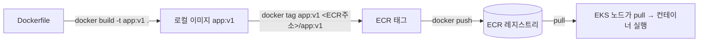

# Docker 기초 (선수 학습, 약 2시간)

> 문서 유형: explanation

## ① 학습 목표

- [ ] 이미지/컨테이너/레지스트리의 관계를 설명할 수 있다
- [ ] Dockerfile의 FROM/COPY/RUN/ENV/ENTRYPOINT를 읽고 쓸 수 있다
- [ ] build → tag → push 흐름을 명령으로 실행할 수 있다
- [ ] ECR 레포 생성·로그인·push를 해봤다

## ② 핵심 개념

| 용어 | 한 줄 정의 |
|---|---|
| 이미지 | 실행 환경의 스냅샷 (읽기 전용, 레이어 구조) |
| 컨테이너 | 이미지를 실행한 프로세스 (이미지 1개 → 컨테이너 N개) |
| 레지스트리 | 이미지 저장소 (Docker Hub, **ECR**) |
| 태그 | 이미지 버전 라벨 (`repo:v1`, 생략 시 `latest`) |

Dockerfile 핵심 명령:

```dockerfile
FROM python:3.12-slim        # 베이스 이미지 — 무엇 위에 쌓을지
COPY app.py /app/app.py     # 로컬 파일을 이미지 안으로
RUN pip install flask        # 빌드 시점에 실행 (레이어 생성)
ENV PORT=8080                # 환경 변수
ENTRYPOINT ["python", "/app/app.py"]  # 컨테이너 시작 시 실행할 명령
```

- `RUN`은 **빌드할 때**, `ENTRYPOINT`/`CMD`는 **실행할 때** 동작 — 가장 흔한 혼동.
- 베이스 이미지는 작을수록 좋다: `slim`/`alpine` 계열 우선.



push 3단계 암기: **build → tag(레지스트리 주소 포함) → push**. tag 없이 push하면 Docker Hub로 가려다 실패한다.

## ③ 대회에서 어떻게 쓰이나

- 대회는 로컬이 아니라 **CloudShell에서 빌드**한다. CloudShell은 디스크가 작고 세션이 초기화되므로 빌드가 빠르고 이미지가 작아야 한다.
- **베이스 이미지 선택이 채점을 좌우한다**: 과제가 지정한 베이스(예: 특정 태그)를 안 쓰면 감점, 큰 이미지는 pull 지연으로 헬스체크 채점에 늦는다.
- 이 내용은 **PART-1 모듈 03(컨테이너 빌드·ECR)** 의 기반이다.

## ④ 미니 실습 (30분)

> ⚠️ ECR은 저장 용량 과금(소액). 실습 끝나면 레포까지 삭제한다. Docker Desktop(또는 CloudShell) 필요.

1. hello 이미지 만들기:

```bash
mkdir hello && cd hello
cat > Dockerfile <<'EOF'
FROM alpine:3.20
ENTRYPOINT ["echo", "hello skills"]
EOF
docker build -t hello:v1 .
docker run --rm hello:v1     # "hello skills" 출력 확인
```

2. ECR push (리전 `ap-northeast-2`, `<ACCOUNT_ID>`는 본인 계정):

```bash
aws ecr create-repository --repository-name hello
aws ecr get-login-password | docker login --username AWS \
  --password-stdin <ACCOUNT_ID>.dkr.ecr.ap-northeast-2.amazonaws.com
docker tag hello:v1 <ACCOUNT_ID>.dkr.ecr.ap-northeast-2.amazonaws.com/hello:v1
docker push <ACCOUNT_ID>.dkr.ecr.ap-northeast-2.amazonaws.com/hello:v1
```

3. 콘솔에서 ECR 레포에 이미지가 보이는지 확인.
4. **즉시 삭제**:

```bash
aws ecr delete-repository --repository-name hello --force
```

## ⑤ 자기 점검 퀴즈

1. `RUN pip install flask`와 `ENTRYPOINT ["python", "app.py"]`는 각각 언제 실행되나?
2. 로컬 이미지 `app:v1`을 ECR에 올리기 위한 3개 명령의 순서는?
3. 대회에서 베이스 이미지를 크게 잡으면 생기는 실질적 불이익 2가지는?

<details><summary>정답</summary>

1. RUN은 이미지 빌드 시점, ENTRYPOINT는 컨테이너 시작 시점.
2. `docker build` → `docker tag` (ECR 주소로) → `docker push`. (push 전 `docker login` 필요)
3. ① CloudShell의 작은 디스크·느린 빌드로 시간 소모 ② 노드 pull 지연으로 파드 기동·헬스체크 채점 지연/실패.

</details>

## ⑥ 다음 단계

- [../PART-1-Foundation-IaC/](../PART-1-Foundation-IaC/) — 모듈 03 컨테이너 빌드·ECR
- 다음 선수 학습: [shell-basics.md](shell-basics.md)
