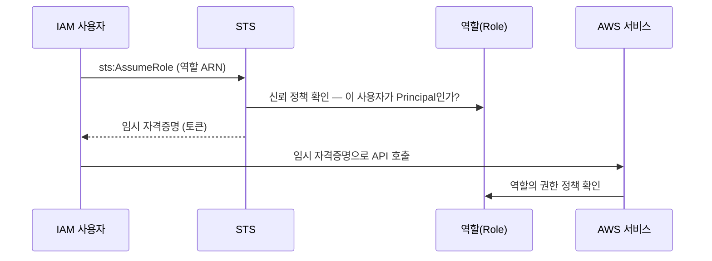

# IAM 기초 (선수 학습, 약 1시간)

> 문서 유형: explanation

## ① 학습 목표

- [ ] 사용자/그룹/역할의 차이를 설명할 수 있다
- [ ] 정책 JSON의 Effect/Action/Resource/Condition 4요소를 읽을 수 있다
- [ ] 신뢰 정책과 권한 정책의 차이, AssumeRole의 흐름을 안다
- [ ] root 상시 사용이 왜 금지인지 대회 관점에서 설명할 수 있다

## ② 핵심 개념

| 용어 | 한 줄 정의 |
|---|---|
| 사용자(User) | 사람/스크립트용 장기 자격증명 (액세스 키) |
| 그룹(Group) | 사용자 묶음. 정책을 그룹에 붙여 일괄 부여 |
| 역할(Role) | **자격증명 없는 신원**. 누군가 AssumeRole로 "빌려 쓰는" 모자. EC2/EKS/Lambda가 AWS를 호출할 때 쓰는 방식 |
| 권한 정책 | 이 신원이 **무엇을 할 수 있나** (Action/Resource) |
| 신뢰 정책 | 이 역할을 **누가 Assume할 수 있나** (역할에만 존재, Principal 포함) |

정책 JSON 해부:

```json
{
  "Version": "2012-10-17",
  "Statement": [{
    "Effect": "Allow",
    "Action": ["s3:GetObject", "s3:ListBucket"],
    "Resource": "arn:aws:s3:::my-bucket/*",
    "Condition": { "StringEquals": { "aws:RequestedRegion": "ap-northeast-2" } }
  }]
}
```

- **Effect**: Allow / Deny (명시적 Deny가 항상 이김)
- **Action**: `서비스:API` 형식, `*` 와일드카드 가능
- **Resource**: 대상 ARN
- **Condition**: 선택. 조건부 허용/거부



**두 정책 다 통과해야 AssumeRole이 성립한다**: 신뢰 정책(문지기) + 호출자의 `sts:AssumeRole` 권한.

## ③ 대회에서 어떻게 쓰이나

- **root 금지 이유**: 대회 유형의 KMS 키 정책은 **root-less** — root를 Principal에서 뺀다. root로 리소스를 만들면 이후 KMS 사용이 전부 거부되어 복구 불가에 가깝다.
- **생성자 = 채점자 신원**: EKS 클러스터를 만든 IAM 신원만 기본 kubectl 접근을 가진다. 채점 스크립트(mark.sh)가 도는 신원과 생성 신원이 다르면 채점 자체가 실패한다. 처음부터 IAM 사용자 하나로 통일하는 습관이 곧 점수다.
- 이 내용은 **PART-3 모듈 08(IAM 심화)** — IRSA, aws-auth, KMS 키 정책 — 의 기반이다.

## ④ 미니 실습 (15분, 과금 없음)

1. 콘솔(root 또는 기존 관리자)에서 IAM 사용자 생성: 이름 `skills-admin`, 정책 `AdministratorAccess` 직접 연결, 액세스 키 발급 (CLI 용도)
2. 로컬에서 자격증명 등록 후 신원 확인:

```bash
aws configure   # 액세스 키, 시크릿, 리전 ap-northeast-2, 출력 json
aws sts get-caller-identity
```

3. 출력의 `Arn`이 `arn:aws:iam::<계정ID>:user/skills-admin`인지 확인 — `root`가 보이면 잘못 설정된 것.
4. 이 사용자를 **앞으로 모든 학습의 단일 신원**으로 사용한다. (삭제하지 않고 유지)

## ⑤ 자기 점검 퀴즈

1. 역할(Role)에만 있고 사용자에게는 없는 정책은 무엇이며, 그 안에 반드시 들어가는 요소는?
2. Allow 정책과 Deny 정책이 같은 Action에 충돌하면 결과는?
3. EKS 클러스터를 root로 생성하면 대회에서 어떤 문제가 생기나? (2가지)

<details><summary>정답</summary>

1. 신뢰 정책. `Principal` (누가 이 역할을 Assume할 수 있는지).
2. 명시적 Deny가 이긴다 (Deny > Allow > 암묵적 Deny).
3. ① root-less KMS 키 정책 아래서 KMS 사용이 전부 거부됨 ② 생성자 신원 ≠ 채점 신원이 되어 kubectl/채점 접근 불가.

</details>

## ⑥ 다음 단계

- [../PART-3-Observability-HardMode/](../PART-3-Observability-HardMode/) — 모듈 08 IAM 심화 (IRSA, KMS 키 정책)
- 다음 선수 학습: [docker-basics.md](docker-basics.md)

## 공식 문서

- [IAM 사용 설명서](https://docs.aws.amazon.com/IAM/latest/UserGuide/) — 사용자·역할·정책 전반
- [정책 평가 로직](https://docs.aws.amazon.com/IAM/latest/UserGuide/reference_policies_evaluation-logic.html) — Deny 우선, 신뢰 정책과의 이중 평가
- [서비스별 액션·리소스·조건 키](https://docs.aws.amazon.com/service-authorization/latest/reference/reference_policies_actions-resources-contextkeys.html) — 정책에 쓸 값의 정본
