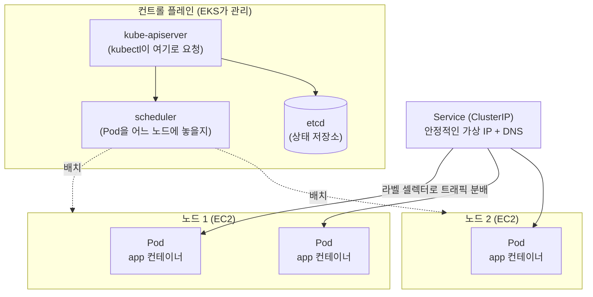
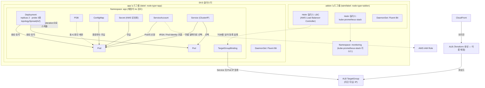

# Kubernetes 기초 (선수 학습, 약 2~3시간)

> 문서 유형: explanation

> eks-study PART-1 Kubernetes Basics의 4개 모듈(core-concepts / services-networking / config-storage / rbac-helm)을 선수 지식 수준으로 압축한 파일이다. 심화는 전부 PART-2에서 EKS로 다룬다.

## ① 학습 목표

- [ ] Pod / ReplicaSet / Deployment / Namespace의 관계를 한 문장씩 설명할 수 있다
- [ ] Service 타입(ClusterIP/NodePort/LoadBalancer)의 차이와 대회에서 ClusterIP만 주로 쓰는 이유를 안다
- [ ] ConfigMap과 Secret의 용도 차이를 안다
- [ ] ServiceAccount가 "Pod의 신원"이라는 개념을 안다 (IRSA는 개념만)
- [ ] `kubectl apply / get / describe / logs / exec / rollout restart`를 쓸 수 있다

## ② 핵심 개념

### 2-1. 클러스터 구조

Kubernetes = **컨트롤 플레인**(두뇌)이 **노드**(작업자, EC2)에 컨테이너를 배치·감시하는 시스템. EKS에서는 AWS가 컨트롤 플레인을 관리하므로 노드와 그 위의 리소스만 다룬다.



### 2-2. 워크로드 4총사 (core-concepts)

| 용어 | 한 줄 정의 |
|---|---|
| Pod | 컨테이너 1개 이상을 묶은 **최소 배포 단위**. IP를 하나 받음. 죽으면 그걸로 끝(스스로 부활 안 함) |
| ReplicaSet | "이 Pod을 N개 유지하라"는 감시자. 죽으면 새로 띄움 |
| Deployment | ReplicaSet을 관리하는 상위 객체. **롤링 업데이트·롤백** 담당. 실무/대회에서 Pod은 거의 항상 Deployment로 만든다 |
| Namespace | 리소스를 담는 논리적 폴더. `kubectl get pod -n <ns>`처럼 항상 ns를 의식해야 함 |

관계: **Deployment → ReplicaSet → Pod** (내가 직접 만지는 건 Deployment뿐).

### 2-3. Service와 네트워킹 (services-networking)

Pod IP는 재시작마다 바뀐다 → **Service**가 고정 가상 IP + DNS 이름을 제공하고, 라벨 셀렉터로 뒤의 Pod들에 트래픽을 분배한다.

| 타입 | 노출 범위 | 대회 사용 |
|---|---|---|
| ClusterIP | 클러스터 내부 전용 (기본값) | ✅ 주력 |
| NodePort | 각 노드의 30000번대 포트로 노출 | 거의 안 씀 |
| LoadBalancer | 클라우드 LB 자동 생성 | 안 씀 (LB는 Terraform으로 만듦) |

- **CoreDNS**: 클러스터 내부 DNS. `<svc>.<ns>.svc.cluster.local`로 서비스 이름을 IP로 풀어 줌.
- **Ingress**: HTTP 라우팅 규칙 객체 — 개념만 알아두면 됨. 대회에서는 안 쓴다(③·④ 참고).

### 2-4. 설정과 저장 (config-storage)

| 용어 | 한 줄 정의 |
|---|---|
| ConfigMap | 평문 설정(환경변수·설정파일)을 Pod에 주입 |
| Secret | 민감 정보용. base64 인코딩일 뿐 **암호화가 아님** — 그래서 EKS에선 KMS로 추가 암호화한다 |
| PV / PVC | PV = 실제 스토리지(EBS 등), PVC = "이만큼 주세요" 요청서. Pod은 PVC를 마운트 |

주입 방법 2가지: 환경변수(`envFrom.configMapRef`) 또는 볼륨 마운트(파일로).

### 2-5. 신원과 패키지 (rbac-helm)

- **ServiceAccount(SA)**: Pod이 쓰는 신원. 사람의 IAM 사용자에 해당하는 "Pod의 명찰".
- **RBAC**: Role(권한 목록) + RoleBinding(누구에게 줄지)으로 SA/사용자의 클러스터 내 권한 제어.
- **Helm**: k8s의 패키지 매니저. `helm install <이름> <차트> --version X.Y.Z`로 복잡한 앱(수십 개 YAML)을 한 번에 설치.

## ③ 대회 실전 아키텍처

②의 개념들이 대회 과제에서 실제로 조립되는 모습 전체를 한 장으로 본다. 지금 전부 이해할 필요는 없다 — **PART-2가 끝나면 이 그림을 안 보고 그릴 수 있어야 한다**는 목표 지점이다.



| 리소스 | 한 줄 역할 |
|---|---|
| Namespace (app / monitoring) | 앱과 모니터링을 분리하는 폴더 — 채점이 ns 단위로 Pod 배치를 검사 |
| Deployment | replicas 2 + probe + nodeSelector/toleration + topologySpread로 앱 Pod 유지·분산 |
| PDB | 노드 교체·업그레이드 시 Pod이 한꺼번에 죽지 않게 최소 가용 수 보장 |
| ConfigMap / Secret | 설정·민감정보를 Pod에 주입 (Secret은 KMS envelope 암호화 대상) |
| ServiceAccount | Pod의 신원 — IRSA/Pod Identity로 AWS IAM Role과 연결 |
| Service (ClusterIP) | 라벨 셀렉터로 Pod들을 묶는 클러스터 내부 고정 접점 |
| TargetGroupBinding | Service 뒤 Pod IP들을 ALB TargetGroup에 직접 등록 (Ingress 대체) |
| ALB → CloudFront | Terraform으로 생성 — ALB 이름 채점 때문에 Ingress를 안 씀 |
| DaemonSet (Fluent Bit) | **전 노드에 1개씩** 배치되어 로그 수집 |
| Helm 릴리스 (LBC / kube-prometheus-stack) | addon 노드에 설치, 차트 버전 고정 원칙 |
| 노드그룹 2분할 (addon / app) | taint/label로 애드온과 앱 워크로드를 서로 다른 노드에 격리 |

## ④ 대회에서 어떻게 쓰이나

- **Deployment가 채점의 중심**: replicas, liveness/readiness/startup probe, nodeSelector·toleration(전용 노드그룹 배치), topologySpreadConstraints(AZ 분산), PDB, preStop 훅까지 요구된다 — 전부 **PART-2 모듈 05**에서 심화.
- **Service는 ClusterIP만**: 외부 노출은 Ingress가 아니라 **Terraform으로 만든 ALB + TargetGroupBinding**(Pod IP를 타깃그룹에 직접 등록). Ingress로 만든 ALB는 이름을 지정할 수 없어서 "ALB 이름 채점"을 통과 못 한다.
- **ConfigMap**으로 앱 설정(DB 호스트 등)을 주입하고, **Secret**은 KMS envelope 암호화(모듈 08)의 대상이 된다.
- **ServiceAccount**는 IRSA/Pod Identity로 AWS IAM 권한과 연결된다 — "Pod이 S3에 접근하는 방법". 개념만 잡고 PART-2 모듈 04에서 심화.
- **Helm**은 AWS Load Balancer Controller, kube-prometheus-stack 설치에 쓴다. **차트 버전 고정**이 원칙(버전 미고정 = 대회 당일 다른 버전이 설치되는 사고).
- **Namespace**: 채점 스크립트(mark.sh)는 "특정 ns에 Pod이 있는가"를 검사한다. ns를 틀리면 리소스가 멀쩡해도 0점.
- **kubectl 필수 명령** (손에 익혀야 하는 것):

```bash
kubectl apply -f k8s/           # 파일명 번호 prefix(00-, 10-...) 순서로 적용
kubectl get pod -n <ns> -o wide # 상태·노드 배치 확인
kubectl describe pod <pod>      # ★ Events 섹션이 디버깅 1순위
kubectl logs <pod> --previous   # 재시작 전(죽기 직전) 로그
kubectl rollout restart deploy/<name>  # ConfigMap 변경 후 재기동
kubectl exec -it <pod> -- sh    # 컨테이너 안에서 curl 등 확인
```

## ⑤ 미니 실습 (클러스터 없이 / 로컬)

### 실습 A — YAML 읽기 훈련 (클러스터 불필요, 30분)

skills-2026 저장소의 `set-02/task-1/k8s/app/deployment.yaml`을 열고 각 필드를 소리 내어 설명해 본다:

- `metadata.namespace: wskorea26` — 어느 폴더에 만들지 (채점 대상)
- `spec.replicas: 2` + `topologySpreadConstraints`(zone) — AZ당 1개씩 분산
- `spec.selector.matchLabels` ↔ `template.metadata.labels` — 둘이 일치해야 함
- `serviceAccountName` — IRSA로 IAM 권한을 받는 명찰
- `nodeSelector: node-type: app` — app 전용 노드에만 배치
- `envFrom.configMapRef` — ConfigMap을 환경변수로 주입
- `livenessProbe`/`readinessProbe`(`/health`) — 죽었나 / 트래픽 받을 준비 됐나
- `lifecycle.preStop: sleep 15` + `terminationGracePeriodSeconds: 45` — 무중단 종료

설명 못 하는 필드가 있으면 ②로 돌아가서 다시 읽는다.

### 실습 B — 로컬 클러스터 (선택, 1시간)

kind(Docker 필요)로 1노드 클러스터를 띄워 명령을 손에 익힌다:

```bash
# 설치 (Windows / winget)
winget install Kubernetes.kind
kind create cluster

kubectl create namespace demo
kubectl create deployment web --image=nginx --replicas=2 -n demo
kubectl expose deployment web --port=80 -n demo          # ClusterIP Service
kubectl get pod,svc -n demo -o wide
kubectl describe pod -n demo -l app=web                  # Events 읽기
kubectl delete pod -n demo -l app=web                    # 지워도 ReplicaSet이 되살림 확인
kubectl get pod -n demo                                  # 새 Pod 확인

kind delete cluster    # 정리
```

로컬이 부담스러우면 생략 가능 — **PART-2 모듈 04~05에서 EKS로 동일 내용을 실습**한다.

## ⑥ 자기 점검 퀴즈

1. Pod을 직접 만들지 않고 Deployment로 만드는 이유 두 가지는?
2. ConfigMap을 수정했는데 Pod의 환경변수가 그대로다. 무엇을 해야 하나?
3. 대회에서 앱을 외부에 노출할 때 Ingress를 쓰지 않는 이유는?
4. Pod이 CrashLoopBackOff다. 가장 먼저 볼 두 가지 명령은?
5. Secret이 base64라서 안전하지 않다면, EKS/대회에서는 무엇으로 보강하나?

<details><summary>정답</summary>

1. ① Pod이 죽어도 ReplicaSet이 개수를 유지(자가 복구) ② 롤링 업데이트·롤백이 가능.
2. `kubectl rollout restart deploy/<name>` — 환경변수 주입은 Pod 시작 시점에만 일어난다.
3. Ingress가 만드는 ALB는 이름을 지정할 수 없어 ALB 이름 채점을 통과할 수 없다. 대신 Terraform으로 ALB를 만들고 TargetGroupBinding으로 Pod IP를 타깃그룹에 직접 등록한다.
4. `kubectl describe pod <pod>`(Events 섹션)과 `kubectl logs <pod> --previous`(죽기 직전 로그).
5. KMS envelope 암호화(EKS 클러스터의 Secret 암호화 설정) — PART-3 모듈 08에서 실습.

</details>

## ⑦ 다음 단계

- [../PART-2-EKS-Core/](../PART-2-EKS-Core/) — 모듈 04(EKS·IRSA), 모듈 05(k8s 워크로드 심화)에서 이 내용을 EKS 위에서 실전 수준으로 확장
- 다음 선수 학습: [awscli-basics.md](awscli-basics.md)
