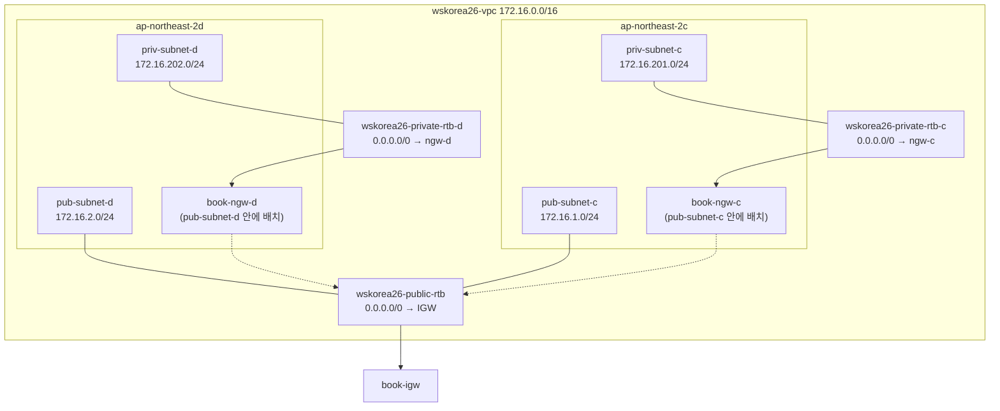

# 01. Terraform 문법 + VPC — 이론

> 문서 유형: explanation

대회(전국기능경기대회 클라우드컴퓨팅)의 모든 과제는 Terraform 으로 시작한다. 이 문서는 set-02 task-1 실측 코드를 근거로, "채점 스크립트(mark.sh)가 무엇을 보는가" 관점으로 문법과 VPC 를 정리한다.

---

## 1. provider / versions

**① 한 줄 정의** — provider 는 Terraform 이 AWS API 를 호출할 때 쓰는 플러그인이고, `required_providers` 블록으로 버전을 고정한다.

**② 왜 필요한가 (채점 관점)** — 대회 규칙상 SW 버전은 최신 안정 버전으로 **고정**해야 한다(latest 금지). 또 리전이 틀리면 mark.sh가 리소스를 아예 못 찾아 전 항목 0점이 된다. 리전은 반드시 변수로 주입한다.

**③ 핵심 원리** — set-02 실측:

```hcl
terraform {
  required_version = ">= 1.6.0"
  required_providers {
    aws     = { source = "hashicorp/aws", version = "~> 6.54" }
    archive = { source = "hashicorp/archive", version = "~> 2.7" }
  }
}

provider "aws" {
  region = var.region            # ap-northeast-2 를 변수로
  default_tags {
    tags = { Project = "wskorea26", ManagedBy = "terraform" }
  }
}
```

`~> 6.54` 는 6.54 이상 7.0 미만. `default_tags` 는 모든 리소스에 공통 태그를 붙여준다(리소스별 `tags` 와 병합됨).

**④ 세트별 차이** — 세트마다 이름 prefix(`wskorea26`/`wsc2026` 등)와 리전이 다를 수 있으므로 provider 자체는 동일하되 region·prefix 를 변수로 뺀다. set-03 은 파일명이 `providers.tf`, set-02 는 `versions.tf` — 파일명은 자유, 내용이 채점 대상.

---

## 2. variable / tfvars / locals

**① 한 줄 정의** — `variable` 은 외부에서 주입 가능한 입력값, `terraform.tfvars` 는 그 값을 실제로 주입하는 파일, `locals` 는 내부 계산값이다.

**② 왜 필요한가 (채점 관점)** — 대회 당일 공개 과제의 **약 30%가 수정**된다. 이름·CIDR·리전·비번호가 바뀌었을 때 tfvars 한 파일만 고치면 끝나도록 설계해야 한다. 특히 리소스 이름은 "정확 일치" 채점 항목이 많다 (예: mark 가 alias·Name 태그로 리소스를 역조회).

**③ 핵심 원리** — set-02 실측 패턴:

```hcl
# variables.tf — 기본값 정의
variable "player_number" {
  description = "비번호. S3 버킷 접미사(wskorea26-concert-bucket-<비번호>)에 사용"
  type        = string
  default     = "103"
}

variable "subnets" {
  type = map(object({
    cidr = string
    az   = string
    tier = string   # public | private
  }))
  default = {
    "wskorea26-pub-subnet-c"  = { cidr = "172.16.1.0/24",   az = "ap-northeast-2c", tier = "public" }
    "wskorea26-pub-subnet-d"  = { cidr = "172.16.2.0/24",   az = "ap-northeast-2d", tier = "public" }
    "wskorea26-priv-subnet-c" = { cidr = "172.16.201.0/24", az = "ap-northeast-2c", tier = "private" }
    "wskorea26-priv-subnet-d" = { cidr = "172.16.202.0/24", az = "ap-northeast-2d", tier = "private" }
  }
}
```

```hcl
# terraform.tfvars — 대회 당일 바뀌는 값만 명시 주입
player_number = "103"
region        = "ap-northeast-2"
vpc_cidr      = "172.16.0.0/16"
```

```hcl
# data.tf — locals 로 파생값 계산
locals {
  bucket_name         = "${var.bucket_name_prefix}-${var.player_number}"
  public_subnet_keys  = [for k, v in var.subnets : k if v.tier == "public"]
  private_subnet_keys = [for k, v in var.subnets : k if v.tier == "private"]
}
```

핵심: **서브넷 이름을 map 의 key 로** 쓰면 이름·CIDR·AZ·tier 가 한 곳에 모이고, `for` + `if` 로 public/private 을 파생시킨다.

**④ 세트별 차이** — 서브넷 개수(4 vs 6), AZ(a/b vs c/d), CIDR 이 세트마다 다르다. map(object) 구조면 tfvars 에서 map 전체를 갈아끼우는 것으로 대응된다.

---

## 3. data source / aws_iam_policy_document

**① 한 줄 정의** — data source 는 "만들지 않고 조회만" 하는 블록이고, `aws_iam_policy_document` 는 IAM/KMS/버킷 정책 JSON 을 HCL 로 조립해 주는 data source 다.

**② 왜 필요한가 (채점 관점)** — 계정 ID 하드코딩은 계정이 지급되는 대회에서 즉사 코드다. `aws_caller_identity` 로 조회한다. 정책을 heredoc JSON 으로 쓰면 따옴표·콤마 실수로 apply 가 깨지기 쉽다 — policy_document 는 validate 단계에서 잡아준다.

**③ 핵심 원리**:

```hcl
data "aws_caller_identity" "current" {}
locals { account_id = data.aws_caller_identity.current.account_id }

data "aws_iam_policy_document" "lambda_assume" {
  statement {
    actions = ["sts:AssumeRole"]
    principals {
      type        = "Service"
      identifiers = ["lambda.amazonaws.com"]
    }
  }
}

resource "aws_iam_role" "book_lambda" {
  name               = "${var.lambda_function_name}-role"
  assume_role_policy = data.aws_iam_policy_document.lambda_assume.json
}
```

`source_policy_documents = [다른문서.json]` 로 정책 문서를 상속·합성할 수 있다 (Day 2 KMS 에서 핵심).

**④ 세트별 차이** — set-03 은 `aws_iam_session_context` 로 "지금 apply 하는 신원"까지 조회해 KMS 관리자로 박는다(root-less 키 정책). Day 2 에서 다룬다.

---

## 4. for_each

**① 한 줄 정의** — `for_each` 는 map/set 을 돌며 리소스를 여러 개 만들고, 각 인스턴스를 `리소스[key]` 로 참조하게 한다.

**② 왜 필요한가 (채점 관점)** — 서브넷 4개를 복붙하면 30% 변동 시 4곳을 고쳐야 한다. for_each 면 변수 map 만 고친다. 또 `count` 와 달리 key 기반이라 중간 요소를 빼도 나머지가 재생성되지 않는다.

**③ 핵심 원리** — set-02 vpc.tf 실측:

```hcl
resource "aws_subnet" "this" {
  for_each = var.subnets

  vpc_id                  = aws_vpc.this.id
  cidr_block              = each.value.cidr
  availability_zone       = each.value.az
  map_public_ip_on_launch = each.value.tier == "public"
  tags                    = { Name = each.key }   # 서브넷 이름 = map key
}

# list 는 toset() 으로 감싸야 for_each 가능
resource "aws_route_table_association" "public" {
  for_each       = toset(local.public_subnet_keys)
  subnet_id      = aws_subnet.this[each.key].id
  route_table_id = aws_route_table.public.id
}
```

- map 이면 `each.key` / `each.value`, set 이면 둘 다 같은 값.
- 참조는 `aws_subnet.this["wskorea26-priv-subnet-c"].id` 식.

**④ 세트별 차이** — 없음. 모든 세트에서 서브넷·NAT·RTB 는 이 패턴이다.

---

## 5. VPC 아키텍처 (set-02 실측)

**① 한 줄 정의** — `wskorea26-vpc`(172.16.0.0/16)에 AZ c/d 로 public 2 + private 2 서브넷을 두고, public 은 IGW 공용 RTB 1개, private 은 AZ별 NAT + AZ별 RTB 2개로 라우팅한다.

**② 왜 필요한가 (채점 관점)** — mark 1-1 은 CIDR 을, **mark 1-2 는 "RTB↔서브넷 연결"과 기본 라우트의 GatewayId(IGW)·NatGatewayId(NAT)를 그대로 검사**한다. 서브넷이 엉뚱한 RTB 에 붙어 있으면 인터넷이 되더라도 감점이다.

**③ 핵심 원리**:



RTB 는 총 **3개**: public 공용 1 + private AZ별 2. NAT 는 **같은 AZ 의 public 서브넷에** 배치한다 (AZ 장애 격리). 실측 코드의 매핑 로직:

```hcl
locals {
  # private 키 → AZ 접미사(c/d): NAT/RTB 이름에 사용
  private_az_suffix = { for k, v in var.subnets : k => substr(v.az, -1, 1) if v.tier == "private" }
  # AZ → public 키: NAT 를 같은 AZ 의 public 서브넷에 배치
  public_by_az = { for k in local.public_subnet_keys : var.subnets[k].az => k }
}

resource "aws_nat_gateway" "this" {
  for_each      = toset(local.private_subnet_keys)
  allocation_id = aws_eip.nat[each.key].id
  subnet_id     = aws_subnet.this[local.public_by_az[var.subnets[each.key].az]].id
  tags          = { Name = "${var.nat_name_prefix}-${local.private_az_suffix[each.key]}" }
  depends_on    = [aws_internet_gateway.this]
}
```

`aws_route` 를 `aws_route_table` 의 인라인 route 블록 대신 별도 리소스로 쓰는 이유: 라우트를 나중에 추가/변경해도 RTB 자체(=연결)가 흔들리지 않는다.

**④ 세트별 차이** — CIDR(172.16 vs 10.x), AZ 쌍(a/b vs c/d), 서브넷 수, NAT 개수(1개 공용 vs AZ별)가 바뀐다. 이 실측 코드는 전부 변수·locals 파생이라 tfvars 교체로 흡수된다.

---

## 6. output → .env 영속화

**① 한 줄 정의** — `output` 은 apply 결과값(ID·ARN·DNS)을 외부로 내보내는 통로이며, 대회에서는 이를 `.env` 파일로 박아 터미널이 끊겨도 재사용한다.

**② 왜 필요한가 (채점 관점)** — 대회 환경은 재시동 시 파일이 초기화되고 CloudShell 세션이 끊긴다. eksctl YAML 렌더링·kubectl 치환·채점 확인 명령이 전부 output 값을 쓰므로, 매번 콘솔에서 복사하면 시간이 녹는다. bastion 에는 Terraform 을 안 올리고 `outputs.json` 만 올려 jq 로 읽는 것이 저장소 규칙이다.

**③ 핵심 원리** — set-02 README 실측(PowerShell):

```powershell
terraform output -json | Set-Content ..\outputs.json

$env:ACCOUNT_ID    = terraform output -raw account_id
$env:VPC_ID        = terraform output -raw vpc_id
$env:PRIV_SUBNET_C = (terraform output -json private_subnet_ids | ConvertFrom-Json).'wskorea26-priv-subnet-c'
# ... 을 .env.ps1 로 저장 → 새 터미널에서 `. .\.env.ps1` 만 재실행
```

Linux/CloudShell 이면 jq:

```bash
terraform output -json > outputs.json
export VPC_ID=$(jq -r '.vpc_id.value' outputs.json)
export PRIV_SUBNET_C=$(jq -r '.private_subnet_ids.value["wskorea26-priv-subnet-c"]' outputs.json)
```

map output 은 `-json` + jq/ConvertFrom-Json, 단일 문자열은 `-raw` 를 쓴다.

**④ 세트별 차이** — output 목록만 다르다(세트가 쓰는 서비스에 따라). "output 으로 뽑고 .env 로 영속화" 패턴 자체는 전 세트 공통.

---

## 자기 점검 퀴즈

1. set-02 VPC 에서 라우트 테이블은 몇 개이고, 각각 어느 서브넷에 연결되는가?
2. NAT Gateway 는 private 서브넷과 public 서브넷 중 어디에 배치하며, 그 이유는?
3. `for_each` 에 `local.private_subnet_keys`(list) 를 그대로 넣으면 에러가 난다. 어떻게 고치는가?
4. 계정 ID 를 코드에 넣어야 할 때 하드코딩 대신 무엇을 쓰는가?
5. `terraform output -json private_subnet_ids` 결과에서 jq 로 `wskorea26-priv-subnet-c` 의 값을 꺼내는 명령은?

<details>
<summary>정답</summary>

1. **3개.** `wskorea26-public-rtb`(공용) ← pub-subnet-c/d 2개, `wskorea26-private-rtb-c` ← priv-subnet-c, `wskorea26-private-rtb-d` ← priv-subnet-d. 이 매핑 자체가 mark 1-2 채점 대상.
2. **같은 AZ 의 public 서브넷.** NAT 자신이 IGW 로 나가야 하므로 public 에 있어야 하고, AZ별로 나눠 AZ 장애를 격리한다.
3. `for_each = toset(local.private_subnet_keys)` — for_each 는 map 또는 set 만 받는다.
4. `data "aws_caller_identity" "current" {}` → `data.aws_caller_identity.current.account_id`.
5. `terraform output -json private_subnet_ids | jq -r '.["wskorea26-priv-subnet-c"]'` (outputs.json 을 경유하면 `jq -r '.private_subnet_ids.value["wskorea26-priv-subnet-c"]' outputs.json`).

</details>
