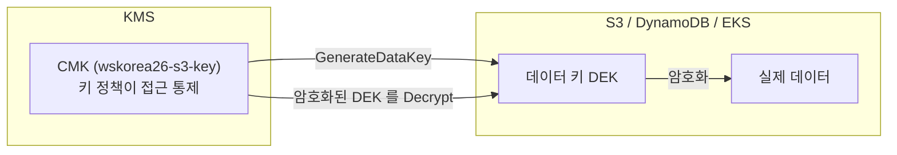
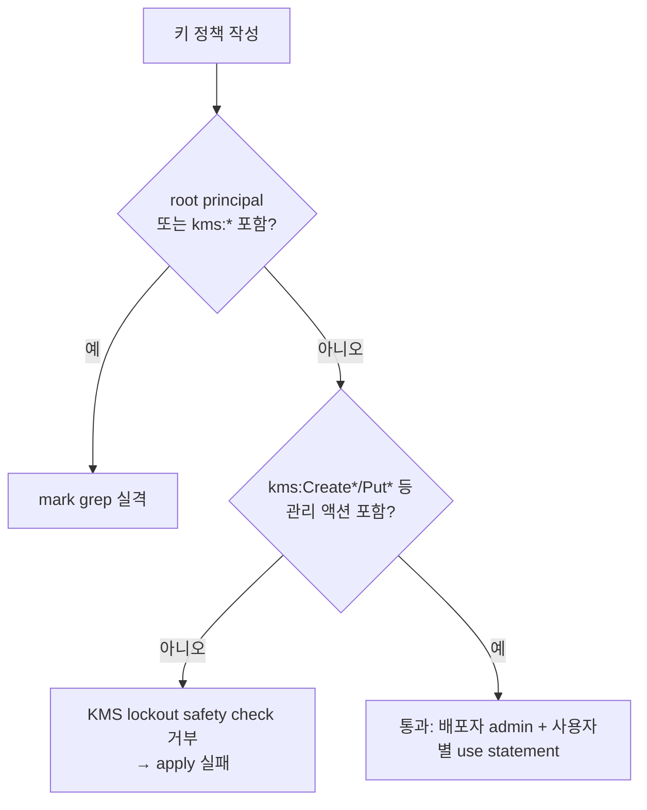
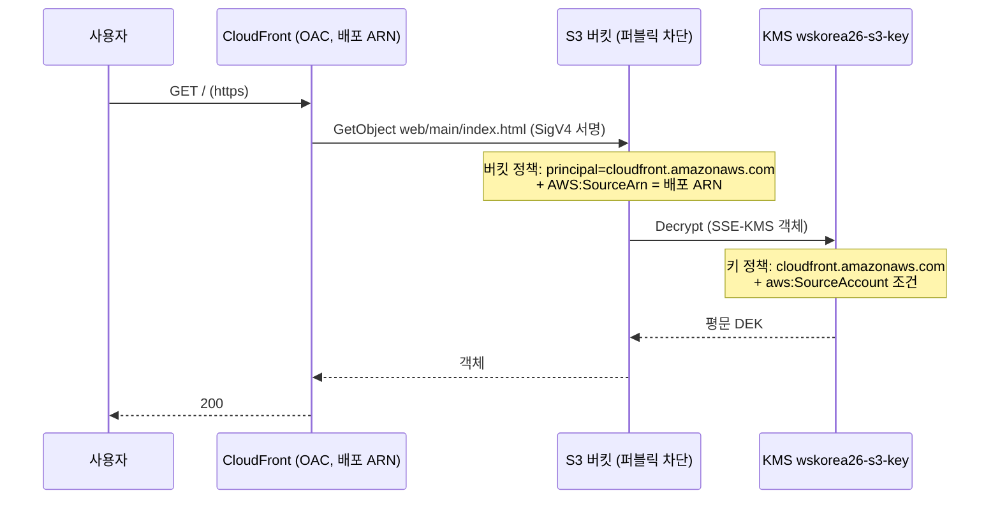
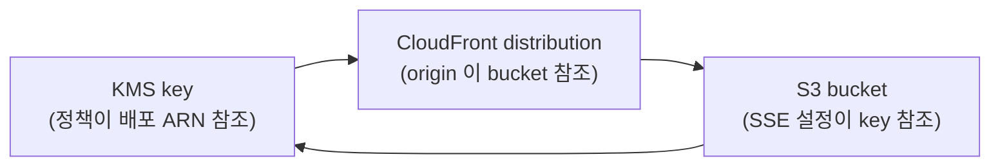

# 02. KMS + S3 + CloudFront — 이론

> 문서 유형: explanation

암호화(KMS)와 정적 웹 서빙(S3+CloudFront)은 거의 모든 세트에 나온다. 채점은 "alias 이름 역조회", "정책 텍스트 grep", "퍼블릭 차단 상태" 같은 기계적 검사이므로, 정확한 구조를 암기 수준으로 익힌다.

---

## 1. Envelope Encryption 과 CMK

**① 한 줄 정의** — envelope encryption 은 데이터를 데이터 키(DEK)로 암호화하고, 그 DEK 를 다시 KMS 의 CMK 로 암호화해 보관하는 2단 구조다.

**② 왜 필요한가 (채점 관점)** — S3 SSE-KMS, DynamoDB SSE, EKS secrets 암호화가 전부 이 구조다. mark 는 "어떤 CMK 로 암호화됐는가"를 **alias 로 역조회**하므로 alias 이름 정확 일치가 점수다.

**③ 핵심 원리**:



- 읽기 경로: 암호화된 DEK → `kms:Decrypt` → 평문 DEK → 데이터 복호화. 그래서 소비자에게 필요한 권한은 보통 `kms:Decrypt`(+ 쓰기 시 `kms:GenerateDataKey`).
- Terraform 기본형 (set-02 실측):

```hcl
resource "aws_kms_key" "s3" {
  description             = "wskorea26-s3-key : S3 static objects"
  enable_key_rotation     = true
  deletion_window_in_days = 7
  policy                  = data.aws_iam_policy_document.kms_s3.json
}
resource "aws_kms_alias" "s3" {
  name          = "alias/wskorea26-s3-key"   # mark 가 이 alias 로 키를 역조회
  target_key_id = aws_kms_key.s3.key_id
}
```

**④ 세트별 차이** — set-02 는 CMK 3개(s3/dynamodb/eks), set-03 은 5개(db/ecr/eks/bucket/function). "과제지가 이름을 준 서비스에만 CMK" 가 원칙.

---

## 2. 키 정책 구조 — admin vs use 분리

**① 한 줄 정의** — 키 정책은 CMK 에 직접 붙는 리소스 정책으로, "키를 관리하는 statement(admin)"와 "키를 사용하는 statement(use)"를 분리해 쓴다.

**② 왜 필요한가 (채점 관점)** — IAM 정책과 달리 KMS 는 **키 정책이 없으면 그 누구도(관리자 포함) 키에 접근 못 한다**. admin/use 분리는 최소권한 채점의 기본형이고, set-03 처럼 정책 텍스트 자체를 grep 하는 세트도 있다.

**③ 핵심 원리** — 액션 두 부류:

| 부류 | 대표 액션 | 누구에게 |
|---|---|---|
| admin (관리) | `kms:Create*`, `kms:Put*`, `kms:Enable*/Disable*`, `kms:ScheduleKeyDeletion`, `kms:TagResource` ... | 계정 root 또는 배포자 IAM 신원 |
| use (사용) | `kms:Encrypt`, `kms:Decrypt`, `kms:GenerateDataKey*`, `kms:DescribeKey`, `kms:CreateGrant` | 키를 실제로 쓰는 역할/서비스 principal |

set-02 기본형 — root 전체 위임 + 필요 use statement 합성:

```hcl
data "aws_iam_policy_document" "kms_root" {
  statement {
    sid       = "EnableRoot"
    actions   = ["kms:*"]
    resources = ["*"]
    principals {
      type        = "AWS"
      identifiers = ["arn:aws:iam::${local.account_id}:root"]
    }
  }
}

data "aws_iam_policy_document" "kms_s3" {
  source_policy_documents = [data.aws_iam_policy_document.kms_root.json]  # 상속·합성

  statement {
    sid     = "AllowCloudFrontDecrypt"
    actions = ["kms:Decrypt", "kms:GenerateDataKey"]
    resources = ["*"]              # 키 정책에서는 항상 "*" (자기 자신)
    principals {
      type        = "Service"
      identifiers = ["cloudfront.amazonaws.com"]
    }
    condition {
      test     = "StringEquals"
      variable = "aws:SourceAccount"
      values   = [local.account_id]
    }
  }
}
```

root principal 은 "계정의 IAM 정책에 권한 위임"을 의미 — 이게 있어야 배포자 IAM 정책만으로 키 관리가 된다.

**④ 세트별 차이** — set-02 는 root 위임 허용. set-03 은 root·`kms:*` 금지(다음 절).

---

## 3. 심화 — set-03 root-less 키 정책

**① 한 줄 정의** — 유의사항이 "키 정책에 root principal 과 `kms:*` 액션 금지"를 걸면, 배포자 IAM 신원을 admin principal 로 명시하고 액션을 전부 나열해야 한다.

**② 왜 필요한가 (채점 관점)** — set-03 mark 의 check_kms 가 **정책 텍스트를 grep** 해서 `:root` 나 `kms:*` 가 있으면 실격 처리한다. 동시에 KMS 의 lockout safety check(키를 관리 불능으로 만드는 정책 거부)를 통과해야 하므로 `kms:Create*`/`kms:Put*` 등을 개별 나열한다.

**③ 핵심 원리** — set-03 kms.tf 실측:

```hcl
locals {
  # "kms:*" 문자열 없이 전체 권한과 동등하게 나열
  kms_admin_actions = [
    "kms:Create*", "kms:Describe*", "kms:Enable*", "kms:List*",
    "kms:Put*",    "kms:Update*",   "kms:Revoke*", "kms:Disable*",
    "kms:Get*",    "kms:Delete*",   "kms:TagResource", "kms:UntagResource",
    "kms:ScheduleKeyDeletion", "kms:CancelKeyDeletion", "kms:RotateKeyOnDemand",
    "kms:Encrypt", "kms:Decrypt",   "kms:ReEncrypt*",  "kms:GenerateDataKey*",
    "kms:CreateGrant", "kms:RetireGrant",
  ]
}

data "aws_iam_policy_document" "kms_admin" {
  statement {
    sid       = "KeyAdministration"
    actions   = local.kms_admin_actions
    resources = ["*"]
    principals {
      type        = "AWS"
      identifiers = local.kms_admin_arns   # 배포자 신원 (aws_iam_session_context)
    }
  }
}
```



**치명 함정**: 배포자 신원이 admin 이므로, **root(또는 다른 신원)로 apply 하면 이후 그 키에 대한 모든 작업이 거부**된다. eksctl·docker push·kubectl 도 terraform 과 **같은 자격증명**으로 실행해야 한다. 또 root 위임이 없으니 키 소비자(EKS Pod 역할, Lambda 실행 역할, 서비스 principal)를 키 정책에 **직접** 나열해야 한다 — set-03 은 db 키에 `book_pod`/`book_function` 역할, function 키에 lambda 서비스 principal(EncryptionContext 조건)까지 명시한다.

**④ 세트별 차이** — root-less 는 set-03 유형의 유의사항이 있을 때만. 평상시(set-02)는 root 위임이 단순하고 안전하다. 과제지 유의사항을 먼저 읽고 결정한다.

---

## 4. 서비스별 CMK 분리 vs 관리형 키 — 불필요 리소스 감점

**① 한 줄 정의** — 과제지가 이름을 준 서비스에만 CMK 를 만들고, 나머지는 AWS 관리형 키를 쓴다.

**② 왜 필요한가 (채점 관점)** — set-02 유의사항 10 은 "불필요 리소스 생성 감점". mark 3-1(ECR)은 `encryptionType == KMS` 만 검사하고 과제에 ECR 용 CMK 이름이 없다 → CMK 를 만들면 오히려 감점.

**③ 핵심 원리** — set-02 실측 판단:

| 서비스 | 키 | 근거 |
|---|---|---|
| S3 | CMK `wskorea26-s3-key` | 과제지에 이름 명시 |
| DynamoDB | CMK `wskorea26-dynamodb-key` | 과제지에 이름 명시 |
| EKS secrets | CMK `wskorea26-eks-key` | 과제지에 이름 명시 |
| ECR | **관리형 `aws/ecr`** | 이름 없음 + mark 는 encryptionType 만 검사 |

```hcl
# ecr.tf — encryption_type 만 KMS, kms_key 미지정 = aws/ecr 관리형
encryption_configuration {
  encryption_type = "KMS"
}
```

**④ 세트별 차이** — set-03 은 ECR 용 CMK 이름(`wsc2026-ecr-kms`)이 과제에 있어 CMK 를 만든다. **판단 기준은 항상 과제지의 이름 명시 여부.**

---

## 5. S3 보안 구성 — 퍼블릭 차단 4종 + SSE-KMS + BucketKey

**① 한 줄 정의** — 정적 웹 버킷은 퍼블릭 액세스 4종을 전부 차단하고, CMK 로 SSE-KMS 암호화하되 BucketKey 로 KMS 호출을 줄인다.

**② 왜 필요한가 (채점 관점)** — mark 2-2 가 퍼블릭 차단 상태와 암호화 키를 검사하고, `get-bucket-policy-status` 가 `IsPublic: false` 를 반환하려면 OAC 버킷 정책이 있어야 한다. 버킷 이름은 `wskorea26-concert-bucket-<비번호>` — 비번호 변수화 필수.

**③ 핵심 원리** — set-02 s3.tf 실측:

```hcl
resource "aws_s3_bucket_public_access_block" "web" {
  bucket                  = aws_s3_bucket.web.id
  block_public_acls       = true
  block_public_policy     = true
  ignore_public_acls      = true
  restrict_public_buckets = true   # 4종 전부 true
}

resource "aws_s3_bucket_server_side_encryption_configuration" "web" {
  bucket = aws_s3_bucket.web.id
  rule {
    apply_server_side_encryption_by_default {
      sse_algorithm     = "aws:kms"
      kms_master_key_id = aws_kms_key.s3.arn
    }
    bucket_key_enabled = true   # 버킷 수준 DEK 재사용 → KMS 호출/비용 절감
  }
}
```

객체 업로드도 Terraform 으로 (mark 2-1 이 키 경로 `web/main/index.html` 등을 정확히 검사):

```hcl
resource "aws_s3_object" "static" {
  for_each               = toset(["index.html", "main.jpeg"])
  bucket                 = aws_s3_bucket.web.id
  key                    = "web/main/${each.value}"
  source                 = "${local.provided_dir}/${each.value}"
  source_hash            = filemd5("${local.provided_dir}/${each.value}")
  content_type           = lookup(local.content_types, regex("[^.]+$", each.value), "application/octet-stream")
  server_side_encryption = "aws:kms"
  kms_key_id             = aws_kms_key.s3.arn
}
```

`content_type` 을 안 주면 브라우저가 html 을 다운로드해 버린다.

**④ 세트별 차이** — 객체 경로(prefix)·파일 목록·버킷 이름 규칙이 바뀐다. 전부 변수/locals 로 처리.

---

## 6. CloudFront OAC + 버킷 정책 + 순환 참조 우회

**① 한 줄 정의** — OAC(Origin Access Control)는 CloudFront 가 S3 에 SigV4 서명으로 접근하게 하는 장치이고, 버킷 정책은 `AWS:SourceArn = 배포 ARN` 조건으로 그 배포에게만 GetObject 를 허용한다.

**② 왜 필요한가 (채점 관점)** — "버킷 직접 접근 불가 + CloudFront 경유만 가능"이 정적 웹 채점의 표준형. 퍼블릭 차단 4종과 양립하는 유일한 정상 경로가 OAC 다.

**③ 핵심 원리**:



버킷 정책 (set-02 실측 — 여기는 배포 ARN 직접 참조가 맞다):

```hcl
data "aws_iam_policy_document" "web_bucket" {
  statement {
    sid       = "AllowCloudFrontOAC"
    actions   = ["s3:GetObject"]
    resources = ["${aws_s3_bucket.web.arn}/*"]
    principals {
      type        = "Service"
      identifiers = ["cloudfront.amazonaws.com"]
    }
    condition {
      test     = "StringEquals"
      variable = "AWS:SourceArn"
      values   = [aws_cloudfront_distribution.cdn.arn]
    }
  }
}
```

**순환 참조 함정** — 같은 방식으로 **KMS 키 정책**에도 배포 ARN 을 넣으면:



`key → distribution → bucket → key` 순환으로 plan 이 실패한다. **우회: 키 정책은 배포 ARN 대신 `aws:SourceAccount = 계정ID` 조건**을 쓴다 (버킷 정책은 bucket→distribution 단방향이라 ARN 직접 참조 가능).

OAC 리소스와 오리진 연결 (set-02 실측):

```hcl
resource "aws_cloudfront_origin_access_control" "s3" {
  name                              = "wskorea26-s3-oac"
  origin_access_control_origin_type = "s3"
  signing_behavior                  = "always"
  signing_protocol                  = "sigv4"
}

origin {
  origin_id                = var.s3_origin_id
  domain_name              = aws_s3_bucket.web.bucket_regional_domain_name
  origin_access_control_id = aws_cloudfront_origin_access_control.s3.id
  origin_path              = "/web/main"   # 루트(/) → web/main/index.html
}
```

배포 식별: mark 는 `comment` 값(`wskorea26-concert-cf`)으로 배포를 찾는다 — comment 도 채점 대상.

**④ 세트별 차이** — set-02/03 공통으로 OAC + SourceArn 버킷 정책 + SourceAccount 키 정책. 오리진 수(S3 단독 vs S3+ALB), behavior(경로 패턴, CloudFront Function), price class 가 세트마다 다르다.

---

## 자기 점검 퀴즈

1. 키 정책의 admin 액션과 use 액션을 각각 3개 이상 대고, 왜 분리하는가?
2. set-02 에서 ECR 에 CMK 를 만들면 안 되는 이유는?
3. set-03 root-less 키 정책에서 `kms:Create*`/`kms:Put*` 를 나열하는 이유와, root 로 apply 하면 생기는 일은?
4. KMS 키 정책에 CloudFront 배포 ARN 을 직접 넣으면 어떤 문제가 나고 어떻게 우회하는가?
5. 퍼블릭 차단 4종이 전부 true 인 버킷을 CloudFront 가 읽을 수 있는 이유는?

<details>
<summary>정답</summary>

1. admin: `kms:Create*`, `kms:Put*`, `kms:ScheduleKeyDeletion`(외 Enable*/Disable*/TagResource 등) / use: `kms:Encrypt`, `kms:Decrypt`, `kms:GenerateDataKey*`(외 DescribeKey, CreateGrant). 관리 주체와 사용 주체가 다르므로 분리해 최소권한을 만든다 — 채점도 이 구조를 본다.
2. 과제에 ECR 용 CMK 이름이 없고 mark 3-1 은 `encryptionType == KMS` 만 검사한다. 관리형 `aws/ecr` 로 충분하며, CMK 를 만들면 "불필요 리소스 생성" 감점(유의사항 10).
3. `kms:*` 를 못 쓰는 조건에서 관리 액션을 개별 나열해야 KMS lockout safety check(관리 불능 정책 거부)를 통과한다. 배포자 신원만 admin 이므로 root 로 apply 하면 이후 그 키의 모든 작업(사용·수정·삭제)이 거부된다 — eksctl/docker/kubectl 도 같은 자격증명으로.
4. key→distribution→bucket→key 순환 참조로 Terraform 이 실패한다. 키 정책은 배포 ARN 대신 principal=cloudfront.amazonaws.com + `aws:SourceAccount = 계정ID` 조건으로 우회한다.
5. OAC 가 SigV4 로 서명한 요청은 "퍼블릭"이 아니라 인증된 서비스 요청이며, 버킷 정책의 `AWS:SourceArn = 배포 ARN` Allow statement 가 그 요청만 허용하기 때문.

</details>
