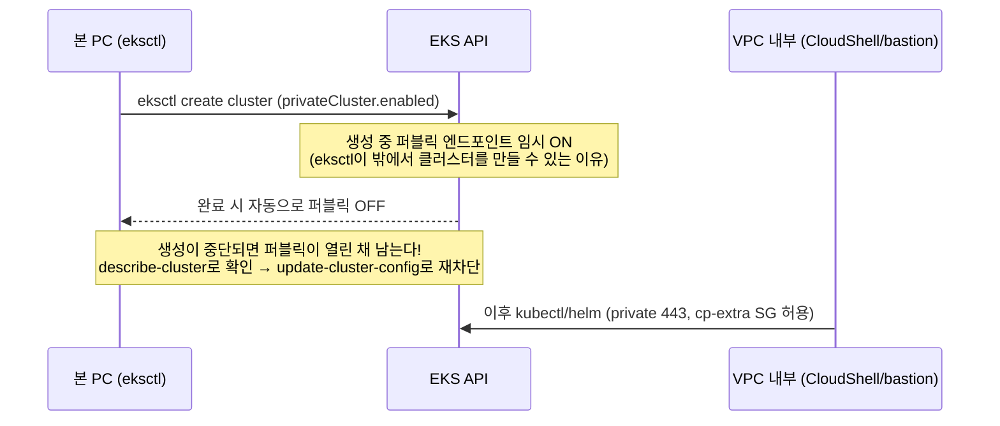
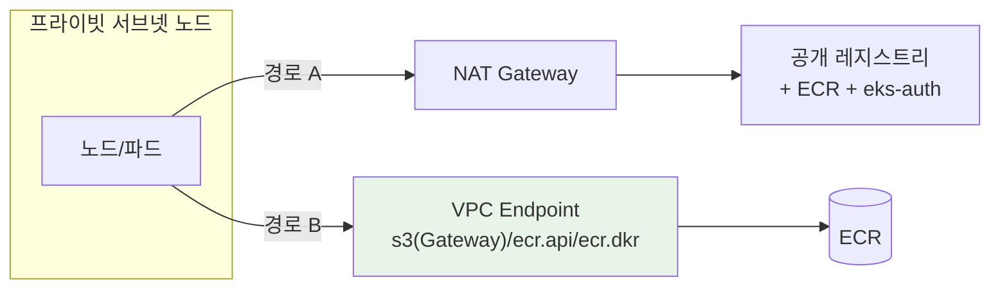
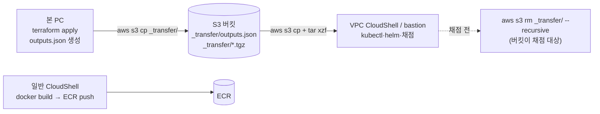
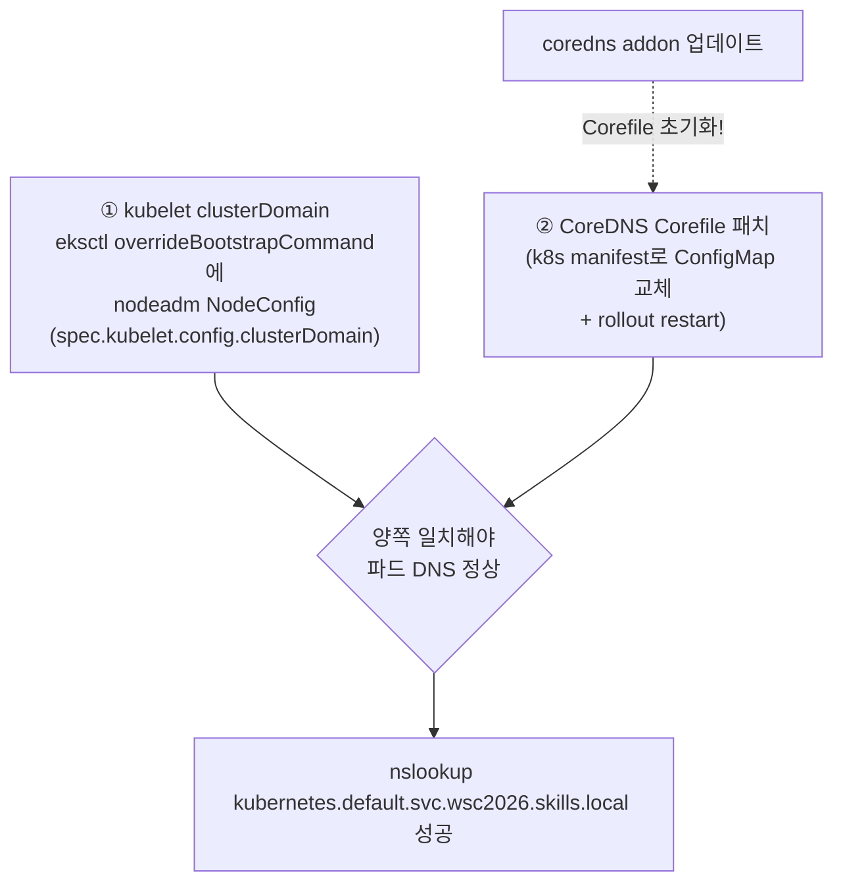
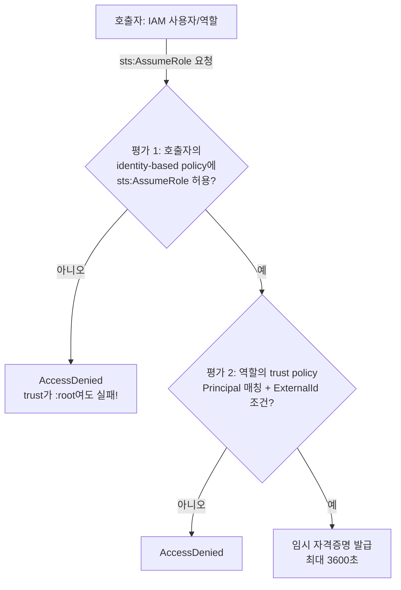
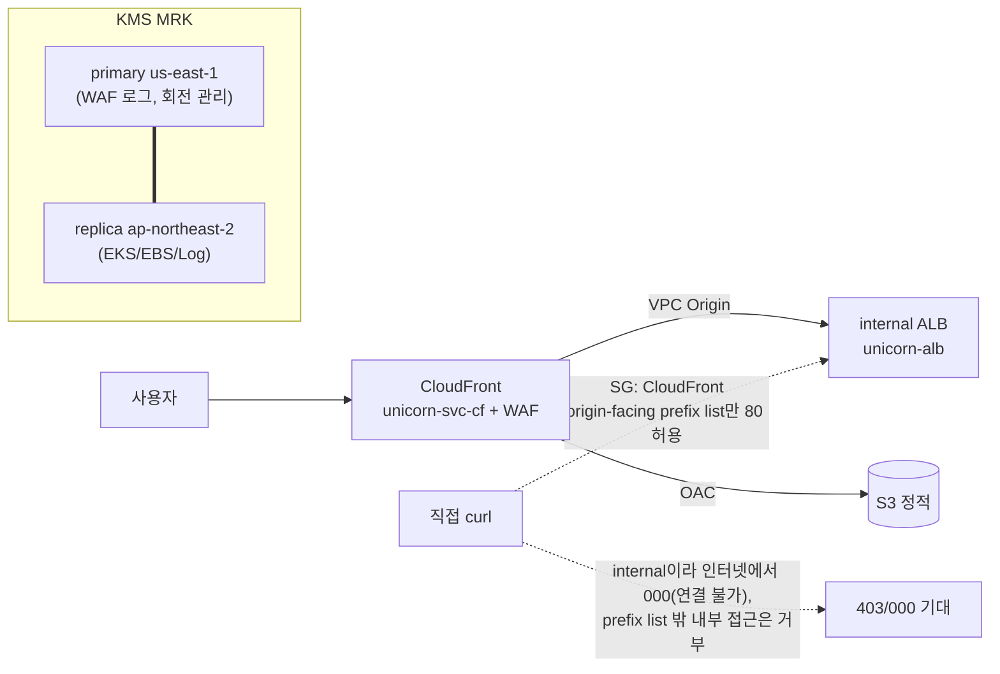

# 08. 이론 — Fully-Private EKS 운용과 IAM 심화

이 모듈은 "네트워크가 닫힌 클러스터를 어떻게 만들고·접근하고·채점받는가"와 "IAM 정책이 실제로 어떻게 평가되는가"를 다룬다. 둘 다 실측 함정이 많은 하드모드 영역이다.

---

## 주제 1. Fully-Private EKS — 생성·접근·이미지 pull

### ① 정의

컨트롤 플레인 API 엔드포인트를 `endpointPublicAccess=false, endpointPrivateAccess=true`로 운용하는 클러스터. kubectl/helm은 **VPC 내부에서만** 가능하다.

### ② 왜 (채점 관점)

- mark 4-1이 `describe-cluster`로 `[false, true]`를 직접 확인한다.
- 퍼블릭이 열린 채 남으면 보안 pillar 감점 + "private" 요구 불충족.

### ③ 원리



- **확인·재차단 명령** (생성 직후 습관화):
  ```bash
  aws eks describe-cluster --name <cluster> \
    --query 'cluster.resourcesVpcConfig.[endpointPublicAccess,endpointPrivateAccess]'   # false, true
  aws eks update-cluster-config --name <cluster> --resources-vpc-config endpointPublicAccess=false
  ```
- **이미지 pull 경로 2가지**:



  - 경로 A(NAT): 세트에 프라이빗 통신 요구가 없으면 이걸로 충분(비용·생성 시간 절감). S3 Gateway Endpoint만 두어 이미지 레이어 pull을 안정화하는 절충이 set-03.
  - 경로 B(Endpoint): "인터넷 미경유" 요구 시 s3/ecr.api/ecr.dkr 필수 (set-07은 ECR·CloudWatch를 Endpoint로).
- **함정 (set-03 실측, endpoints.tf 주석)**: `eks` / `eks-auth` Interface Endpoint를 `private_dns_enabled`로 만들면 PHZ가 OIDC/eks-auth 도메인 해석을 가로채 **Pod Identity/IRSA가 깨진다**. fully private여도 NAT 경유 호출로 충분하므로 이 둘은 만들지 않는다.

### ④ 세트별 차이

- set-03: `privateCluster: {enabled: true, skipEndpointCreation: true}` + NAT + S3 Gateway만.
- set-07: NAT + ECR/CloudWatch Interface Endpoint 병행, 작업 호스트로 SSM bastion 채택.

---

## 주제 2. 머신 3분할과 S3 릴레이

### ① 정의

private 클러스터 과제에서 역할별로 실행 위치를 나누는 운영 패턴.

| 머신 | 역할 | 이유 |
|---|---|---|
| 본 PC | terraform apply / eksctl | tfstate·도구가 여기 있음. eksctl은 밖에서도 생성 가능(주제 1) |
| 일반 CloudShell | docker build/push | 본 PC에 Docker 없을 때(대회: WSL/Docker 불가) |
| VPC CloudShell 또는 SSM bastion | kubectl·helm·채점 | private API는 VPC 내부에서만 |

### ② 왜 (채점 관점)

- 채점 스크립트 자체가 VPC 내부 셸에서 돈다(mark-sg → cp-extra SG 443 허용).
- **생성자 신원 = 채점 신원 원칙**: `bootstrapClusterCreatorAdminPermissions: true`로 클러스터 생성자는 자동 admin. terraform/eksctl/채점을 같은 IAM 신원으로 실행하면 access entry 추가가 불필요하고, root-less KMS 키 정책(배포자 신원에만 CreateGrant 허용 — 모듈 02)과도 정합된다. 신원이 다르면 `create-access-entry` + `associate-access-policy`(ClusterAdmin)로 보정.

### ③ 원리



- **VPC CloudShell은 비영속 + 업로드 UI 없음**: 홈이 세션 종료 시 삭제되고 파일을 올릴 방법이 없다 → S3 `_transfer/` 릴레이로 받고, 도구 설치·자격증명·kubeconfig·환경변수를 **하나의 멱등 셋업 블록**으로 만들어 재접속 시 통째로 재실행한다(약 1~2분). 환경변수는 `~/.wsc2026-env` 같은 파일로 `source`.
- tfstate·`.terraform/`은 절대 릴레이에 올리지 않는다 — `terraform output -json > outputs.json`만 넘겨 jq로 읽는다.
- set-07 변형: CloudShell 대신 **SSM bastion**(private 서브넷 EC2, 인바운드 0, 프로파일은 SSM 전용) — 30분 타임아웃·비영속을 피한다. 단 bastion은 **채점 전 삭제**(인스턴스+프로파일+role까지).

### ④ 세트별 차이: set-03 = VPC CloudShell, set-07 = bastion(+ fallback으로 채점용 CloudShell 겸용).

---

## 주제 3. CoreDNS 커스텀 도메인 (wsc2026.skills.local)

### ① 정의

클러스터 내부 DNS 도메인을 기본 `cluster.local`에서 과제 지정 도메인으로 변경하는 작업. **두 군데를 함께** 바꿔야 한다.

### ② 왜 (채점 관점)

mark 4-1이 kubelet configz의 clusterDomain과 Corefile을 grep 한다. 한쪽만 바꾸면 파드 DNS가 깨진다.

### ③ 원리



- kubelet 쪽: AL2023 MNG는 `overrideBootstrapCommand`에 nodeadm NodeConfig를 넣으면 기본 NodeConfig와 필드 단위 merge된다 — 노드그룹 **모두**에 넣는다.
- **coredns addon을 업데이트하면 Corefile이 초기화**될 수 있다 → 업데이트 금지, 했다면 패치 재적용 후 grep 재확인.
- kps의 Alertmanager도 `clusterDomain` 설정이 있어 함께 맞춘다(모듈 07 연계).

### ④ 세트별 차이: 도메인 문자열만 다르다. 커스텀 도메인 요구가 없는 세트는 건드리지 않는다.

---

## 주제 4. IAM 심화 — Audit Role과 정책 이중 평가 (set-07 9-1/9-2 실측)

### ① 정의

감사자용 AssumeRole 전용 역할. set-07 사양: trust = 계정 `:root` + `sts:ExternalId` StringEquals 조건, `max_session_duration = 3600`, 권한은 DynamoDB 조회 + VPC/EKS Describe(액션 와일드카드 금지).

### ② 왜 (채점 관점)

- mark 9-1: `get-role`로 MaxSessionDuration=3600, Principal=`:root`, ExternalId 문자열을 **정확 일치**로 본다. ExternalId는 `unicorn-audit-2026<선수등번호>` — **apply 시 넣은 player_number와 채점 셸이 export한 number가 정확히 일치**해야 한다.
- mark 9-2: ExternalId 없이 assume → `AccessDenied` 기대, ExternalId 붙여 assume → 성공 후 허용 액션(describe-vpcs)은 되고 미허용 액션(describe-instances)은 `AccessDenied/UnauthorizedOperation`이어야 한다. 즉 **성공과 실패 양쪽이 모두 채점 대상**이다.

### ③ 원리 — AssumeRole 이중 평가



- trust의 `Principal: :root`는 "이 **계정의** principal이면 후보"라는 뜻이지 전원 허용이 아니다. **trust policy AND 호출자 identity-based policy 둘 다 통과**해야 한다 — 호출자가 admin(또는 sts:AssumeRole 허용 보유)이 아니면 assume은 실패한다. 이게 같은 계정 `:root` trust가 안전하게 쓰이는 이유.
- **리소스 레벨 ARN 미지원 액션**: `ec2:DescribeVpcs`는 ARN을 지원하지 않아 `Resource "*"`가 불가피하다. 대신 좁힐 수 있는 것(`eks:DescribeCluster` → cluster ARN)만이라도 **별도 statement로 분리**해 좁힌다 — set-07 iam.tf가 이 구조.
- **요구 목록 외 권한 추가는 수동 채점 리스크**: 테이블이 CMK 암호화라 조회에 `kms:Decrypt`가 실제로 필요하지만, 요구 목록에 없는 액션 추가는 "최소권한 위반"으로 읽힐 수 있다. 넣는다면 리소스를 해당 키 ARN 하나로 못박고 sid로 사유를 명시한다.
- **root-less KMS 재확인(모듈 02 연계)**: 유의사항에 root/`kms:*` 금지가 있는 세트(set-03)는 키 정책을 배포자 신원(`aws_iam_session_context`) + 서비스별 최소 statement로 구성 — root 자격증명으로는 plan 단계부터 차단된다. 대회 지급 계정이 root면 **step 0에서 IAM 사용자를 만들어 전 과정을 그 신원으로** 실행한다.

### ④ 세트별 차이: set-07만 audit role이 명시 요구. set-03은 대신 root-less KMS가 하드 포인트.

---

## 주제 5. CloudFront VPC Origin + KMS Multi-Region Key (set-07)

### ① 정의 / ② 왜

- **VPC Origin**: CloudFront가 **internal ALB**를 인터넷 노출 없이 오리진으로 쓰는 기능. 채점은 CloudFront 경유 200 + **ALB 직접 접근 차단**을 본다.
- **MRK**: 같은 키 자료를 여러 리전에 복제한 KMS 키. WAF 로그(us-east-1)=primary, EKS/EBS/Log(서울)=replica. alias는 양 리전에 존재, 회전(90일)은 primary가 관리.

### ③ 원리



- ALB SG 인바운드를 `com.amazonaws.global.cloudfront.origin-facing` **managed prefix list**로만 열면 직접 접근은 차단된다 — 채점 기대값이 403 또는 000(타임아웃/연결 불가)인 이유. 000 유도는 prefix list SG로 달성한다.

### ④ 세트별 차이: set-03은 internet-facing ALB + CloudFront prefix list SG(직접 curl 000), set-07은 internal ALB + VPC Origin. 모듈 02·06의 CloudFront 내용과 교차 확인.

---

## 자기 점검 퀴즈 (5문)

1. `eksctl create cluster`가 노트북(퍼블릭 네트워크)에서 fully-private 클러스터를 만들 수 있는 이유는? 생성이 중간에 끊기면 무엇을 확인해야 하나?
2. fully-private 클러스터에서 `eks`/`eks-auth` Interface Endpoint를 만들면 안 되는 이유는?
3. trust policy가 `Principal: arn:aws:iam::<acct>:root`인 역할을, 아무 정책도 없는 IAM 사용자가 assume하면 결과는? 이유는?
4. audit role의 ExternalId에서 대회 당일 반드시 맞춰야 하는 두 값은?
5. CoreDNS 커스텀 도메인이 "패치했는데 어느 순간 되돌아가 있는" 대표 원인은?

### 정답

1. eksctl이 생성 중 퍼블릭 엔드포인트를 임시로 켰다가 완료 시 자동으로 끈다. 중단되면 퍼블릭이 열린 채 남으므로 `describe-cluster`로 `[false, true]` 확인 후 `update-cluster-config --resources-vpc-config endpointPublicAccess=false`로 재차단.
2. `private_dns_enabled` Endpoint의 PHZ가 OIDC/eks-auth 도메인 해석을 가로채 Pod Identity/IRSA가 깨진다(set-03 실측). NAT 경유 호출로 충분하다.
3. AccessDenied. AssumeRole은 trust policy와 호출자의 identity-based `sts:AssumeRole` 허용 **둘 다** 통과해야 한다(이중 평가). `:root` trust는 후보 범위를 계정으로 넓힐 뿐 권한을 주지 않는다.
4. terraform apply에 넣는 `player_number`와 채점 셸에서 export하는 등번호(`number`). 둘이 다르면 mark 9-1 문자열 비교와 9-2 assume이 모두 실패한다.
5. coredns addon 업데이트 — Corefile이 addon 기본값으로 초기화된다. 업데이트 금지, 했다면 패치 재적용 후 grep 재확인.
