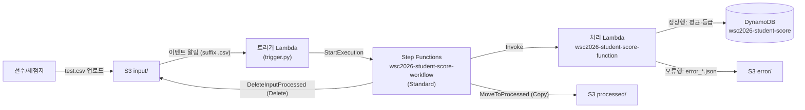
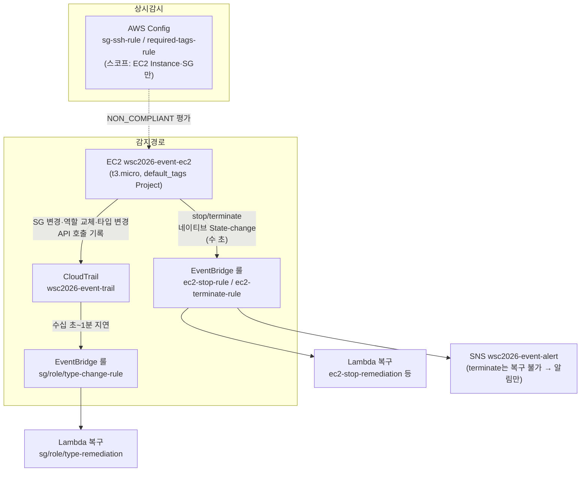

# 2과제 유형별 아키텍처 패턴 1장 요약 — 서버리스 워크플로 · 이벤트 자동복구

2과제는 독립 모듈 여러 개로 구성되며, 모듈마다 "패턴"이 반복된다. 이 문서는 그중 유형 1·2를 다룬다. 각 유형은 ① 도식 ② 언제 나오나 ③ 핵심 연결 고리 ④ 채점이 보는 상태 ⑤ 퀴즈 순서다.

---

## 유형 1 — 서버리스 워크플로 (S3 → Lambda → Step Functions → DynamoDB)

실측 근거: set-02 task-2 module-1 (성적 처리, ap-southeast-1)

### ① 도식

- 흐름: `input/`에 CSV 업로드 → S3 이벤트가 트리거 Lambda 호출 → 트리거가 Step Functions 실행 시작 → 처리 Lambda가 행별 검증 후 정상행은 평균(483/5=96.6)·등급 계산해 DynamoDB 저장, 오류행은 `error/`에 JSON 저장 → 상태 머신이 원본 파일을 `processed/`로 이동(Copy+Delete).

### ② 언제 이 패턴이 나오나

- 과제지에 "파일 업로드 시 자동 처리", "워크플로우", "Step Functions", "처리 완료 후 파일 이동", "오류 데이터 분리 저장" 키워드가 보일 때.
- S3 폴더가 `input/` `processed/` `error/` 3종으로 나뉘면 거의 확정.
- 배치성 데이터(CSV 성적, 주문 목록 등) + "테이블은 채점 시작 시 비어 있어야 함" 조건이 따라온다.

### ③ 핵심 연결 고리 (여기가 끊어지면 전체가 죽는다)

1. **S3 트리거 suffix `.csv`** — 처리 Lambda가 `error/`에 `.json`을 쓰는데, suffix 필터가 없으면 그 쓰기가 다시 트리거를 발화해 **재귀 무한루프**가 된다. suffix `.csv` 하나로 차단(출력이 `.json`이라 매치 안 됨).
2. **ASL에서 S3 이동은 Copy+Delete 2상태** — S3에 "move" API는 없다. `MoveToProcessed`(CopyObject) → `DeleteInputProcessed`(DeleteObject)로 상태를 2개로 분리한다. 채점은 상태 이름이 아니라 State Machine [name,type]과 S3/DDB 최종 상태만 본다.
3. **Decimal 나눗셈** — `Decimal("483")/Decimal("5")` = 정확히 `96.6`. float로 하면 `96.60000000000001`이 되고, 애초에 boto3는 DynamoDB에 float 저장 자체를 거부한다(TypeError). 평균 계산은 반드시 `decimal.Decimal`.
4. **처리 Lambda를 State Machine에서 ARN 직접 호출** — 출력이 `$.result`에 그대로 실려 `.Payload` 언랩이 필요 없다.
5. **IAM 역할 2개** — Lambda 공용 `wsc2026-lambda-student-role` + Step Functions용 `wsc2026-stepfunction-student-role` (과제가 Lambda 역할을 하나만 명명하므로 두 Lambda가 공용).

### ④ 채점이 보는 상태

- **처리 Lambda 이름 `wsc2026-student-score-function`은 task.md에 없고 mark에만 있다** — mark.md/mark 스크립트를 반드시 읽고 이름을 그대로 쓴다. 임의 변경 금지.
- **S3 폴더 마커는 `input/` 하나만 생성.** `processed/`·`error/`는 실행 후 실제 객체가 생겨 PRE가 뜬다. 마커(0바이트 객체)를 만들어두면 채점의 `aws s3 ls` 목록에 잉여 라인이 출력돼 오답.
- **채점 직전 리셋 절차 (순서 엄수)**: ① `processed/`·`error/` 비우기 → ② DynamoDB 전 항목 삭제 → ③ `test.csv`를 `input/`에 **정확히 1회** 업로드. 2회 업로드하면 timestamp가 다른 error JSON이 8개가 되어 오답(기대는 4개).
- 기대 결과: `STU1020 96.6 A` (get-item), `processed/`에 test.csv만, `error/`에 error_*_STU2001/STU2002/STU2004/unknown.json **정확히 4개**.
- 채점 상태 = "깨끗한 버킷/테이블에서 test.csv 1회 처리 완료 + SUCCEEDED 실행 1건".

### ⑤ 퀴즈

1. 트리거 Lambda의 S3 이벤트에 suffix 필터를 안 걸면 무슨 일이 벌어지나? (힌트: error/에 쓰는 파일 확장자)
2. 처리 Lambda에서 `sum/count`를 float로 계산하면 채점 1-5-A가 왜 깨지나? 두 가지 이유를 말하라.
3. test.csv를 실수로 두 번 업로드했다. 복구 절차는?
4. `processed/` 폴더 마커를 terraform으로 만들면 안 되는 이유는?
5. S3 "이동"을 ASL에서 상태 하나로 구현할 수 없는 이유는?

답

1. 처리 Lambda가 error/에 쓰는 .json이 다시 버킷 이벤트를 발화 → 트리거 → 실행 → 또 .json … 재귀 무한루프. suffix `.csv`면 .json은 매치되지 않는다.
2. (a) 483/5가 96.60000000000001로 저장돼 기대값 96.6과 불일치, (b) boto3가 float의 DynamoDB 저장을 거부(TypeError)해 애초에 저장이 실패한다. `Decimal("483")/Decimal("5")` 사용.
3. processed/·error/ 전체 삭제 → DynamoDB scan 후 전 항목 delete-item → test.csv 1회 재업로드. 리셋 없이 재업로드만 하면 error JSON이 계속 누적된다.
4. 채점이 `aws s3 ls s3://버킷/processed/` 출력을 보는데, 마커가 있으면 0바이트 잉여 라인이 함께 출력돼 "test.csv만"이라는 기대와 불일치 → 오답. input/만 마커가 필요하다(파일이 이동해 가서 비므로).
5. S3에 move API가 없어서. CopyObject + DeleteObject 2개 API 호출 = ASL 상태 2개(`MoveToProcessed` → `DeleteInputProcessed`)로 분리한다.

---

## 유형 2 — 이벤트 기반 자동복구 (EventBridge/Config → Lambda/SNS)

실측 근거: set-02 task-2 module-3 (EC2 정책 위반 자동복구, eu-west-1)

### ① 도식

- 흐름: EC2에 대한 정책 위반(SG 인바운드 추가, 인스턴스 프로파일 교체, 중지, 종료, 타입 변경)을 EventBridge가 감지 → Lambda가 원상 복구하거나(복구 불가한 terminate는) SNS 알림. AWS Config가 SSH 인바운드·필수 태그를 상시 감시.

### ② 언제 이 패턴이 나오나

- 과제지에 "자동 복구", "정책 위반 감지", "EventBridge", "CloudTrail", "Config 룰", "관리자에게 알림(SNS)" 키워드가 보일 때.
- 채점 스크립트가 "일부러 망가뜨리고 → sleep → 원상태 확인" 구조면 확정 (예: stop 후 sleep 30에 running 기대).

### ③ 핵심 연결 고리

1. **감지 경로가 2종이고 지연이 다르다.** 인스턴스 stop/terminate는 **네이티브 "EC2 Instance State-change Notification" 이벤트(수 초)**. SG 규칙 변경·역할 교체·타입 변경은 네이티브 이벤트가 **없어서** CloudTrail(API 기록) → EventBridge 경로(수십 초~1분 지연). apply 직후엔 트레일 활성화까지 몇 분 더 걸린다.
2. **stop 복구는 `stopping` 상태에서 트리거 + waiter로 stopped 직후 start.** mark 3-4는 stop 후 (다른 항목 채점 + sleep 30) 시점에 `running`을 기대한다. `stopped` 이벤트를 기다렸다 시작하면 늦는다. `stopping`에서 받아 boto3 waiter(5초 간격)로 stopped를 감지하자마자 start.
3. **무한루프 2중 차단.** 복구 Lambda의 원복 동작 자체가 또 이벤트를 만든다. (a) type-change 룰의 이벤트 패턴에 `anything-but: t3.micro`로 원복 이벤트 제외, (b) Lambda 안에서도 현재 값이 원본이면 즉시 return. role-remediation도 현재 프로파일이 원본이면 return.
4. **레이스 컨디션: 타입 원복 시연 전 stop-rule 비활성화.** 타입 변경 시연 절차(stop→modify→start)의 stop이 stop-remediation과 레이스해서, 복구 Lambda가 인스턴스를 다시 켜버리면 modify가 `IncorrectInstanceState`로 실패한다. `aws events disable-rule --name wsc2026-ec2-stop-rule` 후 시연, 끝나면 enable.
5. **인스턴스 프로파일 이름 = 역할 이름** (`wsc2026-event-ec2-role`). role-remediation이 `ROLE_NAME` 환경변수를 프로파일 Name으로 그대로 써서 원복한다. `-profile` 접미사를 붙이면 복구가 깨진다.
6. **provider `default_tags`로 `Project` 태그 상시 부착** — Config required-tags 룰 통과의 기반.
7. **EC2에 `lifecycle.ignore_changes = [instance_type]`** — 타입 변경 시연 후 `terraform plan`에 diff가 남지 않게.

### ④ 채점이 보는 상태

- **task.md ∪ mark 합집합 구현.** task.md/lambda.md는 sg/role/terminate/type 함수 4개·룰 4개를, mark 스크립트는 stop/terminate/sg/tag 함수 4개·stop/terminate 룰·Config 룰 2개를 요구 → 불일치. 채점 스크립트가 1순위지만 task.md 항목은 수동 채점 가능성이 있어 **함수 6개·룰 6개 전부** 만든다.
- **Config 스코프는 EC2 Instance·SecurityGroup만 기록.** 스코프를 넓히면 태그 없는 관리형 리소스(자동 생성 SG, ENI 등)가 required-tags에서 NON_COMPLIANT로 잡혀 "NON_COMPLIANT 0건(None)" 채점이 깨진다.
- **CloudTrail·Config 첫 평가는 5~10분** — apply 직후 바로 채점하지 말 것. 급하면 `aws configservice start-config-rules-evaluation`으로 강제 트리거.
- 기대 출력: stop+SSH 인바운드 추가 후 sleep 90 → `EC2 State: running`, `SG Inbound Count: 0`, required-tags NON_COMPLIANT 조회 결과 `None`.
- **과제지 오타는 그대로 유지** — 예: set-02의 `wsc2026-alaytics-ec2-role`(alaytics). 이름 정확 일치 채점이므로 "고쳐주면" 오답.

### ⑤ 퀴즈

1. SG 인바운드 추가 복구가 stop 복구보다 느린 근본 이유는?
2. mark가 "stop 후 sleep 30에 running"을 기대하는데, `stopped` 상태 이벤트로 룰을 걸면 왜 실패하나?
3. 타입 변경 원복을 시연하는데 `IncorrectInstanceState` 오류가 났다. 원인과 예방책은?
4. Config required-tags 룰이 갑자기 NON_COMPLIANT를 뱉는다. 코드는 안 바꿨다면 무엇부터 의심하나?
5. task.md는 함수 4개, mark는 다른 조합의 함수 4개를 요구한다. 무엇을 만드나?
6. 인스턴스 프로파일 이름을 `wsc2026-event-ec2-role-profile`로 지으면 어떤 채점이 깨지나?

답

1. SG 규칙 변경에는 네이티브 EventBridge 이벤트가 없어 CloudTrail이 API 호출을 기록해 전달하는 경로를 타기 때문(수십 초~1분). stop은 네이티브 State-change 이벤트라 수 초.
2. stop→stopped 전이 자체가 1분 안팎 걸린다. stopped를 기다렸다 start하면 sleep 30 시점을 넘긴다. stopping에서 트리거 받고 waiter(5초 간격)로 stopped 직후 start해야 시간 내 running.
3. stop-remediation 룰이 시연용 stop을 감지해 인스턴스를 다시 켜는 레이스. 시연 전 `aws events disable-rule --name wsc2026-ec2-stop-rule`, 시연 후 enable.
4. Config 레코더 스코프. EC2 Instance·SG 외로 넓어졌으면 태그 없는 관리형 리소스가 잡힌다. 그다음 default_tags 누락 여부.
5. 합집합(함수 6개·룰 6개) 전부. mark는 일부만 채점하지만 task.md 항목은 수동 채점될 수 있다.
6. role-remediation이 역할 이름을 프로파일 이름으로 그대로 사용해 원복하므로, 이름이 다르면 프로파일 교체 복구가 실패한다. 프로파일 이름 = 역할 이름 유지.

