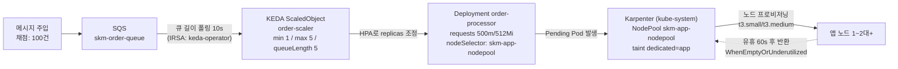
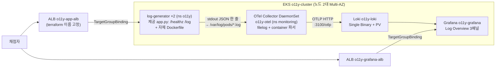
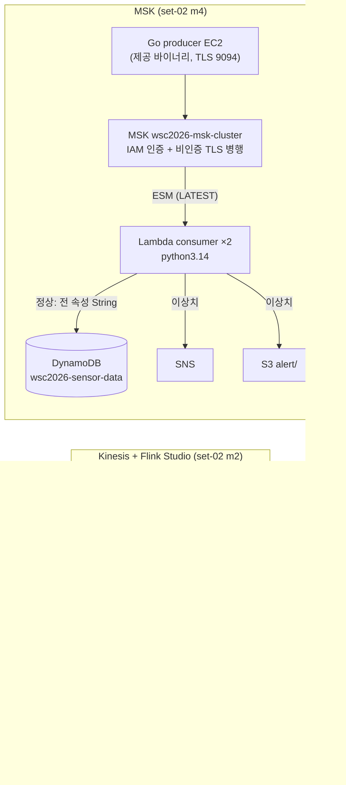

# 2과제 유형별 아키텍처 패턴 1장 요약 — 오토스케일링 · 로깅 · 스트리밍

> 문서 유형: explanation

유형 3·4는 실습까지, 유형 5는 개념+함정 암기만 한다. 각 유형은 ① 도식 ② 언제 나오나 ③ 핵심 연결 고리 ④ 채점이 보는 상태 ⑤ 퀴즈 순서다.

---

## 유형 3 — 이벤트 기반 오토스케일링 (SQS → KEDA → Karpenter)

실측 근거: set-07 task-2 module-3 (ap-northeast-2, skm- 접두어)

### ① 도식

2단 스케일링: 큐 길이가 Pod 수를 늘리고(KEDA), Pod가 노드에 안 들어가면 노드가 늘어난다(Karpenter). 축소도 2단: 큐가 비면 Pod 1로, 노드가 비면 1대로.

### ② 언제 이 패턴이 나오나

- 과제지에 "메시지 폭주 시 자동 확장", "KEDA", "Karpenter", "큐 길이 기반 스케일링", "유휴 시 노드 반환" 키워드.
- 채점이 "메시지 N건 주입 → 관찰 → purge → 관찰"의 부하 시나리오 구조면 확정.

### ③ 핵심 연결 고리

1. **queueLength 5 → 메시지 100건이면 목표 Pod 20이지만 max 5로 캡** — 그래서 채점 기대가 "Pod ≥ 5".
2. **Pod requests 500m × 5 = 2.5 vCPU > t3.medium allocatable ~1.9 vCPU** → 한 대에 다 못 들어가 Pending 발생 → Karpenter가 2대째를 띄운다. 채점 기대 "Node ≥ 2"는 이 계산에서 나온다. requests를 줄이면 노드가 안 늘어나 오답.
3. **스케일인 시간 예산 2.5분**: ScaledObject `pollingInterval: 10`(빠른 감지) + HPA behavior `scaleDown.stabilizationWindowSeconds: 30`(기본 300 → 30) + NodePool `consolidateAfter: 60s`가 한 쌍. 기본값 300이면 Pod 축소만 5분이라 채점 시간 내 1/1 수렴 실패. **어느 값도 늘리지 않는다.**
4. **`identityOwner: operator`** — SQS 조회 자격증명을 keda-operator SA의 IRSA에서 가져온다. 앱 Pod의 권한과 무관.
5. **Karpenter 디스커버리 태그**: 서브넷은 `karpenter.sh/discovery: skm-eks-cluster` 태그(terraform이 부착), SG는 `aws:eks:cluster-name` 태그로 찾는다. 태그가 없으면 NodeClass가 서브넷/SG를 못 찾아 노드가 안 뜬다.
6. **NodePool taint `dedicated=app:NoSchedule`** + Deployment toleration + nodeSelector — 앱만 Karpenter 노드에, addon(KEDA·Karpenter 자신·coredns)은 addon 노드그룹에 격리.

### ④ 채점이 보는 상태

- 스케일아웃: 메시지 100건 주입 → 3분 관찰 → **Max Ready Pods ≥ 5 / Max App Nodes ≥ 2**.
- 스케일인: purge → 3분 관찰 → **Final Pods 1 / Final Nodes 1** (대기 최대 2.5분).
- **Deployment env는 리터럴 정확 3개만** (`AWS_REGION`, `SQS_QUEUE_URL`, `PROCESSING_TIME`) — 채점이 name=value로 정확 비교. valueFrom·추가 env 금지.
- 이름 정확 일치: `skm-order-queue`, `skm-eks-cluster`, `order-processor`, `order-scaler`, `skm-app-nodepool`, `skm-app-nodeclass`.
- **addon 노드 1대(t3.medium) 용량이 빠듯** — coredns 2 + KEDA 3 + Karpenter 1. Karpenter requests를 0.5 vCPU/512Mi로 낮춰 설치한다.
- **KEDA Pod가 Pending이면 차트 tolerations 스키마부터** — addon 노드가 taint돼 있어 toleration 필요. 차트 버전에 따라 키가 바뀌므로 `helm show values kedacore/keda | grep -A3 tolerations`로 확인.

### ⑤ 퀴즈

1. 채점 기대 "Node ≥ 2"는 어떤 숫자 계산에서 나오나?
2. stabilizationWindowSeconds를 기본값(300)으로 두면 어떤 채점이 왜 깨지나?
3. KEDA가 SQS 큐 길이를 읽을 때 쓰는 자격증명은 무엇인가?
4. Karpenter가 노드를 아예 안 띄운다. 태그 관점에서 무엇을 확인하나?
5. Deployment에 configMapRef로 env를 하나 더 얹으면?

답

1. requests 500m × 5 Pod = 2.5 vCPU > t3.medium allocatable ~1.9 vCPU → 1대 수용 불가 → 2대째 프로비저닝.
2. purge 후 Pod 5→1 축소가 5분 이상 걸려, 최대 2.5분 대기인 스케일인 채점(Final Pods 1/Nodes 1)에 실패한다. 30으로 줄이고 consolidateAfter 60s와 한 쌍으로 유지.
3. `identityOwner: operator` — keda-operator SA의 IRSA(skm-keda-policy).
4. 서브넷의 `karpenter.sh/discovery: skm-eks-cluster` 태그와 SG의 `aws:eks:cluster-name` 태그. NodeClass의 selectorTerms가 이 태그로 디스커버리한다.
5. 채점이 env를 name=value로 정확 비교하므로 리터럴 3개 외 무엇이든(추가 env, valueFrom) 오답.

---

## 유형 4 — 컨테이너 로깅 파이프라인 (OTel → Loki → Grafana)

실측 근거: set-07 task-2 module-4 (ap-northeast-1, o11y- 접두어)

### ① 도식

### ② 언제 이 패턴이 나오나

- "컨테이너 로그 수집", "OpenTelemetry", "Loki", "Grafana 대시보드", "레벨별 로그 집계" 키워드.
- ALB/TG **이름**이 채점 대상이면 LBC Ingress(이름 지정 불가) 대신 terraform ALB + TargetGroupBinding 패턴 확정.

### ③ 핵심 연결 고리

1. **제공 Dockerfile 결함** — flask 미설치 + requirements.txt 없음 → 그대로 빌드하면 CrashLoop. **자체 Dockerfile로 빌드하되 제공 app.py는 수정 금지.** (대회 당일 제공본이 수정돼 있으면 제공본 우선.)
2. **filelog `container` 파서 체인**: `/var/log/pods/*/*/*.log` 수집 → container 파서가 CRI 포맷(타임스탬프/스트림 접두어)을 분해하고 **파일 경로에서 k8s.namespace.name/pod.name/pod.uid를 리소스 속성으로 추출** → **body는 앱이 찍은 원본 JSON 한 줄 그대로** 유지. 본문을 가공하면 Loki에서 `| json` 파싱이 깨진다.
3. **Loki OTLP 인제스트**: exporter `otlphttp` → `http://o11y-loki...:3100/otlp`. Loki 3.x가 `k8s.namespace.name` 리소스 속성을 인덱스 라벨 `k8s_namespace_name`으로 **자동 승격** — 채점 LogQL `{k8s_namespace_name="o11y"}`와 정확히 맞물린다.
4. **자기 로그 exclude** — 콜렉터 자신의 로그(`monitoring_o11y-otel*`)를 수집에서 제외해 루프 방지.
5. **ALB/TG는 terraform으로 이름 고정 + TargetGroupBinding으로 Pod 연결.** TGB는 CRD라 **LBC 설치 이후에만 apply 가능** — 순서 의존.
6. **대시보드 쿼리**: `sum by (level) (...)` + legendFormat `{{level}}` — 범례가 INFO/WARN/ERROR로 떠야 한다. level 값은 **대문자 ERROR**.

### ④ 채점이 보는 상태

- 리소스 조회: `log-generator` 2 replica(o11y), ds `o11y-otel`, svc `o11y-loki` ClusterIP 3100, deploy `o11y-grafana` — 이름·네임스페이스 정확 일치.
- LogQL 채점: `{k8s_namespace_name="o11y"} | json | level="ERROR"`가 결과를 반환해야 함.
- **Grafana는 웹 수동 채점 항목 존재** — 로그인/Datasource/Log Overview 3패널. **No Data 패널이 하나라도 있으면 오답** → 채점 전 `/log?level=info`, `/log?level=warn`, `/log?level=error`를 각각 호출해 3레벨 데이터를 미리 만든다.
- 범례가 `{level="ERROR"}` 형태면 오답 — legendFormat `{{level}}` 유지.
- ALB 타깃 healthy까지 1~2분 — 채점 직전 `curl /healthz`로 확인.

### ⑤ 퀴즈

1. 제공 Dockerfile을 그대로 쓰면 어떻게 되고, 무엇을 지켜야 하나?
2. 채점 LogQL의 라벨이 `k8s_namespace_name`인 것은 어떤 두 메커니즘의 합작인가?
3. OTel에서 로그 본문에 파서를 하나 더 얹어 필드를 추출하면 왜 위험한가?
4. TargetGroupBinding apply가 실패한다. 순서 관점에서 원인은?
5. Grafana 패널 하나가 No Data다. 코드 수정 없이 통과시키는 방법은?

답

1. flask 미설치라 Pod CrashLoop. 자체 Dockerfile로 빌드하되 제공 app.py는 수정 금지(당일 제공본이 고쳐져 있으면 제공본 사용).
2. (a) filelog container 파서가 파일 경로에서 k8s.namespace.name 리소스 속성 추출, (b) Loki 3.x의 OTLP 인제스트가 그 속성을 인덱스 라벨 k8s_namespace_name으로 자동 승격.
3. body 원본 JSON이 변형되면 채점 쿼리의 `| json` 파싱이 깨진다. container 파서 외 본문 변형 금지.
4. TGB는 LBC가 제공하는 CRD — LBC helm 설치 전에는 CRD가 없어 apply 불가. LBC 설치 후 TGB apply.
5. 해당 레벨로 `/log?level=...`를 호출해 데이터를 생성한 뒤 채점받는다. 3레벨 모두 미리 호출해 두는 게 정석.

---

## 유형 5 — 스트리밍 (Kinesis + Flink Studio / MSK) — 개념+함정 암기만, 실습 생략

실측 근거: set-02 task-2 module-2(Flink Studio), module-4(MSK). MSK 생성 ~30분·과금이 커서 **이 유형은 실습하지 않고 함정 목록을 암기한다.**

### ① 도식

### ② 언제 이 패턴이 나오나

- "실시간 스트리밍", "Kinesis", "Flink/Zeppelin 노트북 SQL 분석", "MSK/Kafka", "Lambda 컨슈머" 키워드.
- Flink "애플리케이션 프로그래밍 금지" 조건이 있으면 Studio Notebook(Zeppelin) 확정.

### ③ 핵심 연결 고리 — Kinesis + Flink Studio

1. **Flink Studio는 terraform provider 미지원** (`aws_kinesisanalyticsv2_application`이 zeppelin 설정 블록 미지원) → **`aws_cloudformation_stack`으로 래핑**해 생성.
2. **Kinesis SQL 커넥터를 Maven 의존성으로 명시 주입** — 콘솔 위저드는 자동 추가하지만 bare CFN은 아니라서 `Could not find any factory for identifier 'kinesis'` 발생. `CustomArtifactsConfiguration`에 `flink-sql-connector-kinesis:1.15.4`. 커넥터 변경 후엔 노트북을 새 세션으로.
3. **bare timestamp 파싱 우회**: 프로듀서가 `2026-07-13 08:10:51`(T/Z 없음)을 보낸다. TIMESTAMP_LTZ로 직접 파싱하면 DateTimeParseException, TIMESTAMP(3)로 파싱하면 CURRENT_TIMESTAMP 비교에서 Incomparable types → **베이스 테이블은 `TIMESTAMP(3)`로 파싱, 뷰에서 `TIMESTAMP_LTZ(3)`로 CAST**해 둘 다 우회.
4. **`%flink.conf parallelism.default 1`을 반드시 첫 문단에** — 인터프리터 기동 전에만 적용된다. shard보다 서브태스크가 많으면 나는 `ShardConsumer RejectedExecutionException` 원천 차단. 세션이 망가지면 인터프리터 재시작.
5. **Flink 역할 Glue 권한은 카탈로그 전체**(`database/*`, `table/*/*`) — Zeppelin이 hive/default DB도 GetDatabase로 탐침해서 좁히면 AccessDenied.

### ③′ 핵심 연결 고리 — MSK

1. **MSK 클러스터 생성 ~30분** — EC2 user_data가 브로커 주소를 참조하므로 클러스터 ACTIVE 후 부팅. `-target`으로 EC2 먼저 만들지 말 것.
2. **제공 producer 바이너리는 SASL/IAM 불가** → 클러스터를 **IAM 인증 + 비인증 TLS(9094) 병행**으로 구성해 mark(Sasl.Iam.Enabled=True만 확인)를 통과시키는 실측 경로. 9098을 주면 `unexpected EOF: broker appears to be expecting TLS`.
3. **DynamoDB 전 속성 String 저장** — mark가 `temperature.S`/`status.S`를 조회한다. Number(`.N`)로 저장하면 0점.
4. **Lambda 런타임 python3.14 정확 일치** (aws provider 6.21+ 필요).
5. **ESM `starting_position = LATEST`** — 재배포 시 백로그 재처리 폭주 방지.
6. **MSK SG 셀프 참조 인바운드** — ESM 폴러 ENI가 클러스터 서브넷에서 브로커와 통신하는 데 필수.
7. **env 이름은 제공 문서 원문 그대로**: producer `BOOTSTRAP_SERVERS`(복수) / consumer `BOOTSTRAP_SERVER`(단수).

### ④ 채점이 보는 상태

- Flink: `wsc2026-analytics-flink`가 **READY** / `ZEPPELIN-FLINK-3_0` — 시연(Run→RUNNING) 후 **반드시 Stop**해 READY로 복귀. RUNNING이면 오답. DDL은 Glue DB에 저장돼 Stop해도 유지.
- task.md가 "Flink 1.19"라 해도 mark가 `ZEPPELIN-FLINK-3_0`을 채점하면 **mark 우선**.
- MSK: ACTIVE / 3.6.0 / kafka.t3.small / Sasl.Iam.Enabled True, ESM 2개 Enabled, DynamoDB 항목이 `.S`로 조회, alert 경로는 S3 `alert/`에 객체.
- 이름 오타도 원문 유지: `wsc2026-alaytics-ec2-role`(과제지 오타) — 고치면 오답.

### ⑤ 퀴즈

1. Flink Studio를 terraform으로 어떻게 만드나? 왜 그렇게 하나?
2. Zeppelin에서 `Could not find any factory for identifier 'kinesis'`의 원인과 해법은?
3. 채점 직전 Flink 노트북 상태는 무엇이어야 하고, 시연 결과(DDL)는 사라지나?
4. MSK 모듈에서 temperature를 Number로 저장하면?
5. `%flink.conf parallelism.default 1`이 안 먹는 상황과 대처는?
6. producer와 consumer의 브로커 env 이름 차이는?

답

1. `aws_cloudformation_stack`으로 래핑. provider가 Studio(Zeppelin) 설정 블록을 지원하지 않기 때문.
2. bare CFN엔 Kinesis SQL 커넥터가 없다. CustomArtifactsConfiguration에 Maven 의존성 `flink-sql-connector-kinesis:1.15.4` 주입, 변경 후 노트북 새 세션.
3. READY (RUNNING이면 오답). CREATE TABLE/VIEW는 Glue DB에 저장되므로 Stop해도 유지된다.
4. mark가 `temperature.S`를 조회하므로 0점. 전 속성 String 저장.
5. 인터프리터가 이미 기동된 세션에서는 %flink.conf가 적용되지 않는다 — 인터프리터 재시작 후 첫 문단으로 실행.
6. producer `BOOTSTRAP_SERVERS`(복수), consumer `BOOTSTRAP_SERVER`(단수) — 제공 문서 원문 그대로 따른다.

