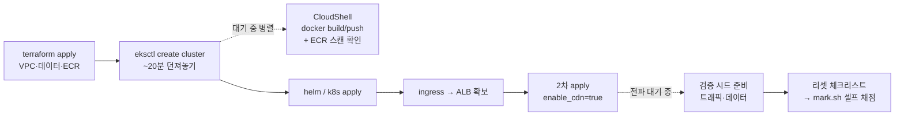

# 모의 대회 이론 — 시험 운영 전략

> 문서 유형: explanation

이 PART는 적용이 전부다. 운영 원칙만 짧게.

## 시간이 점수다 — 긴 것 먼저

4시간에서 대기 시간을 작업 시간으로 바꾸는 게 전략의 전부다. [../../reference/timings.md](../../reference/timings.md)의 소요표 기준:

eksctl 20분, CloudFront 전파 수 분, ECR 스캔 수 분 — 전부 **던져놓고 다른 일**을 한다.

## 막힘 규칙 — 15분 자력, 이후 유료 참조

- 막히면 **15분까지는 자력** (12-break-fix에서 만든 확인→원인→조치 사슬).
- 15분 초과 시 저장소 README 참조 허용 — 단 **참조한 순간 오답 노트에 기록**. 참조 없이 못 푼 것 = 대회장에서 못 푸는 것.

## mark가 시험지다

구현 전에 mark 항목 표(11-mutation-drill 훈련 ③ 산출물)를 머리에 올리고 시작한다. 채점 직전에는 [../../reference/mark-script-guide.md](../../reference/mark-script-guide.md)의 **리셋 체크리스트**를 기계적으로 수행 — 시연 데이터 정리(재현 절차는 정확히 1회), 상태 복원, 트래픽 시드, 임시 리소스 제거, 채점 신원 확인.

## 백지 도식이 이해의 증명

종료 후 아무것도 안 보고 아키텍처를 그린다 — **화살표마다 인증 방식 주석**(OAC SigV4 / 커스텀 헤더 / IRSA / IAM 역할)이 달려야 완성. 화살표의 인증을 모르면 break-fix ⑦⑧⑪을 대회장에서 못 푼다.

## 실수는 자산화한다

오답 노트 3열: **증상 / 원인 / 다음에 칠 명령.** 회고 없는 모의고사는 과금만 남는다.

---

## 퀴즈 (5문)

1. terraform apply 완료 직후 가장 먼저 던질 명령과 그 이유는?
2. 막힌 지 15분이 지났다. 규칙은?
3. 채점 직전 리셋 체크리스트 5항목 중 3개 이상 말해보라.
4. 시연 재현 절차를 두 번 실행하면 왜 오답인가 (set 실측)?
5. 백지 도식에서 화살표 주석으로 요구되는 것은?

### 정답

1. `eksctl create cluster` — 약 20분 소요라 가장 길다. 대기 중 CloudShell에서 docker build/push 병렬.
2. 저장소 README 참조 허용, 단 **오답 노트에 참조 사실과 항목을 기록**한다.
3. ① 시연 데이터 정리(S3 error/processed 비우기·DynamoDB 전삭제) ② 요구 상태 복원(READY·running·Pod/Node 수렴·weight 원복) ③ 트래픽 시드(Grafana 전 패널·`/log?level=` 호출) ④ 임시 리소스 제거(bastion·`_transfer/`) ⑤ 채점 신원 = 클러스터 생성자 확인.
4. 채점이 **개수를 본다** — 두 번 업로드하면 error 8건이 되어 기대 개수와 불일치 (mark-script-guide 실측).
5. **화살표별 인증 방식** — OAC(SigV4), CloudFront 커스텀 헤더 검증, IRSA/Pod Identity, IAM 역할 등.
