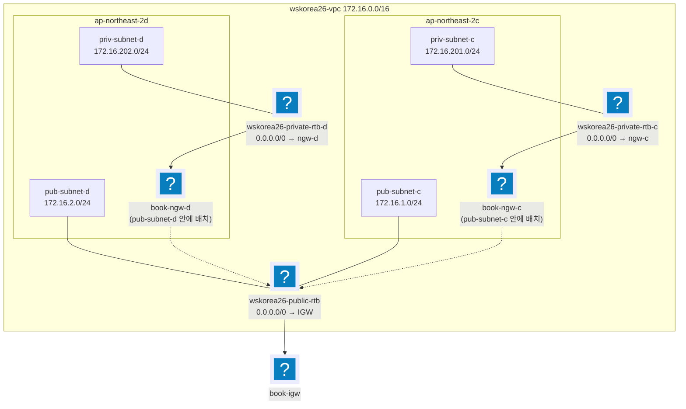

import { Quiz, QuizResults } from 'starlight-quiz/components';
import { Tabs, TabItem } from '@astrojs/starlight/components';

> 문서 유형: explanation

선행 지식과 학습 경로는 [모듈 개요](/part-1/01-terraform-vpc/)에.

이 문서는 set-02 task-1 실측 코드를 근거로, "채점 스크립트(mark.sh)가 무엇을 보는가" 관점으로 Terraform 문법과 VPC 를 정리한다.

블록 구조·참조 주소·의존성 그래프처럼 **HCL 을 읽는 법 자체**는 [hcl-basics](/start/hcl-basics/) 로 옮겼다. `resource "aws_vpc" "this"` 의 라벨 두 개가 각각 무엇인지 헷갈리면 그 문서를 먼저 본다.

---

## 1. provider / versions

**① 한 줄 정의** — provider 는 Terraform 이 AWS API 를 호출할 때 쓰는 플러그인이고, `required_providers` 블록으로 버전을 고정한다.

provider 가 `region` 을 갖는 이유, `~>` 버전 제약 표기, `default_tags` 의 병합 규칙은 [hcl-basics 의 provider 절](/start/hcl-basics/#provider-의-리전과-버전-고정)에 있다. 여기서는 set-02 가 그 두 블록을 실제로 어떻게 채웠는지를 본다.

**② 왜 필요한가 (채점 관점)** — 대회 규칙상 SW 버전은 최신 안정 버전으로 **고정**해야 한다(latest 금지). 또 리전이 틀리면 mark.sh가 리소스를 아예 못 찾아 전 항목 0점이 된다. 리전은 반드시 변수로 주입한다.

**③ 핵심 원리** — set-02 실측:

```hcl
terraform {
  required_version = ">= 1.6.0"
  required_providers {
    aws     = { source = "hashicorp/aws", version = "~> 6.54" }
    archive = { source = "hashicorp/archive", version = "~> 2.7" }
  }
}

provider "aws" {
  region = var.region            # ap-northeast-2 를 변수로
  default_tags {
    tags = { Project = "wskorea26", ManagedBy = "terraform" }
  }
}
```

<details class="diagram-note">
<summary>이 블록이 하는 일</summary>

모든 tf 코드가 시작하는 두 블록이다. `terraform` 블록은 CLI 와 프로바이더 버전을 고정해 같은 코드가 다른 결과를 내지 않게 하고, `provider` 블록은 리전과 공통 태그를 정한다. `default_tags` 는 이후 만드는 모든 리소스에 그 태그를 자동으로 붙인다 — 리소스마다 태그를 적을 필요가 없어진다.

</details>

**④ 변형 포인트** — 당일 과제의 약 30% 가 수정된다.

| 바뀌는 값 | 고칠 곳 | 확인 |
|---|---|---|
| 리전 | `terraform.tfvars` 의 `region` | `grep -rn "ap-northeast-2" *.tf` 0건 |
| 이름 prefix (`wskorea26` → `wsc2026`) | `terraform.tfvars` 의 prefix 변수 | `grep -rn "wskorea26" *.tf` 0건 |
| provider 최신 버전 | `versions.tf` 의 `required_providers` | `terraform init` 이 뽑은 버전이 `~>` 범위 안 |

provider 블록 자체는 세트가 바뀌어도 같은 모양이다. 바뀌는 것은 그 안에 들어가는 값뿐이므로 리전과 prefix 를 변수로 빼 둔다. set-03 은 같은 내용을 `providers.tf` 에 두었다 — 파일명은 자유고 내용이 채점 대상이다.

---

## 2. variable / tfvars / locals

**① 한 줄 정의** — `variable` 은 외부에서 주입 가능한 입력값, `terraform.tfvars` 는 그 값을 실제로 주입하는 파일, `locals` 는 내부 계산값이다. 세 블록의 우선순위와 tfvars 자동 로드 규칙은 [hcl-basics](/start/hcl-basics/)에 있다.

**② 왜 필요한가 (채점 관점)** — 대회 당일 공개 과제의 **약 30%가 수정**된다. 이름·CIDR·리전·비번호가 바뀌었을 때 tfvars 한 파일만 고치면 끝나도록 설계해야 한다. 특히 리소스 이름은 "정확 일치" 채점 항목이 많다 (예: mark 가 alias·Name 태그로 리소스를 역조회).

**③ 핵심 원리** — set-02 실측 패턴:

```hcl title="variables.tf"
# 기본값 정의
variable "player_number" {
  description = "비번호. S3 버킷 접미사(wskorea26-concert-bucket-<비번호>)에 사용"
  type        = string
  default     = "103"
}

variable "subnets" {
  type = map(object({
    cidr = string
    az   = string
    tier = string   # public | private
  }))
  default = {
    "wskorea26-pub-subnet-c"  = { cidr = "172.16.1.0/24",   az = "ap-northeast-2c", tier = "public" }
    "wskorea26-pub-subnet-d"  = { cidr = "172.16.2.0/24",   az = "ap-northeast-2d", tier = "public" }
    "wskorea26-priv-subnet-c" = { cidr = "172.16.201.0/24", az = "ap-northeast-2c", tier = "private" }
    "wskorea26-priv-subnet-d" = { cidr = "172.16.202.0/24", az = "ap-northeast-2d", tier = "private" }
  }
}
```

<details class="diagram-note">
<summary>이 블록이 하는 일</summary>

당일 바뀔 값을 한곳에 모은 변수 파일이다. 비번호는 문자열 변수 하나이고, 서브넷 4개는 이름을 키로 갖는 map 이다. 값 안의 `tier` 가 퍼블릭·프라이빗을 가르는 표시라 리소스 쪽 조건 분기가 이 데이터만 보고 결정된다. 변동 과제에서 이름·대역·AZ 가 바뀌면 고칠 곳이 이 블록 하나다.

</details>

```hcl title="terraform.tfvars"
# 대회 당일 바뀌는 값만 명시 주입
player_number = "103"
region        = "ap-northeast-2"
vpc_cidr      = "172.16.0.0/16"
```

```hcl title="data.tf"
# locals 로 파생값 계산
locals {
  bucket_name         = "${var.bucket_name_prefix}-${var.player_number}"
  public_subnet_keys  = [for k, v in var.subnets : k if v.tier == "public"]
  private_subnet_keys = [for k, v in var.subnets : k if v.tier == "private"]
}
```

<details class="diagram-note">
<summary>이 블록이 하는 일</summary>

`locals` 로 파생값을 미리 계산한다. 버킷 이름은 접두어와 비번호를 이어 붙인 것이고, 나머지 둘은 `for` 표현식으로 map 을 훑어 조건에 맞는 키만 골라낸 리스트다. 리소스 블록마다 같은 필터를 되풀이하지 않고 여기서 한 번만 정의한다.

</details>

핵심: **서브넷 이름을 map 의 key 로** 쓰면 이름·CIDR·AZ·tier 가 한 곳에 모이고, `for` + `if` 로 public/private 을 파생시킨다.

**④ 변형 포인트** — 당일 과제의 약 30% 가 수정된다.

| 바뀌는 값 | 고칠 곳 | 확인 |
|---|---|---|
| 비번호 | `terraform.tfvars` 의 `player_number` | `grep -rn "103" *.tf` 0건 |
| 리전·VPC CIDR | `terraform.tfvars` 의 `region`·`vpc_cidr` | `terraform plan` 이 VPC 만 교체 |
| 서브넷 개수·CIDR·AZ | `variables.tf` 의 `subnets` map | for_each 라 `vpc.tf` 무수정 |
| 버킷 이름 규칙 | `data.tf` 의 `local.bucket_name` | 접두어·비번호 조합이 한 곳 |

서브넷 4개가 6개로 늘어도 `subnets` map 에 항목을 더할 뿐 리소스 블록은 그대로다. 이름·CIDR·AZ·tier 가 map 한 곳에 모여 있기 때문이다. tfvars 로 map 전체를 갈아끼우는 것도 같은 이유로 가능하다.

---

## 3. data source / aws_iam_policy_document

**① 한 줄 정의** — data source 는 "만들지 않고 조회만" 하는 블록이고, `aws_iam_policy_document` 는 IAM/KMS/버킷 정책 JSON 을 HCL 로 조립해 주는 data source 다.

**② 왜 필요한가 (채점 관점)** — 계정 ID 를 하드코딩하면 지급 계정이 바뀌는 순간 정책이 전부 어긋난다. `aws_caller_identity` 로 조회한다. 정책을 JSON 문자열로 쓰지 않고 `aws_iam_policy_document` 로 조립하는 이유는 [hcl-basics 의 정책 JSON 설명](/start/hcl-basics/)에 있다.

**③ 핵심 원리**:

```hcl
data "aws_caller_identity" "current" {}
locals { account_id = data.aws_caller_identity.current.account_id }

data "aws_iam_policy_document" "lambda_assume" {
  statement {
    actions = ["sts:AssumeRole"]
    principals {
      type        = "Service"
      identifiers = ["lambda.amazonaws.com"]
    }
  }
}

resource "aws_iam_role" "book_lambda" {
  name               = "${var.lambda_function_name}-role"
  assume_role_policy = data.aws_iam_policy_document.lambda_assume.json
}
```

<details class="diagram-note">
<summary>이 블록이 하는 일</summary>

data 소스 두 종류의 쓰임이다. [`aws_caller_identity`](https://registry.terraform.io/providers/hashicorp/aws/latest/docs/data-sources/caller_identity) 는 지금 자격 증명의 계정 ID 를 조회해 하드코딩을 없애고, [`aws_iam_policy_document`](https://registry.terraform.io/providers/hashicorp/aws/latest/docs/data-sources/iam_policy_document) 는 JSON 을 문자열로 쓰는 대신 HCL 로 조립해 `.json` 속성으로 내준다. [`aws_iam_role`](https://registry.terraform.io/providers/hashicorp/aws/latest/docs/resources/iam_role) 블록은 그 결과를 신뢰 정책으로 받는다 — 오타가 나면 apply 가 아니라 plan 단계에서 걸린다.

</details>

set-02 의 KMS 키 정책은 여기서 만든 문서를 `source_policy_documents` 로 상속해 공통 root statement 를 나눠 쓴다 — 실물은 [모듈 02 이론의 키 정책 절](/part-1/02-kms-s3-cloudfront/theory/)에 있다.

**④ 변형 포인트** — 당일 과제의 약 30% 가 수정된다.

| 바뀌는 값 | 고칠 곳 | 확인 |
|---|---|---|
| 지급 계정 ID | 고칠 곳 없음 — `aws_caller_identity` 가 조회 | `grep -rn "[0-9]\{12\}" *.tf` 0건 |
| 신뢰하는 서비스 principal | `aws_iam_policy_document` 의 `principals` | `terraform plan` 이 정책 diff 만 표시 |
| 유의사항이 root·`kms:*` 를 금지 | 키 정책 statement 를 개별 액션으로 전개 | [kms-basics 의 root-less 키 정책](/start/kms-basics/#1-set-03-유형-root-less-kms-키-정책) |

set-03 은 같은 `aws_caller_identity` 의 계정 ID 를 KMS 키 정책의 `kms:CallerAccount` 조건에 넣어 root ARN 없이 계정 위임을 표현한다. 이 root-less 키 정책은 모듈 02 에서 다룬다.

---

## 4. for_each

**① 한 줄 정의** — `for_each` 는 map/set 을 돌며 리소스를 여러 개 만들고, 각 인스턴스를 `리소스[key]` 로 참조하게 한다.

**② 왜 필요한가 (채점 관점)** — 서브넷 4개를 복붙하면 30% 변동 시 4곳을 고쳐야 한다. for_each 면 변수 map 만 고친다. 또 `count` 와 달리 key 기반이라 중간 요소를 빼도 나머지가 재생성되지 않는다.

**③ 핵심 원리** — set-02 vpc.tf 실측:

```hcl
resource "aws_subnet" "this" {
  for_each = var.subnets

  vpc_id                  = aws_vpc.this.id
  cidr_block              = each.value.cidr
  availability_zone       = each.value.az
  map_public_ip_on_launch = each.value.tier == "public"
  tags                    = { Name = each.key }   # 서브넷 이름 = map key
}

# list 는 toset() 으로 감싸야 for_each 가능
resource "aws_route_table_association" "public" {
  for_each       = toset(local.public_subnet_keys)
  subnet_id      = aws_subnet.this[each.key].id
  route_table_id = aws_route_table.public.id
}
```

<details class="diagram-note">
<summary>이 블록이 하는 일</summary>

`for_each` 의 두 가지 입력 형태다. 위쪽은 [`aws_subnet`](https://registry.terraform.io/providers/hashicorp/aws/latest/docs/resources/subnet) 이 map 을 그대로 받아 `each.key`(이름)와 `each.value.*`(속성)를 쓰고, 아래쪽 [`aws_route_table_association`](https://registry.terraform.io/providers/hashicorp/aws/latest/docs/resources/route_table_association) 은 리스트를 `toset()` 으로 감싸 받는다 — `for_each` 는 리스트를 거부하기 때문이다. `aws_subnet.this[each.key]` 처럼 키로 인스턴스를 지목하는 참조도 여기서 나온다.

</details>

- map 이면 `each.key` / `each.value`, set 이면 둘 다 같은 값.
- 참조는 `aws_subnet.this["wskorea26-priv-subnet-c"].id` 식.

**④ 세트별 차이** — 없음. 모든 세트에서 서브넷·NAT·RTB 는 이 패턴이다.

---

## 5. VPC 아키텍처 (set-02 :badge[실측]{variant=note})

**① 한 줄 정의** — `wskorea26-vpc`(172.16.0.0/16)에 AZ c/d 로 public 2 + private 2 서브넷을 두고, public 은 IGW 공용 RTB 1개, private 은 AZ별 NAT + AZ별 RTB 2개로 라우팅한다.

`/16` 같은 CIDR 표기, AZ(가용 영역), IGW·NAT GW·RTB(라우트 테이블)가 각각 무엇인지는 [vpc-basics](/start/vpc-basics/)에 정의가 있다. IGW 와 NAT GW 의 역할 차이만 다시 보려면 [그 문서의 IGW와 NAT GW 절](/start/vpc-basics/#igw와-nat-gw)로 간다.

**② 왜 필요한가 (채점 관점)** — mark 1-1 은 CIDR 을, **mark 1-2 는 "RTB↔서브넷 연결"과 기본 라우트의 GatewayId(IGW)·NatGatewayId(NAT)를 그대로 검사**한다. 서브넷이 엉뚱한 RTB 에 붙어 있으면 인터넷이 되더라도 감점이다.

**③ 핵심 원리**:



<details class="diagram-note">
<summary>이 도식이 보여주는 것</summary>

set-02 VPC 의 완성 형태다. AZ 두 곳에 퍼블릭·프라이빗 서브넷이 하나씩이고, NAT 는 각 AZ 의 **퍼블릭** 서브넷 안에 배치된다. 퍼블릭 RTB 는 하나를 두 서브넷이 공유하지만 프라이빗 RTB 는 AZ 마다 따로다 — 각자 같은 AZ 의 NAT 를 가리켜야 AZ 하나가 죽어도 다른 AZ 가 살기 때문이다. 점선은 NAT 가 나가는 경로가 결국 퍼블릭 RTB 를 거쳐 IGW 로 간다는 뜻이다. 채점은 이 RTB↔서브넷 연결을 이름이 아니라 실제 매핑으로 확인한다.

</details>

RTB 는 총 **3개**: public 공용 1 + private AZ별 2. NAT 는 **같은 AZ 의 public 서브넷에** 배치한다 (AZ 장애 격리). 실측 코드의 매핑 로직:

```hcl
locals {
  # private 키 → AZ 접미사(c/d): NAT/RTB 이름에 사용
  private_az_suffix = { for k, v in var.subnets : k => substr(v.az, -1, 1) if v.tier == "private" }
  # AZ → public 키: NAT 를 같은 AZ 의 public 서브넷에 배치
  public_by_az = { for k in local.public_subnet_keys : var.subnets[k].az => k }
}

resource "aws_nat_gateway" "this" {
  for_each      = toset(local.private_subnet_keys)
  allocation_id = aws_eip.nat[each.key].id
  subnet_id     = aws_subnet.this[local.public_by_az[var.subnets[each.key].az]].id
  tags          = { Name = "${var.nat_name_prefix}-${local.private_az_suffix[each.key]}" }
  depends_on    = [aws_internet_gateway.this]
}
```

<details class="diagram-note">
<summary>이 블록이 하는 일</summary>

[`aws_nat_gateway`](https://registry.terraform.io/providers/hashicorp/aws/latest/docs/resources/nat_gateway) 를 AZ 별로 짝지어 만드는 부분이다. `private_az_suffix` 는 AZ 이름의 마지막 글자(c·d)를 뽑아 리소스 이름에 쓰고, `public_by_az` 는 AZ 를 키로 퍼블릭 서브넷을 찾는 역방향 map 이다. 그래서 `subnet_id` 한 줄이 "이 프라이빗 서브넷과 같은 AZ 의 퍼블릭 서브넷"을 가리킬 수 있다. `depends_on` 이 필요한 이유는 IGW 가 붙기 전에 NAT 를 만들면 실패하기 때문이다.

</details>

`aws_route` 를 `aws_route_table` 의 인라인 route 블록 대신 별도 리소스로 쓰는 이유: 라우트를 나중에 추가/변경해도 RTB 자체(=연결)가 흔들리지 않는다.

**④ 세트별 차이** — CIDR(172.16 vs 10.x), AZ 쌍(a/b vs c/d), 서브넷 수, NAT 개수(1개 공용 vs AZ별)가 바뀐다. 이 실측 코드는 전부 변수·locals 파생이라 tfvars 교체로 흡수된다.

---

## 6. output → .env 영속화

**① 한 줄 정의** — `output` 은 apply 결과값(ID·ARN·DNS)을 외부로 내보내는 통로이며, 대회에서는 이를 `.env` 파일로 박아 터미널이 끊겨도 재사용한다.

**② 왜 필요한가 (채점 관점)** — 대회 환경은 재시동 시 파일이 초기화되고 CloudShell 세션이 끊긴다. eksctl YAML 렌더링·kubectl 치환·채점 확인 명령이 전부 output 값을 쓴다. 매번 콘솔에서 복사하면 그만큼 작성 시간을 잃는다. bastion 에는 Terraform 을 안 올리고 `outputs.json` 만 올려 jq 로 읽는 것이 저장소 규칙이다.

**③ 핵심 원리** — set-02 README 실측:

<Tabs syncKey="shell">
  <TabItem label="PowerShell">
  ```powershell
  terraform output -json | Set-Content ..\outputs.json

  $env:ACCOUNT_ID    = terraform output -raw account_id
  $env:VPC_ID        = terraform output -raw vpc_id
  $env:PRIV_SUBNET_C = (terraform output -json private_subnet_ids | ConvertFrom-Json).'wskorea26-priv-subnet-c'
  # ... 을 .env.ps1 로 저장 → 새 터미널에서 `. .\.env.ps1` 만 재실행
  ```

  <details class="diagram-note">
  <summary>이 블록이 하는 일</summary>

  apply 결과를 다음 단계로 넘기는 방법이다. `terraform output -raw` 는 따옴표 없는 값을 내므로 환경 변수에 바로 넣을 수 있고, map 출력은 `-json` 으로 받아 `ConvertFrom-Json` 으로 키를 지목한다. 이 값들을 `.env.ps1` 로 저장해 두면 새 터미널에서 점 하나로 복원된다 — 04 이후 모든 모듈이 이 변수들을 전제한다.

  </details>
  </TabItem>
  <TabItem label="Bash (Linux/CloudShell)">
  ```bash
  terraform output -json > outputs.json
  export VPC_ID=$(jq -r '.vpc_id.value' outputs.json)
  export PRIV_SUBNET_C=$(jq -r '.private_subnet_ids.value["wskorea26-priv-subnet-c"]' outputs.json)
  ```
  </TabItem>
</Tabs>

map output 은 `-json` + jq/ConvertFrom-Json, 단일 문자열은 `-raw` 를 쓴다.

**④ 세트별 차이** — output 목록만 다르다(세트가 쓰는 서비스에 따라). "output 으로 뽑고 .env 로 영속화" 패턴 자체는 전 세트 공통.

---

## 자기 점검 퀴즈

<Quiz title="라우트 테이블 개수와 연결">
set-02 VPC 의 라우트 테이블 개수와 서브넷 연결로 옳은 것은?

- [x] 3개 — 공용 public RTB 1개(pub-subnet-c/d 둘 다), private RTB 2개(priv-subnet-c/d 에 AZ별로 하나씩)
- [ ] 2개 — public 공용 1개 + private 공용 1개
  > NAT 를 AZ별로 두었으므로 private RTB 도 AZ별로 갈라져야 한다. private 을 공용 RTB 하나로 묶으면 한쪽 AZ 트래픽이 반대편 AZ 의 NAT 를 타고 나가 AZ 격리가 깨진다.
- [ ] 4개 — 서브넷 하나당 RTB 하나
  > public 2개는 똑같은 `0.0.0.0/0 → IGW` 라우트를 쓰므로 나눌 이유가 없다. 요구되지 않은 리소스는 감점 사유이기도 하다.
- [ ] 1개 — VPC 기본 RTB 에 IGW 라우트와 NAT 라우트를 함께 등록

**3개.** `wskorea26-public-rtb`(공용) ← pub-subnet-c/d 2개, `wskorea26-private-rtb-c` ← priv-subnet-c, `wskorea26-private-rtb-d` ← priv-subnet-d. 이 매핑 자체가 mark 1-2 채점 대상이다.

mark 1-2 는 "RTB↔서브넷 연결"과 기본 라우트의 GatewayId(IGW)·NatGatewayId(NAT)를 그대로 검사한다. 인터넷이 실제로 되더라도 서브넷이 엉뚱한 RTB 에 붙어 있으면 감점이다.
</Quiz>

<Quiz title="NAT Gateway 배치">
NAT Gateway 는 어디에 배치해야 하며, 그 이유는?

- [x] 같은 AZ 의 public 서브넷 — NAT 자신이 IGW 로 나가야 하고, AZ별로 나눠야 AZ 장애가 격리된다
- [ ] 트래픽을 내보낼 private 서브넷 안 — 같은 서브넷이어야 라우팅이 성립한다
  > NAT 가 private 에 있으면 NAT 자신이 인터넷으로 나갈 경로가 없다. 라우팅은 RTB 가 하는 일이라 NAT 와 인스턴스가 같은 서브넷일 필요는 전혀 없다.
- [ ] public 서브넷 한 곳에 공용 NAT 1개 — 비용이 절반이다
  > 비용은 줄지만 그 AZ 가 죽으면 반대편 AZ 의 private 서브넷까지 아웃바운드를 잃는다. set-02 실측은 AZ별 NAT 2개(`book-ngw-c` / `book-ngw-d`)다.
- [ ] 서브넷이 아니라 VPC 에 직접 붙인다 — IGW 와 같은 방식

**같은 AZ 의 public 서브넷.** NAT 자신이 IGW 로 나가야 하므로 public 에 있어야 하고, AZ별로 나눠 AZ 장애를 격리한다.

실측 코드는 `public_by_az` 맵("AZ → public 키")을 만든 뒤 private 키의 AZ 로 같은 AZ 의 public 서브넷을 찾아 NAT 의 `subnet_id` 에 넣는다. `depends_on = [aws_internet_gateway.this]` 도 함께 붙는다 — IGW 가 먼저 있어야 EIP 가 인터넷으로 나갈 수 있기 때문.
</Quiz>

<Quiz title="for_each 가 받는 타입">
`for_each = local.private_subnet_keys` 는 list 라서 apply 가 거부된다. for_each 는 map 또는 set 만 받으므로, list 를 set 으로 바꾸는 함수로 감싸야 한다. 그 함수 이름은 [[toset]] 이다.

---

`for_each = toset(local.private_subnet_keys)`.

- map 을 넘기면 `each.key`(키)와 `each.value`(값)가 서로 다르고, set 을 넘기면 둘이 같은 값이다.
- `count` 대신 for_each 를 쓰는 이유도 함께 기억할 것: key 기반이라 map 중간 요소를 빼도 나머지 인스턴스가 재생성되지 않는다.
- 참조는 인덱스가 아니라 키로 — `aws_subnet.this["wskorea26-priv-subnet-c"].id`.
</Quiz>

<Quiz title="계정 ID 조회">
계정 ID 를 하드코딩하면 지급 계정이 바뀌는 순간 정책이 전부 어긋난다. 하드코딩 대신 선언하는 data source 의 타입 이름은 [[aws_caller_identity]] 이고, `data.<타입>.current.account_id` 로 참조한다.

---

`data "aws_caller_identity" "current"` 를 선언하고 `data.aws_caller_identity.current.account_id` 로 쓴다. 보통 `locals` 에 `account_id` 로 한 번 담아 재사용한다.

set-03 은 이 계정 ID 를 root-less KMS 키 정책에서 한 번 더 쓴다 — 관리자 `Principal` 을 `"*"` 로 두고 `kms:CallerAccount` 조건에 계정 ID 를 넣어, `:root` 문자열 없이 "내 계정에서 온 호출"만 통과시킨다. 구조는 [kms-basics](/start/kms-basics/#1-root-less-키-정책-실물--적용된-json)에 실물 JSON 으로 있다.
</Quiz>

<Quiz title="map output 에서 값 꺼내기">
`terraform output -json private_subnet_ids` 결과에서 `wskorea26-priv-subnet-c` 의 값을 꺼내는 명령은?

- [x] `terraform output -json private_subnet_ids | jq -r '.["wskorea26-priv-subnet-c"]'`
- [ ] `terraform output -raw private_subnet_ids`
  > `-raw` 는 단일 문자열 output 전용이다. map/list output 에 쓰면 에러가 난다.
- [ ] `terraform output -json private_subnet_ids | jq -r '.private_subnet_ids.value["wskorea26-priv-subnet-c"]'`
  > `.<이름>.value` 래퍼는 output 이름 없이 전체를 덤프할 때(`terraform output -json`)의 구조다. 특정 output 이름을 지정하면 그 값만 나오므로 래퍼를 또 벗기면 null 이다.
- [ ] `terraform output private_subnet_ids | jq -r '."wskorea26-priv-subnet-c"'`
  > `-json` 없이 출력하면 JSON 이 아니라 사람이 읽는 HCL 형식이라 jq 가 파싱하지 못한다.

`terraform output -json private_subnet_ids | jq -r '.["wskorea26-priv-subnet-c"]'`.

`outputs.json` 파일을 경유하는 저장소 규칙(`terraform output -json > outputs.json`)에서는 전체 덤프라 `.value` 래퍼가 붙는다 — `jq -r '.private_subnet_ids.value["wskorea26-priv-subnet-c"]' outputs.json`.

**map output 은 `-json` + jq/ConvertFrom-Json, 단일 문자열은 `-raw`.**
</Quiz>

<QuizResults confetti />
