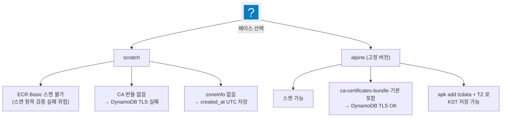
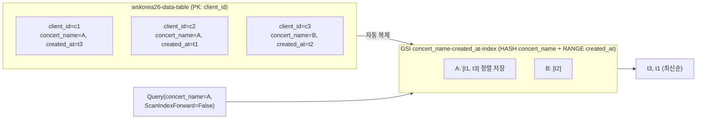
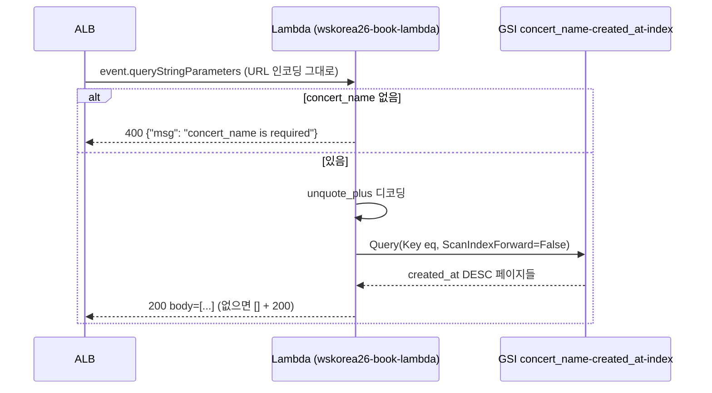

import { Quiz, QuizResults } from 'starlight-quiz/components';

> 문서 유형: explanation

선행 지식과 학습 경로는 [모듈 개요](/part-1/03-container-lambda-dynamodb/)에.

이 모듈의 채점은 "실제 출력값 비교"가 많다(created_at 시각, JSON 키 순서, 비ASCII 문자, 평균값 자릿수). 인프라가 떠 있어도 출력이 1글자 다르면 0점 — 함정을 사실 단위로 암기한다.

---

## 1. Dockerfile 베이스 이미지 선택

**① 한 줄 정의** — 베이스 이미지는 컨테이너의 OS 레이어이며, 선택에 따라 취약점 스캔 가능 여부·TLS 신뢰 저장소·타임존 데이터가 결정된다. 이미지·레이어·`FROM` 같은 Dockerfile 기본기는 [docker-basics](/start/docker-basics/)에 있다.

**② 왜 필요한가 (채점 관점)** — mark 3-1 은 "ECR 스캔 결과에 Critical/High 없음"을 검사한다. 그런데 **scratch 베이스는 ECR 기본 스캔이 아예 스캔하지 못한다**(`UNSUPPORTED_IMAGE`) — 취약점이 없어서가 아니라 OS 패키지 DB 가 없어서. 스캔 불가는 "스캔 통과"가 아니다.

**③ 핵심 원리**:



<details class="diagram-note">
<summary>이 도식이 보여주는 것</summary>

베이스 이미지 선택이 만드는 결과를 갈라 놓았다. `scratch` 는 가볍지만 ECR Basic 스캔이 안 되고, CA 번들이 없어 DynamoDB TLS 연결이 실패하며, zoneinfo 가 없어 시각이 UTC 로 저장된다 — 세 가지가 모두 채점 항목과 직접 부딪힌다. 고정 버전 alpine 은 셋을 각각 해결한다.

</details>

set-02 실측 Dockerfile 전문:

```dockerfile title="Dockerfile"
# syntax=docker/dockerfile:1
FROM alpine:3.24.1

RUN apk add --no-cache tzdata && adduser -D -u 10001 book

ENV TZ=Asia/Seoul

COPY --chmod=755 book /book

USER book
EXPOSE 8080
ENTRYPOINT ["/book"]
```

<details class="diagram-note">
<summary>이 블록이 하는 일</summary>

위 판단을 그대로 반영한 Dockerfile 이다. `tzdata` 설치와 `TZ=Asia/Seoul` 이 짝이라 둘 중 하나만 있으면 시각이 KST 로 저장되지 않는다. `adduser` 와 `USER book` 은 루트로 실행하지 않기 위한 것이고, `COPY --chmod=755` 는 복사와 실행 권한 부여를 한 줄로 끝낸다. 베이스 태그를 `3.24.1` 로 고정한 이유는 스캔 결과가 빌드 시점마다 달라지지 않게 하려는 것이다.

</details>

각 줄의 채점 근거:
- `alpine:3.24.1` **고정 버전** — latest 금지 규칙 + 스캔 재현성.
- `tzdata` + `TZ=Asia/Seoul` — 제공된 book 은 tzdata 를 내장하지 않은 Go 바이너리. zoneinfo 가 없으면 `time.LoadLocation` 이 실패해 **created_at 이 UTC 로 저장 → mark 9-2(시각 비교) 실패**.
- `adduser -D -u 10001` + `USER book` — 비루트 실행 (보안 채점 표준).
- `COPY --chmod=755` — 제공 바이너리 실행권한 보장.

**스캔에서 High 가 나오면**: `RUN apk upgrade --no-cache` 한 줄을 추가해 재빌드/재푸시한다 (set-02 README 실측 대응).

:::caution[빌드 환경]
대회 PC(Windows, Docker/WSL 불가)에서는 빌드 불가 → **기본 CloudShell** 에서 빌드한다. CloudShell 은 amd64 네이티브라 단일 아키텍처 이미지가 되고 스캔과 호환된다. (VPC CloudShell 은 홈이 비영속이고 업로드 메뉴를 못 써 빌드 작업에 부적합하다 — 기본 CloudShell 사용.)
:::

**④ 세트별 차이** — 앱 언어/포트/태그가 바뀌지만 "고정 버전 alpine + tzdata/TZ + 비루트 + CloudShell(amd64) 빌드" 골격은 공통.

---

## 2. ECR

**① 한 줄 정의** — ECR 은 프라이빗 컨테이너 레지스트리로, push 시 자동 스캔(scanOnPush)과 KMS 저장 암호화를 설정한다.

**② 왜 필요한가 (채점 관점)** — mark 3-1: scanOnPush + `encryptionType == KMS` + Critical/High 없음. 그리고 **태그는 요구된 것만**(예: `stable` 또는 `v1.0.0`) — 습관적으로 `latest` 를 추가로 push 하면 불필요 리소스 감점.

**③ 핵심 원리** — set-02 실측:

```hcl title="ecr.tf"
resource "aws_ecr_repository" "book" {
  name         = "wskorea26-book-repo"
  force_delete = true                      # destroy 시 이미지째 삭제

  image_scanning_configuration {
    scan_on_push = true
  }
  encryption_configuration {
    encryption_type = "KMS"                # kms_key 미지정 = 관리형 aws/ecr
  }
}
```

<details class="diagram-note">
<summary>이 블록이 하는 일</summary>

[`aws_ecr_repository`](https://registry.terraform.io/providers/hashicorp/aws/latest/docs/resources/ecr_repository) 의 세 설정이다. `scan_on_push` 가 켜져 있어야 push 직후 취약점 스캔이 돌고, `encryption_type = "KMS"` 는 키를 지정하지 않아 관리형 `aws/ecr` 키를 쓴다. `force_delete` 는 이미지가 남아 있어도 destroy 가 리포지토리를 지우게 한다 — 없으면 정리 단계에서 막힌다.

</details>

push·스캔 확인 흐름 (CloudShell 실측):

```bash
aws ecr get-login-password | docker login --username AWS --password-stdin "$ACCOUNT_ID.dkr.ecr.ap-northeast-2.amazonaws.com"
docker build -t "$ECR:stable" .
docker push "$ECR:stable"

aws ecr wait image-scan-complete --repository-name wskorea26-book-repo --image-id imageTag=stable
aws ecr describe-image-scan-findings --repository-name wskorea26-book-repo --image-id imageTag=stable \
  --query 'imageScanFindings.findingSeverityCounts'
# 기대: CRITICAL/HIGH 키가 없어야 함
```

<details class="diagram-note">
<summary>이 블록이 하는 일</summary>

빌드부터 스캔 확인까지의 표준 흐름이다. 로그인 대상은 리포지토리가 아니라 레지스트리 주소이고, push 뒤에는 `wait` 로 스캔 완료를 기다린 다음 심각도 집계를 본다. `CRITICAL`·`HIGH` 키가 아예 없어야 통과라, 키가 나오면 베이스 패키지를 갱신해 다시 빌드한다.

</details>

**④ 세트별 차이** — set-02 는 ECR 용 CMK 이름이 없어 관리형 aws/ecr, set-03 은 `wsc2026-ecr-kms` CMK 를 만들어 지정. 태그 이름(stable vs v1.0.0)도 과제지 따라간다.

---

## 3. DynamoDB 테이블 설계 — PK + GSI

**① 한 줄 정의** — 테이블은 PK(`client_id`)로 항목을 식별하고, 다른 축의 정렬 조회는 GSI(HASH `concert_name` + RANGE `created_at`)로 푼다.

PK(파티션 키)·GSI(글로벌 보조 인덱스)·Query 와 Scan 의 차이가 처음이면 [dynamodb-basics](/start/dynamodb-basics/)를 먼저 본다 — [기본 키 절](/start/dynamodb-basics/#2-2-기본-키--파티션-키와-정렬-키)과 [GSI 절](/start/dynamodb-basics/#2-3-gsi--기본-키-밖의-축으로-조회하기)이 이 문단이 전제하는 내용이다.

**② 왜 필요한가 (채점 관점)** — 요구가 "콘서트별 예매를 **데이터베이스 레벨 최신순**으로 조회"다. Scan+애플리케이션 정렬은 요구 위반. GSI 의 RANGE 키 정렬을 Query 로 써야 한다. mark 4-1 은 테이블 암호화 CMK 도 alias 로 역조회한다.

**③ 핵심 원리**:



<details class="diagram-note">
<summary>이 도식이 보여주는 것</summary>

GSI 가 왜 필요한지 데이터로 보여 준다. 테이블은 `client_id` 로만 항목을 찾을 수 있어 "공연별 최신순"을 물을 방법이 없다. GSI 는 같은 항목들을 `concert_name` 으로 묶고 `created_at` 순으로 정렬해 따로 저장하므로, `ScanIndexForward=False` 를 준 Query 하나로 최신순 결과가 나온다. 애플리케이션에서 정렬하는 방식과 달리 정렬이 DB 안에서 끝난다.

</details>

set-02 실측:

```hcl title="dynamodb.tf"
resource "aws_dynamodb_table" "data" {
  name                        = "wskorea26-data-table"
  billing_mode                = "PAY_PER_REQUEST"
  hash_key                    = "client_id"
  deletion_protection_enabled = true       # 삭제방지 — destroy 전 해제 필요

  attribute {
    name = "client_id"
    type = "S"
  }
  attribute {
    name = "concert_name"
    type = "S"
  }
  attribute {
    name = "created_at"
    type = "S"
  }
  # 비키 속성(username/email/booking_id)은 스키마리스 — 정의하지 않는다

  global_secondary_index {
    name = "concert_name-created_at-index"

    key_schema {
      attribute_name = "concert_name"
      key_type       = "HASH"
    }
    key_schema {
      attribute_name = "created_at"
      key_type       = "RANGE"
    }

    projection_type = "ALL"
  }

  server_side_encryption {
    enabled     = true
    kms_key_arn = aws_kms_key.dynamodb.arn   # mark 4-1
  }
  point_in_time_recovery { enabled = true }
}
```

<details class="diagram-note">
<summary>이 블록이 하는 일</summary>

[`aws_dynamodb_table`](https://registry.terraform.io/providers/hashicorp/aws/latest/docs/resources/dynamodb_table) 정의 한 벌이다. `attribute` 블록에는 키로 쓰는 속성 셋만 적는다 — 나머지 필드는 스키마리스라 선언하지 않는다. GSI 는 `concert_name` 을 HASH, `created_at` 을 RANGE 로 두어 정렬 축을 만들고 `projection_type = "ALL"` 로 모든 필드를 함께 복제한다. 삭제방지·SSE·PITR 셋이 각각 별도 채점 항목이다.

나머지 두 필드도 한 줄씩 붙인다. `billing_mode = "PAY_PER_REQUEST"` 는 읽기·쓰기 용량을 미리 잡아 두지 않고 요청 건수만큼 과금하는 온디맨드 모드다. 대회처럼 트래픽을 예측할 수 없고 몇 시간만 띄우는 환경에서는 용량 산정 자체가 필요 없어진다. `point_in_time_recovery` 는 최근 35일 중 임의 시각으로 테이블을 되돌리는 연속 백업이고, 켜기만 하면 별도 설정이 없다.

</details>

- `attribute` 는 **키로 쓰는 속성만** 정의한다. 비키 속성을 정의하면 오히려 validate 에러.
- `deletion_protection_enabled = true` 는 채점 항목이자 destroy 함정 — 삭제 전 false 로 바꿔 apply 해야 한다.

:::danger[boto3 Decimal 함정 (set-02 task-2 module-1 실측)]
DynamoDB 숫자에 Python float 를 넣으면 **boto3 가 저장 자체를 거부**한다 — `TypeError: Float types are not supported. Use Decimal types instead.` 값이 어긋나서가 아니라 저장에서 예외로 죽는다(`483/5` 는 float 로도 정확히 `96.6` 이다). 왜 이렇게 되어 있는지는 [dynamodb-basics 의 Decimal 절](/start/dynamodb-basics/#숫자는-decimal-로-오간다)에 있다.
:::

반드시:

```python
from decimal import Decimal
average = Decimal(str(sum(scores.values()))) / Decimal("5")   # 정확히 96.6
item[field] = Decimal(str(score))                              # 저장 시에도 Decimal
```

**④ 세트별 차이** — 테이블명·키 속성명·GSI 축이 바뀐다. "요구된 조회 패턴 → GSI HASH/RANGE 결정" 사고 과정은 동일.

---

## 4. Lambda — ALB 통합 조회 함수

**① 한 줄 정의** — ALB Lambda 타깃 함수는 입력·처리·출력이 각각 정해져 있다.

입력은 ALB 가 넘기는 이벤트의 `queryStringParameters` 다. 처리는 그 값으로 GSI 를 Query 하는 것이다. 출력은 평범한 JSON 이 아니라 `statusCode`·`headers`·`isBase64Encoded` 를 갖춘 객체다 — ALB 가 이 필드들을 읽어 HTTP 응답을 조립하므로, 하나라도 빠지면 함수가 성공해도 ALB 가 502 를 낸다.

"누가 부르느냐로 Lambda 의 이벤트 모양이 갈린다"는 전제는 [serverless-basics 의 Lambda 절](/start/serverless-basics/#1-lambda--누가-부르느냐로-동작이-갈린다)에 있다.

**② 왜 필요한가 (채점 관점)** — mark 9-2 는 실제 HTTP 응답 본문을 **기대 출력과 문자열 수준으로 비교**한다. 최신순 정렬, JSON 키 순서, 비ASCII(`akaね`) 보존, 400/빈배열 처리까지 전부 점수다. 연결 정보 하드코딩은 별도 감점(환경변수 주입 필수).

**③ 핵심 원리**:



<details class="diagram-note">
<summary>이 도식이 보여주는 것</summary>

요청 하나가 함수 안에서 갈라지는 두 갈래다. `concert_name` 이 없으면 조회하지 않고 400 을 낸다. 있으면 먼저 `unquote_plus` 로 디코딩하는데, ALB 가 값을 인코딩된 채로 넘기기 때문이다 — 이 단계를 빠뜨리면 `2ND%20TINY_CON` 이라는 이름을 찾게 돼 결과가 늘 비어 나온다. 조회 결과가 없을 때도 오류가 아니라 빈 배열과 200 이다.

</details>

set-02 실측 핸들러의 채점 포인트별 코드:

```python title="lambda/index.py"
import json, os
from urllib.parse import unquote_plus
import boto3
from boto3.dynamodb.conditions import Key

table = boto3.resource("dynamodb").Table(os.environ["TABLE_NAME"])   # 하드코딩 금지 — env 주입
index_name = os.environ.get("INDEX_NAME", "concert_name-created_at-index")

# mark 9-2 기대 출력과 동일한 키 순서 (json.dumps 는 dict 삽입 순서 유지)
_KEYS = ["username", "created_at", "email", "booking_id", "client_id", "concert_name"]

def _response(status, body):
    return {
        "statusCode": status,
        "statusDescription": f"{status} {_STATUS_TEXT.get(status, '')}",  # "200 OK"
        "isBase64Encoded": False,
        "headers": {"Content-Type": "application/json"},
        "body": json.dumps(body, ensure_ascii=False, default=str),  # "akaね" 그대로
    }

def handler(event, context):
    params = event.get("queryStringParameters") or {}
    concert_name = params.get("concert_name")
    if not concert_name:
        return _response(400, {"msg": "concert_name is required"})
    concert_name = unquote_plus(concert_name)   # ALB 는 디코딩 없이 전달 (2ND%20TINY_CON)
    kwargs = {
        "IndexName": index_name,
        "KeyConditionExpression": Key("concert_name").eq(concert_name),
        "ScanIndexForward": False,   # created_at DESC = DB 레벨 최신순
    }
    # LastEvaluatedKey 페이지네이션 루프 후:
    return _response(200, [{k: item.get(k) for k in _KEYS} for item in items])
```

<details class="diagram-note">
<summary>이 블록이 하는 일</summary>

핸들러가 채점 항목을 어떻게 만족시키는지가 다 들어 있다. 테이블·인덱스 이름은 환경 변수로 받아 하드코딩을 피하고, `_KEYS` 순서대로 딕셔너리를 만들어 응답 필드 순서를 기대 출력과 맞춘다. `ensure_ascii=False` 라야 한글·일본어가 이스케이프되지 않고, `ScanIndexForward=False` 가 최신순 정렬을 DB 쪽에서 끝낸다. 응답은 ALB 규격 네 필드를 갖춘다.

</details>

사실 단위 정리:
- **ScanIndexForward=False** — 애플리케이션 sort() 가 아니라 인덱스 정렬로 최신순 ("데이터베이스 레벨" 요구 충족).
- **키 순서** — `{k: item.get(k) for k in _KEYS}` 로 재조립. DynamoDB 반환 순서는 보장되지 않는다.
- **ensure_ascii=False** — 기본값(True)이면 `"akaね"` 로 나가 문자열 비교 실패.
- **queryStringParameters 없으면 400 / 결과 없으면 [] + 200** — 예외가 아니라 명세.
- **env 주입** — Terraform 에서 `TABLE_NAME = aws_dynamodb_table.data.name` (mark 6-1 이 env 검사).
- **`LastEvaluatedKey` 루프** — Query 한 번이 돌려주는 양은 최대 1MB 다. 1MB 를 넘으면 DynamoDB 가 거기서 끊고 다음 시작점을 `LastEvaluatedKey` 로 돌려주므로, 그 값이 나오는 동안 `ExclusiveStartKey` 에 넣어 다시 Query 해야 전체가 모인다. 이 루프를 빼면 예약이 많은 공연에서만 결과가 잘려 나가 재현이 어려운 감점이 된다.

Terraform 측 (set-02 `lambda.tf` 파일 실측 요지) — `archive_file` 로 zip 을 만들고, 실행역할은 최소권한 3-statement 로 짠다.

| statement | 액션 | 리소스 |
|---|---|---|
| 테이블 조회 | `dynamodb:Query` | 테이블 + `/index/*` |
| 로그 | `logs:CreateLogStream`, `logs:PutLogEvents` | 자체 로그그룹 |
| 복호화 | `kms:Decrypt` | 테이블 CMK |

SSE-KMS 테이블은 **Query 만 해도 `kms:Decrypt` 가 필요**하다.

```hcl
environment {
  variables = {
    TABLE_NAME = aws_dynamodb_table.data.name   # mark 6-1
    INDEX_NAME = "concert_name-created_at-index"
  }
}
```

<details class="diagram-note">
<summary>이 블록이 하는 일</summary>

함수에 이름을 주입하는 부분이다. 테이블 이름을 코드에 박지 않고 Terraform 참조로 넘기므로, 당일 이름이 바뀌어도 함수 코드는 그대로 둔다. 인덱스 이름도 같은 이유로 변수다.

</details>

**④ 세트별 차이** — 통합 대상(ALB vs API Gateway — 응답 포맷이 다르다: ALB 는 `isBase64Encoded` 가 필수), 런타임 버전, 조회 축이 바뀐다. "env 주입 + Query + 정렬 + 응답 포맷 정확 일치" 원칙은 공통.

---

## 자기 점검 퀴즈

<Quiz title="scratch 베이스의 문제">
scratch 베이스가 mark 3-1 과 런타임에서 문제가 되는 이유를 모두 고르라.

- [x] ECR 기본 스캔이 OS 패키지 DB 가 없어 아예 스캔하지 못한다(`UNSUPPORTED_IMAGE`) — **스캔 불가는 스캔 통과가 아니다**
- [x] CA 번들이 없어 DynamoDB TLS 연결이 실패한다
- [x] zoneinfo 가 없어 `TZ=Asia/Seoul` 이 무시되고 created_at 이 UTC 로 저장된다
- [ ] scratch 는 `USER` 지시어를 지원하지 않아 비루트 실행이 불가능하다
  > `USER 10001` 처럼 UID 숫자로는 쓸 수 있다. 진짜 문제는 `adduser` 를 돌릴 셸·유틸이 없다는 것이지 지시어 지원 여부가 아니다.
- [ ] 이미지 크기가 커져 ECR 저장 비용과 push 시간이 늘어난다
  > scratch 는 오히려 최소 크기다. 크기가 아니라 "스캔 불가 + 런타임 의존물(CA·zoneinfo) 부재"가 감점 원인이다.

scratch 는 세 곳에서 동시에 깨진다.

- ECR 기본 스캔이 scratch 를 스캔하지 못해 스캔 결과 검증이 불가하다.
- CA 번들이 없어 DynamoDB TLS 연결이 실패한다.
- zoneinfo 가 없어 created_at 이 UTC 로 저장된다.

그래서 set-02 실측은 **고정 버전 alpine**(`alpine:3.24.1`)을 쓴다 — 스캔 가능, `ca-certificates-bundle` 기본 포함, `apk add tzdata` 로 KST 저장 가능.
</Quiz>

<Quiz title="created_at 이 UTC 로 저장되는 문제">
제공된 book 은 tzdata 를 내장하지 않은 Go 바이너리라, 이미지에 zoneinfo 가 없으면 `time.LoadLocation` 이 실패해 created_at 이 UTC 로 저장된다(mark 9-2 시각 비교 실패). Dockerfile 두 줄로 해결한다 — `RUN apk add --no-cache` 뒤에 붙일 패키지는 [[tzdata]], `ENV TZ=` 에 넣을 값은 [[Asia/Seoul]] 이다.

---

```dockerfile
RUN apk add --no-cache tzdata && adduser -D -u 10001 book
ENV TZ=Asia/Seoul
```

둘 중 하나만 있으면 안 된다. `TZ` 만 주면 참조할 zoneinfo 가 없어 무시되고, `tzdata` 만 깔면 기본 타임존이 UTC 인 채로 남는다.
</Quiz>

<Quiz title="ECR 스캔 High 대응과 태그">
ECR 스캔에서 High 가 나왔다. 옳은 대응을 모두 고르라.

- [x] Dockerfile 에 `RUN apk upgrade --no-cache` 를 추가해 재빌드·재푸시한다
- [x] push 하는 태그는 요구된 것(`stable` 또는 `v1.0.0`)만 — `latest` 를 함께 push 하지 않는다
- [ ] `scan_on_push = false` 로 바꿔 스캔을 끈다
  > mark 3-1 은 scanOnPush **설정 자체**를 검사한다. 끄는 순간 그 항목부터 0점이다.
- [ ] 베이스를 `scratch` 로 바꾼다 — OS 패키지가 없으면 취약점도 없다
  > 스캔 불가는 스캔 통과가 아니다. ECR Basic 스캔이 결과를 못 내고, CA 번들·zoneinfo 부재로 런타임까지 깨진다.
- [ ] 태그를 `latest` 로 통일해 재푸시하면 스캔 결과가 갱신된다
  > 태그 통일은 스캔과 무관하고, 요구되지 않은 `latest` 태그는 "불필요 리소스 생성" 감점이다.

`RUN apk upgrade --no-cache` 를 추가하고 재빌드·재푸시한다(set-02 README 실측 대응). 태그는 요구된 것만 — 습관적으로 `latest` 를 추가 push 하면 감점이다.

확인 명령:

```bash
aws ecr wait image-scan-complete --repository-name wskorea26-book-repo --image-id imageTag=stable
aws ecr describe-image-scan-findings --repository-name wskorea26-book-repo --image-id imageTag=stable \
  --query 'imageScanFindings.findingSeverityCounts'
# 기대: CRITICAL/HIGH 키가 없어야 함
```

빌드 위치도 함께 기억한다. 대회 PC(Windows)는 Docker/WSL 이 안 되고, VPC CloudShell 은 홈이 비영속이라 빌드 중간물이 세션과 함께 날아간다. 남는 선택지는 **기본 CloudShell**(amd64 네이티브)뿐이다.
</Quiz>

<Quiz title="데이터베이스 레벨 최신순 조회">
"콘서트별 예매를 **데이터베이스 레벨** 최신순으로 조회" 요구를 충족하는 설계 + 호출 조합은?

- [x] GSI `concert_name-created_at-index`(HASH `concert_name` + RANGE `created_at`, projection ALL) + `table.query(IndexName=..., KeyConditionExpression=Key("concert_name").eq(...), ScanIndexForward=False)`
- [ ] `table.scan()` 으로 전부 읽고 파이썬에서 `sorted(items, key=..., reverse=True)`
  > 요구가 "데이터베이스 레벨" 정렬이다. 애플리케이션 정렬은 요구 위반이고, Scan 은 비용·지연도 최악이다.
- [ ] 같은 GSI 를 쓰되 `ScanIndexForward=True`
  > `True` 는 RANGE 키 오름차순(= 과거순)이다. 최신순은 `False`.
- [ ] 테이블 PK 를 `concert_name`, SK 를 `created_at` 으로 바꾸고 테이블을 직접 Query
  > 테이블 PK 는 `client_id` 로 항목을 식별해야 한다(mark 4-1 대상 스키마). 다른 축의 조회는 테이블 스키마를 바꾸는 게 아니라 GSI 로 푸는 것이 DynamoDB 설계다.

GSI `concert_name-created_at-index`(HASH `concert_name` + RANGE `created_at`, projection ALL) + `table.query(IndexName=..., KeyConditionExpression=Key("concert_name").eq(...), ScanIndexForward=False)`.

부속 사실 둘:

- `attribute` 블록은 **키로 쓰는 속성만** 정의한다. 비키 속성(username/email/booking_id)을 정의하면 오히려 validate 에러 — DynamoDB 는 스키마리스다.
- SSE-KMS 테이블은 **Query 만 해도 `kms:Decrypt` 가 필요**하다. Lambda 실행 역할 3-statement 중 하나가 그것.
</Quiz>

<Quiz title="json.dumps 옵션 함정">
Lambda 에서 `json.dumps(body)` 를 옵션 없이 쓰면 mark 9-2 가 실패할 수 있다. 실패 원인을 모두 고르라.

- [x] `ensure_ascii` 기본값이 True 라 비ASCII 가 `\uXXXX` 로 이스케이프되어 기대 출력(`akaね`)과 불일치한다
- [x] DynamoDB 가 돌려준 dict 의 키 순서를 기대 출력 순서로 재조립하지 않으면 문자열 비교가 깨진다
- [x] Decimal 값이 그대로 남아 있으면 직렬화가 `TypeError` 로 실패한다 — `default=str` 이 필요하다
- [ ] `indent=2` 를 주지 않으면 한 줄로 나와 비교에 실패한다
  > 기대 출력도 한 줄 JSON 이다. 오히려 `indent` 를 주면 불일치가 된다.
- [ ] `json.dumps` 결과를 `.encode()` 하지 않으면 ALB 가 본문을 깨뜨린다
  > `body` 는 문자열로 반환하면 되고, `isBase64Encoded: False` 만 맞으면 ALB 통합이 알아서 처리한다.

`json.dumps(body, ensure_ascii=False, default=str)` + 키 순서 재조립이 정답 세트다.

```python
_KEYS = ["username", "created_at", "email", "booking_id", "client_id", "concert_name"]
return [{k: item.get(k) for k in _KEYS} for item in items]   # json.dumps 는 dict 삽입 순서 유지
```

응답 봉투도 ALB 규격을 지켜야 한다. AWS 가 요구하는 필수 항목은 **`statusCode` / `headers` / `isBase64Encoded`** 셋이고 `body` 는 생략할 수 있다. `statusDescription`(`"200 OK"`)은 필수가 아니며 빠지면 ALB 가 사유 문구를 채운다 — 넣어도 무해하니 예제에서는 함께 둔다. API Gateway 통합은 `isBase64Encoded` 만 공유하고 나머지 봉투가 다르다는 점이 세트별 차이다.
</Quiz>

<Quiz title="boto3 Decimal 함정">
DynamoDB 숫자 필드에 Python `float` 를 넣으면 boto3 가 저장 자체를 거부한다(`TypeError: Float types are not supported`). `Decimal(str(483)) / Decimal("5")` 로 계산했을 때 나오는 정확한 값은 [[96.6]] 이다.

---

```python
from decimal import Decimal
average = Decimal(str(sum(scores.values()))) / Decimal("5")   # 정확히 96.6
item[field] = Decimal(str(score))                              # 저장 시에도 Decimal
```

`Decimal(0.1)` 처럼 float 를 직접 넘기면 이진 부동소수 오차가 그대로 들어오므로 반드시 **`str()` 을 한 번 경유**한다. 반대로 읽어올 때는 Decimal 이 JSON 직렬화되지 않으므로 `json.dumps(..., default=str)` 이 필요하다 — 앞 문항과 한 쌍이다.
</Quiz>

<QuizResults confetti />
