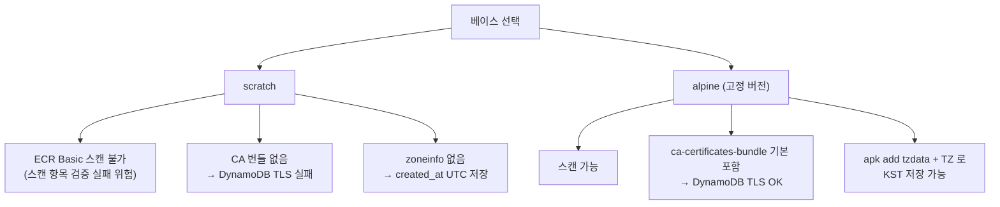
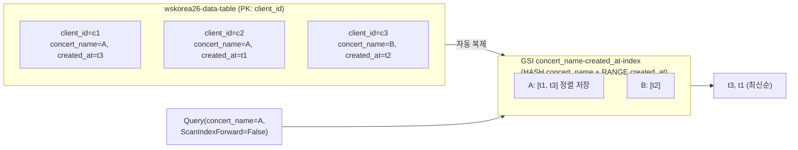
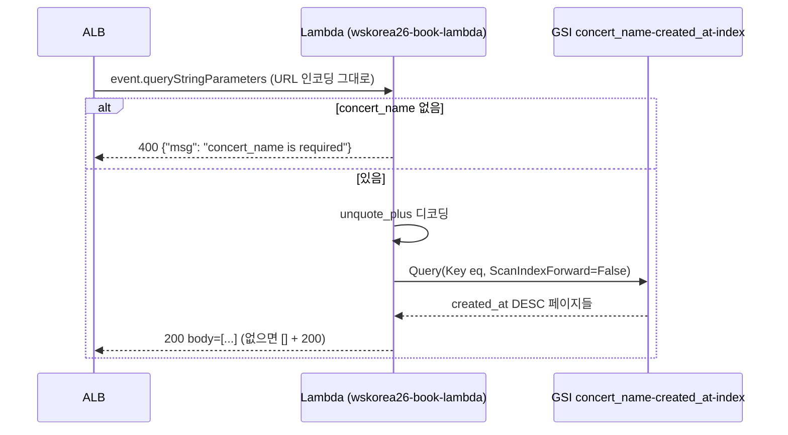

> 문서 유형: explanation

이 모듈의 채점은 "실제 출력값 비교"가 많다(created_at 시각, JSON 키 순서, 비ASCII 문자, 평균값 자릿수). 인프라가 떠 있어도 출력이 1글자 다르면 0점 — 함정을 사실 단위로 암기한다.

---

## 1. Dockerfile 베이스 이미지 선택

**① 한 줄 정의** — 베이스 이미지는 컨테이너의 OS 레이어이며, 선택에 따라 취약점 스캔 가능 여부·TLS 신뢰 저장소·타임존 데이터가 결정된다.

**② 왜 필요한가 (채점 관점)** — mark 3-1 은 "ECR 스캔 결과에 Critical/High 없음"을 검사한다. 그런데 **scratch 베이스는 ECR Basic 스캔(Clair)이 아예 스캔하지 못한다** — 취약점이 없어서가 아니라 OS 패키지 DB 가 없어서. 스캔 불가는 "스캔 통과"가 아니다.

**③ 핵심 원리**:



set-02 실측 Dockerfile 전문:

```dockerfile
# syntax=docker/dockerfile:1
FROM alpine:3.24.1

RUN apk add --no-cache tzdata && adduser -D -u 10001 book

ENV TZ=Asia/Seoul

COPY --chmod=755 book /book

USER book
EXPOSE 8080
ENTRYPOINT ["/book"]
```

각 줄의 채점 근거:
- `alpine:3.24.1` **고정 버전** — latest 금지 규칙 + 스캔 재현성.
- `tzdata` + `TZ=Asia/Seoul` — 제공된 book 은 tzdata 를 내장하지 않은 Go 바이너리. zoneinfo 가 없으면 `time.LoadLocation` 이 실패해 **created_at 이 UTC 로 저장 → mark 9-2(시각 비교) 실패**.
- `adduser -D -u 10001` + `USER book` — 비루트 실행 (보안 채점 표준).
- `COPY --chmod=755` — 제공 바이너리 실행권한 보장.

**스캔에서 High 가 나오면**: `RUN apk upgrade --no-cache` 한 줄을 추가해 재빌드/재푸시한다 (set-02 README 실측 대응).

**빌드 환경**: 대회 PC(Windows, Docker/WSL 불가)에서는 빌드 불가 → **기본 CloudShell** 에서 빌드한다. CloudShell 은 amd64 네이티브라 단일 아키텍처 이미지가 되고 스캔과 호환된다. (VPC CloudShell 은 인터넷이 없어 alpine 을 못 받는다 — 기본 CloudShell 사용.)

**④ 세트별 차이** — 앱 언어/포트/태그가 바뀌지만 "고정 버전 alpine + tzdata/TZ + 비루트 + CloudShell(amd64) 빌드" 골격은 공통.

---

## 2. ECR

**① 한 줄 정의** — ECR 은 프라이빗 컨테이너 레지스트리로, push 시 자동 스캔(scanOnPush)과 KMS 저장 암호화를 설정한다.

**② 왜 필요한가 (채점 관점)** — mark 3-1: scanOnPush + `encryptionType == KMS` + Critical/High 없음. 그리고 **태그는 요구된 것만**(예: `stable` 또는 `v1.0.0`) — 습관적으로 `latest` 를 추가로 push 하면 불필요 리소스 감점.

**③ 핵심 원리** — set-02 실측:

```hcl
resource "aws_ecr_repository" "book" {
  name         = "wskorea26-book-repo"
  force_delete = true                      # destroy 시 이미지째 삭제

  image_scanning_configuration {
    scan_on_push = true
  }
  encryption_configuration {
    encryption_type = "KMS"                # kms_key 미지정 = 관리형 aws/ecr
  }
}
```

push·스캔 확인 흐름 (CloudShell 실측):

```bash
aws ecr get-login-password | docker login --username AWS --password-stdin "$ACCOUNT_ID.dkr.ecr.ap-northeast-2.amazonaws.com"
docker build -t "$ECR:stable" .
docker push "$ECR:stable"

aws ecr wait image-scan-complete --repository-name wskorea26-book-repo --image-id imageTag=stable
aws ecr describe-image-scan-findings --repository-name wskorea26-book-repo --image-id imageTag=stable \
  --query 'imageScanFindings.findingSeverityCounts'
# 기대: CRITICAL/HIGH 키가 없어야 함
```

**④ 세트별 차이** — set-02 는 ECR 용 CMK 이름이 없어 관리형 aws/ecr, set-03 은 `wsc2026-ecr-kms` CMK 를 만들어 지정. 태그 이름(stable vs v1.0.0)도 과제지 따라간다.

---

## 3. DynamoDB 테이블 설계 — PK + GSI

**① 한 줄 정의** — 테이블은 PK(`client_id`)로 항목을 식별하고, 다른 축의 정렬 조회는 GSI(HASH `concert_name` + RANGE `created_at`)로 푼다.

**② 왜 필요한가 (채점 관점)** — 요구가 "콘서트별 예매를 **데이터베이스 레벨 최신순**으로 조회"다. Scan+애플리케이션 정렬은 요구 위반. GSI 의 RANGE 키 정렬을 Query 로 써야 한다. mark 4-1 은 테이블 암호화 CMK 도 alias 로 역조회한다.

**③ 핵심 원리**:



set-02 실측:

```hcl
resource "aws_dynamodb_table" "data" {
  name                        = "wskorea26-data-table"
  billing_mode                = "PAY_PER_REQUEST"
  hash_key                    = "client_id"
  deletion_protection_enabled = true       # 삭제방지 — destroy 전 해제 필요

  attribute {
    name = "client_id"
    type = "S"
  }
  attribute {
    name = "concert_name"
    type = "S"
  }
  attribute {
    name = "created_at"
    type = "S"
  }
  # 비키 속성(username/email/booking_id)은 스키마리스 — 정의하지 않는다

  global_secondary_index {
    name = "concert_name-created_at-index"

    key_schema {
      attribute_name = "concert_name"
      key_type       = "HASH"
    }
    key_schema {
      attribute_name = "created_at"
      key_type       = "RANGE"
    }

    projection_type = "ALL"
  }

  server_side_encryption {
    enabled     = true
    kms_key_arn = aws_kms_key.dynamodb.arn   # mark 4-1
  }
  point_in_time_recovery { enabled = true }
}
```

- `attribute` 는 **키로 쓰는 속성만** 정의한다. 비키 속성을 정의하면 오히려 validate 에러.
- `deletion_protection_enabled = true` 는 채점 항목이자 destroy 함정 — 삭제 전 false 로 바꿔 apply 해야 한다.

**boto3 Decimal 함정** (set-02 task-2 module-1 실측): DynamoDB 숫자에 Python float 를 넣으면 **boto3 가 저장 자체를 거부**한다. 또 `483/5` 를 float 로 계산하면 `96.60000000000001` 이 되어 채점 기대값 `96.6` 과 불일치. 반드시:

```python
from decimal import Decimal
average = Decimal(str(sum(scores.values()))) / Decimal("5")   # 정확히 96.6
item[field] = Decimal(str(score))                              # 저장 시에도 Decimal
```

**④ 세트별 차이** — 테이블명·키 속성명·GSI 축이 바뀐다. "요구된 조회 패턴 → GSI HASH/RANGE 결정" 사고 과정은 동일.

---

## 4. Lambda — ALB 통합 조회 함수

**① 한 줄 정의** — ALB Lambda 타깃으로 호출되는 함수는 `queryStringParameters` 를 읽어 GSI Query 하고, `statusCode/statusDescription/isBase64Encoded/headers/body` 형식으로 응답해야 한다.

**② 왜 필요한가 (채점 관점)** — mark 9-2 는 실제 HTTP 응답 본문을 **기대 출력과 문자열 수준으로 비교**한다. 최신순 정렬, JSON 키 순서, 비ASCII(`akaね`) 보존, 400/빈배열 처리까지 전부 점수다. 연결 정보 하드코딩은 별도 감점(환경변수 주입 필수).

**③ 핵심 원리**:



set-02 실측 핸들러의 채점 포인트별 코드:

```python
import json, os
from urllib.parse import unquote_plus
import boto3
from boto3.dynamodb.conditions import Key

table = boto3.resource("dynamodb").Table(os.environ["TABLE_NAME"])   # 하드코딩 금지 — env 주입
index_name = os.environ.get("INDEX_NAME", "concert_name-created_at-index")

# mark 9-2 기대 출력과 동일한 키 순서 (json.dumps 는 dict 삽입 순서 유지)
_KEYS = ["username", "created_at", "email", "booking_id", "client_id", "concert_name"]

def _response(status, body):
    return {
        "statusCode": status,
        "statusDescription": f"{status} {_STATUS_TEXT.get(status, '')}",  # "200 OK"
        "isBase64Encoded": False,
        "headers": {"Content-Type": "application/json"},
        "body": json.dumps(body, ensure_ascii=False, default=str),  # "akaね" 그대로
    }

def handler(event, context):
    params = event.get("queryStringParameters") or {}
    concert_name = params.get("concert_name")
    if not concert_name:
        return _response(400, {"msg": "concert_name is required"})
    concert_name = unquote_plus(concert_name)   # ALB 는 디코딩 없이 전달 (2ND%20TINY_CON)
    kwargs = {
        "IndexName": index_name,
        "KeyConditionExpression": Key("concert_name").eq(concert_name),
        "ScanIndexForward": False,   # created_at DESC = DB 레벨 최신순
    }
    # LastEvaluatedKey 페이지네이션 루프 후:
    return _response(200, [{k: item.get(k) for k in _KEYS} for item in items])
```

사실 단위 정리:
- **ScanIndexForward=False** — 애플리케이션 sort() 가 아니라 인덱스 정렬로 최신순 ("데이터베이스 레벨" 요구 충족).
- **키 순서** — `{k: item.get(k) for k in _KEYS}` 로 재조립. DynamoDB 반환 순서는 보장되지 않는다.
- **ensure_ascii=False** — 기본값(True)이면 `"akaね"` 로 나가 문자열 비교 실패.
- **queryStringParameters 없으면 400 / 결과 없으면 [] + 200** — 예외가 아니라 명세.
- **env 주입** — Terraform 에서 `TABLE_NAME = aws_dynamodb_table.data.name` (mark 6-1 이 env 검사).

Terraform 측 (set-02 lambda.tf 실측 요지): `archive_file` 로 zip, 실행역할은 최소권한 3-statement — `dynamodb:Query`(테이블+`/index/*`), 자체 로그그룹 `logs:CreateLogStream/PutLogEvents`, 테이블 CMK `kms:Decrypt`. SSE-KMS 테이블은 **Query 만 해도 kms:Decrypt 가 필요**하다.

```hcl
environment {
  variables = {
    TABLE_NAME = aws_dynamodb_table.data.name   # mark 6-1
    INDEX_NAME = "concert_name-created_at-index"
  }
}
```

**④ 세트별 차이** — 통합 대상(ALB vs API Gateway — 응답 포맷이 다르다: ALB 는 statusDescription 필요), 런타임 버전, 조회 축이 바뀐다. "env 주입 + Query + 정렬 + 응답 포맷 정확 일치" 원칙은 공통.

---

## 자기 점검 퀴즈

1. scratch 베이스가 mark 3-1 에서 문제가 되는 이유 두 가지는? (스캔 + 런타임)
2. created_at 이 UTC 로 저장되는 원인과 Dockerfile 해결 두 줄은?
3. ECR 스캔에서 High 가 나왔다. 재빌드 시 추가할 한 줄은? 그리고 push 할 태그에 latest 를 추가하면?
4. "콘서트별 예매를 데이터베이스 레벨 최신순 조회" 요구를 충족하는 테이블 설계 + boto3 호출 파라미터는?
5. Lambda 에서 `json.dumps(body)` 만 쓰면(옵션 없이) mark 9-2 가 실패할 수 있는 두 가지 이유는?

<details>
<summary>정답</summary>

1. ECR Basic 스캔(Clair)이 scratch 를 스캔하지 못해 스캔 결과 검증이 불가하고, CA 번들이 없어 DynamoDB TLS 연결이 실패한다 (zoneinfo 부재로 UTC 저장 문제도 있음).
2. Go 바이너리가 tzdata 미내장 + 이미지에 zoneinfo 없음 → `TZ=Asia/Seoul` 이 무시돼 UTC 저장. 해결: `RUN apk add --no-cache tzdata` + `ENV TZ=Asia/Seoul`.
3. `RUN apk upgrade --no-cache` 추가 후 재빌드·재푸시. latest 태그 추가 push 는 요구되지 않은 리소스 생성으로 감점 — 요구된 태그(stable 또는 v1.0.0)만.
4. GSI `concert_name-created_at-index` (HASH concert_name + RANGE created_at, projection ALL) + `table.query(IndexName=..., KeyConditionExpression=Key("concert_name").eq(...), ScanIndexForward=False)`.
5. `ensure_ascii` 기본 True 라 비ASCII 가 `\uXXXX` 이스케이프되어 기대 출력("akaね")과 불일치, 그리고 dict 키 순서를 기대 출력 순서로 재조립하지 않으면 문자열 비교 실패. (추가로 Decimal 직렬화를 위해 default=str 필요.)

</details>
