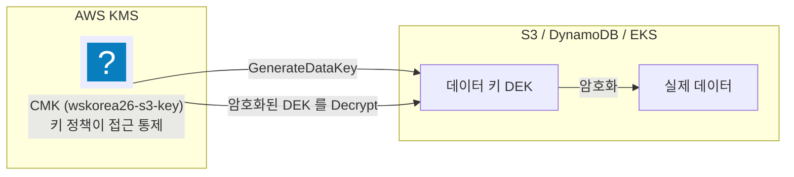
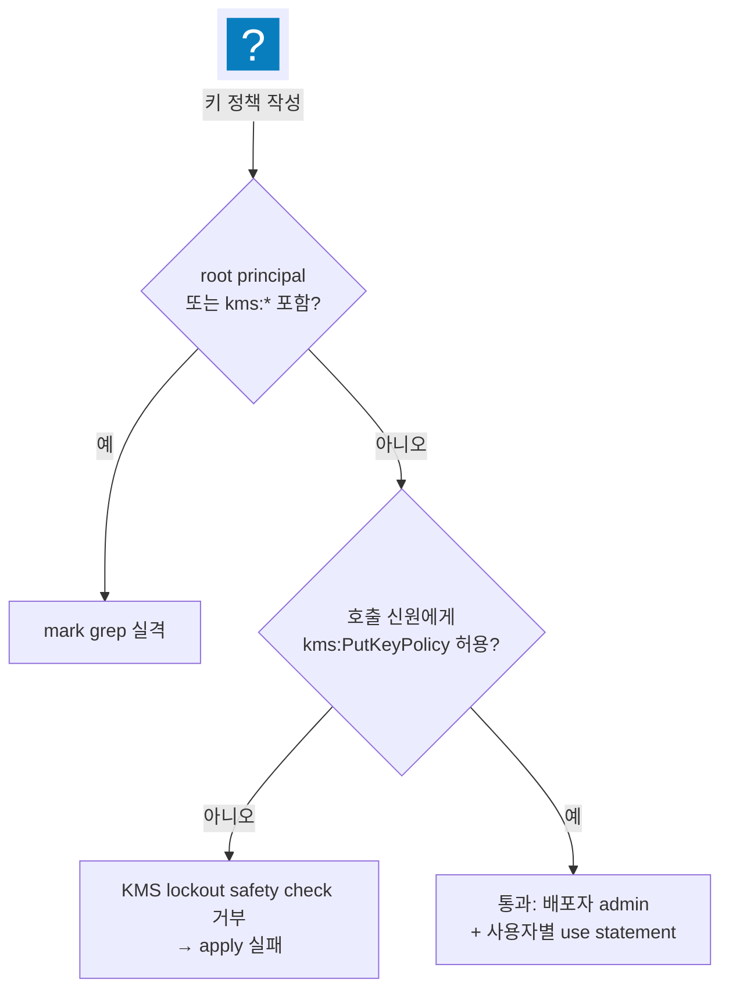
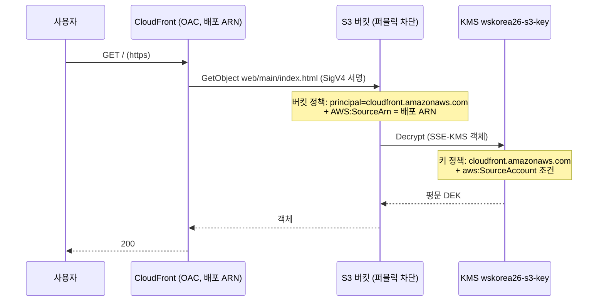
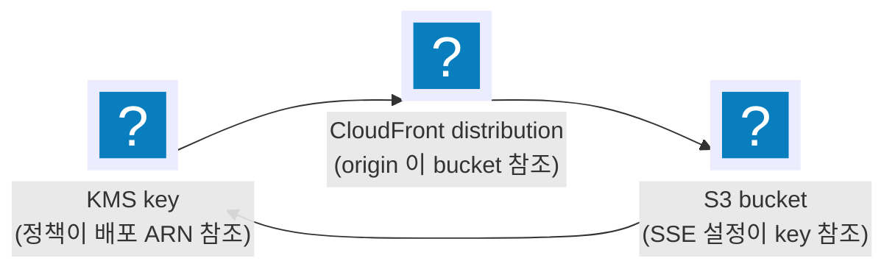

import { Quiz, QuizResults } from 'starlight-quiz/components';
import { Tabs, TabItem } from '@astrojs/starlight/components';

> 문서 유형: explanation

선행 지식과 학습 경로는 [모듈 개요](/part-1/07-kms-s3-cloudfront/)에.

암호화(KMS)와 정적 웹 서빙(S3+CloudFront)은 거의 모든 세트에 나온다. 채점은 "alias 이름 역조회", "정책 텍스트 grep", "퍼블릭 차단 상태" 같은 기계적 검사이므로, 정확한 구조를 암기 수준으로 익힌다.

:::tip[읽으면서 확인한다]
1절과 7절 끝에 **지금 확인하기** 블록이 접혀 있다. 둘 다 **아무것도 만들지 않는 조회**라 과금이 0원이고, 리소스를 하나도 안 만든 계정에서도 그대로 된다. 블록을 열지 않고 읽어도 문서는 그대로 이어진다.
:::

---

## 1. Envelope Encryption 과 CMK

**① 한 줄 정의** — envelope encryption 은 데이터를 데이터 키(DEK)로 암호화하고, 그 DEK 를 다시 KMS 의 CMK 로 암호화해 보관하는 2단 구조다. 봉투 암호화·CMK·키 정책이라는 말 자체가 처음이면 [kms-basics](/start/kms-basics/)를 먼저 읽는다.

**② 왜 필요한가 (채점 관점)** — S3 SSE-KMS, DynamoDB SSE, EKS secrets 암호화가 전부 이 구조다. mark 는 "어떤 CMK 로 암호화됐는가"를 **alias 로 역조회**하므로 alias 이름 정확 일치가 점수다.

**③ 핵심 원리**:



<details class="diagram-note">
<summary>이 도식이 보여주는 것</summary>

봉투 암호화의 구조다. CMK 는 데이터를 직접 암호화하지 않고 `GenerateDataKey` 로 데이터 키(DEK)를 내주며, 서비스가 그 DEK 로 실제 데이터를 암호화한다. 암호화된 DEK 는 데이터 옆에 저장되고, 읽을 때 CMK 로 `Decrypt` 해 되살린다. 그래서 키 정책이 막히면 데이터는 그 자리에 있어도 열 수 없다.

</details>

- 읽기 경로: 암호화된 DEK → `kms:Decrypt` → 평문 DEK → 데이터 복호화. 그래서 소비자에게 필요한 권한은 보통 `kms:Decrypt`(+ 쓰기 시 `kms:GenerateDataKey`).
- Terraform 기본형 (set-02 실측):

```hcl
resource "aws_kms_key" "s3" {
  description             = "wskorea26-s3-key : S3 static objects"
  enable_key_rotation     = true
  deletion_window_in_days = 7
  policy                  = data.aws_iam_policy_document.kms_s3.json
}
resource "aws_kms_alias" "s3" {
  name          = "alias/wskorea26-s3-key"   # mark 가 이 alias 로 키를 역조회
  target_key_id = aws_kms_key.s3.key_id
}
```

<details class="diagram-note">
<summary>이 블록이 하는 일</summary>

[`aws_kms_key`](https://registry.terraform.io/providers/hashicorp/aws/latest/docs/resources/kms_key) 와 [`aws_kms_alias`](https://registry.terraform.io/providers/hashicorp/aws/latest/docs/resources/kms_alias) 로 CMK 와 별칭을 만든다. 키 자체에는 이름이 없고 채점은 `alias/wskorea26-s3-key` 로 역조회하므로 별칭이 사실상 이름 노릇을 한다. `enable_key_rotation` 은 연 1회 자동 교체를, `deletion_window_in_days` 는 삭제 예약 후 되돌릴 수 있는 유예 기간을 정한다.

</details>

**④ 세트별 차이** — set-02 는 CMK 3개(s3/dynamodb/eks), set-03 은 5개(db/ecr/eks/bucket/function). "과제지가 이름을 준 서비스에만 CMK" 가 원칙.

<details class="build-step">
<summary>지금 확인하기 — 채점이 쓰는 alias 역조회를 그대로 해 본다</summary>

키에는 이름이 없다. 채점이 `alias/...` 로 키를 찾아내는 그 동작을 직접 해 본다. **AWS 관리형 키는 어느 계정에나 이미 있으므로 아무것도 만들지 않아도 된다.**

<Tabs syncKey="shell">
  <TabItem label="PowerShell">
  ```powershell
  aws kms describe-key --key-id alias/aws/s3 --query "KeyMetadata.[KeyId,KeyManager,KeySpec]" --output text
  ```
  </TabItem>
  <TabItem label="Bash (Linux/CloudShell)">
  ```bash
  aws kms describe-key --key-id alias/aws/s3 --query 'KeyMetadata.[KeyId,KeyManager,KeySpec]' --output text
  ```
  </TabItem>
</Tabs>

기대: UUID 형태의 키 ID 와 `AWS`, `SYMMETRIC_DEFAULT` 가 한 줄로 나온다.

두 번째 열이 이 블록의 요점이다. `KeyManager` 가 `AWS` 면 AWS 가 만들어 준 관리형 키이고, 직접 만든 CMK 는 `CUSTOMER` 로 나온다. **4절의 "CMK 를 만들 것인가 관리형을 쓸 것인가" 판단이 이 한 글자로 드러난다.**

`--key-id` 에 alias 를 그대로 넣을 수 있다는 것도 함께 본다. 채점 스크립트가 키 ID 를 모르는 채로 검사할 수 있는 이유다.

`NotFoundException` 이 나오면 그 계정·리전에 그 alias 가 없는 것이다. `aws kms list-aliases --query "Aliases[].AliasName"` 으로 실재하는 이름을 먼저 본다.

</details>

---

## 2. 키 정책 구조 — admin vs use 분리

**① 한 줄 정의** — 키 정책은 CMK 에 직접 붙는 리소스 정책으로, "키를 관리하는 statement(admin)"와 "키를 사용하는 statement(use)"를 분리해 쓴다.

**② 왜 필요한가 (채점 관점)** — IAM 정책과 달리 KMS 는 **키 정책이 1차 관문이다.** 키 정책에 적힌 만큼만 통과하고, 계정 관리자라도 키 정책이 비어 있으면 그 키를 다루지 못한다.

그래서 이 한 장에 관리 주체와 사용 주체가 함께 적힌다. 두 주체는 필요한 액션이 전혀 다르다 — 관리자는 키 자체를 켜고 끄고 지우고, 소비자는 그 키로 데이터를 암·복호화할 뿐이다. 한 statement 에 몰아 쓰면 소비자에게까지 관리 액션이 새므로 statement 를 둘로 나눈다. 이 admin/use 분리가 최소권한 채점의 기본형이고, set-03 처럼 정책 텍스트 자체를 grep 하는 세트도 있다.

**③ 핵심 원리** — 액션 두 부류:

| 부류 | 대표 액션 | 누구에게 |
|---|---|---|
| admin (관리) | `kms:Create*`, `kms:Put*`, `kms:Enable*/Disable*`, `kms:ScheduleKeyDeletion`, `kms:TagResource` ... | 계정 root 또는 배포자 IAM 신원 |
| use (사용) | `kms:Encrypt`, `kms:Decrypt`, `kms:GenerateDataKey*`, `kms:DescribeKey`, `kms:CreateGrant` | 키를 실제로 쓰는 역할/서비스 principal |

set-02 기본형 — root 전체 위임 + 필요 use statement 합성:

```hcl
data "aws_iam_policy_document" "kms_root" {
  statement {
    sid       = "EnableRoot"
    actions   = ["kms:*"]
    resources = ["*"]
    principals {
      type        = "AWS"
      identifiers = ["arn:aws:iam::${local.account_id}:root"]
    }
  }
}

data "aws_iam_policy_document" "kms_s3" {
  source_policy_documents = [data.aws_iam_policy_document.kms_root.json]  # 상속·합성

  statement {
    sid     = "AllowCloudFrontDecrypt"
    actions = ["kms:Decrypt", "kms:GenerateDataKey"]
    resources = ["*"]              # 키 정책에서는 항상 "*" (자기 자신)
    principals {
      type        = "Service"
      identifiers = ["cloudfront.amazonaws.com"]
    }
    condition {
      test     = "StringEquals"
      variable = "aws:SourceAccount"
      values   = [local.account_id]
    }
  }
}
```

<details class="diagram-note">
<summary>이 블록이 하는 일</summary>

키 정책을 두 조각으로 나눠 합친다. 위쪽은 계정 root 에 전권을 주는 기본 구문이고, 아래쪽이 CloudFront 서비스에 복호화만 허용하는 구문이다. `source_policy_documents` 가 둘을 한 문서로 합성한다. 키 정책의 `resources` 가 항상 `"*"` 인 이유는 그 정책이 붙은 키 자신을 뜻하기 때문이고([kms-basics 의 실물 JSON 절](/start/kms-basics/#1-root-less-키-정책-실물--적용된-json)이 이 표기를 IAM 정책의 `"Resource": "*"` 와 나란히 놓고 푼다), `aws:SourceAccount` 조건이 다른 계정의 CloudFront 가 이 키를 쓰지 못하게 막는다.

</details>

`EnableRoot` statement 의 root principal 은 "이 계정의 IAM 정책에 판단을 위임한다"는 뜻이다. 이 statement 를 넣어 두면 키 정책을 매번 고치지 않고도 배포자의 IAM 정책만으로 키를 관리할 수 있다.

**④ 세트별 차이** — set-02 는 root 위임 허용. set-03 은 root·`kms:*` 금지(3절).

---

## 3. 심화 — set-03 root-less 키 정책

**① 한 줄 정의** — 유의사항이 "키 정책에 root principal 과 `kms:*` 액션 금지"를 걸면, 관리자 principal 을 `"*"` 로 두고 `kms:CallerAccount` 조건으로 계정 하나에 가둔 뒤 액션을 전부 나열해야 한다.

**② 왜 필요한가 (채점 관점)** — set-03 mark 의 check_kms 가 **정책 텍스트를 grep** 해서 `:root` 나 `kms:*` 가 있으면 실격 처리한다. 동시에 KMS 의 lockout safety check 를 통과해야 하는데, 이 검사가 보는 것은 **호출한 신원 본인에게 `kms:PutKeyPolicy` 가 허용되는가** 하나다. 그래서 관리 statement 에 `kms:Put*` 를 반드시 포함시키고, 나머지 관리·운영 액션도 개별 나열한다.

principal 을 배포자 한 사람의 ARN 으로 좁히지 않는 이유는 채점 쪽에 있다. 과제지가 "미리 IAM 사용자를 만들어 그 신원으로 진행하라"고 말하지 않으면 채점자는 지급받은 root 로 접속한다. KMS 는 IAM 정책이 아니라 키 정책이 1차 관문이라, 관리자를 배포자 신원 하나로 잠그면 채점 스크립트 자신이 `describe-key`·`get-key-policy` 조차 못 해 KMS 항목이 통째로 0점이 된다. `"*"` + `kms:CallerAccount` 는 계정 밖 principal 을 막으면서 계정 안 신원 판단은 각자의 IAM 정책에 맡기므로, root 로 채점해도 통과한다.

**③ 핵심 원리** — set-03 kms.tf 실측:

```hcl
locals {
  # "kms:*" 문자열 없이 전체 권한과 동등하게 나열
  kms_admin_actions = [
    "kms:Create*", "kms:Describe*", "kms:Enable*", "kms:List*",
    "kms:Put*",    "kms:Update*",   "kms:Revoke*", "kms:Disable*",
    "kms:Get*",    "kms:Delete*",   "kms:TagResource", "kms:UntagResource",
    "kms:ScheduleKeyDeletion", "kms:CancelKeyDeletion", "kms:RotateKeyOnDemand",
    "kms:Encrypt", "kms:Decrypt",   "kms:ReEncrypt*",  "kms:GenerateDataKey*",
    "kms:CreateGrant", "kms:RetireGrant",
  ]
}

data "aws_iam_policy_document" "kms_admin" {
  statement {
    sid       = "KeyAdministration"
    effect    = "Allow"
    actions   = local.kms_admin_actions
    resources = ["*"]
    principals {
      type        = "AWS"
      identifiers = ["*"]
    }
    # 이 조건이 principal "*" 의 범위를 이 계정으로 좁힌다. 빠지면 전 세계 공개다
    condition {
      test     = "StringEquals"
      variable = "kms:CallerAccount"
      values   = [local.account_id]
    }
  }
}
```

<details class="diagram-note">
<summary>이 블록이 하는 일</summary>

root 없이 키를 관리하는 set-03 방식이다. `kms:*` 라는 문자열을 쓰지 않고 접두어를 나열해 사실상 같은 권한을 만든다 — 채점이 정책 본문에서 `kms:*` 와 root principal 을 문자열로 찾기 때문이다. principal 은 `"*"` 지만 전 세계 공개가 아니다. 바로 아래 `kms:CallerAccount` 조건이 이 계정에서 온 호출로 범위를 좁히고, 계정 안에서 누가 실제로 쓸 수 있는지는 각 신원의 IAM 정책이 정한다. 액션 목록에 `kms:Put*` 가 들어 있어야 KMS 의 잠김 방지 검사가 apply 를 통과시킨다.

</details>



<details class="diagram-note">
<summary>이 도식이 보여주는 것</summary>

root-less 키 정책이 통과하는 조건을 판정 순서로 그렸다. 첫 관문은 채점 쪽이다 — root principal 이나 `kms:*` 가 정책에 있으면 그 자리에서 실격이다.

둘째 관문은 KMS 쪽이다. KMS 는 새 키 정책을 받을 때 "이 정책을 넣는 신원이 다음에도 이 키 정책을 고칠 수 있는가"를 확인한다. 그 신원에게 `kms:PutKeyPolicy` 를 허용해 두면 통과하고, 빠뜨리면 apply 가 거부된다 — 정책을 넣은 순간 키를 되돌릴 수 있는 사람이 사라지기 때문이다.

두 관문을 함께 통과하는 형태가 관리 권한은 `kms:CallerAccount` 조건으로 계정 전체에 위임하고, 서비스에는 사용 권한만 따로 주는 구성이다.

</details>

:::danger[치명 함정]
관리 statement 하나로 끝나지 않는다. AWS 서비스가 **자기 이름으로**(서비스 principal 로) 키를 부르는 경로는 `kms:CallerAccount` 조건으로 덮이지 않으므로, 그 소비자마다 **별도 statement 를 직접** 써야 한다. set-03 은 bucket 키에 `cloudfront.amazonaws.com`(`aws:SourceAccount` 조건), function 키에 `lambda.amazonaws.com`(`kms:EncryptionContext` 조건)을 명시하고, db 키에도 사용 주체인 `book_pod`·`book_function` 역할을 최소 액션으로 따로 적어 둔다.

관리자 principal 을 배포자 ARN 하나로 좁혔다면 함정이 하나 더 붙는다 — 그 신원이 아닌 자격증명으로 apply·eksctl·kubectl 을 실행하는 순간 그 키의 모든 작업이 거부된다. set-03 정답지가 계정 위임을 쓰는 이상 이 제약은 없지만, 배포자 고정 방식을 골랐다면 도구 전부를 같은 자격증명으로 돌려야 한다.
:::

**④ 세트별 차이** — root-less 는 set-03 유형의 유의사항이 있을 때만. 평상시(set-02)는 root 위임이 단순하고 안전하다. 과제지 유의사항을 먼저 읽고 결정한다.

---

## 4. 서비스별 CMK 분리 vs 관리형 키 — 불필요 리소스 감점

**① 한 줄 정의** — 과제지가 이름을 준 서비스에만 CMK 를 만들고, 나머지는 AWS 관리형 키를 쓴다.

**② 왜 필요한가 (채점 관점)** — set-02 유의사항 10 은 "불필요 리소스 생성 감점". mark 3-1(ECR)은 `encryptionType == KMS` 만 검사하고 과제에 ECR 용 CMK 이름이 없다 → CMK 를 만들면 오히려 감점.

**③ 핵심 원리** — set-02 실측 판단:

| 서비스 | 키 | 근거 |
|---|---|---|
| S3 | CMK `wskorea26-s3-key` | 과제지에 이름 명시 |
| DynamoDB | CMK `wskorea26-dynamodb-key` | 과제지에 이름 명시 |
| EKS secrets | CMK `wskorea26-eks-key` | 과제지에 이름 명시 |
| ECR | **관리형 `aws/ecr`** | 이름 없음 + mark 는 encryptionType 만 검사 |

```hcl title="ecr.tf"
# encryption_type 만 KMS, kms_key 미지정 = aws/ecr 관리형
encryption_configuration {
  encryption_type = "KMS"
}
```

**④ 세트별 차이** — set-03 은 ECR 용 CMK 이름(`wsc2026-ecr-kms`)이 과제에 있어 CMK 를 만든다. **판단 기준은 항상 과제지의 이름 명시 여부.**

### set-07 은 키를 나누는 축 자체가 다르다 :badge[실측]{variant=note}

여기까지는 "서비스 하나에 키 하나"를 전제로 한다. [set-07 `kms.tf`](https://github.com/ishs-cloud-computing/skills-2026/blob/main/set-07/task-1/terraform/kms.tf)는 그 전제를 버린다.

| | set-02 | set-07 |
|---|---|---|
| 나누는 기준 | **리소스별** | **용도별** |
| 키 1 | `s3-key` → S3 | `unicorn-kms-app` → DynamoDB · Secrets Manager |
| 키 2 | `dynamodb-key` → DynamoDB | `unicorn-kms-data` → S3 · ECR |
| 키 3 | `eks-key` → EKS Secret | `unicorn-kms-platform` → EKS Secret · EBS · 로그 · WAF 로그 |
| 회전 | `enable_key_rotation` 만 | `rotation_period_in_days = 90` |
| 리전 | 단일 | **platform 은 다중 리전 키(MRK)** |

키 개수는 셋으로 같은데 **어느 서비스가 어느 키를 쓰는지가 전부 다르다.** set-02 는 S3 와 DynamoDB 가 다른 키를 쓰고, set-07 은 S3 와 ECR 이 같은 키를 쓴다. "리소스마다 키 하나"를 규칙으로 외우면 set-07 에서 키를 여섯 개 만들어 놓고 왜 틀렸는지 모른다.

**platform 키가 다중 리전인 이유는 WAF 다.** CloudFront 용 WAF 는 `us-east-1` 에만 존재하는데 그 로그도 같은 키로 암호화해야 하고, 단일 리전 키는 다른 리전에서 못 쓴다. 그래서 서울에 원본 키를 두고 `us-east-1` 에 복제 키를 만든다. **리전을 넘는 요구가 키 설계를 바꾼 사례다** — 7절이 WAF 쪽에서 같은 이야기를 반대편에서 한다.

회전 주기도 채점 대상이다. `mark 2-1-A` 가 세 키를 alias 로 역조회해 `[KeyRotationEnabled, RotationPeriodInDays]` 를 함께 뽑는다. 회전만 켜고 주기를 안 적으면 기본 365일이 나와 틀린다.

---

## 5. S3 보안 구성 — 퍼블릭 차단 4종 + SSE-KMS + BucketKey

**① 한 줄 정의** — 정적 웹 버킷은 퍼블릭 액세스 4종을 전부 차단하고, CMK 로 SSE-KMS 암호화하되 BucketKey 로 KMS 호출을 줄인다.

퍼블릭 액세스 차단이 접근 통제 4층 중 어디에 해당하는지, SSE-KMS 가 다른 암호화 방식과 무엇이 다른지는 [s3-basics](/start/s3-basics/)에 있다.

**② 왜 필요한가 (채점 관점)** — mark 2-2 가 퍼블릭 차단 상태와 암호화 키를 검사하고, `get-bucket-policy-status` 가 `IsPublic: false` 를 반환하려면 OAC 버킷 정책이 있어야 한다. 버킷 이름은 `wskorea26-concert-bucket-<비번호>` — 비번호 변수화 필수.

**③ 핵심 원리** — set-02 s3.tf 실측:

```hcl
resource "aws_s3_bucket_public_access_block" "web" {
  bucket                  = aws_s3_bucket.web.id
  block_public_acls       = true
  block_public_policy     = true
  ignore_public_acls      = true
  restrict_public_buckets = true   # 4종 전부 true
}

resource "aws_s3_bucket_server_side_encryption_configuration" "web" {
  bucket = aws_s3_bucket.web.id
  rule {
    apply_server_side_encryption_by_default {
      sse_algorithm     = "aws:kms"
      kms_master_key_id = aws_kms_key.s3.arn
    }
    bucket_key_enabled = true   # 버킷 수준 DEK 재사용 → KMS 호출/비용 절감
  }
}
```

<details class="diagram-note">
<summary>이 블록이 하는 일</summary>

버킷 두 속성을 [`aws_s3_bucket_public_access_block`](https://registry.terraform.io/providers/hashicorp/aws/latest/docs/resources/s3_bucket_public_access_block) 과 [`aws_s3_bucket_server_side_encryption_configuration`](https://registry.terraform.io/providers/hashicorp/aws/latest/docs/resources/s3_bucket_server_side_encryption_configuration) 이라는 별도 리소스로 각각 건다. 퍼블릭 차단은 네 항목을 모두 true 로 두어야 채점을 통과하고, 기본 암호화는 알고리즘을 `aws:kms` 로 두고 어느 키인지까지 지정한다. `bucket_key_enabled` 는 객체마다 KMS 를 부르는 대신 버킷 수준에서 DEK 를 재사용하게 해 호출 수와 비용을 줄인다.

</details>

객체 업로드도 Terraform 으로 (mark 2-1 이 키 경로 `web/main/index.html` 등을 정확히 검사):

```hcl
resource "aws_s3_object" "static" {
  for_each               = toset(["index.html", "main.jpeg"])
  bucket                 = aws_s3_bucket.web.id
  key                    = "web/main/${each.value}"
  source                 = "${local.provided_dir}/${each.value}"
  source_hash            = filemd5("${local.provided_dir}/${each.value}")
  content_type           = lookup(local.content_types, regex("[^.]+$", each.value), "application/octet-stream")
  server_side_encryption = "aws:kms"
  kms_key_id             = aws_kms_key.s3.arn
}
```

<details class="diagram-note">
<summary>이 블록이 하는 일</summary>

정적 파일 두 개를 [`aws_s3_object`](https://registry.terraform.io/providers/hashicorp/aws/latest/docs/resources/s3_object) 로 올린다. `for_each` 의 각 값이 파일명이 되고 키는 `web/main/` 접두어가 붙는다. `source_hash` 는 파일 내용이 바뀌었을 때만 다시 올리게 하고, `content_type` 은 확장자를 `regex` 로 뽑아 매핑에서 찾되 없으면 기본값으로 떨어진다 — 이 값이 틀리면 브라우저가 HTML 을 파일로 내려받는다.

</details>

:::caution
`content_type` 을 안 주면 브라우저가 html 을 다운로드해 버린다.
:::

**④ 세트별 차이** — 객체 경로(prefix)·파일 목록·버킷 이름 규칙이 바뀐다. 전부 변수/locals 로 처리.

---

## 6. CloudFront OAC + 버킷 정책 + 순환 참조 우회

**① 한 줄 정의** — OAC(Origin Access Control)는 CloudFront 가 S3 에 SigV4 서명으로 접근하게 하는 장치이고, 버킷 정책은 `AWS:SourceArn = 배포 ARN` 조건으로 그 배포에게만 GetObject 를 허용한다. OAC 가 원본을 비공개로 유지하는 구조 자체는 [s3-basics 의 OAC 절](/start/s3-basics/#cloudfront-oac--원본을-비공개로-유지하는-구조)에 있다.

**② 왜 필요한가 (채점 관점)** — "버킷 직접 접근 불가 + CloudFront 경유만 가능"이 정적 웹 채점의 표준형. 퍼블릭 차단 4종과 양립하는 유일한 정상 경로가 OAC 다.

**③ 핵심 원리**:



<details class="diagram-note">
<summary>이 도식이 보여주는 것</summary>

요청 한 건이 통과하는 관문 둘이다. CloudFront 가 OAC 로 SigV4 서명을 붙여 S3 를 부르면 버킷 정책이 서비스 주체와 `AWS:SourceArn`(배포 ARN)을 확인하고, 객체가 SSE-KMS 라 S3 가 이어서 KMS 에 복호화를 요청하면 키 정책이 `aws:SourceAccount` 를 확인한다. 둘 중 하나만 막혀도 사용자는 403 을 본다 — 버킷 정책만 고쳐 두고 키 정책을 빠뜨리는 실수가 여기서 드러난다.

</details>

버킷 정책 (set-02 실측 — 여기는 배포 ARN 직접 참조가 맞다):

```hcl
data "aws_iam_policy_document" "web_bucket" {
  statement {
    sid       = "AllowCloudFrontOAC"
    actions   = ["s3:GetObject"]
    resources = ["${aws_s3_bucket.web.arn}/*"]
    principals {
      type        = "Service"
      identifiers = ["cloudfront.amazonaws.com"]
    }
    condition {
      test     = "StringEquals"
      variable = "AWS:SourceArn"
      values   = [aws_cloudfront_distribution.cdn.arn]
    }
  }
}
```

<details class="diagram-note">
<summary>이 블록이 하는 일</summary>

OAC 를 받는 버킷 정책이다. `principals` 가 사람이 아니라 CloudFront 서비스이고, `AWS:SourceArn` 조건이 그 배포 하나로 범위를 좁힌다. 키 정책과 달리 여기서는 배포 ARN 을 직접 참조해도 순환이 생기지 않는다 — 버킷 정책은 배포가 만들어진 뒤에 붙기 때문이다.

</details>

**순환 참조 함정** — 같은 방식으로 **KMS 키 정책**에도 배포 ARN 을 넣으면:



<details class="diagram-note">
<summary>이 도식이 보여주는 것</summary>

apply 가 거부되는 순환 참조의 모양이다. 키 정책이 배포 ARN 을, 배포가 버킷을, 버킷의 암호화 설정이 다시 키를 참조해 화살표가 한 바퀴 돈다. Terraform 은 참조 관계로 생성 순서를 정하므로 시작점이 없는 이 고리를 만들 수 없다. 고리를 끊는 자리는 키 정책이다 — 배포 ARN 대신 계정 조건으로 바꾼다.

</details>

:::danger[순환 참조]
`key → distribution → bucket → key` 순환으로 plan 이 실패한다. **우회: 키 정책은 배포 ARN 대신 `aws:SourceAccount = 계정ID` 조건**을 쓴다 (버킷 정책은 bucket→distribution 단방향이라 ARN 직접 참조 가능).
:::

OAC 리소스와 오리진 연결 (set-02 실측):

```hcl
resource "aws_cloudfront_origin_access_control" "s3" {
  name                              = "wskorea26-s3-oac"
  origin_access_control_origin_type = "s3"
  signing_behavior                  = "always"
  signing_protocol                  = "sigv4"
}

origin {
  origin_id                = var.s3_origin_id
  domain_name              = aws_s3_bucket.web.bucket_regional_domain_name
  origin_access_control_id = aws_cloudfront_origin_access_control.s3.id
  origin_path              = "/web/main"   # 루트(/) → web/main/index.html
}
```

<details class="diagram-note">
<summary>이 블록이 하는 일</summary>

[`aws_cloudfront_origin_access_control`](https://registry.terraform.io/providers/hashicorp/aws/latest/docs/resources/cloudfront_origin_access_control) 로 OAC 를 만들고 오리진에 붙이는 부분이다. `signing_behavior = "always"` 는 CloudFront 가 모든 요청에 SigV4 서명을 붙인다는 뜻이라 버킷을 비공개로 둘 수 있다. `domain_name` 은 웹사이트 엔드포인트가 아니라 리전 도메인이어야 하고, `origin_path` 가 `/web/main` 이라 사용자의 `/` 요청이 `web/main/index.html` 로 이어진다.

</details>

배포 식별: mark 는 `comment` 값(`wskorea26-concert-cf`)으로 배포를 찾는다 — comment 도 채점 대상.

**④ 세트별 차이** — set-02/03 공통으로 OAC + SourceArn 버킷 정책 + SourceAccount 키 정책. 오리진 수(S3 단독 vs S3+ALB), behavior(경로 패턴, CloudFront Function), price class 가 세트마다 다르다.

### 6-1. 오리진이 둘일 때 — 캐시할 것과 하면 안 되는 것 :badge[실기출]{variant=note}

[2024 실기출 1과제](/reference/past-exams/#3-4-2024-1과제--web-service-provisioning-4시간)가 요구한 구성이다. CloudFront 4점으로 그 해 배점 3위였다.

> Origin: S3 와 ALB 2개의 origin 을 가지도록 구성합니다. S3 에 업로드 되는 정적 콘텐츠를 캐싱할 수 있도록 구성합니다. **ALB 로의 요청에 대해서는 캐싱하지 않고 Query String 도 모두 Origin 으로 전달**해야 합니다.

두 오리진의 성격이 정반대다.

| | S3 오리진 | ALB 오리진 |
|---|---|---|
| 내용 | 정적 파일. 잘 안 바뀐다 | API 응답. 요청마다 다르다 |
| 캐싱 | **한다** | **하지 않는다** |
| 쿼리스트링 | 무시해도 된다 | **전부 전달해야 한다** |
| 잘못하면 | 느려질 뿐 | **다른 사용자의 응답이 섞인다** |

마지막 줄이 중요하다. `GET /v1/user?email=a@x.com` 을 캐싱하면서 쿼리스트링을 캐시 키에 넣지 않으면, 다음 사람이 `?email=b@y.com` 으로 물어도 **앞사람의 응답**을 받는다. 성능 문제가 아니라 정보 유출이다.

### 6-2. 정책이 둘로 나뉘어 있다

CloudFront 설정에서 가장 헷갈리는 지점이다. 이름이 비슷한 정책이 둘 있고 하는 일이 다르다.

| 정책 | 정하는 것 | 잘못 쓰면 |
|---|---|---|
| **캐시 정책**(Cache Policy) | 무엇을 **캐시 키**에 넣을지 + TTL | 캐시가 안 맞거나 응답이 섞인다 |
| **오리진 요청 정책**(Origin Request Policy) | 무엇을 **오리진에 전달**할지 | 오리진이 필요한 값을 못 받는다 |

**둘은 독립이다.** 캐시 키에 넣지 않으면서 오리진에 전달할 수 있고, 그 반대도 된다.

이 성질이 ALB 오리진의 답이다.

```hcl
# ALB 오리진 behavior
cache_policy_id          = data.aws_cloudfront_cache_policy.disabled.id
origin_request_policy_id = data.aws_cloudfront_origin_request_policy.all_viewer.id
```

| 관리형 정책 | 하는 일 |
|---|---|
| `Managed-CachingDisabled` | TTL 0. 캐시하지 않는다 |
| `Managed-AllViewer` | 쿼리스트링·헤더·쿠키를 전부 오리진에 전달 |
| `Managed-CachingOptimized` | 정적 콘텐츠용. 압축 켜고 TTL 김 |

S3 오리진은 `CachingOptimized` 를 쓴다.

:::danger[캐싱을 끄면 쿼리스트링이 자동으로 전달되지 않는다]
`CachingDisabled` 는 캐시만 끈다. **오리진 요청 정책을 따로 지정하지 않으면 쿼리스트링이 오리진에 전달되지 않는다.** 그러면 API 가 파라미터 없는 요청을 받아 엉뚱한 응답을 낸다.

두 정책을 **한 쌍으로** 붙인다.
:::

### 6-3. 경로로 오리진을 가른다

behavior 를 경로 패턴으로 나눈다. **위에서부터 평가하고 처음 맞는 것을 쓴다.**

| 우선순위 | 경로 패턴 | 오리진 |
|---|---|---|
| 0 | `/v1/*` | ALB (캐싱 없음) |
| 1 | `/images/*` | S3 (캐싱) |
| 기본 | `*` | S3 (캐싱) |

기본 behavior 는 언제나 마지막에 평가된다. **가장 넓은 것을 기본에 두고 좁은 것을 위에 둔다.**

순서를 뒤집어 `*` 를 우선순위 0 에 두면 모든 요청이 거기서 걸려 아래 규칙이 죽는다.

### 6-4. HTTPS 로만 받기

> 사용자가 CloudFront 에 HTTP 접근 시에도 HTTPS 로 리다이렉션 되어 HTTPS 로만 접근할 수 있도록 구성합니다.

behavior 마다 설정한다.

```hcl
viewer_protocol_policy = "redirect-to-https"
```

| 값 | 동작 |
|---|---|
| `allow-all` | HTTP 도 그대로 받는다 |
| `redirect-to-https` | **HTTP 를 301/302 로 HTTPS 에 넘긴다** |
| `https-only` | HTTP 를 403 으로 거절한다 |

요구가 "리다이렉션"이면 세 번째가 아니라 두 번째다. `https-only` 는 리다이렉트하지 않고 막는다.

:::caution[리다이렉트 상태코드를 확인한다]
실기출 채점 수정 내역에 이런 줄이 있었다. "채점 6-3-A 항목에서 반환값을 302에서 301로 수정하였습니다."

CloudFront 의 리다이렉트 코드는 상황에 따라 다를 수 있다. 채점이 특정 코드를 기대하면 실제로 `curl -I` 로 확인한다.

```bash
curl -sI http://<배포도메인>/ | head -1
```
:::

### 6-5. Lambda@Edge 와 CloudFront Functions

엣지에서 코드를 돌리는 방법이 둘이고 할 수 있는 일이 다르다.

| | CloudFront Functions | Lambda@Edge |
|---|---|---|
| 언어 | JavaScript(제한된 런타임) | Node.js · Python |
| 실행 시점 | 뷰어 요청·응답만 | 뷰어·오리진 요청·응답 **넷 다** |
| 실행 시간 | 1ms 미만 | 최대 5초(뷰어) · 30초(오리진) |
| 네트워크 호출 | **불가** | 가능 |
| AWS SDK | **불가** | 가능 |
| 비용 | 매우 저렴 | 그보다 비쌈 |

**AWS API 를 불러야 하면 Lambda@Edge 다.** 2024 실기출이 그 예다.

> Lambda@edge 를 이용해서 `/preview?img=<이미지 이름>` 으로 호출 시 s3 presigned url 을 반환하도록 합니다. presigned url 은 3분 후에 만기되어야 합니다.

presigned URL 을 만들려면 자격증명으로 서명해야 한다. CloudFront Functions 로는 불가능하다.

```python
import boto3

s3 = boto3.client("s3")


def lambda_handler(event, context):
    request = event["Records"][0]["cf"]["request"]
    params = request.get("querystring", "")

    img = None
    for pair in params.split("&"):
        if pair.startswith("img="):
            img = pair[4:]

    if not img:
        return {"status": "400", "body": "img is required"}

    url = s3.generate_presigned_url(
        "get_object",
        Params={"Bucket": "wsi-cc-data-xxxx", "Key": f"frontend/{img}"},
        ExpiresIn=180,     # 3분
    )
    return {
        "status": "200",
        "headers": {"content-type": [{"key": "Content-Type", "value": "text/plain"}]},
        "body": url,
    }
```

:::danger[Lambda@Edge 는 us-east-1 에만 만든다]
CloudFront 가 글로벌 서비스라 연결할 함수도 `us-east-1` 에 있어야 한다. 다른 리전에 만들면 연결 자체가 안 된다.

그리고 **버전을 지정해 연결한다.** `$LATEST` 는 쓸 수 없고 게시된 버전 번호가 필요하다. 코드를 고치면 새 버전을 게시하고 배포를 다시 연결해야 반영된다.

삭제도 까다롭다. 엣지 로케이션에 복제본이 남아 배포에서 떼어 낸 뒤에도 몇 시간 지나야 지워진다.
:::

### 6-6. 배포 반영에는 시간이 걸린다

CloudFront 설정을 바꾸면 전 세계 엣지에 퍼지는 데 시간이 든다. 배포 상태가 `InProgress` 에서 `Deployed` 가 되어야 한다.

```bash
aws cloudfront get-distribution --id <ID> --query 'Distribution.Status' --output text
```

그리고 **이미 캐시된 것은 설정을 바꿔도 그대로**다. 지우려면 무효화한다.

```bash
aws cloudfront create-invalidation --distribution-id <ID> --paths '/*'
```

:::caution[무효화는 무료가 아니다]
월 1,000 경로까지 무료이고 그 뒤로 경로당 과금된다. `/*` 하나가 경로 하나로 계산되므로 실습에서는 문제없지만, 습관적으로 남발하지 않는다.
:::

---

## 7. WAF — Web ACL 구조와 스코프

**① 한 줄 정의** — WAF Web ACL은 priority(우선순위)가 매겨진 규칙(rule) 목록이다. 각 규칙은 매치 조건(statement)과 처리(action)를 갖고, CloudFront에 붙이면 scope는 `CLOUDFRONT`(항상 us-east-1), ALB에 직접 붙이면 `REGIONAL`(보호 대상과 같은 리전)이다.

**② 왜 필요한가 (채점 관점)** — 후보 세트 중 set-03·set-07 은 WAF를 채점하고 set-02 는 아예 없다. 그런데 확인 방식이 다르다.

set-03 mark 10-1 은 세 가지를 본다. `aws wafv2 list-web-acls`로 리소스 자체를 조회하고, SQLi/XSS payload(`booking_id=1' OR 1=1--`, `<script>alert(1)</script>`)를 실제로 던져 403을 확인하고, rate 규칙의 `Limit` 값을 API로 읽어 200 이하인지 본다.

set-07 은 `aws wafv2` 호출이 전혀 없다. XSS 프로브 상태 코드와 연속 요청 후 상태만 보는 curl 블랙박스 테스트다.

두 세트 모두 이름만 맞고 실제로 안 막으면 감점이다.

**③ 핵심 원리**

Scope 비교:

| 항목 | `CLOUDFRONT` | `REGIONAL` |
|---|---|---|
| 붙는 대상 | CloudFront 배포 | ALB·API Gateway·AppSync 등 |
| Web ACL 생성 리전 | 항상 `us-east-1` (provider alias 필수) | 보호 리소스와 같은 리전(서울) |
| 후보 세트 실측 | set-03·set-07 전부 이 방식 — S3+ALB+Lambda 를 CloudFront 하나로 묶어 앞단 1곳만 보호 | 후보 세트엔 없음 — CloudFront 없이 ALB 를 단독 노출하면 이 스코프 |

us-east-1 provider alias 는 [hcl-basics](/start/hcl-basics/)에서 다룬 패턴 그대로다 — CloudFront 용 ACM 인증서와 같은 이유로 고정된다.

<details class="build-step">
<summary>지금 확인하기 — `CLOUDFRONT` 스코프가 정말 us-east-1 에만 있나</summary>

표의 둘째 줄은 외울 것이 아니라 확인할 것이다. **조회만 하므로 아무것도 만들지 않고 과금도 없다.** Web ACL 이 하나도 없는 계정에서도 된다.

먼저 맞는 리전에서.

<Tabs syncKey="shell">
  <TabItem label="PowerShell">
  ```powershell
  aws wafv2 list-web-acls --scope CLOUDFRONT --region us-east-1 --query "WebACLs[].Name" --output json
  ```
  </TabItem>
  <TabItem label="Bash (Linux/CloudShell)">
  ```bash
  aws wafv2 list-web-acls --scope CLOUDFRONT --region us-east-1 --query 'WebACLs[].Name' --output json
  ```
  </TabItem>
</Tabs>

기대: 이름 배열이 나온다. 아직 만든 것이 없으면 `[]` 다. **에러가 아니라 빈 배열이 정상이다.**

이번엔 리전만 서울로 바꿔 같은 것을 묻는다.

<Tabs syncKey="shell">
  <TabItem label="PowerShell">
  ```powershell
  aws wafv2 list-web-acls --scope CLOUDFRONT --region ap-northeast-2 --query "WebACLs[].Name" --output json
  ```
  </TabItem>
  <TabItem label="Bash (Linux/CloudShell)">
  ```bash
  aws wafv2 list-web-acls --scope CLOUDFRONT --region ap-northeast-2 --query 'WebACLs[].Name' --output json
  ```
  </TabItem>
</Tabs>

기대: **빈 배열이 아니라 에러다.** :badge[실측]{variant=note}

```
An error occurred (WAFInvalidParameterException) when calling the ListWebACLs operation:
Error reason: The scope is not valid., field: SCOPE_VALUE, parameter: CLOUDFRONT
```

"서울에는 없다"가 아니라 **"서울에서는 그 스코프를 물을 수조차 없다"** 는 뜻이다. `CLOUDFRONT` 스코프는 리전을 넘나드는 개념이 아니라 `us-east-1` 이라는 한 곳에만 존재한다.

이 사실이 `provider = aws.use1` 한 줄의 근거다. 그리고 4절에서 본 platform 키가 다중 리전이어야 하는 이유이기도 하다 — WAF 로그가 여기 있으니 키도 여기까지 따라와야 한다.

`Could not connect to the endpoint URL` 이 나오면 리전 이름 오타다.

</details>

Web ACL 내부 구조 — set-07 실측(관리형 규칙 그룹 사용):

```hcl title="waf.tf (set-07)"
resource "aws_wafv2_web_acl" "unicorn" {
  provider = aws.use1          # CLOUDFRONT scope는 반드시 us-east-1
  scope    = "CLOUDFRONT"
  default_action {
    allow {}                   # 어떤 rule 도 안 걸리면 통과
  }

  rule {
    name     = "AWSManagedRulesCommonRuleSet"
    priority = 1                # 숫자가 작을수록 먼저 평가
    override_action {
      none {}                   # 그룹 안 각 규칙이 자기 action 그대로 수행
    }
    statement {
      managed_rule_group_statement {
        vendor_name = "AWS"
        name        = "AWSManagedRulesCommonRuleSet"
      }
    }
    visibility_config {
      cloudwatch_metrics_enabled = true
      metric_name                = "common-rule-set"
      sampled_requests_enabled   = true
    }
  }
  # priority 2: AWSManagedRulesKnownBadInputsRuleSet (구조 동일)
  # priority 3: rate_based_statement(limit=50, IP, 60초) → custom_response(403)
}
```

<details class="diagram-note">
<summary>이 블록이 하는 일</summary>

[`aws_wafv2_web_acl`](https://registry.terraform.io/providers/hashicorp/aws/latest/docs/resources/wafv2_web_acl) 로 만든 set-07 방식의 Web ACL 이다. CloudFront 에 붙이는 ACL 은 반드시 us-east-1 에 만들어야 해서 별칭 프로바이더를 쓴다. 기본 액션이 `allow` 라 규칙에 걸린 요청만 막히고, 규칙은 priority 오름차순으로 평가된다. `override_action.none` 은 관리형 그룹 안 각 규칙이 자기 동작을 그대로 수행하라는 뜻이다 — `count` 로 바꾸면 차단 대신 집계만 한다.

`visibility_config` 는 이 규칙의 관측 설정이고 세 필드가 필수다. `cloudwatch_metrics_enabled` 는 규칙별 매치 수를 CloudWatch 메트릭으로 내보낼지, `metric_name` 은 그 메트릭에 붙일 이름, `sampled_requests_enabled` 는 매치된 요청 표본을 콘솔에서 볼 수 있게 남길지 정한다. 오탐 대응이 이 표본에서 시작하므로 두 값을 `true` 로 켜 둔다.

</details>

- **priority**: 숫자가 작을수록 먼저 평가한다. 먼저 매치되고 **terminating action**(Block·Allow — Count 는 non-terminating)을 낸 규칙에서 평가가 즉시 끝난다.
- **action 자리는 두 종류**: 직접 짠 매치 조건(리프 규칙)엔 `action { block{} / allow{} / count{} }`, 관리형 규칙 그룹·규칙 그룹 참조엔 `override_action { none{} / count{} }` — 그룹 전체를 통으로 Count 전환할 때만 쓴다.
- **RuleActionOverrides**: 그룹 안의 특정 하위 규칙 하나만 Count 로 바꾸는 세 번째 계층. `managed_rule_group_statement` 안에 이름을 지정해 넣는다(`rule_action_override { name = "SizeRestrictions_BODY"; action_to_use { count {} } }`). 그룹 전체가 아니라 오탐을 낸 그 규칙 하나만 죽이므로 나머지 보호는 유지된다.

:::note[정상 요청이 403 이 나올 때]
관리형 규칙 그룹이 정상 요청을 오차단하면 이 순서로 좁힌다.

1. CloudWatch sampled requests 로 원인 규칙을 특정한다.
2. 그 규칙만 RuleActionOverrides 로 Count 전환한다.
3. 정상 요청이 통과하는지 검증한다.
4. 문제가 해결됐으면 다시 Block 으로 되돌린다.

명령어 수준 절차는 [트러블슈팅](/reference/troubleshooting/)의 "정상 요청이 403" 항목에 있다.
:::

set-03 은 관리형 규칙 그룹을 아예 쓰지 않는다 — SQLi/XSS 를 리프 규칙(`sqli_match_statement`/`xss_match_statement`)으로 직접 짜고 action 도 자기 것이다:

```hcl title="waf.tf (set-03)"
rule {
  name     = "${var.name_prefix}-sqli"
  priority = 1
  action {
    block {}
  }
  statement {
    sqli_match_statement {
      field_to_match {
        query_string {}
      }
      sensitivity_level = "HIGH"
      text_transformation {
        priority = 0
        type     = "URL_DECODE"
      }
    }
  }
  visibility_config {
    cloudwatch_metrics_enabled = true
    metric_name                = "${var.name_prefix}-sqli"
    sampled_requests_enabled   = true
  }
}
# priority 2: xss_match_statement (구조 동일, text_transformation 2단: URL_DECODE → HTML_ENTITY_DECODE)
# priority 3: rate_based_statement(limit=200, IP, 60초) → block
```

<details class="diagram-note">
<summary>이 블록이 하는 일</summary>

set-03 방식은 관리형 그룹 대신 매치 구문을 직접 쓴다. 검사 대상이 `query_string` 이고 동작이 `block` 이며, `text_transformation` 이 검사 전에 값을 정규화한다 — URL 인코딩으로 우회하는 페이로드를 잡기 위해서다. XSS 규칙은 같은 구조에 변환을 2단(`URL_DECODE` 다음 `HTML_ENTITY_DECODE`)으로 쓴다.

</details>

이 경우는 규칙을 직접 소유하므로 오탐이 나면 `action`을 바로 `count{}`로 바꿔 검증하면 된다 — 관리형 그룹처럼 RuleActionOverrides 가 따로 필요 없다.

**로깅**: set-07 은 `aws_wafv2_web_acl_logging_configuration` 리소스로 평가 로그를 CloudWatch Logs 에 남긴다. 로그 그룹 이름은 반드시 `aws-waf-logs-` 로 시작하고, us-east-1 에 Platform CMK 암호화로 만든다.

로그 배달 주체(`delivery.logs.amazonaws.com`)가 그 로그 그룹에 쓸 수 있도록 리소스 정책을 별도로 붙여야 로깅 설정 자체가 성공한다.

set-03 은 과제지에 로깅 요구가 없어 로깅 설정을 만들지 않는다 — **과제지에 없으면 안 만드는 원칙(4절)은 여기도 동일**하다.

**④ 세트별 차이**:

| | set-02 | set-03 | set-07 |
|---|---|---|---|
| WAF | 없음 | 커스텀 SQLi/XSS 매치 + Rate(200/60s), 로깅 없음 | 관리형 규칙 그룹(Common+KnownBadInputs) + Rate(50/60s) + 커스텀 응답(403) + 로깅 |
| 배점(30점 만점) | — | 1.5 | 2.5 (Managed Rule Test 1.0 + Rate limit 1.5, 두 항목에 분산) |
| 채점 방식 | — | `list-web-acls` API 조회 + 실제 payload curl + `Limit` 값 조회 | 순수 curl 블랙박스(상태 코드만, API 조회 없음) |

관리형 규칙 그룹은 후보 세트에 `AWSManagedRulesCommonRuleSet`·`AWSManagedRulesKnownBadInputsRuleSet` 둘만 나온다 — `AWSManagedRulesSQLiRuleSet`은 후보 세트 어디에도 없다(set-03 이 SQLi 를 커스텀 매치로 직접 구현하는 이유). set-06(후보 밖)의 커스텀 응답(405/403) 패턴은 [변동 드릴](/reference/variation-drill/)에 별도로 있다.

### 7-1. 실기출 — 취약한 앱을 주고 막으라고 한다 :badge[실기출]{variant=note}

[2025 2과제 WAF 모듈](/reference/past-exams/#3-2-2025-2과제--small-challenge-4시간)은 형태가 다르다. 규칙을 만들라고 지시하는 대신 **취약한 앱을 주고 취약점을 찾으라고 한다.**

> 애플리케이션에 존재하는 취약점을 찾아내고, 취약점에 대한 Rule 설정을 구성하며, 취약점을 공격하게 될시 403 Forbidden 에러가 떠야합니다.

제공된 Flask 앱이 이렇게 생겼다.

```python
def obscure_query(mode, **kwargs):
    if mode == "login":
        name = kwargs["name"]
        secret = kwargs["secret"]
        parts = ["SELECT", "*", "FROM", "secret_users", "WHERE"]
        parts.append(f"name='{name}'")
        parts.append("AND")
        parts.append(f"secret='{secret}'")
        return " ".join(parts)

    elif mode == "lookup":
        user_id = kwargs["id"]
        return f"""SELECT id, name, secret FROM secret_users WHERE id = {user_id}"""
```

**입력값을 문자열에 그대로 이어 붙인다.** 이것이 SQL 주입 취약점의 교과서적 형태다.

`name` 에 `admin'--` 을 넣으면 완성되는 질의가 이렇게 된다.

```sql
SELECT * FROM secret_users WHERE name='admin'--' AND secret='anything'
```

`--` 뒤가 주석이라 암호 검사가 통째로 사라진다. **암호를 몰라도 로그인된다.**

`lookup` 은 더 심하다. 따옴표조차 없어 `id=1 OR 1=1` 이면 모든 행이 나온다.

### 7-2. 막는 순서

**첫째, 취약함을 먼저 확인한다.** 채점 스크립트가 그 순서로 한다.

```bash
IP=$(aws ec2 describe-instances --filters "Name=tag:Name,Values=wsc2025-app-server" \
  --query "Reservations[*].Instances[*].PublicIpAddress" --output text)
curl "http://$IP:5000/login?name=admin'--&secret=anything"
curl "http://$IP:5000/lookup?id=id%3D1+OR+1%3D1"
```

EC2 에 직접 쏘는 것이라 WAF 를 거치지 않는다. **여기서는 성공해야 한다** — 취약점이 실재한다는 증거다.

**둘째, ALB 를 통과하는 같은 요청이 403 이어야 한다.**

```bash
curl "http://$ALB_ENDPOINT/login?name=admin'--&secret=anything"
curl "http://$ALB_ENDPOINT/lookup?id=id%3D1+OR+1%3D1"
```

### 7-3. 관리형 규칙으로 되는가

`AWSManagedRulesSQLiRuleSet` 을 붙이는 것이 가장 빠른 시도다. 다만 확인이 필요하다.

| 공격 문자열 | 관리형 SQLi 규칙 |
|---|---|
| `admin'--` | 대개 걸린다 |
| `id=1 OR 1=1` | 걸릴 수도, 아닐 수도 |
| URL 인코딩된 변형 | 텍스트 변환 설정에 달렸다 |

:::danger[관리형 규칙만 믿고 확인을 건너뛰지 않는다]
채점은 **정확히 그 요청 두 개**를 쏜다. 관리형 규칙이 그 둘을 잡는지가 전부다. 붙였다고 끝이 아니라 실제로 쏴 보고 403 이 오는지 확인한다.

안 걸리면 커스텀 규칙을 더한다.
:::

커스텀 매치로 확실히 잡는다.

```hcl
rule {
  name     = "block-sqli-custom"
  priority = 2

  statement {
    or_statement {
      statement {
        byte_match_statement {
          search_string         = "'--"
          positional_constraint = "CONTAINS"
          field_to_match { query_string {} }
          text_transformation {
            priority = 0
            type     = "URL_DECODE"      # 인코딩 우회를 막는다
          }
          text_transformation {
            priority = 1
            type     = "LOWERCASE"
          }
        }
      }
      statement {
        byte_match_statement {
          search_string         = "or 1=1"
          positional_constraint = "CONTAINS"
          field_to_match { query_string {} }
          text_transformation {
            priority = 0
            type     = "URL_DECODE"
          }
          text_transformation {
            priority = 1
            type     = "LOWERCASE"
          }
        }
      }
    }
  }

  action { block {} }

  visibility_config {
    cloudwatch_metrics_enabled = true
    metric_name                = "block-sqli-custom"
    sampled_requests_enabled   = true
  }
}
```

**텍스트 변환이 핵심이다.** `URL_DECODE` 를 걸지 않으면 `id%3D1+OR+1%3D1` 이 디코딩되지 않아 `or 1=1` 문자열과 맞지 않는다. `LOWERCASE` 는 `OR` 과 `or` 을 함께 잡는다.

변환은 우선순위 순으로 차례로 적용된다. 디코딩을 먼저, 소문자화를 나중에 한다.

:::caution[정상 요청까지 막지 않는지 확인한다]
`'--` 나 `or 1=1` 이 정상 데이터에 들어갈 수도 있다. 차단 규칙을 붙인 뒤 정상 요청이 여전히 통과하는지 반드시 확인한다.

```bash
curl -s -o /dev/null -w '%{http_code}\n' "http://$ALB_ENDPOINT/lookup?id=1"
```

`200` 이어야 한다.
:::

### 7-4. 샘플 요청으로 무엇이 걸렸는지 본다

규칙이 동작하는지 확인하는 가장 빠른 길이다.

```bash
aws wafv2 get-sampled-requests \
  --web-acl-arn <ARN> --rule-metric-name block-sqli-custom \
  --scope REGIONAL \
  --time-window StartTime=$(date -u -d '10 minutes ago' +%s),EndTime=$(date -u +%s) \
  --max-items 10 \
  --query 'SampledRequests[*].{uri:Request.URI,query:Request.Args,action:Action}'
```

걸린 요청의 실제 문자열이 나온다. 안 걸렸으면 목록이 비어 있고, 그러면 규칙이 아니라 매치 조건을 본다.

---

## 자기 점검 퀴즈

<Quiz title="키 정책 — use 액션 골라내기">
키 정책의 **use(사용)** statement 에 들어가는 액션을 모두 고르라.

- [x] `kms:Decrypt`
- [x] `kms:GenerateDataKey*`
- [x] `kms:Encrypt`
- [ ] `kms:ScheduleKeyDeletion`
  > 키 삭제 예약은 관리(admin) 액션이다. 사용자 역할에 이걸 주면 최소권한이 깨지고, 채점도 이 구조를 본다.
- [ ] `kms:PutKeyPolicy`
  > 키 정책 자체를 갈아끼우는 관리(admin) 액션. use 쪽에 섞이면 "키를 쓰는 역할이 키 정책을 다시 쓸 수 있다"는 권한 상승이 된다.

**use**: `kms:Encrypt`, `kms:Decrypt`, `kms:GenerateDataKey*`, `kms:DescribeKey`, `kms:CreateGrant` — 키를 실제로 쓰는 역할/서비스 principal 에게.
**admin**: `kms:Create*`, `kms:Put*`, `kms:Enable*`/`Disable*`, `kms:ScheduleKeyDeletion`, `kms:TagResource` — 계정 root 또는 배포자 IAM 신원에게.

관리 주체와 사용 주체가 다르므로 분리해 최소권한을 만든다. IAM 정책과 달리 KMS 는 **키 정책이 없으면 그 누구도(관리자 포함) 키에 접근하지 못한다**는 점이 분리의 전제다. 소비자에게 보통 필요한 최소 조합은 읽기면 `kms:Decrypt`, 쓰기까지면 `+ kms:GenerateDataKey`.
</Quiz>

<Quiz title="ECR 에 CMK 를 만들면 안 되는 이유">
set-02 에서 ECR 에 전용 CMK 를 만들면 안 되는 이유는?

- [x] 과제지에 ECR 용 CMK 이름이 없고 mark 3-1 은 `encryptionType == KMS` 만 검사한다 — CMK 를 만들면 유의사항 10 "불필요 리소스 생성" 감점
- [ ] ECR 은 고객 관리 키(CMK)를 지원하지 않는다
  > 지원한다. set-03 은 실제로 `wsc2026-ecr-kms` CMK 를 만들어 지정한다. 판단 기준은 기술적 가능 여부가 아니라 **과제지의 이름 명시 여부**다.
- [ ] CMK 를 지정하면 `encryptionType` 이 `KMS` 가 아닌 값으로 나와 mark 3-1 검사에 실패한다
  > 그럴듯하지만 사실이 아니다. CMK 를 지정해도 `encryptionType` 은 `KMS` 다. 감점 사유는 순전히 "요구되지 않은 리소스를 만들었다"는 것.
- [ ] 계정당 CMK 개수 제한에 걸려 s3/dynamodb/eks 키를 못 만든다

과제에 ECR 용 CMK 이름이 없고 mark 3-1 은 `encryptionType == KMS` 만 검사한다. 관리형 `aws/ecr` 로 충분하며, CMK 를 만들면 "불필요 리소스 생성" 감점(유의사항 10)이다.

```hcl
# ecr.tf — encryption_type 만 KMS, kms_key 미지정 = aws/ecr 관리형
encryption_configuration {
  encryption_type = "KMS"
}
```

set-02 에서 CMK 를 만드는 대상은 과제지에 이름이 있는 셋뿐이다: `wskorea26-s3-key`, `wskorea26-dynamodb-key`, `wskorea26-eks-key`.
</Quiz>

<Quiz title="set-03 root-less 키 정책">
set-03 유형(키 정책에 root principal·`kms:*` 금지)에 대해 옳은 것을 모두 고르라.

- [x] `kms:*` 를 못 쓰므로 관리 액션을 개별 나열하되, 관리 statement 에 `kms:Put*` 가 있어야 KMS lockout safety check(호출 신원의 후속 `PutKeyPolicy` 가능 여부 검사)를 통과한다
- [x] 관리자 principal 을 `"*"` 로 두고 `kms:CallerAccount` 조건으로 계정을 못 박으면, `:root` 문자열 없이 계정 위임과 같은 효과를 낸다
- [ ] root principal 을 넣되 Condition 으로 제한하면 mark 의 grep 을 피할 수 있다
  > set-03 mark 의 check_kms 는 정책 **텍스트를 grep** 한다. Condition 이 붙어 있든 말든 `:root` 문자열이 남으면 실격이다.
- [ ] 관리 액션을 전부 빼면 "최소권한"이 되어 lockout safety check 도 함께 통과한다
  > 정반대다. KMS 는 키 정책에 관리 액션이 남아 있어야 apply 를 받아 준다. 관리 액션을 전부 빼면 그 키를 되돌릴 수 있는 신원이 사라지므로 KMS 가 정책 자체를 거부한다.
- [ ] 계정 위임만 있으면 서비스 principal 은 자동으로 키를 쓸 수 있다
  > `kms:CallerAccount` 조건은 서비스가 자기 이름으로 부르는 경로를 덮지 못한다. 키 소비자(EKS Pod 역할, Lambda 실행 역할, 서비스 principal)를 키 정책에 **직접** 나열해야 한다. set-03 은 db 키에 `book_pod`/`book_function` 역할을, bucket 키에 `cloudfront.amazonaws.com`(SourceAccount 조건)을, function 키에 `lambda.amazonaws.com`(EncryptionContext 조건)을 명시한다.

`kms:*` 를 못 쓰는 조건에서 관리 액션을 개별 나열해야 KMS lockout safety check 를 통과한다. 그리고 관리자 principal 은 `arn:...:root` 대신 `"*"` + `kms:CallerAccount` 조건으로 쓴다 — 문자열 `:root` 를 남기지 않으면서 계정 위임과 같은 효과를 낸다.

계정 위임을 고르는 실무 이유: 과제지가 별도 IAM 사용자를 지시하지 않으면 채점자는 지급 계정 root 로 접속한다. 관리자를 배포자 신원 하나로 좁히면 채점 스크립트가 `get-key-policy` 조차 못 해 KMS 항목이 통째로 날아간다.

root-less 는 set-03 유형의 유의사항이 있을 때만 쓴다. 평상시(set-02)는 root 위임이 단순하고 안전하다 — 과제지 유의사항을 먼저 읽고 결정할 것.
</Quiz>

<Quiz title="순환 참조 우회">
KMS 키 정책에 CloudFront 배포 ARN 을 직접 넣으면 `key → distribution → bucket → key` 순환 참조로 plan 이 실패한다. 우회책은 배포 ARN 대신 principal 을 `cloudfront.amazonaws.com` 으로 두고 계정 ID 를 거는 조건 키를 쓰는 것이다. 그 조건 키 이름은 [[aws:SourceAccount]] 다.

---

키 정책은 `aws:SourceAccount = 계정ID` 조건으로 우회한다.

- **왜 순환인가**: 키 정책이 배포 ARN 참조 → 배포의 origin 이 버킷 참조 → 버킷의 SSE 설정이 키 참조 → 고리 완성. Terraform 은 그래프에 고리가 생기면 apply 를 거부한다.
- **버킷 정책은 왜 괜찮은가**: bucket → distribution 단방향이라 배포 ARN 을 직접 참조해도 고리가 안 생긴다. 그래서 버킷 정책 쪽은 `AWS:SourceArn = 배포 ARN` 이 맞다.
</Quiz>

<Quiz title="퍼블릭 차단 4종과 OAC">
퍼블릭 액세스 차단 4종이 전부 true 인 버킷을 CloudFront 가 읽을 수 있는 이유는?

- [x] OAC 가 SigV4 로 서명한 요청은 "퍼블릭"이 아니라 인증된 서비스 요청이고, 버킷 정책의 `AWS:SourceArn = 배포 ARN` Allow statement 가 그 요청만 허용하기 때문
- [ ] OAI(Origin Access Identity)가 특별 IAM 사용자로서 퍼블릭 차단을 우회하기 때문
  > OAI 는 구형 방식이고 SSE-KMS 와 궁합이 나쁘다. 현행 표준은 OAC(SigV4 서명)이며, 어느 쪽도 차단을 "우회"하는 게 아니라 정식 인증 요청으로 통과하는 것이다.
- [ ] `block_public_policy` 만 false 로 두어야 CloudFront 용 버킷 정책을 붙일 수 있기 때문
  > 4종 **전부 true** 가 mark 2-2 검사 대상이다. 하나라도 false 면 감점이고, OAC 버킷 정책은 애초에 퍼블릭 정책이 아니라 차단되지 않는다.
- [ ] CloudFront 가 S3 웹사이트 호스팅 엔드포인트로 접근하기 때문
  > 웹사이트 엔드포인트는 퍼블릭 접근이 전제라 차단 4종과 양립하지 않는다. set-02 오리진은 `bucket_regional_domain_name`(REST 엔드포인트) + OAC 다.

OAC 가 SigV4 로 서명한 요청은 인증된 서비스 요청이며, 버킷 정책의 `AWS:SourceArn = 배포 ARN` Allow statement 가 그 요청만 허용한다. 퍼블릭 차단 4종과 양립하는 유일한 정상 경로가 OAC 다.

`get-bucket-policy-status` 가 `IsPublic: false` 를 반환하는 것도 이 구조 덕분이다. SSE-KMS 객체이므로 S3 가 대신 `kms:Decrypt` 를 호출하고, 그건 키 정책의 `cloudfront.amazonaws.com` + `aws:SourceAccount` statement 가 받아준다.
</Quiz>

<Quiz title="WAF 스코프 고르기">
CloudFront 배포에 WAF Web ACL을 연결하려 한다. scope와 생성 리전으로 옳은 것은?

- [x] scope `CLOUDFRONT`, us-east-1에 생성(provider alias 필수)
- [ ] scope `CLOUDFRONT`, 리소스가 있는 서울(ap-northeast-2)에 생성
  > scope는 맞지만 리전이 틀렸다. `CLOUDFRONT` scope Web ACL은 **항상 us-east-1**에서만 만들 수 있다 — CloudFront가 글로벌 서비스이기 때문이다.
- [ ] scope `REGIONAL`, us-east-1에 생성
  > `REGIONAL`은 ALB·API Gateway처럼 특정 리전에 있는 리소스에 붙일 때 쓴다. CloudFront는 글로벌 리소스이므로 `CLOUDFRONT` scope다.
- [ ] scope `REGIONAL`, 리소스가 있는 서울에 생성
  > scope 자체가 틀렸다. ALB에 직접 붙이는 경우라면 맞는 조합이지만, 질문은 **CloudFront** 배포 기준이다.

CloudFront는 글로벌 서비스라 Web ACL도 `scope = "CLOUDFRONT"`, 리전은 항상 `us-east-1`(provider alias 필요)이다. ALB처럼 특정 리전 리소스에 직접 붙일 때만 `REGIONAL` + 그 리소스와 같은 리전을 쓴다. set-03·set-07은 둘 다 S3+ALB+Lambda를 CloudFront 하나로 묶어 앞단만 보호하므로 전부 `CLOUDFRONT` scope다.
</Quiz>

<Quiz title="관리형 규칙 오탐 대응">
set-07 스타일로 `AWSManagedRulesCommonRuleSet`을 붙였는데, 정상적인 예약 요청 하나가 그룹 안의 `SizeRestrictions_BODY` 규칙에 걸려 403이 난다. 그룹의 나머지 보호(XSS·SQLi 등)는 그대로 유지하면서 이 규칙만 무력화하려면?

- [x] `managed_rule_group_statement` 안에 `rule_action_override`로 `SizeRestrictions_BODY` 하나만 지정해 `count`로 바꾼다
- [ ] 그 규칙 그룹의 `override_action`을 `count`로 바꾼다
  > `override_action`은 그룹 전체에 적용된다. `CommonRuleSet` 전체가 Count로 빠지면 XSS·SQLi 등 나머지 보호까지 전부 무력화된다.
- [ ] Web ACL의 `default_action`은 `allow`로 유지한 채 그 규칙만 삭제한다
  > 관리형 규칙 그룹 안의 개별 규칙은 삭제할 수 없다 — 벤더(AWS)가 관리하는 그룹이라 규칙 목록 자체를 편집할 수 없고, override로만 행동을 바꿀 수 있다.
- [ ] rate_based_statement의 limit 값을 올린다
  > rate 규칙은 요청 빈도를 다루는 별개 규칙이다. `SizeRestrictions_BODY`는 요청 본문 크기를 보는 `CommonRuleSet` 안의 규칙이라 rate 규칙과 무관하다.

WAF 의 action 은 세 층이다.

| 층 | 필드 | 범위 |
|---|---|---|
| 리프 규칙 | `action { block{} / count{} }` | 직접 짠 규칙 하나 |
| 그룹 | `override_action { none{} / count{} }` | 관리형 규칙 그룹 전체 |
| 그룹 안 규칙 | `rule_action_override`(API 이름 `RuleActionOverrides`) | 그룹 안 이름 있는 규칙 하나 |

오탐이 난 규칙 하나만 Count 로 돌리고 나머지는 Block 을 유지하는 것이 표준 절차다. 문제 규칙을 CloudWatch sampled requests 로 특정하고, Count 로 바꾼 뒤 정상 요청이 통과하는지 검증하고, 다시 Block 으로 되돌린다.

set-03처럼 직접 짠 리프 규칙(`sqli_match_statement` 등)은 규칙을 자기가 소유하므로 `action` 을 바로 `count` 로 바꾸면 된다. 이 계층 구분이 필요 없다.
</Quiz>

<Quiz title="캐싱을 껐는데 쿼리스트링이 오리진에 안 간다">
ALB 오리진 behavior 에 `Managed-CachingDisabled` 를 붙였다. 그런데 API 가 `?email=...` 없는 요청을 받았다고 한다. 원인은?

- [x] 오리진 요청 정책을 지정하지 않았다 — 캐시 정책과 별개 체계다
- [ ] `CachingDisabled` 가 쿼리스트링을 지운다
  > 지우는 것이 아니다. 캐시 정책은 무엇을 캐시 키에 넣을지만 정한다. 전달 여부를 정하는 것은 다른 정책이다.
- [ ] 무효화를 하지 않았다
  > 캐시를 껐으므로 무효화할 캐시가 없다.
- [ ] 경로 패턴이 S3 오리진에 걸렸다
  > 그러면 응답이 API 가 아니라 S3 에서 온다. 증상이 다르다.

**두 정책이 독립이다.** 캐시 정책은 **캐시 키**를, 오리진 요청 정책은 **오리진에 전달할 것**을 정한다. 캐시 키에 넣지 않으면서 전달할 수 있고 그 반대도 된다. ALB 오리진은 `CachingDisabled` 와 `AllViewer` 를 **한 쌍으로** 붙인다.
</Quiz>

<Quiz title="리다이렉션이라고 했지 차단이라고 안 했다">
"HTTP 접근 시에도 HTTPS 로 **리다이렉션** 되어 HTTPS 로만 접근할 수 있도록" 이라는 요구다. `viewer_protocol_policy` 에 무엇을 넣나?

- [x] `redirect-to-https`
- [ ] `https-only`
  > HTTP 를 301/302 로 넘기지 않고 403 으로 거절한다. "HTTPS 로만"은 만족하지만 "리다이렉션"이 없어 그 항목을 잃는다.
- [ ] `allow-all` 에 WAF 로 HTTP 차단
  > 차단은 리다이렉션이 아니다. 그리고 WAF 는 프로토콜이 아니라 요청 내용을 본다.
- [ ] 기본 behavior 에만 `redirect-to-https`
  > behavior 마다 따로 설정한다. `/v1/*` 같은 좁은 behavior 가 남으면 그 경로만 HTTP 가 통한다.

**`redirect-to-https` 다.** 세 값의 차이가 이 문항의 전부다 — `allow-all` 은 HTTP 를 그대로 받고, `https-only` 는 403 으로 막고, `redirect-to-https` 만 넘긴다.

그리고 **상태코드를 실제로 확인한다.** 리다이렉트 코드는 배포 설정과 브라우저에 따라 301 과 302 가 갈리고, 검증하는 쪽이 둘 중 하나를 기대할 수 있다.

```bash
curl -sI http://<배포도메인>/ | head -1
```
</Quiz>

<Quiz title="presigned URL 을 엣지에서 만든다">
`/preview?img=<이름>` 요청에 S3 presigned URL 을 3분 만기로 돌려주라는 요구다. 무엇으로 구현하나?

- [x] `us-east-1` 에 만든 Lambda@Edge — 서명에 자격증명과 SDK 가 필요하다
- [ ] CloudFront Functions
  > 네트워크 호출도 AWS SDK 도 쓸 수 없다. presigned URL 서명이 불가능하다. 헤더 조작·리다이렉트 정도가 그쪽 몫이다.
- [ ] 서울 리전에 만든 Lambda@Edge
  > CloudFront 에 붙일 함수는 `us-east-1` 에만 만들 수 있다. 다른 리전이면 연결 자체가 안 된다.
- [ ] ALB 뒤의 일반 Lambda
  > 동작은 하겠지만 CloudFront behavior 에 붙지 않는다. 요구가 엣지 실행을 지정했다.

**`us-east-1` 의 Lambda@Edge 다.** 실행 시간 1ms 미만에 네트워크 호출이 없는 CloudFront Functions 로는 서명을 못 만든다. **AWS API 를 불러야 하면 Lambda@Edge** 라는 기준으로 가른다.

연결에는 `$LATEST` 가 아니라 게시된 버전 번호가 필요하다 — 코드를 고칠 때마다 새 버전을 게시하고 다시 연결해야 반영된다.
</Quiz>

<Quiz title="WAF 를 붙이기 전에 확인하는 것">
취약한 앱을 주고 "공격 시 403" 을 요구했다. 채점 스크립트는 ALB 뿐 아니라 **EC2 공인 IP 로도** 같은 공격 문자열을 쏜다. EC2 쪽 결과는 어때야 하나?

- [x] 주입이 성공해야 한다 — WAF 를 거치지 않는 경로이고, 취약점이 실재한다는 증거다
- [ ] 403 이어야 한다
  > EC2 직접 호출은 ALB 를 거치지 않아 WAF 가 개입할 수 없다. 여기서 403 이면 앱이 죽었거나 다른 곳에서 막힌 것이다.
- [ ] 500 이어야 한다
  > 주입이 성립하면 정상 응답이 온다. 오류가 아니라는 점이 이 취약점의 성질이다.
- [ ] 어느 쪽이든 상관없다
  > 채점 항목이다. "취약하다"와 "ALB 로는 막힌다"가 짝으로 확인된다.

**EC2 직접은 성공, ALB 경유는 403 이다.** 둘이 반대여야 취약점을 찾아 막았다는 증명이 된다.

그래서 관리형 SQLi 규칙을 붙인 것으로 끝내지 않는다. 채점이 쏘는 **그 문자열 두 개**(`admin'--` 와 `id=1 OR 1=1`)를 직접 쏴 403 을 확인하고, 안 걸리면 커스텀 규칙을 더한다.
</Quiz>

<QuizResults confetti />
