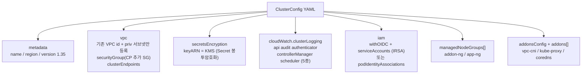
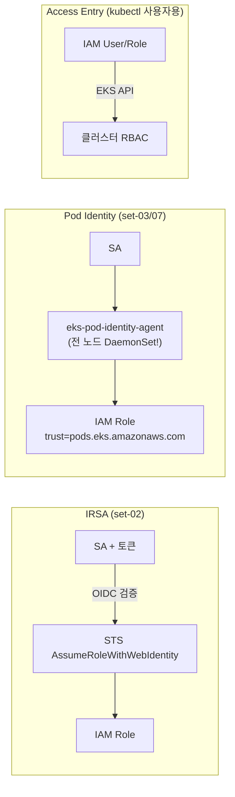
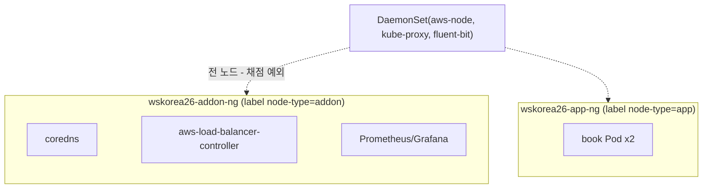
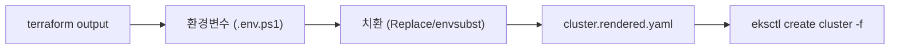

> 문서 유형: explanation

> 교재 원본: `skills-2026/set-02/task-1/eksctl/cluster.yaml`, `set-03/task-1/eksctl/cluster.yaml`

---

## 1. eksctl ClusterConfig 구조

**① 한 줄 정의** — eksctl은 `ClusterConfig` YAML 한 장으로 EKS 컨트롤 플레인 + 노드그룹 + IAM 연동 + 애드온을 선언적으로 생성하는 공식 CLI다.

**② 왜 (채점 관점)** — 채점은 `aws eks describe-cluster / describe-nodegroup` 출력을 정확 비교한다(mark 5-1~5-3: 버전 1.35, 로그 5종, KMS 별칭, 서브넷 이름, 노드그룹 이름/타입/tags.Name). 콘솔 클릭보다 YAML 한 장이 재현·수정(30% 변동 대비)에 압도적으로 유리하다.

**③ 원리**



핵심 필드 요약 (set-02 실측):

| 블록 | 핵심 값 | 채점 항목 |
|---|---|---|
| `metadata` | name=wskorea26-cluster, version="1.35" (따옴표 필수) | mark 5-1 |
| `accessConfig` | `authenticationMode: API` (Access Entry, aws-auth 미사용) | — |
| `vpc.subnets.private` | **priv-subnet-c/d만** 등록 — mark 5-2가 서브넷 **이름**을 정확 비교 | mark 5-2 |
| `vpc.securityGroup` | CP ENI 추가 SG — 채점 CloudShell→private API 443 허용 | 유의 13 |
| `secretsEncryption.keyARN` | wskorea26-eks-key ARN | mark 5-2 |
| `cloudWatch.clusterLogging` | 로그 **5종 전부** | mark 5-1 |
| `autoModeConfig.enabled` | false (직접 노드그룹 운용) | — |

**④ 세트별 차이** — 아래 3절 표 참조.

---

## 2. 인증/자격증명 3방식 — IRSA vs Pod Identity vs Access Entry

**① 한 줄 정의**
- **IRSA**: OIDC 공급자를 통해 ServiceAccount 토큰으로 IAM 역할을 위임받는 방식(노드 상주 컴포넌트 없음).
- **Pod Identity**: `eks-pod-identity-agent` DaemonSet이 노드에서 자격증명을 중계하는 신형 방식.
- **Access Entry**: **사람/도구의 kubectl 접근**을 aws-auth ConfigMap 대신 EKS API(`authenticationMode: API`)로 관리하는 방식 — 위 둘(Pod용)과 축이 다르다.

**② 왜 (채점 관점 — 여기가 갈림길)**

> **set-02는 반드시 IRSA.** mark 5-4는 "kube-system 파드(aws-node/kube-proxy 제외)는 전부 addon 노드"를 검사한다. Pod Identity를 쓰면 `eks-pod-identity-agent` **DaemonSet이 app 노드에도 떠서 5-4 감점**.
> **set-03/07은 Pod Identity + Access Entry(authMode=API, aws-auth 미사용)** — 해당 세트엔 5-4 같은 노드 배치 검사가 없어 신형 방식을 쓴다.

**③ 원리**



YAML 작성법 비교 (실측):

```yaml
# set-02 (IRSA) — cluster.yaml
iam:
  withOIDC: true
  serviceAccounts:
    - metadata: { name: wskorea26-book-sa, namespace: wskorea26 }
      attachPolicyARNs: ["${BOOK_APP_POLICY_ARN}"]   # 정책은 Terraform이 먼저 생성

# set-03 (Pod Identity) — cluster.yaml
iam:
  podIdentityAssociations:
    - namespace: wsc2026
      serviceAccountName: wsc2026-book-sa
      roleARN: "${BOOK_POD_ROLE_ARN}"                # 역할은 Terraform이 먼저 생성
addons:
  - name: eks-pod-identity-agent                     # Pod Identity 필수 애드온
```

**④ 세트별 차이 표**

| 항목 | set-02 | set-03 / set-07 |
|---|---|---|
| Pod 자격증명 | **IRSA** (`withOIDC` + `serviceAccounts`) | **Pod Identity** (`podIdentityAssociations`) |
| 이유 | mark 5-4: agent DaemonSet이 app 노드에 뜨면 감점 | 노드 배치 검사 없음, 신형 권장 방식 |
| Terraform 준비물 | IAM **정책**(attachPolicyARNs로 참조) | IAM **역할**(trust=pods.eks.amazonaws.com) |
| kubectl 인증 | Access Entry (authMode=API) | Access Entry (authMode=API) — **공통** |
| aws-auth ConfigMap | 미사용 | 미사용 |
| 엔드포인트 | public+private (본 PC에서 kubectl) | fully private (`privateCluster.enabled`) — kubectl은 VPC CloudShell |
| EBS CSI | 미설치 (csi-node DaemonSet도 5-4 위반) → Prometheus emptyDir | 세트 요구에 따름 |

---

## 3. 노드그룹 2분할 (addon / app)

**① 한 줄 정의** — 시스템 컴포넌트용 addon 노드그룹과 애플리케이션 전용 app 노드그룹으로 분리하고 label(+필요시 taint)로 스케줄을 통제한다.

**② 왜 (채점 관점)** — mark 5-3이 `describe-nodegroup`으로 노드그룹 이름·인스턴스 타입·**tags.Name**·서브넷을 검사하고, mark 5-4가 "kube-system 파드는 addon 노드, wskorea26 파드는 app 노드"를 `kubectl get pod -o wide`로 검사한다.

**③ 원리**



- **label**: `node-type: addon|app` → 워크로드는 `nodeSelector`로 지정.
- **taint**: set-02는 taint 없음(nodeSelector만으로 5-4 충족). set-03은 workload NG에 `NoSchedule` taint를 걸어 앱 외 스케줄을 강제 차단 — 앱 Deployment에 toleration 필요.
- 두 NG 모두 AL2023, t3.medium, priv-subnet-c/d 분산, gp3 암호화, IMDSv1 비활성.

**함정 ①: `tags.Name` vs `instanceName`** — managed NG의 `tags`는 EC2 인스턴스로 전파되지 않는다. 게다가 `tags.Name`을 쓰면 Launch Template TagSpecifications에 eksctl 기본 Name과 **중복 등록**되는 함정이 있다. 정리:
- `tags.Name: wskorea26-addon-node` → **describe-nodegroup의 tags.Name 채점(mark 5-3)용** — set-02는 채점 대상이라 유지.
- `instanceName: wskorea26-addon-node` → **EC2 인스턴스 Name 태그**를 실제로 지정하는 필드. 인스턴스 태그 요구는 반드시 이걸로.

**함정 ②: `addonsConfig.disableDefaultAddons: true`** — 최신 eksctl은 metrics-server를 kube-system에 기본 설치하는데, nodeSelector가 없어 **app 노드에 스케줄되면 mark 5-4 위반**. 기본 애드온 자동설치를 끄고 필요한 것만 명시한다.

**함정 ③: coredns 노드 고정** — coredns는 Deployment형 애드온이라 아무 노드나 갈 수 있다. `configurationValues`로 고정:

```yaml
addons:
  - name: vpc-cni
  - name: kube-proxy
  - name: coredns
    configurationValues: |
      {"nodeSelector": {"node-type": "addon"}}
```

애드온 버전은 **지정하지 않는다**(작업규칙 2: EKS Addon 미고정 — eksctl이 클러스터 버전 default 사용).

**④ 세트별 차이**

| 항목 | set-02 | set-03 |
|---|---|---|
| NG 이름 | wskorea26-addon-ng / wskorea26-app-ng | wsc2026-addon-nodegroup / wsc2026-workload-ng |
| label 키 | `node-type` | `wsc2026/node` |
| taint | 없음 | workload NG에 NoSchedule |
| tags.Name | 있음 (mark 5-3 채점) | 없음 (instanceName만) |
| 부트스트랩 | 기본 | `overrideBootstrapCommand`(nodeadm NodeConfig)로 clusterDomain 변경 |

---

## 4. `${VAR}` 플레이스홀더 치환

**① 한 줄 정의** — cluster.yaml의 VPC/서브넷/SG/KMS/정책 ARN은 `${VAR}` 플레이스홀더로 두고, terraform output 값으로 치환한 `cluster.rendered.yaml`을 생성해 적용한다.

**② 왜** — Terraform이 만든 리소스 ID는 apply 때마다 바뀐다. 하드코딩하면 재배포·30% 변동 대응이 불가능하다.

**③ 원리 / 방법**



```powershell
# PowerShell (대회 환경 — Windows 11)
$c = Get-Content cluster.yaml -Raw
foreach ($v in 'VPC_ID','PRIV_SUBNET_C','PRIV_SUBNET_D','CLUSTER_EXTRA_SG_ID','NODE_SG_ID',
               'EKS_KMS_ARN','BOOK_APP_POLICY_ARN','LBC_POLICY_ARN','FLUENT_BIT_POLICY_ARN') {
  $c = $c.Replace('${' + $v + '}', [Environment]::GetEnvironmentVariable($v))
}
$c | Set-Content cluster.rendered.yaml
```

```bash
# Linux/CloudShell — envsubst
envsubst < cluster.yaml > cluster.rendered.yaml
```

**치환 누락 검사 (필수)** — 하나라도 남으면 eksctl이 이상한 에러로 죽는다:

```powershell
Select-String '\$\{' cluster.rendered.yaml    # 출력이 없어야 정상
```
```bash
grep '\${' cluster.rendered.yaml              # 출력이 없어야 정상
```

생성 소요: **약 20분** (CloudFormation 스택: 클러스터 → OIDC/SA → 노드그룹 순).

---

## 5. 자기 점검 퀴즈

1. set-02에서 Pod Identity 대신 IRSA를 쓰는 이유는?
2. mark 5-2는 클러스터 서브넷의 무엇을 검사하며, cluster.yaml에서 어떻게 대응하는가?
3. EC2 인스턴스의 Name 태그를 지정하려면 managed NG에서 어떤 필드를 써야 하고, `tags.Name`은 왜 남겨두는가?
4. `addonsConfig.disableDefaultAddons: true`를 넣지 않으면 어떤 채점 항목이 왜 깨지는가?
5. cluster.rendered.yaml 적용 전 반드시 해야 할 검사와 명령은?

<details>
<summary>정답</summary>

1. Pod Identity는 `eks-pod-identity-agent` DaemonSet이 전 노드(app 포함)에 떠서, "kube-system 파드는 addon 노드만"을 검사하는 mark 5-4를 위반한다. IRSA는 노드 상주 컴포넌트가 없다.
2. 클러스터에 등록된 서브넷의 **Name 태그**를 정확 비교한다(`wskorea26-priv-subnet-c/d`). cluster.yaml `vpc.subnets.private`에 priv 서브넷 2개만 이름 키와 함께 등록한다.
3. `instanceName`. managed NG의 `tags`는 인스턴스로 전파되지 않고 LT TagSpec 중복 함정도 있다. `tags.Name`은 mark 5-3이 `describe-nodegroup`의 tags.Name을 검사하므로 채점용으로 유지한다.
4. mark 5-4. 최신 eksctl이 기본 설치하는 metrics-server가 nodeSelector 없이 app 노드에 스케줄될 수 있다.
5. `${VAR}` 치환 누락 검사 — `grep '\${' cluster.rendered.yaml` (PowerShell: `Select-String '\$\{'`) 출력이 없어야 한다.

</details>
