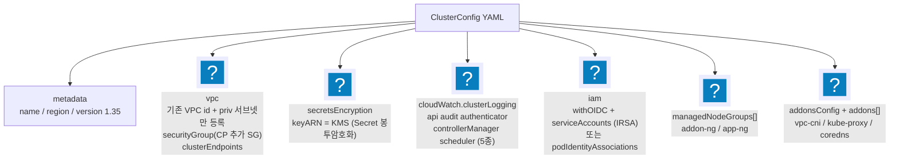
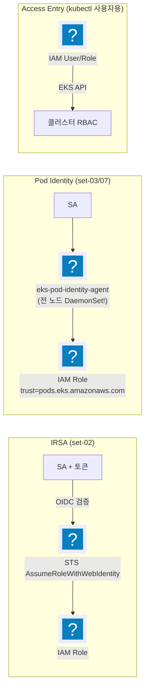
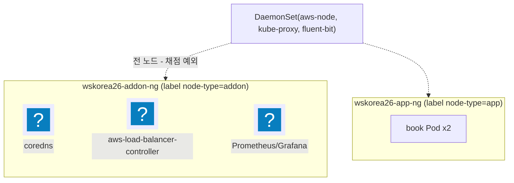
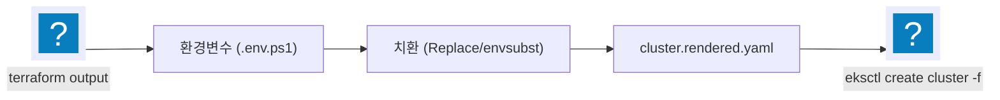

import { Quiz, QuizResults } from 'starlight-quiz/components';
import { Tabs, TabItem } from '@astrojs/starlight/components';

> 문서 유형: explanation

> 교재 원본: `skills-2026/set-02/task-1/eksctl/cluster.yaml`, `set-03/task-1/eksctl/cluster.yaml`

---

## 1. eksctl ClusterConfig 구조

**① 한 줄 정의** — eksctl은 `ClusterConfig` YAML 한 장으로 EKS 컨트롤 플레인 + 노드그룹 + IAM 연동 + 애드온을 선언적으로 생성하는 공식 CLI다.

**② 왜 (채점 관점)** — 채점은 `aws eks describe-cluster / describe-nodegroup` 출력을 정확 비교한다(mark 5-1~5-3: 버전 1.35, 로그 5종, KMS 별칭, 서브넷 이름, 노드그룹 이름/타입/tags.Name). 콘솔 클릭보다 YAML 한 장이 재현·수정(30% 변동 대비)에 압도적으로 유리하다.

**③ 원리**



핵심 필드 요약 (set-02 실측):

| 블록 | 핵심 값 | 채점 항목 |
|---|---|---|
| `metadata` | name=wskorea26-cluster, version="1.35" (따옴표 필수) | mark 5-1 |
| `accessConfig` | `authenticationMode: API` (Access Entry, aws-auth 미사용) | — |
| `vpc.subnets.private` | **priv-subnet-c/d만** 등록 — mark 5-2가 서브넷 **이름**을 정확 비교 | mark 5-2 |
| `vpc.securityGroup` | CP ENI 추가 SG — 채점 CloudShell→private API 443 허용 | 유의 13 |
| `secretsEncryption.keyARN` | wskorea26-eks-key ARN | mark 5-2 |
| `cloudWatch.clusterLogging` | 로그 **5종 전부** | mark 5-1 |
| `autoModeConfig.enabled` | false (직접 노드그룹 운용) | — |

**④ 세트별 차이** — 아래 3절 표 참조.

---

## 2. 인증/자격증명 3방식 — IRSA vs Pod Identity vs Access Entry

**① 한 줄 정의**
- **IRSA**: OIDC 공급자를 통해 ServiceAccount 토큰으로 IAM 역할을 위임받는 방식(노드 상주 컴포넌트 없음).
- **Pod Identity**: `eks-pod-identity-agent` DaemonSet이 노드에서 자격증명을 중계하는 신형 방식.
- **Access Entry**: **사람/도구의 kubectl 접근**을 aws-auth ConfigMap 대신 EKS API(`authenticationMode: API`)로 관리하는 방식 — 위 둘(Pod용)과 축이 다르다.

**② 왜 (채점 관점 — 여기가 갈림길)**

:::danger[세트별 채점 갈림]
**set-02는 반드시 IRSA.** mark 5-4는 "kube-system 파드(aws-node/kube-proxy 제외)는 전부 addon 노드"를 검사한다. Pod Identity를 쓰면 `eks-pod-identity-agent` **DaemonSet이 app 노드에도 떠서 5-4 감점**.
**set-03/07은 Pod Identity + Access Entry(authMode=API, aws-auth 미사용)** — 해당 세트엔 5-4 같은 노드 배치 검사가 없어 신형 방식을 쓴다.
:::

:::note[협의회(2026-07-31) — Access Entry는 "강제"에서 "선택"으로]
1과제 과제지에 명시됐던 Access Entry 사용 요구는 삭제되고, kubectl 접근 방식(Access Entry·aws-auth ConfigMap 등)은 선수 자유가 됐다. 과제지에는 "CloudShell에서 kubectl 명령어를 사용할 수 있어야 한다"만 남는다. 정답지 구성(`authenticationMode: API` + Access Entry)은 그 요구를 채우는 최단 경로라 그대로 쓴다 — 바뀐 것은 방식이 채점되지 않는다는 점이지, 채점 신원이 CloudShell에서 kubectl이 돼야 한다는 사실이 아니다.

회의록이 채점 절차까지 못 박았다. **쿠버네티스 채점은 선수의 CloudShell에서 진행하고**, 접근이 안 될 때만 `aws eks update-kubeconfig --name <클러스터명> --region <리전>` 을 **1회** 실행할 수 있다. 그 외에 자격 증명을 입력하거나 다른 명령을 실행하는 것은 허용되지 않는다 — 채점 시작 시점의 kubeconfig가 곧 결과다([대회 운영 규칙](/reference/competition-rules/)).
:::

**③ 원리**



YAML 작성법 비교 (실측):

<Tabs syncKey="tool">
  <TabItem label="set-02 (IRSA)">
  ```yaml title="cluster.yaml"
  iam:
    withOIDC: true
    serviceAccounts:
      - metadata: { name: wskorea26-book-sa, namespace: wskorea26 }
        attachPolicyARNs: ["${BOOK_APP_POLICY_ARN}"]   # 정책은 Terraform이 먼저 생성
  ```
  </TabItem>
  <TabItem label="set-03 (Pod Identity)">
  ```yaml title="cluster.yaml"
  iam:
    podIdentityAssociations:
      - namespace: wsc2026
        serviceAccountName: wsc2026-book-sa
        roleARN: "${BOOK_POD_ROLE_ARN}"                # 역할은 Terraform이 먼저 생성
  addons:
    - name: eks-pod-identity-agent                     # Pod Identity 필수 애드온
  ```
  </TabItem>
</Tabs>

**④ 세트별 차이 표**

| 항목 | set-02 | set-03 / set-07 |
|---|---|---|
| Pod 자격증명 | **IRSA** (`withOIDC` + `serviceAccounts`) | **Pod Identity** (`podIdentityAssociations`) |
| 이유 | mark 5-4: agent DaemonSet이 app 노드에 뜨면 감점 | 노드 배치 검사 없음, 신형 권장 방식 |
| Terraform 준비물 | IAM **정책**(attachPolicyARNs로 참조) | IAM **역할**(trust=pods.eks.amazonaws.com) |
| kubectl 인증 | Access Entry (authMode=API) | Access Entry (authMode=API) — **공통** |
| aws-auth ConfigMap | 미사용 | 미사용 |
| 엔드포인트 | public+private (본 PC에서 kubectl) | fully private (`privateCluster.enabled`) — kubectl은 VPC CloudShell |
| EBS CSI | 미설치 (csi-node DaemonSet도 5-4 위반) → Prometheus emptyDir | 세트 요구에 따름 |

---

## 3. 노드그룹 2분할 (addon / app)

**① 한 줄 정의** — 시스템 컴포넌트용 addon 노드그룹과 애플리케이션 전용 app 노드그룹으로 분리하고 label(+필요시 taint)로 스케줄을 통제한다.

**② 왜 (채점 관점)** — mark 5-3이 `describe-nodegroup`으로 노드그룹 이름·인스턴스 타입·**tags.Name**·서브넷을 검사하고, mark 5-4가 "kube-system 파드는 addon 노드, wskorea26 파드는 app 노드"를 `kubectl get pod -o wide`로 검사한다.

**③ 원리**



- **label**: `node-type: addon|app` → 워크로드는 `nodeSelector`로 지정.
- **taint**: set-02는 taint 없음(nodeSelector만으로 5-4 충족). set-03은 workload NG에 `NoSchedule` taint를 걸어 앱 외 스케줄을 강제 차단 — 앱 Deployment에 toleration 필요.
- 두 NG 모두 AL2023, t3.medium, priv-subnet-c/d 분산, gp3 암호화, IMDSv1 비활성.

**함정 ①: `tags.Name` vs `instanceName`** — managed NG의 `tags`는 EC2 인스턴스로 전파되지 않는다. 게다가 `tags.Name`을 쓰면 Launch Template TagSpecifications에 eksctl 기본 Name과 **중복 등록**되는 함정이 있다. 정리:
- `tags.Name: wskorea26-addon-node` → **describe-nodegroup의 tags.Name 채점(mark 5-3)용** — set-02는 채점 대상이라 유지.
- `instanceName: wskorea26-addon-node` → **EC2 인스턴스 Name 태그**를 실제로 지정하는 필드. 인스턴스 태그 요구는 반드시 이걸로.

**함정 ②: `addonsConfig.disableDefaultAddons: true`** — 최신 eksctl은 metrics-server를 kube-system에 기본 설치하는데, nodeSelector가 없어 **app 노드에 스케줄되면 mark 5-4 위반**. 기본 애드온 자동설치를 끄고 필요한 것만 명시한다.

**함정 ③: coredns 노드 고정** — coredns는 Deployment형 애드온이라 아무 노드나 갈 수 있다. `configurationValues`로 고정:

```yaml title="cluster.yaml"
addons:
  - name: vpc-cni
  - name: kube-proxy
  - name: coredns
    configurationValues: |
      {"nodeSelector": {"node-type": "addon"}}
```

애드온 버전은 **지정하지 않는다**(작업규칙 2: EKS Addon 미고정 — eksctl이 클러스터 버전 default 사용).

**④ 세트별 차이**

| 항목 | set-02 | set-03 |
|---|---|---|
| NG 이름 | wskorea26-addon-ng / wskorea26-app-ng | wsc2026-addon-nodegroup / wsc2026-workload-ng |
| label 키 | `node-type` | `wsc2026/node` |
| taint | 없음 | workload NG에 NoSchedule |
| tags.Name | 있음 (mark 5-3 채점) | 없음 (instanceName만) |
| 부트스트랩 | 기본 | `overrideBootstrapCommand`(nodeadm NodeConfig)로 clusterDomain 변경 |

---

## 4. `${VAR}` 플레이스홀더 치환

**① 한 줄 정의** — cluster.yaml의 VPC/서브넷/SG/KMS/정책 ARN은 `${VAR}` 플레이스홀더로 두고, terraform output 값으로 치환한 `cluster.rendered.yaml`을 생성해 적용한다.

**② 왜** — Terraform이 만든 리소스 ID는 apply 때마다 바뀐다. 하드코딩하면 재배포·30% 변동 대응이 불가능하다.

**③ 원리 / 방법**



<Tabs syncKey="shell">
  <TabItem label="PowerShell">
  ```powershell
  # 대회 환경 — Windows 11
  $c = Get-Content cluster.yaml -Raw
  foreach ($v in 'VPC_ID','PRIV_SUBNET_C','PRIV_SUBNET_D','CLUSTER_EXTRA_SG_ID','NODE_SG_ID',
                 'EKS_KMS_ARN','BOOK_APP_POLICY_ARN','LBC_POLICY_ARN','FLUENT_BIT_POLICY_ARN') {
    $c = $c.Replace('${' + $v + '}', [Environment]::GetEnvironmentVariable($v))
  }
  $c | Set-Content cluster.rendered.yaml
  ```
  </TabItem>
  <TabItem label="Bash (Linux/CloudShell)">
  ```bash
  # envsubst
  envsubst < cluster.yaml > cluster.rendered.yaml
  ```
  </TabItem>
</Tabs>

:::caution[치환 누락 검사 (필수)]
하나라도 남으면 eksctl이 이상한 에러로 죽는다 — 생성에 **약 20분**이 걸리므로 되돌리는 비용이 가장 비싸다.
:::

<Tabs syncKey="shell">
  <TabItem label="PowerShell">
  ```powershell
  Select-String '\$\{' cluster.rendered.yaml    # 출력이 없어야 정상
  ```
  </TabItem>
  <TabItem label="Bash (Linux/CloudShell)">
  ```bash
  grep '\${' cluster.rendered.yaml              # 출력이 없어야 정상
  ```
  </TabItem>
</Tabs>

생성 소요: **약 20분** (CloudFormation 스택: 클러스터 → OIDC/SA → 노드그룹 순).

---

## 5. 자기 점검 퀴즈

<Quiz title="set-02 가 IRSA 를 쓰는 이유">
set-02 에서 Pod Identity 대신 IRSA 를 쓰는 결정적 이유는?

- [x] Pod Identity 는 `eks-pod-identity-agent` DaemonSet 이 app 노드를 포함한 전 노드에 뜨는데, mark 5-4 가 "kube-system 파드(aws-node/kube-proxy 제외)는 전부 addon 노드"를 검사하기 때문
- [ ] 해당 EKS 버전이 Pod Identity 를 아직 지원하지 않기 때문
  > 지원한다. set-03/07 은 같은 계열에서 Pod Identity 를 정상적으로 쓴다. 순전히 5-4 노드 배치 검사 때문의 선택이다.
- [ ] Pod Identity 를 쓰면 Access Entry(`authenticationMode: API`)로 kubectl 인증을 할 수 없기 때문
  > 축이 다르다. Access Entry 는 **사람/도구의 kubectl 접근**용이고 set-02·set-03 둘 다 공통으로 쓴다. Pod 자격증명 방식과는 무관하다.
- [ ] IRSA 가 Pod Identity 보다 신형이고 AWS 권장 방식이기 때문
  > 신형은 Pod Identity 쪽이다. 채점 조건이 없다면 set-03/07 처럼 Pod Identity 가 권장된다.

Pod Identity 는 `eks-pod-identity-agent` DaemonSet 이 전 노드(app 포함)에 떠서 mark 5-4 를 위반한다. IRSA 는 OIDC 공급자 + ServiceAccount 토큰 방식이라 **노드 상주 컴포넌트가 없다**.

같은 논리로 set-02 는 EBS CSI 도 설치하지 않는다(csi-node DaemonSet 이 5-4 위반) → Prometheus 는 emptyDir.

Terraform 준비물도 갈린다: IRSA 는 IAM **정책**(`attachPolicyARNs` 로 참조), Pod Identity 는 IAM **역할**(trust=`pods.eks.amazonaws.com`).
</Quiz>

<Quiz title="mark 5-2 의 서브넷 검사">
mark 5-2 는 클러스터 서브넷의 무엇을 검사하고, cluster.yaml 은 어떻게 대응하는가?

- [x] 등록된 서브넷의 **Name 태그**를 정확 비교한다 → `vpc.subnets.private` 에 `wskorea26-priv-subnet-c/d` 2개만 이름 키와 함께 등록
- [ ] 서브넷 ID 목록을 비교한다 → public 2 + private 2, 총 4개를 전부 등록
  > 서브넷 ID 는 apply 마다 바뀌므로 채점 기준이 될 수 없다. 게다가 public 서브넷까지 등록하면 이름 비교 대상이 늘어 오히려 틀린다.
- [ ] 서브넷 CIDR 을 비교한다 → `vpc.cidr` 만 맞추면 된다
  > `vpc.cidr` 은 기존 VPC 를 재사용할 때 참고값일 뿐이고, 검사 대상은 클러스터에 실제 등록된 서브넷이다.
- [ ] AZ 분산 여부만 본다 → 서로 다른 AZ 의 서브넷 2개 이상이면 통과

등록된 서브넷의 **Name 태그**를 정확 비교한다(`wskorea26-priv-subnet-c` / `wskorea26-priv-subnet-d`). cluster.yaml 의 `vpc.subnets.private` 에 priv 서브넷 2개만 이름 키와 함께 등록한다.

같은 `vpc` 블록에서 두 필드를 함께 챙긴다.

- `securityGroup` — CP ENI 추가 SG. 채점 CloudShell 에서 private API 443 으로 닿아야 한다(유의 13).
- `clusterEndpoints` — set-02 는 public+private, set-03 은 fully private.
</Quiz>

<Quiz title="instanceName vs tags.Name">
managed 노드그룹의 `tags` 는 EC2 인스턴스로 전파되지 않는다. 게다가 `tags.Name` 은 Launch Template 의 TagSpecifications 에 eksctl 기본 Name 과 중복 등록된다. EC2 **인스턴스**의 Name 태그를 실제로 지정하는 필드 이름은 [[instanceName]] 이다.

---

- `instanceName: wskorea26-addon-node` → EC2 인스턴스 Name 태그를 실제로 지정하는 필드. **인스턴스 태그 요구는 반드시 이걸로.**
- `tags.Name: wskorea26-addon-node` → `describe-nodegroup` 출력의 `tags.Name` 을 검사하는 **mark 5-3 채점용**. set-02 는 채점 대상이라 유지한다.

둘은 대체재가 아니라 서로 다른 대상이다. set-03 은 `tags.Name` 없이 `instanceName` 만 쓴다 — 그 세트엔 tags.Name 채점이 없기 때문.

mark 5-3 이 함께 보는 것: 노드그룹 이름, 인스턴스 타입, tags.Name, 서브넷.
</Quiz>

<Quiz title="disableDefaultAddons 를 빼면">
`addonsConfig.disableDefaultAddons: true` 를 넣지 않으면 어떤 채점 항목이 왜 깨지는가?

- [x] mark 5-4 — 최신 eksctl 이 kube-system 에 기본 설치하는 metrics-server 에 nodeSelector 가 없어 app 노드로 스케줄될 수 있다
- [ ] mark 5-3 — 기본 애드온이 노드그룹의 `tags.Name` 을 덮어쓴다
  > 애드온은 노드그룹 태그를 건드리지 않는다. tags.Name 함정은 Launch Template TagSpecifications 쪽 이야기다.
- [ ] mark 5-1 — 기본 애드온이 클러스터 로깅 5종 중 일부를 비활성화한다
  > 로깅 5종은 `cloudWatch.clusterLogging` 이 단독으로 정한다. 애드온과 무관.
- [ ] 아무것도 깨지지 않는다 — 설치 시간을 줄이는 최적화 옵션일 뿐이다
  > Deployment 형 애드온은 노드를 고정하지 않으면 아무 노드로나 간다. 자동 설치는 그 통제를 벗어나므로 5-4 위험이 실재한다.

mark 5-4 다. 기본 애드온 자동 설치를 끄고 필요한 것(`vpc-cni`, `kube-proxy`, `coredns`)만 명시한다.

같은 이유로 coredns 는 Deployment 형이라 노드를 명시 고정한다:

```yaml
addons:
  - name: vpc-cni
  - name: kube-proxy
  - name: coredns
    configurationValues: |
      {"nodeSelector": {"node-type": "addon"}}
```

애드온 **버전은 지정하지 않는다**(작업규칙 2: EKS Addon 미고정 — eksctl 이 클러스터 버전 default 를 쓴다).
</Quiz>

<Quiz title="rendered.yaml 적용 전 검사">
`cluster.rendered.yaml` 을 eksctl 에 넘기기 전 반드시 해야 하는 검사는?

- [x] `${VAR}` 치환 누락 검사 — `grep '\${' cluster.rendered.yaml`(PowerShell 은 `Select-String '\$\{'`), **출력이 없어야** 정상
- [ ] `eksctl create cluster --dry-run` — 치환 누락은 dry-run 이 잡아준다
  > dry-run 은 스키마 위주라 미치환 문자열을 그냥 "값"으로 받아들이고 넘어갈 수 있다. 실제로는 생성 도중 엉뚱한 에러로 죽는다.
- [ ] `kubectl apply --dry-run=client -f cluster.rendered.yaml`
  > ClusterConfig 는 k8s API 오브젝트가 아니라 eksctl 전용 스키마다. kubectl 은 이 파일을 알지 못한다.
- [ ] `terraform validate` 로 output 값이 전부 채워졌는지 확인
  > validate 는 HCL 문법만 본다. 렌더링된 YAML 은 Terraform 의 관심사가 아니다.

`${VAR}` 치환 누락 검사다. 하나라도 남으면 eksctl 이 그 문자열을 리소스 이름으로 그대로 받아 원인을 짚기 어려운 에러를 낸다.

**클러스터 생성에 약 20분**이 걸린다(CloudFormation 스택: 클러스터 → OIDC/SA → 노드그룹 순). 되돌리는 비용이 가장 비싼 실수다.

```powershell
Select-String '\$\{' cluster.rendered.yaml    # 출력이 없어야 정상
```
```bash
grep '\${' cluster.rendered.yaml              # 출력이 없어야 정상
```
</Quiz>

<QuizResults confetti />
