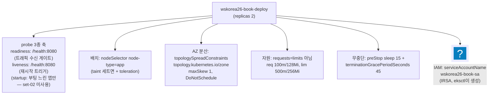
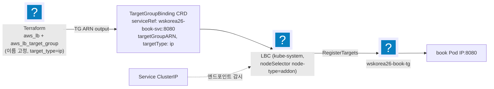
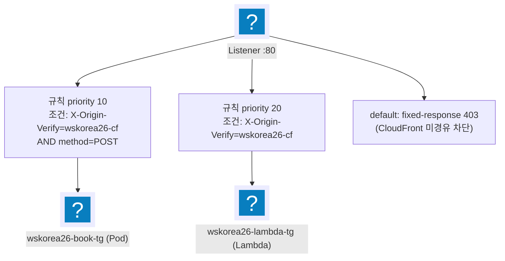

import { Quiz, QuizResults } from 'starlight-quiz/components';
import { Tabs, TabItem } from '@astrojs/starlight/components';

> 문서 유형: explanation

선행 지식과 학습 경로는 [모듈 개요](/part-2/05-k8s-workloads-alb/)에.

> 교재 원본: `skills-2026/set-02/task-1/k8s/app/*`, `terraform/alb.tf`

:::tip[읽으면서 확인한다]
1절과 3절 끝에 **지금 확인하기** 블록이 접혀 있다. 열고 따라오면 매니페스트와 차트가 실제로 무엇으로 펼쳐지는지 본다. 블록을 열지 않고 읽어도 문서는 그대로 이어진다.

[04 이론](/part-2/04-eksctl-cluster/theory/)과 같이 **이 문서는 아무것도 만들지 않는다.** `--dry-run=server` 와 `helm template` 은 결과만 보여 주고 클러스터에 저장하지 않으므로 **과금이 0원**이다. 실제 배포는 [05 실습](/part-2/05-k8s-workloads-alb/lab/)이 한다.
:::

---

## 1. 프로덕션급 Deployment

**① 한 줄 정의** — Deployment는 Pod 복제본을 선언적으로 유지하는 컨트롤러이며, 대회에서는 "고가용성 + 노드 배치 + 무중단"을 만족하는 스펙을 요구한다.

Deployment·Pod·probe·ServiceAccount 는 [k8s-basics](/start/k8s-basics/)가 먼저 정의한다. 아래 표의 `requests`/`limits` 와 QoS 등급은 [그 문서의 requests / limits 절](/start/k8s-basics/#2-6-리소스-요청과-상한--requests--limits)에 있다.

**② 왜 (채점 관점)** — mark 5-4가 wskorea26 파드의 노드 배치(app)를, mark 9-1~9-4가 실제 애플리케이션 동작을 검사한다. probe가 없으면 죽은 Pod가 타깃에 남아 9번 항목이 간헐 실패하고, 노드 배치가 틀리면 5-4 감점.

**③ 원리 — set-02 deployment.yaml의 6대 요소**



<details class="diagram-note">
<summary>이 도식이 보여주는 것</summary>

Deployment 하나에 채점이 요구하는 축이 여섯 개 걸린다. 프로브는 역할이 갈린다 — readiness 는 트래픽을 받을지 정하고 liveness 는 재시작을 건다. 배치는 nodeSelector 로, AZ 분산은 topologySpread 로, 자원은 requests 와 limits 를 다르게 두어 버스트를 허용한다. 무중단 종료는 preStop 대기와 유예 시간의 조합이고, 신원은 IRSA 로 만든 서비스 계정이다.

</details>

set-02 실측값:

| 요소 | 값 (실측) |
|---|---|
| readinessProbe | httpGet /health:8080, delay 5, period 10 |
| livenessProbe | httpGet /health:8080, delay 10, period 15 |
| nodeSelector | `node-type: app` |
| toleration | set-02 없음 / set-03 은 workload taint 대응 |
| topologySpread | zone 키, maxSkew 1, **DoNotSchedule** |
| PDB (별도 manifest) | `minAvailable: 1` |
| resources | requests 100m/128Mi, limits 500m/256Mi |
| preStop + grace | `sleep 15` / 45s |

각 값을 그렇게 두는 이유는 이렇다.

- **probe 2종** — readiness 는 준비되지 않은 Pod 로 트래픽이 가는 것을 막아 타깃그룹의 healthy 판정과 결과를 일치시킨다. liveness 는 행이 걸린 컨테이너를 자동으로 재시작한다.
- **배치** — `nodeSelector` 가 앱 Pod 을 app 노드에만 올린다(mark 5-4). taint 를 건 노드그룹을 쓰는 세트에서는 toleration 을 함께 달아야 그 노드에 스케줄이 허용된다.
- **AZ 분산** — `topologySpread` 는 AZ 하나가 통째로 죽어도 최소 1개가 살아남게 한다. `DoNotSchedule` 은 제약을 못 지키면 스케줄 자체를 거부하는 하드 제약이고, `ScheduleAnyway` 는 최선 노력의 소프트 제약이다.
- **드레인 중 가용성** — PDB `minAvailable: 1` 이 노드 드레인 중에도 최소 1개를 남긴다.
- **QoS 등급** — QoS 는 노드 자원이 부족할 때 어느 Pod 부터 축출할지 정하는 등급이다. `requests` 와 `limits` 를 둘 다 적으면 등급이 정해지고, 두 값을 같게 맞추면 가장 늦게 축출되는 Guaranteed 가 된다. set-02 는 두 값을 다르게 두어 순간 버스트를 허용한다.
- **무중단 종료** — `preStop` 과 `terminationGracePeriodSeconds` 는 짝으로 움직인다. 두 값이 어떻게 맞물리는지는 graceful shutdown 흐름에서 이어 설명한다.

**graceful shutdown 흐름** — Pod 삭제가 시작되면 엔드포인트 제거 전파와 preStop 실행이 동시에 일어난다. preStop 의 `sleep 15` 가 도는 15초 동안 ALB/TGB 가 타깃 등록 해제를 끝낸다. 그동안 컨테이너는 살아 있으므로, 이미 도착했지만 아직 응답을 못 보낸 요청(in-flight 요청)도 마저 처리된다.

`sleep` 이 끝나면 컨테이너에 SIGTERM 이 간다. SIGTERM 은 프로세스에 종료를 요청하는 시그널이고, 받은 프로세스는 곧바로 죽는 대신 정리할 시간을 갖는다. 그 시간의 상한이 `terminationGracePeriodSeconds` 다.

여기서 뺄셈이 하나 필요하다. 유예 45초는 SIGTERM 시점이 아니라 **preStop 이 시작한 시점부터** 센다. preStop 이 앞에서 15초를 쓰므로 SIGTERM 이후 남는 시간은 약 30초다.

**④ 변형 포인트** — 당일 과제의 약 30% 가 수정된다.

| 바뀌는 값 | 고칠 곳 | 확인 |
|---|---|---|
| label 키 (`node-type` ↔ `wsc2026/node`) | Deployment 의 `nodeSelector` | 노드그룹 label 키와 같은 값(mark 5-4) |
| taint 있는 노드그룹 | Deployment 에 `tolerations` 추가 | toleration 이 없으면 그 노드에 스케줄되지 않는다 |
| 헬스체크 경로·포트 | `readinessProbe` · `livenessProbe` 의 `httpGet` | 타깃그룹 health_check 경로와 같은 값 |
| 가용성 요구 | `replicas`, `topologySpreadConstraints`, PDB `minAvailable` | AZ 하나가 죽어도 최소 1개 생존 |
| 종료 유예 요구 | `preStop` 의 `sleep` + `terminationGracePeriodSeconds` | 유예가 preStop 보다 커야 한다 — 45초에 15초면 SIGTERM 이후 약 30초 |

부팅이 느린 앱이 나오면 `startupProbe` 를 더한다(set-02 는 쓰지 않는다). QoS 를 Guaranteed 로 요구하면 `requests` 와 `limits` 를 같은 값으로 맞춘다.

<details class="build-step">
<summary>지금 확인하기 — API 서버에 물어보되 저장하지는 않는다</summary>

위 표의 값들이 실제로 받아들여지는지 API 서버에 물어본다. [04 실습](/part-2/04-eksctl-cluster/lab/)의 클러스터가 있어야 하고, `${ECR}` 을 치환한 `rendered/app/deployment.yaml` 이 있어야 한다. **저장하지 않으므로 파드는 뜨지 않는다.**

```bash
kubectl apply --dry-run=server -f rendered/app/deployment.yaml
```

기대: `deployment.apps/wskorea26-book-deploy created (server dry run)` 한 줄. 맨 끝의 `(server dry run)` 이 저장되지 않았다는 표시다.

`--dry-run` 은 두 가지다. `client` 는 손안에서 YAML 문법만 보고, `server` 는 요청을 API 서버까지 보내 **필드 이름·타입·기본값 채우기·admission 검사까지** 거친 뒤 저장 직전에 버린다. 오타 난 필드 이름은 `client` 가 통과시키고 `server` 가 잡는다.

정말 안 만들어졌는지 확인한다.

<Tabs syncKey="shell">
  <TabItem label="PowerShell">
  ```powershell
  kubectl get deploy -n wskorea26
  ```
  </TabItem>
  <TabItem label="Bash (Linux/CloudShell)">
  ```bash
  kubectl get deploy -n wskorea26
  ```
  </TabItem>
</Tabs>

기대: `No resources found` — 아직 이 문서는 아무것도 만들지 않았다.

`error validating data: ValidationError` 면 필드 이름이나 들여쓰기가 틀린 것이고, `namespaces "wskorea26" not found` 면 네임스페이스를 먼저 적용해야 한다.

</details>

---

## 2. Helm 기초

**① 한 줄 정의** — Helm은 k8s manifest 묶음(chart)을 값(values)으로 렌더링해 설치·업그레이드하는 패키지 매니저다.

**② 왜** — LBC·kube-prometheus-stack 같은 대형 컴포넌트는 manifest 수십 장 — helm 없이는 대회 시간 내 불가능.

**③ 핵심 개념 / 필수 명령**

| 용어 | 의미 |
|---|---|
| repo | 차트 저장소 (`helm repo add eks https://aws.github.io/eks-charts`) |
| chart | 템플릿 묶음 (`eks/aws-load-balancer-controller`) |
| release | 설치된 인스턴스 이름 (`-n kube-system aws-load-balancer-controller`) |
| values | `--set key=val` 또는 `-f values.yaml` 로 주입하는 설정 |

```powershell
helm repo add <name> <url>; helm repo update
helm upgrade --install <release> <repo/chart> --version <핀> -n <ns> -f values.yaml  # 멱등 — 재실행 안전
helm -n <ns> list / helm -n <ns> uninstall <release>
```

버전은 **고정**한다(작업규칙 2, latest 금지). 예: LBC `--version 3.4.0`, kube-prometheus-stack `--version 87.5.1`.

**④ 변형 포인트** — 바뀌는 값이 전부 명령 인자 쪽에 모인다.

- **바뀌는 값**: release 이름, 네임스페이스, 차트 버전 핀, values 항목.
- **고칠 곳**: `helm upgrade --install` 의 인자와 `values.yaml`. 차트 자체는 손대지 않는다.
- **확인**: `helm -n <ns> list` 로 release 이름과 차트 버전을 본다. 같은 명령을 다시 돌려도 멱등이다.

---

## 3. AWS Load Balancer Controller + TargetGroupBinding 패턴

**① 한 줄 정의** — LBC(AWS Load Balancer Controller)는 클러스터 안의 k8s 리소스를 지켜보다가 ELB API 를 대신 호출하는 컨트롤러다.

CRD(CustomResourceDefinition)는 쿠버네티스에 새 리소스 종류를 추가하는 정의다. LBC 를 설치하면 이 컨트롤러가 읽을 CRD 들도 함께 들어온다.

**TargetGroupBinding(TGB)** 이 그 CRD 중 하나다. 이미 만들어져 있는 타깃그룹에 Service 뒤 Pod IP 를 등록하고 해제하는 일을 선언한다.

ALB·타깃그룹·헬스체크가 무엇인지, 그리고 왜 대회가 "Ingress 로 만들게 하는 길" 대신 "직접 만들고 등록만 맡기는 길"을 고르는지는 [loadbalancer-basics 의 길 B 절](/start/loadbalancer-basics/#5-3-길-b--내가-만들고-등록만-맡긴다-targetgroupbinding)에서 두 방식을 나란히 놓고 설명한다.

**② 왜 (채점 관점 — 수상 과제 공통 패턴)** — 채점은 `wskorea26-book-alb`, `wskorea26-book-tg` 같은 **정확한 이름**을 검사한다(mark 7-1 등). Ingress 로 만들어도 ALB 이름까지는 `alb.ingress.kubernetes.io/load-balancer-name` 애노테이션으로 맞출 수 있다. 막히는 것은 타깃그룹이다. 컨트롤러가 `k8s-` 로 시작하는 이름을 자동으로 짓고, 그 이름을 바꾸는 애노테이션이 없다.

:::tip[수상 과제 공통 패턴]
**Terraform으로 ALB/TG를 이름 고정 생성 → k8s TGB로 Pod IP만 등록.**
이름 채점이 있는 수상 과제는 전부 이 패턴이다.
:::

**③ 원리**



<details class="diagram-note">
<summary>이 도식이 보여주는 것</summary>

ALB 를 Terraform 이 만들고 파드 연결만 클러스터가 맡는 구조다. Terraform 이 이름 고정으로 ALB 와 타깃그룹을 만들어 ARN 을 내주면, TargetGroupBinding 이 "이 Service 를 저 타깃그룹에"를 선언한다. 실제 등록·해제를 수행하는 것은 LBC 이고, 그래서 LBC 가 앱보다 먼저 떠 있어야 한다. Service 는 트래픽 경로가 아니라 파드 목록의 출처다 — `targetType: ip` 라 타깃그룹에는 파드 IP 가 직접 들어간다.

</details>

LBC 설치 (실측 — SA는 eksctl IRSA가 이미 생성했으므로 create=false):

```powershell
helm upgrade --install aws-load-balancer-controller eks/aws-load-balancer-controller `
  --version 3.4.0 -n kube-system `
  --set clusterName=wskorea26-cluster `
  --set serviceAccount.create=false `
  --set serviceAccount.name=aws-load-balancer-controller `
  --set region=ap-northeast-2 --set vpcId="$env:VPC_ID" `
  --set nodeSelector.node-type=addon        # addon 노드 고정 (mark 5-4)
```

<details class="diagram-note">
<summary>이 블록이 하는 일</summary>

설치 명령을 옵션별로 뜯어 놓았다.

`serviceAccount.create=false` 와 `serviceAccount.name` 이 IRSA 와 짝이다. eksctl 이 ClusterConfig 의 `iam.serviceAccounts` 로 서비스 계정과 IAM 역할을 이미 만들어 두었으므로, helm 이 같은 이름의 계정을 다시 만들면 IRSA 애노테이션이 없는 빈 계정으로 덮인다. 그래서 만들지 말고 이름만 가리키게 한다.

`--set region` 과 `--set vpcId` 는 컨트롤러가 어느 리전의 어느 VPC 에서 ELB·서브넷·보안 그룹을 다룰지 정한다. `vpcId` 는 Terraform output 을 담아 둔 `$env:VPC_ID` 로 넘기므로 값을 손으로 적을 일이 없다. `clusterName` 은 컨트롤러가 자기 클러스터의 리소스를 구분하는 기준이다.

마지막 `nodeSelector` 한 줄이 addon 노드 배치 채점(mark 5-4)에 대응한다.

</details>

TGB manifest (실측):

```yaml title="k8s/app/targetgroupbinding.yaml"
apiVersion: elbv2.k8s.aws/v1beta1
kind: TargetGroupBinding
metadata: { name: wskorea26-book-tgb, namespace: wskorea26 }
spec:
  serviceRef: { name: wskorea26-book-svc, port: 8080 }
  targetGroupARN: "<APP_TARGET_GROUP_ARN>"   # terraform output으로 치환 (targetGroupName 으로 이름 지정도 된다)
  targetType: ip
```

<details class="diagram-note">
<summary>이 블록이 하는 일</summary>

TargetGroupBinding 한 장이다. `serviceRef` 로 대상 Service 와 포트를, `targetGroupARN` 으로 대상 타깃그룹을 지목한다. ARN 대신 `targetGroupName` 을 써도 되고, `targetType: ip` 는 타깃그룹 쪽 설정과 일치해야 한다.

</details>

**④ 변형 포인트** — 패턴은 그대로 두고 이름과 자격증명만 바꾼다.

| 바뀌는 값 | 고칠 곳 | 확인 |
|---|---|---|
| ALB·타깃그룹 이름 | Terraform `aws_lb` · `aws_lb_target_group` 의 이름 | 채점이 이름을 정확 비교(mark 7-1) — Ingress 로는 TG 이름을 못 정한다 |
| 클러스터 이름·VPC | helm `--set clusterName` · `--set vpcId` | `vpcId` 는 terraform output 을 담은 `$env:VPC_ID` |
| LBC 자격증명 방식 | `serviceAccount.create=false` + `serviceAccount.name`(IRSA) ↔ Pod Identity | eksctl 이 만든 SA 를 helm 이 덮어쓰지 않는다 |
| addon 노드 label 키 | helm `--set nodeSelector.<키>=<값>` | 노드그룹 label 키와 같은 값(mark 5-4) |
| Service 이름·포트 | `k8s/app/targetgroupbinding.yaml` 의 `serviceRef` | `targetType` 이 타깃그룹 설정과 일치 |

패턴 자체는 세트가 바뀌어도 같다 — Terraform 이 ALB/TG 를 이름 고정으로 만들고, TargetGroupBinding 은 Pod IP 등록만 맡는다.

<details class="build-step">
<summary>지금 확인하기 — `serviceAccount.create=false` 가 무엇을 지우나</summary>

`helm template` 은 차트를 렌더만 하고 클러스터에 보내지 않는다. **클러스터도 자격증명도 필요 없다.** 위 설치 명령에서 옵션 하나만 바꿔 결과를 비교한다.

```bash
helm repo add eks https://aws.github.io/eks-charts
helm repo update
```

같은 명령을 두 번, `serviceAccount.create` 값만 바꿔 돌리고 `ServiceAccount` 개수를 센다.

<Tabs syncKey="shell">
  <TabItem label="PowerShell">
  ```powershell
  foreach ($c in 'true','false') {
    $n = (helm template lbc eks/aws-load-balancer-controller --version 3.4.0 `
            -n kube-system --set clusterName=wskorea26-cluster `
            --set serviceAccount.create=$c |
          Select-String '^kind: ServiceAccount').Count
    "create=$c  ServiceAccount $n 개"
  }
  ```
  </TabItem>
  <TabItem label="Bash (Linux/CloudShell)">
  ```bash
  for c in true false; do
    n=$(helm template lbc eks/aws-load-balancer-controller --version 3.4.0 \
          -n kube-system --set clusterName=wskorea26-cluster \
          --set "serviceAccount.create=$c" | grep -c '^kind: ServiceAccount')
    echo "create=$c  ServiceAccount $n 개"
  done
  ```
  </TabItem>
</Tabs>

기대: `create=true` 는 1개, `create=false` 는 0개다.

이 한 줄이 IRSA 와 짝인 이유가 여기서 보인다. eksctl 이 ClusterConfig 로 만든 서비스 계정에는 IAM 역할 애노테이션이 붙어 있는데, helm 이 같은 이름의 계정을 다시 만들면 그 애노테이션이 없는 빈 계정으로 덮인다. 파드는 뜨지만 AWS 호출만 거부된다.

`Error: repo eks not found` 면 `helm repo add` 를 안 한 것이고, `chart version ... not found` 면 버전 핀이 저장소에 없는 것이다.

</details>

---

## 4. ALB 리스너 규칙 — 헤더/메서드 조건 + Lambda 타깃

**① 한 줄 정의** — 리스너(80/HTTP)의 기본 액션은 fixed-response 403, 규칙 2개가 CloudFront 커스텀 헤더를 검증해 POST는 Pod TG로, 그 외는 Lambda TG로 보낸다.

"CloudFront 를 거친 요청만 받는다"는 이 구성의 목적 자체는 [loadbalancer-basics 3-1 절](/start/loadbalancer-basics/#3-1-cloudfront-를-거친-요청만-받는다)에 있다.

**② 왜 (채점 관점)** — mark 7-2가 `describe-rules`의 `HttpHeaderConfig.Values[]` 출력으로 **`wskorea26-cf` 정확히 2줄** + `curl http://<ALB>/book` = **403**을 검사한다.

:::danger[규칙 개수는 정확히 2개]
규칙을 추가/삭제하면 줄 수가 달라져 즉시 감점이다.
:::

**③ 원리 (실측 alb.tf)**



<details class="diagram-note">
<summary>이 도식이 보여주는 것</summary>

리스너 하나가 요청을 세 갈래로 나눈다. priority 10 은 헤더와 메서드를 함께 보고 POST 를 파드 타깃그룹으로 보내고, priority 20 은 나머지 헤더 일치 요청을 Lambda 타깃그룹으로 보낸다. 어느 규칙에도 안 걸리면 기본 액션이 403 을 고정 응답한다 — CloudFront 를 거치지 않은 직접 접근이 여기로 떨어진다. 규칙은 번호가 작은 것부터 평가되므로 두 규칙의 순서를 바꾸면 POST 도 Lambda 로 간다.

</details>

- 규칙 평가는 priority 순 — POST는 10에서 잡히고, 헤더만 있는 GET 등은 20으로 떨어진다.
- **Lambda 타깃 3종 세트**: `aws_lb_target_group`(target_type="lambda") + `aws_lambda_permission`(principal=elasticloadbalancing.amazonaws.com, source_arn=TG ARN) + `aws_lb_target_group_attachment`(depends_on=permission). permission 없이 attach하면 실패한다. 세 리소스가 왜 한 세트로 묶이는지는 [loadbalancer-basics 3-3 절](/start/loadbalancer-basics/#3-3-lambda-타깃은-세-리소스가-한-세트다)에 있다.
- Pod TG는 `target_type = "ip"`, health_check path `/health` — Deployment readiness와 같은 경로로 맞춘다.

**④ 변형 포인트** — 규칙 수와 조건은 과제지마다 다르다.

| 바뀌는 값 | 고칠 곳 | 확인 |
|---|---|---|
| 헤더 값 (`wskorea26-cf`) | `alb.tf` 의 헤더 조건 + CloudFront 커스텀 헤더 | 양쪽 값이 같아야 403 이 아닌 경로로 간다 |
| 규칙 수·조건 | 리스너 규칙(priority 10 / 20) | `describe-rules` 의 `HttpHeaderConfig.Values[]` 줄 수(mark 7-2) |
| 차단 응답 | 리스너 기본 액션 fixed-response 403 | `curl http://<ALB>/book` 이 403 |
| Lambda 타깃 요구 | `aws_lb_target_group`(target_type="lambda") + `aws_lambda_permission` + `aws_lb_target_group_attachment` | permission 없이 attach 하면 실패 |

규칙 수는 스스로 정하지 않는다. mark 의 기대 출력 줄 수를 먼저 읽고 규칙 수를 역산한다 — set-02 는 "헤더 2규칙 + 403 기본"이 채점 고정값이다.

### set-07 은 보호 방식 자체가 다르다 :badge[실측]{variant=note}

set-02 는 "누구나 ALB 에 닿을 수 있지만 **비밀 헤더**가 없으면 403"이다. [set-07 `alb.tf`](https://github.com/ishs-cloud-computing/skills-2026/blob/main/set-07/task-1/terraform/alb.tf)는 그 층을 통째로 걷어내고 **애초에 닿을 수 없게** 만든다.

| 항목 | set-02 | set-07 |
|---|---|---|
| 앱 ALB | `internal = false` | **`internal = true`** |
| CloudFront → ALB | 인터넷 경유 + 커스텀 헤더 | **VPC Origin** — VPC 안에서 끝난다 |
| 헤더 조건 | 규칙 2개가 `X-Origin-Verify` 검사 | **없다** |
| 기본 액션 | fixed-response 403 | Lambda 타깃으로 forward |
| 규칙 | priority 10 헤더+POST, 20 헤더 | priority 10 `path_pattern /health`, 20 `POST` |
| Grafana ALB | 인터넷 | 인터넷 (그대로) |

**두 방식의 차이는 방어선이 어느 계층에 있는가다.** set-02 는 애플리케이션 계층의 공유 비밀이라 헤더 값이 새면 뚫린다. set-07 은 네트워크 계층이라 헤더를 알아도 경로 자체가 없다. 대신 CloudFront 가 VPC 안으로 들어와야 해서 VPC Origin 이라는 구성이 하나 더 붙는다.

채점도 그에 맞춰 바뀐다. set-02 의 `mark 7-2` 는 `curl http://<ALB>/book` 이 **403 인지**를 봤다. set-07 의 `8-5-A` 는 같은 자리에서 **아무 응답도 안 오는지**를 본다 — 스크립트가 `--max-time 10` 을 걸고 실패하면 `000` 을 찍는다. 403 이 돌아오면 그것은 ALB 가 인터넷에 열려 있다는 뜻이라 오히려 감점이다.

여기서 가져갈 것은 **"CloudFront 를 거친 요청만 받는다"는 요구를 푸는 방법이 하나가 아니라는 것**이다. 과제지가 헤더를 명시하면 헤더로, 접근 자체를 막으라고 하면 `internal` 로 푼다. 규칙 개수를 외우지 말고 과제지가 어느 계층을 지목하는지 읽는다.

---

## 5. 자기 점검 퀴즈

<Quiz title="readiness vs liveness">
readinessProbe 와 livenessProbe 가 실패했을 때 동작 차이는?

- [x] readiness 실패 → Service 엔드포인트(및 TG 타깃)에서 제외될 뿐 컨테이너는 그대로 / liveness 실패 → 컨테이너 재시작
- [ ] readiness 실패 → 컨테이너 재시작 / liveness 실패 → 엔드포인트에서 제외
  > 정확히 반대다. 이름으로 외울 것 — ready = "트래픽 받을 준비가 됐나", live = "살아 있나(아니면 죽여서 되살린다)".
- [ ] 둘 다 컨테이너를 재시작하며 `failureThreshold` 값만 다르다
  > readiness 는 절대 컨테이너를 재시작하지 않는다. 재시작 권한이 있는 건 liveness(와 startup)뿐이다.
- [ ] readiness 실패 → Pod 가 Pending 으로 돌아가 다른 노드로 재스케줄된다
  > 재스케줄되지 않는다. Running 을 유지한 채 `Ready=False` 가 되어 엔드포인트에서만 빠진다.

readiness 실패는 트래픽 차단(엔드포인트/TG 타깃 제외), liveness 실패는 컨테이너 재시작이다.

set-02 실측값: readiness `httpGet /health:8080, delay 5, period 10` — 준비 안 된 Pod 로 트래픽이 가지 않게 해 TG healthy 판정과 일치시킨다. liveness `httpGet /health:8080, delay 10, period 15` — 행 걸린 컨테이너 자동 재시작. startup 은 부팅이 느린 앱에만 쓰며 set-02 는 미사용.

probe 가 없으면 죽은 Pod 가 타깃에 남아 mark 9번대가 **간헐 실패**한다 — 재현이 어려운 감점이라 특히 위험하다.
</Quiz>

<Quiz title="DoNotSchedule vs ScheduleAnyway">
`topologySpreadConstraints` 의 `whenUnsatisfiable` 두 값의 차이는?

- [x] DoNotSchedule 은 제약을 못 지키면 스케줄 자체를 거부하는 **하드** 제약, ScheduleAnyway 는 최선 노력의 **소프트** 제약. AZ 분산을 강제하려면 DoNotSchedule
- [ ] DoNotSchedule 은 이미 뜬 Pod 를 축출(evict)하고, ScheduleAnyway 는 신규 배치만 제어한다
  > topologySpreadConstraints 는 **스케줄 시점에만** 작동한다. 축출은 descheduler 같은 별도 컴포넌트의 일이다.
- [ ] 둘 다 소프트이며 강제 여부는 `maxSkew` 값이 정한다
  > `maxSkew` 는 허용 편차 크기(set-02 는 1)일 뿐이다. 강제/권고를 정하는 건 `whenUnsatisfiable`.
- [ ] DoNotSchedule 은 AZ 당 Pod 1개로 제한하는 옵션이다
  > 개수 제한이 아니라 편차 제한이다. AZ 당 개수는 replicas 와 `maxSkew` 의 조합으로 결정된다.

DoNotSchedule 은 하드(스케줄 거부), ScheduleAnyway 는 소프트(최선 노력)다. AZ 장애에도 최소 1개를 살리려면 `topology.kubernetes.io/zone` + `maxSkew: 1` + **DoNotSchedule**.

가용성은 두 겹으로 지킨다 — 배치는 topologySpread(AZ 분산), 운영 중 드레인은 PDB `minAvailable: 1`(별도 manifest).
</Quiz>

<Quiz title="Ingress 대신 TargetGroupBinding">
ALB/TG 를 Ingress 로 만들지 않고 Terraform 으로 이름 고정 생성한 뒤 TargetGroupBinding 으로 붙이는 결정적 이유는?

- [x] Ingress 가 만드는 **타깃그룹은 이름을 지정할 수 없는데**, 채점은 `wskorea26-book-alb`·`wskorea26-book-tg` 같은 정확한 이름을 검사하기 때문
- [ ] Ingress 는 Lambda 타깃 그룹을 붙일 수 없기 때문
  > 사실이긴 하나 결정적 이유는 아니다. 이름 채점이 없다면 Lambda TG 만 Terraform 으로 따로 만들고 나머지는 Ingress 로 가도 된다.
- [ ] LBC 를 설치하지 않아도 되기 때문
  > 정반대다. TargetGroupBinding 은 LBC 가 제공하는 **CRD** 라 LBC 가 필수다. 그래서 배포 순서에서 LBC(4단계)가 앱(5단계)보다 먼저다.
- [ ] TGB 는 Pod IP 대신 노드 포트를 등록해 홉이 줄기 때문
  > 반대다. `targetType: ip` 로 **Pod IP 를 직접** 등록해 노드포트 홉을 없애는 것이 TGB 패턴이다.

ALB 이름은 `alb.ingress.kubernetes.io/load-balancer-name` 애노테이션으로 맞출 수 있다. 막히는 것은 타깃그룹이다 — 컨트롤러가 `k8s-` 로 시작하는 이름을 자동으로 짓고 이를 바꾸는 애노테이션이 없다. 이름 채점이 있는 수상 과제는 전부 **Terraform 으로 ALB/TG 이름 고정 생성 → k8s TGB 로 Pod IP 만 등록** 패턴이다.

```yaml
apiVersion: elbv2.k8s.aws/v1beta1
kind: TargetGroupBinding
metadata: { name: wskorea26-book-tgb, namespace: wskorea26 }
spec:
  serviceRef: { name: wskorea26-book-svc, port: 8080 }
  targetGroupARN: "<APP_TARGET_GROUP_ARN>"   # terraform output으로 치환
  targetType: ip
```

<details class="diagram-note">
<summary>이 블록이 하는 일</summary>

앞의 TargetGroupBinding 을 채점 관점에서 다시 놓았다. 확인할 것은 셋이다 — Service 이름과 포트가 실제 Service 와 같은지, ARN 이 Terraform 이 만든 그 타깃그룹인지, `targetType` 이 타깃그룹 설정과 맞는지.

</details>

패턴 자체는 전 세트 동일하고, 차이는 LBC 자격증명(set-02 IRSA / set-03·07 Pod Identity)과 nodeSelector label 키뿐이다.
</Quiz>

<Quiz title="mark 7-2 의 기대 출력">
ALB 리스너 규칙 2개가 검증하는 CloudFront 커스텀 헤더 `X-Origin-Verify` 의 값은 [[wskorea26-cf]] 다. mark 7-2 는 `describe-rules` 의 `HttpHeaderConfig.Values[]` 출력이 정확히 [[2]] 줄인지, 그리고 `curl http://<ALB>/book` 이 403 을 반환하는지 검사한다.

---

`wskorea26-cf` **2줄** + 403.

헤더 조건 규칙이 3개가 되면 `Values[]` 가 3줄이 되어 정확 일치에 실패한다 → **1.5점 감점**. 규칙은 추가도 삭제도 안 된다.

- priority 10 — 조건: `X-Origin-Verify=wskorea26-cf` **AND** method=POST → `wskorea26-book-tg`(Pod)
- priority 20 — 조건: `X-Origin-Verify=wskorea26-cf` → `wskorea26-lambda-tg`(Lambda)
- default — fixed-response **403**(CloudFront 미경유 차단)

다른 세트에서는 mark 의 기대 출력(줄 수!)을 먼저 읽고 규칙 수를 역산할 것.
</Quiz>

<Quiz title="preStop sleep 15">
Deployment 의 preStop `sleep 15` 는 무엇을 기다리는 시간인가?

- [x] 엔드포인트/타깃 등록 해제가 ALB 까지 전파되는 시간. 그동안 컨테이너가 살아 있어 in-flight 요청을 마저 처리한다
- [ ] 컨테이너가 SIGTERM 을 받고 스스로 정리하는 시간
  > preStop 은 SIGTERM **이전**에 실행된다. SIGTERM 이후의 여유는 `terminationGracePeriodSeconds: 45` 쪽이다.
- [ ] 새 Pod 가 Ready 가 될 때까지 롤아웃을 지연시키는 시간
  > 그건 readinessProbe + rolling update 의 `maxUnavailable` 이 하는 일이다. preStop 은 **종료되는 쪽** Pod 의 훅이다.
- [ ] 노드 드레인 중 PDB 가 회복되기를 기다리는 시간
  > 드레인 중 최소 가용 수를 지키는 건 PDB `minAvailable: 1` 이고, preStop 과는 별개 장치다.

타깃 등록 해제가 ALB 까지 전파되는 시간이다.

graceful shutdown 흐름:

1. Pod 삭제가 시작된다.
2. 엔드포인트 제거 전파와 preStop 실행이 동시에 일어난다.
3. `sleep 15` 동안 ALB/TGB 가 타깃 등록 해제를 끝낸다.
4. SIGTERM 이 간다.
5. 종료를 마친다.

`terminationGracePeriodSeconds` 카운트다운은 **preStop 훅보다 먼저 시작**해 preStop 실행과 컨테이너 종료를 통틀어 잰다. 45초 유예에 `sleep 15` 면 SIGTERM 이후 몫은 약 30초이지 45초가 아니다. 그래서 두 값은 항상 `preStop sleep < terminationGracePeriodSeconds` 여야 하고, 여유도 그 차이만큼만 있다.
</Quiz>

<QuizResults confetti />
