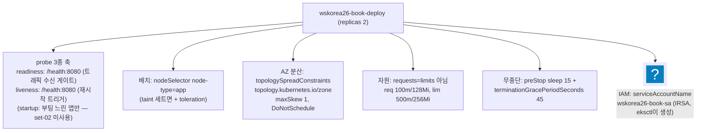
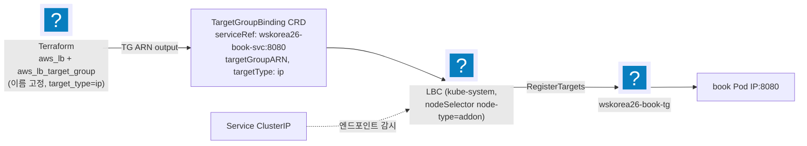
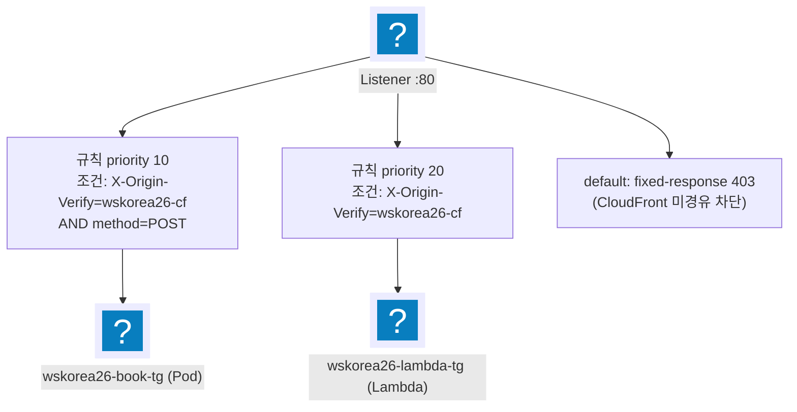

import { Quiz, QuizResults } from 'starlight-quiz/components';

> 문서 유형: explanation

> 교재 원본: `skills-2026/set-02/task-1/k8s/app/*`, `terraform/alb.tf`

---

## 1. 프로덕션급 Deployment

**① 한 줄 정의** — Deployment는 Pod 복제본을 선언적으로 유지하는 컨트롤러이며, 대회에서는 "고가용성 + 노드 배치 + 무중단"을 만족하는 스펙을 요구한다.

**② 왜 (채점 관점)** — mark 5-4가 wskorea26 파드의 노드 배치(app)를, mark 9-1~9-4가 실제 애플리케이션 동작을 검사한다. probe가 없으면 죽은 Pod가 타깃에 남아 9번 항목이 간헐 실패하고, 노드 배치가 틀리면 5-4 감점.

**③ 원리 — set-02 deployment.yaml의 6대 요소**



각 요소의 이유:

| 요소 | 값 (실측) | 이유 |
|---|---|---|
| readinessProbe | httpGet /health:8080, delay 5, period 10 | 준비 안 된 Pod로 트래픽 차단 → TG healthy 판정과 일치 |
| livenessProbe | httpGet /health:8080, delay 10, period 15 | 행 걸린 컨테이너 자동 재시작 |
| nodeSelector | `node-type: app` | mark 5-4 (앱은 app 노드만) |
| toleration | set-02 없음 / set-03은 workload taint 대응 필요 | taint 있는 NG에 스케줄 허용 |
| topologySpread | zone 키, maxSkew 1, **DoNotSchedule** | AZ 장애에도 1개 생존. DoNotSchedule=강제(soft인 ScheduleAnyway와 구분) |
| PDB (별도 manifest) | `minAvailable: 1` | 노드 드레인 중 최소 1개 유지 |
| resources | requests+limits 명시 | QoS(노드 자원이 부족할 때 어느 Pod 부터 축출할지 정하는 등급) 확보. requests=limits로 맞추면 Guaranteed 클래스 |
| preStop + grace | `sleep 15` / 45s | 아래 graceful shutdown 참조 |

**graceful shutdown 흐름**: Pod 삭제 시작 → (동시에) 엔드포인트 제거 전파 & preStop 실행. `sleep 15` 동안 ALB/TGB가 타깃 등록 해제를 끝내므로 in-flight 요청(이미 도착했고 아직 응답을 못 보낸 요청) 유실이 없다. 이후 SIGTERM(프로세스에 종료를 요청하는 시그널. 받은 프로세스가 정리할 시간을 갖는다). `terminationGracePeriodSeconds` 45초는 **preStop 시작 시점부터** 세므로 SIGTERM 이후 남는 시간은 약 30초다.

**④ 세트별 차이** — set-03은 workload NG에 NoSchedule taint가 있어 Deployment에 toleration 필수, label 키도 `wsc2026/node`. set-02는 nodeSelector만.

---

## 2. Helm 기초

**① 한 줄 정의** — Helm은 k8s manifest 묶음(chart)을 값(values)으로 렌더링해 설치·업그레이드하는 패키지 매니저다.

**② 왜** — LBC·kube-prometheus-stack 같은 대형 컴포넌트는 manifest 수십 장 — helm 없이는 대회 시간 내 불가능.

**③ 핵심 개념 / 필수 명령**

| 용어 | 의미 |
|---|---|
| repo | 차트 저장소 (`helm repo add eks https://aws.github.io/eks-charts`) |
| chart | 템플릿 묶음 (`eks/aws-load-balancer-controller`) |
| release | 설치된 인스턴스 이름 (`-n kube-system aws-load-balancer-controller`) |
| values | `--set key=val` 또는 `-f values.yaml` 로 주입하는 설정 |

```powershell
helm repo add <name> <url>; helm repo update
helm upgrade --install <release> <repo/chart> --version <핀> -n <ns> -f values.yaml  # 멱등 — 재실행 안전
helm -n <ns> list / helm -n <ns> uninstall <release>
```

버전은 **고정**한다(작업규칙 2, latest 금지). 예: LBC `--version 3.4.0`, kube-prometheus-stack `--version 87.5.1`.

---

## 3. AWS Load Balancer Controller + TargetGroupBinding 패턴

**① 한 줄 정의** — LBC는 k8s 리소스를 보고 ELB API를 호출하는 컨트롤러이며, **TargetGroupBinding(TGB)** 은 "이미 존재하는 TG"에 Service 뒤 Pod IP를 등록/해제하는 CRD(CustomResourceDefinition — 쿠버네티스에 새 리소스 종류를 추가하는 정의)다.

**② 왜 (채점 관점 — 수상 과제 공통 패턴)** — 채점은 `wskorea26-book-alb`, `wskorea26-book-tg` 같은 **정확한 이름**을 검사한다(mark 7-1 등). Ingress 로 만들면 ALB 이름은 `alb.ingress.kubernetes.io/load-balancer-name` 애노테이션으로 맞출 수 있지만, **타깃그룹 이름은 지정할 수 없다** — 컨트롤러가 `k8s-` 로 시작하는 이름을 자동으로 짓는다. 그래서:

:::tip[수상 과제 공통 패턴]
**Terraform으로 ALB/TG를 이름 고정 생성 → k8s TGB로 Pod IP만 등록.**
이름 채점이 있는 수상 과제는 전부 이 패턴이다.
:::

**③ 원리**



LBC 설치 (실측 — SA는 eksctl IRSA가 이미 생성했으므로 create=false):

```powershell
helm upgrade --install aws-load-balancer-controller eks/aws-load-balancer-controller `
  --version 3.4.0 -n kube-system `
  --set clusterName=wskorea26-cluster `
  --set serviceAccount.create=false `
  --set serviceAccount.name=aws-load-balancer-controller `
  --set region=ap-northeast-2 --set vpcId="$env:VPC_ID" `
  --set nodeSelector.node-type=addon        # addon 노드 고정 (mark 5-4)
```

TGB manifest (실측):

```yaml title="k8s/app/targetgroupbinding.yaml"
apiVersion: elbv2.k8s.aws/v1beta1
kind: TargetGroupBinding
metadata: { name: wskorea26-book-tgb, namespace: wskorea26 }
spec:
  serviceRef: { name: wskorea26-book-svc, port: 8080 }
  targetGroupARN: "<APP_TARGET_GROUP_ARN>"   # terraform output으로 치환 (targetGroupName 으로 이름 지정도 된다)
  targetType: ip
```

**④ 세트별 차이** — 패턴 자체는 전 세트 동일. 차이는 LBC 자격증명(set-02 IRSA / set-03·07 Pod Identity)과 nodeSelector label 키뿐.

---

## 4. ALB 리스너 규칙 — 헤더/메서드 조건 + Lambda 타깃

**① 한 줄 정의** — 리스너(80/HTTP)의 기본 액션은 fixed-response 403, 규칙 2개가 CloudFront 커스텀 헤더를 검증해 POST는 Pod TG로, 그 외는 Lambda TG로 보낸다.

**② 왜 (채점 관점)** — mark 7-2가 `describe-rules`의 `HttpHeaderConfig.Values[]` 출력으로 **`wskorea26-cf` 정확히 2줄** + `curl http://<ALB>/book` = **403**을 검사한다.

:::danger[규칙 개수는 정확히 2개]
규칙을 추가/삭제하면 줄 수가 달라져 즉시 감점이다.
:::

**③ 원리 (실측 alb.tf)**



- 규칙 평가는 priority 순 — POST는 10에서 잡히고, 헤더만 있는 GET 등은 20으로 떨어진다.
- **Lambda 타깃 3종 세트**: `aws_lb_target_group`(target_type="lambda") + `aws_lambda_permission`(principal=elasticloadbalancing.amazonaws.com, source_arn=TG ARN) + `aws_lb_target_group_attachment`(depends_on=permission). permission 없이 attach하면 실패한다.
- Pod TG는 `target_type = "ip"`, health_check path `/health` — Deployment readiness와 같은 경로로 맞춘다.

**④ 세트별 차이** — 규칙 수·조건은 과제지마다 다르다. set-02는 "헤더 2규칙 + 403 기본"이 채점 고정값. 다른 세트는 mark의 기대 출력(줄 수!)을 먼저 읽고 규칙 수를 역산할 것.

---

## 5. 자기 점검 퀴즈

<Quiz title="readiness vs liveness">
readinessProbe 와 livenessProbe 가 실패했을 때 동작 차이는?

- [x] readiness 실패 → Service 엔드포인트(및 TG 타깃)에서 제외될 뿐 컨테이너는 그대로 / liveness 실패 → 컨테이너 재시작
- [ ] readiness 실패 → 컨테이너 재시작 / liveness 실패 → 엔드포인트에서 제외
  > 정확히 반대다. 이름으로 외울 것 — ready = "트래픽 받을 준비가 됐나", live = "살아 있나(아니면 죽여서 되살린다)".
- [ ] 둘 다 컨테이너를 재시작하며 `failureThreshold` 값만 다르다
  > readiness 는 절대 컨테이너를 재시작하지 않는다. 재시작 권한이 있는 건 liveness(와 startup)뿐이다.
- [ ] readiness 실패 → Pod 가 Pending 으로 돌아가 다른 노드로 재스케줄된다
  > 재스케줄되지 않는다. Running 을 유지한 채 `Ready=False` 가 되어 엔드포인트에서만 빠진다.

readiness 실패는 트래픽 차단(엔드포인트/TG 타깃 제외), liveness 실패는 컨테이너 재시작이다.

set-02 실측값: readiness `httpGet /health:8080, delay 5, period 10` — 준비 안 된 Pod 로 트래픽이 가지 않게 해 TG healthy 판정과 일치시킨다. liveness `httpGet /health:8080, delay 10, period 15` — 행 걸린 컨테이너 자동 재시작. startup 은 부팅이 느린 앱에만 쓰며 set-02 는 미사용.

probe 가 없으면 죽은 Pod 가 타깃에 남아 mark 9번대가 **간헐 실패**한다 — 재현이 어려운 감점이라 특히 위험하다.
</Quiz>

<Quiz title="DoNotSchedule vs ScheduleAnyway">
`topologySpreadConstraints` 의 `whenUnsatisfiable` 두 값의 차이는?

- [x] DoNotSchedule 은 제약을 못 지키면 스케줄 자체를 거부하는 **하드** 제약, ScheduleAnyway 는 최선 노력의 **소프트** 제약. AZ 분산을 강제하려면 DoNotSchedule
- [ ] DoNotSchedule 은 이미 뜬 Pod 를 축출(evict)하고, ScheduleAnyway 는 신규 배치만 제어한다
  > topologySpreadConstraints 는 **스케줄 시점에만** 작동한다. 축출은 descheduler 같은 별도 컴포넌트의 일이다.
- [ ] 둘 다 소프트이며 강제 여부는 `maxSkew` 값이 정한다
  > `maxSkew` 는 허용 편차 크기(set-02 는 1)일 뿐이다. 강제/권고를 정하는 건 `whenUnsatisfiable`.
- [ ] DoNotSchedule 은 AZ 당 Pod 1개로 제한하는 옵션이다
  > 개수 제한이 아니라 편차 제한이다. AZ 당 개수는 replicas 와 `maxSkew` 의 조합으로 결정된다.

DoNotSchedule 은 하드(스케줄 거부), ScheduleAnyway 는 소프트(최선 노력)다. AZ 장애에도 최소 1개를 살리려면 `topology.kubernetes.io/zone` + `maxSkew: 1` + **DoNotSchedule**.

가용성은 두 겹으로 지킨다 — 배치는 topologySpread(AZ 분산), 운영 중 드레인은 PDB `minAvailable: 1`(별도 manifest).
</Quiz>

<Quiz title="Ingress 대신 TargetGroupBinding">
ALB/TG 를 Ingress 로 만들지 않고 Terraform 으로 이름 고정 생성한 뒤 TargetGroupBinding 으로 붙이는 결정적 이유는?

- [x] Ingress 가 만드는 **타깃그룹은 이름을 지정할 수 없는데**, 채점은 `wskorea26-book-alb`·`wskorea26-book-tg` 같은 정확한 이름을 검사하기 때문
- [ ] Ingress 는 Lambda 타깃 그룹을 붙일 수 없기 때문
  > 사실이긴 하나 결정적 이유는 아니다. 이름 채점이 없다면 Lambda TG 만 Terraform 으로 따로 만들고 나머지는 Ingress 로 가도 된다.
- [ ] LBC 를 설치하지 않아도 되기 때문
  > 정반대다. TargetGroupBinding 은 LBC 가 제공하는 **CRD** 라 LBC 가 필수다. 그래서 배포 순서에서 LBC(4단계)가 앱(5단계)보다 먼저다.
- [ ] TGB 는 Pod IP 대신 노드 포트를 등록해 홉이 줄기 때문
  > 반대다. `targetType: ip` 로 **Pod IP 를 직접** 등록해 노드포트 홉을 없애는 것이 TGB 패턴이다.

ALB 이름은 `alb.ingress.kubernetes.io/load-balancer-name` 애노테이션으로 맞출 수 있다. 막히는 것은 타깃그룹이다 — 컨트롤러가 `k8s-` 로 시작하는 이름을 자동으로 짓고 이를 바꾸는 애노테이션이 없다. 이름 채점이 있는 수상 과제는 전부 **Terraform 으로 ALB/TG 이름 고정 생성 → k8s TGB 로 Pod IP 만 등록** 패턴이다.

```yaml
apiVersion: elbv2.k8s.aws/v1beta1
kind: TargetGroupBinding
metadata: { name: wskorea26-book-tgb, namespace: wskorea26 }
spec:
  serviceRef: { name: wskorea26-book-svc, port: 8080 }
  targetGroupARN: "<APP_TARGET_GROUP_ARN>"   # terraform output으로 치환
  targetType: ip
```

패턴 자체는 전 세트 동일하고, 차이는 LBC 자격증명(set-02 IRSA / set-03·07 Pod Identity)과 nodeSelector label 키뿐이다.
</Quiz>

<Quiz title="mark 7-2 의 기대 출력">
ALB 리스너 규칙 2개가 검증하는 CloudFront 커스텀 헤더 `X-Origin-Verify` 의 값은 [[wskorea26-cf]] 다. mark 7-2 는 `describe-rules` 의 `HttpHeaderConfig.Values[]` 출력이 정확히 [[2]] 줄인지, 그리고 `curl http://<ALB>/book` 이 403 을 반환하는지 검사한다.

---

`wskorea26-cf` **2줄** + 403.

헤더 조건 규칙이 3개가 되면 `Values[]` 가 3줄이 되어 정확 일치에 실패한다 → **1.5점 감점**. 규칙은 추가도 삭제도 안 된다.

- priority 10 — 조건: `X-Origin-Verify=wskorea26-cf` **AND** method=POST → `wskorea26-book-tg`(Pod)
- priority 20 — 조건: `X-Origin-Verify=wskorea26-cf` → `wskorea26-lambda-tg`(Lambda)
- default — fixed-response **403**(CloudFront 미경유 차단)

다른 세트에서는 mark 의 기대 출력(줄 수!)을 먼저 읽고 규칙 수를 역산할 것.
</Quiz>

<Quiz title="preStop sleep 15">
Deployment 의 preStop `sleep 15` 는 무엇을 기다리는 시간인가?

- [x] 엔드포인트/타깃 등록 해제가 ALB 까지 전파되는 시간. 그동안 컨테이너가 살아 있어 in-flight 요청을 마저 처리한다
- [ ] 컨테이너가 SIGTERM 을 받고 스스로 정리하는 시간
  > preStop 은 SIGTERM **이전**에 실행된다. SIGTERM 이후의 여유는 `terminationGracePeriodSeconds: 45` 쪽이다.
- [ ] 새 Pod 가 Ready 가 될 때까지 롤아웃을 지연시키는 시간
  > 그건 readinessProbe + rolling update 의 `maxUnavailable` 이 하는 일이다. preStop 은 **종료되는 쪽** Pod 의 훅이다.
- [ ] 노드 드레인 중 PDB 가 회복되기를 기다리는 시간
  > 드레인 중 최소 가용 수를 지키는 건 PDB `minAvailable: 1` 이고, preStop 과는 별개 장치다.

타깃 등록 해제가 ALB 까지 전파되는 시간이다.

graceful shutdown 흐름:

1. Pod 삭제가 시작된다.
2. 엔드포인트 제거 전파와 preStop 실행이 동시에 일어난다.
3. `sleep 15` 동안 ALB/TGB 가 타깃 등록 해제를 끝낸다.
4. SIGTERM 이 간다.
5. 종료를 마친다.

`terminationGracePeriodSeconds` 카운트다운은 **preStop 훅보다 먼저 시작**해 preStop 실행과 컨테이너 종료를 통틀어 잰다. 45초 유예에 `sleep 15` 면 SIGTERM 이후 몫은 약 30초이지 45초가 아니다. 그래서 두 값은 항상 `preStop sleep < terminationGracePeriodSeconds` 여야 하고, 여유도 그 차이만큼만 있다.
</Quiz>

<QuizResults confetti />
