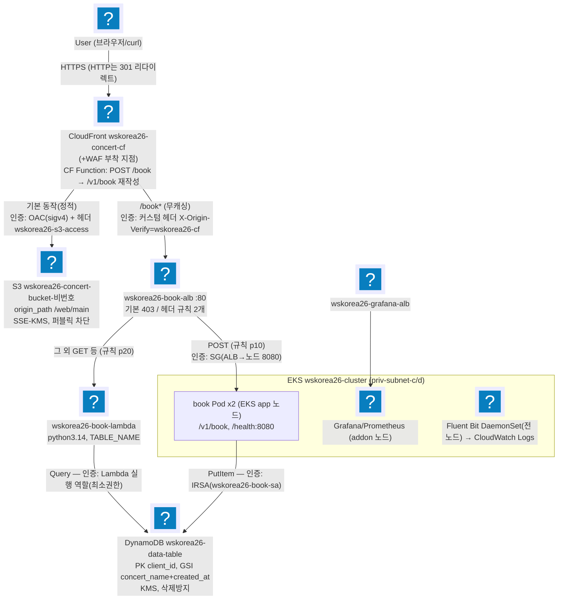
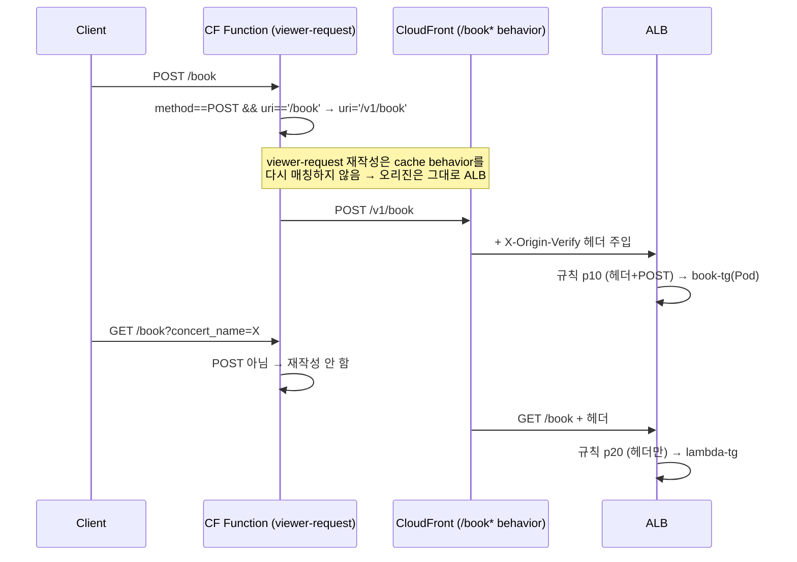
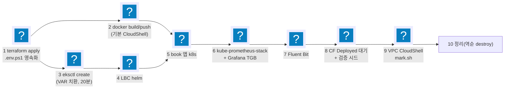

import { Quiz, QuizResults } from 'starlight-quiz/components';

> 문서 유형: explanation

> 교재 원본: `skills-2026/set-02/task-1/` (README.md, mark.md, terraform/cloudfront.tf, cloudfront/book-rewrite.js)

---

## 1. 전체 아키텍처 (백지 도식 훈련 — 이것이 정답 도식)

**① 한 줄 정의** — User → CloudFront(정적=S3, 동적=/book*→ALB) → ALB(POST→Pod, GET→Lambda) → DynamoDB 구조의 콘서트 예매 플랫폼.

**② 왜 (채점 관점)** — 30점 중 CloudFront 6.5 + Application 6 + EKS 5 = 17.5점이 이 그림 위에서 결정된다. 화살표마다 붙는 **인증 방식**이 곧 채점 항목(OAC=8-2, 커스텀 헤더=8-4/7-2, IRSA=간접적으로 9-1/9-2)이다.

**③ 정답 도식 — 매일 백지에 재현할 것. 화살표의 인증 주석까지가 정답이다.**



암기 포인트(화살표별 인증):
| 구간 | 인증/보호 |
|---|---|
| CF → S3 | **OAC**(sigv4 서명) + 커스텀 헤더 `wskorea26-s3-access: true` |
| CF → ALB | 커스텀 헤더 `X-Origin-Verify: wskorea26-cf` (ALB 규칙이 검증, 미경유=403) |
| ALB → Pod | SG (ALB SG → 노드 SG 8080) |
| Pod → DynamoDB | **IRSA** (wskorea26-book-sa) |
| Lambda → DynamoDB | Lambda 실행 역할 (최소권한) |
| 채점 CloudShell → EKS API | private 엔드포인트 + `wskorea26-cluster-extra-sg` 443 |

---

## 2. CloudFront 핵심 — 이중 Origin과 경로 재작성

**① 한 줄 정의** — Origin 2개(ALB 커스텀/S3 OAC)를 가진 배포에서, viewer-request CloudFront Function이 POST /book만 /v1/book으로 재작성한다.

**② 왜 (채점 관점)**

:::danger[제공 자료 수정 금지]
제공 book 바이너리는 **`POST /v1/book`과 `GET /health`만 서빙하며 수정 금지**다. 그런데 채점은 `https://<CF>/book`으로 POST(9-1)·GET(9-2)·에러(9-3)를 시험한다. **ALB는 경로 재작성이 불가능**하므로 CloudFront Function이 유일한 해법이고, GET은 애초에 앱이 아닌 Lambda가 처리한다.
:::

**③ 원리**



실측 함수 전문 (이 이상 절대 복잡하게 만들지 말 것):

```javascript title="terraform/cloudfront/book-rewrite.js"
function handler(event) {
    var request = event.request;
    if (request.method === 'POST' && request.uri === '/book') {
        request.uri = '/v1/book';
    }
    return request;
}
```

배포 설정 실측 요점 (cloudfront.tf):
- Comment = `wskorea26-concert-cf` — **mark가 Comment로 배포를 식별**한다 (8-1의 CF_ID 조회).
- 기본 동작: S3 origin, CachingOptimized, `redirect-to-https`, GET/HEAD만 (8-3, 8-5).
- `/book*` 동작: ALB origin, **CachingDisabled + AllViewerExceptHostHeader**(쿼리/바디 전달), 전 메서드 허용, Function 연결.
- S3 origin: OAC(sigv4) + `origin_path = /web/main` (루트 → web/main/index.html) + 헤더 `wskorea26-s3-access: true`.
- ALB origin: http-only + 헤더 `X-Origin-Verify: wskorea26-cf`.
- 커스텀 헤더는 **정확히 2개**(mark 8-4가 2줄 정확 일치).

**④ 세트별 차이** — CF Function/이중 Origin 구성은 set-02 고유. 다른 세트는 과제지의 경로/메서드 요구를 보고 "앱이 서빙하는 경로 vs 채점이 때리는 경로"의 간극을 먼저 찾을 것 — 간극이 있으면 CF Function, 없으면 불필요.

---

## 3. 배포 10단계의 순서 논리

**① 한 줄 정의** — 의존성 역순으로는 아무것도 못 만든다: 인프라(terraform) → 이미지 → 클러스터 → 컨트롤러 → 앱 → 관측성 → 검증 → 채점 → 정리.

**② 왜** — 각 단계가 다음 단계의 입력을 만든다(output → env, ECR → 이미지, TG ARN → TGB). 순서가 꼬이면 되돌아가는 비용이 크다(eksctl 20분).

**③ 원리**



단계별 왜(암기):
| 단계 | 왜 이 위치인가 |
|---|---|
| 1 terraform | 모든 ID/ARN의 원천. `.env.ps1`로 영속화해 터미널 끊겨도 재개 |
| 2 이미지 (기본 CloudShell) | 로컬 Windows에 Docker 없음. **VPC CloudShell은 인터넷이 없어 alpine 못 받으므로 불가**. 스캔 Critical/High 0 확인(mark 3-1)까지 |
| 3 eksctl | terraform output($\{VAR\}) 필요. 가장 오래 걸려 이미지 빌드와 병행 가능 |
| 4 LBC | TGB CRD 제공자 — 앱 TGB보다 먼저 |
| 5 앱 | ns→configmap→deployment(ECR 치환)→service/pdb→TGB→target healthy |
| 6 모니터링 | helm values에 Grafana 계정 치환 + dashboard configmap(`grafana_dashboard=1` 라벨) + Grafana TGB |
| 7 Fluent Bit | 전 노드 DaemonSet(tolerations Exists, hostPath, cri parser) — 로그는 노드 로컬에만 있어 app 노드도 수집 |
| 8 검증 | **CloudFront Deployed 대기 후** curl 시나리오 시드 |
| 9 채점 | CloudShell VPC Environment(priv-subnet-d + vpc-environment-sg), mark.sh **heredoc 붙여넣기**(파일 업로드 불가) |
| 10 정리 | helm → eksctl → **DynamoDB 삭제방지 해제** → terraform destroy |

**④ 세트별 차이** — 뼈대(인프라→이미지→클러스터→컨트롤러→앱→관측성)는 전 세트 공통. 세트별로 빠지는 단계만 제거하면 된다(예: 컨테이너 없는 과제는 2 생략).

---

## 4. 자기 점검 퀴즈

<Quiz title="GET /book 을 재작성하지 않는 이유">
CloudFront Function 이 `GET /book` 은 재작성하지 않는 이유를 모두 고르라.

- [x] GET 은 ALB 규칙 p20 이 Lambda TG 로 보내는데, Lambda 는 경로를 무시하고 쿼리 스트링(`concert_name`)만 쓴다
- [x] 앱(`POST /v1/book`)으로 갈 요청이 아니므로 재작성할 이유 자체가 없다
- [ ] CloudFront Function 은 GET 요청의 `request.uri` 를 수정할 수 없다
  > 수정할 수 있다. 함수가 `request.method === 'POST'` 를 검사하는 것은 기술적 제약이 아니라 **설계 선택**이며, 이 조건을 빼면 GET 도 그대로 재작성되어 Lambda 가 엉뚱한 경로를 받는다.
- [ ] GET 은 CachingOptimized 동작을 타므로 오리진까지 가지 않는다
  > `/book*` 동작은 **CachingDisabled + AllViewerExceptHostHeader** 다. CachingOptimized 는 기본(S3) 동작 쪽.
- [ ] GET 은 ALB 기본 액션(403)에 걸려 어차피 오리진에 도달하지 못한다
  > 403 은 커스텀 헤더가 **없을 때**의 기본 액션이다. CloudFront 경유 요청에는 `X-Origin-Verify` 가 주입되므로 규칙 p20 에 잡힌다.

제공된 book 바이너리는 `POST /v1/book` 과 `GET /health` 만 서빙하며 수정 금지다. 그런데 채점은 `https://<CF>/book` 으로 POST(9-1)·GET(9-2)·에러(9-3)를 때린다. ALB 는 경로 재작성이 불가능하므로 CloudFront Function 이 유일한 해법이고, GET 은 애초에 앱이 아닌 Lambda 가 처리한다.

```javascript
function handler(event) {
    var request = event.request;
    if (request.method === 'POST' && request.uri === '/book') {
        request.uri = '/v1/book';
    }
    return request;
}
```

이 이상 절대 복잡하게 만들지 말 것.
</Quiz>

<Quiz title="viewer-request 재작성과 오리진">
viewer-request 에서 URI 를 `/book` → `/v1/book` 으로 재작성해도 요청이 계속 ALB 오리진으로 가는 이유는?

- [x] viewer-request 단계의 URI 재작성은 **cache behavior 를 다시 매칭하지 않는다**. 요청은 이미 `/book*` 동작에 매칭되어 오리진이 ALB 로 확정된 상태다
- [ ] `/v1/book` 도 `/book*` 패턴에 매칭되기 때문
  > 매칭되지 않는다(`/v1/book` 은 `/book` 으로 시작하지 않는다). 재매칭이 **일어나지 않는 것** 자체가 이유다 — 만약 재매칭됐다면 기본 동작(S3)으로 떨어졌을 것이다.
- [ ] origin-request 함수가 다시 ALB 로 라우팅하기 때문
  > 오리진은 behavior 가 정하며, 이 배포에는 origin-request 함수가 없다.
- [ ] ALB 오리진이 이 배포의 기본 오리진이기 때문
  > 기본 동작(default cache behavior)의 오리진은 **S3** 다. ALB 는 `/book*` 동작 전용.

viewer-request 재작성은 behavior 재매칭을 유발하지 않는다. 이게 이 아키텍처가 성립하는 핵심 전제다.

이해가 굳었는지 확인하는 한 줄: 만약 재매칭이 일어났다면 `/v1/book` 은 기본 동작으로 떨어져 S3 에서 `web/main/v1/book` 을 찾다가 404 가 났을 것이다.
</Quiz>

<Quiz title="이미지 빌드 위치">
book 이미지 빌드를 VPC CloudShell 에서 할 수 없는 이유와 올바른 위치는?

- [x] VPC CloudShell 은 인터넷이 없어 `alpine` 베이스 이미지를 pull 하지 못한다 → 인터넷과 docker 가 있는 **기본 CloudShell** 에서 build/push 하고 스캔 Critical/High 0 을 확인한다
- [ ] arm64 로 빌드되어 스캔과 호환되지 않는다 → 기본 CloudShell 에서 빌드한다
  > 결론만 맞고 이유가 틀렸다. 기본 CloudShell 이 amd64 네이티브라 단일 아키텍처 이미지가 되는 건 부수 효과이고, VPC CloudShell 의 진짜 문제는 **인터넷 부재**다.
- [ ] VPC CloudShell 에는 docker 가 설치되어 있지 않다 → 대회 PC(Windows)에서 빌드한다
  > 대회 PC 는 Docker/WSL 을 쓸 수 없다. 그리고 문제는 docker 유무가 아니라 베이스 이미지를 받을 인터넷이 없다는 것이다.
- [ ] ECR 이 VPC 엔드포인트로만 열려 있어 push 가 안 된다 → 엔드포인트를 추가한다
  > push 가 아니라 **pull(alpine 받기)** 이 막히는 것이 문제다. 엔드포인트를 추가해도 Docker Hub 는 여전히 못 간다.

VPC CloudShell 은 인터넷이 없어 alpine 베이스 이미지를 pull 할 수 없다. **기본 CloudShell**(인터넷 O, docker 내장)에서 build/push 하고 스캔 Critical/High 0 을 확인한다.

VPC CloudShell 의 용도는 따로 있다 — 9단계 채점(mark.sh)이다. private 엔드포인트 EKS API 에 닿아야 하므로 priv-subnet-d + `vpc-environment-sg` 로 띄우고, 파일 업로드가 안 되므로 **heredoc 붙여넣기**로 스크립트를 넣는다.
</Quiz>

<Quiz title="정리(destroy) 순서">
`terraform destroy` 까지 가는 정리 단계의 올바른 순서는?

- [x] helm 릴리스 삭제 → `eksctl delete cluster` → DynamoDB 삭제방지 해제 → `terraform destroy`
- [ ] `terraform destroy` → `eksctl delete cluster` → helm 릴리스 삭제
  > 완전한 역순이다. Terraform 이 만든 VPC/서브넷/SG 를 먼저 지우면 클러스터와 ALB 가 고아가 되어 이후 삭제가 전부 실패한다.
- [ ] `eksctl delete cluster` → helm 릴리스 삭제 → DynamoDB 삭제방지 해제 → `terraform destroy`
  > 클러스터가 사라진 뒤에는 helm 이 붙을 API 서버가 없다. helm 이 만든 ALB 등 외부 리소스가 남아 VPC 삭제를 막는다.
- [ ] helm 릴리스 삭제 → `terraform destroy` → `eksctl delete cluster`
  > destroy 가 VPC 를 못 지운다 — 클러스터의 ENI 가 서브넷을 붙잡고 있어 타임아웃으로 끝난다.

**helm → eksctl → DDB 삭제방지 해제 → terraform destroy.** 만든 순서의 역순이다.

```bash
aws dynamodb update-table --table-name wskorea26-data-table --no-deletion-protection-enabled
```

`deletion_protection_enabled = true` 는 채점 항목이자 destroy 함정이다 — 코드에서 false 로 바꿔 apply 하거나 위 CLI 로 해제한 뒤에야 destroy 가 통과한다.
</Quiz>

<Quiz title="백지 도식 — 화살표별 인증">
백지 도식 암기 확인. CF→S3 화살표의 인증은 sigv4 서명을 쓰는 [[OAC]] + 커스텀 헤더 `wskorea26-s3-access`, CF→ALB 는 커스텀 헤더 `X-Origin-Verify: wskorea26-cf`(ALB 규칙이 검증, 미경유는 403), Pod→DynamoDB 는 ServiceAccount `wskorea26-book-sa` 를 쓰는 [[IRSA]] 다.

---

| 구간 | 인증/보호 |
|---|---|
| CF → S3 | **OAC**(sigv4 서명) + 커스텀 헤더 `wskorea26-s3-access: true` |
| CF → ALB | 커스텀 헤더 `X-Origin-Verify: wskorea26-cf` (ALB 규칙이 검증, 미경유=403) |
| ALB → Pod | SG (ALB SG → 노드 SG 8080) |
| Pod → DynamoDB | **IRSA** (`wskorea26-book-sa`) |
| Lambda → DynamoDB | Lambda 실행 역할 (최소권한) |
| 채점 CloudShell → EKS API | private 엔드포인트 + `wskorea26-cluster-extra-sg` 443 |

30점 중 CloudFront 6.5 + Application 6 + EKS 5 = **17.5점**이 이 그림 위에서 결정된다. 화살표마다 붙는 인증 방식이 곧 채점 항목이다(OAC=8-2, 커스텀 헤더=8-4/7-2, IRSA=간접적으로 9-1/9-2). 매일 백지에 재현하되, **화살표의 인증 주석까지가 정답**이다.
</Quiz>

<QuizResults confetti />
