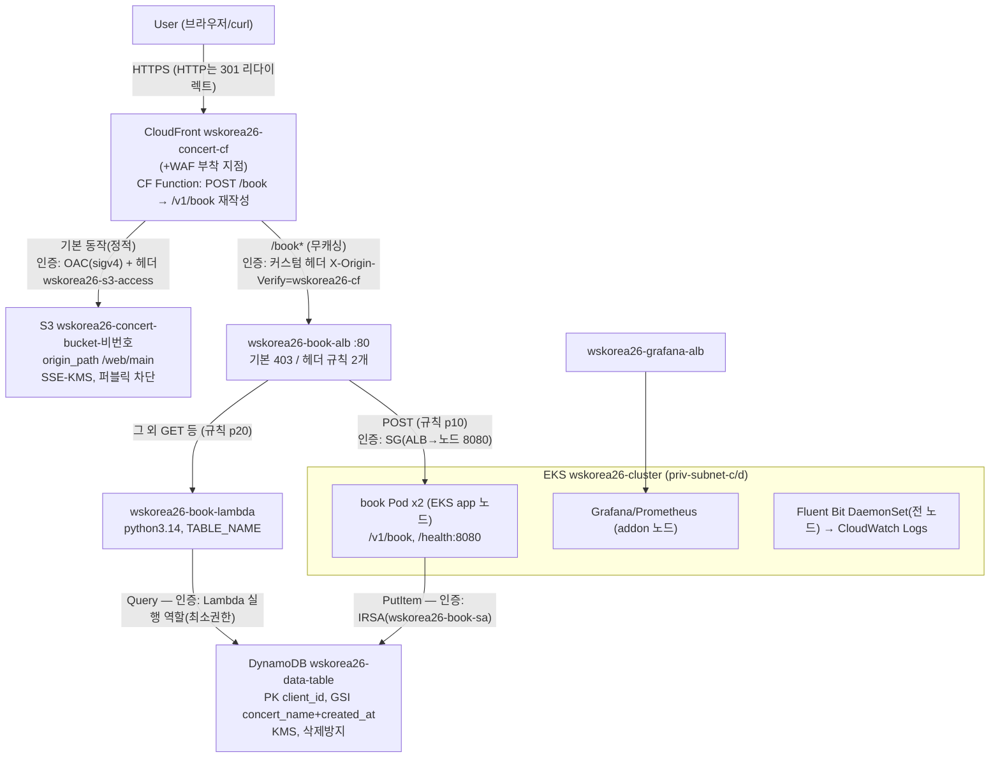
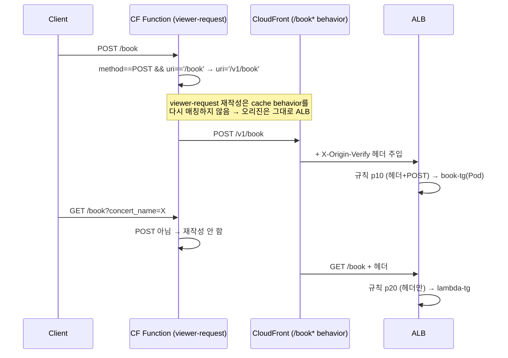
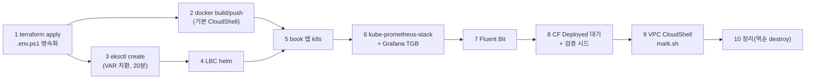

> 문서 유형: explanation

> 교재 원본: `skills-2026/set-02/task-1/` (README.md, mark.md, terraform/cloudfront.tf, cloudfront/book-rewrite.js)

---

## 1. 전체 아키텍처 (백지 도식 훈련 — 이것이 정답 도식)

**① 한 줄 정의** — User → CloudFront(정적=S3, 동적=/book*→ALB) → ALB(POST→Pod, GET→Lambda) → DynamoDB 구조의 콘서트 예매 플랫폼.

**② 왜 (채점 관점)** — 30점 중 CloudFront 6.5 + Application 6 + EKS 5 = 17.5점이 이 그림 위에서 결정된다. 화살표마다 붙는 **인증 방식**이 곧 채점 항목(OAC=8-2, 커스텀 헤더=8-4/7-2, IRSA=간접적으로 9-1/9-2)이다.

**③ 정답 도식 — 매일 백지에 재현할 것. 화살표의 인증 주석까지가 정답이다.**



암기 포인트(화살표별 인증):
| 구간 | 인증/보호 |
|---|---|
| CF → S3 | **OAC**(sigv4 서명) + 커스텀 헤더 `wskorea26-s3-access: true` |
| CF → ALB | 커스텀 헤더 `X-Origin-Verify: wskorea26-cf` (ALB 규칙이 검증, 미경유=403) |
| ALB → Pod | SG (ALB SG → 노드 SG 8080) |
| Pod → DynamoDB | **IRSA** (wskorea26-book-sa) |
| Lambda → DynamoDB | Lambda 실행 역할 (최소권한) |
| 채점 CloudShell → EKS API | private 엔드포인트 + `wskorea26-cluster-extra-sg` 443 |

---

## 2. CloudFront 핵심 — 이중 Origin과 경로 재작성

**① 한 줄 정의** — Origin 2개(ALB 커스텀/S3 OAC)를 가진 배포에서, viewer-request CloudFront Function이 POST /book만 /v1/book으로 재작성한다.

**② 왜 (채점 관점)** — 제공 book 바이너리는 **`POST /v1/book`과 `GET /health`만 서빙하며 수정 금지**다. 그런데 채점은 `https://<CF>/book`으로 POST(9-1)·GET(9-2)·에러(9-3)를 시험한다. **ALB는 경로 재작성이 불가능**하므로 CloudFront Function이 유일한 해법이고, GET은 애초에 앱이 아닌 Lambda가 처리한다.

**③ 원리**



실측 함수 전문 (`book-rewrite.js` — 이 이상 절대 복잡하게 만들지 말 것):

```javascript
function handler(event) {
    var request = event.request;
    if (request.method === 'POST' && request.uri === '/book') {
        request.uri = '/v1/book';
    }
    return request;
}
```

배포 설정 실측 요점 (cloudfront.tf):
- Comment = `wskorea26-concert-cf` — **mark가 Comment로 배포를 식별**한다 (8-1의 CF_ID 조회).
- 기본 동작: S3 origin, CachingOptimized, `redirect-to-https`, GET/HEAD만 (8-3, 8-5).
- `/book*` 동작: ALB origin, **CachingDisabled + AllViewerExceptHostHeader**(쿼리/바디 전달), 전 메서드 허용, Function 연결.
- S3 origin: OAC(sigv4) + `origin_path = /web/main` (루트 → web/main/index.html) + 헤더 `wskorea26-s3-access: true`.
- ALB origin: http-only + 헤더 `X-Origin-Verify: wskorea26-cf`.
- 커스텀 헤더는 **정확히 2개**(mark 8-4가 2줄 정확 일치).

**④ 세트별 차이** — CF Function/이중 Origin 구성은 set-02 고유. 다른 세트는 과제지의 경로/메서드 요구를 보고 "앱이 서빙하는 경로 vs 채점이 때리는 경로"의 간극을 먼저 찾을 것 — 간극이 있으면 CF Function, 없으면 불필요.

---

## 3. 배포 10단계의 순서 논리

**① 한 줄 정의** — 의존성 역순으로는 아무것도 못 만든다: 인프라(terraform) → 이미지 → 클러스터 → 컨트롤러 → 앱 → 관측성 → 검증 → 채점 → 정리.

**② 왜** — 각 단계가 다음 단계의 입력을 만든다(output → env, ECR → 이미지, TG ARN → TGB). 순서가 꼬이면 되돌아가는 비용이 크다(eksctl 20분).

**③ 원리**



단계별 왜(암기):
| 단계 | 왜 이 위치인가 |
|---|---|
| 1 terraform | 모든 ID/ARN의 원천. `.env.ps1`로 영속화해 터미널 끊겨도 재개 |
| 2 이미지 (기본 CloudShell) | 로컬 Windows에 Docker 없음. **VPC CloudShell은 인터넷이 없어 alpine 못 받으므로 불가**. 스캔 Critical/High 0 확인(mark 3-1)까지 |
| 3 eksctl | terraform output($\{VAR\}) 필요. 가장 오래 걸려 이미지 빌드와 병행 가능 |
| 4 LBC | TGB CRD 제공자 — 앱 TGB보다 먼저 |
| 5 앱 | ns→configmap→deployment(ECR 치환)→service/pdb→TGB→target healthy |
| 6 모니터링 | helm values에 Grafana 계정 치환 + dashboard configmap(`grafana_dashboard=1` 라벨) + Grafana TGB |
| 7 Fluent Bit | 전 노드 DaemonSet(tolerations Exists, hostPath, cri parser) — 로그는 노드 로컬에만 있어 app 노드도 수집 |
| 8 검증 | **CloudFront Deployed 대기 후** curl 시나리오 시드 |
| 9 채점 | CloudShell VPC Environment(priv-subnet-d + vpc-environment-sg), mark.sh **heredoc 붙여넣기**(파일 업로드 불가) |
| 10 정리 | helm → eksctl → **DynamoDB 삭제방지 해제** → terraform destroy |

**④ 세트별 차이** — 뼈대(인프라→이미지→클러스터→컨트롤러→앱→관측성)는 전 세트 공통. 세트별로 빠지는 단계만 제거하면 된다(예: 컨테이너 없는 과제는 2 생략).

---

## 4. 자기 점검 퀴즈

1. CloudFront Function이 GET /book은 재작성하지 않는 이유는? (2가지)
2. viewer-request에서 URI를 재작성해도 요청이 계속 ALB 오리진으로 가는 이유는?
3. 이미지 빌드를 VPC CloudShell에서 할 수 없는 이유와 올바른 위치는?
4. terraform destroy 전에 반드시 해야 하는 두 가지 선행 삭제/해제는?
5. 백지 도식에서 CF→S3, CF→ALB, Pod→DynamoDB 화살표의 인증 방식을 각각 쓰라.

<details>
<summary>정답</summary>

1. GET은 ALB 규칙이 Lambda TG로 보내는데 Lambda는 경로를 무시하고 쿼리 스트링(concert_name)만 사용하기 때문. 그리고 앱(POST /v1/book)으로 갈 요청이 아니므로 재작성할 필요가 없다.
2. viewer-request 단계의 URI 재작성은 **cache behavior를 다시 매칭하지 않기** 때문 — 요청은 이미 /book* behavior에 매칭되어 오리진이 ALB로 확정된 상태다.
3. VPC CloudShell은 인터넷이 없어 alpine 베이스 이미지를 pull할 수 없다. **기본 CloudShell**(인터넷 O, docker 내장)에서 build/push하고, 스캔 Critical/High 0을 확인한다.
4. helm 릴리스/클러스터 삭제(eksctl delete cluster)와 **DynamoDB 삭제방지 해제**(`aws dynamodb update-table --no-deletion-protection-enabled`). 순서: helm → eksctl → DDB 해제 → terraform destroy.
5. CF→S3: OAC(sigv4) + 커스텀 헤더 wskorea26-s3-access. CF→ALB: 커스텀 헤더 X-Origin-Verify=wskorea26-cf(ALB 규칙 검증). Pod→DynamoDB: IRSA(wskorea26-book-sa).

</details>
