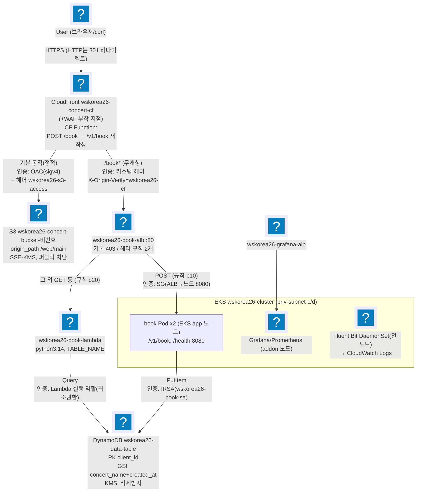
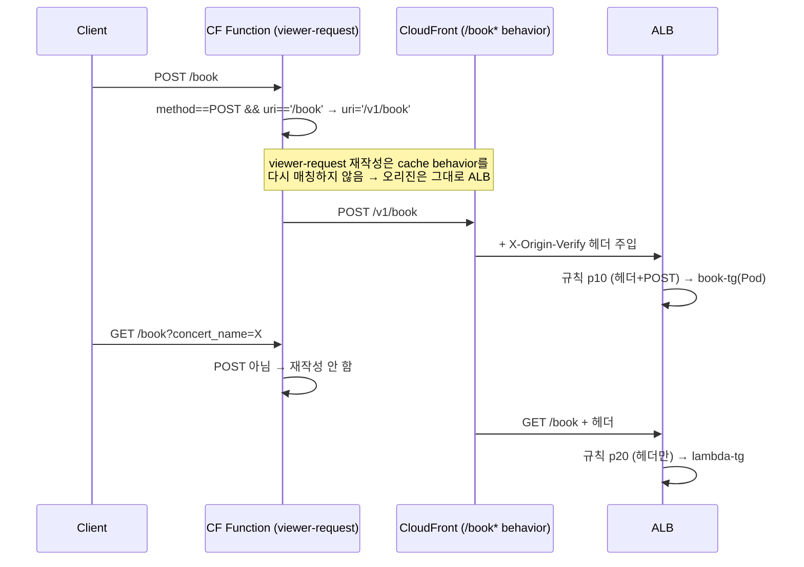
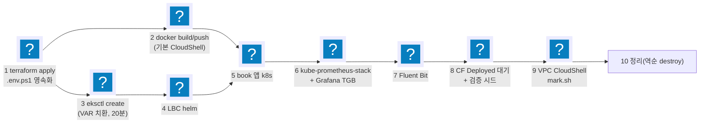

import { Quiz, QuizResults } from 'starlight-quiz/components';

> 문서 유형: explanation

선행 지식과 학습 경로는 [모듈 개요](/part-2/07-full-deploy-set02/)에.

> 교재 원본: `skills-2026/set-02/task-1/` (README.md, mark.md, terraform/cloudfront.tf, cloudfront/book-rewrite.js)

---

## 1. 전체 아키텍처 (백지 도식 훈련 — 이것이 정답 도식)

**① 한 줄 정의** — User → CloudFront(정적=S3, 동적=/book*→ALB) → ALB(POST→Pod, GET→Lambda) → DynamoDB 구조의 콘서트 예매 플랫폼.

**② 왜 (채점 관점)** — 30점 중 CloudFront 6.5 + Application 6 + EKS 5 = 17.5점이 이 그림 위에서 결정된다. 외울 것은 상자가 아니라 화살표다. 구간마다 **인증 방식**이 다르고, 그 방식 하나하나가 채점 항목이다. IRSA(IAM Roles for Service Accounts)가 파드에 AWS 권한을 주는 원리는 [eks-basics 의 IRSA 절](/start/eks-basics/#irsa와-eks-pod-identity)에 있다.

**③ 정답 도식 — 매일 백지에 재현할 것. 화살표의 인증 주석까지가 정답이다.**



<details class="diagram-note">
<summary>이 도식이 보여주는 것</summary>

set-02 1과제 전체가 한 장에 있다. 요청은 CloudFront 한 곳으로 들어와 두 갈래로 갈린다 — 정적 파일은 OAC 서명으로 S3 에, `/book*` 는 커스텀 헤더를 달고 ALB 로 간다. ALB 는 그 헤더와 메서드를 보고 POST 는 파드로, 나머지는 Lambda 로 보낸다. 화살표에 적힌 것이 각 구간의 인증 수단이다 — OAC, 커스텀 헤더, 보안 그룹, IRSA, 실행 역할이 구간마다 다르다. 데이터는 결국 DynamoDB 한 곳에서 만나고, 클러스터 안에는 관측 스택이 별도 ALB 로 노출된다.

</details>

암기 포인트(화살표별 인증):

| 구간 | 인증/보호 |
|---|---|
| CF → S3 | **OAC**(sigv4 서명) + 커스텀 헤더 `wskorea26-s3-access: true` |
| CF → ALB | 커스텀 헤더 `X-Origin-Verify: wskorea26-cf` (ALB 규칙이 검증, 미경유=403) |
| ALB → Pod | SG (ALB SG → 노드 SG 8080) |
| Pod → DynamoDB | **IRSA** (wskorea26-book-sa) |
| Lambda → DynamoDB | Lambda 실행 역할 (최소권한) |
| 채점 CloudShell → EKS API | private 엔드포인트 + `wskorea26-cluster-extra-sg` 443 |

여섯 구간 중 셋이 채점 항목과 직접 이어진다. CF→S3 의 OAC 는 mark 8-2 가, CF→ALB 의 커스텀 헤더는 mark 8-4 와 7-2 가 조회한다. Pod→DynamoDB 의 IRSA 는 전용 항목이 없고, 앱이 실제로 저장에 성공하는지를 보는 mark 9-1·9-2 를 통해 간접 확인된다.

S3 쪽 화살표에 인증 수단이 둘인 이유는 목적이 다르기 때문이다. 접근 통제는 OAC 혼자 한다 — 버킷 정책이 보는 것은 서명과 `AWS:SourceArn` 이지 헤더가 아니다. 커스텀 헤더 `wskorea26-s3-access: true` 는 과제지가 "S3 로 전달하는 요청에는 이 헤더가 포함되어야 한다"고 지정한 값이고, mark 8-4 가 배포의 커스텀 헤더 목록을 **정확히 2줄**로 비교한다. 즉 이 헤더는 보안 장치가 아니라 채점되는 구성값이므로 이름·값·개수를 그대로 맞춘다.

---

## 2. CloudFront 핵심 — 이중 Origin과 경로 재작성

**① 한 줄 정의** — Origin 2개(ALB 커스텀/S3 OAC)를 가진 배포에서, viewer-request CloudFront Function이 POST /book만 /v1/book으로 재작성한다.

S3 쪽 오리진이 OAC 로 비공개를 유지하는 구조는 [s3-basics 의 OAC 절](/start/s3-basics/#cloudfront-oac--원본을-비공개로-유지하는-구조)에, ALB 쪽이 커스텀 헤더로 CloudFront 경유만 받는 구조는 [loadbalancer-basics 3-1 절](/start/loadbalancer-basics/#3-1-cloudfront-를-거친-요청만-받는다)에 있다.

**② 왜 (채점 관점)**

:::danger[제공 자료 수정 금지]
제공 book 바이너리는 **`POST /v1/book`과 `GET /health`만 서빙하며 수정 금지**다. 그런데 채점은 `https://<CF>/book`으로 POST(9-1)·GET(9-2)·에러(9-3)를 시험한다. 경로를 어딘가에서 재작성해야 하는데, 수상 과제 풀이는 **CloudFront Function(viewer-request)** 으로 한다. GET은 애초에 앱이 아닌 Lambda가 처리한다.

ALB 도 2025년 10월부터 리스너 규칙에서 URL·Host 헤더 재작성을 지원하므로 기술적으로 유일한 해법은 아니다. 그래도 CloudFront 쪽에 두는 이유는 `/book*` 동작의 분기(POST→ALB, GET→Lambda)와 재작성 지점이 한곳에 모이고, `X-Origin-Verify` 검사를 하는 ALB 규칙을 건드리지 않아도 되기 때문이다.
:::

**③ 원리**



<details class="diagram-note">
<summary>이 도식이 보여주는 것</summary>

CloudFront Function 이 URI 를 고쳐도 오리진이 바뀌지 않는 이유다. viewer-request 단계에서 POST `/book` 을 `/v1/book` 으로 바꾸지만, 그 시점에는 이미 `/book*` 동작이 선택된 뒤라 캐시 동작을 다시 고르지 않는다. 그래서 재작성된 요청도 ALB 로 간다. GET 은 조건에 걸리지 않아 원래 경로 그대로 가고, ALB 에서 규칙 우선순위에 따라 Lambda 로 넘어간다.

</details>

실측 함수 전문 (이 이상 절대 복잡하게 만들지 말 것):

```javascript title="terraform/cloudfront/book-rewrite.js"
function handler(event) {
    var request = event.request;
    if (request.method === 'POST' && request.uri === '/book') {
        request.uri = '/v1/book';
    }
    return request;
}
```

<details class="diagram-note">
<summary>이 블록이 하는 일</summary>

그 재작성 함수 전문이다. CloudFront Functions 는 요청 객체를 받아 고쳐서 돌려주는 형태이고, 조건은 메서드와 URI 완전 일치 두 가지다. 반환값이 요청 객체라 응답을 만들지는 못한다 — 리다이렉트나 차단이 필요하면 응답 객체를 반환하는 다른 형태로 쓴다.

</details>

배포 설정 실측 요점 (cloudfront.tf):
- Comment = `wskorea26-concert-cf` — **mark가 Comment로 배포를 식별**한다 (8-1의 CF_ID 조회).
- 기본 동작: S3 origin, CachingOptimized, `redirect-to-https`, GET/HEAD만 (8-3, 8-5).
- `/book*` 동작: ALB origin, **CachingDisabled + AllViewerExceptHostHeader**(쿼리/바디 전달), 전 메서드 허용, Function 연결.
- S3 origin: OAC(sigv4) + `origin_path = /web/main` (루트 → web/main/index.html) + 헤더 `wskorea26-s3-access: true`.
- ALB origin: http-only + 헤더 `X-Origin-Verify: wskorea26-cf`.
- 커스텀 헤더는 **정확히 2개**(mark 8-4가 2줄 정확 일치).

**④ 변형 포인트** — 당일 과제의 약 30% 가 수정된다.

| 바뀌는 값 | 고칠 곳 | 확인 |
|---|---|---|
| 앱이 서빙하는 경로 `/v1/book` | `book-rewrite.js` 의 `request.uri` 대입값 | 파드 앱이 서빙하는 경로와 같은 문자열 |
| 채점이 때리는 경로 `/book` | `book-rewrite.js` 의 `request.uri ===` 비교값 | mark 9-1·9-2 가 치는 URL 과 같은 문자열 |
| 재작성 대상 메서드 `POST` | `book-rewrite.js` 의 `request.method ===` 비교값 | GET 은 재작성 안 됨 |
| 경로 패턴 `/book*` | ALB 오리진을 쓰는 캐시 동작의 path pattern | 재작성 **전** 경로가 이 패턴에 매칭 |
| 배포 식별 문자열 `wskorea26-concert-cf` | `cloudfront.tf` 의 Comment | mark 8-1 의 CF_ID 조회 성공 |
| 커스텀 헤더 이름·값 | `cloudfront.tf` 의 S3 오리진·ALB 오리진 각 1줄 | 배포의 커스텀 헤더가 정확히 2줄 (mark 8-4) |

CloudFront Function 과 이중 오리진 구성은 set-02 고유다. 다른 세트에서는 앱이 서빙하는 경로와 채점이 때리는 경로 사이에 간극이 있는지부터 확인한다 — 간극이 있으면 CloudFront Function 을 두고, 두 경로가 같으면 함수 자체가 필요 없다.

---

## 3. 배포 10단계의 순서 논리

**① 한 줄 정의** — 의존성 역순으로는 아무것도 못 만든다: 인프라(terraform) → 이미지 → 클러스터 → 컨트롤러 → 앱 → 관측성 → 검증 → 채점 → 정리.

**② 왜** — 각 단계가 다음 단계의 입력을 만든다(output → env, ECR → 이미지, TG ARN → TGB). 순서가 꼬이면 되돌아가는 비용이 크다(eksctl 20분).

**③ 원리**



<details class="diagram-note">
<summary>이 도식이 보여주는 것</summary>

10단계 배포의 의존 관계다. 화살표가 곧 "먼저 끝나야 하는 것"이라, 갈래가 둘로 벌어지는 구간(2 이미지 빌드와 3 클러스터 생성)은 동시에 진행할 수 있다. 5단계 앱 배포는 이미지와 LBC 둘 다를 기다린다. 20분 걸리는 클러스터 생성을 먼저 걸어 두고 그동안 이미지를 만드는 것이 시간 예산의 핵심이다.

</details>

단계별 왜(암기):
| 단계 | 왜 이 위치인가 |
|---|---|
| 1 terraform | 모든 ID/ARN의 원천. `.env.ps1`로 영속화해 터미널 끊겨도 재개 |
| 2 이미지 (기본 CloudShell) | 로컬 Windows에 Docker 없음. **VPC CloudShell은 홈이 비영속·업로드 메뉴 불가라 빌드에 부적합**(NAT 가 있어 pull 자체는 된다). 스캔 Critical/High 0 확인(mark 3-1)까지 |
| 3 eksctl | terraform output($\{VAR\}) 필요. 가장 오래 걸려 이미지 빌드와 병행 가능 |
| 4 LBC | TGB CRD 제공자 — 앱 TGB보다 먼저 |
| 5 앱 | ns→configmap→deployment(ECR 치환)→service/pdb→TGB→target healthy |
| 6 모니터링 | helm values에 Grafana 계정 치환 + dashboard configmap(`grafana_dashboard=1` 라벨) + Grafana TGB |
| 7 Fluent Bit | 전 노드 DaemonSet(tolerations Exists, hostPath, cri parser) — 로그는 노드 로컬에만 있어 app 노드도 수집 |
| 8 검증 | **CloudFront Deployed 대기 후** curl 시나리오 시드 |
| 9 채점 | CloudShell VPC Environment(priv-subnet-d + vpc-environment-sg), mark.sh **heredoc 붙여넣기**(파일 업로드 불가) |
| 10 정리 | helm → eksctl → **DynamoDB 삭제방지 해제** → terraform destroy |

**④ 변형 포인트**

| 바뀌는 값 | 고칠 곳 | 확인 |
|---|---|---|
| 컨테이너 요구 유무 | 2 이미지 단계 | 컨테이너가 없으면 이 단계를 생략 |
| 관측성 요구 범위 | 6 모니터링 · 7 Fluent Bit 단계 | set-02 는 로그 파이프라인 제외(4절) |
| 채점 셸 위치 | 9 채점 단계의 CloudShell 서브넷·SG | `priv-subnet-d` + `vpc-environment-sg` |
| 삭제방지가 걸린 리소스 | 10 정리 단계의 해제 명령 | `terraform destroy` 가 끝까지 통과 |

순서 자체(인프라→이미지→클러스터→컨트롤러→앱→관측성→검증→채점→정리)는 전 세트 공통이다. 세트별로 단계를 빼거나 더할 뿐 앞뒤를 바꾸지 않는다 — 각 단계가 다음 단계의 입력을 만들기 때문이다.

---

## 4. 후보 세트 차이 — set-02·set-03·set-07

**① 한 줄 정의** — 이 모듈과 이 커리큘럼의 PART-2는 set-02로 고정되어 있지만, 실제 1과제는 경기 시작 직전 수상 후보 **세 편(set-02·set-03·set-07) 중 하나**가 선정된다.

**② 왜 (채점 관점)** — set-02 런북만 외우고 가면 WAF·심화 KMS 문항 전체(set-03) 또는 WAF·관측성(set-07)을 놓친다.

세 세트 모두 EKS+ALB+CloudFront+DynamoDB+Lambda 구성은 같다. 갈리는 것은 WAF·관측성·KMS 키 정책 세 항목이고, 그 차이가 ③의 구성 차이 표다. 이 표를 모른 채 들어가면 처음 보는 요구사항으로 4시간을 시작한다.

**③ 핵심 원리 — 구성 차이(각 세트 `task.md` Software Stack·요구사항 절, `mark.md` 배점표 실측)**:

| 구성 | set-02 | set-03 | set-07 |
|---|---|---|---|
| WAF | 없음 | 있음 · 1.5점 | 있음 · 2.5점 |
| 관측성 | 있음 · 3.5점 | 있음 · 5.2점 | 있음 · 5.0점 |
| KMS 키 정책 | root 위임 허용 | **root-less** | root 위임 허용 |
| 기타 | — | Software Stack 에 EC2 명시 | Audit IAM Role 별도 절 |

네 줄을 하나씩 푼다.

**WAF** — set-02 는 요구 자체가 없다. set-03 은 SQLi·XSS 매치 규칙을 직접 짜고 Rate 를 200/60s 로 걸며 로깅 요구는 없다. set-07 은 관리형 규칙 그룹 둘(`AWSManagedRulesCommonRuleSet`·`AWSManagedRulesKnownBadInputsRuleSet`)에 Rate 50/60s 와 403 커스텀 응답을 붙이고 로깅까지 요구한다. 규칙을 짜는 방식이 정반대라 세트가 바뀌면 코드를 통째로 갈아야 한다.

**관측성** — 세 후보 전부에 있다. 차이는 있고 없고가 아니라 채점 방식이다. set-02 는 Prometheus 도구 이름을 지정하지 않고 Grafana 패널 5개만 요구해 수동 채점 위주라 부담이 적다. set-03 은 Prometheus·Alertmanager·Node Exporter·Fluent Bit·Grafana 스택이 못박혀 있고 mark.sh 가 부하를 직접 만들어 실시간 확인한다. set-07 은 Fluent Bit·Prometheus·Grafana 스택에 더해 대시보드 패널 구성과 배치까지 정밀 채점하고, 5.0점이 Observability 2.0 + Grafana 1.5 + Log Pipeline Test 1.5 로 쪼개져 있다.

set-02 의 관측성 부담은 정정으로 한 번 더 줄었다. "Pod 로그를 CloudWatch Logs 로 전송" 문구가 최종 요구사항에서 빠진 잔여 문구로 확인되어 삭제됐다([정정 내역](/reference/errata/)). **set-02 가 선정되면 로그 파이프라인(Fluent Bit·CloudWatch)에 시간을 쓰지 않는다.**

**KMS 키 정책** — set-02 와 set-07 은 키 정책에 root 위임을 그대로 쓴다. set-07 만 WAF 로그용 Platform 키 하나를 us-east-1 에 MRK 로 더 둔다. set-03 은 root principal 과 `kms:*` 를 둘 다 금지하므로 관리 액션을 개별 나열하고 KMS 의 lockout safety check 를 통과시켜야 한다. 그 구현은 [PART-1 모듈 02 이론 3절](/part-1/02-kms-s3-cloudfront/theory/)에 있다.

**기타** — set-03 은 Software Stack 목록에 EC2 가 적혀 있지만 본문 요구사항은 EKS 노드그룹으로 충족되므로 별도 EC2 를 만들지 않는다. set-07 은 External ID 를 요구하고 최대 세션을 1시간으로 제한하는 Audit IAM Role 절이 따로 있다.

배점으로 보면 관측성이 WAF보다 무겁다. WAF는 set-03·set-07 각각 1.5·2.5점, 관측성은 5.2·5.0점이다.

**④ 세트가 확정되면 먼저 볼 것**:

| 선정된 세트 | 먼저 확인 |
|---|---|
| set-02 | 이 모듈 그대로 진행 |
| set-03 | [WAF](/part-1/02-kms-s3-cloudfront/theory/) 커스텀 매치 규칙 절 + 같은 모듈의 root-less KMS 심화 절 + [PART-2 모듈 06](/part-2/06-observability/theory/) 관측성 스택을 4시간 안에 압축할 순서 |
| set-07 | 위와 동일한 WAF(관리형 규칙 그룹 버전)·관측성 + Security 절의 Audit Role(External ID) |

세부 구현은 각 세트의 `terraform/`을 직접 열어 본다 — 이 표는 방향을 잡는 용도지 정답지를 대체하지 않는다.

---

## 5. 자기 점검 퀴즈

<Quiz title="GET /book 을 재작성하지 않는 이유">
CloudFront Function 이 `GET /book` 은 재작성하지 않는 이유를 모두 고르라.

- [x] GET 은 ALB 규칙 p20 이 Lambda TG 로 보내는데, Lambda 는 경로를 무시하고 쿼리 스트링(`concert_name`)만 쓴다
- [x] 앱(`POST /v1/book`)으로 갈 요청이 아니므로 재작성할 이유 자체가 없다
- [ ] CloudFront Function 은 GET 요청의 `request.uri` 를 수정할 수 없다
  > 수정할 수 있다. 함수가 `request.method === 'POST'` 를 검사하는 것은 기술적 제약이 아니라 **설계 선택**이며, 이 조건을 빼면 GET 도 그대로 재작성되어 Lambda 가 엉뚱한 경로를 받는다.
- [ ] GET 은 CachingOptimized 동작을 타므로 오리진까지 가지 않는다
  > `/book*` 동작은 **CachingDisabled + AllViewerExceptHostHeader** 다. CachingOptimized 는 기본(S3) 동작 쪽.
- [ ] GET 은 ALB 기본 액션(403)에 걸려 어차피 오리진에 도달하지 못한다
  > 403 은 커스텀 헤더가 **없을 때**의 기본 액션이다. CloudFront 경유 요청에는 `X-Origin-Verify` 가 주입되므로 규칙 p20 에 잡힌다.

제공된 book 바이너리는 `POST /v1/book` 과 `GET /health` 만 서빙하며 수정 금지다. 그런데 채점은 `https://<CF>/book` 으로 POST(9-1)·GET(9-2)·에러(9-3)를 때린다. 그래서 경로 재작성이 필요하고, 이 풀이는 그것을 CloudFront Function 에서 한다. GET 은 애초에 앱이 아닌 Lambda 가 처리한다. (ALB 리스너 규칙도 2025년 10월부터 URL 재작성을 지원하므로 유일한 방법은 아니다 — 다만 분기와 재작성을 한곳에 모으려고 CloudFront 를 쓴다.)

```javascript
function handler(event) {
    var request = event.request;
    if (request.method === 'POST' && request.uri === '/book') {
        request.uri = '/v1/book';
    }
    return request;
}
```

<details class="diagram-note">
<summary>이 블록이 하는 일</summary>

위 함수를 채점 관점에서 다시 놓았다. 확인할 것은 조건 두 개(메서드가 POST, URI 가 정확히 `/book`)와 결과 경로(`/v1/book`)다. 파드의 애플리케이션이 `/v1/book` 을 받으므로 이 값이 어긋나면 POST 만 404 가 된다.

</details>

이 이상 절대 복잡하게 만들지 말 것.
</Quiz>

<Quiz title="viewer-request 재작성과 오리진">
viewer-request 에서 URI 를 `/book` → `/v1/book` 으로 재작성해도 요청이 계속 ALB 오리진으로 가는 이유는?

- [x] viewer-request 단계의 URI 재작성은 **cache behavior 를 다시 매칭하지 않는다**. 요청은 이미 `/book*` 동작에 매칭되어 오리진이 ALB 로 확정된 상태다
- [ ] `/v1/book` 도 `/book*` 패턴에 매칭되기 때문
  > 매칭되지 않는다(`/v1/book` 은 `/book` 으로 시작하지 않는다). 재매칭이 **일어나지 않는 것** 자체가 이유다 — 만약 재매칭됐다면 기본 동작(S3)으로 떨어졌을 것이다.
- [ ] origin-request 함수가 다시 ALB 로 라우팅하기 때문
  > 오리진은 behavior 가 정하며, 이 배포에는 origin-request 함수가 없다.
- [ ] ALB 오리진이 이 배포의 기본 오리진이기 때문
  > 기본 동작(default cache behavior)의 오리진은 **S3** 다. ALB 는 `/book*` 동작 전용.

viewer-request 재작성은 behavior 재매칭을 유발하지 않는다. 이게 이 아키텍처가 성립하는 핵심 전제다.

이해가 굳었는지 확인하는 한 줄: 만약 재매칭이 일어났다면 `/v1/book` 은 기본 동작으로 떨어져 S3 에서 `web/main/v1/book` 을 찾다가 404 가 났을 것이다.
</Quiz>

<Quiz title="이미지 빌드 위치">
book 이미지 빌드를 VPC CloudShell 이 아니라 기본 CloudShell 에서 하는 이유는?

- [x] VPC CloudShell 은 홈 디렉터리가 비영속이고 업로드/다운로드 메뉴를 쓸 수 없어 빌드 작업에 부적합하다 → 인터넷과 docker 가 있는 **기본 CloudShell** 에서 build/push 하고 스캔 Critical/High 0 을 확인한다
- [ ] VPC CloudShell 은 인터넷이 없어 `alpine` 베이스 이미지를 pull 하지 못한다
  > 흔한 오해다. **NAT 가 걸린 프라이빗 서브넷의 VPC 환경은 퍼블릭 인터넷에 나간다** — set-02 의 `priv-subnet-d` 가 정확히 그 구성이라 pull 자체는 된다. (반대로 퍼블릭 서브넷에 띄운 VPC 환경은 퍼블릭 IP 가 없어 나가지 못한다.)
- [ ] arm64 로 빌드되어 스캔과 호환되지 않는다
  > 기본 CloudShell 이 amd64 네이티브인 것은 부수 효과이고, 스캔이 아키텍처 때문에 막히지는 않는다.
- [ ] ECR 이 VPC 엔드포인트로만 열려 있어 push 가 안 된다 → 엔드포인트를 추가한다
  > push 는 막히지 않는다. VPC 환경에는 `ecr.api`·`ecr.dkr` 접근이 기본 제공된다.

**기본 CloudShell**(인터넷 O, docker 내장, 홈 영속)에서 build/push 하고 스캔 Critical/High 0 을 확인한다. VPC CloudShell 을 못 쓰는 이유는 인터넷이 아니라 **작업 환경의 휘발성**이다.

VPC CloudShell 의 용도는 따로 있다 — 9단계 채점(mark.sh)이다. private 엔드포인트 EKS API 에 닿아야 하므로 priv-subnet-d + `vpc-environment-sg` 로 띄운다. 업로드 메뉴를 쓸 수 없으므로 스크립트는 **heredoc 붙여넣기**로 넣는다.
</Quiz>

<Quiz title="정리(destroy) 순서">
`terraform destroy` 까지 가는 정리 단계의 올바른 순서는?

- [x] helm 릴리스 삭제 → `eksctl delete cluster` → DynamoDB 삭제방지 해제 → `terraform destroy`
- [ ] `terraform destroy` → `eksctl delete cluster` → helm 릴리스 삭제
  > 완전한 역순이다. Terraform 이 만든 VPC/서브넷/SG 를 먼저 지우면 클러스터와 ALB 가 고아가 되어 이후 삭제가 전부 실패한다.
- [ ] `eksctl delete cluster` → helm 릴리스 삭제 → DynamoDB 삭제방지 해제 → `terraform destroy`
  > 클러스터가 사라진 뒤에는 helm 이 붙을 API 서버가 없다. helm 이 만든 ALB 등 외부 리소스가 남아 VPC 삭제를 막는다.
- [ ] helm 릴리스 삭제 → `terraform destroy` → `eksctl delete cluster`
  > destroy 가 VPC 를 못 지운다 — 클러스터의 ENI 가 서브넷을 붙잡고 있어 타임아웃으로 끝난다.

**helm → eksctl → DDB 삭제방지 해제 → terraform destroy.** 만든 순서의 역순이다.

```bash
aws dynamodb update-table --table-name wskorea26-data-table --no-deletion-protection-enabled
```

`deletion_protection_enabled = true` 는 채점 항목이자 destroy 함정이다 — 코드에서 false 로 바꿔 apply 하거나 위 CLI 로 해제한 뒤에야 destroy 가 통과한다.
</Quiz>

<Quiz title="백지 도식 — 화살표별 인증">
백지 도식 암기 확인. CF→S3 화살표의 인증은 sigv4 서명을 쓰는 [[OAC]] 와 커스텀 헤더 `wskorea26-s3-access` 다. CF→ALB 는 커스텀 헤더 `X-Origin-Verify: wskorea26-cf` 를 ALB 규칙이 검증하고, 미경유 요청은 403 이다. Pod→DynamoDB 는 ServiceAccount `wskorea26-book-sa` 를 쓰는 [[IRSA]] 다.

---

| 구간 | 인증/보호 |
|---|---|
| CF → S3 | **OAC**(sigv4 서명) + 커스텀 헤더 `wskorea26-s3-access: true` |
| CF → ALB | 커스텀 헤더 `X-Origin-Verify: wskorea26-cf` (ALB 규칙이 검증, 미경유=403) |
| ALB → Pod | SG (ALB SG → 노드 SG 8080) |
| Pod → DynamoDB | **IRSA** (`wskorea26-book-sa`) |
| Lambda → DynamoDB | Lambda 실행 역할 (최소권한) |
| 채점 CloudShell → EKS API | private 엔드포인트 + `wskorea26-cluster-extra-sg` 443 |

30점 중 CloudFront 6.5 + Application 6 + EKS 5 = **17.5점**이 이 그림 위에서 결정된다. 화살표마다 붙는 인증 방식이 곧 채점 항목이다(OAC=8-2, 커스텀 헤더=8-4/7-2, IRSA=간접적으로 9-1/9-2). 매일 백지에 재현하되, **화살표의 인증 주석까지가 정답**이다.
</Quiz>

<QuizResults confetti />
