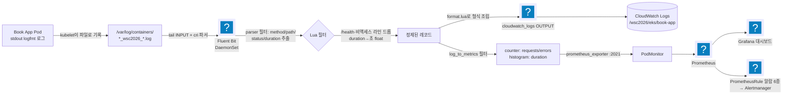
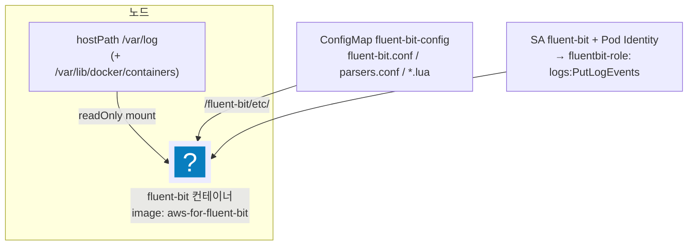
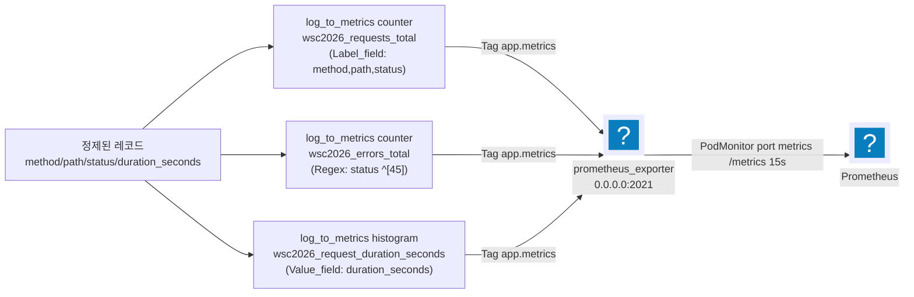
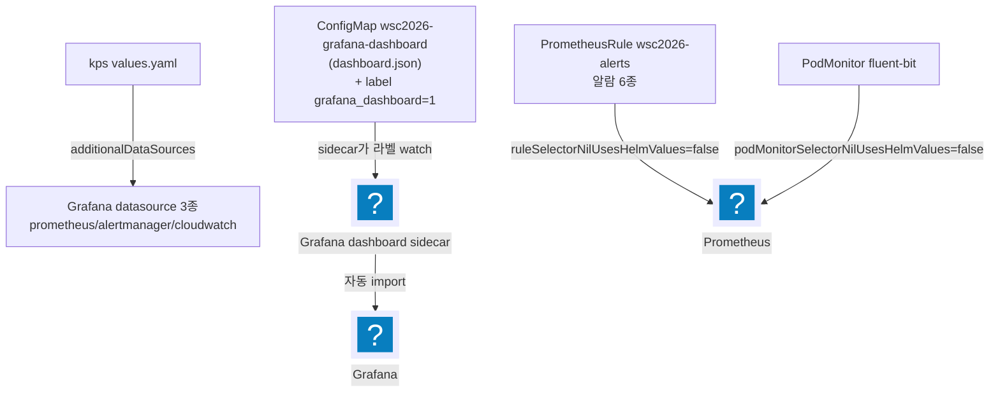

import { Quiz, QuizResults } from 'starlight-quiz/components';
import { Tabs, TabItem } from '@astrojs/starlight/components';

> 문서 유형: explanation

선행 지식과 학습 경로는 [모듈 개요](/part-2/13-observability/)에.

:::tip[읽으면서 확인한다]
주제 2 와 주제 4 끝에 **지금 확인하기** 블록이 접혀 있다. 정답지 파일을 읽고 차트를 렌더해 볼 뿐이라 **과금이 0원**이고 클러스터도 자격증명도 필요 없다. 블록을 열지 않고 읽어도 문서는 그대로 이어진다.
:::

대회 관측성 요구는 항상 같은 세 줄기다.

1. 앱 로그를 CloudWatch로 보낸다(형식 정확히).
2. 메트릭을 Prometheus로 모은다.
3. Grafana 대시보드·알람을 만든다.

함정은 "앱이 /metrics를 노출하지 않는다"는 데서 나온다.

메트릭이 무엇인지, Prometheus 가 왜 "가져가는" 방식인지, Grafana 와 역할이 어떻게 갈리는지는 [observability-basics](/start/observability-basics/)가 먼저 다룬다. 이 문서는 그 위에서 대회 파이프라인을 조립한다.

---

## 주제 1. 관측성 파이프라인 전체 구조

### ① 정의

앱 컨테이너의 stdout 액세스 로그 한 줄이 두 갈래로 소비되는 파이프라인.
한 갈래는 **CloudWatch Logs**(형식 변환 후 전송), 다른 갈래는 **로그→메트릭 변환**을 거쳐 Prometheus/Grafana/알람의 데이터 소스가 된다.

### ② 왜 (채점 관점)

- mark 스크립트는 CloudWatch 로그의 **키/형식 정확 일치**를 grep 한다 (set-07 11-1-A: 키가 정확히 `client_ip,method,path,status_code,timestamp` 5개 + `/health` 로그 **0건**).

그 5키가 왜 하필 그 형식인지부터 짚는다. 과제지가 CloudWatch 로 전송된 로그의 예시 한 줄을 그대로 박아 두었기 때문이다 — `{"timestamp":"...","method":"POST","path":"/v1/book","status_code":200,"client_ip":"..."}`. 반면 앱이 stdout 으로 찍는 원본은 logfmt 한 줄이고 `duration` 처럼 예시에 없는 필드까지 들어 있다. 그래서 파이프라인이 원본을 그대로 흘리면 키 이름도 개수도 어긋난다. 파서로 필요한 값을 뽑고 Lua 로 5키만 다시 조립하는 것은 이 간극을 메우는 작업이다. `status_code` 를 문자열이 아니라 정수로, `timestamp` 를 ISO8601 `Z` 표기로 맞추는 것도 같은 이유다.

`/health` 를 버리는 것도 형식 문제의 연장이다. `/health` 는 ALB 헬스체크가 주기적으로 때리는 경로라 사용자 요청과 섞이면 로그가 그것만으로 채워지고, 뒤에서 만드는 요청 수·오류율 메트릭도 실제 트래픽을 반영하지 못한다.
- Grafana 대시보드는 패널 존재만이 아니라 **데이터 표시 여부**까지 본다 — No Data 패널 하나라도 있으면 오답.
- 알람(11-4)은 실제 Firing 여부를 검사한다. HTTP 계열 알람의 유일한 소스가 로그 기반 메트릭이므로 파이프라인이 끊기면 알람 점수도 통째로 날아간다.

### ③ 원리



<details class="diagram-note">
<summary>이 도식이 보여주는 것</summary>

로그 한 줄이 두 갈래 산출물이 되기까지의 전 경로다. 앱이 stdout 으로 찍으면 kubelet 이 노드의 파일로 남기고, Fluent Bit 이 그 파일을 tail 해 cri 파서로 읽는다. 파서 필터가 method·path·status·duration 을 뽑고 Lua 필터가 `/health` 같은 라인을 버린다. 정제된 레코드는 오른쪽으로 CloudWatch Logs 에 저장되고, 아래쪽으로 log_to_metrics 를 거쳐 Prometheus 메트릭이 된다 — 같은 로그가 저장과 메트릭 두 목적지로 갈라지는 것이 이 파이프라인의 뼈대다.

</details>

핵심: **한 번 파싱한 레코드를 태그 분기(`app.access` / `app.metrics`)로 두 OUTPUT에 나눠 보낸다.** CloudWatch 갈래는 형식 재조립(format.lua), 메트릭 갈래는 log_to_metrics를 거친다.

### ④ 변형 포인트

당일 과제의 약 30% 가 수정된다. 세트별 실측값은 이렇다.

| | set-02 | set-03 | set-07 |
|---|---|---|---|
| 인증 | IRSA | Pod Identity | Pod Identity |
| 로그 형식 | 세트 지정 | Reference02 문자열(`INFO  {"level":...}`) | 정확히 5키 JSON(`client_ip,method,path,status_code,timestamp`) |
| HTTP 메트릭 | — | **log_to_metrics** (:2021 → PodMonitor) | CloudWatch Exporter(ALB TargetResponseTime) |
| Fluent Bit ns | monitoring | observability | logging |

| 바뀌는 값 | 고칠 곳 | 확인 |
|---|---|---|
| CloudWatch 로그 형식·키 | Lua 재조립 스크립트 | 과제지 예시 한 줄과 키 이름·개수·타입 일치 |
| Fluent Bit 네임스페이스 | 배포 매니페스트의 ns | 채점이 그 ns 의 fluent-bit Running 수를 센다 |
| 인증 방식 | SA 와 IAM 연결(IRSA 또는 Pod Identity) | 권한이 없으면 수집은 되고 전송만 실패한다 |
| HTTP 메트릭 소스 | log_to_metrics 또는 CloudWatch Exporter | 앱이 `/metrics` 를 노출하는지로 갈린다 |

판단 기준은 과제지가 CloudWatch 로그 예시 한 줄을 박아 두었는지다. 예시가 있으면 그 키 이름·개수·타입이 곧 채점 기준이 되고, `/health` 처럼 사용자 요청이 아닌 라인은 버린다.

---

## 주제 2. Fluent Bit DaemonSet

### ① 정의

모든 노드에 1개씩 뜨는 로그 수집기. 노드의 `/var/log`를 hostPath로 읽어 파싱·필터링 후 외부로 전송한다.

### ② 왜 (채점 관점)

- 채점은 "observability(또는 logging) ns에서 fluent-bit Running 카운트"를 세고, CloudWatch 로그 내용을 검사한다.
- **taint 있는 workload 노드에서도 떠야** 앱 로그가 수집된다 → `tolerations: [operator: Exists]` 누락이 대표 실수.

### ③ 원리 — 구성요소 체크리스트



<details class="diagram-note">
<summary>이 도식이 보여주는 것</summary>

Fluent Bit 파드 한 개가 노드에서 무엇을 붙들고 있는지다. 노드의 `/var/log` 를 읽기 전용으로 마운트해 로그 파일에 닿고, 설정 3종(본체·파서·Lua)은 ConfigMap 에서 `/fluent-bit/etc/` 로 들어온다. AWS 권한은 서비스 계정에 붙은 Pod Identity 로 받는다 — `logs:PutLogEvents` 가 없으면 수집은 되고 전송만 실패한다.

</details>

- **INPUT tail**: `Path /var/log/containers/*_wsc2026_*.log` — 파일명 패턴이 `<pod>_<namespace>_<container>-<id>.log`라 네임스페이스로 필터 가능.
- **cri 파서**: containerd 로그 라인은 `타임스탬프 stdout F 실제로그` 형태 — cri 파서가 `log` 키로 벗겨낸다.
- **bookaccess 파서(regex)**: logfmt 라인에서 `method/path/status/duration`(set-07은 `status_code/client_ip`) 추출.
- **cloudwatch_logs OUTPUT**: `auto_create_group false` — 로그 그룹은 Terraform이 CMK로 선생성. Fluent Bit이 만들면 암호화 미적용으로 감점.
- **Lua duration 변환**: Go는 duration을 `136.048µs`, `89.8ms`, `1.5s`, `1m30s`처럼 단위 붙은 문자열로 찍는다. histogram의 `Value_field`는 숫자여야 하므로 초 단위 float로 변환한다(단위표 ns/µs/us/ms/s + `NmM.Ns` 패턴 별도 처리 — set-03 `prepare.lua`).
- **/health 드롭**: Lua에서 `path == "/health"`면 `return -1, 0, 0`(레코드 폐기). 채점이 CloudWatch에서 /health 0건을 확인한다.

### ④ 변형 포인트

| 바뀌는 값 | 고칠 곳 | 확인 |
|---|---|---|
| 수집 대상 네임스페이스 | INPUT tail 의 `Path /var/log/containers/*_<ns>_*.log` | 파일명이 `<pod>_<namespace>_<container>-<id>.log` |
| 앱 로그 원본 형식 | `bookaccess` 정규식 파서 | 파서가 뽑는 키가 재조립에 필요한 키를 모두 덮는지 |
| 출력 로그 형식 | Lua 스크립트 (set-03 `format.lua` / set-07 `reshape.lua`) | CloudWatch 로그 한 줄이 과제지 예시와 같은지 |
| 로그 그룹 이름 | Terraform 로그 그룹 + `cloudwatch_logs` OUTPUT | `auto_create_group false` 유지 — Fluent Bit 이 만들면 암호화 미적용 |
| taint 있는 노드그룹 | DaemonSet 의 `tolerations: [operator: Exists]` | 앱이 뜬 노드에도 fluent-bit 이 Running |

Lua 를 몇 개로 나눌지도 세트마다 다르다. set-03 은 드롭·변환(`prepare.lua`)과 형식 조립(`format.lua`)을 나누고 Reference02 형식("LEVEL 5자 패딩 + 키 순서 고정 JSON 문자열")을 만든다. set-07 은 `reshape.lua` 하나로 5키를 재구성한다(`timestamp` ISO8601Z, `status_code` 정수화). `/health` 드롭 분기는 어느 쪽이든 남긴다 — 채점이 CloudWatch 에서 0건을 확인한다.

<details class="build-step">
<summary>지금 확인하기 — 수집 범위가 세트마다 어떻게 다른가</summary>

위 표의 첫 줄이 실제 파일에서 어떻게 생겼는지 두 세트를 나란히 본다. **정답지 파일을 읽기만 하므로 클러스터도 자격증명도 필요 없고 과금도 없다.**

<Tabs syncKey="shell">
  <TabItem label="PowerShell">
  ```powershell
  Select-String -Pattern 'Path +/var/log|Exclude_Path|log_group_name' `
    -Path $HOME\skills-2026\set-02\task-1\k8s\monitoring\fluent-bit.yaml,
          $HOME\skills-2026\set-07\task-1\k8s\logging\fluent-bit.yaml
  ```
  </TabItem>
  <TabItem label="Bash (Linux/CloudShell)">
  ```bash
  grep -nE 'Path +/var/log|Exclude_Path|log_group_name' \
    ~/skills-2026/set-02/task-1/k8s/monitoring/fluent-bit.yaml \
    ~/skills-2026/set-07/task-1/k8s/logging/fluent-bit.yaml
  ```
  </TabItem>
</Tabs>

기대: set-02 는 세 줄, set-07 은 두 줄이 나온다. :badge[실측]{variant=note}

| | set-02 | set-07 |
|---|---|---|
| 수집 경로 | `*.log` — **전부** | `*_unicorn_*.log` — 네임스페이스 하나만 |
| 제외 경로 | `fluent-bit*.log` — 자기 로그를 뺀다 | 없다 |
| 로그 그룹 | `/wskorea26/eks/pod-logs` | `/unicorn/eks/book-app` |

**set-02 가 `Exclude_Path` 를 두는 이유가 여기서 보인다.** 전부 수집하면 Fluent Bit 자신의 로그도 걸려 들어가고, 그것을 다시 전송하면서 또 로그가 생기는 되먹임이 생긴다. set-07 은 애초에 앱 네임스페이스만 보므로 그 문제가 없다.

파일 이름이 `<파드>_<네임스페이스>_<컨테이너>-<id>.log` 라는 규칙 하나가 이 차이를 만든다. **네임스페이스를 바꾸라는 요구가 오면 이 경로가 따라온다** — 그리고 로그 그룹 이름도 함께다.

경로가 안 보이면 정답지 클론 위치가 다른 것이다 — [사전 준비 §4 저장소 클론](/start/#4-저장소-클론)의 경로를 확인한다.

</details>

---

## 주제 3. log_to_metrics — 앱이 /metrics를 안 줄 때 (set-03 패턴)

### ① 정의

Fluent Bit 필터. 통과하는 로그 레코드를 세거나(counter) 필드 값을 집계해(histogram) Prometheus 메트릭으로 만든 뒤, `prometheus_exporter` OUTPUT이 `:2021/metrics`로 노출한다.

여기서 Fluent Bit 은 [exporter](/start/observability-basics/#2-4-exporter--메트릭을-낼-줄-모르는-것을-위해) 노릇을 한다 — 메트릭을 낼 줄 모르는 앱 대신 `/metrics` 를 여는 자리다. counter 와 histogram 의 차이는 [메트릭 종류 절](/start/observability-basics/#2-6-메트릭-종류--counter--gauge--histogram)에 있다.

### ② 왜 (채점 관점)

제공 앱 바이너리가 /metrics를 노출하지 않는 세트(set-03)에서 트래픽 패널·HighErrorRate/HighLatency 알람의 **유일한 소스**다. 이게 없으면 대시보드 Row와 알람 2종이 전부 No Data.

### ③ 원리



<details class="diagram-note">
<summary>이 도식이 보여주는 것</summary>

로그를 메트릭으로 바꾸는 세 필터다. 요청 수는 method·path·status 를 라벨로 갖는 카운터, 오류 수는 status 가 4·5 로 시작할 때만 세는 카운터, 응답 시간은 `duration_seconds` 값을 담는 히스토그램이다. 셋 다 같은 태그로 묶여 2021 포트의 exporter 로 나가고, PodMonitor 가 그 포트를 15초마다 긁어 Prometheus 로 넣는다.

</details>

:::note[실측 — 메트릭명 접두어]
실제 노출되는 이름에는 **`log_metric_counter_` / `log_metric_histogram_` 접두어가 자동으로 붙는다**:
`log_metric_counter_wsc2026_requests_total`, `log_metric_histogram_wsc2026_request_duration_seconds_{bucket,sum,count}`.

**배포 후 반드시 `:2021/metrics`를 curl 해서 실제 메트릭명을 확인**하고 prometheus-rules.yaml / dashboard.json의 이름과 대조한다. 접두어 규칙이 버전에 따라 다를 수 있어 실측이 원칙.
:::

- PodMonitor가 붙으려면 kps values에 `podMonitorSelectorNilUsesHelmValues: false`가 있어야 release 라벨 없이도 선택된다. PodMonitor 가 "무엇을 긁을지"를 어떻게 고르는지는 [observability-basics 의 PodMonitor 절](/start/observability-basics/#2-5-podmonitor--무엇을-긁을지-선언한다) 참고.
- **함정**: `aws-for-fluent-bit` 이미지에 log_to_metrics가 빠진 빌드가 있다. 필터가 안 먹으면 upstream `fluent/fluent-bit` 최신 안정 태그로 이미지만 교체(설정 호환).

### ④ 세트별 차이

- set-03: log_to_metrics 필수(위 그대로).
- set-07: HTTP Duration 패널을 CloudWatch Exporter(ALB TargetResponseTime)로 해결 — 로그 기반 메트릭 불필요.

---

## 주제 4. kube-prometheus-stack + Grafana provisioning

### ① 정의

Prometheus Operator + Prometheus + Alertmanager + node-exporter + kube-state-metrics + Grafana를 한 Helm 차트로 설치. CRD(`PrometheusRule`, `PodMonitor`, `ServiceMonitor`)로 룰/스크레이프 대상을 선언한다.

### ② 왜 (채점 관점)

- mark 11-1: ns 안의 파드 이름 카운트 — **release 이름이 파드 이름에 들어가므로** 런북과 동일하게(`monitoring` 등) 설치해야 한다.
- mark 11-2: datasource **이름·타입 정확 일치**(prometheus/alertmanager/cloudwatch) + 대시보드 이름.
- mark 11-4: 알람 Firing.

### ③ 원리 — provisioning 두 경로



<details class="diagram-note">
<summary>이 도식이 보여주는 것</summary>

Grafana 와 Prometheus 에 설정이 들어가는 세 경로다. 데이터소스 3종은 values 파일이 직접 넣고, 대시보드는 ConfigMap 에 `grafana_dashboard=1` 라벨을 붙이면 사이드카가 그 라벨을 감시하다 자동으로 import 한다.

PrometheusRule 과 PodMonitor 를 잡는 경로는 셀렉터 값 두 개에 달려 있다. `ruleSelectorNilUsesHelmValues` 와 `podMonitorSelectorNilUsesHelmValues` 는 기본값이 `true` 이고, 그때 Prometheus 는 **자기 helm 릴리스 라벨이 붙은 리소스만** 수집 대상으로 고른다. `false` 로 바꾸면 라벨 기준이 풀려 클러스터의 모든 PrometheusRule·PodMonitor 를 본다. 우리가 직접 쓴 룰과 PodMonitor 에는 그 릴리스 라벨이 없으므로 `false` 로 바꾼다.

</details>

- 대시보드 import는 **configmap 생성 → `grafana_dashboard=1` 라벨** 두 단계. 라벨을 빼먹으면 sidecar가 무시한다.
- cloudwatch datasource는 `authType: default` — Grafana SA에 Pod Identity(grafana-role)를 연결해 인증한다.
- 알람 6종(set-03 Reference02): PodHighCPU(80%/3m), PodHighMemory(90%/3m), PodNotReady, HighErrorRate(5%/1m), HighLatency(평균 3s/1m), PodCrashLooping(재시작>3).

:::danger[함정 — 발화 불가 항목은 사양대로 구현만]
set-03 실측: 제공 바이너리에 `/delay` 엔드포인트가 없어(404, µs 응답) HighLatency는 채점 latency-gen으로 발화시킬 수 없다. 나머지 5종은 채점 부하 파드로 발화된다. **룰을 임의로 낮춰 억지로 발화시키면 사양 불일치 감점.**
:::

### ④ 세트별 차이

- set-03: Grafana `Service type LoadBalancer`(NLB, admin/`Skills$#$@!`), EKS 관리형이라 kubeControllerManager/Scheduler/Etcd/Proxy 수집 비활성, Alertmanager `clusterDomain: wsc2026.skills.local`(커스텀 도메인과 정합).
- set-07: Grafana를 internal ALB + TargetGroupBinding으로 노출, admin 계정이 선수등번호 기반(`skills$NUM`).

<details class="build-step">
<summary>지금 확인하기 — values 한 줄이 매니페스트 어디에 박히나</summary>

`nodeSelector` 를 values 에 적으면 그것이 실제로 몇 군데에 들어가는지 본다. `helm template` 은 렌더만 하고 클러스터에 보내지 않으므로 **클러스터도 자격증명도 필요 없고 과금도 0** 이다.

<Tabs syncKey="shell">
  <TabItem label="PowerShell">
  ```powershell
  helm repo add prometheus-community https://prometheus-community.github.io/helm-charts
  helm repo update
  helm template kps prometheus-community/kube-prometheus-stack -n monitoring `
    --set prometheus.prometheusSpec.nodeSelector."node-type"=addon |
    Select-String -Pattern 'node-type'
  ```
  </TabItem>
  <TabItem label="Bash (Linux/CloudShell)">
  ```bash
  helm repo add prometheus-community https://prometheus-community.github.io/helm-charts
  helm repo update
  helm template kps prometheus-community/kube-prometheus-stack -n monitoring \
    --set prometheus.prometheusSpec.nodeSelector."node-type"=addon | grep -n 'node-type'
  ```
  </TabItem>
</Tabs>

기대: `node-type: addon` 이 **한 곳에만** 나온다 — Prometheus 리소스 안이다.

요점은 나오지 **않는** 곳이다. Grafana·Operator·kube-state-metrics·node-exporter 는 각자 자기 `nodeSelector` 키를 따로 갖는다. **`prometheus.prometheusSpec` 아래에 적은 값은 Prometheus 에만 간다.** 그래서 "모니터링을 전부 addon 노드에" 라는 요구는 values 한 줄로 끝나지 않고 컴포넌트마다 적어야 한다.

`--set` 에서 키 이름에 하이픈이 있어 `."node-type"` 처럼 따옴표로 감싼 것도 함께 본다. 감싸지 않으면 helm 이 점을 경로 구분자로 읽어 엉뚱한 곳에 넣는다.

`Error: repo prometheus-community not found` 면 `helm repo add` 를 안 한 것이다.

</details>

### set-07 은 저장소가 바뀐다 — 04 가 그것을 가능하게 했다 :badge[실측]{variant=note}

[set-07 `kube-prometheus-stack-values.yaml`](https://github.com/ishs-cloud-computing/skills-2026/blob/main/set-07/task-1/k8s/monitoring/kube-prometheus-stack-values.yaml)을 set-02 와 나란히 놓으면 이렇다.

| 항목 | set-02 | set-07 |
|---|---|---|
| release 이름 | `wskorea26-monitoring` | `unicorn-monitoring` |
| 노드 라벨 키 | `node-type: addon` | `unicorn: addon` |
| Alertmanager | `enabled: false` | 끄지 않는다 |
| Prometheus 저장소 | `emptyDir` | **PVC — CMK 암호화 StorageClass** |
| 로그 수집기 위치 | `monitoring` 네임스페이스 | **`logging` 으로 분리** |
| 추가 수집기 | 없음 | CloudWatch Exporter |

**저장소 줄이 이 모듈에서 가장 중요한 연결이다.** set-02 가 `emptyDir` 을 쓰는 것은 취향이 아니라 제약이었다 — EBS CSI 드라이버를 깔면 노드마다 DaemonSet 이 뜨고, 그것이 앱 노드에 뜬 `kube-system` 파드가 되어 set-02 의 노드 배치 검사를 위반한다. 그래서 애드온을 못 깔고, 못 깔았으니 PVC 를 못 쓴다.

set-07 에는 그 검사가 없다. [11](/part-2/11-eksctl-cluster/theory/)에서 EBS CSI 드라이버를 애드온으로 넣었고, **그래서 여기서 Prometheus 가 디스크를 갖는다.** 두 모듈 떨어진 결정 하나가 여기까지 온다.

Alertmanager 도 같은 구조다. set-02 가 끈 이유는 "필요 없어서"가 아니라 `nodeSelector` 없는 StatefulSet 이 앱 노드로 갈 수 있어서였다. 제약이 사라지면 끌 이유도 사라진다.

**이 절에서 가져갈 것은 "왜 껐는가"를 묻는 습관이다.** 기준본이 무언가를 안 하고 있으면 그것은 대개 금지가 아니라 그 세트의 제약이다. 제약이 바뀌면 선택도 바뀐다.

---

## 자기 점검 퀴즈 (5문)

<Quiz title="/metrics 없는 앱의 알람 소스">
제공 앱 바이너리가 `/metrics`를 노출하지 않는데 HighErrorRate 알람(에러율 5%/1m)을 만들어야 한다. 데이터 소스를 어떻게 확보하나?

- [x] Fluent Bit `log_to_metrics` 필터로 액세스 로그에서 requests/errors counter를 만들고, `prometheus_exporter` OUTPUT(:2021)을 PodMonitor로 Prometheus에 수집시킨다
- [ ] Grafana cloudwatch datasource로 CloudWatch Logs Insights 쿼리를 알람 조건에 건다
  > Grafana 관리형 알림이라면 CloudWatch datasource 로도 평가할 수 있다. 다만 이 과제의 채점 대상은 **PrometheusRule(PromQL)** 이고, Grafana datasource 는 그 룰의 입력이 되지 못한다.
- [ ] kube-state-metrics가 이미 HTTP 상태코드별 카운터를 노출하므로 그대로 쓴다
  > kube-state-metrics는 Deployment/Pod 같은 k8s 오브젝트 상태만 노출한다. 애플리케이션 HTTP 코드는 없다.
- [ ] 앱 컨테이너에 exporter 사이드카를 붙이고 앱 코드에 `/metrics` 핸들러를 추가한다

Fluent Bit `log_to_metrics` 필터로 액세스 로그에서 requests/errors counter를 생성 → `prometheus_exporter :2021` → PodMonitor로 Prometheus에 수집시킨다 (set-03 패턴). 제공 바이너리는 수정 대상이 아니므로, 이미 흐르고 있는 stdout 로그를 메트릭으로 바꾸는 것이 유일한 경로다. 이 파이프라인이 끊기면 트래픽 패널과 HighErrorRate/HighLatency 알람이 통째로 No Data가 된다.
</Quiz>

<Quiz title="log_to_metrics 자동 접두어">
`log_to_metrics` counter를 `wsc2026_requests_total`이라는 이름으로 정의했다. Prometheus에서 실제로 조회되는 메트릭 이름은 [[log_metric_counter_wsc2026_requests_total]] 이다.

---

노출되는 이름에는 `log_metric_counter_` / `log_metric_histogram_` 접두어가 자동으로 붙는다 — histogram이면 `log_metric_histogram_wsc2026_request_duration_seconds_{bucket,sum,count}`. 다만 접두어 규칙은 빌드에 따라 달라질 수 있으므로 **실측이 원칙**이다: 배포 후 fluent-bit 파드에서 `kubectl exec ... -- curl -s localhost:2021/metrics`로 실제 이름을 확인하고, prometheus-rules.yaml / dashboard.json의 이름과 대조·수정한다.
</Quiz>

<Quiz title="Fluent Bit이 workload 노드에 안 뜰 때">
Fluent Bit DaemonSet이 addon 노드에는 떴는데 workload 노드에는 파드가 하나도 없다. 원인과 수정은?

- [x] workload 노드그룹의 taint(`NoSchedule`) 때문 — DaemonSet 파드 스펙에 `tolerations: [operator: Exists]`를 추가한다
- [ ] DaemonSet의 `replicas`를 노드 수만큼 올리지 않아서
  > DaemonSet에는 `replicas` 필드가 없다. 스케줄 가능한 노드마다 자동으로 1개씩 뜬다.
- [ ] fluent-bit SA에 Pod Identity 연결이 빠져서
  > 인증 누락은 `logs:PutLogEvents` 실패로 나타난다. 파드는 정상적으로 스케줄된다.
- [ ] hostPath `/var/log` 마운트 권한이 없어서
  > 마운트 실패면 파드가 그 노드에 생성은 되고 Error/CrashLoop 상태가 된다. 파드 자체가 없다는 건 스케줄 단계 문제다.

workload 노드그룹의 taint(`NoSchedule`) 때문이다. DaemonSet 스펙에 `tolerations: [operator: Exists]`를 추가한다. 앱 파드는 workload 노드에 있으므로, 여기에 Fluent Bit이 안 뜨면 앱 로그가 아예 수집되지 않는다 — 대표 실수.
</Quiz>

<Quiz title="대시보드가 import 되지 않을 때">
Grafana에 dashboard.json을 ConfigMap으로 넣었는데 대시보드가 보이지 않는다. 점검할 것을 **모두** 고르시오.

- [x] ConfigMap에 `grafana_dashboard=1` 라벨이 붙어 있는가
- [x] 대시보드 sidecar의 `searchNamespace`가 ConfigMap의 네임스페이스를 포함하는가
- [ ] kps values의 `additionalDataSources`에 대시보드 uid를 등록했는가
  > `additionalDataSources`는 datasource(prometheus/alertmanager/cloudwatch) 프로비저닝용이다. 대시보드 import 경로와 무관하다.
- [ ] Grafana 파드를 재시작했는가
  > sidecar가 라벨을 watch해 실시간으로 import하므로 재시작은 필요 없다. 라벨이 없으면 재시작해도 안 뜬다.

대시보드 import는 **① configmap 생성 → ② `grafana_dashboard=1` 라벨** 두 단계다. 라벨을 빼먹으면 sidecar가 아예 무시한다. 라벨이 맞는데도 안 뜨면 sidecar `searchNamespace`가 그 ConfigMap의 네임스페이스와 일치하는지 본다. 참고로 채점은 패널 존재가 아니라 **데이터 표시 여부**까지 보므로, import된 뒤 No Data 패널이 없는지도 확인해야 한다.
</Quiz>

<Quiz title="Go duration을 histogram에 넣기">
Go 로그가 `duration=136.048µs`, `89.8ms`, `1m30s`처럼 단위 붙은 문자열을 찍는다. 이걸 `log_to_metrics` histogram에 넣으려면?

- [x] histogram `Value_field`는 숫자만 받으므로, Lua에서 단위표(ns/µs/us/ms/s + `NmM.Ns` 패턴 별도)로 초 단위 float(`duration_seconds`)로 변환해 넣는다
- [ ] parsers.conf의 `Types duration:float`로 캐스팅하면 된다
  > `136.048µs`는 뒤에 단위 문자가 붙어 있어 float 캐스팅이 실패하거나 단위를 잃은 값이 된다. 문자열 파싱이 먼저다.
- [ ] Prometheus recording rule로 단위를 나눠 초 단위로 만든다
  > 값이 histogram에 들어가지 못하면 recording rule이 참조할 시계열 자체가 없다. 변환은 Fluent Bit 단계에서 끝나야 한다.
- [ ] Go의 duration은 이미 초 단위 실수라 그대로 넣어도 된다

histogram의 `Value_field`는 숫자여야 하므로 초 단위 float로 변환한다. Lua에서 단위표(ns/µs/us/ms/s)를 두고, `1m30s` 같은 `NmM.Ns` 패턴은 별도로 처리한다(set-03 `prepare.lua`). 결과를 `duration_seconds` 필드로 넣고 histogram의 `Value_field`가 이를 가리킨다.
</Quiz>

<QuizResults confetti />
