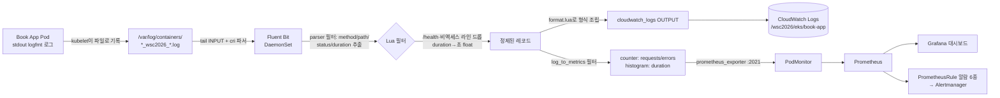
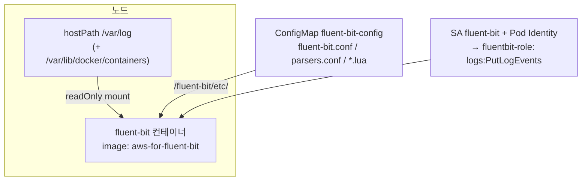
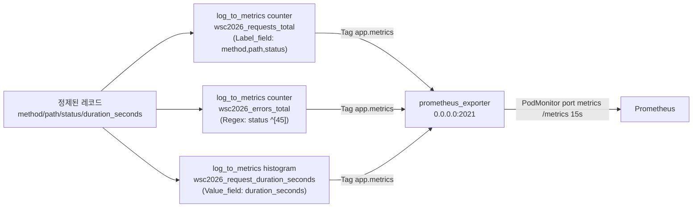
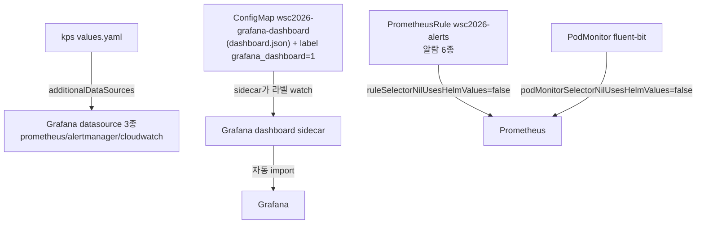

> 문서 유형: explanation

대회 관측성 요구는 항상 같은 뼈대다: **① 앱 로그를 CloudWatch로 보내라(형식 정확히), ② 메트릭을 Prometheus로 모아라, ③ Grafana 대시보드/알람을 만들어라.** 함정은 "앱이 /metrics를 노출하지 않는다"는 데서 나온다.

---

## 주제 1. 관측성 파이프라인 전체 구조

### ① 정의

앱 컨테이너의 stdout 액세스 로그 한 줄이 두 갈래로 소비되는 파이프라인.
한 갈래는 **CloudWatch Logs**(형식 변환 후 전송), 다른 갈래는 **로그→메트릭 변환**을 거쳐 Prometheus/Grafana/알람의 데이터 소스가 된다.

### ② 왜 (채점 관점)

- mark 스크립트는 CloudWatch 로그의 **키/형식 정확 일치**를 grep 한다 (set-07 11-1-A: 키가 정확히 `client_ip,method,path,status_code,timestamp` 5개 + `/health` 로그 **0건**).
- Grafana 대시보드는 패널 존재만이 아니라 **데이터 표시 여부**까지 본다 — No Data 패널 하나라도 있으면 오답.
- 알람(11-4)은 실제 Firing 여부를 검사한다. HTTP 계열 알람의 유일한 소스가 로그 기반 메트릭이므로 파이프라인이 끊기면 알람 점수도 통째로 날아간다.

### ③ 원리

핵심: **한 번 파싱한 레코드를 태그 분기(`app.access` / `app.metrics`)로 두 OUTPUT에 나눠 보낸다.** CloudWatch 갈래는 형식 재조립(format.lua), 메트릭 갈래는 log_to_metrics를 거친다.

### ④ 세트별 차이

| | set-02 | set-03 | set-07 |
|---|---|---|---|
| 인증 | IRSA | Pod Identity | Pod Identity |
| 로그 형식 | 세트 지정 | Reference02 문자열(`INFO  {"level":...}`) | 정확히 5키 JSON(`client_ip,method,path,status_code,timestamp`) |
| HTTP 메트릭 | — | **log_to_metrics** (:2021 → PodMonitor) | CloudWatch Exporter(ALB TargetResponseTime) |
| Fluent Bit ns | monitoring | observability | logging |

---

## 주제 2. Fluent Bit DaemonSet

### ① 정의

모든 노드에 1개씩 뜨는 로그 수집기. 노드의 `/var/log`를 hostPath로 읽어 파싱·필터링 후 외부로 전송한다.

### ② 왜 (채점 관점)

- 채점은 "observability(또는 logging) ns에서 fluent-bit Running 카운트"를 세고, CloudWatch 로그 내용을 검사한다.
- **taint 있는 workload 노드에서도 떠야** 앱 로그가 수집된다 → `tolerations: [operator: Exists]` 누락이 대표 실수.

### ③ 원리 — 구성요소 체크리스트

- **INPUT tail**: `Path /var/log/containers/*_wsc2026_*.log` — 파일명 패턴이 `<pod>_<namespace>_<container>-<id>.log`라 네임스페이스로 필터 가능.
- **cri 파서**: containerd 로그 라인은 `타임스탬프 stdout F 실제로그` 형태 — cri 파서가 `log` 키로 벗겨낸다.
- **bookaccess 파서(regex)**: logfmt 라인에서 `method/path/status/duration`(set-07은 `status_code/client_ip`) 추출.
- **cloudwatch_logs OUTPUT**: `auto_create_group false` — 로그 그룹은 Terraform이 CMK로 선생성. Fluent Bit이 만들면 암호화 미적용으로 감점.
- **Lua duration 변환**: Go는 duration을 `136.048µs`, `89.8ms`, `1.5s`, `1m30s`처럼 단위 붙은 문자열로 찍는다. histogram의 `Value_field`는 숫자여야 하므로 초 단위 float로 변환한다(단위표 ns/µs/us/ms/s + `NmM.Ns` 패턴 별도 처리 — set-03 `prepare.lua`).
- **/health 드롭**: Lua에서 `path == "/health"`면 `return -1, 0, 0`(레코드 폐기). 채점이 CloudWatch에서 /health 0건을 확인한다.

### ④ 세트별 차이

- set-03: 드롭+변환(prepare.lua)과 형식 조립(format.lua)을 분리. Reference02는 "LEVEL 5자 패딩 + 키 순서 고정 JSON 문자열".
- set-07: reshape.lua 하나로 5키 재구성(`timestamp` ISO8601Z, `status_code` 정수화). **키 이름·개수 정확 일치**가 채점 포인트.

---

## 주제 3. log_to_metrics — 앱이 /metrics를 안 줄 때 (set-03 패턴)

### ① 정의

Fluent Bit 필터. 통과하는 로그 레코드를 세거나(counter) 필드 값을 집계해(histogram) Prometheus 메트릭으로 만든 뒤, `prometheus_exporter` OUTPUT이 `:2021/metrics`로 노출한다.

### ② 왜 (채점 관점)

제공 앱 바이너리가 /metrics를 노출하지 않는 세트(set-03)에서 트래픽 패널·HighErrorRate/HighLatency 알람의 **유일한 소스**다. 이게 없으면 대시보드 Row와 알람 2종이 전부 No Data.

### ③ 원리

- 실제 노출되는 이름에는 **`log_metric_counter_` / `log_metric_histogram_` 접두어가 자동으로 붙는다**:
  `log_metric_counter_wsc2026_requests_total`, `log_metric_histogram_wsc2026_request_duration_seconds_{bucket,sum,count}`.
- **배포 후 반드시 `:2021/metrics`를 curl 해서 실제 메트릭명을 확인**하고 prometheus-rules.yaml / dashboard.json의 이름과 대조한다. 접두어 규칙이 버전에 따라 다를 수 있어 실측이 원칙.
- PodMonitor가 붙으려면 kps values에 `podMonitorSelectorNilUsesHelmValues: false`가 있어야 release 라벨 없이도 선택된다.
- **함정**: `aws-for-fluent-bit` 이미지에 log_to_metrics가 빠진 빌드가 있다. 필터가 안 먹으면 upstream `fluent/fluent-bit` 최신 안정 태그로 이미지만 교체(설정 호환).

### ④ 세트별 차이

- set-03: log_to_metrics 필수(위 그대로).
- set-07: HTTP Duration 패널을 CloudWatch Exporter(ALB TargetResponseTime)로 해결 — 로그 기반 메트릭 불필요.

---

## 주제 4. kube-prometheus-stack + Grafana provisioning

### ① 정의

Prometheus Operator + Prometheus + Alertmanager + node-exporter + kube-state-metrics + Grafana를 한 Helm 차트로 설치. CRD(`PrometheusRule`, `PodMonitor`, `ServiceMonitor`)로 룰/스크레이프 대상을 선언한다.

### ② 왜 (채점 관점)

- mark 11-1: ns 안의 파드 이름 카운트 — **release 이름이 파드 이름에 들어가므로** 런북과 동일하게(`monitoring` 등) 설치해야 한다.
- mark 11-2: datasource **이름·타입 정확 일치**(prometheus/alertmanager/cloudwatch) + 대시보드 이름.
- mark 11-4: 알람 Firing.

### ③ 원리 — provisioning 두 경로

- 대시보드 import는 **configmap 생성 → `grafana_dashboard=1` 라벨** 두 단계. 라벨을 빼먹으면 sidecar가 무시한다.
- cloudwatch datasource는 `authType: default` — Grafana SA에 Pod Identity(grafana-role)를 연결해 인증한다.
- 알람 6종(set-03 Reference02): PodHighCPU(80%/3m), PodHighMemory(90%/3m), PodNotReady, HighErrorRate(5%/1m), HighLatency(평균 3s/1m), PodCrashLooping(재시작>3).
- **발화 불가 항목은 사양대로 구현만 한다**: set-03 실측 — 제공 바이너리에 `/delay` 엔드포인트가 없어(404, µs 응답) HighLatency는 채점 latency-gen으로 발화시킬 수 없다. 나머지 5종은 채점 부하 파드로 발화된다. 룰을 임의로 낮춰 억지로 발화시키면 사양 불일치 감점.

### ④ 세트별 차이

- set-03: Grafana `Service type LoadBalancer`(NLB, admin/`Skills$#$@!`), EKS 관리형이라 kubeControllerManager/Scheduler/Etcd/Proxy 수집 비활성, Alertmanager `clusterDomain: wsc2026.skills.local`(커스텀 도메인과 정합).
- set-07: Grafana를 internal ALB + TargetGroupBinding으로 노출, admin 계정이 선수등번호 기반(`skills$NUM`).

---

## 자기 점검 퀴즈 (5문)

1. 앱이 /metrics를 노출하지 않는데 HighErrorRate 알람을 만들어야 한다. 데이터 소스를 어떻게 확보하나?
2. `log_to_metrics`로 `wsc2026_requests_total` counter를 만들었다. Prometheus에서 실제 조회할 메트릭 이름은? 그리고 이를 확정하는 실무 절차는?
3. Fluent Bit DaemonSet이 workload 노드에는 안 뜬다. 원인과 수정은?
4. Grafana에 dashboard.json을 넣었는데 대시보드가 안 보인다. 점검할 두 가지는?
5. Go 로그의 `duration=136.048µs`를 histogram에 넣으려면 왜, 어떻게 변환하나?

### 정답

1. Fluent Bit `log_to_metrics` 필터로 액세스 로그에서 requests/errors counter를 생성 → `prometheus_exporter :2021` → PodMonitor로 Prometheus에 수집시킨다 (set-03 패턴).
2. `log_metric_counter_wsc2026_requests_total`(자동 접두어). 배포 후 fluent-bit 파드에 `kubectl exec ... -- curl -s localhost:2021/metrics`로 실명을 확인하고 prometheus-rules.yaml/dashboard.json과 대조·수정한다.
3. workload 노드그룹의 taint(`NoSchedule`) 때문. DaemonSet 스펙에 `tolerations: [operator: Exists]` 추가.
4. ① configmap에 `grafana_dashboard=1` 라벨이 있는가(sidecar가 라벨로 watch), ② sidecar `searchNamespace`가 configmap의 네임스페이스와 일치하는가.
5. histogram `Value_field`는 숫자만 받으므로 Lua에서 단위표(ns/µs/us/ms/s, `1m30s` 패턴 별도)로 초 단위 float(`duration_seconds`)로 변환해 넣는다.
