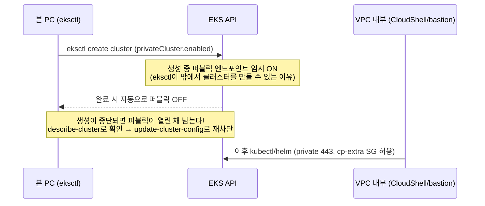
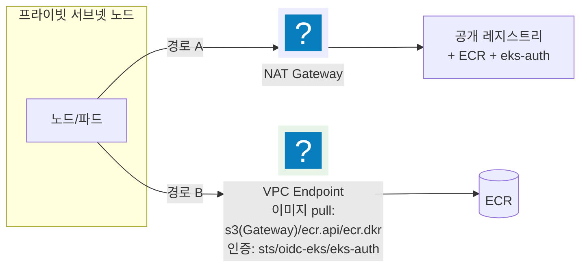
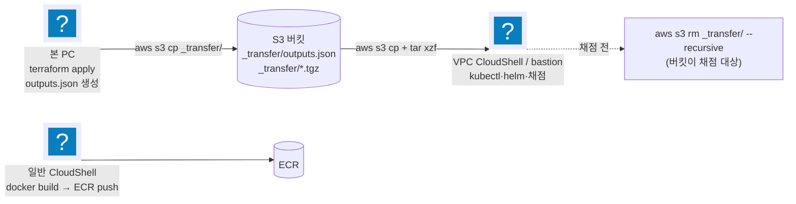
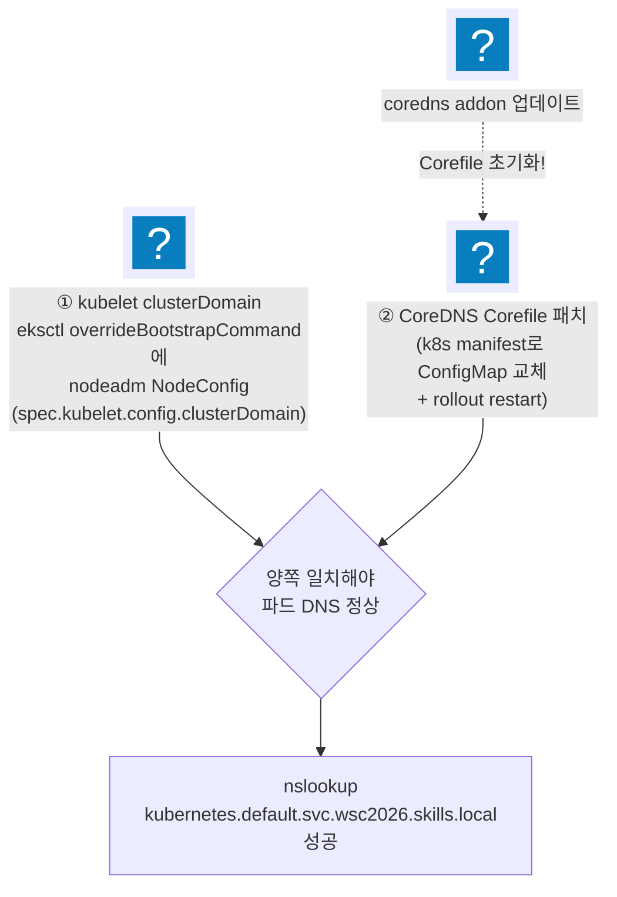
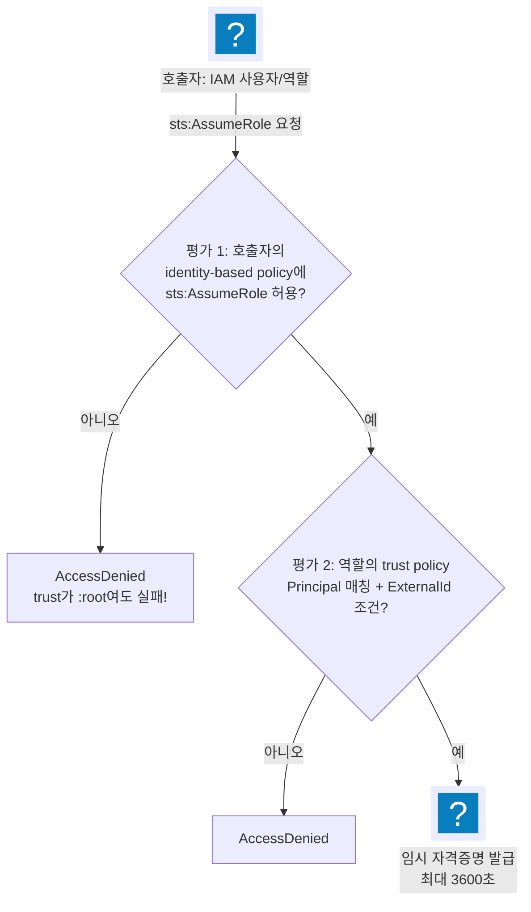

import { Quiz, QuizResults } from 'starlight-quiz/components';

> 문서 유형: explanation

선행 지식과 학습 경로는 [모듈 개요](/part-3/08-private-eks-iam/)에.

이 모듈은 "네트워크가 닫힌 클러스터를 어떻게 만들고·접근하고·채점받는가"와 "IAM 정책이 실제로 어떻게 평가되는가"를 다룬다. 둘 다 실측 함정이 많은 하드모드 영역이다.

---

## 주제 1. Fully-Private EKS — 생성·접근·이미지 pull

### ① 정의

컨트롤 플레인 API 엔드포인트를 `endpointPublicAccess=false, endpointPrivateAccess=true`로 운용하는 클러스터. kubectl/helm은 **VPC 내부에서만** 가능하다. 컨트롤 플레인이 무엇이고 왜 사용자 VPC 밖에 있는지는 [eks-basics](/start/eks-basics/)에 있다.

### ② 왜 (채점 관점)

- mark 4-1이 `describe-cluster`로 `[false, true]`를 직접 확인한다.
- 퍼블릭이 열린 채 남으면 보안 pillar 감점 + "private" 요구 불충족.

### ③ 원리



<details class="diagram-note">
<summary>이 도식이 보여주는 것</summary>

프라이빗 클러스터가 만들어지는 동안 퍼블릭 엔드포인트가 잠시 켜지는 이유를 보여 준다. eksctl 은 VPC 밖에서 도는데 클러스터 API 에 붙어야 하므로, 생성 중에만 퍼블릭이 열리고 완료 시 자동으로 닫힌다. 위험은 중간에 실패했을 때다 — 자동으로 닫는 단계가 실행되지 않아 퍼블릭이 열린 채 남는다. 그래서 생성 후 상태 확인이 습관이어야 한다.

</details>

- **확인·재차단 명령** (생성 직후 습관화):
  ```bash
  aws eks describe-cluster --name <cluster> \
    --query 'cluster.resourcesVpcConfig.[endpointPublicAccess,endpointPrivateAccess]'   # false, true
  aws eks update-cluster-config --name <cluster> --resources-vpc-config endpointPublicAccess=false
  ```
- **이미지 pull 경로 2가지**:



<details class="diagram-note">
<summary>이 도식이 보여주는 것</summary>

프라이빗 노드가 이미지를 받는 두 경로다. 경로 A 는 NAT 를 거쳐 인터넷으로 나가는 방식이라 공개 레지스트리까지 닿고, 경로 B 는 VPC 엔드포인트로 VPC 안에서 끝낸다. 엔드포인트 방식은 대상을 골라 만들어야 한다 — 이미지 pull 에 s3(게이트웨이)·ecr.api·ecr.dkr 이, 인증에 sts 계열이 필요하다. 하나라도 빠지면 노드는 뜨는데 이미지를 못 받는 상태가 된다.

</details>

  - 경로 A(NAT): 세트에 프라이빗 통신 요구가 없으면 이걸로 충분(비용·생성 시간 절감). S3 Gateway Endpoint만 두어 이미지 레이어 pull을 안정화하는 절충이 set-03.
  - 경로 B(Endpoint): VPC 엔드포인트가 게이트웨이형과 인터페이스형으로 갈리는 이유는 [vpc-basics 의 VPC 엔드포인트 절](/start/vpc-basics/#vpc-엔드포인트--프라이빗-경로로-aws-api-부르기)에 있다. "인터넷 미경유" 요구 시 이미지 pull 용 `s3`(Gateway)/`ecr.api`/`ecr.dkr` 만으로는 부족하다. 인증에 `sts`(IRSA 의 `AssumeRoleWithWebIdentity`)·`oidc-eks`(OIDC 디스커버리)·`eks-auth`(Pod Identity), 노드 부트스트랩에 `ec2` 가 더 필요하고, 워크로드에 따라 `logs`·`elasticloadbalancing`·`kms` 를 추가한다 (set-07은 ECR·CloudWatch를 Endpoint로).

:::danger[함정 — eks Endpoint 가 OIDC 해석을 가린다]
set-03 실측(endpoints.tf 주석): `eks` Interface Endpoint를 `private_dns_enabled`로 만들면 그 PHZ(프라이빗 호스팅 영역 — VPC 안에서만 유효한 DNS 영역)가 `eks.<region>.amazonaws.com` 을 가져가면서 `oidc.eks.<region>.amazonaws.com` 해석까지 가려 **IRSA가 깨진다**. NAT가 있으면 이 호출은 NAT 경유로 충분하므로 set-03은 이 엔드포인트를 만들지 않는다.

**`eks-auth` 는 반대다.** AWS는 아웃바운드 인터넷이 없는 클러스터에서 Pod Identity에 `com.amazonaws.<region>.eks-auth` 를 **필수**로 문서화한다. 프라이빗 DNS 이름이 `eks-auth.<region>.api.aws` 라 OIDC 도메인과 겹치지 않아 위 문제를 일으키지 않는다 — 만들지 않으면 오히려 Pod Identity가 죽는다.

2026년 7월부터는 OIDC 디스커버리 전용 엔드포인트 `com.amazonaws.<region>.oidc-eks` 가 있다. `eks` 엔드포인트를 프라이빗 DNS로 켜야 하는 구성이라면 이것을 함께 만들어 해석을 되살린다. 둘이 더는 양자택일이 아니다.
:::

### ④ 세트별 차이

- set-03: `privateCluster: {enabled: true, skipEndpointCreation: true}` + NAT + S3 Gateway만.
- set-07: NAT + ECR/CloudWatch Interface Endpoint 병행, 작업 호스트로 SSM bastion 채택.

---

## 주제 2. 머신 3분할과 S3 릴레이

### ① 정의

private 클러스터 과제에서 역할별로 실행 위치를 나누는 운영 패턴.

| 머신 | 역할 | 이유 |
|---|---|---|
| 본 PC | terraform apply / eksctl | tfstate·도구가 여기 있음. eksctl은 밖에서도 생성 가능(주제 1) |
| 일반 CloudShell | docker build/push | 본 PC에 Docker 없을 때(대회: WSL/Docker 불가) |
| VPC CloudShell 또는 SSM bastion | kubectl·helm·채점 | private API는 VPC 내부에서만 |

### ② 왜 (채점 관점)

- mark 스크립트 자체가 VPC 내부 셸에서 돈다(mark-sg → cp-extra SG 443 허용).
- **생성자 신원 = 채점 신원 원칙**: `bootstrapClusterCreatorAdminPermissions: true`로 클러스터 생성자는 자동 admin. terraform/eksctl/채점을 같은 IAM 신원으로 실행하면 access entry 추가가 불필요하다. root-less KMS 키 정책은 계정 위임(`kms:CallerAccount`)이라 신원을 가리지 않지만, EKS 접근은 여기서 보듯 신원에 묶이므로 이 원칙은 KMS 와 무관하게 그대로 지킨다. 신원이 다르면 `create-access-entry` + `associate-access-policy`(ClusterAdmin)로 보정.

### ③ 원리



<details class="diagram-note">
<summary>이 도식이 보여주는 것</summary>

인터넷이 닿지 않는 환경에서 파일을 옮기는 3분할 구조다. 본 PC 가 Terraform 결과를 S3 `_transfer/` 로 올리면 VPC CloudShell 이 그것을 받아 kubectl·채점에 쓴다. 이미지 빌드만은 인터넷이 필요해 일반 CloudShell 이 맡는다. 점선이 마지막 단계다 — 그 버킷 자체가 채점 대상이므로 채점 전에 `_transfer/` 를 반드시 비운다.

</details>

- **VPC CloudShell은 비영속 + 업로드 UI 없음**: 홈이 세션 종료 시 삭제되고 파일을 올릴 방법이 없다 → S3 `_transfer/` 릴레이로 받고, 도구 설치·자격증명·kubeconfig·환경변수를 **하나의 멱등 셋업 블록**으로 만들어 재접속 시 통째로 재실행한다(약 1~2분). 환경변수는 `~/.wsc2026-env` 같은 파일로 `source`.
- tfstate·`.terraform/`은 절대 릴레이에 올리지 않는다 — `terraform output -json > outputs.json`만 넘겨 jq로 읽는다.
- set-07 변형: CloudShell 대신 **SSM bastion**(private 서브넷 EC2, 인바운드 0, 프로파일은 SSM 전용) — 30분 타임아웃·비영속을 피한다. 단 bastion은 **채점 전 삭제**(인스턴스+프로파일+role까지).
- set-07 배포본 v4부터 **채점용 VPC CloudShell 환경(`unicorn-mark`)이 Public 서브넷에서 Private 서브넷으로 옮겨졌다.** 채점 트래픽이 private 서브넷에서 출발하므로 컨트롤 플레인 추가 SG의 443 허용 소스와 라우팅을 그 기준으로 잡는다.

### ④ 세트별 차이

set-03 = VPC CloudShell, set-07 = bastion(+ fallback으로 채점용 CloudShell 겸용).

:::note[협의회(2026-07-31) — 접근 경로는 제한하지 않는다]
EKS 접근 방식을 특정하지 않는 쪽으로 정리됐다. 과제지 요구는 "CloudShell에서 kubectl 명령어를 사용할 수 있어야 한다" 하나다. CloudShell 접근이 불가한 구성이면 **선수가 채점 전에 bastion을 사전 구축해 쓰는 것도 공식적으로 허용**된다.

본 PC·VPC CloudShell·일반 CloudShell 3분할과 bastion 패턴이 그대로 공인된 셈이다. 다만 "채점 전 bastion 삭제"는 세트별 과제지의 미요구 리소스 정리 원칙에서 나온 것이므로, 당일 과제지가 bastion을 언급하면 그 지시를 우선한다.

회의록이 붙인 조건 셋을 함께 지킨다([대회 운영 규칙](/reference/competition-rules/)).

- **bastion 생성·수정은 경기 중에만.** 채점 시 새로 만들거나 중지된 인스턴스를 시작하는 제어는 허용되지 않는다 — 채점 전에 지웠다가 접근이 막히면 되살릴 방법이 없다. 지울지 남길지는 경기 종료 전에 결정한다.
- **용도는 kubectl을 포함한 채점 명령 실행 전용.** EKS와 무관한 채점 항목의 명령을 돌리는 서버로는 쓰지 못한다.
- 채점·풀이 시간 등 bastion 때문에 생기는 불이익은 선수가 감수한다. 3과제에서는 EC2 개수에 포함돼 비용 점수를 깎는다.
:::

---

## 주제 3. CoreDNS 커스텀 도메인 (wsc2026.skills.local)

### ① 정의

클러스터 내부 DNS 도메인을 기본 `cluster.local`에서 과제 지정 도메인으로 변경하는 작업. **두 군데를 함께** 바꿔야 한다.

### ② 왜 (채점 관점)

mark 4-1이 kubelet configz의 clusterDomain과 Corefile을 grep 한다. 한쪽만 바꾸면 파드 DNS가 깨진다.

### ③ 원리



<details class="diagram-note">
<summary>이 도식이 보여주는 것</summary>

커스텀 클러스터 도메인은 두 곳을 함께 고쳐야 한다. ①은 노드 부팅 설정으로 kubelet 의 `clusterDomain` 을 바꾸고, ②는 CoreDNS 의 Corefile 에 그 존을 추가한다. 둘이 일치해야 파드의 이름 해석이 성립한다. 점선이 함정이다 — coredns 애드온을 업데이트하면 Corefile 이 기본값으로 돌아가므로 ②를 다시 적용해야 한다.

</details>

- kubelet 쪽: AL2023 MNG는 `overrideBootstrapCommand`에 nodeadm NodeConfig를 넣으면 기본 NodeConfig와 필드 단위 merge된다 — 노드그룹 **모두**에 넣는다.
- kps의 Alertmanager도 `clusterDomain` 설정이 있어 함께 맞춘다(모듈 06 연계).

:::caution[coredns addon 업데이트 금지]
addon을 업데이트하면 **Corefile이 초기화**될 수 있다. 이미 했다면 패치를 재적용하고 grep으로 재확인한다.
:::

### ④ 세트별 차이

도메인 문자열만 다르다. 커스텀 도메인 요구가 없는 세트는 건드리지 않는다.

---

## 주제 4. IAM 심화 — Audit Role과 정책 이중 평가 (set-07 9-1/9-2 :badge[실측]{variant=note})

### ① 정의

감사자용 AssumeRole 전용 역할. set-07 사양: trust = 계정 `:root` + `sts:ExternalId` StringEquals 조건, `max_session_duration = 3600`, 권한은 DynamoDB 조회 + VPC/EKS Describe(액션 와일드카드 금지).

Principal·신뢰 정책(trust policy)·STS 임시 자격 증명이 처음이면 [iam-basics](/start/iam-basics/)를 먼저 본다 — 이 절은 그 문서의 개념 위에서 "평가가 두 번 일어난다"만 더한다.

### ② 왜 (채점 관점)

- mark 9-1: `get-role`로 MaxSessionDuration=3600, Principal=`:root`, ExternalId 문자열을 **정확 일치**로 본다.
- mark 9-2: ExternalId 없이 assume → `AccessDenied` 기대, ExternalId 붙여 assume → 성공 후 허용 액션(describe-vpcs)은 되고 미허용 액션(describe-instances)은 `AccessDenied/UnauthorizedOperation`이어야 한다. 즉 **성공과 실패 양쪽이 모두 채점 대상**이다.

:::danger[ExternalId 정확 일치]
ExternalId는 `unicorn-audit-2026<선수등번호>` — **apply 시 넣은 player_number와 채점 셸이 export한 number가 정확히 일치**해야 한다.
:::

### ③ 원리 — AssumeRole 이중 평가



<details class="diagram-note">
<summary>이 도식이 보여주는 것</summary>

역할을 맡을 때 평가가 두 번 일어난다는 것을 순서로 보여 준다. 먼저 호출자 쪽 정책에 `sts:AssumeRole` 이 있어야 하고, 그다음 역할의 신뢰 정책이 Principal 과 ExternalId 조건을 확인한다. 어느 쪽에서 막혀도 오류 메시지는 같은 `AccessDenied` 라, 원인을 가르려면 두 곳을 각각 봐야 한다.

</details>

- trust의 `Principal: :root`는 "이 **계정의** principal이면 후보"라는 뜻이지 전원 허용이 아니다. **trust policy AND 호출자 identity-based policy 둘 다 통과**해야 한다 — 호출자가 admin(또는 sts:AssumeRole 허용 보유)이 아니면 assume은 실패한다. 이게 같은 계정 `:root` trust가 안전하게 쓰이는 이유.
- **리소스 레벨 ARN 미지원 액션**: `ec2:DescribeVpcs`는 ARN을 지원하지 않아 `Resource "*"`가 불가피하다. 대신 좁힐 수 있는 것(`eks:DescribeCluster` → cluster ARN)만이라도 **별도 statement로 분리**해 좁힌다 — set-07 iam.tf가 이 구조.
- **요구 목록 외 권한 추가는 수동 채점 리스크**: 테이블이 CMK 암호화라 조회에 `kms:Decrypt`가 실제로 필요하지만, 요구 목록에 없는 액션 추가는 "최소권한 위반"으로 읽힐 수 있다. 넣는다면 리소스를 해당 키 ARN 하나로 못박고 sid로 사유를 명시한다.
- **root-less KMS 재확인(모듈 02 연계)**: 유의사항에 root/`kms:*` 금지가 있는 세트(set-03)는 키 정책을 관리자 principal `"*"` + `kms:CallerAccount` 조건(계정 위임) + 서비스별 최소 statement로 구성한다. 여기 audit role 의 trust 와 대비된다 — trust policy 는 `:root` ARN 을 그대로 쓰지만 KMS 키 정책은 채점이 `:root` 문자열을 grep 하므로 조건식으로 같은 뜻을 표현한다. 계정 위임이라 root 자격증명으로 apply·채점해도 막히지 않는다. 실물 JSON 은 [kms-basics](/start/kms-basics/#1-root-less-키-정책-실물--적용된-json)에 있다.

### ④ 세트별 차이

set-07만 audit role이 명시 요구. set-03은 대신 root-less KMS가 하드 포인트.

---

## 주제 5. CloudFront VPC Origin + KMS Multi-Region Key (set-07)

### ① 정의 / ② 왜

- **VPC Origin**: CloudFront가 **internal ALB**를 인터넷 노출 없이 오리진으로 쓰는 기능. 채점은 CloudFront 경유 200 + **ALB 직접 접근 차단**을 본다.
- **MRK**: 같은 키 자료를 여러 리전에 복제한 KMS 키. WAF 로그(us-east-1)=primary, EKS/EBS/Log(서울)=replica. alias는 양 리전에 존재, 회전(90일)은 primary가 관리.

### ③ 원리



<details class="diagram-note">
<summary>이 도식이 보여주는 것</summary>

```mermaid
flowchart LR
    User@{ icon: "mdi:web", form: "square", label: "사용자", pos: "b", h: 46, w: 46 }
    CF@{ icon: "logos:aws-cloudfront", form: "square", label: "CloudFront<br/>unicorn-svc-cf + WAF", pos: "b", h: 46, w: 46 }
    User --> CF
    ALB@{ icon: "logos:aws-elb", form: "square", label: "internal ALB<br/>unicorn-alb", pos: "b", h: 46, w: 46 }
    CF -->|VPC Origin| ALB
    CF -->|OAC| S3[(S3 정적)]
    Direct@{ icon: "mdi:web", form: "square", label: "직접 curl", pos: "b", h: 46, w: 46 }
    Direct -.->|SG: CloudFront<br/>origin-facing prefix list만 80 허용| ALB
    Direct -. "internal이라 인터넷에서 000(연결 불가),<br/>prefix list 밖 내부 접근은 거부" .-> X[403/000 기대]
    subgraph KMS["<span class='icon--logos icon--logos--aws-kms'></span> KMS MRK"]
        P@{ icon: "logos:aws-kms", form: "square", label: "primary us-east-1<br/>(WAF 로그, 회전 관리)", pos: "b", h: 46, w: 46 }
        R@{ icon: "logos:aws-kms", form: "square", label: "replica ap-northeast-2<br/>(EKS/EBS/Log)", pos: "b", h: 46, w: 46 }
        P === R
    end
```

internal ALB 를 CloudFront VPC Origin 으로 노출하는 구성이다. 사용자 트래픽은 CloudFront 를 거쳐 내부 ALB 로 들어가고, 정적 파일은 OAC 로 S3 에서 받는다. 직접 접근은 두 겹으로 막힌다 — ALB 가 internal 이라 인터넷에서는 연결 자체가 안 되고(000), VPC 안에서 시도해도 보안 그룹이 CloudFront 오리진 프리픽스 리스트만 허용한다. 오른쪽 KMS 는 다중 리전 키로, 로그용 기본 키는 us-east-1 에 두고 복제본이 서울 리소스를 담당한다.

</details>

- ALB SG 인바운드를 `com.amazonaws.global.cloudfront.origin-facing` **managed prefix list**로만 열면 직접 접근은 차단된다 — 채점 기대값이 403 또는 000(타임아웃/연결 불가)인 이유. 000 유도는 prefix list SG로 달성한다.

### ④ 세트별 차이

set-03은 internet-facing ALB + CloudFront prefix list SG(직접 curl 000), set-07은 internal ALB + VPC Origin. 모듈 02·06의 CloudFront 내용과 교차 확인.

---

## 자기 점검 퀴즈 (5문)

<Quiz title="노트북에서 private 클러스터 생성">
`eksctl create cluster`를 퍼블릭 네트워크의 본 PC에서 실행했는데 fully-private 클러스터가 만들어진다. 그 이유와, 생성이 중간에 끊겼을 때 해야 할 일은?

- [x] eksctl이 생성 중 퍼블릭 엔드포인트를 임시로 켰다가 완료 시 자동으로 끈다 — 중단되면 퍼블릭이 열린 채 남으므로 `describe-cluster`로 `[false, true]`를 확인하고 필요하면 `update-cluster-config`로 재차단한다
- [ ] `privateCluster.enabled`는 노드그룹에만 적용되고 컨트롤 플레인 엔드포인트는 apply 후 수동으로 닫는 게 정상 절차다
  > `privateCluster.enabled`는 컨트롤 플레인 엔드포인트 설정을 포함한다. 수동 마감이 정상 절차인 게 아니라, 중단 시에만 남는 잔여 상태다.
- [ ] eksctl은 CloudFormation만 호출하고 클러스터에는 접근하지 않으므로 엔드포인트가 열릴 일이 없다
  > eksctl은 생성 후 애드온·aws-auth 등을 위해 실제로 API 서버에 붙는다. 그래서 생성 구간에 퍼블릭이 필요하다.
- [ ] eksctl이 자동으로 SSM 터널을 뚫어 VPC 내부에서 API를 호출한다

eksctl이 생성 중 퍼블릭 엔드포인트를 임시로 켰다가 완료 시 자동으로 끈다. 그래서 밖에서도 만들 수 있다. 생성이 중단되면 퍼블릭이 열린 채 남고, mark 4-1은 `describe-cluster`로 `[endpointPublicAccess, endpointPrivateAccess]`가 `[false, true]`인지 직접 확인한다. 생성 직후 습관화할 것 — 확인은 `aws eks describe-cluster --name <cluster> --query 'cluster.resourcesVpcConfig.[endpointPublicAccess,endpointPrivateAccess]'`, 재차단은 `aws eks update-cluster-config --name <cluster> --resources-vpc-config endpointPublicAccess=false`.
</Quiz>

<Quiz title="eks Endpoint 와 OIDC 해석">
fully-private 클러스터에 `eks` Interface Endpoint를 `private_dns_enabled`로 만들었더니 IRSA가 깨졌다. 이유와 대응은?

- [x] Endpoint의 PHZ가 `eks.<region>.amazonaws.com` 을 가져가면서 `oidc.eks.<region>.amazonaws.com` 해석까지 가린다 → NAT 경유로 두거나 `oidc-eks` Endpoint를 함께 만든다
- [ ] `eks-auth` Endpoint도 같은 이유로 Pod Identity를 깨뜨리므로 둘 다 만들지 않는다
  > `eks-auth` 의 프라이빗 DNS 이름은 `eks-auth.<region>.api.aws` 라 OIDC 도메인과 겹치지 않는다. 오히려 아웃바운드 인터넷이 없으면 Pod Identity에 **필수**다 — 안 만들면 그쪽이 죽는다.
- [ ] `eks`는 Interface Endpoint를 지원하지 않아 생성 자체가 실패한다
  > 생성은 정상적으로 된다. 문제는 만들어진 뒤 DNS 해석이 가로채이는 것이라 더 찾기 어렵다.
- [ ] Interface Endpoint는 시간당 과금이라 비용 pillar에서 감점된다
  > 비용은 부수적 이유다. 여기서 결정적인 것은 인증 파괴다.

`eks` Endpoint의 PHZ가 OIDC 도메인 해석을 가린다(set-03 실측, endpoints.tf 주석). set-03은 NAT가 있으므로 이 Endpoint를 만들지 않는 쪽을 택했고, 2026년 7월 이후에는 `com.amazonaws.<region>.oidc-eks` 를 함께 만들어 해석을 되살리는 선택지도 있다.

"인터넷 미경유" 요구가 있을 때 필요한 목록은 이미지 pull(`s3` Gateway / `ecr.api` / `ecr.dkr`)에서 끝나지 않는다. `sts`·`oidc-eks`·`eks-auth`·`ec2` 를 빠뜨리면 IRSA와 Pod Identity가 함께 죽는다.
</Quiz>

<Quiz title="AssumeRole 이중 평가">
trust policy가 `Principal: arn:aws:iam::<acct>:root`인 역할을, 같은 계정의 **아무 정책도 붙어 있지 않은** IAM 사용자가 assume하면?

- [x] `AccessDenied` — trust policy와 호출자의 identity-based `sts:AssumeRole` 허용을 **둘 다** 통과해야 한다
- [ ] 성공한다 — `:root`는 그 계정의 모든 principal에게 assume을 허용한다는 뜻이다
  > 가장 흔한 오개념. `:root`는 "후보 범위를 계정 전체로 넓힌다"는 위임 선언일 뿐, 호출자에게 권한을 부여하지 않는다.
- [ ] trust에 ExternalId 조건이 없으면 성공하고, 조건이 있으면 실패한다
  > ExternalId는 평가 2(trust) 안의 추가 조건일 뿐이다. 조건이 없어도 평가 1(호출자 정책)에서 이미 막힌다.
- [ ] 성공하지만 세션이 `max_session_duration` 없이 기본 1시간으로 제한된다

`AccessDenied`. AssumeRole은 두 평가를 순서대로 모두 통과해야 임시 자격증명을 발급한다.

1. 호출자의 identity-based policy에 `sts:AssumeRole` 허용이 있는가.
2. 역할 trust policy의 Principal이 매칭되고 ExternalId 조건이 맞는가.

`:root` trust는 후보 범위를 계정으로 넓힐 뿐 권한을 주지 않는다 — 이것이 같은 계정 `:root` trust가 안전하게 쓰이는 이유다.
</Quiz>

<Quiz title="ExternalId 정확 일치">
mark 9-1은 audit role의 ExternalId를 문자열 **정확 일치**로 본다. ExternalId는 `unicorn-audit-2026` + 선수등번호이며, 채점 셸이 export하는 등번호와 반드시 같아야 하는 terraform 변수 이름은 [[player_number]] 이다.

---

대회 당일 맞춰야 하는 두 값은 **terraform apply에 넣는 `player_number`**와 **채점 셸에서 export하는 등번호(`number`)**다. 둘이 다르면 mark 9-1의 문자열 비교와 mark 9-2의 assume이 **모두** 실패한다.

9-2는 성공과 실패 양쪽이 다 채점 대상이다. ExternalId 없이 assume하면 `AccessDenied` 여야 하고, 붙여서 assume한 뒤에는 `describe-vpcs`가 성공하고 `describe-instances`가 거부되어야 한다. `get-role`은 `MaxSessionDuration=3600`도 함께 본다.
</Quiz>

<Quiz title="Corefile이 되돌아가는 이유">
CoreDNS 커스텀 도메인(`wsc2026.skills.local`)을 패치했는데 어느 순간 Corefile이 원래대로 돌아가 있다. 대표 원인은?

- [x] coredns addon을 업데이트해서 — Corefile이 addon 기본값으로 초기화된다
- [ ] `kubectl rollout restart`가 ConfigMap을 차트 기본값으로 재생성해서
  > restart는 파드만 다시 띄운다. ConfigMap은 건드리지 않으며, 오히려 패치를 반영하려면 필요한 단계다.
- [ ] kubelet의 `clusterDomain` 설정이 주기적으로 Corefile에 동기화돼서
  > kubelet과 Corefile은 서로를 덮어쓰지 않는다. 둘 다 수동으로 맞춰야 하는 **독립된 두 군데**라서 문제가 되는 것이다.
- [ ] Karpenter가 노드를 교체할 때 coredns가 기본 설정으로 재배포돼서

coredns addon 업데이트가 Corefile을 addon 기본값으로 초기화한다. 업데이트하지 않는다. 이미 했다면 패치를 재적용하고 grep으로 재확인한다.

커스텀 도메인은 두 군데를 함께 바꿔야 한다.

1. **kubelet clusterDomain** — eksctl `overrideBootstrapCommand`의 nodeadm NodeConfig. 노드그룹 **모두**에 넣는다.
2. **CoreDNS Corefile**

mark 4-1은 kubelet configz와 Corefile을 각각 grep한다. kps의 Alertmanager `clusterDomain`도 같이 맞춘다.
</Quiz>

<QuizResults confetti />
