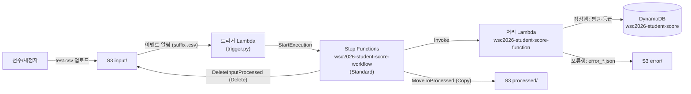
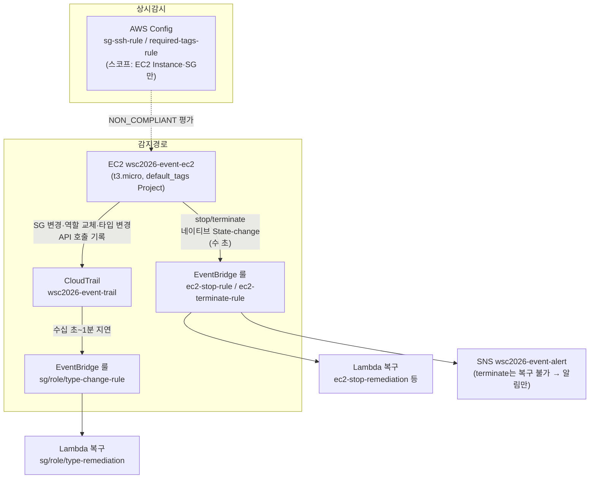

import { Quiz, QuizResults } from 'starlight-quiz/components';

> 문서 유형: explanation

2과제는 독립 모듈 여러 개로 구성되며, 모듈마다 "패턴"이 반복된다. 이 문서는 그중 유형 1·2를 다룬다. 각 유형은 ① 도식 ② 언제 나오나 ③ 핵심 연결 고리 ④ 채점이 보는 상태 ⑤ 퀴즈 순서다.

---

## 유형 1 — 서버리스 워크플로 (S3 → Lambda → Step Functions → DynamoDB)

실측 근거: set-02 task-2 module-1 (성적 처리, ap-southeast-1)

### ① 도식

- 흐름: `input/`에 CSV 업로드 → S3 이벤트가 트리거 Lambda 호출 → 트리거가 Step Functions 실행 시작 → 처리 Lambda가 행별 검증 후 정상행은 평균(483/5=96.6)·등급 계산해 DynamoDB 저장, 오류행은 `error/`에 JSON 저장 → 상태 머신이 원본 파일을 `processed/`로 이동(Copy+Delete).

### ② 언제 이 패턴이 나오나

- 과제지에 "파일 업로드 시 자동 처리", "워크플로우", "Step Functions", "처리 완료 후 파일 이동", "오류 데이터 분리 저장" 키워드가 보일 때.
- S3 폴더가 `input/` `processed/` `error/` 3종으로 나뉘면 거의 확정.
- 배치성 데이터(CSV 성적, 주문 목록 등) + "테이블은 채점 시작 시 비어 있어야 함" 조건이 따라온다.

### ③ 핵심 연결 고리 (여기가 끊어지면 전체가 죽는다)

1. **S3 트리거 suffix `.csv`** — 처리 Lambda가 `error/`에 `.json`을 쓰는데, suffix 필터가 없으면 그 쓰기가 다시 트리거를 발화해 **재귀 무한루프**가 된다. suffix `.csv` 하나로 차단(출력이 `.json`이라 매치 안 됨).
2. **ASL에서 S3 이동은 Copy+Delete 2상태** — S3에 "move" API는 없다. `MoveToProcessed`(CopyObject) → `DeleteInputProcessed`(DeleteObject)로 상태를 2개로 분리한다. 채점은 상태 이름이 아니라 State Machine [name,type]과 S3/DDB 최종 상태만 본다.

:::note[실측 — Decimal 나눗셈]
`Decimal("483")/Decimal("5")` = 정확히 `96.6`. float로 하면 `96.60000000000001`이 되고, 애초에 boto3는 DynamoDB에 float 저장 자체를 거부한다(TypeError). 평균 계산은 반드시 `decimal.Decimal`.
:::

4. **처리 Lambda를 State Machine에서 ARN 직접 호출** — 출력이 `$.result`에 그대로 실려 `.Payload` 언랩이 필요 없다.
5. **IAM 역할 2개** — Lambda 공용 `wsc2026-lambda-student-role` + Step Functions용 `wsc2026-stepfunction-student-role` (과제가 Lambda 역할을 하나만 명명하므로 두 Lambda가 공용).

### ④ 채점이 보는 상태

:::danger[함정 — 이름이 mark에만 있다]
**처리 Lambda 이름 `wsc2026-student-score-function`은 task.md에 없고 mark에만 있다.** mark.md/mark 스크립트를 반드시 읽고 이름을 그대로 쓴다. 임의 변경 금지.
:::

- **S3 폴더 마커는 `input/` 하나만 생성.** `processed/`·`error/`는 실행 후 실제 객체가 생겨 PRE가 뜬다. 마커(0바이트 객체)를 만들어두면 채점의 `aws s3 ls` 목록에 잉여 라인이 출력돼 오답.
- **채점 직전 리셋 절차 (순서 엄수)**: ① `processed/`·`error/` 비우기 → ② DynamoDB 전 항목 삭제 → ③ `test.csv`를 `input/`에 **정확히 1회** 업로드. 2회 업로드하면 timestamp가 다른 error JSON이 8개가 되어 오답(기대는 4개).
- 기대 결과: `STU1020 96.6 A` (get-item), `processed/`에 test.csv만, `error/`에 error_*_STU2001/STU2002/STU2004/unknown.json **정확히 4개**.
- 채점 상태 = "깨끗한 버킷/테이블에서 test.csv 1회 처리 완료 + SUCCEEDED 실행 1건".

### ⑤ 퀴즈

<Quiz title="suffix 필터를 빼면">
트리거 Lambda를 호출하는 S3 이벤트 알림에 suffix 필터를 걸지 않았다. 무슨 일이 벌어지나? (힌트: 처리 Lambda가 `error/`에 쓰는 파일의 확장자)

- [x] 처리 Lambda가 `error/`에 쓰는 `.json`이 같은 버킷의 이벤트를 다시 발화 → 트리거 → 실행 → 또 `.json` … 재귀 무한루프
- [ ] `.csv`가 아닌 객체까지 Step Functions를 시작하지만, 파싱에 실패해 실행이 FAILED로 끝날 뿐이라 루프는 나지 않는다
  > FAILED로 끝나도 그 실행이 이미 `error/`에 JSON을 남겼다면 다음 이벤트가 또 발화한다. 루프를 끊는 건 실행 결과가 아니라 이벤트 필터다.
- [ ] Lambda가 만든 객체에 대해서는 S3 이벤트가 발화하지 않으므로 문제없다
  > S3 이벤트는 PutObject 주체를 구분하지 않는다. 콘솔 업로드든 Lambda 쓰기든 똑같이 발화한다.
- [ ] Step Functions Standard는 동일 이름 실행을 거부하므로 두 번째부터 자동으로 차단된다
  > 실행 이름은 매번 달라지므로 중복 방지가 걸리지 않는다.

suffix `.csv` 하나로 차단된다 — 출력이 `.json`이라 매치되지 않기 때문이다. 이 필터가 이 아키텍처에서 재귀를 막는 유일한 장치다.
</Quiz>

<Quiz title="Decimal 나눗셈">
처리 Lambda에서 평균을 `sum/count`로, 즉 파이썬 float로 계산했다. 483/5의 결과는 [[96.60000000000001]] 이 되어 기대값 96.6과 어긋난다.

---

float가 깨뜨리는 이유는 **두 가지**다. (a) `483/5`가 `96.60000000000001`로 계산돼 채점 기대값 `STU1020 96.6 A`와 불일치한다. (b) 애초에 boto3는 DynamoDB에 float 저장 자체를 거부한다(`TypeError`) — 값이 틀리기 전에 저장이 실패한다. 평균 계산은 반드시 `decimal.Decimal`로: `Decimal("483")/Decimal("5")`는 정확히 `96.6`이다.
</Quiz>

<Quiz title="중복 업로드 복구 순서">
test.csv를 실수로 두 번 업로드해 `error/`에 JSON이 8개가 됐다. 올바른 복구 절차는?

- [x] `processed/`·`error/` 전체 삭제 → DynamoDB scan 후 전 항목 delete-item → test.csv를 `input/`에 정확히 1회 재업로드
- [ ] DynamoDB 전 항목 삭제 → test.csv 1회 재업로드 → 남은 error JSON 정리
  > 재업로드가 새 error JSON 4개를 또 만든 뒤에 정리하면, 어느 4개가 이번 실행의 것인지 timestamp로 골라내야 한다. 버킷을 먼저 비우는 이유다.
- [ ] `input/`에 남은 중복 객체만 지우고 상태 머신을 다시 실행한다
  > `input/`은 `DeleteInputProcessed`가 이미 비웠다. 문제는 누적된 `error/`·`processed/`와 DynamoDB 잔여 항목이다.
- [ ] Step Functions 실행 이력을 삭제하고 재업로드한다
  > 채점이 보는 것은 실행 이력이 아니라 S3/DynamoDB의 최종 상태(+SUCCEEDED 실행 1건)다.

순서 엄수: ① `processed/`·`error/` 비우기 → ② DynamoDB 전 항목 삭제 → ③ `test.csv`를 `input/`에 **정확히 1회** 업로드. 리셋 없이 재업로드만 하면 timestamp가 다른 error JSON이 계속 누적돼, 기대값 4개(`error_*_STU2001/STU2002/STU2004/unknown.json`)와 어긋난다.
</Quiz>

<Quiz title="processed/ 폴더 마커">
`input/`에는 폴더 마커(0바이트 객체)를 만들었다. `processed/`·`error/`에도 같이 만들면 왜 안 되나?

- [x] 채점이 `aws s3 ls s3://버킷/processed/` 출력을 보는데, 마커 때문에 0바이트 잉여 라인이 함께 출력돼 "test.csv만"이라는 기대와 불일치한다
- [ ] 마커가 이미 있으면 `MoveToProcessed`의 CopyObject가 `KeyAlreadyExists`로 실패한다
  > S3의 CopyObject에는 그런 실패가 없다. 같은 키면 그냥 덮어쓴다.
- [ ] 마커 객체도 S3 이벤트를 발화시켜 재귀 트리거가 생긴다
  > 마커에는 `.csv` 확장자가 없어 suffix 필터에 걸리지 않는다.
- [ ] 같은 이유로 `input/` 마커도 만들면 안 된다
  > `input/`은 반대다. 처리가 끝나면 파일이 `processed/`로 옮겨가 폴더가 비므로, 마커가 있어야 경로가 유지된다.

`processed/`·`error/`는 실행 후 실제 객체가 생겨 PRE가 자동으로 뜬다. 마커는 `input/` 하나만 만든다.
</Quiz>

<Quiz title="S3 이동이 상태 2개인 이유">
ASL에서 S3 "이동"을 상태 하나로 구현할 수 없는 이유는?

- [x] S3에 move API가 없어서 — CopyObject + DeleteObject 두 번의 API 호출이 필요하고, ASL Task 상태 하나는 API 하나만 호출한다
- [ ] `MoveToProcessed` 상태의 IAM 정책에 `s3:MoveObject` 액션을 허용하면 한 상태로 가능하다
  > `s3:MoveObject`라는 IAM 액션 자체가 존재하지 않는다.
- [ ] 한 Task 상태의 `Parameters`에 Copy와 Delete를 배열로 넣을 수는 있지만 순서 보장이 안 돼 권장되지 않는다
  > `Parameters`는 단일 API 호출의 인자를 만드는 자리다. 여러 API를 담을 수 없다.
- [ ] Lambda에서 boto3 `move_object()`를 호출하면 한 상태로 되지만 Lambda를 하나 더 만들어야 해서 안 쓴다
  > boto3에도 `move_object()`는 없다. 내부적으로 copy 후 delete를 하는 헬퍼가 있을 뿐이다.

`MoveToProcessed`(CopyObject) → `DeleteInputProcessed`(DeleteObject)로 상태를 2개로 분리한다. 참고로 채점은 상태 이름이 아니라 State Machine의 `[name, type]`과 S3/DynamoDB 최종 상태만 본다.
</Quiz>

<QuizResults confetti />

---

## 유형 2 — 이벤트 기반 자동복구 (EventBridge/Config → Lambda/SNS)

실측 근거: set-02 task-2 module-3 (EC2 정책 위반 자동복구, eu-west-1)

### ① 도식

- 흐름: EC2에 대한 정책 위반(SG 인바운드 추가, 인스턴스 프로파일 교체, 중지, 종료, 타입 변경)을 EventBridge가 감지 → Lambda가 원상 복구하거나(복구 불가한 terminate는) SNS 알림. AWS Config가 SSH 인바운드·필수 태그를 상시 감시.

### ② 언제 이 패턴이 나오나

- 과제지에 "자동 복구", "정책 위반 감지", "EventBridge", "CloudTrail", "Config 룰", "관리자에게 알림(SNS)" 키워드가 보일 때.
- mark 스크립트가 "일부러 망가뜨리고 → sleep → 원상태 확인" 구조면 확정 (예: stop 후 sleep 30에 running 기대).

### ③ 핵심 연결 고리

1. **감지 경로가 2종이고 지연이 다르다.** 인스턴스 stop/terminate는 **네이티브 "EC2 Instance State-change Notification" 이벤트(수 초)**. SG 규칙 변경·역할 교체·타입 변경은 네이티브 이벤트가 **없어서** CloudTrail(API 기록) → EventBridge 경로(수십 초~1분 지연). apply 직후엔 트레일 활성화까지 몇 분 더 걸린다.
2. **stop 복구는 `stopping` 상태에서 트리거 + waiter로 stopped 직후 start.** mark 3-4는 stop 후 (다른 항목 채점 + sleep 30) 시점에 `running`을 기대한다. `stopped` 이벤트를 기다렸다 시작하면 늦는다. `stopping`에서 받아 boto3 waiter(5초 간격)로 stopped를 감지하자마자 start.
3. **무한루프 2중 차단.** 복구 Lambda의 원복 동작 자체가 또 이벤트를 만든다. (a) type-change 룰의 이벤트 패턴에 `anything-but: t3.micro`로 원복 이벤트 제외, (b) Lambda 안에서도 현재 값이 원본이면 즉시 return. role-remediation도 현재 프로파일이 원본이면 return.
4. **레이스 컨디션: 타입 원복 시연 전 stop-rule 비활성화.** 타입 변경 시연 절차(stop→modify→start)의 stop이 stop-remediation과 레이스해서, 복구 Lambda가 인스턴스를 다시 켜버리면 modify가 `IncorrectInstanceState`로 실패한다. `aws events disable-rule --name wsc2026-ec2-stop-rule` 후 시연, 끝나면 enable.
5. **인스턴스 프로파일 이름 = 역할 이름** (`wsc2026-event-ec2-role`). role-remediation이 `ROLE_NAME` 환경변수를 프로파일 Name으로 그대로 써서 원복한다. `-profile` 접미사를 붙이면 복구가 깨진다.
6. **provider `default_tags`로 `Project` 태그 상시 부착** — Config required-tags 룰 통과의 기반.
7. **EC2에 `lifecycle.ignore_changes = [instance_type]`** — 타입 변경 시연 후 `terraform plan`에 diff가 남지 않게.

### ④ 채점이 보는 상태

- **task.md ∪ mark 합집합 구현.** task.md/lambda.md는 sg/role/terminate/type 함수 4개·룰 4개를, mark 스크립트는 stop/terminate/sg/tag 함수 4개·stop/terminate 룰·Config 룰 2개를 요구 → 불일치. mark 스크립트가 1순위지만 task.md 항목은 수동 채점 가능성이 있어 **함수 6개·룰 6개 전부** 만든다.
- **Config 스코프는 EC2 Instance·SecurityGroup만 기록.** 스코프를 넓히면 태그 없는 관리형 리소스(자동 생성 SG, ENI 등)가 required-tags에서 NON_COMPLIANT로 잡혀 "NON_COMPLIANT 0건(None)" 채점이 깨진다.
- **CloudTrail·Config 첫 평가는 5~10분** — apply 직후 바로 채점하지 말 것. 급하면 `aws configservice start-config-rules-evaluation`으로 강제 트리거.
- 기대 출력: stop+SSH 인바운드 추가 후 sleep 90 → `EC2 State: running`, `SG Inbound Count: 0`, required-tags NON_COMPLIANT 조회 결과 `None`.

:::caution[과제지 오타는 그대로 유지]
예: set-02의 `wsc2026-alaytics-ec2-role`(alaytics). 이름 정확 일치 채점이므로 "고쳐주면" 오답.
:::

### ⑤ 퀴즈

<Quiz title="두 감지 경로의 지연 차이">
SG 인바운드 규칙 추가에 대한 자동복구가 인스턴스 stop 복구보다 눈에 띄게 느리다. 근본 이유는?

- [x] SG 규칙 변경에는 네이티브 EventBridge 이벤트가 없어 CloudTrail이 API 호출을 기록해 전달하는 경로(수십 초~1분)를 타기 때문. stop은 네이티브 State-change 이벤트라 수 초다
- [ ] Config 룰 평가 주기를 기다려야 복구 Lambda가 호출되기 때문
  > Config는 상시 감시(NON_COMPLIANT 판정)용이고 복구 경로가 아니다. 복구는 EventBridge → Lambda다.
- [ ] `AuthorizeSecurityGroupIngress`가 비동기 API라 반영·회수에 시간이 걸리기 때문
  > SG 규칙 변경은 즉시 반영된다. 느린 것은 변경이 아니라 그 사실이 EventBridge에 도달하는 경로다.
- [ ] SG 복구 Lambda의 콜드 스타트가 stop 복구 Lambda보다 길기 때문
  > 콜드 스타트는 수백 ms 규모다. 수십 초 차이를 설명하지 못한다.

감지 경로가 2종이고 지연이 다르다는 것이 이 모듈의 핵심 구조다. 인스턴스 stop/terminate = 네이티브 "EC2 Instance State-change Notification"(수 초). SG 규칙 변경·역할 교체·타입 변경 = 네이티브 이벤트가 **없어서** CloudTrail → EventBridge(수십 초~1분). apply 직후에는 트레일 활성화까지 몇 분 더 걸린다.
</Quiz>

<Quiz title="stopping에서 받아야 하는 이유">
mark 3-4는 stop 후 (다른 항목 채점 + sleep 30) 시점에 `running`을 기대한다. 룰을 `stopped` 상태 이벤트로 걸면 왜 실패하나?

- [x] stop→stopped 전이 자체가 1분 안팎 걸려 sleep 30 시점을 이미 넘긴다 — `stopping`에서 트리거 받고 boto3 waiter(5초 간격)로 stopped를 감지하자마자 start해야 한다
- [ ] `stopped`는 State-change Notification 이벤트에 포함되지 않는 상태다
  > `pending/running/stopping/stopped/shutting-down/terminated` 모두 포함된다. 문제는 존재가 아니라 도달 시각이다.
- [ ] `stopped` 상태에서 StartInstances를 호출하면 `IncorrectInstanceState`가 난다
  > `stopped`는 start가 가능한 정상 상태다. `IncorrectInstanceState`는 오히려 running 상태에서 타입을 바꾸려 할 때 난다.
- [ ] `stopped` 이벤트는 CloudTrail 경로를 타서 지연이 크다
  > stop/terminate는 둘 다 네이티브 경로다. CloudTrail 경로를 타는 건 SG·역할·타입 변경이다.

`stopping`에서 트리거를 받아 waiter로 대기하면, stopped가 되는 순간(=최단 시점) start가 나간다. `stopped` 이벤트를 기다렸다 시작하면 그 자체로 이미 늦다.
</Quiz>

<Quiz title="IncorrectInstanceState 레이스">
타입 변경 원복을 시연하려고 stop → modify-instance-attribute 순서로 진행했는데 `IncorrectInstanceState` 오류가 났다. 원인과 예방책은?

- [x] stop-remediation 룰이 시연용 stop을 감지해 인스턴스를 다시 켜버리는 레이스 — 시연 전에 `aws events disable-rule --name wsc2026-ec2-stop-rule`, 시연 후 enable
- [ ] type-change 룰의 `anything-but: t3.micro` 패턴이 원복 이벤트를 다시 발화시켜 modify와 충돌하기 때문
  > `anything-but: t3.micro`는 반대로 원복 이벤트를 **제외**해 무한루프를 막는 장치다. 충돌의 원인이 아니다.
- [ ] `lifecycle.ignore_changes = [instance_type]` 때문에 terraform이 타입을 되돌리기 때문
  > `ignore_changes`는 plan의 diff를 억제할 뿐 실제 리소스를 되돌리지 않는다. 시연 후 plan을 깨끗하게 유지하려는 장치다.
- [ ] t3 계열은 정지 없이 타입 변경이 가능한데 굳이 stop을 먼저 해서 상태가 어긋났기 때문
  > 인스턴스 타입 변경은 `stopped` 상태를 요구한다. stop이 문제가 아니라 stop이 되돌려지는 것이 문제다.

복구 자동화가 잘 동작할수록 사람이 하는 시연과 충돌한다. 시연 구간에서만 해당 룰을 끄고, 끝나면 반드시 다시 켠다(켜두지 않으면 mark 3-4가 실패한다).
</Quiz>

<Quiz title="갑자기 뜨는 NON_COMPLIANT">
Config required-tags 룰이 갑자기 NON_COMPLIANT를 뱉는다. 코드는 안 바꿨다면 무엇부터 의심하나?

- [x] Config 레코더의 기록 스코프 — EC2 Instance·SecurityGroup 외로 넓어졌으면 태그 없는 관리형 리소스(자동 생성 SG, ENI 등)가 함께 잡힌다. 그다음 provider `default_tags` 누락 여부
- [ ] CloudTrail 트레일이 비활성화돼 Config가 리소스 변경을 못 받아서
  > Config는 자체 레코더로 구성 변경을 추적한다. 트레일과는 독립적이다.
- [ ] 평가 결과 캐시라서 `aws configservice start-config-rules-evaluation`으로 재평가하면 사라진다
  > 강제 재평가는 평가를 앞당길 뿐 결과를 바꾸지 않는다. 실제로 태그 없는 리소스가 잡혀 있으면 그대로 다시 뜬다.
- [ ] required-tags 룰의 태그 키가 대소문자를 구분해서

Config 스코프는 **EC2 Instance·SecurityGroup만** 기록하도록 좁힌다. 넓히는 순간 "NON_COMPLIANT 0건(None)"이라는 채점 기대가 깨진다. 참고로 CloudTrail·Config의 첫 평가는 5~10분 걸리므로 apply 직후 바로 채점하지 않는다.
</Quiz>

<Quiz title="task.md와 mark의 불일치">
task.md/lambda.md는 sg/role/terminate/type 함수 4개·룰 4개를, mark 스크립트는 stop/terminate/sg/tag 함수 4개·stop/terminate 룰·Config 룰 2개를 요구한다. 무엇을 만드나?

- [x] 합집합 — 함수 6개·룰 6개 전부 만든다
- [ ] mark 스크립트가 1순위이므로 mark가 요구하는 조합만 만든다
  > mark가 1순위인 것은 맞지만, task.md 항목은 수동 채점 대상이 될 수 있어 빠뜨리면 그쪽에서 잃는다.
- [ ] task.md가 공식 사양이므로 task.md 조합만 만든다
  > 자동 채점인 mark에서 바로 실패한다. 자동 채점을 놓치는 쪽이 손실이 더 크다.
- [ ] 교집합(terminate·sg)만 만들어 사양 충돌을 피한다

mark 스크립트가 1순위지만 task.md 항목은 수동 채점 가능성이 있으므로 **함수 6개·룰 6개 전부** 만든다. 요구가 갈릴 때의 기본 원칙은 합집합이다.
</Quiz>

<Quiz title="인스턴스 프로파일 이름">
인스턴스 프로파일 이름을 역할 이름(`wsc2026-event-ec2-role`)이 아니라 `wsc2026-event-ec2-role-profile`로 지으면?

- [x] role-remediation이 `ROLE_NAME` 환경변수를 프로파일 Name으로 그대로 써서 원복하므로, 역할 교체 복구가 실패한다
- [ ] 이름 자체가 채점 대상이 아니므로 아무것도 깨지지 않는다
  > 이름을 직접 grep하지는 않지만, 복구 동작이 그 이름에 의존한다. "채점하지 않는 이름"이 기능을 통해 채점되는 경우다.
- [ ] IAM이 역할 이름과 다른 인스턴스 프로파일 이름을 거부해 apply가 실패한다
  > IAM은 둘을 독립된 이름으로 취급한다. apply는 정상적으로 끝나고, 복구 시점에야 실패가 드러난다.
- [ ] EC2가 부팅 시 프로파일을 찾지 못해 Config required-tags 룰이 NON_COMPLIANT가 된다

**인스턴스 프로파일 이름 = 역할 이름**을 유지한다. `-profile` 접미사를 붙이는 순간 role-remediation의 원복이 깨진다.
</Quiz>

<QuizResults confetti />
