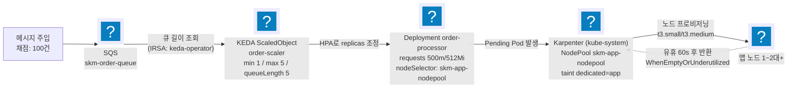
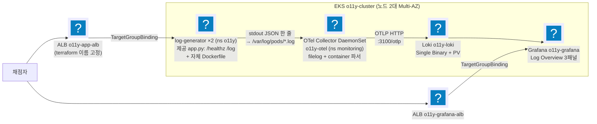
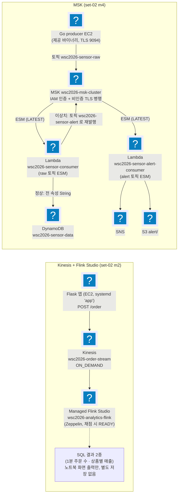

import { Quiz, QuizResults } from 'starlight-quiz/components';

> 문서 유형: explanation

유형 3·4는 실습까지, 유형 5는 아키텍처 이해와 채점 항목 대조까지 한다(배포는 [Lab](/part-4/10-scaling-logging-streaming/lab/)에서 선택). 각 유형은 ① 도식 ② 언제 나오나 ③ 핵심 연결 고리 ④ 채점이 보는 상태 ⑤ 퀴즈 순서다.

---

## 유형 3 — 이벤트 기반 오토스케일링 (SQS → KEDA → Karpenter)

실측 근거: set-07 task-2 module-3 (ap-northeast-2, skm- 접두어) — 2026-07-31 실채점에서 `mark3.sh` 전 항목(3-1~3-7) 통과 확정

### ① 도식

2단 스케일링: 큐 길이가 Pod 수를 늘리고(KEDA), Pod가 노드에 안 들어가면 노드가 늘어난다(Karpenter). 축소도 2단: 큐가 비면 Pod 1로, 노드가 비면 1대로.

### ② 언제 이 패턴이 나오나

- 과제지에 "메시지 폭주 시 자동 확장", "KEDA", "Karpenter", "큐 길이 기반 스케일링", "유휴 시 노드 반환" 키워드.
- 채점이 "메시지 N건 주입 → 관찰 → purge → 관찰"의 부하 시나리오 구조면 확정.

### ③ 핵심 연결 고리

1. **queueLength 5 → 메시지 100건이면 목표 Pod 20이지만 max 5로 캡** — 그래서 채점 기대가 "Pod ≥ 5".
2. **Pod requests 500m × 5 = 2.5 vCPU > t3.medium allocatable ~1.9 vCPU** → 한 대에 다 못 들어가 Pending 발생 → Karpenter가 2대째를 띄운다. 채점 기대 "Node ≥ 2"는 이 계산에서 나온다. requests를 줄이면 노드가 안 늘어나 오답.

:::danger[스케일인 시간 예산 150초 — 어느 값도 늘리지 않는다]
HPA behavior `scaleDown.stabilizationWindowSeconds: 15` + `policies: Percent 100/15s`(기본 300초 → 15초) + NodePool `consolidateAfter: 60s`가 한 쌍. purge를 HPA sync(~15초)가 감지해 ~35초에 Pod 1, consolidateAfter 60초 뒤 ~140초에 노드 1로 수렴한다(실채점 확정). 기본값 300이면 Pod 축소만 5분이라 150초 창을 구조적으로 못 맞춘다. ScaledObject에 `pollingInterval`은 두지 않는다 — `minReplicaCount ≥ 1`이면 1→N 스케일링이 전부 HPA 자체 폴링이라 무효 필드고, KEDA 2.20 webhook이 경고를 낸다(당일 변경으로 min=0이 되면 재도입).
:::

4. **`identityOwner: operator`** — SQS 조회 자격증명을 keda-operator SA의 IRSA에서 가져온다. 앱 Pod의 권한과 무관.
5. **Karpenter 디스커버리 태그**: 서브넷은 `karpenter.sh/discovery: skm-eks-cluster` 태그(terraform이 부착), SG는 `aws:eks:cluster-name` 태그로 찾는다. 태그가 없으면 NodeClass가 서브넷/SG를 못 찾아 노드가 안 뜬다.
6. **NodePool taint `dedicated=app:NoSchedule`** + Deployment toleration + nodeSelector — 앱만 Karpenter 노드에, addon(KEDA·Karpenter 자신·coredns)은 addon 노드그룹에 격리.

### ④ 채점이 보는 상태

- 스케일아웃: 메시지 100건 주입 → 3분 관찰 → **Max Ready Pods ≥ 5 / Max App Nodes ≥ 2**.
- 스케일인: purge → 3분 관찰 → **Final Pods 1 / Final Nodes 1** (대기 최대 2.5분).
- **Deployment env는 리터럴 정확 3개만** (`AWS_REGION`, `SQS_QUEUE_URL`, `PROCESSING_TIME`) — 채점이 name=value로 정확 비교. valueFrom·추가 env 금지.
- 이름 정확 일치: `skm-order-queue`, `skm-eks-cluster`, `order-processor`, `order-scaler`, `skm-app-nodepool`, `skm-app-nodeclass`.
- **addon 노드 1대(t3.medium) 용량이 빠듯** — coredns 2 + KEDA 3 + Karpenter 1. Karpenter requests를 0.5 vCPU/512Mi로 낮춰 설치한다.
- **Karpenter는 `--set replicas=1`로 설치한다** — 차트 기본 2 + required podAntiAffinity(hostname) + 자기 NodePool 노드를 배제하는 nodeAffinity 때문에, 채점이 1/1/1로 고정한 addon 노드 1대에선 두 번째 Pod가 앉을 자리가 구조적으로 없어 `helm --wait`가 영원히 안 끝난다. 행 상태에서 중단하면 release가 `pending-upgrade`로 잠겨 재-upgrade가 막힌다 — `helm uninstall karpenter -n kube-system` 후 재설치.
- **KEDA Pod가 Pending이면 차트 tolerations 스키마부터** — addon 노드가 taint돼 있어 toleration 필요. 차트 버전에 따라 키가 바뀌므로 `helm show values kedacore/keda | grep -A3 tolerations`로 확인.

### ⑤ 퀴즈

<Quiz title="Node ≥ 2 가 나오는 계산">
채점 기대 "Max App Nodes ≥ 2"는 어떤 숫자 계산에서 나오나?

- [x] Pod requests 500m × 5 Pod = 2.5 vCPU > t3.medium allocatable ~1.9 vCPU → 한 대에 다 못 들어가 Pending 발생 → Karpenter가 2대째를 프로비저닝
- [ ] queueLength 5에 메시지 100건이면 목표 Pod가 20이고, 노드당 10 Pod씩 배치되어 2대가 된다
  > 목표 20은 ScaledObject `max 5`에서 캡된다. 실제로 뜨는 Pod는 5개이고, 노드 수는 Pod 수가 아니라 requests 합으로 결정된다.
- [ ] NodePool에 최소 노드 수 2가 설정돼 있어서
  > Karpenter NodePool에는 최소 노드 수 개념이 없다. 노드는 Pending Pod가 있을 때만 생긴다.
- [ ] Multi-AZ 요구가 있어 2개 AZ에 최소 1대씩 배치되기 때문
  > topologySpreadConstraints를 걸지 않았으므로 AZ 분산이 노드 수를 강제하지 않는다.

`requests`를 줄이면 5 Pod가 한 대에 다 들어가 노드가 안 늘어나고, "Node ≥ 2"가 깨진다. 이 채점 항목은 리소스 요청량으로 설계된 것이다.
</Quiz>

<Quiz title="scaleDown 기본 안정화 창">
HPA `behavior.scaleDown.stabilizationWindowSeconds`를 명시하지 않으면 기본값 [[300]] 초가 적용된다.

---

기본값이면 purge 후 Pod 5→1 축소만 5분 이상 걸려, 150초 창인 스케일인 채점(Final Pods 1 / Final Nodes 1)에 실패한다. 스케일인 시간 예산은 두 값이 한 쌍이다: HPA `scaleDown.stabilizationWindowSeconds: 15` + `Percent 100/15s`(기본 300 → 15)와 NodePool `consolidateAfter: 60s`. **어느 값도 늘리지 않는다.** 감지 하한은 ScaledObject 설정이 아니라 HPA sync 주기(~15초)다 — `pollingInterval`은 min ≥ 1이면 무효라 두지 않는다.
</Quiz>

<Quiz title="KEDA의 SQS 조회 자격증명">
KEDA가 `skm-order-queue`의 큐 길이를 폴링할 때 쓰는 자격증명은?

- [x] `identityOwner: operator` — keda-operator SA에 연결된 IRSA(skm-keda-policy)
- [ ] `identityOwner: workload` — 스케일 대상인 order-processor Pod의 SA IRSA
  > 대표 오개념. 큐를 읽는 주체는 앱 Pod가 아니라 KEDA 오퍼레이터다. workload로 두면 앱 SA에 SQS 권한이 없어 메트릭 조회가 실패하고 스케일아웃이 아예 일어나지 않는다.
- [ ] TriggerAuthentication에 Secret으로 넣은 액세스 키/시크릿
  > 정적 키는 최소권한·자격증명 관리 양쪽에서 감점 소지다. IRSA로 해결되는 문제다.
- [ ] 노드 인스턴스 프로파일(노드 역할)에 붙인 SQS 권한
  > 그 노드의 모든 Pod가 SQS 권한을 얻는다. 최소권한 위반이며 IRSA를 쓰는 이유가 사라진다.

SQS 조회 자격증명은 keda-operator SA의 IRSA에서 가져온다. 앱 Pod의 권한과는 무관하다.
</Quiz>

<Quiz title="Karpenter 디스커버리 태그">
Karpenter가 Pending Pod가 있는데도 노드를 아예 안 띄운다. 태그 관점에서 확인할 것을 **모두** 고르시오.

- [x] 서브넷의 `karpenter.sh/discovery: skm-eks-cluster` 태그
- [x] 보안 그룹의 `aws:eks:cluster-name` 태그
- [ ] 프로비저닝될 노드의 `karpenter.sh/nodepool` 라벨
  > 이건 Karpenter가 노드를 만든 **뒤에** 붙이는 결과 라벨이다. 디스커버리 입력이 아니다.
- [ ] 서브넷의 `kubernetes.io/role/internal-elb` 태그
  > LBC가 내부 ALB 서브넷을 고를 때 쓰는 태그다. Karpenter의 NodeClass 디스커버리와는 무관하다.

NodeClass의 `selectorTerms`가 이 태그들로 서브넷·SG를 찾는다. 태그가 없으면 NodeClass가 대상을 못 찾아 노드가 생성되지 않는다. 서브넷 태그는 terraform이 부착한다.
</Quiz>

<Quiz title="Deployment env 정확 3개">
Deployment `order-processor`에 configMapRef나 valueFrom으로 env를 하나 더 얹으면?

- [x] 채점이 env를 name=value로 정확 비교하므로 리터럴 3개(`AWS_REGION`, `SQS_QUEUE_URL`, `PROCESSING_TIME`) 외에 무엇이든 추가되면 오답이다
- [ ] `AWS_REGION`을 valueFrom의 fieldRef로 바꿔도 최종 값이 같으니 통과한다
  > 비교 대상은 컨테이너 스펙의 리터럴 name=value다. valueFrom은 값이 스펙에 없으므로 불일치로 잡힌다.
- [ ] 추가된 env는 비교 대상 밖이라 무시되고 3개만 대조된다
  > 정확 비교이므로 개수 초과도 불일치다.
- [ ] Pod가 정상 기동하면 스케일링 채점만 통과하면 되므로 env는 영향이 없다
  > env는 스케일링과 별개의 채점 항목이다.

리터럴 3개만 둔다. valueFrom·envFrom·추가 env 모두 금지다. 이름도 정확 일치 대상이다: `skm-order-queue`, `skm-eks-cluster`, `order-processor`, `order-scaler`, `skm-app-nodepool`, `skm-app-nodeclass`.
</Quiz>

<QuizResults confetti />

---

## 유형 4 — 컨테이너 로깅 파이프라인 (OTel → Loki → Grafana)

근거: set-07 task-2 module-4 (ap-northeast-1, o11y- 접두어) — **정답지 구현은 미착수**다. 아래는 과제지·채점지(`mark4.sh`) 기반 설계안이라, 이 유형만은 수치·차트 버전이 실측 전이다.

### ① 도식

### ② 언제 이 패턴이 나오나

- "컨테이너 로그 수집", "OpenTelemetry", "Loki", "Grafana 대시보드", "레벨별 로그 집계" 키워드.
- ALB/TG **이름**이 채점 대상이면 LBC Ingress(이름 지정 불가) 대신 terraform ALB + TargetGroupBinding 패턴 확정.

### ③ 핵심 연결 고리

1. **제공 Dockerfile 결함** — flask 미설치 + requirements.txt 없음 → 그대로 빌드하면 CrashLoop. **자체 Dockerfile로 빌드하되 제공 app.py는 수정 금지.** (대회 당일 제공본이 수정돼 있으면 제공본 우선.)
2. **filelog `container` 파서 체인**: `/var/log/pods/*/*/*.log` 수집 → container 파서가 CRI 포맷(타임스탬프/스트림 접두어)을 분해하고 **파일 경로에서 k8s.namespace.name/pod.name/pod.uid를 리소스 속성으로 추출** → **body는 앱이 찍은 원본 JSON 한 줄 그대로** 유지. 본문을 가공하면 Loki에서 `| json` 파싱이 깨진다.
3. **Loki OTLP 인제스트**: exporter `otlphttp` → `http://o11y-loki...:3100/otlp`. Loki 3.x가 `k8s.namespace.name` 리소스 속성을 인덱스 라벨 `k8s_namespace_name`으로 **자동 승격** — 채점 LogQL `{k8s_namespace_name="o11y"}`와 정확히 맞물린다.
4. **자기 로그 exclude** — 콜렉터 자신의 로그(`monitoring_o11y-otel*`)를 수집에서 제외해 루프 방지.
5. **ALB/TG는 terraform으로 이름 고정 + TargetGroupBinding으로 Pod 연결.** TGB는 CRD라 **LBC 설치 이후에만 apply 가능** — 순서 의존.
6. **대시보드 쿼리**: `sum by (level) (...)` + legendFormat `{{level}}` — 범례가 INFO/WARN/ERROR로 떠야 한다. level 값은 **대문자 ERROR**.

### ④ 채점이 보는 상태

- 리소스 조회: `log-generator` 2 replica(o11y), ds `o11y-otel`, svc `o11y-loki` ClusterIP 3100, deploy `o11y-grafana` — 이름·네임스페이스 정확 일치.
- LogQL 채점: `{k8s_namespace_name="o11y"} | json | level="ERROR"`가 결과를 반환해야 함.
- **Grafana는 웹 수동 채점 항목 존재** — 로그인/Datasource/Log Overview 3패널.

:::caution[No Data 패널이 하나라도 있으면 오답]
채점 전 `/log?level=info`, `/log?level=warn`, `/log?level=error`를 각각 호출해 3레벨 데이터를 미리 만든다.
:::

- 범례가 `{level="ERROR"}` 형태면 오답 — legendFormat `{{level}}` 유지.
- ALB 타깃 healthy까지 1~2분 — 채점 직전 `curl /healthz`로 확인.

### ⑤ 퀴즈

<Quiz title="제공 Dockerfile 결함">
제공된 Dockerfile을 그대로 써서 log-generator를 빌드하면 어떻게 되고, 무엇을 지켜야 하나?

- [x] flask 미설치 + requirements.txt 없음 → Pod가 CrashLoop. 자체 Dockerfile로 빌드하되 제공 `app.py`는 수정 금지(당일 제공본이 고쳐져 있으면 제공본 우선)
- [ ] `app.py` 상단에 `pip install flask`를 실행하는 코드를 넣어 런타임에 설치한다
  > 제공 `app.py`는 수정 금지 대상이다. 결함은 Dockerfile 쪽에서 고친다.
- [ ] requirements.txt만 추가하면 제공 Dockerfile이 자동으로 설치한다
  > 제공 Dockerfile에는 `pip install -r requirements.txt` 단계 자체가 없다. 파일만 추가해도 설치되지 않는다.
- [ ] 베이스 이미지를 `python:slim`으로 바꾸면 flask가 포함되어 해결된다

고치는 곳과 건드리면 안 되는 곳을 구분하는 문제다. Dockerfile은 자체 작성, `app.py`는 원본 유지.
</Quiz>

<Quiz title="k8s_namespace_name 라벨의 출처">
채점 LogQL이 `{k8s_namespace_name="o11y"}`로 조회된다. 이 라벨이 존재하게 만드는 메커니즘을 **모두** 고르시오.

- [x] filelog의 `container` 파서가 파일 경로에서 `k8s.namespace.name`을 리소스 속성으로 추출
- [x] Loki 3.x의 OTLP 인제스트가 그 리소스 속성을 인덱스 라벨 `k8s_namespace_name`으로 자동 승격
- [ ] otlphttp exporter의 `resource_to_telemetry_conversion`이 리소스 속성을 라벨로 변환
  > Loki 쪽 자동 승격으로 이미 해결된다. 이 옵션은 메트릭 파이프라인의 설정이다.
- [ ] Grafana 데이터소스의 derived field가 점(`.`)을 밑줄(`_`)로 치환

OTel 쪽 추출과 Loki 쪽 승격의 **합작**이다. 둘 중 하나라도 빠지면 채점 쿼리의 라벨 셀렉터가 아무것도 반환하지 않는다.
</Quiz>

<Quiz title="본문에 파서를 더 얹으면">
OTel filelog 파이프라인에서 로그 본문(body)에 파서를 하나 더 얹어 필드를 추출하면 왜 위험한가?

- [x] body의 원본 JSON 한 줄이 변형되면 채점 쿼리의 `| json` 파싱이 깨진다 — `container` 파서 외 본문 변형 금지
- [ ] 추출된 필드가 Loki에서 인덱스 라벨로 자동 승격돼 카디널리티가 폭발한다
  > 자동 승격 대상은 **리소스 속성**이다. 로그 속성은 승격되지 않으므로 카디널리티 문제는 생기지 않는다. 진짜 문제는 body 훼손이다.
- [ ] 파서 체인이 길어져 콜렉터 CPU가 올라가 로그가 유실된다
  > 성능 이슈일 수는 있으나 채점이 깨지는 이유는 아니다.
- [ ] level 값이 소문자로 정규화되어 `level="ERROR"` 조건에 걸리지 않는다

`container` 파서는 CRI 포맷(타임스탬프/스트림 접두어)을 벗기고 파일 경로에서 k8s 메타데이터를 뽑는 데까지만 관여하고, **body는 앱이 찍은 원본 JSON 한 줄 그대로** 남긴다. Loki에서 `| json`이 그 원본을 파싱한다.
</Quiz>

<Quiz title="TargetGroupBinding apply 실패">
`TargetGroupBinding` apply가 실패한다. 순서 관점에서 원인은?

- [x] TGB는 LBC(AWS Load Balancer Controller)가 제공하는 CRD라서, LBC helm 설치 전에는 CRD가 없어 apply할 수 없다
- [ ] terraform이 ALB/TG를 아직 만들지 않아 참조할 ARN이 없어서
  > 그것도 순서 문제지만 오류 메시지가 다르다. `no matches for kind "TargetGroupBinding"`은 리소스 타입 자체가 없다는 뜻, 즉 CRD 부재 신호다.
- [ ] 대상 Pod가 아직 Ready가 아니라 타깃 등록이 되지 않아서
  > TGB apply 자체는 성공하고, 타깃이 unhealthy로 남을 뿐이다.
- [ ] TGB는 클러스터 스코프 리소스라 네임스페이스를 지정하면 실패해서

순서 의존: LBC helm 설치 → CRD 등록 → TGB apply. ALB/TG 이름이 채점 대상이므로 LBC Ingress(이름 지정 불가) 대신 terraform ALB + TGB 패턴을 쓰는데, 그 대가가 이 순서 제약이다.
</Quiz>

<Quiz title="No Data 패널">
Grafana Log Overview의 패널 하나가 No Data다. 코드 수정 없이 통과시키는 방법은?

- [x] 해당 레벨로 `/log?level=...`를 호출해 데이터를 만든 뒤 채점받는다 — info/warn/error 3레벨을 모두 미리 호출해 두는 것이 정석
- [ ] 패널의 시간 범위를 24시간으로 늘려 과거 데이터를 잡는다
  > 그 레벨의 로그가 애초에 생성된 적이 없으면 범위를 늘려도 없다.
- [ ] legendFormat을 `{level="ERROR"}` 형태로 바꾸면 표시된다
  > 범례 형식은 No Data와 무관하고, 오히려 그 형태로 뜨면 그 자체가 오답이다. legendFormat은 `{{level}}`을 유지한다.
- [ ] No Data 패널을 삭제해 감점을 피한다
  > Log Overview는 3패널 요구다. 삭제하면 패널 누락으로 오답이다.

Grafana는 웹 수동 채점 항목이 있고, **No Data 패널이 하나라도 있으면 오답**이다. 채점 전 3레벨 데이터를 미리 만들어 두고, ALB 타깃이 healthy인지도 `curl /healthz`로 확인한다. level 값은 **대문자 ERROR**다.
</Quiz>

<QuizResults confetti />

---

## 유형 5 — 스트리밍 (Kinesis + Flink Studio / MSK) — 아키텍처 + :badge[함정]{variant=danger} 대조

실측 근거: set-02 task-2 module-2(Flink Studio), module-4(MSK). 후보 세트에 포함돼 있어 출제 가능성이 있다 — 배포하지 않아도 아래 아키텍처·채점 항목·함정을 정답지 코드와 대조해 두면 학습 목표를 채울 수 있다. 실제 배포 절차(선택)는 [Lab Part C](/part-4/10-scaling-logging-streaming/lab/)에 있다.

### ① 도식

### ② 언제 이 패턴이 나오나

- "실시간 스트리밍", "Kinesis", "Flink/Zeppelin 노트북 SQL 분석", "MSK/Kafka", "Lambda 컨슈머" 키워드.
- Flink "애플리케이션 프로그래밍 금지" 조건이 있으면 Studio Notebook(Zeppelin) 확정.

### ③ 핵심 연결 고리 — Kinesis + Flink Studio

1. **Flink Studio는 terraform provider 미지원** (`aws_kinesisanalyticsv2_application`이 zeppelin 설정 블록 미지원) → **`aws_cloudformation_stack`으로 래핑**해 생성.
2. **Kinesis SQL 커넥터를 Maven 의존성으로 명시 주입** — 콘솔 위저드는 자동 추가하지만 bare CFN은 아니라서 `Could not find any factory for identifier 'kinesis'` 발생. `CustomArtifactsConfiguration`에 `flink-sql-connector-kinesis:1.15.4`. 커넥터 변경 후엔 노트북을 새 세션으로.
3. **bare timestamp 파싱 우회**: 프로듀서가 `2026-07-13 08:10:51`(T/Z 없음)을 보낸다. TIMESTAMP_LTZ로 직접 파싱하면 DateTimeParseException, TIMESTAMP(3)로 파싱하면 CURRENT_TIMESTAMP 비교에서 Incomparable types → **베이스 테이블은 `TIMESTAMP(3)`로 파싱, 뷰에서 `TIMESTAMP_LTZ(3)`로 CAST**해 둘 다 우회.
4. **`%flink.conf parallelism.default 1`을 반드시 첫 문단에** — 인터프리터 기동 전에만 적용된다. shard보다 서브태스크가 많으면 나는 `ShardConsumer RejectedExecutionException` 원천 차단. 세션이 망가지면 인터프리터 재시작.
5. **Flink 역할 Glue 권한은 카탈로그 전체**(`database/*`, `table/*/*`) — Zeppelin이 hive/default DB도 GetDatabase로 탐침해서 좁히면 AccessDenied.
6. **SQL 결과는 노트북 화면에 표시될 뿐 어디에도 저장되지 않는다** — 두 `%flink.ssql(type=update)` 쿼리에 sink 커넥터를 두지 않았다. task.md는 "쿼리가 정상 실행"만 요구하고, mark 2-4도 애플리케이션 상태(`READY`/`ZEPPELIN-FLINK-3_0`)만 볼 뿐 쿼리 실행 결과는 채점하지 않는다 — 그래도 Run 상태에서 두 쿼리가 성공하는 시연 자체는 과제지 요구라 생략할 수 없다.

### ③′ 핵심 연결 고리 — MSK

프로듀서는 Go 바이너리 EC2 하나, 컨슈머는 Lambda 둘이다 — `wsc2026-sensor-consumer`가 raw 토픽을, `wsc2026-sensor-alert-consumer`가 alert 토픽을 각각 별도 ESM으로 구독한다. 이상치는 sensor-consumer가 alert 토픽에 다시 발행해 alert-consumer로 넘어간다(위 도식의 루프백).

1. **MSK 클러스터 생성 ~30분** — EC2 user_data가 브로커 주소를 참조하므로 클러스터 ACTIVE 후 부팅. `-target`으로 EC2 먼저 만들지 말 것.
2. **제공 producer 바이너리는 SASL/IAM 불가** → 클러스터를 **IAM 인증 + 비인증 TLS(9094) 병행**으로 구성해 mark(Sasl.Iam.Enabled=True만 확인)를 통과시키는 실측 경로. 9098을 주면 `unexpected EOF: broker appears to be expecting TLS`.
3. **DynamoDB 전 속성 String 저장** — mark가 `temperature.S`/`status.S`를 조회한다. Number(`.N`)로 저장하면 0점.
4. **Lambda 런타임 python3.14 정확 일치** (aws provider 6.21+ 필요).
5. **ESM `starting_position = LATEST`** — 재배포 시 백로그 재처리 폭주 방지.
6. **MSK SG 셀프 참조 인바운드** — ESM 폴러 ENI가 클러스터 서브넷에서 브로커와 통신하는 데 필수.
7. **env 이름은 제공 문서 원문 그대로**: producer `BOOTSTRAP_SERVERS`(복수) / consumer `BOOTSTRAP_SERVER`(단수).

### ④ 채점이 보는 상태

**Kinesis + Flink (mark 2-1~2-6)**

- 2-1 EC2 서브넷: `analytics-priv-a`(Name 태그 정확 일치).
- 2-2 ALB: 리스너 `80`/`HTTP`, TG `wsc2026-analytics-tg`/`5000`.
- 2-3-A Kinesis: `wsc2026-order-stream` / `ACTIVE` / `ON_DEMAND`.
- 2-3-B `POST /order` 응답 JSON의 5개 필드(`event_time`·`order_id`·`price`·`product_name`·`quantity`)가 전부 채워져야 한다.
- 2-5 `GET /health` → `{"status":"healthy"}` 정확 일치(대소문자 포함).
- 2-6 systemd `app` 유닛이 SSM 명령으로 `active`/`enabled` 둘 다 나와야 한다.

:::caution[채점 직전 Flink 상태는 READY]
`wsc2026-analytics-flink`가 **READY** / `ZEPPELIN-FLINK-3_0`이어야 한다(mark 2-4) — 시연(Run→RUNNING) 후 **반드시 Stop**해 READY로 복귀. RUNNING이면 오답. DDL은 Glue DB에 저장돼 Stop해도 유지된다. task.md가 "Flink 1.19"라 해도 mark가 `ZEPPELIN-FLINK-3_0`을 채점하면 **mark 우선**.
:::

**MSK (mark 4-1~4-5-B)**

- 4-1 DynamoDB `wsc2026-sensor-data`(PK `sensorId`/SK `timestamp`) + S3 `wsc2026-sensor-alert-bucket-<비번호>` head-bucket 성공.
- 4-2 Lambda `wsc2026-sensor-consumer`·`wsc2026-sensor-alert-consumer` 둘 다 런타임 `python3.14` 정확 일치.
- 4-3 MSK `wsc2026-msk-cluster` / `ACTIVE` / `3.6.0` / `kafka.t3.small` / `Sasl.Iam.Enabled` **`True`**.
- 4-4 두 Lambda의 이벤트 소스 매핑 상태가 **모두** `Enabled`.
- 4-5-A DynamoDB 스캔 결과가 `temperature.S`/`status.S`로 조회(문자열 저장 확인).
- 4-5-B `timestamp`가 `YYYY-MM-DDTHH:mm:ss±HH:mm` 형식(producer가 계속 돌고 있다는 증거).
- 이름 오타도 원문 유지: `wsc2026-alaytics-ec2-role`(과제지 오타) — 고치면 오답.

### ⑤ 퀴즈

<Quiz title="Flink Studio를 terraform으로">
Managed Flink Studio(`wsc2026-analytics-flink`)를 terraform으로 만들려면?

- [x] `aws_cloudformation_stack`으로 래핑해 생성한다 — provider의 `aws_kinesisanalyticsv2_application`이 zeppelin 설정 블록을 지원하지 않기 때문
- [ ] `aws_kinesisanalyticsv2_application`의 `application_configuration`에 zeppelin 블록을 넣는다
  > 바로 그 블록이 provider에 없어서 CFN 래핑이 필요한 것이다.
- [ ] 콘솔 위저드로 만든 뒤 `terraform import`로 state에 가져온다
  > 위저드가 자동 주입하는 커스텀 아티팩트(커넥터)까지 state로 재현되지 않아 재생성이 불가능해진다.
- [ ] v1 리소스인 `aws_kinesisanalytics_application`을 쓴다
  > v1은 SQL 애플리케이션용이다. Studio(Zeppelin) 노트북이 아니다.

provider 미지원 기능을 CFN 스택으로 우회하는 전형적인 패턴이다. 채점은 런타임 `ZEPPELIN-FLINK-3_0`을 본다.
</Quiz>

<Quiz title="factory for identifier 'kinesis'">
Zeppelin에서 `Could not find any factory for identifier 'kinesis'` 오류가 났다. 원인과 해법은?

- [x] bare CFN으로 만든 애플리케이션에는 Kinesis SQL 커넥터가 없다 — `CustomArtifactsConfiguration`에 Maven 의존성 `flink-sql-connector-kinesis:1.15.4`를 주입하고, 변경 후에는 노트북을 새 세션으로 시작한다
- [ ] Flink 실행 역할에 `kinesis:GetRecords` 권한이 없어서
  > 권한 문제라면 `AccessDenied` 계열 오류가 난다. factory 없음은 클래스패스에 커넥터 JAR이 없다는 뜻이다.
- [ ] 스트림이 ON_DEMAND 모드라 SQL 커넥터가 프로비저닝 모드만 지원해서
  > 커넥터는 용량 모드를 가리지 않는다.
- [ ] `%flink.ssql` 대신 `%flink` 인터프리터로 실행해서

콘솔 위저드는 커넥터를 자동 추가하지만 bare CFN은 아니다. 커넥터를 바꾼 뒤 기존 세션에 그대로 실행하면 여전히 실패하므로, 반드시 새 세션에서 확인한다.
</Quiz>

<Quiz title="채점 직전 Flink 상태">
시연(Run)을 마친 뒤 채점 직전 Flink Studio 애플리케이션의 상태는 [[READY]] 여야 한다.

---

RUNNING이면 오답이므로 시연 후 반드시 Stop해 복귀시킨다. 시연 결과인 DDL(`CREATE TABLE` / `CREATE VIEW`)은 **Glue DB에 저장되므로 Stop해도 사라지지 않는다** — 안심하고 멈춰도 된다. 런타임은 `ZEPPELIN-FLINK-3_0`이며, task.md가 "Flink 1.19"라고 적혀 있어도 mark가 `ZEPPELIN-FLINK-3_0`을 채점하면 **mark 우선**이다.
</Quiz>

<Quiz title="DynamoDB 속성 타입">
MSK 모듈에서 Lambda consumer가 `temperature`를 Number 타입으로 저장하면?

- [x] mark가 `temperature.S`(String)를 조회하므로 값이 안 잡혀 0점 — 전 속성을 String으로 저장해야 한다
- [ ] DynamoDB가 Number 타입을 거부해 put-item 자체가 실패한다
  > 저장은 정상적으로 성공한다. 그래서 더 발견하기 어렵다 — 테이블에 항목은 있는데 채점만 0점이다.
- [ ] 숫자 비교 방식이 달라져 이상치 판정이 뒤집히고 SNS 알림이 잘못 나간다
  > 이상치 판정은 Lambda 코드 안에서 끝난다. 저장 타입과 무관하다.
- [ ] 문제없다 — mark는 속성 값만 비교한다
  > mark는 `.S` / `.N` 타입 접두어까지 포함된 경로로 조회한다.

`temperature.S` / `status.S`로 조회한다는 사실이 곧 "전 속성 String 저장" 요구다.
</Quiz>

<Quiz title="%flink.conf가 안 먹을 때">
`%flink.conf parallelism.default 1`을 넣었는데 적용되지 않는다. 원인과 대처는?

- [x] 인터프리터가 이미 기동된 세션에서는 `%flink.conf`가 적용되지 않는다 — 인터프리터를 재시작한 뒤 **첫 문단**으로 실행한다
- [ ] parallelism은 shard 수에 맞춰 자동 조정되므로 설정이 무시된다
  > 자동으로 맞춰지지 않기 때문에 `ShardConsumer RejectedExecutionException`이 나는 것이다.
- [ ] `%flink.conf`는 노트북이 아니라 애플리케이션의 `PropertyGroups`에만 넣을 수 있다
  > 노트북 첫 문단이 정상적인 위치다. 문제는 위치가 아니라 시점(인터프리터 기동 전/후)이다.
- [ ] Stop → Start 하면 노트북 문단이 초기화되므로 매번 다시 입력해야 한다

`%flink.conf`는 인터프리터 기동 **전에만** 적용된다. shard보다 서브태스크가 많을 때 나는 `ShardConsumer RejectedExecutionException`을 원천 차단하는 설정이므로, 세션이 망가졌으면 인터프리터를 재시작하고 처음부터 다시 실행한다.
</Quiz>

<Quiz title="브로커 env 이름">
제공 문서 원문 그대로 따라야 한다. producer는 `BOOTSTRAP_SERVERS`(복수)이고, consumer의 환경변수 이름은 [[BOOTSTRAP_SERVER]](단수)다.

---

한 글자 차이지만 통일하거나 "고쳐주면" 동작이 깨진다. 이름을 원문 그대로 유지하는 원칙은 과제지 오타에도 그대로 적용된다 — set-02의 `wsc2026-alaytics-ec2-role`(alaytics)을 고치면 이름 정확 일치 채점에서 오답이다.
</Quiz>

<Quiz title="bare 타임스탬프와 TIMESTAMP_LTZ">
프로듀서가 보내는 `event_time`은 `2026-07-13 08:10:51`처럼 `T`/`Z`가 없는 bare 문자열이다. 베이스 테이블 컬럼을 곧장 `TIMESTAMP_LTZ(3)`로 파싱하면 나는 오류와 실측 해법은?

- [x] `DateTimeParseException`이 난다(JSON SQL 포맷이 `TIMESTAMP_LTZ`엔 끝에 리터럴 `Z`를 요구) — 베이스 테이블은 `TIMESTAMP(3)`로 파싱하고, `CURRENT_TIMESTAMP`와 비교할 뷰에서만 `TIMESTAMP_LTZ(3)`로 CAST한다
- [ ] `Incomparable types` 오류가 나므로 `CURRENT_TIMESTAMP` 대신 다른 함수를 쓴다
  > `Incomparable types`는 반대 경우(TIMESTAMP(3)로 파싱한 컬럼을 TIMESTAMP_LTZ인 CURRENT_TIMESTAMP와 바로 비교할 때) 나는 오류다. 해법은 비교 함수를 바꾸는 게 아니라 뷰에서 CAST하는 것이다.
- [ ] 프로듀서(EC2 user_data가 그대로 주입하는 app.py)의 시간 포맷 문자열에 `Z`를 추가해 재배포한다
  > app.py는 제공 원본을 그대로 주입한다(수정 금지, ec2.tf 주석). 프로듀서를 고치지 않고 SQL 레이어에서 두 예외를 동시에 흡수하는 것이 실측 경로다.
- [ ] `json.timestamp-format.standard`를 `ISO-8601`로 바꾼다
  > 포맷을 바꾸면 프로듀서가 실제로 보내는 bare 문자열과 어긋나 오히려 파싱이 깨진다.

베이스 테이블 `TIMESTAMP(3)` 파싱 + 뷰 `TIMESTAMP_LTZ(3)` CAST 조합이 두 예외를 동시에 피하는 유일한 경로다. 과제 쿼리 원문(`FROM order_stream`, `event_time > CURRENT_TIMESTAMP`)은 그대로 유지된다.
</Quiz>

<Quiz title="Flink 역할의 Glue 권한 범위">
Flink 서비스 역할의 Glue 권한을 `wsc2026_analytics_db` 하나로만 좁히면 Zeppelin에서 무슨 일이 나나?

- [x] `hive`/`default` 등 다른 DB 조회에서 `glue:GetDatabase` **AccessDenied**가 난다 — Zeppelin이 SQL 플래닝 시 다른 카탈로그 DB 존재 여부까지 탐침하므로, 권한은 `database/*`·`table/*/*` 전체로 부여해야 한다
- [ ] `wsc2026_analytics_db` 안의 테이블 조회까지 막혀 CREATE TABLE 자체가 실패한다
  > 대상 DB 자체에 대한 권한은 있으므로 그 안의 CREATE TABLE/VIEW는 성공한다. 실패는 그 DB *밖*을 탐침할 때 난다.
- [ ] Kinesis 커넥터 로딩이 막혀 `Could not find any factory` 오류가 재현된다
  > 그 오류는 Maven 커넥터 미주입 문제이고 IAM 권한과는 별개다.
- [ ] 문제없다 — Glue 권한은 CREATE TABLE 시점에만 필요하고 이후 SELECT는 캐시된 스키마를 쓴다
  > SQL 플래닝은 쿼리를 실행할 때마다 카탈로그를 다시 탐침한다.

AWS Managed Flink Studio 문서가 권장하는 대로 카탈로그 전체(`catalog`/`database/*`/`table/*/*`) 스코프가 필요한 이유다.
</Quiz>

<Quiz title="MSK가 IAM과 비인증 TLS를 동시에 켜는 이유">
`wsc2026-msk-cluster`는 `client_authentication`에서 SASL/IAM과 비인증(`unauthenticated`)을 함께 켠다. mark 4-3이 실제로 확인하는 값과, 병행 구성이 필요한 이유는?

- [x] mark 4-3은 `Sasl.Iam.Enabled` **`True`** 한 값만 확인한다 — 하지만 제공 producer 바이너리(수정 금지)는 리버싱으로 확인한 결과 SASL 메커니즘 구현체·SigV4 서명 리터럴이 전부 0건이라 9098(IAM)로 못 붙는다. IAM은 채점용으로 켜두고, 실제 발행은 비인증 TLS(9094)로 병행한다
- [ ] MSK는 SASL/IAM 단독으로는 브로커를 띄울 수 없어 반드시 비인증을 함께 켜야 한다
  > MSK는 IAM 전용(`unauthenticated=false`) 구성도 정상 지원한다. 병행이 필요한 이유는 클러스터 제약이 아니라 제공 바이너리의 한계다.
- [ ] 비인증 TLS는 bastion의 kafka CLI 디버깅 전용이고 producer는 어차피 IAM을 쓴다
  > 반대다. bastion의 kafka CLI는 9098(IAM)을 쓰고, producer가 실제로 붙는 경로가 9094(비인증 TLS)다.
- [ ] Lambda ESM이 비인증 클러스터에서만 자동 인증하므로 unauthenticated를 켜야 한다
  > ESM은 IAM 전용 클러스터에서도 함수 실행 역할로 자동 인증한다. 병행 이유와 무관하다.

과제지는 "IAM 인증을 통해서만 접근 가능해야 한다"고 요구하지만, mark는 `Sasl.Iam.Enabled=True`만 본다 — 이 간극이 병행 구성을 실측 정답으로 만든다.
</Quiz>

<Quiz title="MSK 보안 그룹 셀프 참조">
`wsc2026-msk-sg`에는 자기 자신을 참조하는 전체 허용 인바운드 규칙이 있다. 이 규칙을 지우면 가장 먼저 깨지는 것은?

- [x] Lambda MSK 트리거의 ESM 폴러 ENI — ESM은 클러스터 자신의 서브넷/SG를 그대로 써서 브로커를 폴링하므로, 셀프 참조가 없으면 폴러가 브로커에 닿지 못해 4-4·4-5 계열이 전멸한다
- [ ] producer EC2 → MSK 9094 TLS 연결
  > 그 경로는 producer SG를 참조하는 별도 규칙이 담당한다. 셀프 참조와 무관하다.
- [ ] bastion → MSK 9098 kafka CLI 접속
  > bastion도 자신의 SG를 참조하는 별도 인그레스 규칙으로 허용된다.
- [ ] alert-consumer Lambda → SNS/S3 호출
  > alert-consumer는 VPC 밖에 있어 MSK SG와 아예 무관하다 — 퍼블릭 엔드포인트로 직접 나간다.

브로커 간·ZooKeeper 통신과 ESM 폴러 ENI 통신이 전부 이 셀프 참조 규칙 하나로 묶여 있다.
</Quiz>

<QuizResults confetti />
