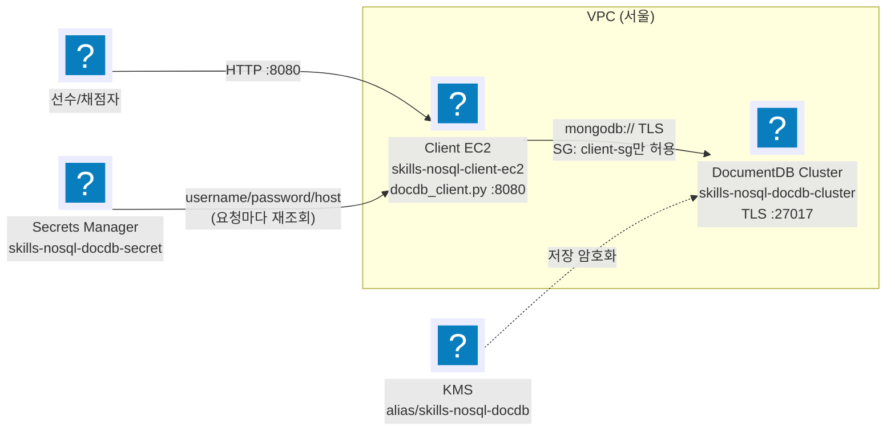

import { Quiz, QuizResults } from 'starlight-quiz/components';

> 문서 유형: explanation

이 모듈은 2과제 후보 **set-08 task-2 module-1**이다. 근거는 지급 코드 `docdb_client.py`와 문제지, 그리고 2026-08-01 정정본의 판정 기준이다 — 정답 Terraform은 `skills-2026`의 브랜치 `set-08/task-2`에 있다. Amazon DocumentDB가 무엇인지, DynamoDB와 무엇이 다른지, 왜 VPC 밖에서 접근할 수 없는지, 인덱스를 왜 직접 만들어야 하는지를 채점 관점에서 정리한다. 절차는 [lab](/part-4/11-documentdb/lab/)에서 다룬다.

---

## 1. DocumentDB란 — MongoDB 호환 문서 DB

Amazon DocumentDB는 MongoDB API와 호환되는 완전관리형 문서 데이터베이스다. 데이터를 JSON과 비슷한 BSON(Binary JSON) 문서로 저장하고, 문서들의 모음을 컬렉션이라 부른다. 관계형 테이블과 달리 컬렉션은 스키마를 강제하지 않는다 — 같은 컬렉션 안에서도 문서마다 필드 구성이 달라도 된다.

클러스터는 스토리지와 컴퓨트가 분리된 구조다. `skills-nosql-docdb-cluster`(클러스터 — 스토리지와 엔드포인트를 가짐)와 `skills-nosql-docdb-instance-1`(인스턴스 — `db.t3.medium` 컴퓨트)이 별개의 리소스로 존재하는 이유다. 채점도 이 둘을 `describe-db-clusters`·`describe-db-instances`로 각각 확인한다.

이 모듈이 저장하는 데이터는 `skills_retail` 데이터베이스 안의 `orders`(주문 8건 이상)·`products`(상품 6건 이상)·`sessions`(세션 3건 이상) 3개 컬렉션이다.

## 2. DynamoDB와 무엇이 다른가 — 문서 모델·인덱스·쿼리

PART-1에서 다룬 DynamoDB와 같은 "NoSQL"로 묶이지만 설계 방식은 다르다.

| 축 | DynamoDB | DocumentDB |
|---|---|---|
| 데이터 모델 | Item(속성 모음). 조회는 PK/SK 축 중심 | BSON Document. 중첩 구조를 그대로 쿼리 대상으로 삼는다 |
| 스키마 | 테이블 생성 시 PK(+SK) 고정, 나머지는 스키마리스 | 컬렉션 생성 시 스키마 지정이 없다 — 문서마다 필드 구성이 달라도 된다 |
| 인덱스 | GSI/LSI 설계를 테이블 설계와 함께 한다 | `createIndex()`로 언제든 추가. unique·복합·정렬 방향·TTL을 조합한다 |
| 쿼리 | `Query`(PK/SK 조건)·`Scan` 중심 | `find()` 연산자(`$gte`·`$lte`·`$in` 등)로 범위·복합 조건을 한 번에 표현 |
| 네트워크 | 서비스 엔드포인트(퍼블릭 또는 VPC 엔드포인트 선택) | 클러스터가 VPC 안에만 존재 — 퍼블릭 엔드포인트 자체가 없다 |
| 과금 | 온디맨드=요청 단위, 프로비저닝=용량 단위 | 인스턴스 시간 + 스토리지/IO — 서버리스가 아니다 |

:::note[실측 — 두 필드 비교는 어느 쪽도 기본 쿼리가 아니다]
`docdb_client.py`의 `low_stock()`은 `warehouseId`로 Mongo에서 문서를 가져온 뒤, `stock <= reorderPoint`(같은 문서의 두 필드 비교)는 **Python 코드로** 걸러낸다. MongoDB 계열 `find()`도 이런 필드 간 비교는 `$expr`가 있어야 하고, DynamoDB `FilterExpression`도 속성-상수 비교가 기본이라 속성끼리 비교는 매끄럽지 않다. `{warehouseId:1, stock:1}` 인덱스는 후보를 정렬해 가져오는 역할까지만 하고, 최종 판단은 애플리케이션이 한다.
:::

## 3. 네트워크 — VPC 안에서만 접근 가능

DocumentDB 클러스터는 VPC 밖으로 나가는 퍼블릭 엔드포인트 자체가 없다. 문제지 3-1의 "DocumentDB Cluster: 외부 직접 노출 금지"는 별도 설정이 아니라 **기본 동작**이다 — DocumentDB에 퍼블릭 액세스 옵션 자체가 없으므로, 아무 설정도 켜지 않으면 이미 만족된다. 진짜로 통제해야 할 대상은 보안 그룹이다: `27017` 포트를 Client EC2의 보안 그룹에서 오는 트래픽만 허용하고, 그 외에는 열지 않는다.

반대로 Client EC2는 채점기가 접근해야 하므로 Public IP와 `TCP/8080` 인바운드가 필요하다. "공개 앱 계층 + 비공개 데이터 계층"이라는 동일한 패턴은 [vpc-basics](/start/vpc-basics/)에서 이미 다뤘다.

TLS는 새 클러스터의 기본값이다(클러스터 파라미터 그룹의 `tls` 로 끌 수는 있지만 대회에서 그럴 이유가 없다). 켜져 있는 이상 클라이언트는 서버 인증서를 검증할 CA 번들(`global-bundle.pem`)을 갖고 있어야 한다. `docdb_client.py`의 `mongo_client()`는 `tls=True`와 `tlsCAFile=CA_FILE`을 명시하고, 그 전에 `os.path.exists(CA_FILE)`부터 확인해 파일이 없으면 연결을 시도하지도 않고 즉시 실패한다.

## 4. Secrets Manager 연동

`docdb_client.py`는 자격 증명을 코드에 넣지 않고 Secrets Manager에서 읽는다. `get_secret()`은 `skills-nosql-docdb-secret`에서 `username`·`password`·`host` 3키를 꺼내고, 셋 중 하나라도 비어 있으면 `RuntimeError`를 던진다.

주목할 점 — `get_secret()`은 **요청마다 다시 호출된다.** `mongo_client()`가 API 요청 하나마다 새로 만들어지고, 그 안에서 매번 시크릿을 조회하고 매번 새 `MongoClient`를 생성한다. 연결도 자격 증명도 캐시하지 않는다. 그래서 Client EC2의 IAM 역할이 `secretsmanager:GetSecretValue` 권한을 계속 가지고 있어야 서비스가 살아 있다 — 권한을 나중에 회수하면 그 순간부터 모든 조회 API가 500을 반환한다.

:::danger[함정 — host 값에 스킴·포트를 넣으면 즉시 죽는다]
`mongo_client()`는 URI를 만들기 전에 `if "://" in host or ":" in host: raise RuntimeError(...)`로 먼저 검사한다. Secret의 `host`는 스킴도 포트도 없는 **순수 호스트명**이어야 한다. `describe-db-clusters`가 돌려주는 `Endpoint` 필드 값을 그대로 쓰면 안전하다.
:::

## 5. 인덱스 설계 — unique·복합·정렬 방향·TTL

`docdb_client.py`의 `indexes()`는 `list_indexes()`로 **존재하는** 인덱스를 나열만 한다 — 코드 어디에도 `create_index()` 호출이 없다. 문제지 3-3이 요구하는 인덱스는 전부 선수가 직접 만들어야 `/v1/admin/indexes` 채점을 통과한다. 인덱스 이름은 자유이고, 컬렉션·필드·정렬 방향·`unique`·TTL 옵션만 일치하면 된다.

| 컬렉션 | 인덱스 | 지원하는 조회 |
|---|---|---|
| `orders` | `{orderId: 1}` unique | `/v1/orders/{id}` 단건 조회 + 중복 주문 ID 방지 |
| `orders` | `{customerId: 1, createdAt: -1}` | `/v1/customers/{id}/orders` — 고객 필터 + 최신순 정렬을 인덱스 하나로 |
| `orders` | `{status: 1, dueAt: 1}` | `/v1/orders/pending?from=&to=` — 동등 조건(`status`) 다음에 범위 조건(`dueAt`) 순서로 설계 |
| `products` | `{productId: 1}` unique | 단건 조회 + 중복 방지 |
| `products` | `{warehouseId: 1, stock: 1}` | `/v1/products/low-stock` — 창고 필터 + 재고 오름차순 정렬 |
| `sessions` | `{sessionId: 1}` unique | 세션 중복 방지 |
| `sessions` | `{expiresAt: 1}` TTL `expireAfterSeconds: 0` | 문서에 저장된 시각이 곧 만료 시각 — 세션 자동 삭제 |
| `sessions` | `{customerId: 1, lastSeen: -1}` | 고객별 최근 세션 조회 |

TTL 인덱스의 `expireAfterSeconds: 0`은 "삽입 후 0초"가 아니다. `expiresAt` 필드에 저장된 값 자체를 만료 시각으로 쓰겠다는 뜻이다 — 그 시각이 지난 뒤 백그라운드 작업이 주기적으로 문서를 지운다. 반대로 흔한 TTL 패턴(생성 시각 필드에 `expireAfterSeconds: 3600` 같은 큰 값)은 "삽입 후 N초"를 뜻하는 다른 방식이다. `retail_dataset.json`의 `sessions.expiresAt`은 전부 미래 시각(`2026-12-0*`)이므로 지금 당장은 삭제되지 않는다.

:::caution[함정 — 날짜를 문자열로 적재하면 인덱스가 있어도 조회가 빈다]
`retail_dataset.json`의 날짜는 ISO 8601 문자열이다. `seed_data()`가 호출하는 `convert_dataset()`이 이 문자열을 `datetime` 객체로 바꾼 뒤 `insert_many()`에 넘겨야 BSON Date로 저장된다. 데이터 적재는 반드시 지급 코드의 `POST /v1/admin/seed`(또는 CLI `seed`)로 한다.

파일을 직접 `mongoimport`하면 날짜가 문자열로 들어간다. `/v1/admin/summary`의 `dateFieldTypes`가 `"str"`로 나오고, `status`+`dueAt` 범위 비교가 전부 빈 배열이 된다.
:::

## 자기 점검 퀴즈

<Quiz title="Secret의 host 값">
Secret `skills-nosql-docdb-secret`의 `host` 필드에 `mongodb://cluster-endpoint:27017`을 통째로 넣었다. `docdb_client.py`는 어떻게 반응하나?

- [x] `mongo_client()`가 `"://" in host or ":" in host`를 검사해 URI를 만들기도 전에 `RuntimeError`를 던진다 — 모든 조회 API가 500을 반환한다
- [ ] pymongo가 스킴과 포트를 알아서 무시하고 파싱한다
  > 코드가 그 파싱을 pymongo에 맡기지 않는다. `mongo_client()`는 URI를 만들기 전에 문자열 검사로 먼저 걸러 예외를 던진다.
- [ ] 포트가 중복 지정되어 TLS 핸드셰이크가 느려질 뿐 연결은 된다
  > 느려지는 게 아니라 함수가 URI를 만들기도 전에 `RuntimeError`로 죽는다. 연결 시도 자체가 없다.
- [ ] host 값은 애플리케이션이 아니라 Secrets Manager가 검사하므로 저장 시점에 거부된다
  > Secrets Manager는 문자열 값의 내용을 검사하지 않는다. 검사는 애플리케이션 코드 안에 있다.

Secret의 `host`는 스킴도 포트도 없는 순수 호스트명이어야 한다. `describe-db-clusters`의 `Endpoint` 필드 값을 그대로 쓰면 안전하다.
</Quiz>

<Quiz title="retail_dataset.json을 직접 mongoimport하면">
`POST /v1/admin/seed`를 쓰지 않고, 지급된 `retail_dataset.json`을 `mongoimport`로 바로 적재했다. 무엇이 깨지나?

- [x] 날짜가 ISO 문자열 그대로 들어가 BSON Date가 아닌 문자열 필드가 되고, `dateFieldTypes`가 `"str"`로 나오며 `pending` 범위 조회가 빈 배열이 된다
- [ ] mongoimport가 ISO 8601 문자열을 자동으로 BSON Date로 변환하므로 문제없다
  > 자동 변환은 Extended JSON의 `{"$date": "..."}` 형식일 때만 일어난다. 평범한 문자열은 문자열로 들어간다.
- [ ] 카운트가 안 맞아 `/v1/admin/summary`의 `counts`가 실패한다
  > 도큐먼트 개수 자체는 정상적으로 8/6/3이 들어간다. 깨지는 것은 타입이지 개수가 아니다.
- [ ] `_id` 충돌로 insert 자체가 실패한다
  > 데이터셋에 `_id` 필드가 없어 MongoDB가 자동 생성한다. 충돌은 나지 않는다.

지급된 `POST /v1/admin/seed`(`seed_data()`)는 `convert_dataset()`으로 문자열을 `datetime` 객체로 바꾼 뒤 넣는다. 데이터 적재는 반드시 이 경로로 한다.
</Quiz>

<Quiz title="/v1/admin/indexes가 _id_ 뿐이라면">
데이터를 다 적재했는데 `/v1/admin/indexes`가 각 컬렉션마다 기본 `_id_` 인덱스만 보여준다. 원인과 해결은?

- [x] `docdb_client.py`는 `list_indexes()`로 존재하는 인덱스를 나열만 할 뿐 만들지 않는다 — pymongo나 mongosh로 직접 `create_index()`를 실행해야 한다
- [ ] DocumentDB가 컬렉션 생성 시 문제지에 명시된 인덱스를 자동으로 만들어 주므로 시간이 더 필요할 뿐이다
  > DocumentDB는 `_id_` 외의 인덱스를 자동으로 만들지 않는다. 더 기다려도 늘지 않는다.
- [ ] `seed_data()`가 `insert_many()`를 호출할 때 스키마의 인덱스 힌트를 함께 적용한다
  > `insert_many()`는 인덱스와 무관하다. 인덱스는 컬렉션에 별도로 선언하는 오브젝트다.
- [ ] `/v1/admin/indexes` 응답은 캐시돼 있어 재조회하면 나타난다
  > 이 엔드포인트는 요청마다 `list_indexes()`를 새로 호출한다. 캐시가 없다.

문제지 3-3이 요구하는 인덱스 8개(orders 3·products 2·sessions 3)는 전부 선수가 직접 만든다. 이름은 자유, 컬렉션·필드·정렬 방향·`unique`·TTL 옵션만 일치하면 된다.
</Quiz>

<Quiz title="global-bundle.pem이 없을 때">
보안 그룹은 `27017`을 정확히 열어뒀지만 `/opt/skills-nosql/global-bundle.pem`을 올리는 걸 깜빡했다. 무슨 일이 일어나나?

- [x] `mongo_client()`가 `os.path.exists(CA_FILE)`을 먼저 확인해 `RuntimeError`를 던진다 — TLS 핸드셰이크는 시도조차 되지 않는다
- [ ] pymongo가 시스템 기본 CA 저장소로 대체 검증해 느리게라도 연결된다
  > DocumentDB 서버 인증서는 AWS 전용 CA가 서명한다. 시스템 기본 CA 저장소에는 이 체인이 없고, 코드가 파일 존재를 먼저 검사해 그 시도 자체를 막는다.
- [ ] `tls=True`만 있으면 CA 파일 없이도 서버 인증서를 무시하고 연결한다
  > `tls=True`는 서버 인증서를 검증하겠다는 뜻이다. 검증에 쓸 CA 파일이 없으면 코드가 미리 예외를 던진다.
- [ ] 보안 그룹이 27017을 열어뒀다면 CA 파일과 무관하게 TCP 연결은 성공하고 이후 쿼리만 실패한다
  > TCP 연결 자체는 될 수 있어도, 코드는 그 이전에 CA 파일 존재 여부부터 검사해 연결 시도를 막는다.

DocumentDB는 TLS가 기본이며, `global-bundle.pem`을 정확한 경로에 두지 않으면 접속 자체가 안 된다.
</Quiz>

<Quiz title="low-stock 조회를 DynamoDB로 그대로 옮기면">
`/v1/products/low-stock`은 같은 문서의 두 필드(`stock`·`reorderPoint`)를 비교한다. DynamoDB `FilterExpression`으로 옮기면 바로 동작할까?

- [x] 안 된다 — `FilterExpression`은 속성과 상수 비교가 기본이라 "같은 아이템의 두 속성끼리 비교"는 매끄럽지 않다. DocumentDB도 사실 기본 `find()`로는 안 되고 `$expr`가 필요한데, 지급 코드는 그마저 쓰지 않고 Mongo 조회 결과를 Python에서 다시 필터링한다
- [ ] DynamoDB `FilterExpression`에 `stock <= reorderPoint`를 속성명 그대로 넣으면 바로 동작한다
  > `FilterExpression`은 속성을 상수와 비교하는 문법이 기본이다. 다른 속성과 비교하려면 별도 표현식 문법이 필요해 기본 패턴이 아니다.
- [ ] DocumentDB의 `find()`가 두 필드 비교를 기본 지원하므로 지급 코드도 그렇게 짰다
  > `low_stock()`을 읽어 보면 `warehouseId`로만 Mongo 쿼리하고, `stock <= reorderPoint` 비교는 Python 코드로 순회하며 처리한다.
- [ ] GSI를 `reorderPoint`로 하나 더 만들면 DynamoDB에서도 한 번에 된다
  > GSI는 정렬·동등 조건에 쓰는 별도 키 축이다. "다른 속성과의 크기 비교" 자체를 GSI가 대신 계산해 주지는 않는다.

같은 문서의 두 필드를 비교하는 조회는 DynamoDB든 MongoDB 계열이든 기본 쿼리 문법만으로는 매끄럽지 않다. 지급된 `low_stock()`은 `{warehouseId, stock}` 인덱스로 후보를 정렬해 가져온 뒤 Python에서 최종 필터링하는 절충안을 쓴다.
</Quiz>

<Quiz title="expireAfterSeconds: 0의 의미">
`sessions`의 TTL 인덱스는 `{expiresAt: 1}`에 `expireAfterSeconds: 0`을 쓴다. "0초짜리 TTL이니 삽입하자마자 다 지워지는 것 아닌가?"

- [x] 아니다. `expireAfterSeconds: 0`은 "삽입 후 0초"가 아니라 "`expiresAt` 필드에 저장된 시각 자체를 만료 시각으로 쓴다"는 뜻이다 — 그 시각이 지난 뒤에야 백그라운드 작업이 삭제한다
- [ ] 삽입되자마자 0초 뒤에 즉시 삭제되므로 `sessions` 컬렉션은 항상 비어 있어야 정상이다
  > 그렇다면 `/v1/admin/summary`의 `counts.sessions`가 항상 0이어야 하는데 채점은 3건 이상 적재를 기대한다. `expiresAt` 필드 값 자체가 미래 시각이라 아직 만료되지 않는다.
- [ ] TTL 인덱스는 삭제가 아니라 조회에서 숨기는 기능이라 문서 개수는 그대로다
  > TTL 인덱스는 백그라운드 작업이 실제로 삭제를 실행한다. 숨김 처리가 아니다.
- [ ] `expireAfterSeconds: 0`은 TTL을 비활성화하는 값이다
  > 비활성화하려면 TTL 인덱스 자체를 만들지 않아야 한다. `0`은 "필드 값 = 만료 시각"이라는 유효한 특수값이다.

데이터셋의 `sessions.expiresAt`은 전부 미래 시각(`2026-12-0*`)이라 지금 당장은 삭제되지 않는다. `expireAfterSeconds: 0`은 절대 시각 기준 TTL이라는 것만 확인하면 된다.
</Quiz>

<QuizResults confetti />
