import { Quiz, QuizResults } from 'starlight-quiz/components';

> 문서 유형: explanation

2과제 set-08 task-2 module-2(Simplify Service Networking with VPC Lattice, **도쿄 ap-northeast-1**)를 다룬다. 참고 구현은 `skills-2026`의 브랜치 `set-08/task-2`, `set-08/task-2/module-2-lattice`에 있고, 항목별 판정 기준은 2026-08-01 정정본이 정본이다([정정 내역](/reference/errata/)). 정정본 2-4가 **Service EC2 보안 그룹의 TCP/8080 인바운드는 Lattice 관리형 프리픽스 리스트로만 열고 `0.0.0.0/0`이면 미충족**임을 명문화했다.

## 도식 — Client/Service VPC와 Lattice 경로

```mermaid
flowchart LR
    subgraph CVPC["<span class='icon--aws icon--aws--vpc'></span> Client VPC 10.61.0.0/16"]
        CEC2@{ icon: "logos:aws-ec2", form: "square", label: "skills-lattice-client-ec2<br/>client_app.py :80", pos: "b", h: 46, w: 46 }
    end
    ASG["Association SG<br/>80 ← 10.61.0.0/16"]
    SN["Service Network<br/>skills-lattice-sn"]
    SVC["Service<br/>skills-lattice-order-service<br/>Lattice 생성 도메인"]
    LSN["Listener<br/>skills-lattice-http-listener<br/>HTTP:80"]
    TG["Target Group<br/>skills-lattice-order-tg<br/>Instance · HTTP:8080 · /health"]
    subgraph SVPC["<span class='icon--aws icon--aws--vpc'></span> Service VPC 10.62.0.0/16"]
        SSG["Service EC2 SG<br/>8080 ← vpc-lattice<br/>프리픽스 리스트"]
        SEC2@{ icon: "logos:aws-ec2", form: "square", label: "skills-lattice-service-ec2<br/>service_app.py :8080", pos: "b", h: 46, w: 46 }
    end

    CEC2 -- "① SERVICE_URL 호출" --> ASG
    ASG -- "VPC Association" --> SN
    SN -- "Service Association" --> SVC
    SVC --> LSN
    LSN -- "Forward" --> TG
    TG -- "② 등록된 Target" --> SSG
    SSG --> SEC2
```

이 도식이 보여주는 것

두 VPC 가 IP 경로 없이 통신하는 구조다. 대역이 겹치든 말든 상관없고 피어링도 없다 — 클라이언트는 Lattice 가 발급한 DNS 이름을 부르고, Service Network 에 묶인 양쪽이 그 이름을 통해 만난다. 서비스 EC2 의 보안 그룹은 Lattice 관리형 프리픽스 리스트만 허용하므로, 트래픽이 실제로 Lattice 를 거쳐 들어온다는 것이 방화벽 수준에서 강제된다.

Client EC2는 Client VPC 안에서 Lattice가 생성한 도메인 이름을 호출한다. 그 요청은 Client VPC에 붙은 **VPC Association**을 거쳐 Service Network로 들어가고, Service → Listener → Target Group을 거쳐 Service VPC 안의 EC2로 전달된다. 이 경로 어디에도 두 VPC 사이의 IP 라우팅은 없다 — Target Group이 Service VPC를 `vpcIdentifier`로 지정할 뿐, Service VPC 자체는 Service Network에 Association 되지 않는다.

## Lattice가 대체하는 것

| 방식 | 연결 단위 | CIDR 겹침 | 전이성 | 계층 |
|---|---|---|---|---|
| VPC 피어링 | VPC 1:1 | 불가 | 없음 (A↔B, B↔C 있어도 A↔C 불가) | L3 라우팅 |
| Transit Gateway | 허브·스포크 | 불가 (어태치먼트는 되지만 경로가 전파되지 않는다) | 있음 (TGW RTB로 스포크 간 선택 허용) | L3 라우팅 |
| 내부 ALB/NLB + PrivateLink | 서비스 단위(Endpoint Service) | 무방 | 없음 — 서비스마다 개별 NLB·엔드포인트 구성 | L4/L7 프록시 |
| VPC Lattice | 서비스 네트워크(다대다) | 무방 | 있음 — 같은 Service Network에 묶인 VPC·서비스는 서로 접근 가능 | L7(HTTP/gRPC 인식) |

피어링·TGW가 CIDR 겹침에 막히는 이유는 라우팅 테이블에 상대 CIDR을 목적지로 올리기 때문이다(전이성·CIDR 제약의 근본 원리는 [vpc-basics](/start/vpc-basics/) 참고). PrivateLink(내부 ALB/NLB + VPC 엔드포인트)는 이미 CIDR 제약이 없는 L4/L7 방식이지만, 서비스마다 NLB와 엔드포인트 서비스를 개별로 만들어야 한다. Lattice는 그 구성을 Service Network 하나로 묶어 다대다로 확장한다 — VPC 여러 개, 서비스 여러 개가 같은 Service Network에 붙으면 서로 접근할 수 있다.

## 4계층 구조

Lattice 리소스는 네 계층으로 나뉜다. 이 모듈의 고정 이름을 계층에 그대로 대입하면 구조가 외워진다.

| 계층 | 역할 | 이 모듈의 고정 이름 |
|---|---|---|
| Service Network | VPC·Service를 묶는 가장 바깥 경계. VPC Association으로 "누가 부를 수 있는가"를, Service Association으로 "무엇을 부를 수 있는가"를 결정 | `skills-lattice-sn` |
| Service | 도메인 이름이 발급되는 단위. Listener를 담는다 | `skills-lattice-order-service` |
| Listener | 프로토콜·포트를 받아 Target Group으로 Forward | `skills-lattice-http-listener` (HTTP/80) |
| Target Group | 실제 트래픽을 받는 대상 목록 + 헬스 체크 | `skills-lattice-order-tg` (Instance · HTTP/8080 · `/health`) |

**VPC Association은 Client VPC에만 만든다.** Service VPC는 Target Group의 `vpcIdentifier`로만 연결되고 별도 Association이 없다 — Lattice가 Target Group 설정을 보고 Service VPC 안에 필요한 경로를 알아서 만든다. Client VPC를 Association 하는 이유는 그 VPC 안의 리소스(Client EC2)가 Lattice 생성 도메인을 **호출**해야 하기 때문이다. 호출하는 쪽만 Association이 필요하다.

## 관리형 프리픽스 리스트로 접근 제어

Service EC2의 보안 그룹은 8080 인바운드를 **AWS가 리전마다 관리하는 프리픽스 리스트**(`com.amazonaws.ap-northeast-1.vpc-lattice`)에서만 열어야 한다. 이 프리픽스 리스트는 Lattice의 데이터 플레인이 타깃에 접근할 때 실제로 쓰는 IP 대역을 담고 있고, `aws ec2 describe-managed-prefix-lists`로 조회해 ID(`pl-...`)를 얻는다.

:::danger[0.0.0.0/0은 동작하지만 미충족이다]
`0.0.0.0/0`으로 열어도 curl은 통과하고 헬스 체크도 healthy가 된다 — Lattice 트래픽도 결국 0.0.0.0/0에 포함되기 때문이다. 하지만 채점은 curl 결과가 아니라 `describe-security-groups`로 뽑은 **인바운드 규칙 JSON 원문**을 심사위원이 직접 읽는다. 소스가 프리픽스 리스트가 아니면 동작 여부와 무관하게 미충족이다.
:::

이 프리픽스 리스트 접근 제어는 Service EC2 쪽 SG의 역할이고, **VPC Association의 SG는 별개다.** Association SG는 Client VPC(`10.61.0.0/16`)에서 오는 TCP/80을 열어 클라이언트가 Lattice 생성 도메인에 닿게 한다.

이름이 비슷해 보여도 막는 지점이 다르다.

| SG | 통제하는 것 | 기준 |
|---|---|---|
| Service EC2 SG | 누가 타깃에 도달할 수 있는가 | 프리픽스 리스트 |
| VPC Association SG | 누가 Lattice 도메인을 호출할 수 있는가 | Client VPC CIDR |

## CIDR이 겹쳐도 되는 이유

Client VPC(`10.61.0.0/16`)와 Service VPC(`10.62.0.0/16`)는 겹치지 않지만, 겹쳤어도 이 아키텍처는 그대로 동작한다. 이유는 앞의 두 절을 합치면 나온다 — Client는 Lattice 도메인을 호출할 뿐 Service VPC의 IP를 직접 알지 못하고, Lattice의 데이터 플레인이 Target Group 설정을 보고 Service VPC 안에서 별도로 타깃에 연결한다. 두 VPC의 라우팅 테이블 어디에도 상대 VPC의 CIDR을 가리키는 경로가 생기지 않는다. 피어링·TGW의 CIDR 제약은 "상대 CIDR을 내 라우팅 테이블에 올린다"는 전제에서만 나오는데, Lattice는 그 전제 자체가 없다.

## 채점이 보는 상태

`asgmt2_module2_check.sh`는 5항목(각 1.5점, 총 7.5점)을 조회한다.

| 항목 | 확인 내용 |
|---|---|
| [2-1] | VPC 2개 CIDR·상태, 서브넷 목록 |
| [2-2] | Client/Service EC2 상태, Client에서 `curl /health` 200 |
| [2-3] | Service Network·Service·VPC Association·Service Association 상태 |
| [2-4] | Target Group·Target·Listener 구성 + Service EC2 SG 인바운드 JSON |
| [2-5] | `curl /v1/client/orders?id=1001` → `order_id=1001, via=vpc-lattice` |

:::caution[실측 함정 3가지]
1. **Service EC2 SG에 `0.0.0.0/0`을 쓰면 [2-4] 미충족.** 반드시 `com.amazonaws.ap-northeast-1.vpc-lattice` 프리픽스 리스트.
2. **VPC Association에 SG를 안 붙이거나 80을 안 열면 [2-3]은 ACTIVE로 뜨는데 [2-5] E2E가 전부 실패한다.** Client VPC CIDR(`10.61.0.0/16`)에서 TCP/80 허용 필수.
3. **`SERVICE_URL`에 Service EC2의 사설 IP를 직접 넣으면 안 된다.** 반드시 `get-service`의 `dnsEntry.domainName` — 사설 IP를 쓰면 Lattice를 거치지 않으므로 `via=vpc-lattice`라는 응답 자체가 이 아키텍처를 증명하지 못한다.
:::

## 자기 점검 퀴즈

<Quiz title="왜 피어링이나 TGW가 아니라 Lattice인가">
이 모듈은 Client VPC(`10.61.0.0/16`)와 Service VPC(`10.62.0.0/16`)를 "피어링·Transit Gateway 없이" 연결하라고 명시한다. Lattice가 이 두 방식과 근본적으로 다른 지점은?

- [x] 피어링·TGW는 IP 레벨(L3) 라우팅으로 두 VPC를 잇지만, Lattice는 클라이언트가 Lattice가 생성한 DNS 이름을 호출하는 L7(HTTP) 서비스 네트워킹이라 두 VPC 사이에 직접적인 IP 경로 자체가 생기지 않는다
- [ ] Lattice가 TGW보다 훨씬 저렴해서 대회 문제가 Lattice를 선호한다
  > 과금 구조가 다를 뿐이다. 이 아키텍처를 요구하는 이유는 비용이 아니라 연결 방식(L3 라우팅 vs L7 서비스 네트워킹)이다.
- [ ] Lattice는 같은 리전에서만 동작하고 TGW는 리전 간 연결이 가능해서, 이 문제가 굳이 Lattice를 쓴 것뿐이다
  > 리전 간 지원 여부는 이 문제의 선택 이유가 아니다. 두 VPC 모두 도쿄 리전 안에 있고, 핵심은 CIDR이 겹쳐도 무방한 구조라는 점이다.
- [ ] Lattice는 보안 그룹을 지원하지 않아 대신 프리픽스 리스트만 쓴다
  > 이 모듈에서만도 SG를 세 번(클라이언트 EC2, 서비스 EC2, VPC Association) 쓴다. Lattice가 SG를 배제하지 않는다.

피어링·TGW는 CIDR을 라우팅 테이블에 올려 IP 단위로 두 네트워크를 잇는다. Lattice는 클라이언트가 Lattice 생성 도메인을 호출하고 Lattice의 데이터 플레인이 별도로 타깃에 연결하는 구조라 두 VPC 사이에 IP 경로가 아예 없다. CIDR이 겹쳐도 문제되지 않는 이유이기도 하다.
</Quiz>

<Quiz title="4계층 구조 순서">
이 모듈의 고정 리소스 이름 `skills-lattice-sn`, `skills-lattice-order-service`, `skills-lattice-order-tg`, `skills-lattice-http-listener`를 계층 순서(바깥→안)로 올바르게 나열한 것은?

- [x] Service Network(`-sn`) → Service(`-order-service`) → Listener(`-http-listener`) → Target Group(`-order-tg`)
- [ ] Service Network → Target Group → Service → Listener
  > Target Group은 Service 안의 Listener가 Forward하는 대상이다. Service보다 아래, Listener 다음에 온다.
- [ ] Target Group → Service Network → Service → Listener
  > Target Group이 최상위가 아니다. 여러 Service Network가 여러 Service를 담고, Service가 Listener를 통해 Target Group으로 트래픽을 보내는 하향 구조다.
- [ ] Listener → Service → Service Network → Target Group
  > Service Network가 가장 바깥 경계다. Listener가 Service Network보다 상위일 수 없다.

바깥에서 안으로 4단계다.

1. **Service Network** — 가장 바깥 경계. VPC와 Service를 묶는다.
2. **Service** — 도메인 이름을 발급받는 단위.
3. **Listener** — 프로토콜·포트.
4. **Target Group** — Listener가 Forward하는 곳. 실제 인스턴스 목록이다.
</Quiz>

<Quiz title="관리형 프리픽스 리스트">
Service EC2 보안 그룹의 TCP/8080 인바운드 소스를 `0.0.0.0/0`으로 열어도 curl 테스트와 헬스 체크는 통과한다. 그런데도 채점에서 미충족 처리되는 이유는?

- [x] 채점 스크립트가 curl 결과가 아니라 `describe-security-groups`로 뽑은 인바운드 규칙 JSON 원문을 심사위원이 직접 확인하기 때문 — 소스가 VPC Lattice 관리형 프리픽스 리스트인지를 본다
- [ ] `0.0.0.0/0`은 AWS 콘솔에서 아예 저장되지 않는 값이라서
  > 저장은 된다. 문제는 "저장되느냐"가 아니라 "채점이 그 값을 직접 읽고 있다"는 것이다.
- [ ] 8080 포트는 예약 포트라 0.0.0.0/0으로 열면 EC2가 부팅에 실패해서
  > 8080은 일반 포트다. 부팅과 무관하다.
- [ ] Target Group 헬스 체크가 0.0.0.0/0 소스에서는 동작하지 않아서
  > 헬스 체크는 소스 범위와 무관하게 SG가 8080을 허용하기만 하면 동작한다. 0.0.0.0/0도 8080을 허용하므로 헬스 체크는 오히려 정상 통과한다 — 그래서 더 잘 속는 함정이다.

curl이 되고 헬스 체크가 healthy여도, 채점은 SG 인바운드 JSON을 직접 읽어 소스가 `com.amazonaws.ap-northeast-1.vpc-lattice` 프리픽스 리스트인지 확인한다. `0.0.0.0/0`은 동작은 하지만 미충족이다.
</Quiz>

<Quiz title="VPC Association의 보안 그룹">
VPC Lattice Service Network의 VPC Association(Client VPC ↔ `skills-lattice-sn`)에 보안 그룹을 안 붙이거나, 붙였는데 인바운드가 비어 있으면?

- [x] Association 자체는 ACTIVE로 뜰 수 있지만, Client VPC CIDR(`10.61.0.0/16`)에서 오는 TCP/80이 막혀 있어 Client EC2가 Lattice 생성 도메인을 호출하지 못한다
- [ ] Association 생성 API 자체가 실패해서 ACTIVE 상태가 되지 않는다
  > API는 보안 그룹 없이도 생성을 허용한다. 실패는 나중에, 실제로 트래픽을 보낼 때 조용히 일어난다.
- [ ] Service EC2 쪽 보안 그룹까지 자동으로 닫혀 연쇄적으로 헬스 체크가 실패한다
  > 두 보안 그룹은 서로 독립적이다. Association SG는 Client VPC 쪽, Service EC2 SG는 Service VPC 쪽을 각각 담당한다.
- [ ] DNS 조회 자체가 실패해 도메인 이름을 아예 못 얻는다
  > 도메인 이름은 Service 생성 시점에 이미 발급된다. Association SG는 그 도메인으로 가는 트래픽(TCP/80)을 막을 뿐, 이름 자체를 지우지 않는다.

`get-service-network-vpc-association`의 `securityGroupIds`가 채점 대상이다([2-3]). SG가 없거나 80을 막고 있으면 Association 상태는 ACTIVE인데도 클라이언트→Lattice 도메인 경로가 막혀 E2E가 전부 실패한다.
</Quiz>

<Quiz title="SERVICE_URL에 사설 IP를 넣으면">
`SERVICE_URL` 환경변수에 Service EC2의 사설 IP(`http://10.62.1.x:8080`)를 직접 넣었다고 하자. 응답이 정상적으로 오더라도 이 설정이 틀린 이유는?

- [x] 트래픽이 Lattice의 Service Network·Target Group·Listener를 거치지 않고 EC2 사설 IP로 직접 가므로 `via=vpc-lattice`라는 응답값 자체가 거짓이 되고, "VPC Lattice로만 연결"하라는 아키텍처 요구를 어긴다
- [ ] 사설 IP는 애초에 다른 VPC에서 라우팅되지 않으므로 문법 오류로 즉시 거부된다
  > 문법상 유효한 URL이라 애플리케이션은 그대로 시도한다. 문제는 아키텍처 요구 위반이지 문법 오류가 아니다.
- [ ] client_app.py가 사설 IP 형식의 SERVICE_URL을 파싱하지 못해 500을 반환한다
  > client_app.py는 `urlopen(f"{SERVICE_URL}/v1/orders?id={order_id}")`으로 URL 형식만 보고 호출한다. IP든 도메인이든 파싱 방식은 같다.
- [ ] Target Group의 헬스 체크가 실패해 Target이 UNHEALTHY로 바뀐다
  > 헬스 체크는 Target Group이 직접 수행하며 SERVICE_URL 값과 무관하다.

`SERVICE_URL`은 반드시 `get-service`의 `dnsEntry.domainName`이어야 한다. 사설 IP를 넣으면 Client VPC와 Service VPC 사이에 원래 없는 경로를 억지로 상정하는 것이고, 응답이 오더라도 Lattice를 거치지 않았으므로 이 모듈이 증명하려는 것과 다른 것을 증명하게 된다.
</Quiz>

<Quiz title="CIDR이 같았다면">
Client VPC(`10.61.0.0/16`)와 Service VPC(`10.62.0.0/16`)는 겹치지 않지만, 만약 두 VPC가 똑같이 `10.0.0.0/16`이었다면 이 모듈의 구성(Lattice만 사용, 피어링·TGW 없음)이 여전히 동작할까?

- [x] 동작한다 — Lattice는 두 VPC 사이에 IP 라우팅을 만들지 않으므로 CIDR이 완전히 같아도 무방하다. Client는 Lattice 도메인만 호출하고, Lattice 데이터 플레인이 Service VPC 안에서 별도로 Target에 연결한다
- [ ] Target Group 생성 시 `vpcIdentifier`가 충돌해 API가 거부한다
  > `vpcIdentifier`는 VPC ID(`vpc-...`)로 식별되지 CIDR로 식별되지 않는다. CIDR이 같아도 VPC ID는 다르다.
- [ ] 동작하지 않는다 — Service Network에 두 VPC를 붙이는 순간 라우팅 충돌이 난다
  > Service Network에는 Client VPC만 Association으로 붙는다(Service VPC는 Target Group의 `vpcIdentifier`로만 연결된다). 붙는다 해도 Lattice는 CIDR 기반 라우팅을 하지 않는다.
- [ ] DNS 이름에 CIDR이 인코딩되어 있어 충돌 시 이름이 겹친다
  > Lattice 생성 도메인은 서비스 이름·계정·리전 기반이지 CIDR과 무관하다.

VPC 피어링·TGW가 "CIDR이 겹치면 연결할 수 없다"는 제약을 갖는 이유는 라우팅 테이블에 상대 CIDR을 목적지로 올리기 때문이다. Lattice는 그 라우팅 자체를 하지 않으므로 CIDR 겹침이 원천적으로 문제가 되지 않는다.
</Quiz>

<QuizResults confetti />
