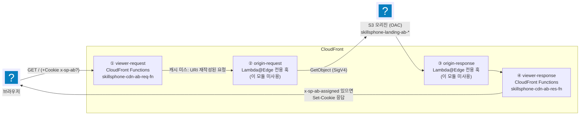

import { Quiz, QuizResults } from 'starlight-quiz/components';

> 문서 유형: explanation

CloudFront가 요청을 처리하는 동안 코드를 끼워 넣는 방법은 두 가지다 — **CloudFront Functions**와 **Lambda@Edge**. 이 모듈(set-07 task-2 모듈 2, `skillsphone` A/B 테스팅, us-east-1)은 둘 중 CloudFront Functions만 쓴다. 이 구분이 이 모듈의 핵심이므로 먼저 정리하고, 그다음 실제 함수 코드와 배포 함정을 본다.

S3 퍼블릭 차단·OAC 버킷 정책·순환 참조 같은 CloudFront 공통 구조는 이미 [02. KMS + S3 + CloudFront 이론](/part-1/02-kms-s3-cloudfront/theory/)이 다룬다. 여기서는 반복하지 않고 함수 자체에 집중한다.

---

## 1. CloudFront Functions vs Lambda@Edge — 4개 이벤트 훅

CloudFront가 요청을 처리하는 동안 코드가 끼어들 수 있는 지점은 이론상 4개다: **viewer-request → (캐시 미스 시) origin-request → origin-response → viewer-response**. 그런데 CloudFront Functions는 이 중 **viewer-request·viewer-response 둘만** 지원한다(mTLS 연결 단계 전용의 connection-request도 있지만 이 모듈과 무관). origin-request·origin-response는 **Lambda@Edge 전용**이다.



②③(origin-request/origin-response)은 **캐시 히트일 때는 아예 실행되지 않는다** — CloudFront가 오리진에 요청을 보낼 필요가 없기 때문이다. 반면 ①④(viewer-request/viewer-response)는 캐시 히트·미스와 무관하게 **모든 요청에서 실행**된다. 이 모듈의 A/B 배정 로직이 ①④에 있는 이유이기도 하다 — 캐시된 응답이라도 쿠키 확인·Set-Cookie 판단은 매번 필요하다.

### 런타임·비용 비교

AWS 공식 비교표에서 이 모듈 판단에 필요한 항목만 추렸다.

| 항목 | CloudFront Functions | Lambda@Edge |
|---|---|---|
| 언어 | JavaScript(ES 5.1 기반 + 런타임별 확장) | Node.js, Python |
| 실행 가능 훅 | viewer-request · viewer-response | viewer-request · viewer-response · origin-request · origin-response |
| KeyValueStore 연동 | 지원(런타임 `cloudfront-js-2.0`) | **미지원** |
| 스케일 | 초당 수백만 요청 | 리전당 초당 최대 1만 요청 |
| 실행 시간 | 서브밀리초 | 최대 30초 |
| 최대 메모리 | 2 MB | 128 MB(뷰어) / 10,240 MB(오리진) |
| 코드+라이브러리 크기 | 10 KB | 50 MB |
| 네트워크 접근 | 불가 | 가능 |
| 파일시스템 접근 | 불가 | 가능 |
| 요청 본문 접근 | 불가 | 가능 |
| CloudFront 안에서 빌드·테스트 완결 | 가능 | 불가(Lambda 콘솔, us-east-1 리전 필요) |

**어느 쪽을 언제 쓰나** — 캐시 키 정규화, 헤더 조작, URL 리다이렉트/재작성, 간단한 인가 검증처럼 가벼운 문자열 로직은 CloudFront Functions. 외부 API 호출, 파일시스템, 요청 본문 파싱처럼 무거운 작업이 필요하면 Lambda@Edge. 이 모듈은 KVS 조회 + URI/쿠키 조작뿐이라 CloudFront Functions로 충분하다 — 오히려 **Lambda@Edge는 KeyValueStore를 아예 못 써서** 이 설계를 그대로 옮길 수 없다(훅·기능 지원 표).

---

## 2. 이 모듈이 실제로 하는 일 — KVS 기반 A/B 리라이트

두 함수는 URL을 재작성하고 쿠키를 세팅하는 것 외에는 아무것도 하지 않는다. 오리진(S3)은 항상 `/version-a/index.html` 또는 `/version-b/index.html` 같은 구체적인 경로만 받는다 — "/"로 오는 요청을 분기하는 로직은 오리진에 전혀 없다.

**viewer-request** (`skillsphone-cdn-ab-req-fn`) — 요청 쿠키 `x-sp-ab`가 있으면 그 값을 유지하고, 없으면 KVS의 `weight`를 읽어 `Math.random() < weight`면 `b`, 아니면 `a`로 배정한다. 새로 배정한 경우에만 `x-sp-ab-assigned` 요청 헤더를 세운다(기존 배정을 유지한 경우는 세우지 않음 — viewer-response가 이 헤더로 "새로 배정했는가"를 판단한다). 마지막에 배정된 버전에 해당하는 KVS 값(`version_a`/`version_b`)으로 `request.uri`를 덮어쓴다.

```js title="terraform/cloudfront/req-fn.js"
import cf from 'cloudfront';

const kvsHandle = cf.kvs();

async function handler(event) {
  const request = event.request;

  try {
    const cookie = request.cookies['x-sp-ab'];
    let assigned;
    if (cookie && (cookie.value === 'a' || cookie.value === 'b')) {
      // 기존 배정 유지. assigned 헤더를 세우지 않아 viewer-response 가 Set-Cookie 를 내보내지 않는다.
      assigned = cookie.value;
    } else {
      const weightStr = await kvsHandle.get('weight');
      assigned = Math.random() < parseFloat(weightStr) ? 'b' : 'a';
      request.headers['x-sp-ab-assigned'] = { value: assigned };
    }

    const uri = await kvsHandle.get(assigned === 'b' ? 'version_b' : 'version_a');
    request.uri = uri;
  } catch (err) {
    // KVS 키 부재 등 — 원본 요청 그대로 통과
  }

  return request;
}
```

**viewer-response** (`skillsphone-cdn-ab-res-fn`) — `x-sp-ab-assigned` 요청 헤더가 있을 때만 `Set-Cookie`를 추가한다. 즉 방금 새로 배정된 방문자에게만 쿠키를 발급하고, 이미 쿠키가 있던 재방문자에게는 다시 발급하지 않는다(mark 2-4/2-5가 검사하는 지점).

```js title="terraform/cloudfront/res-fn.js"
function handler(event) {
  const response = event.response;
  const assigned = event.request.headers['x-sp-ab-assigned'];

  if (assigned && assigned.value) {
    response.cookies['x-sp-ab'] = {
      value: assigned.value,
      attributes: 'Path=/; Max-Age=86400'
    };
  }

  return response;
}
```

구현체 주석은 KVS 조회 두 번(weight, version_*)을 `Promise.all`이 아니라 순차 `await`로 처리한 이유를 "함수 메모리 한도(2 MB) 초과 위험"이라 적어 두었다. 이번 조사에서 AWS 공식 문서에서 그 메모리 근거 문구를 별도로 재확인하지는 못했지만, 2 MB라는 한도 자체는 위 비교표에서 확인된다.

---

## 3. 함정 — `await`는 반드시 단독 문장으로

:::danger[함정 — await를 함수 인자 자리에 쓰면 실행 시점에만 죽는다]
`Math.random() < parseFloat(await kvsHandle.get('weight'))`처럼 `await`를 함수 인자 자리에 직접 넣으면 어떻게 될까.

- **apply(CreateFunction)는 그대로 통과한다.** API가 코드 문법을 그 자리에서 완전히 검증하지 않는다.
- **요청을 처리하는 순간 `SyntaxError: await in arguments not supported`로 함수가 죽는다.** 모든 요청이 503 + 응답 헤더 `x-cache: FunctionThrottledError`로 돌아와 스로틀링으로 오인하기 쉽다.
- 진단은 `aws cloudfront test-function --stage LIVE`가 정답이다 — `FunctionErrorMessage`에 실패한 행 번호까지 나온다.

AWS 공식 문서(JavaScript 런타임 2.0)도 "`await`는 `async` 함수 안에서만 쓸 수 있다. `async` 인자와 클로저는 지원하지 않는다"고 명시한다. 규칙은 하나다 — `await`는 항상 `const x = await ...;`처럼 단독 문장으로 쓴다.
:::

---

## 4. 배포 절차의 함정 — DEVELOPMENT에서 LIVE로 publish

CloudFront Functions는 만들면 바로 `DEVELOPMENT` 스테이지에 들어간다. **`LIVE` 스테이지로 publish한 함수만 distribution의 cache behavior에 연결할 수 있다** — DEVELOPMENT 상태로는 연결 자체가 안 된다. 이 모듈의 Terraform은 `aws_cloudfront_function` 리소스에 `publish = true`를 줘서 생성과 동시에 LIVE로 발행한다.

`mark2.sh` 2-2-A는 정확히 이 지점을 검사한다 — `describe-function --name ... --stage LIVE`로 조회해 `FunctionSummary.Status`가 `DEPLOYED`인지 본다. 참고로 함수를 publish만 하고 아직 어떤 배포에도 연결하지 않은 상태는 `UNASSOCIATED`로 조회된다. `DEPLOYED`는 "publish까지 됐고, 실제로 배포된 distribution에 연결까지 끝났다"는 뜻이다. 콘솔이나 CLI로 수동 배포한다면 publish 단계를 빼먹기 쉽다.

---

## 5. 그 외 구현 함정 (NOTES.md 실측)

- **`Set-Cookie`는 `response.cookies`로만 설정된다.** `response.headers['set-cookie']`에 직접 값을 넣으면 이벤트에 반영되지 않아 응답에 실리지 않는다. res-fn이 `response.cookies['x-sp-ab']`를 쓰는 이유다.
- **함수 JS는 정적 파일이라 30% 변동 치환 범위 밖이다.** 쿠키명(`x-sp-ab`)·헤더명(`x-sp-ab-assigned`)·KVS 키명(`weight`/`version_a`/`version_b`)이 과제지 변동으로 바뀌면 `req-fn.js`·`res-fn.js`를 직접 고쳐야 한다. 쿠키명은 캐시 정책의 화이트리스트 쿠키 이름과 함께 바꿔야 캐시 키가 어긋나지 않는다.
- **KVS 키는 `aws_cloudfrontkeyvaluestore_keys_exclusive`가 배타 소유한다.** mark 2-2-A가 `list-keys` 결과를 정확 일치로 검사하므로, 콘솔에서 테스트용 키를 수동으로 추가해 뒀다면 다음 `terraform apply` 때 자동 제거된다 — apply 없이 그 상태로 채점하면 여분 키 때문에 실점한다.
- **"Pay-as-you-go 타입"은 아무 설정도 안 하는 것이 정답이다.** flat-rate 요금제는 콘솔 전용 opt-in 구독이라 Terraform·API에 그 자체를 표현하는 인자가 없다. `price_class`는 요금제가 아니라 엣지 로케이션 범위를 정하는 별개 설정이다.
- **Response Headers Policy는 AWS Managed Policy를 쓰면 안 된다.** 과제지가 명시적으로 금지한다 — 커스텀 `aws_cloudfront_response_headers_policy` 리소스로 Security Header를 직접 정의해야 한다.
- **`mark2.sh`가 검사하지 않는 항목도 있다.** 과제지 4번 절의 Security Header 응답 헤더 정책은 이름·내용이 `mark2.sh`의 자동 검사 대상이 아니다(2-1 ~ 2-6 어디에도 없다). 그래도 과제지 요구사항이므로 구현은 하되, "mark에 없다고 안 만들어도 된다"는 판단은 위험하다 — 수동 채점 가능성이 있다.

---

## 자기 점검 퀴즈

<Quiz title="CloudFront Functions가 붙을 수 있는 훅">
이 모듈의 두 CloudFront Functions는 각각 viewer-request와 viewer-response에 붙어 있다. 같은 A/B 배정 로직을 origin-request 훅에 CloudFront Functions로 옮겨 붙이면 어떻게 되나?

- [x] 애초에 불가능하다 — CloudFront Functions는 viewer-request·viewer-response(및 mTLS 전용 connection-request)에만 연결할 수 있고, origin-request·origin-response는 Lambda@Edge 전용이다
- [ ] 가능하지만 캐시 미스일 때만 실행되어 배정이 불안정해진다
  > 실행 시점이 불안정해지는 것이 문제가 아니다. CloudFront 콘솔·API가 애초에 그 훅에 CloudFront Functions를 연결하는 것 자체를 허용하지 않는다.
- [ ] 가능하지만 1ms 미만 실행 제한 때문에 KVS 조회가 타임아웃 난다
  > origin-request에는 CloudFront Functions를 붙일 수 없으므로 타임아웃을 논할 상황 자체가 생기지 않는다.
- [ ] 가능하며 오리진 부하가 줄어 오히려 권장되는 방식이다
  > 권장 여부를 따지기 이전에 지원되지 않는 조합이다.

viewer-request·viewer-response 이외의 훅(origin-request, origin-response)이 필요하면 CloudFront Functions가 아니라 Lambda@Edge를 써야 한다.
</Quiz>

<Quiz title="Lambda@Edge로 옮기면 막히는 지점">
과제지는 A/B 비율·경로를 KeyValueStore에 저장하고 CloudFront Function이 참조하게 한다. 같은 로직을 그대로 Lambda@Edge로 옮겨 구현하려면?

- [x] KeyValueStore 자체를 못 쓴다 — AWS 공식 비교표상 KVS 연동은 CloudFront Functions 전용이므로, Lambda@Edge로는 DynamoDB·S3 같은 다른 저장소를 새로 붙이는 설계 변경이 필요하다
- [ ] 그대로 가능하다 — Lambda@Edge도 CloudFront Functions와 동일하게 KVS ARN을 연결할 수 있다
  > KVS 연동은 CloudFront Functions 전용 기능이다. Lambda@Edge 함수에는 KeyValueStore를 연결하는 설정 자체가 없다.
- [ ] 가능하지만 viewer-request 이벤트에서만 KVS를 읽을 수 있다
  > "가능하다"는 전제부터 틀렸다. 이벤트 종류와 무관하게 Lambda@Edge는 KVS를 지원하지 않는다.
- [ ] 가능하지만 KVS 읽기마다 별도 IAM 권한 승인이 필요해 지연이 커진다
  > IAM 권한의 문제가 아니라, 애초에 Lambda@Edge에는 KVS 연동 기능 자체가 없다.

이 모듈이 Lambda@Edge가 아니라 CloudFront Functions를 택할 수밖에 없는 이유이기도 하다 — 요구사항 자체(KVS 참조)가 두 서비스 중 하나만 지원하는 기능에 의존한다.
</Quiz>

<Quiz title="await 함정">
req-fn.js에서 `Math.random() < parseFloat(await kvsHandle.get('weight'))`처럼 `await`를 함수 인자 자리에 직접 넣어 배포했다. 무슨 일이 벌어지나?

- [x] `CreateFunction`(apply)은 그대로 통과하지만 실행 시점에 `SyntaxError: await in arguments not supported`로 죽는다 — 모든 요청이 503 + `x-cache: FunctionThrottledError`로 응답해 스로틀링으로 오인하기 쉽다
- [ ] apply 시점에 Terraform이 문법 오류로 즉시 실패한다
  > `CreateFunction` API는 코드 문법을 그 자리에서 완전히 검증하지 않는다. 실패는 실행(요청 처리) 시점에야 드러난다.
- [ ] 정상 동작하지만 KVS 조회가 순차 대신 병렬로 실행되어 메모리를 더 쓴다
  > 정상 동작하지 않는다. js-2.0 런타임은 `async` 인자·클로저를 지원하지 않아 그 지점에서 함수 실행 자체가 멈춘다.
- [ ] weight 값이 항상 0으로 읽혀 A 버전만 배정된다
  > 값이 잘못 읽히는 수준이 아니다. 함수 실행 자체가 `SyntaxError`로 중단된다.

진단은 `aws cloudfront test-function --stage LIVE`가 정답이다 — `FunctionErrorMessage`에 실패한 행 번호까지 나온다. 규칙은 `await`를 항상 단독 문장(`const x = await ...;`)으로 쓰는 것이다.
</Quiz>

<Quiz title="Set-Cookie를 세우는 방법">
res-fn.js가 `response.cookies['x-sp-ab']` 대신 `response.headers['set-cookie']`에 직접 값을 세팅하는 방식으로 구현되었다면?

- [x] 이벤트 객체에 반영되지 않아 실제 응답에 Set-Cookie가 실리지 않는다 — CloudFront Functions 이벤트 구조에서 Set-Cookie는 `response.cookies` 객체로만 설정할 수 있다
- [ ] 정상 동작하지만 Path·Max-Age 같은 속성을 문자열로 직접 조립해야 해서 코드가 조금 더 길어질 뿐이다
  > "정상 동작"이 틀렸다. `headers` 경로로 세팅한 Set-Cookie는 이벤트에 반영되지 않아 응답에 실리지 않는다.
- [ ] 정상 동작하지만 브라우저가 그 쿠키를 무시한다
  > 브라우저에 도달하기 전에, CloudFront Functions 이벤트 자체가 그 값을 응답에 실어 보내지 않는다.
- [ ] `x-sp-ab-assigned` 요청 헤더가 없을 때만 문제가 된다
  > 요청 헤더 존재 여부와 무관하다. Set-Cookie는 애초에 `headers` 경로로는 설정할 수 없는 구조다.

Set-Cookie는 `response.cookies` 객체 전용이다. `attributes` 문자열(`'Path=/; Max-Age=86400'`)로 나머지 속성을 함께 넘긴다.
</Quiz>

<Quiz title="publish를 빼먹으면">
함수를 생성만 하고 publish하지 않은 채(`DEVELOPMENT` 스테이지) distribution의 viewer-request에 연결하려 하면?

- [x] 연결 자체가 안 된다 — CloudFront는 `LIVE` 스테이지 함수만 cache behavior에 연결할 수 있다. `mark2.sh`도 `describe-function --stage LIVE`로 조회해 `DEPLOYED` 상태를 기대한다
- [ ] 연결은 되지만 배포가 끝날 때까지 이전 버전 코드로 응답한다
  > "연결은 된다"는 전제부터 틀렸다. LIVE 스테이지가 아닌 함수는 cache behavior에 애초에 붙일 수 없다.
- [ ] 연결되고 정상 동작하며, LIVE는 콘솔에서 배포 이력을 보여주는 표시일 뿐이다
  > DEVELOPMENT·LIVE는 단순 표시가 아니라 무엇을 cache behavior에 붙일 수 있는지를 가르는 실제 상태다.
- [ ] 연결은 되지만 CloudFront 로그에 경고만 남고 요청은 정상 처리된다
  > 연결 시도 자체가 막힌다. 경고와 함께 넘어가는 상황이 아니다.

이 모듈의 Terraform은 `aws_cloudfront_function`에 `publish = true`를 줘서 생성과 동시에 LIVE로 발행한다. 콘솔·CLI로 수동 배포할 때 가장 흔히 빠뜨리는 단계다.
</Quiz>

<Quiz title="KVS 여분 키">
채점(`mark2.sh` 2-2-A)이 KVS의 `list-keys` 결과를 정확 일치로 검사한다. 실습 중 콘솔에서 테스트용 키를 하나 추가해 두고 지우지 않았다면?

- [x] 이 모듈은 `aws_cloudfrontkeyvaluestore_keys_exclusive`로 키 3개를 배타 관리하므로 다음 `terraform apply` 때 수동 추가 키가 자동 제거된다 — 단, apply 없이 그대로 채점하면 여분 키 때문에 정확 일치가 깨진다
- [ ] `aws_cloudfront_key_value_store` 리소스가 키 목록도 함께 관리하므로 걱정할 필요가 없다
  > 이 리소스는 스토어(이름) 자체만 만든다. 키 목록의 소유권은 별도의 `aws_cloudfrontkeyvaluestore_keys_exclusive` 리소스에 있다.
- [ ] 채점 스크립트가 `weight`·`version_a`·`version_b` 세 키만 골라서 보므로 여분 키는 무시된다
  > mark.md 2-2-A는 "정확 일치"로 명시돼 있다. `list-keys` 전체 출력을 비교하므로 여분 키가 있으면 그대로 실점이다.
- [ ] `aws_cloudfrontkeyvaluestore_key` 리소스 3개를 개별로 쓰고 있어서 문제없다
  > 이 모듈은 그 개별 리소스 대신 `keys_exclusive` 하나로 3개 키를 선언한다 — 개별 리소스는 "수동 추가된 여분 키를 못 지운다"는 이유로 구현 단계에서 기각됐다.

`keys_exclusive`는 선언되지 않은 키를 자동으로 지우는 배타 관리 리소스다. 수동 `put-key`는 다음 apply에서 사라진다.
</Quiz>

<QuizResults confetti />
