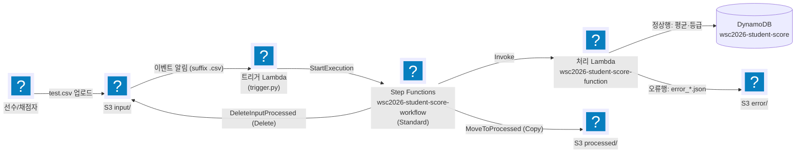
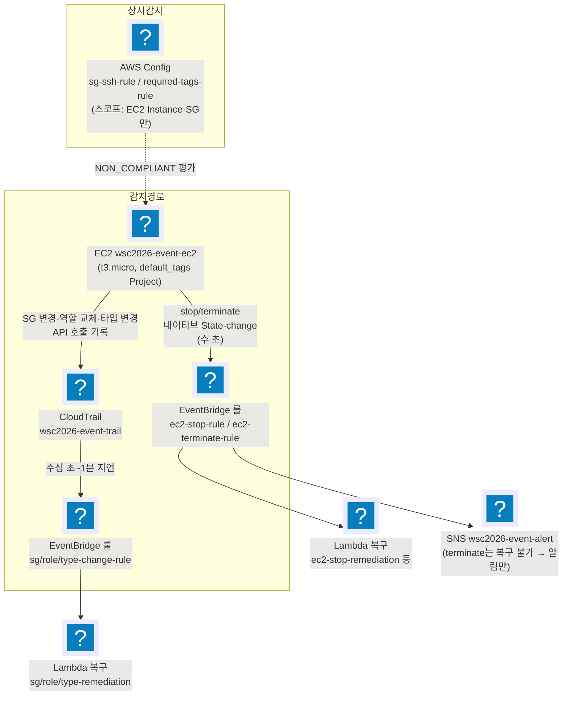
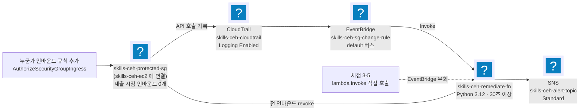

import { Quiz, QuizResults } from 'starlight-quiz/components';
import { Tabs, TabItem } from '@astrojs/starlight/components';

> 문서 유형: explanation

선행 지식과 학습 경로는 [모듈 개요](/part-4/14-serverless-event/)에.

:::tip[읽으면서 확인한다]
유형 2 끝에 **지금 확인하기** 블록이 접혀 있다. 조회뿐이라 **과금이 0원**이고 아무것도 만들지 않는다. 블록을 열지 않고 읽어도 문서는 그대로 이어진다.

**리전을 먼저 맞춘다.** 2과제는 모듈마다 리전이 다르고 **틀리면 그 모듈이 0점**이다. 아래 명령들도 리전을 명시하지 않으면 엉뚱한 곳을 조회한다.
:::

2과제는 독립 모듈 여러 개로 구성되며, 모듈마다 "패턴"이 반복된다. 이 문서는 그중 유형 1·2를 다룬다. 각 유형은 ① 도식 ② 언제 나오나 ③ 핵심 연결 고리 ④ 채점이 보는 상태 ⑤ 변형 포인트 ⑥ 퀴즈 순서다. `유형 2 변형` 절만 ④ 가 고정 이름·값이고, 그 표에 변형 축을 함께 담아 별도의 변형 포인트를 두지 않는다.

Lambda·EventBridge·CloudTrail·Step Functions·SQS 다섯 가지의 기본 동작은 [serverless-basics](/start/serverless-basics/)에 있다. 이 문서는 그것들을 어떻게 잇는가만 다룬다.

---

## 유형 1 — 서버리스 워크플로 (S3 → Lambda → Step Functions → DynamoDB)

실측 근거: set-02 task-2 module-1 (성적 처리, ap-southeast-1)

### ① 도식



<details class="diagram-note">
<summary>이 도식이 보여주는 것</summary>

유형 1 워크플로 전체다. `input/` 에 CSV 가 올라오면 이벤트 알림이 트리거 함수를 부르고, 그 함수가 상태 머신을 시작한다. 처리 함수는 행마다 갈라 정상 행은 DynamoDB 로, 오류 행은 `error/` 로 보낸다. 마지막 두 화살표가 S3 에 move API 가 없다는 사실의 결과다 — 원본을 `processed/` 로 복사하는 상태와 `input/` 에서 지우는 상태가 따로 있다. 지우지 않으면 그 파일이 다시 트리거를 부른다.

</details>

- 흐름: `input/`에 CSV 업로드 → S3 이벤트가 트리거 Lambda 호출 → 트리거가 Step Functions 실행 시작 → 처리 Lambda가 행별 검증 후 정상행은 평균(483/5=96.6)·등급 계산해 DynamoDB 저장, 오류행은 `error/`에 JSON 저장 → 상태 머신이 원본 파일을 `processed/`로 이동(Copy+Delete).

### ② 언제 이 패턴이 나오나

- 과제지에 "파일 업로드 시 자동 처리", "워크플로우", "Step Functions", "처리 완료 후 파일 이동", "오류 데이터 분리 저장" 키워드가 보일 때.
- S3 폴더가 `input/` `processed/` `error/` 3종으로 나뉘면 거의 확정.
- 배치성 데이터(CSV 성적, 주문 목록 등) + "테이블은 채점 시작 시 비어 있어야 함" 조건이 따라온다.

### ③ 핵심 연결 고리 (여기가 끊어지면 전체가 죽는다)

1. **S3 트리거 suffix `.csv`** — 처리 Lambda가 `error/`에 `.json`을 쓰는데, suffix 필터가 없으면 그 쓰기가 다시 트리거를 발화해 **재귀 무한루프**가 된다. suffix `.csv` 하나로 차단(출력이 `.json`이라 매치 안 됨).
2. **ASL에서 S3 이동은 Copy+Delete 2상태** — S3에 "move" API는 없다. Step Functions 의 Task 하나가 AWS API 하나에 대응하기 때문이다([serverless-basics 의 Step Functions 절](/start/serverless-basics/#4-step-functions--task-하나가-api-하나다)). `MoveToProcessed`(CopyObject) → `DeleteInputProcessed`(DeleteObject)로 상태를 2개로 분리한다. 채점은 상태 이름이 아니라 State Machine [name,type]과 S3/DDB 최종 상태만 본다.

:::note[실측 — 평균은 Decimal로]
평균 계산은 반드시 `decimal.Decimal`([dynamodb-basics 의 Decimal 절](/start/dynamodb-basics/#숫자는-decimal-로-오간다)). boto3가 DynamoDB에 float 저장 자체를 거부하기 때문이다 — `TypeError: Float types are not supported. Use Decimal types instead.` 값이 틀려서가 아니다(`483/5`는 파이썬 float로도 정확히 `96.6`이다). 저장 시점에 예외로 죽는다.
:::

3. **처리 Lambda를 State Machine에서 ARN 직접 호출** — 출력이 `$.result`에 그대로 실려 `.Payload` 언랩이 필요 없다.
4. **IAM 역할 2개** — Lambda 공용 `wsc2026-lambda-student-role` + Step Functions용 `wsc2026-stepfunction-student-role` (과제가 Lambda 역할을 하나만 명명하므로 두 Lambda가 공용).

### ④ 채점이 보는 상태

:::danger[이름이 mark에만 있던 함정 — 정정으로 해소됨]
처리 Lambda 이름 `wsc2026-student-score-function`은 원래 task.md에 없고 mark에만 있었다. 이의 제기로 **과제지에 이름이 명시**됐다([정정 내역](/reference/errata/)). 이름 자체는 그대로이므로 구현은 바뀌지 않지만, "채점지에만 있는 이름"이라는 함정은 사라졌다 — 대신 **과제지에 없는 이름을 채점이 요구할 수 있다는 사실**은 유효하니 두 문서를 모두 읽는 습관은 유지한다.
:::

- **S3 폴더 마커는 `input/` 하나만 생성.** `processed/`·`error/`는 실행 후 실제 객체가 생겨 PRE가 뜬다. 마커(0바이트 객체)를 만들어두면 채점의 `aws s3 ls` 목록에 잉여 라인이 출력돼 오답.
- **채점 직전 리셋 절차 (순서 엄수)**: ① `processed/`·`error/` 비우기 → ② DynamoDB 전 항목 삭제 → ③ `test.csv`를 `input/`에 **정확히 1회** 업로드. 2회 업로드하면 timestamp가 다른 error JSON이 8개가 되어 오답(기대는 4개).
- 기대 결과: `STU1020 96.6 A` (get-item), `processed/`에 test.csv만, `error/`에 error_*_STU2001/STU2002/STU2004/unknown.json **정확히 4개**.
- 채점 상태 = "깨끗한 버킷/테이블에서 test.csv 1회 처리 완료 + SUCCEEDED 실행 1건".

### ⑤ 변형 포인트

당일 과제의 약 30% 가 수정된다.

| 바뀌는 값 | 고칠 곳 | 확인 |
|---|---|---|
| 리소스 이름 | 상태 머신 `wsc2026-student-score-workflow` · 처리 Lambda `wsc2026-student-score-function` · 테이블 `wsc2026-student-score` | task.md 와 mark 스크립트 양쪽 문자열 |
| 입력 파일 확장자 | S3 이벤트 알림의 suffix 필터 | 오류 출력 확장자 `.json` 과 다름 |
| 폴더 이름 | 이벤트 알림 prefix · ASL 의 CopyObject·DeleteObject 대상 키 | 폴더 마커는 `input/` 하나만 |
| 계산 규칙(평균·등급) | 처리 Lambda 의 행 검증·계산부 | `Decimal` 로 저장 · `STU1020 96.6 A` |
| 채점용 입력 파일 | 리셋 절차 ③ 의 업로드 대상 | `error/` JSON 개수 = CSV 오류 행 수(기대 4개) |

폴더 3종·suffix 필터·Copy+Delete 2상태는 이 패턴의 구조라서 이름이 바뀌어도 유지한다. IAM 역할 개수는 과제가 명명한 이름 수를 따른다 — Lambda 역할 이름이 하나뿐이면 두 Lambda 가 공용으로 쓴다.

### ⑥ 퀴즈

<Quiz title="suffix 필터를 빼면">
트리거 Lambda를 호출하는 S3 이벤트 알림에 suffix 필터를 걸지 않았다. 무슨 일이 벌어지나? (힌트: 처리 Lambda가 `error/`에 쓰는 파일의 확장자)

- [x] 처리 Lambda가 `error/`에 쓰는 `.json`이 같은 버킷의 이벤트를 다시 발화 → 트리거 → 실행 → 또 `.json` … 재귀 무한루프
- [ ] `.csv`가 아닌 객체까지 Step Functions를 시작하지만, 파싱에 실패해 실행이 FAILED로 끝날 뿐이라 루프는 나지 않는다
  > FAILED로 끝나도 그 실행이 이미 `error/`에 JSON을 남겼다면 다음 이벤트가 또 발화한다. 루프를 끊는 건 실행 결과가 아니라 이벤트 필터다.
- [ ] Lambda가 만든 객체에 대해서는 S3 이벤트가 발화하지 않으므로 문제없다
  > S3 이벤트는 PutObject 주체를 구분하지 않는다. 콘솔 업로드든 Lambda 쓰기든 똑같이 발화한다.
- [ ] Step Functions Standard는 동일 이름 실행을 거부하므로 두 번째부터 자동으로 차단된다
  > 실행 이름은 매번 달라지므로 중복 방지가 걸리지 않는다.

suffix `.csv` 하나로 차단된다 — 출력이 `.json`이라 매치되지 않기 때문이다. 이 필터가 이 아키텍처에서 재귀를 막는 유일한 장치다.
</Quiz>

<Quiz title="평균을 float로 계산하면">
처리 Lambda에서 평균을 `sum/count`로, 즉 파이썬 float로 계산해 `put_item`에 넘기면 boto3가 [[TypeError]] 를 던지며 저장이 실패한다.

---

boto3는 DynamoDB에 float 저장 자체를 거부한다 — `Float types are not supported. Use Decimal types instead.` 값이 틀리기 전에 저장에서 죽는다.

흔한 오해와 달리 **`483/5`는 파이썬 float로도 정확히 `96.6`이다**(`483/5 == 96.6`이 `True`). 두 피연산자가 정확한 정수라 나눗셈이 한 번만 반올림되고 그 결과가 `float("96.6")`과 같은 값이기 때문이다. Decimal을 쓰는 이유는 부동소수점 오차가 아니라 **boto3의 타입 제약**이다: `Decimal("483")/Decimal("5")` → `96.6`.
</Quiz>

<Quiz title="중복 업로드 복구 순서">
test.csv를 실수로 두 번 업로드해 `error/`에 JSON이 8개가 됐다. 올바른 복구 절차는?

- [x] `processed/`·`error/` 전체 삭제 → DynamoDB scan 후 전 항목 delete-item → test.csv를 `input/`에 정확히 1회 재업로드
- [ ] DynamoDB 전 항목 삭제 → test.csv 1회 재업로드 → 남은 error JSON 정리
  > 재업로드가 새 error JSON 4개를 또 만든 뒤에 정리하면, 어느 4개가 이번 실행의 것인지 timestamp로 골라내야 한다. 버킷을 먼저 비우는 이유다.
- [ ] `input/`에 남은 중복 객체만 지우고 상태 머신을 다시 실행한다
  > `input/`은 `DeleteInputProcessed`가 이미 비웠다. 문제는 누적된 `error/`·`processed/`와 DynamoDB 잔여 항목이다.
- [ ] Step Functions 실행 이력을 삭제하고 재업로드한다
  > 채점이 보는 것은 실행 이력이 아니라 S3/DynamoDB의 최종 상태(+SUCCEEDED 실행 1건)다.

순서 엄수: ① `processed/`·`error/` 비우기 → ② DynamoDB 전 항목 삭제 → ③ `test.csv`를 `input/`에 **정확히 1회** 업로드. 리셋 없이 재업로드만 하면 timestamp가 다른 error JSON이 계속 누적돼, 기대값 4개(`error_*_STU2001/STU2002/STU2004/unknown.json`)와 어긋난다.
</Quiz>

<Quiz title="processed/ 폴더 마커">
`input/`에는 폴더 마커(0바이트 객체)를 만들었다. `processed/`·`error/`에도 같이 만들면 왜 안 되나?

- [x] 채점이 `aws s3 ls s3://버킷/processed/` 출력을 보는데, 마커 때문에 0바이트 잉여 라인이 함께 출력돼 "test.csv만"이라는 기대와 불일치한다
- [ ] 마커가 이미 있으면 `MoveToProcessed`의 CopyObject가 `KeyAlreadyExists`로 실패한다
  > S3의 CopyObject에는 그런 실패가 없다. 같은 키면 그냥 덮어쓴다.
- [ ] 마커 객체도 S3 이벤트를 발화시켜 재귀 트리거가 생긴다
  > 마커에는 `.csv` 확장자가 없어 suffix 필터에 걸리지 않는다.
- [ ] 같은 이유로 `input/` 마커도 만들면 안 된다
  > `input/`은 반대다. 처리가 끝나면 파일이 `processed/`로 옮겨가 폴더가 비므로, 마커가 있어야 경로가 유지된다.

`processed/`·`error/`는 실행 후 실제 객체가 생겨 PRE가 자동으로 뜬다. 마커는 `input/` 하나만 만든다.
</Quiz>

<Quiz title="S3 이동이 상태 2개인 이유">
ASL에서 S3 "이동"을 상태 하나로 구현할 수 없는 이유는?

- [x] S3에 move API가 없어서 — CopyObject + DeleteObject 두 번의 API 호출이 필요하고, ASL Task 상태 하나는 API 하나만 호출한다
- [ ] `MoveToProcessed` 상태의 IAM 정책에 `s3:MoveObject` 액션을 허용하면 한 상태로 가능하다
  > `s3:MoveObject`라는 IAM 액션 자체가 존재하지 않는다.
- [ ] 한 Task 상태의 `Parameters`에 Copy와 Delete를 배열로 넣을 수는 있지만 순서 보장이 안 돼 권장되지 않는다
  > `Parameters`는 단일 API 호출의 인자를 만드는 자리다. 여러 API를 담을 수 없다.
- [ ] Lambda에서 boto3 `move_object()`를 호출하면 한 상태로 되지만 Lambda를 하나 더 만들어야 해서 안 쓴다
  > boto3에도 `move_object()`는 없다. 내부적으로 copy 후 delete를 하는 헬퍼가 있을 뿐이다.

`MoveToProcessed`(CopyObject) → `DeleteInputProcessed`(DeleteObject)로 상태를 2개로 분리한다. 참고로 채점은 상태 이름이 아니라 State Machine의 `[name, type]`과 S3/DynamoDB 최종 상태만 본다.
</Quiz>

<QuizResults confetti />

---

## 유형 2 — 이벤트 기반 자동복구 (EventBridge/Config → Lambda/SNS)

실측 근거: set-02 task-2 module-3 (EC2 정책 위반 자동복구, eu-west-1)

### ① 도식



<details class="diagram-note">
<summary>이 도식이 보여주는 것</summary>

유형 2 는 감지 경로가 둘이라는 것이 요점이다. 인스턴스 중지·종료는 네이티브 상태 변경 이벤트라 수 초 만에 룰에 닿고, 보안 그룹·역할·타입 변경은 네이티브 이벤트가 없어 CloudTrail 기록을 거쳐 수십 초에서 1분이 걸린다. 복구 함수는 각 룰의 타깃이고, 종료는 되돌릴 수 없어 SNS 알림만 간다. 아래 Config 는 이벤트가 아니라 주기 평가로 규정 위반을 표시하는 별도 축이다.

</details>

- 흐름: EC2에 대한 정책 위반(SG 인바운드 추가, 인스턴스 프로파일 교체, 중지, 종료, 타입 변경)을 EventBridge가 감지 → Lambda가 원상 복구하거나(복구 불가한 terminate는) SNS 알림. AWS Config가 SSH 인바운드·필수 태그를 상시 감시.

### ② 언제 이 패턴이 나오나

- 과제지에 "자동 복구", "정책 위반 감지", "EventBridge", "CloudTrail", "Config 룰", "관리자에게 알림(SNS)" 키워드가 보일 때.
- mark 스크립트가 "일부러 망가뜨리고 → sleep → 원상태 확인" 구조면 확정 (예: stop 후 sleep 30에 running 기대).

### ③ 핵심 연결 고리

1. **감지 경로가 2종이고 지연이 다르다.** 인스턴스 stop/terminate는 **네이티브 "EC2 Instance State-change Notification" 이벤트(수 초)**. SG 규칙 변경·역할 교체·타입 변경은 네이티브 이벤트가 **없어서** CloudTrail(API 기록) → EventBridge 경로(수십 초~1분 지연). 이 두 경로가 갈리는 이유는 [serverless-basics 의 CloudTrail 절](/start/serverless-basics/#3-cloudtrail--네이티브-이벤트가-없는-변경을-이어-준다)에 있다. apply 직후엔 트레일 활성화까지 몇 분 더 걸린다.
2. **stop 복구는 `stopping` 상태에서 트리거 + waiter로 stopped 직후 start.** mark 3-4는 stop 후 (다른 항목 채점 + sleep 30) 시점에 `running`을 기대한다. `stopped` 이벤트를 기다렸다 시작하면 늦는다. `stopping`에서 받아 boto3 waiter(5초 간격)로 stopped를 감지하자마자 start.
3. **무한루프 2중 차단.** 복구 Lambda의 원복 동작 자체가 또 이벤트를 만든다. (a) type-change 룰의 이벤트 패턴에 `anything-but: t3.micro`로 원복 이벤트 제외, (b) Lambda 안에서도 현재 값이 원본이면 즉시 return. role-remediation도 현재 프로파일이 원본이면 return.
4. **레이스 컨디션: 타입 원복 시연 전 stop-rule 비활성화.** 타입 변경 시연 절차(stop→modify→start)의 stop이 stop-remediation과 레이스해서, 복구 Lambda가 인스턴스를 다시 켜버리면 modify가 `IncorrectInstanceState`로 실패한다. `aws events disable-rule --name wsc2026-ec2-stop-rule` 후 시연, 끝나면 enable.
5. **인스턴스 프로파일 이름 = 역할 이름** (`wsc2026-event-ec2-role`). role-remediation이 `ROLE_NAME` 환경변수를 프로파일 Name으로 그대로 써서 원복한다. `-profile` 접미사를 붙이면 복구가 깨진다.
6. **provider `default_tags`로 `Project` 태그 상시 부착** — Config required-tags 룰 통과의 기반.
7. **EC2에 `lifecycle.ignore_changes = [instance_type]`** — 타입 변경 시연 후 `terraform plan`에 diff가 남지 않게.

### ④ 채점이 보는 상태

- **task.md ∪ mark 합집합 구현.** task.md/lambda.md는 sg/role/terminate/type 함수 4개·룰 4개를, mark 스크립트는 stop/terminate/sg/tag 함수 4개·stop/terminate 룰·Config 룰 2개를 요구 → 불일치. mark 스크립트가 1순위지만 task.md 항목은 수동 채점 가능성이 있어 **함수 6개·룰 6개 전부** 만든다.
- **Config 스코프는 EC2 Instance·SecurityGroup만 기록.** 스코프를 넓히면 태그 없는 관리형 리소스(자동 생성 SG, ENI 등)가 required-tags에서 NON_COMPLIANT로 잡혀 "NON_COMPLIANT 0건(None)" 채점이 깨진다.
- **CloudTrail·Config 첫 평가는 5~10분** — apply 직후 바로 채점하지 말 것. 급하면 `aws configservice start-config-rules-evaluation`으로 강제 트리거.
- 기대 출력: stop+SSH 인바운드 추가 후 sleep 90 → `EC2 State: running`, `SG Inbound Count: 0`, required-tags NON_COMPLIANT 조회 결과 `None`.

:::caution[과제지에 적힌 이름은 그대로 쓴다 — 단, 정정 공지를 먼저 본다]
이름 정확 일치 채점에서는 오타처럼 보여도 적힌 그대로 만든다. 다만 대표 사례였던 set-02의 `wsc2026-alaytics-ec2-role`(alaytics)은 **이의 제기로 오타가 수정됐고 채점 대상도 아니다** — [정정 내역](/reference/errata/)을 확인하지 않으면 이미 고쳐진 오타를 사양으로 착각한다.
:::

### ⑤ 변형 포인트

| 바뀌는 값 | 고칠 곳 | 확인 |
|---|---|---|
| 감시할 위반 종류 | EventBridge 룰과 복구 Lambda 의 개수 | task.md ∪ mark 합집합 — 함수 6개·룰 6개 |
| 원본 인스턴스 타입 `t3.micro` | type-change 룰의 `anything-but` + 복구 Lambda 의 비교값 | 두 곳이 같은 문자열 |
| 역할 이름 `wsc2026-event-ec2-role` | 인스턴스 프로파일 Name + Lambda `ROLE_NAME` 환경변수 | 세 값이 같은 문자열 |
| 필수 태그 키 `Project` | provider `default_tags` + Config required-tags 룰 | NON_COMPLIANT 조회가 `None` |
| Config 기록 스코프 | 레코더의 리소스 타입 목록 | EC2 Instance·SecurityGroup 만 |
| 룰 이름 `wsc2026-ec2-stop-rule` | 시연 전후의 `disable-rule`·`enable-rule` 인자 | 시연 후 다시 enable |

위반 종류가 추가되면 그 종류에 네이티브 EventBridge 이벤트가 있는지부터 확인한다. 없으면 CloudTrail 경로라 지연이 수십 초~1분으로 늘고, 채점 스크립트의 sleep 시간을 그 기준으로 읽어야 한다.

<details class="build-step">
<summary>지금 확인하기 — 두 탐지 수단이 무엇을 약속하나</summary>

set-02 는 AWS Config 규칙으로, set-08 은 CloudTrail 로 같은 위반을 잡는다. **둘이 무엇을 약속하는지가 다르고, 그 차이는 CLI 도움말에 적혀 있다.** 조회와 도움말뿐이라 과금이 없다.

먼저 Config 쪽이 평가 시점을 어떻게 정하는지 본다.

<Tabs syncKey="shell">
  <TabItem label="PowerShell">
  ```powershell
  aws configservice put-config-rule help | Select-String -Pattern 'MaximumExecutionFrequency|ConfigurationItemChangeNotification|Periodic' | Select-Object -First 8
  ```
  </TabItem>
  <TabItem label="Bash (Linux/CloudShell)">
  ```bash
  aws configservice put-config-rule help | grep -E 'MaximumExecutionFrequency|ConfigurationItemChangeNotification|Periodic' | head -8
  ```
  </TabItem>
</Tabs>

기대: 평가를 거는 방식이 **변경 알림**과 **주기 실행** 둘로 나뉜다는 설명이 나온다. 주기 쪽은 최소 간격이 시간 단위다.

이제 EventBridge 가 무엇을 받는지 본다.

<Tabs syncKey="shell">
  <TabItem label="PowerShell">
  ```powershell
  aws events put-rule help | Select-String -Pattern 'EventPattern|ScheduleExpression' | Select-Object -First 6
  ```
  </TabItem>
  <TabItem label="Bash (Linux/CloudShell)">
  ```bash
  aws events put-rule help | grep -E 'EventPattern|ScheduleExpression' | head -6
  ```
  </TabItem>
</Tabs>

기대: 이벤트 패턴으로 걸거나 일정으로 건다는 설명이 나온다. **패턴으로 걸면 이벤트가 도착하는 즉시 돈다.**

여기서 두 수단의 성격이 갈린다.

| | AWS Config 규칙 | CloudTrail + EventBridge |
|---|---|---|
| 무엇을 보나 | 리소스의 **상태** | API **호출** |
| 언제 도나 | 구성 항목이 기록된 뒤, 또는 주기마다 | 이벤트가 버스에 도착하는 즉시 |
| 잡히는 것 | 지금 잘못된 상태 전부 | 호출로 만들어진 변경만 |
| 놓치는 것 | 빠른 되돌림 사이의 순간 | **호출 없이 생긴 상태** |

**같은 "SG 인바운드 위반 자동복구"라도 기전이 다르므로 규칙 이름만 바꿔서는 이행이 안 된다.** set-02 는 상태를 감시하고 set-08 은 호출을 감시한다.

`aws: command not found` 면 CLI 가 없는 것이다. 도움말 출력이 길면 `--no-cli-pager` 를 붙인다.

</details>

### ⑥ 퀴즈

<Quiz title="두 감지 경로의 지연 차이">
SG 인바운드 규칙 추가에 대한 자동복구가 인스턴스 stop 복구보다 눈에 띄게 느리다. 근본 이유는?

- [x] SG 규칙 변경에는 네이티브 EventBridge 이벤트가 없어 CloudTrail이 API 호출을 기록해 전달하는 경로(수십 초~1분)를 타기 때문. stop은 네이티브 State-change 이벤트라 수 초다
- [ ] Config 룰 평가 주기를 기다려야 복구 Lambda가 호출되기 때문
  > Config는 상시 감시(NON_COMPLIANT 판정)용이고 복구 경로가 아니다. 복구는 EventBridge → Lambda다.
- [ ] `AuthorizeSecurityGroupIngress`가 비동기 API라 반영·회수에 시간이 걸리기 때문
  > SG 규칙 변경은 즉시 반영된다. 느린 것은 변경이 아니라 그 사실이 EventBridge에 도달하는 경로다.
- [ ] SG 복구 Lambda의 콜드 스타트가 stop 복구 Lambda보다 길기 때문
  > 콜드 스타트는 수백 ms 규모다. 수십 초 차이를 설명하지 못한다.

감지 경로가 2종이고 지연이 다르다는 것이 이 모듈의 핵심 구조다. 인스턴스 stop/terminate = 네이티브 "EC2 Instance State-change Notification"(수 초). SG 규칙 변경·역할 교체·타입 변경 = 네이티브 이벤트가 **없어서** CloudTrail → EventBridge(수십 초~1분). apply 직후에는 트레일 활성화까지 몇 분 더 걸린다.
</Quiz>

<Quiz title="stopping에서 받아야 하는 이유">
mark 3-4는 stop 후 (다른 항목 채점 + sleep 30) 시점에 `running`을 기대한다. 룰을 `stopped` 상태 이벤트로 걸면 왜 실패하나?

- [x] stop→stopped 전이 자체가 1분 안팎 걸려 sleep 30 시점을 이미 넘긴다 — `stopping`에서 트리거 받고 boto3 waiter(5초 간격)로 stopped를 감지하자마자 start해야 한다
- [ ] `stopped`는 State-change Notification 이벤트에 포함되지 않는 상태다
  > `pending/running/stopping/stopped/shutting-down/terminated` 모두 포함된다. 문제는 존재가 아니라 도달 시각이다.
- [ ] `stopped` 상태에서 StartInstances를 호출하면 `IncorrectInstanceState`가 난다
  > `stopped`는 start가 가능한 정상 상태다. `IncorrectInstanceState`는 오히려 running 상태에서 타입을 바꾸려 할 때 난다.
- [ ] `stopped` 이벤트는 CloudTrail 경로를 타서 지연이 크다
  > stop/terminate는 둘 다 네이티브 경로다. CloudTrail 경로를 타는 건 SG·역할·타입 변경이다.

`stopping`에서 트리거를 받아 waiter로 대기하면, stopped가 되는 순간(=최단 시점) start가 나간다. `stopped` 이벤트를 기다렸다 시작하면 그 자체로 이미 늦다.
</Quiz>

<Quiz title="IncorrectInstanceState 레이스">
타입 변경 원복을 시연하려고 stop → modify-instance-attribute 순서로 진행했는데 `IncorrectInstanceState` 오류가 났다. 원인과 예방책은?

- [x] stop-remediation 룰이 시연용 stop을 감지해 인스턴스를 다시 켜버리는 레이스 — 시연 전에 `aws events disable-rule --name wsc2026-ec2-stop-rule`, 시연 후 enable
- [ ] type-change 룰의 `anything-but: t3.micro` 패턴이 원복 이벤트를 다시 발화시켜 modify와 충돌하기 때문
  > `anything-but: t3.micro`는 반대로 원복 이벤트를 **제외**해 무한루프를 막는 장치다. 충돌의 원인이 아니다.
- [ ] `lifecycle.ignore_changes = [instance_type]` 때문에 terraform이 타입을 되돌리기 때문
  > `ignore_changes`는 plan의 diff를 억제할 뿐 실제 리소스를 되돌리지 않는다. 시연 후 plan을 깨끗하게 유지하려는 장치다.
- [ ] t3 계열은 정지 없이 타입 변경이 가능한데 굳이 stop을 먼저 해서 상태가 어긋났기 때문
  > 인스턴스 타입 변경은 `stopped` 상태를 요구한다. stop이 문제가 아니라 stop이 되돌려지는 것이 문제다.

복구 자동화가 잘 동작할수록 사람이 하는 시연과 충돌한다. 시연 구간에서만 해당 룰을 끄고, 끝나면 반드시 다시 켠다(켜두지 않으면 mark 3-4가 실패한다).
</Quiz>

<Quiz title="갑자기 뜨는 NON_COMPLIANT">
Config required-tags 룰이 갑자기 NON_COMPLIANT를 뱉는다. 코드는 안 바꿨다면 무엇부터 의심하나?

- [x] Config 레코더의 기록 스코프 — EC2 Instance·SecurityGroup 외로 넓어졌으면 태그 없는 관리형 리소스(자동 생성 SG, ENI 등)가 함께 잡힌다. 그다음 provider `default_tags` 누락 여부
- [ ] CloudTrail 트레일이 비활성화돼 Config가 리소스 변경을 못 받아서
  > Config는 자체 레코더로 구성 변경을 추적한다. 트레일과는 독립적이다.
- [ ] 평가 결과 캐시라서 `aws configservice start-config-rules-evaluation`으로 재평가하면 사라진다
  > 강제 재평가는 평가를 앞당길 뿐 결과를 바꾸지 않는다. 실제로 태그 없는 리소스가 잡혀 있으면 그대로 다시 뜬다.
- [ ] required-tags 룰의 태그 키가 대소문자를 구분해서

Config 스코프는 **EC2 Instance·SecurityGroup만** 기록하도록 좁힌다. 넓히는 순간 "NON_COMPLIANT 0건(None)"이라는 채점 기대가 깨진다. 참고로 CloudTrail·Config의 첫 평가는 5~10분 걸리므로 apply 직후 바로 채점하지 않는다.
</Quiz>

<Quiz title="task.md와 mark의 불일치">
`task.md`·`lambda.md` 파일은 sg/role/terminate/type 함수 4개와 룰 4개를 요구한다. mark 스크립트는 stop/terminate/sg/tag 함수 4개, stop/terminate 룰, Config 룰 2개를 요구한다. 무엇을 만드나?

- [x] 합집합 — 함수 6개·룰 6개 전부 만든다
- [ ] mark 스크립트가 1순위이므로 mark가 요구하는 조합만 만든다
  > mark가 1순위인 것은 맞지만, task.md 항목은 수동 채점 대상이 될 수 있어 빠뜨리면 그쪽에서 잃는다.
- [ ] task.md가 공식 사양이므로 task.md 조합만 만든다
  > 자동 채점인 mark에서 바로 실패한다. 자동 채점을 놓치는 쪽이 손실이 더 크다.
- [ ] 교집합(terminate·sg)만 만들어 사양 충돌을 피한다

mark 스크립트가 1순위지만 task.md 항목은 수동 채점 가능성이 있으므로 **함수 6개·룰 6개 전부** 만든다. 요구가 갈릴 때의 기본 원칙은 합집합이다.
</Quiz>

<Quiz title="인스턴스 프로파일 이름">
인스턴스 프로파일 이름을 역할 이름(`wsc2026-event-ec2-role`)이 아니라 `wsc2026-event-ec2-role-profile`로 지으면?

- [x] role-remediation이 `ROLE_NAME` 환경변수를 프로파일 Name으로 그대로 써서 원복하므로, 역할 교체 복구가 실패한다
- [ ] 이름 자체가 채점 대상이 아니므로 아무것도 깨지지 않는다
  > 이름을 직접 grep하지는 않지만, 복구 동작이 그 이름에 의존한다. "채점하지 않는 이름"이 기능을 통해 채점되는 경우다.
- [ ] IAM이 역할 이름과 다른 인스턴스 프로파일 이름을 거부해 apply가 실패한다
  > IAM은 둘을 독립된 이름으로 취급한다. apply는 정상적으로 끝나고, 복구 시점에야 실패가 드러난다.
- [ ] EC2가 부팅 시 프로파일을 찾지 못해 Config required-tags 룰이 NON_COMPLIANT가 된다

**인스턴스 프로파일 이름 = 역할 이름**을 유지한다. `-profile` 접미사를 붙이는 순간 role-remediation의 원복이 깨진다.
</Quiz>

<QuizResults confetti />

---

## 유형 2 변형 — set-08 module-3 (Cloud Event Handling, 싱가포르 ap-southeast-1)

근거: set-08 task-2 과제지, 2026-08-01 정정본의 판정 기준, `asgmt2_module3_check.sh`. 정답 구현은 `skills-2026` `main` 의 `set-08/task-2/module-3-event-handling` 에 있다.

정정본 3-5가 **CloudTrail 전달 지연은 채점하지 않는다**고 못 박았다 — 판정은 Lambda 직접 호출 뒤 180초 안에 `IpPermissions`가 빈 배열이 되는지와 로그 그룹 존재로 끝난다. 배선(3-4)과 동작(3-5)이 따로 채점되는 구조가 공식 문구로 확인된 셈이다.

같은 "이벤트 자동복구" 패턴인데 범위가 훨씬 좁다. 감시 대상이 EC2 다섯 종류가 아니라 **보호 대상 Security Group 하나**이고, 복구 함수도 제공된 `remediate_security_group.py` 한 개다. 대신 채점이 보는 지점이 달라 그대로 옮겨 쓰면 잃는다.

### ① 도식



<details class="diagram-note">
<summary>이 도식이 보여주는 것</summary>

set-08 변형의 배선이다. 보안 그룹에 인바운드가 추가되면 CloudTrail 이 그 API 호출을 기록하고, EventBridge 룰이 복구 함수를 부르며, 함수가 모든 인바운드를 회수한 뒤 SNS 로 알린다. 점선이 채점 방식이라 중요하다 — 채점은 EventBridge 를 거치지 않고 함수를 직접 호출한다. 그래서 배선(룰·타깃·권한)과 함수 로직이 따로 채점되고, 함수는 이벤트 없이 불려도 동작해야 한다.

</details>

### ② 채점이 어디를 보나 — 배선과 동작을 따로 본다

여기가 set-02 모듈 3과 갈리는 핵심이다. 채점 3-5는 EventBridge 경로를 타지 않고 **`aws lambda invoke`로 합성 페이로드를 직접 던진다**.

```bash
jq -n --arg sg "$PROTECTED_SECURITY_GROUP_ID" \
  '{detail:{eventName:"AuthorizeSecurityGroupIngress",requestParameters:{groupId:$sg}}}'
```

- **동작(3-5)**: 직접 호출 → 180초 안에 인바운드 0개 복귀 + `/aws/lambda/skills-ceh-remediate-fn` 로그 그룹 존재.
- **배선(3-4)**: `get-trail-status`(로깅 활성), `describe-rule`(이벤트 패턴), `list-targets-by-rule`(타깃이 Lambda), `get-policy`(Lambda 리소스 정책에 EventBridge 허용) — **정적 조회만** 한다.

즉 EventBridge가 실제로 발화하는지는 아무도 확인하지 않는다. 그래서 **배선이 끊겨 있어도 3-5는 통과하고 3-4만 잃는다.** 반대로 배선만 맞추고 함수 로직이 틀리면 3-5를 잃는다. 두 항목을 따로 점검한다 — 직접 호출로 함수를 검증하고, 콘솔에서 실제 규칙 추가로 배선을 검증한다.

### ③ 핵심 연결 고리

1. **무한루프 차단 장치가 필요 없다.** 복구 동작은 `RevokeSecurityGroupIngress`인데 룰이 잡는 건 `AuthorizeSecurityGroupIngress`뿐이라 재발화가 구조적으로 일어나지 않는다. set-02 모듈 3이 `anything-but`과 함수 내부 비교로 2중 차단하던 것과 대비된다 — **패턴이 같아 보여도 루프 위험은 이벤트 이름이 결정한다.**
2. **제공 코드는 groupId가 다르면 아무것도 안 한다.** `remediate_security_group.py`는 이벤트에서 뽑은 groupId와 환경변수 `PROTECTED_SECURITY_GROUP_ID`를 비교해 다르면 `IGNORED`로 즉시 반환한다. 환경변수에 SG **ID**(`sg-...`)가 아니라 이름을 넣으면 영원히 IGNORED만 나온다.
3. **함수 파일명이 핸들러에 박혀 있다.** 핸들러가 `remediate_security_group.lambda_handler`이므로 zip 안 파일명이 `remediate_security_group.py`여야 한다. `index.py`로 바꾸면 실행 자체가 안 된다.
4. **SNS 발행 실패는 복구를 막지 않는다.** 제공 코드는 revoke를 끝낸 뒤 publish를 `try`로 감싸 실패해도 `SNS_PUBLISH_FAILED`를 결과에 담고 정상 반환한다 — 3-5의 인바운드 0개는 통과하는데 알림만 조용히 죽는 상태가 가능하다. IAM에 `sns:Publish`를 빠뜨렸는지는 결과 JSON의 `publishStatus`로 확인한다.
5. **제출 시점 인바운드는 0개.** 채점 3-2가 `IpPermissions`가 빈 배열인지 직접 본다. 테스트로 추가한 TCP/22는 반드시 지우고 제출한다(과제지도 "180초 이내 제거"를 명시).

### ④ 고정 이름·값

| 대상 | 값 |
|---|---|
| VPC / CIDR | `skills-ceh-vpc` / `10.73.0.0/16` |
| EC2 / SG | `skills-ceh-ec2` / `skills-ceh-protected-sg` |
| SNS | `skills-ceh-alert-topic` (Standard) |
| Lambda | `skills-ceh-remediate-fn` · Python 3.12 · 핸들러 `remediate_security_group.lambda_handler` · 타임아웃 30초 이상 |
| 환경변수 | `PROTECTED_SECURITY_GROUP_ID`(SG ID) · `SNS_TOPIC_ARN` |
| CloudTrail / 룰 | `skills-ceh-cloudtrail`(Logging Enabled) / `skills-ceh-sg-change-rule`(default 버스) |
| IAM 권한 | Security Group 조회·수정, SNS 발행, CloudWatch Logs 기록 |

이름 하나가 바뀌면 두 곳 이상이 함께 움직인다.

| 바뀌는 값 | 함께 고칠 곳 | 확인 |
|---|---|---|
| 보호 대상 SG ID | Lambda 환경변수 `PROTECTED_SECURITY_GROUP_ID` | 결과 JSON 의 `status` 가 `IGNORED` 가 아님 |
| 함수 파일명 | 핸들러 `<파일명>.lambda_handler` | zip 안 파일명과 핸들러 앞부분 일치 |
| SNS 토픽 이름 | `SNS_TOPIC_ARN` 환경변수 + IAM `sns:Publish` | 결과 JSON 의 `publishStatus` |
| 함수 이름 | 로그 그룹 `/aws/lambda/<함수 이름>` | 채점 3-5 가 로그 그룹 존재를 확인 |
| 룰 이름 | EventBridge 룰 + Lambda 리소스 정책 | 채점 3-4 의 `describe-rule`·`get-policy` |

### ⑤ 퀴즈

<Quiz title="배선과 동작이 따로 채점된다">
EventBridge 룰의 이벤트 패턴을 잘못 써서 실제로는 한 번도 발화하지 않는다. 채점 결과는?

- [x] 3-5는 통과하고 3-4를 잃는다 — 3-5는 `lambda invoke`로 함수를 직접 호출하므로 EventBridge를 거치지 않고, 3-4가 룰 패턴·타깃·Lambda 리소스 정책을 정적으로 조회한다
- [ ] 3-4·3-5 모두 실패한다 — 복구가 실제로 일어나지 않으므로
  > 3-5의 복구는 EventBridge가 아니라 채점자의 직접 호출이 일으킨다. 룰이 죽어 있어도 함수가 정상이면 인바운드는 0개가 된다.
- [ ] 3-4는 통과하고 3-5를 잃는다
  > 반대다. 정적 조회로 확인되는 쪽이 3-4이므로 패턴이 틀리면 3-4가 먼저 깨진다.
- [ ] 둘 다 통과한다 — 채점이 룰의 실제 발화를 보지 않으므로
  > 발화는 안 보지만 패턴 문자열 자체는 `describe-rule`로 본다. 잘못된 패턴은 그 자리에서 드러난다.

동작(3-5)과 배선(3-4)이 서로 다른 방법으로 채점된다. 하나가 통과했다고 다른 하나가 안전하지 않다 — 직접 호출로 함수를, 실제 규칙 추가로 룰을 각각 검증한다.
</Quiz>

<Quiz title="이 모듈에 무한루프 차단이 없는 이유">
set-02 모듈 3은 복구 Lambda의 원복 동작이 다시 이벤트를 만드는 무한루프를 `anything-but` 패턴과 함수 내부 비교로 2중 차단했다. set-08 module-3에는 그런 장치가 없어도 되는 이유는?

- [x] 룰이 감지하는 이벤트는 `AuthorizeSecurityGroupIngress` 하나인데 복구 동작은 `RevokeSecurityGroupIngress`라 이름이 달라 재발화하지 않는다
- [ ] Lambda가 자기 자신이 만든 이벤트는 CloudTrail에 기록하지 않기 때문
  > CloudTrail은 호출 주체를 가리지 않고 기록한다. Lambda의 API 호출도 그대로 남는다.
- [ ] EventBridge default 버스는 같은 리소스에 대한 연속 이벤트를 자동으로 합치기 때문
  > 그런 중복 제거 기능은 없다.
- [ ] 제공 코드가 groupId를 비교해 IGNORED로 반환하므로 루프가 끊긴다
  > groupId 비교는 **다른** SG의 이벤트를 걸러내는 장치다. 보호 대상 SG 자신의 이벤트는 이 비교를 통과한다 — 루프를 막는 건 이벤트 이름 차이다.

패턴이 같아 보여도 루프 위험은 **복구 동작이 감시 대상 이벤트를 다시 만드느냐**로 결정된다. 감지가 Authorize, 복구가 Revoke면 애초에 겹치지 않는다.
</Quiz>

<Quiz title="환경변수에 무엇을 넣나">
`PROTECTED_SECURITY_GROUP_ID`에 `skills-ceh-protected-sg`(Name 태그 값)를 넣었다. 무슨 일이 일어나나?

- [x] 제공 코드가 이벤트의 `groupId`(`sg-...`)와 문자열 비교를 하므로 절대 일치하지 않아 매번 `IGNORED`로 반환하고, 인바운드가 복구되지 않는다
- [ ] boto3가 이름을 자동으로 ID로 변환해 정상 동작한다
  > 코드는 boto3를 거치지 않고 문자열을 직접 비교한다. 변환 지점 자체가 없다.
- [ ] `describe_security_groups(GroupIds=[...])`에서 예외가 나서 함수가 실패로 끝난다
  > 그 호출까지 가지 못한다. groupId 비교에서 먼저 `IGNORED`로 반환된다.
- [ ] Name 태그로도 조회되므로 동작에는 문제가 없고 로그만 다르게 찍힌다

값은 반드시 **Security Group ID**(`sg-...`)다. 실패가 예외가 아니라 조용한 `IGNORED`로 나타나 더 늦게 발견된다 — 함수 결과 JSON의 `status`를 직접 확인한다.
</Quiz>

<QuizResults confetti />
