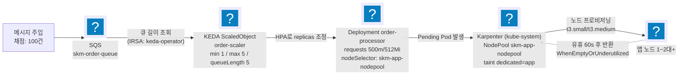
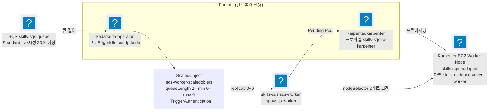

import { Quiz, QuizResults } from 'starlight-quiz/components';
import { Tabs, TabItem } from '@astrojs/starlight/components';

> 문서 유형: explanation

선행 지식과 학습 경로는 [모듈 개요](/part-4/15-eks-scaling/)에. 처음 보는 약어나 말은 [이 사이트의 말](/reference/glossary/)에 있다.

AZ(가용 영역)는 [vpc-basics](/start/vpc-basics/), IRSA(파드에 IAM 역할을 붙이는 방식)는 [eks-basics](/start/eks-basics/)에 있다.

2과제의 오토스케일링 유형을 다룬다. **후보 세트 둘이 같은 체인을 다른 값으로 쓰기 때문에** 이 유형에는 이행 훈련이 붙는다 — 한쪽을 익히면 다른 쪽은 값 몇 개의 차이로 읽힌다.

절 구성은 ① 도식 ② 언제 나오나 ③ 핵심 연결 고리 ④ 채점이 보는 상태 ⑤ 변형 포인트 ⑥ 퀴즈다.

- **유형 3 — 이벤트 기반 오토스케일링** · set-07 task-2 module-3 — SQS 큐 길이가 KEDA 로 파드를, Karpenter 로 노드를 늘리는 2단 스케일링.
- **유형 3 변형 — Fargate 컨트롤러 + SQS** · set-08 task-2 module-4 — 같은 체인에서 컨트롤러만 Fargate 로 올리고 파라미터를 뒤집은 구성.

같은 파트의 나머지 유형은 [16. 컨테이너 로깅](/part-4/16-container-logging/)과 [17. 스트리밍](/part-4/17-streaming/)으로 갈라져 있다.

---

## 유형 3 — 이벤트 기반 오토스케일링 (SQS → KEDA → Karpenter)

큐에 쌓인 메시지 수 하나로 파드와 노드를 함께 늘리고 줄이는 패턴이다.

실측 근거: set-07 task-2 module-3 (ap-northeast-2, skm- 접두어) — 2026-07-31 실채점에서 `mark3.sh` 전 항목(3-1~3-7) 통과 확정

HPA·KEDA·Karpenter 가 각각 무엇을 늘리는지는 [autoscaling-basics](/start/autoscaling-basics/)에, SQS 의 가시성 제한 시간은 [serverless-basics 의 SQS 절](/start/serverless-basics/#5-sqs--가시성-제한-시간이-핵심이다)에 있다.

### ① 도식



<details class="diagram-note">
<summary>이 도식이 보여주는 것</summary>

큐 길이 하나가 파드와 노드를 차례로 늘리는 경로다. KEDA 는 IRSA 로 SQS 길이를 읽어 HPA 를 통해 replicas 를 올리고, 늘어난 파드가 스케줄될 자리를 못 찾으면 그 Pending 을 보고 Karpenter 가 노드를 만든다. 점선이 축소 경로다 — 노드는 비거나 저활용 상태로 60초가 지나야 반환된다. 파드 축소와 노드 축소가 시차를 두는 이유다.

</details>

2단 스케일링: 큐 길이가 Pod 수를 늘리고(KEDA), Pod가 노드에 안 들어가면 노드가 늘어난다(Karpenter). 축소도 2단: 큐가 비면 Pod 1로, 노드가 비면 1대로.

### ② 언제 이 패턴이 나오나

- 과제지에 "메시지 폭주 시 자동 확장", "KEDA", "Karpenter", "큐 길이 기반 스케일링", "유휴 시 노드 반환" 키워드.
- 채점이 "메시지 N건 주입 → 관찰 → purge → 관찰"의 부하 시나리오 구조면 확정.

### ③ 핵심 연결 고리

1. **queueLength 5 → 메시지 100건이면 목표 Pod 20이지만 max 5로 캡** — 그래서 채점 기대가 "Pod ≥ 5".
2. **Pod requests 500m × 5 = 2.5 vCPU > t3.medium allocatable ~1.9 vCPU** → 한 대에 다 못 들어가 Pending 발생 → Karpenter가 2대째를 띄운다. 채점 기대 "Node ≥ 2"는 이 계산에서 나온다. requests를 줄이면 노드가 안 늘어나 오답. 노드 수를 정하는 것이 Pod 개수가 아니라 `requests` 합이라는 원리는 [autoscaling-basics 의 해당 절](/start/autoscaling-basics/#노드-수는-pod-수가-아니라-requests-합이-정한다)에 있다.

:::danger[스케일인 시간 예산 150초 — 어느 값도 늘리지 않는다]
HPA behavior `scaleDown.stabilizationWindowSeconds`(기본 300초 → **15초**) + `policies: Percent 100/15s`(이건 이미 기본값이라 명시만 하는 것) + NodePool `consolidateAfter: 60s`가 한 쌍. 이 세 값이 왜 합산으로 움직이는지는 [autoscaling-basics 의 수렴 시간 절](/start/autoscaling-basics/#수렴-시간은-타이머-세-개의-합이다)에 있다. purge를 HPA sync(~15초)가 감지해 ~35초에 Pod 1, consolidateAfter 60초 뒤 ~140초에 노드 1로 수렴한다(실채점 확정). 기본값 300이면 Pod 축소만 5분이라 150초 창을 구조적으로 못 맞춘다. ScaledObject에 `pollingInterval`은 두지 않는다 — `minReplicaCount ≥ 1`이면 1→N 스케일링을 HPA가 자기 sync 주기로 돌리므로 이 값이 감지 속도를 바꾸지 못한다(당일 변경으로 min=0이 되면 재도입).
:::

:::caution[이 시간 요건은 과제지에 없다 — 채점 스크립트에만 있다]
과제지는 스케일인 시간을 명시하지 않는다. 요건은 `mark3.sh`의 대기 루프 `for i in $(seq 1 30)`(5초 간격 = **실질 150초**)에만 존재하고, 채점지 문구는 "최대 3분 대기"라 셋이 서로 다르다. 과제지만 읽고 기본 설정으로 만들면 **실측 182초**가 걸려 그대로 실패한다 — 채점 스크립트를 먼저 읽어야 하는 이유를 보여 주는 대표 사례다.

여유가 없다는 점도 함께 안다. 환경에 따라 Karpenter 통합과 EC2 종료가 150초를 넘겨 `Final Pods 1 / Final Nodes 2`로 끝나는 경우가 보고됐고(`seq 1 60`으로 늘리면 정상 수렴), 반복 횟수 상향이 요청된 상태다. 상향 전까지는 **150초를 기준으로 맞추고**, 검증 직전 노드가 이미 1대인 상태에서 시작한다.
:::

3. **`identityOwner: operator`** — SQS 조회 자격증명을 keda-operator SA의 IRSA에서 가져온다. 앱 Pod의 권한과 무관.
4. **Karpenter 디스커버리 태그**: EC2NodeClass의 `selectorTerms`가 서브넷은 `karpenter.sh/discovery: skm-eks-cluster` 태그(terraform이 부착), SG는 `aws:eks:cluster-name` 태그로 찾는다. 태그가 없으면 NodeClass가 서브넷/SG를 못 찾아 노드가 안 뜬다. 노드에 붙는 `karpenter.sh/nodepool` 라벨은 Karpenter가 프로비저닝을 마친 뒤 붙이는 결과값이라 디스커버리 입력이 아니고, 서브넷의 `kubernetes.io/role/internal-elb` 태그는 LBC가 내부 ALB 서브넷을 고를 때만 쓴다.
5. **NodePool taint `dedicated=app:NoSchedule`** + Deployment toleration + nodeSelector — 앱만 Karpenter 노드에, addon(KEDA·Karpenter 자신·coredns)은 addon 노드그룹에 격리.


<details class="build-step">
<summary>지금 확인하기 — 150초라는 요건이 어디에 적혀 있나</summary>

과제지에 없는 요건을 채점 스크립트에서 직접 확인한다. **파일을 읽을 뿐이라 과금이 없고 계정도 필요 없다.**

<Tabs syncKey="shell">
  <TabItem label="PowerShell">
  ```powershell
  Select-String -Pattern 'seq 1 |sleep ' -Path $HOME\skills-2026\set-07\task-2\mark\mark3.sh | Select-Object -First 6
  ```
  </TabItem>
  <TabItem label="Bash (Linux/CloudShell)">
  ```bash
  grep -nE 'seq 1 |sleep ' ~/skills-2026/set-07/task-2/mark/mark3.sh | head -6
  ```
  </TabItem>
</Tabs>

기대: 대기 루프가 `for i in $(seq 1 30)` 이고 안쪽에 5초 `sleep` 이 있다. **30 × 5 = 150초** — 이 곱셈이 요건의 전부다. 과제지에도 채점기준표에도 이 숫자는 없다.

출력이 비면 정답지 클론 경로가 다른 것이다. [사전 준비 §4 저장소 클론](/start/#4-저장소-클론)의 경로를 확인한다.

</details>

### ④ 채점이 보는 상태

- 스케일아웃: 메시지 100건 주입 → 3분 관찰 → **Max Ready Pods ≥ 5 / Max App Nodes ≥ 2**.
- 스케일인: purge → 3분 관찰 → **Final Pods 1 / Final Nodes 1** (대기 최대 2.5분).
- **Deployment env는 리터럴 정확 3개만** — `AWS_REGION`, `SQS_QUEUE_URL`, `PROCESSING_TIME`. 채점은 컨테이너 스펙의 name=value 쌍을 정확 비교한다. `valueFrom`이나 `envFrom`으로 바꾸면 스펙에 값 자체가 없어 불일치로 잡히고, 개수가 3개를 넘어도 불일치다.
- 이름 정확 일치: `skm-order-queue`, `skm-eks-cluster`, `order-processor`, `order-scaler`, `skm-app-nodepool`, `skm-app-nodeclass`.
- **addon 노드 1대(t3.medium) 용량이 빠듯** — coredns 2 + KEDA 3 + Karpenter 1. Karpenter requests를 0.5 vCPU/512Mi로 낮춰 설치한다.
- **Karpenter는 `--set replicas=1`로 설치한다** — 차트 기본 2 + required podAntiAffinity(hostname) + 자기 NodePool 노드를 배제하는 nodeAffinity 때문에, 채점이 1/1/1로 고정한 addon 노드 1대에선 두 번째 Pod가 앉을 자리가 구조적으로 없어 `helm --wait`가 영원히 안 끝난다. 행 상태에서 중단하면 release가 `pending-upgrade`로 잠겨 재-upgrade가 막힌다 — `helm uninstall karpenter -n kube-system` 후 재설치.
- **KEDA Pod가 Pending이면 차트 tolerations 스키마부터** — addon 노드가 taint돼 있어 toleration 필요. 차트 버전에 따라 키가 바뀌므로 `helm show values kedacore/keda | grep -A3 tolerations`로 확인.


<details class="build-step">
<summary>지금 확인하기 — 차트가 toleration 을 어떤 키로 받나</summary>

addon 노드에 taint 가 걸려 있어 KEDA 파드가 `Pending` 이 되는 일이 잦다. 차트가 그 값을 어떤 이름으로 받는지는 **버전마다 다르므로** 설치 전에 확인한다. 값 조회뿐이라 과금이 없다.

```bash
helm repo add kedacore https://kedacore.github.io/charts 2>/dev/null
helm show values kedacore/keda --version 2.20.1 | grep -nE 'tolerations|nodeSelector|resources' | head -10
```

기대: `tolerations` 와 `nodeSelector` 키가 **컴포넌트별로 따로** 나온다. operator 하나만 고치면 나머지 파드가 그대로 `Pending` 에 남는다.

`Error: no repositories` 가 나오면 첫 줄의 `helm repo add` 가 실패한 것이다. 사내망이라 막혔다면 정답지의 `README.md` 에 적힌 값과 대조하는 것으로 대신한다.

</details>

### ⑤ 변형 포인트

세트가 바뀌어도 SQS → KEDA → Karpenter 체인은 그대로 남고, 이름·수치·시간 예산이 움직인다. set-08 module-4 에서 실제로 갈린 축은 `유형 3 변형` 절의 대조표에 있다.

| 바뀌는 값 | 고칠 곳 | 확인 |
|---|---|---|
| 접두어·리전 | ScaledObject 의 `queueURL`, Deployment env `SQS_QUEUE_URL`·`AWS_REGION` | 이름 6종 정확 일치 |
| `queueLength` · `maxReplicaCount` | ScaledObject `order-scaler` | Max Ready Pods 기대치 |
| Pod `requests` | Deployment `order-processor` | Max App Nodes 기대치 |
| 스케일인 제한 시간 | HPA `scaleDown.stabilizationWindowSeconds`, NodePool `consolidateAfter` | `mark3.sh` 대기 루프 `seq 1 30` |
| 클러스터 이름 | 서브넷 `karpenter.sh/discovery` 태그 값, EC2NodeClass `selectorTerms` | Karpenter 노드 생성 여부 |
| `minReplicaCount` | ScaledObject | 0 이면 `pollingInterval` 필수 |

`minReplicaCount` 행이 가장 위험하다. 이 값이 1 이상이면 `pollingInterval` 이 감지 속도를 바꾸지 못해 지우는 것이 정답이고, 0 이면 KEDA 오퍼레이터가 직접 폴링하므로 반드시 둬야 한다. 세트를 옮길 때 `minReplicaCount` 부터 읽는다.

### ⑥ 퀴즈

<Quiz title="Node ≥ 2 가 나오는 계산">
채점 기대 "Max App Nodes ≥ 2"는 어떤 숫자 계산에서 나오나?

- [x] Pod requests 500m × 5 Pod = 2.5 vCPU > t3.medium allocatable ~1.9 vCPU → 한 대에 다 못 들어가 Pending 발생 → Karpenter가 2대째를 프로비저닝
- [ ] queueLength 5에 메시지 100건이면 목표 Pod가 20이고, 노드당 10 Pod씩 배치되어 2대가 된다
  > 목표 20은 ScaledObject `max 5`에서 캡된다. 실제로 뜨는 Pod는 5개이고, 노드 수는 Pod 수가 아니라 requests 합으로 결정된다.
- [ ] NodePool에 최소 노드 수 2가 설정돼 있어서
  > Karpenter NodePool에는 최소 노드 수 개념이 없다. 노드는 Pending Pod가 있을 때만 생긴다.
- [ ] Multi-AZ 요구가 있어 2개 AZ에 최소 1대씩 배치되기 때문
  > topologySpreadConstraints를 걸지 않았으므로 AZ 분산이 노드 수를 강제하지 않는다.

`requests`를 줄이면 5 Pod가 한 대에 다 들어가 노드가 안 늘어나고, "Node ≥ 2"가 깨진다. 이 채점 항목은 리소스 요청량으로 설계된 것이다.
</Quiz>

<Quiz title="scaleDown 기본 안정화 창">
HPA `behavior.scaleDown.stabilizationWindowSeconds`를 명시하지 않으면 기본값 [[300]] 초가 적용된다.

---

기본값이면 purge 후 Pod 5→1 축소만 5분 이상 걸려, 150초 창인 스케일인 채점(Final Pods 1 / Final Nodes 1)에 실패한다. 스케일인 시간 예산은 두 값이 한 쌍이다: HPA `scaleDown.stabilizationWindowSeconds`(기본 300 → 15)와 NodePool `consolidateAfter: 60s`. 같이 적는 `Percent 100/15s` 는 `scaleDown.policies` 의 기본값이라 바뀌는 값이 아니다. **어느 값도 늘리지 않는다.** 감지 하한은 ScaledObject 설정이 아니라 HPA sync 주기(~15초)다 — `pollingInterval`은 min ≥ 1이면 감지 속도를 바꾸지 못하므로 두지 않는다.
</Quiz>

<Quiz title="KEDA의 SQS 조회 자격증명">
KEDA가 `skm-order-queue`의 큐 길이를 폴링할 때 쓰는 자격증명은?

- [x] `identityOwner: operator` — keda-operator SA에 연결된 IRSA(skm-keda-policy)
- [ ] `identityOwner: workload` — 스케일 대상인 order-processor Pod의 SA IRSA
  > 대표 오개념. 큐를 읽는 주체는 앱 Pod가 아니라 KEDA 오퍼레이터다. workload로 두면 앱 SA에 SQS 권한이 없어 메트릭 조회가 실패하고 스케일아웃이 아예 일어나지 않는다.
- [ ] TriggerAuthentication에 Secret으로 넣은 액세스 키/시크릿
  > 정적 키는 최소권한·자격증명 관리 양쪽에서 감점 소지다. IRSA로 해결되는 문제다.
- [ ] 노드 인스턴스 프로파일(노드 역할)에 붙인 SQS 권한
  > 그 노드의 모든 Pod가 SQS 권한을 얻는다. 최소권한 위반이며 IRSA를 쓰는 이유가 사라진다.

SQS 조회 자격증명은 keda-operator SA의 IRSA에서 가져온다. 앱 Pod의 권한과는 무관하다.
</Quiz>

<QuizResults confetti />

---

## 유형 3 변형 — set-08 module-4 (Fargate 컨트롤러 + SQS, 오레곤 us-west-2)

근거: set-08 task-2 과제지, 2026-08-01 정정본의 판정 기준, `asgmt2_module4_check.sh`. 정답 구현은 `skills-2026` `main` 의 `set-08/task-2/module-4-sqs-scaling`(`k8s/`·`app/Dockerfile`·Terraform)에 있다.

같은 SQS → KEDA → Karpenter 체인인데 **컨트롤러가 Fargate에 뜨고 파라미터가 정반대**다. set-07 module-3을 그대로 옮기면 거의 전 항목이 어긋난다 — 두 세트를 나란히 놓고 무엇이 왜 갈리는지 보는 것이 이 절의 목적이다.

### ① 도식



<details class="diagram-note">
<summary>이 도식이 보여주는 것</summary>

set-08 변형은 컨트롤러를 Fargate 에 올린다. KEDA·Karpenter 자신은 Fargate 프로파일로 뜨고, 워커 파드만 Karpenter 가 만든 EC2 노드에 간다 — 노드를 만드는 주체가 노드에 의존하면 0 에서 시작할 수 없기 때문이다. `min 0` 이라 큐가 비면 파드가 사라지고, 그때부터는 오퍼레이터가 큐를 직접 폴링해 0 에서 1 로 깨운다. 워커는 nodeSelector 두 개로 자기 노드풀에 고정된다.

</details>

컨트롤러(KEDA·Karpenter)는 Fargate, 워커는 Karpenter EC2. **Karpenter가 앉을 노드를 Karpenter가 만들어야 하는 닭-달걀 문제를 Fargate로 푸는 구조**다. set-07은 같은 문제를 "채점이 고정한 addon 노드그룹 1대"로 풀었다 — 그래서 set-07에는 `helm --set replicas=1` 함정이 있었고, 여기서는 Fargate가 Pod마다 노드를 주므로 그 함정이 없다.

### ② set-07 module-3과 무엇이 갈리나

| 항목 | set-07 module-3 | **set-08 module-4** |
|---|---|---|
| 컨트롤러 위치 | addon 노드그룹(EC2, 1/1/1 고정) | **Fargate 프로파일 2개** — 네임스페이스 `keda`·`karpenter` |
| Karpenter 네임스페이스 | `kube-system` | **`karpenter`** |
| `minReplicaCount` | 1 | **0** |
| `pollingInterval` | **두지 않는다**(min ≥ 1이면 스케일링이 HPA sync 주기를 따라 이 값이 실질적으로 무의미하다) | **15초 이하로 반드시 둔다** — min 0이라 0↔1 활성화를 오퍼레이터가 직접 폴링한다 |
| `cooldownPeriod` | 미지정 | **30초 이하** |
| `queueLength` / max | 5 / 5 | **2 / 6** |
| SQS 인증 | `identityOwner: operator` | **`TriggerAuthentication`**(`sqs-worker-trigger-auth`) |
| 노드 선택 | nodeSelector 1개 + toleration | **nodeSelector 2개**(`karpenter.sh/nodepool`·`skills-nodepool`) |
| 컨테이너 이미지 | 제공 Dockerfile 그대로 | **Dockerfile 직접 작성**(제공 `worker.py` + boto3) |

:::danger[pollingInterval — 세트가 바뀌면 정답이 뒤집힌다]
set-07에서는 `pollingInterval`을 **지우는 것**이 정답이었다. `minReplicaCount ≥ 1`이면 1→N 스케일링을 HPA가 자기 sync 주기로 돌리므로 `pollingInterval`은 실질적인 영향이 없다 — 이 값의 효과는 주로 scale-to-zero(0↔1) 시나리오에서 나타난다. set-08은 **`min 0`**이라 정반대다 — 0↔1 활성화는 HPA가 아니라 KEDA 오퍼레이터가 트리거를 직접 폴링해 판단하므로 `pollingInterval`이 실제 감지 지연을 결정하고, 과제지가 15초 이하를 요구한다. **필드 하나의 유효 여부가 `minReplicaCount` 값에 달려 있다** — 외운 값을 옮기지 말고 min이 0인지부터 본다.
:::

### ③ 핵심 연결 고리

1. **워커는 Fargate에 뜨면 안 된다.** Fargate 프로파일 셀렉터가 `keda`·`karpenter` 네임스페이스만 잡으므로 `skills-sqs` 네임스페이스는 자동으로 EC2 쪽이다. 여기에 nodeSelector 2개(`karpenter.sh/nodepool=skills-sqs-nodepool`, `skills-nodepool=event-worker`)를 걸어 Karpenter 노드로 고정한다 — 채점 4-5가 이 라벨 조합으로 노드와 Pod를 조회한다.
2. **NodePool 라벨은 Karpenter가 노드에 붙여 주는 값이다.** `skills-nodepool=event-worker`를 NodePool의 `spec.template.metadata.labels`에 선언해야 프로비저닝된 노드에 붙고, 그래야 워커의 nodeSelector가 만족된다. 선언을 빠뜨리면 Pod가 영원히 Pending이다.
3. **`spec.disruption.consolidationPolicy`가 필수 필드다.** 과제지가 명시적으로 요구하고, 채점 4-5가 이 필드가 비어 있지 않은지 본다. 정정본에서 조회가 YAML 전문 덤프에서 **`jq` 필드 추출**로 바뀌어 `name`·`labels`·`nodeClassRef`·`requirements`·`consolidationPolicy` 다섯 개만 출력된다 — 그중 하나가 비면 곧바로 감점이다.
4. **IRSA는 3개 ServiceAccount 전부.** `keda/keda-operator`, `karpenter/karpenter`, `skills-sqs/sqs-worker-sa`에 `eks.amazonaws.com/role-arn` annotation이 있어야 한다(채점 4-2가 이 annotation만 jsonpath로 뽑아 비어 있지 않은지 본다). 워커도 SQS를 직접 호출하므로 워커 SA에도 권한이 필요하다 — set-07은 KEDA만 큐를 읽었지만 여기서는 워커가 `receive_message`·`delete_message`를 한다.
5. **채점 환경 준비는 순번 0으로 분리됐다.** 정정본의 채점 스크립트는 `aws`·`kubectl`·`jq` 등이 없으면 직접 설치한다(`sudo dnf` + `~/.local/bin`). 그래도 배점 없는 이 절이 실패하면 그 모듈 채점이 아예 돌지 않으므로, 클러스터 엔드포인트는 CloudShell에서 접근 가능해야 하고(퍼블릭 엔드포인트 필요) `aws sts get-caller-identity`가 나와야 한다.
6. **메시지 12개 → Pod 6개는 계산된 값이다.** `queueLength 2`에 12건이면 목표 6, `max 6`에서 정확히 상한. 180초 안에 Pod가 늘고 Karpenter 노드가 뜨며 큐 depth가 줄어야 한다. `PROCESSING_SECONDS`를 크게 잡으면 큐가 안 줄고, 작게 잡으면 Karpenter가 노드를 띄우기 전에 처리가 끝나 노드 증가를 못 보여 준다 — 과제지 권장값 5를 쓴다.

:::note[정정본이 지운 두 가지 걱정 — 2026-08-01]
- **4-5 시점에 워커 Pod가 0개여도 감점되지 않는다.** `min 0`이라 큐가 비면 Pod와 노드가 없는 것이 정상 동작이고, 정정본은 "Pod의 EC2 배치는 4-6 스케일아웃 출력을 포함해 판정할 수 있다"고 명시했다. 검증 직전에 메시지를 흘려 노드를 미리 띄워 두는 것은 이제 필수가 아니라 선택이다.
- **스케일인 시간은 채점하지 않는다.** `ApproximateNumberOfMessagesNotVisible`이 남아 있어도 실패가 아니다 — 대기 메시지가 줄고 Pod가 처리 중이면 충족이다. set-07 module-3의 150초 스케일인 압박이 여기에는 없다.

대신 4-6이 큐에 메시지를 넣으므로 **4모듈의 마지막 항목으로 수행**한다.
:::


<details class="build-step">
<summary>지금 확인하기 — 두 세트의 ScaledObject 를 나란히 놓는다</summary>

이행에서 바뀌는 것이 정확히 무엇인지 파일 비교로 먼저 본다. **읽기만 하므로 과금이 없다.**

<Tabs syncKey="shell">
  <TabItem label="PowerShell">
  ```powershell
  $a = "$HOME\skills-2026\set-07\task-2\module-3-eks-scaling\k8s\30-keda-scaledobject.yaml"
  $b = "$HOME\skills-2026\set-08\task-2\module-4-sqs-scaling\k8s\30-keda-scaledobject.yaml"
  Compare-Object (Get-Content $a) (Get-Content $b) | Select-Object -First 20 SideIndicator, InputObject
  ```
  </TabItem>
  <TabItem label="Bash (Linux/CloudShell)">
  ```bash
  diff ~/skills-2026/set-07/task-2/module-3-eks-scaling/k8s/30-keda-scaledobject.yaml \
       ~/skills-2026/set-08/task-2/module-4-sqs-scaling/k8s/30-keda-scaledobject.yaml
  ```
  </TabItem>
</Tabs>

기대: 유휴 파드 수와 폴링 주기, 트리거 인증 방식이 갈린다. **한쪽에만 있는 필드**가 이행의 핵심이다 — 값을 바꾸는 것이 아니라 필드가 생기고 사라진다.

차이가 전부처럼 보이면 들여쓰기까지 다른 것이니 필드 이름만 추려 본다.

</details>

### ④ 고정 이름·값

| 대상 | 값 |
|---|---|
| 리전 / 클러스터 | `us-west-2` / `skills-sqs-cluster` |
| Fargate 프로파일 | `skills-sqs-fp-keda`(ns `keda`) · `skills-sqs-fp-karpenter`(ns `karpenter`) |
| SQS | `skills-sqs-queue` · Standard · 가시성 제한 시간 30초 이상 |
| 워커 | ns `skills-sqs` / Deployment `sqs-worker` / SA `sqs-worker-sa` / 라벨 `app=sqs-worker` |
| 워커 환경변수 | `SQS_QUEUE_URL` · `AWS_REGION` · `PROCESSING_SECONDS`(5 권장) |
| KEDA | ns `keda` / Deployment `keda-operator` / `sqs-worker-scaledobject` / `sqs-worker-trigger-auth` |
| Karpenter | ns `karpenter` / Deployment `karpenter` / NodePool `skills-sqs-nodepool` / EC2NodeClass `skills-sqs-nodeclass` |
| 버전 | Karpenter 1.x · KEDA 2.x |

이 표의 값이 곧 변형 축이다. 세트가 바뀌면 리전과 접두어가 먼저 바뀌고, 그다음 ScaledObject 의 `minReplicaCount`·`pollingInterval`·`cooldownPeriod`·`queueLength` 네 수치가 바뀐다. 이름은 Fargate 프로파일 정의·NodePool·EC2NodeClass·워커 Deployment 네 곳에서 고치고, 수치는 ScaledObject 한 파일에서 고친다. 확인은 채점 항목이 대신한다 — 4-2 가 세 ServiceAccount 의 `eks.amazonaws.com/role-arn` annotation 을, 4-4 가 ScaledObject YAML 전문을, 4-5 가 NodePool 의 `name`·`labels`·`nodeClassRef`·`requirements`·`consolidationPolicy` 다섯 필드를 뽑아 본다.

### ⑤ 퀴즈

<Quiz title="pollingInterval을 지워야 하나 둬야 하나">
set-07 module-3에서는 ScaledObject의 `pollingInterval`을 삭제하는 것이 정답이었다. set-08 module-4에서 같은 판단을 적용하면?

- [x] 틀린다 — set-08은 `minReplicaCount: 0`이라 0↔1 활성화를 KEDA 오퍼레이터가 트리거를 직접 폴링해 판단하므로 `pollingInterval`이 실제 감지 지연을 결정하고, 과제지가 15초 이하를 요구한다
- [ ] 맞는다 — `pollingInterval`은 어떤 경우에도 HPA 폴링에 밀려 무효인 필드다
  > 무효가 되는 건 `minReplicaCount ≥ 1`일 때뿐이다. min 0에서는 활성화 판단 주체가 HPA가 아니라 KEDA 오퍼레이터다.
- [ ] 맞는다 — Fargate에서는 폴링 주기 설정이 무시되기 때문
  > 컨트롤러가 어디에 뜨는지와 폴링 주기는 무관하다.
- [ ] 둘 다 상관없다 — 채점은 min·max만 보므로
  > 과제지가 `pollingInterval 15초 이하`를 명시하고, 채점 4-4가 ScaledObject YAML 전문을 덤프해 확인한다.

**필드의 유효 여부가 다른 필드 값에 달려 있는 사례**다. 세트가 바뀌면 외운 값이 아니라 `minReplicaCount`가 0인지부터 본다.
</Quiz>

<Quiz title="컨트롤러를 Fargate에 올리는 이유">
KEDA·Karpenter를 Fargate 프로파일로 띄우는 구조가 해결하는 문제는?

- [x] Karpenter가 EC2 노드를 만드는 컨트롤러인데 정작 자신이 앉을 노드가 필요하다는 닭-달걀 문제 — Fargate는 Pod마다 컴퓨트를 주므로 관리형 노드그룹 없이 컨트롤러를 띄울 수 있다
- [ ] Fargate가 EC2보다 저렴해서 컨트롤러 비용을 줄이려는 것
  > 비용 최적화가 아니라 부트스트랩 구조의 문제다. 실제로 상시 구동 워크로드는 Fargate가 더 비싼 경우가 많다.
- [ ] KEDA가 EC2 노드에서는 SQS를 폴링할 수 없기 때문
  > set-07 module-3의 KEDA는 EC2 노드그룹 위에서 정상적으로 폴링한다.
- [ ] Fargate에서만 IRSA를 쓸 수 있기 때문
  > IRSA는 컴퓨트 종류와 무관하다. 두 세트 모두 IRSA를 쓴다.

set-07은 같은 문제를 "채점이 1/1/1로 고정한 addon 노드그룹"으로 풀었고, 그 대가로 Karpenter를 `replicas=1`로 낮춰야 하는 함정이 생겼다. Fargate는 Pod마다 컴퓨트를 주므로 그 제약 자체가 없다.
</Quiz>

<Quiz title="워커 Pod가 계속 Pending이다">
워커 Deployment에 nodeSelector `karpenter.sh/nodepool=skills-sqs-nodepool, skills-nodepool=event-worker`를 걸었는데 Karpenter가 노드를 띄운 뒤에도 Pod가 Pending이다. 가장 먼저 볼 곳은?

- [x] NodePool의 `spec.template.metadata.labels`에 `skills-nodepool=event-worker`가 선언돼 있는지 — Karpenter가 노드에 붙여 주는 라벨이라 선언이 없으면 셀렉터 두 개 중 하나가 영원히 안 맞는다
- [ ] Fargate 프로파일 셀렉터에 `skills-sqs` 네임스페이스를 추가해야 한다
  > 반대다. 워커는 Fargate가 아니라 Karpenter EC2 노드에서 돌아야 하므로 `skills-sqs`를 프로파일에 넣으면 요구사항 위반이다.
- [ ] `karpenter.sh/nodepool` 라벨을 노드에 수동으로 붙인다
  > 그 라벨은 Karpenter가 자동으로 붙인다. 수동으로 붙이면 다음 노드에서 또 막힌다.
- [ ] EC2NodeClass의 이름을 nodeSelector 값과 맞춘다
  > nodeSelector가 참조하는 것은 NodePool 이름과 사용자 정의 라벨이지 EC2NodeClass 이름이 아니다.

셀렉터가 두 개면 **양쪽 라벨이 모두 노드에 실제로 붙어야** 한다. `karpenter.sh/nodepool`은 Karpenter가 자동으로 붙이지만 `skills-nodepool=event-worker`는 NodePool 템플릿에 직접 선언해야 생긴다.
</Quiz>

<QuizResults confetti />

---
