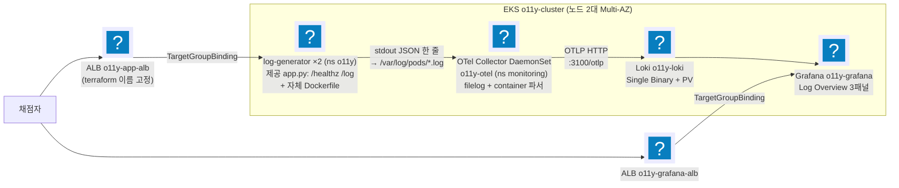

import { Quiz, QuizResults } from 'starlight-quiz/components';
import { Tabs, TabItem } from '@astrojs/starlight/components';

> 문서 유형: explanation

선행 지식과 학습 경로는 [모듈 개요](/part-4/16-container-logging/)에.

2과제의 컨테이너 로깅 유형을 다룬다. 앱이 표준 출력에 찍은 줄이 수집기를 거쳐 저장소에 쌓이고 대시보드에서 조회되기까지, **어느 고리 하나가 끊기면 어디에서 증상이 보이는지**가 이 문서의 요점이다.

기준본은 set-07 task-2 module-4 다. 리전은 `ap-northeast-1`(도쿄).

---

## 유형 4 — 컨테이너 로깅 파이프라인 (OTel → Loki → Grafana)

앱이 stdout 에 찍은 JSON 로그를 노드 로그 파일에서 걷어 Loki 에 넣고, Grafana 대시보드가 레벨별로 집계하는 패턴이다.

근거: set-07 task-2 module-4 (ap-northeast-1, o11y- 접두어) — **정답지 구현은 미착수**다. 아래는 과제지·채점지(`mark4.sh`) 기반 설계안이라, 이 유형만은 수치·차트 버전이 실측 전이다.

### ① 도식



<details class="diagram-note">
<summary>이 도식이 보여주는 것</summary>

유형 4 로그 파이프라인이다. 앱이 stdout 에 JSON 한 줄을 찍으면 노드의 로그 파일에 남고, OTel Collector DaemonSet 이 그 파일을 읽어 OTLP 로 Loki 에 넣는다. Grafana 는 Loki 를 데이터소스로 읽는다. 바깥의 ALB 둘은 Terraform 이 이름을 고정해 만들고 TargetGroupBinding 으로 각각 앱과 Grafana 에 연결된다 — 채점자가 그 두 주소로 들어온다.

</details>

### ② 언제 이 패턴이 나오나

- "컨테이너 로그 수집", "OpenTelemetry", "Loki", "Grafana 대시보드", "레벨별 로그 집계" 키워드.
- ALB/TG **이름**이 채점 대상이면 LBC Ingress(이름 지정 불가) 대신 terraform ALB + TargetGroupBinding 패턴 확정.

### ③ 핵심 연결 고리

1. **제공 Dockerfile 결함** — flask 미설치 + requirements.txt 없음 → 그대로 빌드하면 CrashLoop. **자체 Dockerfile로 빌드하되 제공 app.py는 수정 금지.** (대회 당일 제공본이 수정돼 있으면 제공본 우선.)
2. **filelog `container` 파서 체인**: `/var/log/pods/*/*/*.log` 수집 → container 파서가 CRI 포맷(타임스탬프/스트림 접두어)을 분해하고 **파일 경로에서 k8s.namespace.name/pod.name/pod.uid를 리소스 속성으로 추출** → **body는 앱이 찍은 원본 JSON 한 줄 그대로** 유지. 본문을 가공하면 Loki에서 `| json` 파싱이 깨진다.
3. **Loki OTLP 인제스트**: exporter `otlphttp` → `http://o11y-loki...:3100/otlp`. Loki 3.x가 `k8s.namespace.name` 리소스 속성을 인덱스 라벨 `k8s_namespace_name`으로 **자동 승격** — 채점 LogQL `{k8s_namespace_name="o11y"}`와 정확히 맞물린다. 승격 대상은 리소스 속성뿐이고 로그 속성은 승격되지 않으므로, body에서 필드를 더 뽑아도 인덱스 라벨은 늘지 않는다. 대신 body 원본이 훼손돼 `| json` 파싱이 깨진다.
4. **자기 로그 exclude** — 콜렉터 자신의 로그(`monitoring_o11y-otel*`)를 수집에서 제외해 루프 방지.
5. **ALB/TG는 terraform으로 이름 고정 + TargetGroupBinding으로 Pod 연결.** TGB는 CRD라 **LBC 설치 이후에만 apply 가능** — 순서 의존. 두 방식을 고르는 기준은 [loadbalancer-basics 의 판단 표](/start/loadbalancer-basics/#5-5-판단-표)에 있다.
6. **대시보드 쿼리**: `sum by (level) (...)` + legendFormat `{{level}}` — 범례가 INFO/WARN/ERROR로 떠야 한다. level 값은 **대문자 ERROR**.


<details class="build-step">
<summary>지금 확인하기 — 파서가 파일 경로에서 무엇을 뽑나</summary>

라벨이 어디서 오는지는 수집기 설정 한 곳에 적혀 있다. **정답지 파일을 읽을 뿐이라 과금이 없다.**

<Tabs syncKey="shell">
  <TabItem label="PowerShell">
  ```powershell
  Select-String -Pattern 'include:|type: container|k8s\.|otlphttp|exclude' `
    -Path $HOME\skills-2026\set-07\task-2\module-4-container-logging\k8s\20-otel-collector.yaml |
    Select-Object -First 12
  ```
  </TabItem>
  <TabItem label="Bash (Linux/CloudShell)">
  ```bash
  grep -nE 'include:|type: container|k8s\.|otlphttp|exclude' \
    ~/skills-2026/set-07/task-2/module-4-container-logging/k8s/20-otel-collector.yaml | head -12
  ```
  </TabItem>
</Tabs>

기대: 수집 경로 글롭, `container` 파서, 그리고 `k8s.` 로 시작하는 리소스 속성 이름들이 보인다. **라벨은 로그 본문이 아니라 파일 경로에서 나온다** — 그래서 본문을 가공해도 인덱스 라벨은 늘지 않는다.

`exclude` 줄도 함께 본다. 수집기가 자기 로그를 다시 먹으면 루프가 된다.

</details>

### ④ 채점이 보는 상태

- 리소스 조회: `log-generator` 2 replica(o11y), ds `o11y-otel`, svc `o11y-loki` ClusterIP 3100, deploy `o11y-grafana` — 이름·네임스페이스 정확 일치.
- LogQL 채점: `{k8s_namespace_name="o11y"} | json | level="ERROR"`가 결과를 반환해야 함.
- **Grafana는 웹 수동 채점 항목 존재** — 로그인/Datasource/Log Overview 3패널.


<details class="build-step">
<summary>지금 확인하기 — Loki 차트가 여는 것</summary>

포트와 인제스트 경로를 설치 전에 확인한다. 값 조회뿐이라 과금이 없다.

```bash
helm repo add grafana-community https://grafana-community.github.io/helm-charts 2>/dev/null
helm show values grafana-community/loki --version 18.7.1 | grep -nE 'port|otlp|singleBinary|persistence' | head -12
```

기대: HTTP 포트 `3100` 과 단일 바이너리 배포 옵션이 보인다. **저장소 설정이 `grafana/loki` 가 아니라 `grafana-community` 인 것**도 함께 확인한다 — 이름이 비슷한 다른 차트가 있다.

`no repositories` 가 나오면 첫 줄이 실패한 것이다. 망이 막혔다면 정답지 `helm/loki-values.yaml` 의 값과 대조하는 것으로 대신한다.

</details>

:::note[배포본 v5에서 완화·확정된 것들]
정답 구현이 들어오기 전에는 배포 자료의 `CHANGELOG.txt` 가 유일한 근거였다. 지금은 `set-07/task-2/module-4-container-logging` 에 구현이 있으므로 둘을 함께 본다 — 아래 항목은 배포 자료 쪽 근거다.

- **로그 확인(4-5)이 정확 일치에서 부분 일치로 바뀌었다.** 기준은 "출력된 로그 중 **3분 이내로 기록된 로그가 있으면 득점**" — 로그 본문 전체를 맞출 필요가 없고 **최근성**만 보면 된다. 채점 직전에 트래픽을 한 번 흘려 두는 것으로 충족된다.
- **모든 EKS 노드의 TZ를 KST로** 설정하라는 지시가 추가됐다.
- **범례는 plain text로 출력**해야 한다(`{level="ERROR"}` 같은 라벨 표기가 아니라 `ERROR`). `legendFormat`을 `{{level}}`로 두는 이유가 이것이다.
- 대시보드는 이미지대로 구성하되 **Panel type이 명시**됐다 — 패널 종류를 임의로 고르지 않는다.
:::

:::caution[No Data 패널이 하나라도 있으면 오답]
채점 전 `/log?level=info`, `/log?level=warn`, `/log?level=error`를 각각 호출해 3레벨 데이터를 미리 만든다. 그 레벨의 로그가 한 번도 생성된 적이 없으면 패널의 시간 범위를 늘려도 데이터가 나오지 않는다. 패널을 지워 회피할 수도 없다 — Log Overview는 3패널 요구라 삭제하면 패널 누락으로 오답이다.
:::

- 범례가 `{level="ERROR"}` 형태면 오답 — legendFormat `{{level}}` 유지.
- ALB 타깃 healthy까지 1~2분 — 채점 직전 `curl /healthz`로 확인.


<details class="build-step">
<summary>지금 확인하기 — 채점이 던지는 질의를 그대로 읽는다</summary>

무엇을 만족시켜야 하는지는 채점 스크립트에 문자열로 박혀 있다. **파일 읽기뿐이라 과금이 없다.**

<Tabs syncKey="shell">
  <TabItem label="PowerShell">
  ```powershell
  Select-String -Pattern 'query_range|k8s_namespace_name|kubectl get|3100' `
    -Path $HOME\skills-2026\set-07\task-2\mark\mark4.sh | Select-Object -First 8
  ```
  </TabItem>
  <TabItem label="Bash (Linux/CloudShell)">
  ```bash
  grep -nE 'query_range|k8s_namespace_name|kubectl get|3100' ~/skills-2026/set-07/task-2/mark/mark4.sh | head -8
  ```
  </TabItem>
</Tabs>

기대: LogQL 이 `{k8s_namespace_name="o11y"} | json | level="ERROR"` 이고, 시간 범위가 **3분 이내**로 잘려 있다. 라벨 이름 하나, 레벨 값의 대소문자 하나가 어긋나면 결과가 빈다.

이 한 줄이 네임스페이스 이름·라벨 승격·로그 본문 형식 셋을 동시에 묶는다.

</details>

### ⑤ 퀴즈

<Quiz title="제공 Dockerfile 결함">
제공된 Dockerfile을 그대로 써서 log-generator를 빌드하면 어떻게 되고, 무엇을 지켜야 하나?

- [x] flask 미설치 + requirements.txt 없음 → Pod가 CrashLoop. 자체 Dockerfile로 빌드하되 제공 `app.py`는 수정 금지(당일 제공본이 고쳐져 있으면 제공본 우선)
- [ ] `app.py` 상단에 `pip install flask`를 실행하는 코드를 넣어 런타임에 설치한다
  > 제공 `app.py`는 수정 금지 대상이다. 결함은 Dockerfile 쪽에서 고친다.
- [ ] requirements.txt만 추가하면 제공 Dockerfile이 자동으로 설치한다
  > 제공 Dockerfile에는 `pip install -r requirements.txt` 단계 자체가 없다. 파일만 추가해도 설치되지 않는다.
- [ ] 베이스 이미지를 `python:slim`으로 바꾸면 flask가 포함되어 해결된다

고치는 곳과 건드리면 안 되는 곳을 구분하는 문제다. Dockerfile은 자체 작성, `app.py`는 원본 유지.
</Quiz>

<Quiz title="k8s_namespace_name 라벨의 출처">
채점 LogQL이 `{k8s_namespace_name="o11y"}`로 조회된다. 이 라벨이 존재하게 만드는 메커니즘을 **모두** 고르시오.

- [x] filelog의 `container` 파서가 파일 경로에서 `k8s.namespace.name`을 리소스 속성으로 추출
- [x] Loki 3.x의 OTLP 인제스트가 그 리소스 속성을 인덱스 라벨 `k8s_namespace_name`으로 자동 승격
- [ ] otlphttp exporter의 `resource_to_telemetry_conversion`이 리소스 속성을 라벨로 변환
  > Loki 쪽 자동 승격으로 이미 해결된다. 이 옵션은 메트릭 파이프라인의 설정이다.
- [ ] Grafana 데이터소스의 derived field가 점(`.`)을 밑줄(`_`)로 치환

OTel 쪽 추출과 Loki 쪽 승격의 **합작**이다. 둘 중 하나라도 빠지면 채점 쿼리의 라벨 셀렉터가 아무것도 반환하지 않는다.
</Quiz>

<Quiz title="본문에 파서를 더 얹으면">
OTel filelog 파이프라인에서 로그 본문(body)에 파서를 하나 더 얹어 필드를 추출하면 왜 위험한가?

- [x] body의 원본 JSON 한 줄이 변형되면 채점 쿼리의 `| json` 파싱이 깨진다 — `container` 파서 외 본문 변형 금지
- [ ] 추출된 필드가 Loki에서 인덱스 라벨로 자동 승격돼 카디널리티(라벨이 가질 수 있는 서로 다른 값의 가짓수)가 폭발한다
  > 자동 승격 대상은 **리소스 속성**이다. 로그 속성은 승격되지 않으므로 카디널리티 문제는 생기지 않는다. 진짜 문제는 body 훼손이다.
- [ ] 파서 체인이 길어져 콜렉터 CPU가 올라가 로그가 유실된다
  > 성능 이슈일 수는 있으나 채점이 깨지는 이유는 아니다.
- [ ] level 값이 소문자로 정규화되어 `level="ERROR"` 조건에 걸리지 않는다

`container` 파서는 CRI 포맷(타임스탬프/스트림 접두어)을 벗기고 파일 경로에서 k8s 메타데이터를 뽑는 데까지만 관여하고, **body는 앱이 찍은 원본 JSON 한 줄 그대로** 남긴다. Loki에서 `| json`이 그 원본을 파싱한다.
</Quiz>

<Quiz title="TargetGroupBinding apply 실패">
`TargetGroupBinding` apply가 실패한다. 순서 관점에서 원인은?

- [x] TGB는 LBC(AWS Load Balancer Controller)가 제공하는 CRD라서, LBC helm 설치 전에는 CRD가 없어 apply할 수 없다
- [ ] terraform이 ALB/TG를 아직 만들지 않아 참조할 ARN이 없어서
  > 그것도 순서 문제지만 오류 메시지가 다르다. `no matches for kind "TargetGroupBinding"`은 리소스 타입 자체가 없다는 뜻, 즉 CRD 부재 신호다.
- [ ] 대상 Pod가 아직 Ready가 아니라 타깃 등록이 되지 않아서
  > TGB apply 자체는 성공하고, 타깃이 unhealthy로 남을 뿐이다.
- [ ] TGB는 클러스터 스코프 리소스라 네임스페이스를 지정하면 실패해서

순서 의존: LBC helm 설치 → CRD 등록 → TGB apply. ALB/TG 이름이 채점 대상이므로 LBC Ingress(이름 지정 불가) 대신 terraform ALB + TGB 패턴을 쓰는데, 그 대가가 이 순서 제약이다.
</Quiz>

<Quiz title="No Data 패널">
Grafana Log Overview의 패널 하나가 No Data다. 코드 수정 없이 통과시키는 방법은?

- [x] 해당 레벨로 `/log?level=...`를 호출해 데이터를 만든 뒤 채점받는다 — info/warn/error 3레벨을 모두 미리 호출해 두는 것이 정석
- [ ] 패널의 시간 범위를 24시간으로 늘려 과거 데이터를 잡는다
  > 그 레벨의 로그가 애초에 생성된 적이 없으면 범위를 늘려도 없다.
- [ ] legendFormat을 `{level="ERROR"}` 형태로 바꾸면 표시된다
  > 범례 형식은 No Data와 무관하고, 오히려 그 형태로 뜨면 그 자체가 오답이다. legendFormat은 `{{level}}`을 유지한다.
- [ ] No Data 패널을 삭제해 감점을 피한다
  > Log Overview는 3패널 요구다. 삭제하면 패널 누락으로 오답이다.

Grafana는 웹 수동 채점 항목이 있고, **No Data 패널이 하나라도 있으면 오답**이다. 채점 전 3레벨 데이터를 미리 만들어 두고, ALB 타깃이 healthy인지도 `curl /healthz`로 확인한다. level 값은 **대문자 ERROR**다.
</Quiz>

<QuizResults confetti />

---

