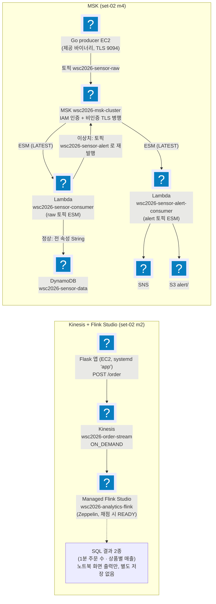

import { Quiz, QuizResults } from 'starlight-quiz/components';
import { Tabs, TabItem } from '@astrojs/starlight/components';

> 문서 유형: explanation

선행 지식과 학습 경로는 [모듈 개요](/part-4/17-streaming/)에.

2과제의 스트리밍 유형을 다룬다. 갈래가 둘이다 — **Kinesis + Flink Studio 노트북**과 **MSK + Lambda 컨슈머**. 기준본은 set-02 task-2 의 module-2·module-3 이다.

이 유형만 실제 배포가 선택이다. MSK 는 apply 만 35분이 걸려(실측) 하루 일정을 통째로 먹는다. 그래서 **정답지 대조로 채점 항목을 확인하는 것**이 필수 경로이고, 배포는 여유가 있을 때의 선택이다.

---

## 유형 5 — 스트리밍 (Kinesis + Flink Studio / MSK) — 아키텍처 + :badge[함정]{variant=danger} 대조

실측 근거: set-02 task-2 module-2(Flink Studio), module-4(MSK). 후보 세트에 포함돼 있어 출제 가능성이 있다 — 배포하지 않아도 아래 아키텍처·채점 항목·함정을 정답지 코드와 대조해 두면 학습 목표를 채울 수 있다. 실제 배포 절차(선택)는 [실습](/part-4/17-streaming/lab/)에 있다.

### ① 도식



<details class="diagram-note">
<summary>이 도식이 보여주는 것</summary>

유형 5 두 갈래를 나란히 놓았다. 위쪽은 Flask 앱이 Kinesis 로 주문을 흘리고 Flink Studio 노트북이 SQL 두 개를 돌리는 구성이라, 결과는 노트북 화면에만 남고 별도 저장소가 없다. 아래쪽 MSK 는 토픽이 둘이다 — 원본 토픽을 읽은 함수가 정상 데이터는 DynamoDB 에 넣고 이상치는 경보 토픽으로 되쏜다. 그 경보 토픽을 두 번째 함수가 다시 읽어 SNS 와 S3 로 보낸다. 같은 클러스터를 두 번 지나는 구조가 이 아키텍처의 특징이다.

</details>

### ② 언제 이 패턴이 나오나

- "실시간 스트리밍", "Kinesis", "Flink/Zeppelin 노트북 SQL 분석", "MSK/Kafka", "Lambda 컨슈머" 키워드.
- Flink "애플리케이션 프로그래밍 금지" 조건이 있으면 Studio Notebook(Zeppelin) 확정.

### ③ 핵심 연결 고리 — Kinesis + Flink Studio

1. **Flink Studio는 terraform provider 미지원** (`aws_kinesisanalyticsv2_application`이 zeppelin 설정 블록 미지원) → **`aws_cloudformation_stack`으로 래핑**해 생성.
2. **Kinesis SQL 커넥터를 Maven 의존성으로 명시 주입** — 콘솔 위저드는 자동 추가하지만 bare CFN은 아니라서 `Could not find any factory for identifier 'kinesis'` 발생. `CustomArtifactsConfiguration`에 `flink-sql-connector-kinesis:1.15.4`. 커넥터 변경 후엔 노트북을 새 세션으로.
3. **bare timestamp 파싱 우회**: 프로듀서가 `2026-07-13 08:10:51`(T/Z 없음)을 보낸다. TIMESTAMP_LTZ로 직접 파싱하면 DateTimeParseException, TIMESTAMP(3)로 파싱하면 CURRENT_TIMESTAMP 비교에서 Incomparable types → **베이스 테이블은 `TIMESTAMP(3)`로 파싱, 뷰에서 `TIMESTAMP_LTZ(3)`로 CAST**해 둘 다 우회.
4. **`%flink.conf parallelism.default 1`을 반드시 첫 문단에** — 인터프리터 기동 전에만 적용된다. shard보다 서브태스크가 많으면 나는 `ShardConsumer RejectedExecutionException` 원천 차단. 세션이 망가지면 인터프리터 재시작.
5. **Flink 역할 Glue 권한은 카탈로그 전체**(`database/*`, `table/*/*`) — Zeppelin이 hive/default DB도 GetDatabase로 탐침해서 좁히면 AccessDenied.
6. **SQL 결과는 노트북 화면에 표시될 뿐 어디에도 저장되지 않는다** — 두 `%flink.ssql(type=update)` 쿼리에 sink 커넥터를 두지 않았다. task.md는 "쿼리가 정상 실행"만 요구하고, mark 2-4도 애플리케이션 상태(`READY`/`ZEPPELIN-FLINK-3_0`)만 볼 뿐 쿼리 실행 결과는 채점하지 않는다 — 그래도 Run 상태에서 두 쿼리가 성공하는 시연 자체는 과제지 요구라 생략할 수 없다.


<details class="build-step">
<summary>지금 확인하기 — 35분이 어디서 나오는가</summary>

일정에 넣을 숫자를 실측 기록에서 직접 확인한다. **읽기만 하므로 과금이 없다.**

<Tabs syncKey="shell">
  <TabItem label="PowerShell">
  ```powershell
  Select-String -Pattern '실측|apply|destroy|분' -Path $HOME\skills-2026\set-02\task-2\NOTES.md |
    Select-String -Pattern 'MSK|클러스터|31|35|23' | Select-Object -First 8
  ```
  </TabItem>
  <TabItem label="Bash (Linux/CloudShell)">
  ```bash
  grep -nE 'MSK|클러스터' ~/skills-2026/set-02/task-2/NOTES.md | grep -E '31|35|23|분' | head -8
  ```
  </TabItem>
</Tabs>

기대: apply 35분(클러스터 하나가 31분 40초), destroy 23분이라는 실측이 나온다. **이 숫자가 당일 착수 순서를 정한다** — MSK 가 나오면 가장 먼저 apply 를 걸고 그동안 다른 모듈을 끝낸다.

출력이 비면 클론 경로를 확인한다. 숫자를 외우기보다 **어디를 보면 나오는지**를 기억한다.

</details>

### ③′ 핵심 연결 고리 — MSK

프로듀서는 Go 바이너리 EC2 하나, 컨슈머는 Lambda 둘이다 — `wsc2026-sensor-consumer`가 raw 토픽을, `wsc2026-sensor-alert-consumer`가 alert 토픽을 각각 별도 ESM으로 구독한다. 이상치는 sensor-consumer가 alert 토픽에 다시 발행해 alert-consumer로 넘어간다(도식의 루프백).

1. **MSK 클러스터 생성 ~30분** — EC2 user_data가 브로커 주소를 참조하므로 클러스터 ACTIVE 후 부팅. `-target`으로 EC2 먼저 만들지 말 것.
2. **제공 producer 바이너리는 SASL/IAM 불가** → 클러스터를 **IAM 인증 + 비인증 TLS(9094) 병행**으로 구성해 mark(Sasl.Iam.Enabled=True만 확인)를 통과시키는 실측 경로. 9098을 주면 `unexpected EOF: broker appears to be expecting TLS`.
3. **DynamoDB 전 속성 String 저장** — mark가 `temperature.S`/`status.S`를 조회한다. Number(`.N`)로 저장하면 0점.
4. **Lambda 런타임 python3.14 정확 일치** (aws provider 6.21+ 필요).
5. **ESM `starting_position = LATEST`** — 재배포 시 백로그 재처리 폭주 방지.
6. **MSK SG 셀프 참조 인바운드** — ESM 폴러 ENI가 클러스터 서브넷에서 브로커와 통신하는 데 필수.
7. **env 이름은 제공 문서 원문 그대로**: producer `BOOTSTRAP_SERVERS`(복수) / consumer `BOOTSTRAP_SERVER`(단수).


<details class="build-step">
<summary>지금 확인하기 — 인증 방식이 무엇을 켜고 포트가 어떻게 갈리나</summary>

MSK 인증 설정 한 덩어리가 브로커 포트와 클라이언트 요구사항을 동시에 정한다. **정답지 파일을 읽을 뿐이라 과금이 없다.**

<Tabs syncKey="shell">
  <TabItem label="PowerShell">
  ```powershell
  Select-String -Pattern 'sasl|iam|tls|unauthenticated|client_broker' `
    -Path $HOME\skills-2026\set-02\task-2\module-3-msk\terraform\msk.tf | Select-Object -First 12
  ```
  </TabItem>
  <TabItem label="Bash (Linux/CloudShell)">
  ```bash
  grep -niE 'sasl|iam|tls|unauthenticated|client_broker' \
    ~/skills-2026/set-02/task-2/module-3-msk/terraform/msk.tf | head -12
  ```
  </TabItem>
</Tabs>

기대: IAM 인증과 비인증 TLS 가 **동시에** 켜져 있다. 채점은 IAM 이 켜졌는지만 보고, 제공 프로듀서 바이너리는 IAM 을 못 쓰기 때문이다 — 하나만 켜면 둘 중 하나가 깨진다.

포트를 잘못 주면 클라이언트가 `broker appears to be expecting TLS` 로 끊긴다. 증상이 인증 오류가 아니라 **연결 오류로 보이는 것**이 이 함정의 핵심이다.

</details>

### ④ 채점이 보는 상태

**Kinesis + Flink (mark 2-1~2-6)**

- 2-1 EC2 서브넷: `analytics-priv-a`(Name 태그 정확 일치).
- 2-2 ALB: 리스너 `80`/`HTTP`, TG `wsc2026-analytics-tg`/`5000`.
- 2-3-A Kinesis: `wsc2026-order-stream` / `ACTIVE` / `ON_DEMAND`.
- 2-3-B `POST /order` 응답 JSON의 5개 필드(`event_time`·`order_id`·`price`·`product_name`·`quantity`)가 전부 채워져야 한다.
- 2-5 `GET /health` → `{"status":"healthy"}` 정확 일치(대소문자 포함).
- 2-6 systemd `app` 유닛이 SSM 명령으로 `active`/`enabled` 둘 다 나와야 한다.

:::caution[검증 직전 Flink 상태는 READY]
`wsc2026-analytics-flink`가 **READY** / `ZEPPELIN-FLINK-3_0`이어야 한다(mark 2-4) — 시연(Run→RUNNING) 후 **반드시 Stop**해 READY로 복귀. RUNNING이면 오답. DDL은 Glue DB에 저장돼 Stop해도 유지된다. task.md가 "Flink 1.19"라 해도 mark가 `ZEPPELIN-FLINK-3_0`을 채점하면 **mark 우선**.
:::

**MSK (mark 4-1~4-5-B)**

- 4-1 DynamoDB `wsc2026-sensor-data`(PK `sensorId`/SK `timestamp`) + S3 `wsc2026-sensor-alert-bucket-<비번호>` head-bucket 성공.
- 4-2 Lambda `wsc2026-sensor-consumer`·`wsc2026-sensor-alert-consumer` 둘 다 런타임 `python3.14` 정확 일치.
- 4-3 MSK `wsc2026-msk-cluster` / `ACTIVE` / `3.6.0` / `kafka.t3.small` / `Sasl.Iam.Enabled` **`True`**.
- 4-4 두 Lambda의 이벤트 소스 매핑 상태가 **모두** `Enabled`.
- 4-5-A DynamoDB 스캔 결과가 `temperature.S`/`status.S`로 조회(문자열 저장 확인).
- 4-5-B `--output json` 으로 `SENSOR-002` 의 `sensorId`·`timestamp` **두 항목만** 조회하고, `timestamp`가 ISO 8601 KST(`2026-06-01T18:28:24+09:00`) 형식이면 정답(producer가 계속 돌고 있다는 증거).
- 4-1 의 S3 버킷 ARN 은 **비번호 부분을 제외하고** 채점한다.
- `wsc2026-alaytics-ec2-role` 의 오타는 정정으로 수정됐고 이 이름은 채점 대상이 아니다. "오타는 그대로" 원칙 자체는 유효하되 정정 공지를 먼저 본다.


<details class="build-step">
<summary>지금 확인하기 — 이벤트 소스 매핑이 어디서부터 읽나</summary>

두 Lambda 가 토픽을 어떻게 구독하는지 확인한다. 파일 읽기와 도움말뿐이라 과금이 없다.

<Tabs syncKey="shell">
  <TabItem label="PowerShell">
  ```powershell
  Select-String -Pattern 'starting_position|topics|event_source|batch' `
    -Path $HOME\skills-2026\set-02\task-2\module-3-msk\terraform\lambda.tf | Select-Object -First 10
  aws lambda create-event-source-mapping help | Select-String -Pattern 'LATEST|TRIM_HORIZON|StartingPosition' | Select-Object -First 5
  ```
  </TabItem>
  <TabItem label="Bash (Linux/CloudShell)">
  ```bash
  grep -nE 'starting_position|topics|event_source|batch' \
    ~/skills-2026/set-02/task-2/module-3-msk/terraform/lambda.tf | head -10
  aws lambda create-event-source-mapping help | grep -E 'LATEST|TRIM_HORIZON|StartingPosition' | head -5
  ```
  </TabItem>
</Tabs>

기대: 시작 위치가 `LATEST` 다. 도움말에 나오듯 다른 값은 **토픽에 쌓인 것을 처음부터 다시 읽는다** — 재배포할 때마다 백로그를 통째로 재처리해 채점 데이터가 중복된다.

`aws: command not found` 면 도움말 부분만 건너뛴다. 파일 쪽 확인만으로도 값은 보인다.

</details>

### ⑤ 퀴즈

<Quiz title="Flink Studio를 terraform으로">
Managed Flink Studio(`wsc2026-analytics-flink`)를 terraform으로 만들려면?

- [x] `aws_cloudformation_stack`으로 래핑해 생성한다 — provider의 `aws_kinesisanalyticsv2_application`이 zeppelin 설정 블록을 지원하지 않기 때문
- [ ] `aws_kinesisanalyticsv2_application`의 `application_configuration`에 zeppelin 블록을 넣는다
  > 바로 그 블록이 provider에 없어서 CFN 래핑이 필요한 것이다.
- [ ] 콘솔 위저드로 만든 뒤 `terraform import`로 state에 가져온다
  > 위저드가 자동 주입하는 커스텀 아티팩트(커넥터)까지 state로 재현되지 않아 재생성이 불가능해진다.
- [ ] v1 리소스인 `aws_kinesisanalytics_application`을 쓴다
  > v1은 SQL 애플리케이션용이다. Studio(Zeppelin) 노트북이 아니다.

provider 미지원 기능을 CFN 스택으로 우회하는 전형적인 패턴이다. 채점은 런타임 `ZEPPELIN-FLINK-3_0`을 본다.
</Quiz>

<Quiz title="factory for identifier 'kinesis'">
Zeppelin에서 `Could not find any factory for identifier 'kinesis'` 오류가 났다. 원인과 해법은?

- [x] bare CFN으로 만든 애플리케이션에는 Kinesis SQL 커넥터가 없다 — `CustomArtifactsConfiguration`에 Maven 의존성 `flink-sql-connector-kinesis:1.15.4`를 주입하고, 변경 후에는 노트북을 새 세션으로 시작한다
- [ ] Flink 실행 역할에 `kinesis:GetRecords` 권한이 없어서
  > 권한 문제라면 `AccessDenied` 계열 오류가 난다. factory 없음은 클래스패스에 커넥터 JAR이 없다는 뜻이다.
- [ ] 스트림이 ON_DEMAND 모드라 SQL 커넥터가 프로비저닝 모드만 지원해서
  > 커넥터는 용량 모드를 가리지 않는다.
- [ ] `%flink.ssql` 대신 `%flink` 인터프리터로 실행해서

콘솔 위저드는 커넥터를 자동 추가하지만 bare CFN은 아니다. 커넥터를 바꾼 뒤 기존 세션에 그대로 실행하면 여전히 실패하므로, 반드시 새 세션에서 확인한다.
</Quiz>

<Quiz title="검증 직전 Flink 상태">
시연(Run)을 마친 뒤 검증 직전 Flink Studio 애플리케이션의 상태는 [[READY]] 여야 한다.

---

RUNNING이면 오답이므로 시연 후 반드시 Stop해 복귀시킨다. 시연 결과인 DDL(`CREATE TABLE` / `CREATE VIEW`)은 **Glue DB에 저장되므로 Stop해도 사라지지 않는다** — 안심하고 멈춰도 된다. 런타임은 `ZEPPELIN-FLINK-3_0`이며, task.md가 "Flink 1.19"라고 적혀 있어도 mark가 `ZEPPELIN-FLINK-3_0`을 채점하면 **mark 우선**이다.
</Quiz>

<Quiz title="DynamoDB 속성 타입">
MSK 모듈에서 Lambda consumer가 `temperature`를 Number 타입으로 저장하면?

- [x] mark가 `temperature.S`(String)를 조회하므로 값이 안 잡혀 0점 — 전 속성을 String으로 저장해야 한다
- [ ] DynamoDB가 Number 타입을 거부해 put-item 자체가 실패한다
  > 저장은 정상적으로 성공한다. 그래서 더 발견하기 어렵다 — 테이블에 항목은 있는데 채점만 0점이다.
- [ ] 숫자 비교 방식이 달라져 이상치 판정이 뒤집히고 SNS 알림이 잘못 나간다
  > 이상치 판정은 Lambda 코드 안에서 끝난다. 저장 타입과 무관하다.
- [ ] 문제없다 — mark는 속성 값만 비교한다
  > mark는 `.S` / `.N` 타입 접두어까지 포함된 경로로 조회한다.

`temperature.S` / `status.S`로 조회한다는 사실이 곧 "전 속성 String 저장" 요구다.
</Quiz>

<Quiz title="%flink.conf가 안 먹을 때">
`%flink.conf parallelism.default 1`을 넣었는데 적용되지 않는다. 원인과 대처는?

- [x] 인터프리터가 이미 기동된 세션에서는 `%flink.conf`가 적용되지 않는다 — 인터프리터를 재시작한 뒤 **첫 문단**으로 실행한다
- [ ] parallelism은 shard 수에 맞춰 자동 조정되므로 설정이 무시된다
  > 자동으로 맞춰지지 않기 때문에 `ShardConsumer RejectedExecutionException`이 나는 것이다.
- [ ] `%flink.conf`는 노트북이 아니라 애플리케이션의 `PropertyGroups`에만 넣을 수 있다
  > 노트북 첫 문단이 정상적인 위치다. 문제는 위치가 아니라 시점(인터프리터 기동 전/후)이다.
- [ ] Stop → Start 하면 노트북 문단이 초기화되므로 매번 다시 입력해야 한다

`%flink.conf`는 인터프리터 기동 **전에만** 적용된다. shard보다 서브태스크가 많을 때 나는 `ShardConsumer RejectedExecutionException`을 원천 차단하는 설정이므로, 세션이 망가졌으면 인터프리터를 재시작하고 처음부터 다시 실행한다.
</Quiz>

<Quiz title="브로커 env 이름">
제공 문서 원문 그대로 따라야 한다. producer는 `BOOTSTRAP_SERVERS`(복수)이고, consumer의 환경변수 이름은 [[BOOTSTRAP_SERVER]](단수)다.

---

한 글자 차이지만 통일하거나 "고쳐주면" 동작이 깨진다. 제공 문서의 이름을 원문 그대로 유지하는 원칙은 과제지에도 그대로 적용된다 — 다만 오타의 대표 사례였던 set-02의 `wsc2026-alaytics-ec2-role`(alaytics)은 정정으로 수정됐고 채점 대상도 아니다. 이름을 확정하기 전에 정정 공지를 먼저 본다.
</Quiz>

<Quiz title="bare 타임스탬프와 TIMESTAMP_LTZ">
프로듀서가 보내는 `event_time`은 `2026-07-13 08:10:51`처럼 `T`/`Z`가 없는 bare 문자열이다. 베이스 테이블 컬럼을 곧장 `TIMESTAMP_LTZ(3)`로 파싱하면 나는 오류와 실측 해법은?

- [x] `DateTimeParseException`이 난다(JSON SQL 포맷이 `TIMESTAMP_LTZ`엔 끝에 리터럴 `Z`를 요구) — 베이스 테이블은 `TIMESTAMP(3)`로 파싱하고, `CURRENT_TIMESTAMP`와 비교할 뷰에서만 `TIMESTAMP_LTZ(3)`로 CAST한다
- [ ] `Incomparable types` 오류가 나므로 `CURRENT_TIMESTAMP` 대신 다른 함수를 쓴다
  > `Incomparable types`는 반대 경우(TIMESTAMP(3)로 파싱한 컬럼을 TIMESTAMP_LTZ인 CURRENT_TIMESTAMP와 바로 비교할 때) 나는 오류다. 해법은 비교 함수를 바꾸는 게 아니라 뷰에서 CAST하는 것이다.
- [ ] 프로듀서(EC2 user_data가 그대로 주입하는 app.py)의 시간 포맷 문자열에 `Z`를 추가해 재배포한다
  > app.py는 제공 원본을 그대로 주입한다(수정 금지, ec2.tf 주석). 프로듀서를 고치지 않고 SQL 레이어에서 두 예외를 동시에 흡수하는 것이 실측 경로다.
- [ ] `json.timestamp-format.standard`를 `ISO-8601`로 바꾼다
  > 포맷을 바꾸면 프로듀서가 실제로 보내는 bare 문자열과 어긋나 오히려 파싱이 깨진다.

베이스 테이블 `TIMESTAMP(3)` 파싱 + 뷰 `TIMESTAMP_LTZ(3)` CAST 조합이 두 예외를 동시에 피하는 유일한 경로다. 과제 쿼리 원문(`FROM order_stream`, `event_time > CURRENT_TIMESTAMP`)은 그대로 유지된다.
</Quiz>

<Quiz title="Flink 역할의 Glue 권한 범위">
Flink 서비스 역할의 Glue 권한을 `wsc2026_analytics_db` 하나로만 좁히면 Zeppelin에서 무슨 일이 나나?

- [x] `hive`/`default` 등 다른 DB 조회에서 `glue:GetDatabase` **AccessDenied**가 난다 — Zeppelin이 SQL 플래닝 시 다른 카탈로그 DB 존재 여부까지 탐침하므로, 권한은 `database/*`·`table/*/*` 전체로 부여해야 한다
- [ ] `wsc2026_analytics_db` 안의 테이블 조회까지 막혀 CREATE TABLE 자체가 실패한다
  > 대상 DB 자체에 대한 권한은 있으므로 그 안의 CREATE TABLE/VIEW는 성공한다. 실패는 그 DB *밖*을 탐침할 때 난다.
- [ ] Kinesis 커넥터 로딩이 막혀 `Could not find any factory` 오류가 재현된다
  > 그 오류는 Maven 커넥터 미주입 문제이고 IAM 권한과는 별개다.
- [ ] 문제없다 — Glue 권한은 CREATE TABLE 시점에만 필요하고 이후 SELECT는 캐시된 스키마를 쓴다
  > SQL 플래닝은 쿼리를 실행할 때마다 카탈로그를 다시 탐침한다.

AWS Managed Flink Studio 문서가 권장하는 대로 카탈로그 전체(`catalog`/`database/*`/`table/*/*`) 스코프가 필요한 이유다.
</Quiz>

<Quiz title="MSK가 IAM과 비인증 TLS를 동시에 켜는 이유">
`wsc2026-msk-cluster`는 `client_authentication`에서 SASL/IAM과 비인증(`unauthenticated`)을 함께 켠다. mark 4-3이 실제로 확인하는 값과, 병행 구성이 필요한 이유는?

- [x] mark 4-3은 `Sasl.Iam.Enabled` **`True`** 한 값만 확인한다 — 하지만 제공 producer 바이너리(수정 금지)는 리버싱으로 확인한 결과 SASL 메커니즘 구현체·SigV4 서명 리터럴이 전부 0건이라 9098(IAM)로 못 붙는다. IAM은 채점용으로 켜두고, 실제 발행은 비인증 TLS(9094)로 병행한다
- [ ] MSK는 SASL/IAM 단독으로는 브로커를 띄울 수 없어 반드시 비인증을 함께 켜야 한다
  > MSK는 IAM 전용(`unauthenticated=false`) 구성도 정상 지원한다. 병행이 필요한 이유는 클러스터 제약이 아니라 제공 바이너리의 한계다.
- [ ] 비인증 TLS는 bastion의 kafka CLI 디버깅 전용이고 producer는 어차피 IAM을 쓴다
  > 반대다. bastion의 kafka CLI는 9098(IAM)을 쓰고, producer가 실제로 붙는 경로가 9094(비인증 TLS)다.
- [ ] Lambda ESM이 비인증 클러스터에서만 자동 인증하므로 unauthenticated를 켜야 한다
  > ESM은 IAM 전용 클러스터에서도 함수 실행 역할로 자동 인증한다. 병행 이유와 무관하다.

과제지는 "IAM 인증을 통해서만 접근 가능해야 한다"고 요구하지만, mark는 `Sasl.Iam.Enabled=True`만 본다 — 이 간극이 병행 구성을 실측 정답으로 만든다.
</Quiz>

<Quiz title="MSK 보안 그룹 셀프 참조">
`wsc2026-msk-sg`에는 자기 자신을 참조하는 전체 허용 인바운드 규칙이 있다. 이 규칙을 지우면 가장 먼저 깨지는 것은?

- [x] Lambda MSK 트리거의 ESM 폴러 ENI — ESM은 클러스터 자신의 서브넷/SG를 그대로 써서 브로커를 폴링하므로, 셀프 참조가 없으면 폴러가 브로커에 닿지 못해 4-4·4-5 계열이 전멸한다
- [ ] producer EC2 → MSK 9094 TLS 연결
  > 그 경로는 producer SG를 참조하는 별도 규칙이 담당한다. 셀프 참조와 무관하다.
- [ ] bastion → MSK 9098 kafka CLI 접속
  > bastion도 자신의 SG를 참조하는 별도 인그레스 규칙으로 허용된다.
- [ ] alert-consumer Lambda → SNS/S3 호출
  > alert-consumer는 VPC 밖에 있어 MSK SG와 아예 무관하다 — 퍼블릭 엔드포인트로 직접 나간다.

브로커 간·ZooKeeper 통신과 ESM 폴러 ENI 통신이 전부 이 셀프 참조 규칙 하나로 묶여 있다.
</Quiz>

<QuizResults confetti />
