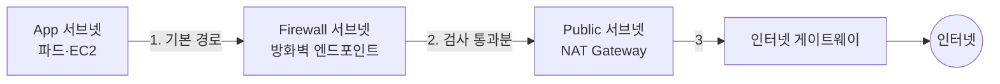

import { Quiz, QuizResults } from 'starlight-quiz/components';
import { Tabs, TabItem } from '@astrojs/starlight/components';

> 문서 유형: explanation

선행 지식과 학습 경로는 [모듈 개요](/part-4/27-network-firewall/)에. 처음 보는 약어나 말은 [이 사이트의 말](/reference/glossary/)에 있다.

ENI(Elastic Network Interface)는 리소스에 붙는 가상 랜카드다. 방화벽 엔드포인트도 결국 서브넷 안의 ENI 하나다 — [vpc-basics](/start/vpc-basics/)에 있다.

---

## 1. 보안 그룹으로 풀리지 않는 문제

2025 1과제 요구를 그대로 읽는다.

> `gj2025-app-vpc` 에 있는 시스템에서 외부 `ifconfig.io` 로 향하는 HTTP/HTTPS 요청을 차단해야 합니다.

보안 그룹으로 해 보려고 하면 곧 막힌다.

**첫째, 보안 그룹은 도메인 이름을 모른다.** IP 주소와 포트만 안다. `ifconfig.io` 의 IP 를 찾아 넣을 수는 있지만 그 IP 는 바뀐다. CDN 뒤에 있으면 수십 개다.

**둘째, 나가는 트래픽 하나만 막기 어렵다.** 아웃바운드 규칙은 허용 목록이다. `ifconfig.io` 만 빼고 나머지 HTTPS 를 모두 허용하려면 "허용"만 있는 규칙으로 "이것만 제외"를 표현해야 한다. 할 수 없다.

**셋째, 어디에 붙일지가 문제다.** 보안 그룹은 리소스에 붙는다. 파드가 열 개면 열 개 모두에 규칙이 붙어야 하고, 하나라도 빠지면 그 파드만 뚫린다.

| | 보안 그룹 | 네트워크 ACL | Network Firewall |
|---|---|---|---|
| 붙는 곳 | 리소스(ENI) | 서브넷 | 전용 서브넷의 엔드포인트 |
| 상태 기억 | 한다 | 하지 않는다 | 한다(Stateful) / 하지 않는다(Stateless) |
| 볼 수 있는 것 | IP·포트·프로토콜 | IP·포트·프로토콜 | **도메인·HTTP 헤더·TLS SNI·패킷 내용** |
| 거부 규칙 | 없음(허용만) | 있음 | 있음 |
| 로깅 | 없음(Flow Logs 별도) | 없음 | **자체 로깅** |

세 번째 줄이 Network Firewall 을 쓰는 이유다. **애플리케이션 계층까지 본다.**

:::note[셋을 함께 쓴다]
Network Firewall 이 나머지를 대체하지 않는다. 보안 그룹은 여전히 리소스 단위 최소 권한을 맡고, Network Firewall 은 VPC 를 드나드는 길목에서 내용을 검사한다. 층이 다르다.
:::

---

## 2. 방화벽 서브넷이 따로 필요한 이유

Network Firewall 은 소프트웨어가 아니라 **가용 영역마다 하나씩 놓이는 엔드포인트**다. ENI 를 가진 실체이므로 어딘가에 있어야 하고, 그 자리가 방화벽 전용 서브넷이다.



<details class="diagram-note">
<summary>이 도식이 보여주는 것</summary>

방화벽은 길 옆에 서서 지켜보는 것이 아니라 **길 위에 서 있다.** 앱이 밖으로 나가려면 반드시 방화벽 서브넷을 지나야 한다. 이 지나감을 만드는 것이 라우팅이고, 라우팅을 잘못 두면 방화벽을 옆으로 비켜 간다.

</details>

:::danger[방화벽 서브넷에 다른 것을 두지 않는다]
전용이다. NAT Gateway 나 EC2 를 같이 두면 안 된다. 엔드포인트가 그 서브넷의 트래픽을 처리하는 구조라 자기 자신을 검사하는 고리가 생긴다.
:::

**고가용성.** 2025 2과제는 "2개의 가용 영역에 걸쳐 고가용성으로 구성"을 요구했다. 방화벽 서브넷을 두 AZ 에 각각 만들고 둘 다 방화벽에 등록한다. 엔드포인트가 둘 생기고 **과금도 두 배**다.

---

## 3. 라우팅 — 가장 자주 틀리는 부분

방화벽을 만들었는데 차단이 안 되는 이유는 대개 규칙이 아니라 라우팅이다. 트래픽이 방화벽을 지나가지 않는 것이다.

### 3-1. 나가는 길

| 라우팅 테이블 | 대상 | 다음 홉 |
|---|---|---|
| App 서브넷 | `0.0.0.0/0` | 방화벽 엔드포인트(같은 AZ) |
| Firewall 서브넷 | `0.0.0.0/0` | NAT Gateway |
| Public 서브넷 | `0.0.0.0/0` | 인터넷 게이트웨이 |

**App 서브넷의 기본 경로가 NAT 가 아니라 방화벽 엔드포인트를 가리킨다는 점**이 핵심이다. NAT 를 가리키면 방화벽을 그냥 지나친다.

### 3-2. 돌아오는 길

여기가 잊기 쉽다. 인터넷에서 돌아오는 응답도 같은 길로 와야 한다. 그러지 않으면 나갈 때만 검사되고 돌아올 때는 검사되지 않는다.

인터넷 게이트웨이에 **엣지 연결 라우팅 테이블**을 붙여, VPC 안쪽으로 향하는 트래픽을 방화벽 엔드포인트로 보낸다.

```
게이트웨이 라우팅 테이블 (IGW 에 연결)
  10.0.0.0/24  ->  방화벽 엔드포인트(AZ-a)
  10.0.1.0/24  ->  방화벽 엔드포인트(AZ-b)
```

:::caution[AZ 를 넘나들면 비대칭이 된다]
AZ-a 의 트래픽은 AZ-a 의 엔드포인트로, AZ-b 는 AZ-b 로 보낸다. 섞이면 나갈 때와 들어올 때 다른 엔드포인트를 지나 Stateful 규칙이 연결 상태를 잃는다. 증상이 "가끔 되고 가끔 안 됨"이라 원인을 찾기 매우 어렵다.
:::

### 3-3. 2025 1과제의 실제 배치

Hub 와 App 두 VPC 를 Transit Gateway 로 잇고, 방화벽은 Hub 에 둔다.

| 라우팅 테이블 | 대상 | 다음 홉 |
|---|---|---|
| `gj2025-app-private-rtb-a` | `0.0.0.0/0` | Transit Gateway |
| `gj2025-hub-firewall-rtb` | `0.0.0.0/0` | NAT Gateway |
| `gj2025-hub-public-rtb` | `0.0.0.0/0` | 인터넷 게이트웨이 |
| `gj2025-app-data-rtb-a` | — | **게이트웨이 없음** |

마지막 줄이 요구사항이다. Data 서브넷은 인터넷으로 나갈 길 자체가 없어야 한다. 채점 스크립트가 이 라우팅 테이블에 연결된 서브넷 이름을 확인한다.

---

## 4. 규칙 그룹 두 종류

### 4-1. Stateless — 패킷 하나만 본다

연결을 기억하지 않는다. 패킷 하나를 보고 즉시 판단한다.

| 볼 수 있는 것 | 예 |
|---|---|
| 출발지·목적지 IP | `10.0.0.0/16` |
| 출발지·목적지 포트 | `443` |
| 프로토콜 | TCP(6) · UDP(17) · ICMP(1) |
| TCP 플래그 | SYN · ACK |

빠르고 싸다. 그리고 **처음 걸러 내는 층**으로 쓴다.

2025 2과제의 첫 단계가 이것이다.

> Stateless 규칙 엔진을 통해 모든 ICMP(ping) 프로토콜 트래픽을 차단하여 네트워크 스캐닝 및 ping 기반 공격을 차단합니다.

ICMP 는 프로토콜 번호만 보면 되므로 Stateless 로 충분하다.

**기본 동작.** 어느 규칙에도 걸리지 않은 패킷을 어떻게 할지 정한다. 대개 `aws:forward_to_sfe` 로 두어 Stateful 엔진에 넘긴다. `aws:drop` 으로 두면 명시적으로 허용한 것만 통과한다.

### 4-2. Stateful — 연결을 기억하고 내용을 본다

연결 단위로 상태를 추적한다. 그래서 "내가 보낸 요청의 응답"을 알아본다. 그리고 **애플리케이션 계층 내용을 본다.**

| 볼 수 있는 것 | 예 |
|---|---|
| HTTP Host 헤더 | `ifconfig.io` |
| TLS SNI | `ifconfig.io` |
| 요청 경로·메서드 | `/admin` · `POST` |
| 연결 방향 | 내가 시작한 것인지 |

이것이 도메인 기반 차단이 가능한 이유다.

:::note[HTTPS 인데 어떻게 도메인을 아나]
TLS 는 내용을 암호화하지만 **연결을 시작할 때 접속하려는 서버 이름을 평문으로 보낸다.** 이것을 SNI(Server Name Indication)라고 한다. 한 IP 에서 여러 도메인을 서비스할 때 서버가 어느 인증서를 줄지 고르는 데 쓴다. 방화벽은 이 평문 조각을 읽는다.

곧 **본문은 못 봐도 어디로 가는지는 안다.**
:::

### 4-3. 규칙 순서

| 순서 방식 | 동작 |
|---|---|
| 기본 순서(default) | Suricata 기본 우선순위. `pass` → `drop` → `alert` |
| 엄격 순서(strict) | 규칙을 쓴 순서대로 평가하고 처음 걸린 것을 적용 |

엄격 순서가 예측하기 쉽다. "Bastion 은 모두 허용, 나머지는 `ifconfig.io` 차단" 같은 요구를 순서로 표현할 수 있다.

---

## 5. Suricata 규칙 읽고 쓰기

Stateful 규칙은 Suricata 형식으로 쓴다. 한 줄의 구조는 이렇다.

```
액션 프로토콜 출발지 출발포트 방향 목적지 목적포트 (옵션들)
```

실제 규칙 하나를 뜯어 본다.

```
drop http $HOME_NET any -> $EXTERNAL_NET any (http.host; content:"ifconfig.io"; sid:1000001; rev:1;)
```

| 조각 | 뜻 |
|---|---|
| `drop` | 걸리면 버린다 |
| `http` | HTTP 프로토콜 |
| `$HOME_NET any` | 내 네트워크의 아무 포트에서 |
| `->` | 한 방향 |
| `$EXTERNAL_NET any` | 외부의 아무 포트로 |
| `http.host;` | HTTP Host 헤더를 보겠다 |
| `content:"ifconfig.io";` | 그 안에 이 글자가 있으면 |
| `sid:1000001;` | 규칙 고유 번호 |
| `rev:1;` | 규칙 판 번호 |

**액션 네 가지.**

| 액션 | 동작 |
|---|---|
| `pass` | 통과시키고 이후 규칙을 보지 않는다 |
| `drop` | 조용히 버린다. 보낸 쪽은 타임아웃을 본다 |
| `reject` | 버리고 거부를 알린다. 보낸 쪽이 즉시 실패를 안다 |
| `alert` | 통과시키되 로그를 남긴다 |

`drop` 과 `reject` 의 차이가 실습에서 눈에 보인다. `drop` 이면 `curl` 이 지정한 시간까지 기다리다 죽고, `reject` 면 곧바로 연결 거부가 뜬다. 채점이 타임아웃을 기대하면 `drop` 이어야 한다.

:::danger[`sid` 는 규칙마다 달라야 한다]
같은 `sid` 를 두 규칙에 쓰면 규칙 그룹 생성이 실패한다. 1000000 이상을 쓰는 것이 관례다(그 아래는 공개 규칙 집합이 쓴다).
:::

### 5-1. HTTPS 도 함께 막기

위 규칙은 HTTP 만 막는다. HTTPS 로 가면 통과한다. TLS SNI 를 보는 규칙을 하나 더 쓴다.

```
drop tls $HOME_NET any -> $EXTERNAL_NET any (tls.sni; content:"ifconfig.io"; sid:1000002; rev:1;)
```

**두 줄이 한 쌍이다.** 하나만 쓰면 다른 쪽으로 새어 나간다. 실습에서 "HTTP 는 막혔는데 HTTPS 는 통한다"가 이 때문이다.

### 5-2. 예외 먼저, 차단 나중

"Bastion 은 모두 허용"을 표현한다.

```
pass ip 10.0.0.10/32 any -> $EXTERNAL_NET any (sid:1000000; rev:1;)
drop http $HOME_NET any -> $EXTERNAL_NET any (http.host; content:"ifconfig.io"; sid:1000001; rev:1;)
drop tls $HOME_NET any -> $EXTERNAL_NET any (tls.sni; content:"ifconfig.io"; sid:1000002; rev:1;)
```

엄격 순서에서 `pass` 를 먼저 두면 Bastion 트래픽은 첫 줄에서 통과하고 아래를 보지 않는다.

### 5-3. DNS 차단

2025 2과제의 두 번째 단계다.

```
drop udp $HOME_NET any -> $EXTERNAL_NET 53 (msg:"block external DNS udp"; sid:1000010; rev:1;)
drop tcp $HOME_NET any -> $EXTERNAL_NET 53 (msg:"block external DNS tcp"; sid:1000011; rev:1;)
```

`msg:` 는 로그에 남길 설명이다. 걸렸을 때 어느 규칙인지 알아보기 쉬워진다.

:::caution[VPC 리졸버까지 막지 않는다]
VPC 안의 DNS 는 `169.254.169.253` 과 VPC CIDR 의 두 번째 주소를 쓴다. `$EXTERNAL_NET` 대상 규칙이므로 대개 걸리지 않지만, 목적지를 넓게 쓰면 내부 이름 해석까지 죽어 **모든 것이 멈춘다.** 차단 뒤 파드가 서비스 이름으로 서로를 찾을 수 있는지 반드시 확인한다.
:::

### 5-4. 도메인 목록 규칙

Suricata 를 쓰지 않고 도메인 목록만으로 만드는 방식도 있다.

| 방식 | 쓸 때 |
|---|---|
| 도메인 목록(`DOMAIN_LIST`) | 단순 허용·차단 목록 |
| Suricata 규칙 문자열 | 조건이 복잡하거나 프로토콜별 분기 |

**2025 1과제는 Suricata 를 명시했다.** 채점 스크립트가 규칙 그룹의 `RulesSource.RulesString` 이 비어 있지 않은지 확인하고 `Suricata` 를 출력한다. 도메인 목록으로 만들면 그 자리가 비어 항목을 잃는다.

---

## 6. 로깅

로그 유형이 둘이다.

| 유형 | 남는 것 |
|---|---|
| `FLOW` | 연결 단위 요약. 누가 어디로 얼마나 |
| `ALERT` | 규칙에 걸린 것만 |

2025 1과제 요구를 그대로 읽는다.

> Network Firewall 의 FLOW 유형의 로그만 수집을 하며, Amazon CloudWatch Logs 에 전송해야 합니다.

**"만"이 붙어 있다.** ALERT 를 함께 켜면 요구를 넘긴 것이다. 채점 스크립트가 로깅 설정을 그대로 출력한다.

```bash
aws network-firewall describe-logging-configuration \
  --firewall-name gj2025-firewall \
  --query 'LoggingConfiguration.LogDestinationConfigs' \
  --output json | jq -r '.[] | "\(.LogType)\n\(.LogDestinationType)\n\(.LogDestination.logGroup)\n"'
```

세 줄이 나온다 — 유형, 목적지 종류, 로그 그룹 이름. 셋 다 요구와 맞아야 한다.

<details class="build-step">
<summary>지금 확인하기 — 현재 방화벽의 로깅 설정 보기 (조회만, 과금 0원)</summary>

방화벽을 이미 만들어 두었다면 설정을 확인한다. 아무것도 만들지 않는다.

```bash
aws network-firewall describe-logging-configuration \
  --firewall-name gj2025-firewall --region ap-northeast-2 \
  --query 'LoggingConfiguration.LogDestinationConfigs'
```

기대 출력 — `LogType` 이 `FLOW` 하나뿐이고 `LogDestinationType` 이 `CloudWatchLogs` 다.

`ResourceNotFoundException` 이 나오면 아직 방화벽이 없거나 리전이 다르다. 리전은 [실기출 분해 3-2](/reference/past-exams/#3-2-2025-2과제--small-challenge-4시간)에서 확인한다.

</details>

---

## 7. 차단을 확인하는 법

**만들었다는 것과 동작한다는 것은 다르다.** 채점은 동작을 본다.

2025 1과제 채점 스크립트가 실제로 하는 일이다.

```bash
kubectl run firewall-test --image=radial/busyboxplus --restart=Never \
  --command -- sh -c "while true; do sleep 3600; done"
kubectl exec firewall-test -- curl -m 5 -sS https://ifconfig.io
```

**이 `curl` 이 실패해야 정답이다.** `-m 5` 는 5초 후 포기하라는 뜻이다. `drop` 규칙이 제대로 걸리면 타임아웃한다.

같은 스크립트가 먼저 하는 일이 있다.

```bash
aws ec2 describe-subnets --subnet-ids <파드가 뜬 노드의 서브넷> \
  --query "Subnets[0].Tags[?Key=='Name'].Value" --output text
```

**파드가 어느 서브넷의 노드에 떴는지 확인한다.** 그 서브넷의 라우팅이 방화벽을 지나는지가 검사 대상이라, 파드가 다른 서브넷에 뜨면 결과가 달라진다.

2025 2과제 확인은 더 단순하다.

```bash
ping 1.1.1.1
nslookup google.com 8.8.8.8
```

첫 줄은 Stateless ICMP 차단이, 둘째 줄은 Stateful DNS 차단이 걸려 둘 다 실패해야 한다.

---

## 8. 안 될 때 좁히는 순서

증상이 둘로 갈린다.

### 8-1. 차단했는데 통한다

| 순서 | 확인 | 명령 |
|---|---|---|
| 1 | 트래픽이 방화벽을 지나나 | App 서브넷 라우팅의 다음 홉이 방화벽 엔드포인트인가 |
| 2 | 방화벽이 READY 인가 | `describe-firewall --query FirewallStatus.Status` |
| 3 | 규칙 그룹이 정책에 붙었나 | `describe-firewall-policy` |
| 4 | 프로토콜이 맞나 | HTTP 만 막고 HTTPS 를 안 막았는가 |
| 5 | 규칙 순서 | `pass` 가 먼저 걸리고 있는가 |

1번이 압도적으로 많다.

### 8-2. 통해야 하는데 막힌다

| 순서 | 확인 |
|---|---|
| 1 | 예외 규칙이 대상 IP 를 정확히 담았나 |
| 2 | 내부 DNS 까지 막지 않았나 |
| 3 | Stateless 기본 동작이 `drop` 은 아닌가 |
| 4 | 돌아오는 길 라우팅이 비대칭은 아닌가 |
| 5 | 방화벽이 아니라 보안 그룹·NACL 문제는 아닌가 |

5번을 확인하는 방법이 있다. **방화벽 정책의 Stateful 기본 동작을 잠시 모두 허용으로 바꿔 본다.** 그래도 막히면 방화벽 문제가 아니다.

FLOW 로그를 보면 트래픽이 방화벽까지 왔는지 알 수 있다. 로그에 아예 없으면 라우팅 문제, 있는데 차단됐으면 규칙 문제다.

---

## 9. 30% 변형에 대비하기

같은 축이 다른 얼굴로 나올 수 있다.

| 변형 | 무엇이 바뀌나 |
|---|---|
| 차단 대상이 다른 도메인 | `content:` 문자열만 |
| 특정 포트만 차단 | 규칙의 목적 포트 |
| 허용 목록 방식 | Stateless 기본 동작을 `drop` 으로, `pass` 규칙 나열 |
| ALERT 로그도 요구 | 로깅 설정에 유형 추가 |
| 단일 AZ | 방화벽 서브넷 하나, 과금 절반 |
| Egress VPC 분리 | 방화벽이 App VPC 가 아니라 별도 VPC 에 |

**바뀌지 않는 것은 라우팅 구조다.** 트래픽이 방화벽 엔드포인트를 지나게 만드는 일은 어느 변형에서도 같다. 규칙 문자열은 그다음이다.

---

## 정리

- Network Firewall 은 보안 그룹이 못 보는 **도메인·HTTP 헤더·TLS SNI** 를 본다
- 전용 서브넷에 엔드포인트가 서고, **라우팅으로 그 위를 지나게** 만든다
- Stateless 는 패킷 하나(ICMP 차단), Stateful 은 연결과 내용(도메인 차단)
- Suricata 규칙은 `액션 프로토콜 출발지 포트 방향 목적지 포트 (옵션)` 한 줄
- **HTTP 와 TLS 규칙을 한 쌍으로** 쓰지 않으면 HTTPS 로 새어 나간다
- 로그 유형이 `FLOW` 인지 `ALERT` 인지 요구를 그대로 따른다
- 안 될 때 1순위 원인은 규칙이 아니라 **라우팅**이다

---

## 자기 점검 퀴즈

<Quiz title="도메인 차단과 보안 그룹">
보안 그룹으로 특정 도메인 접근을 차단할 수 없는 이유는?

- [ ] 아웃바운드 규칙을 지원하지 않아서
  > 지원한다. 문제는 규칙이 있고 없고가 아니라 그 규칙이 도메인을 표현하지 못한다는 것이다.
- [x] IP 와 포트만 알고 도메인 이름을 모르며, 허용 규칙만 있어 예외 차단을 표현할 수 없어서
- [ ] 리소스마다 붙어야 해서
  > 붙는 단위는 상관없다. VPC 단위로 붙여도 도메인은 여전히 못 쓴다.
- [ ] VPC 밖에서 동작해서
  > 보안 그룹은 ENI 에 붙어 VPC 안에서 동작한다.

보안 그룹은 IP·포트·프로토콜만 본다. 도메인의 IP 는 바뀌고 CDN 뒤면 여러 개다. 게다가 허용 목록 방식이라 '이것만 제외하고 허용'을 쓸 수 없다.
</Quiz>

<Quiz title="방화벽이 안 막힐 때 첫 확인">
방화벽을 만들고 규칙도 넣었는데 차단이 되지 않는다. 가장 먼저 볼 것은?

- [ ] Suricata 규칙 문법
  > 문법이 틀리면 규칙 그룹을 만들 때 거부된다. 만들어졌다면 문법은 통과한 것이다.
- [x] 앱 서브넷 라우팅 테이블의 기본 경로가 방화벽 엔드포인트를 가리키는지
- [ ] CloudWatch 로그 그룹 이름
  > 로그는 결과를 남길 뿐 차단에 관여하지 않는다.
- [ ] 보안 그룹 아웃바운드
  > 보안 그룹이 열려 있어서 나가는 것이라면 그 뒤에서 방화벽이 잡아야 한다. 순서가 뒤다.

트래픽이 방화벽을 지나지 않으면 규칙이 아무리 정확해도 소용없다. 기본 경로가 NAT 를 직접 가리키면 방화벽을 그냥 비켜 간다. 가장 흔한 원인이다.
</Quiz>

<Quiz title="HTTP 는 막히고 HTTPS 는 통한다">
HTTP 로 `ifconfig.io` 를 막았더니 HTTP 는 막히는데 HTTPS 는 통한다. 원인은?

- [ ] 방화벽이 HTTPS 를 지원하지 않는다
  > 지원한다. 다만 암호화돼 있어 볼 수 있는 것이 SNI 뿐이다.
- [x] TLS SNI 를 보는 규칙을 따로 쓰지 않았다
- [ ] 인증서가 없다
  > 방화벽이 TLS 를 끊고 다시 맺지 않으므로 인증서가 필요 없다.
- [ ] Stateless 규칙으로 써야 한다
  > Stateless 는 IP·포트만 본다. 이름으로 가르는 것은 Stateful 쪽 일이다.

http.host 규칙은 HTTP 만 본다. HTTPS 는 tls.sni 를 보는 규칙이 따로 필요하다. 두 줄이 한 쌍이다.
</Quiz>

<Quiz title="FLOW 만 요구했는데 ALERT 도 켰다">
요구가 'FLOW 유형의 로그만 수집' 인데 ALERT 도 함께 켰다. 무엇이 문제인가?

- [ ] 비용만 조금 더 든다
  > 비용도 늘지만 그것이 문제가 아니다. "만"이 붙은 요구는 넘치는 구성도 불일치다.
- [x] 요구를 넘긴 구성이고 채점 스크립트가 로깅 설정을 그대로 출력해 확인한다
- [ ] FLOW 로그가 기록되지 않는다
  > 둘 다 켜도 FLOW 는 그대로 남는다.
- [ ] 방화벽이 동작하지 않는다
  > 동작한다. 통신은 정상이고 구성만 요구와 어긋난다 — 그래서 눈으로는 안 보인다.

채점이 describe-logging-configuration 결과를 그대로 본다. '만'이 붙은 요구는 초과 구성도 불일치다.
</Quiz>

<Quiz title="Stateless 규칙 그룹의 몫">
Stateless 규칙 그룹으로 처리하기에 적합한 것은?

- [ ] 특정 도메인으로 향하는 HTTPS 차단
  > 도메인은 SNI 를 읽어야 알 수 있고, 그것은 Stateful 규칙이다.
- [x] 모든 ICMP 트래픽 차단
- [ ] HTTP 요청 경로가 /admin 인 요청 차단
  > 경로는 애플리케이션 계층이다. Stateless 는 헤더를 보지 않는다.
- [ ] 연결을 시작한 쪽의 응답만 허용
  > 그것이 곧 상태 추적이고, 상태를 기억하는 순간 Stateful 이다.

ICMP 는 프로토콜 번호만 보면 판단할 수 있어 상태를 기억할 필요가 없다. 나머지 셋은 연결 상태나 애플리케이션 계층 내용을 봐야 하므로 Stateful 이다.
</Quiz>

<Quiz title="drop 과 reject 의 차이">
`drop` 대신 `reject` 를 쓰면 확인 명령에서 무엇이 달라지나?

- [ ] 아무 차이가 없다
  > 막히는 결과는 같지만 실패하는 방식이 다르고, 그 차이가 진단 시간을 가른다.
- [x] curl 이 타임아웃까지 기다리지 않고 즉시 연결 거부로 실패한다
- [ ] 요청이 통과한다
  > 둘 다 막는다. 통과시키는 동작은 `pass` 다.
- [ ] 로그가 남지 않는다
  > 로깅은 별개 설정이라 동작 종류와 무관하다.

drop 은 조용히 버려 보낸 쪽이 타임아웃할 때까지 기다린다. reject 는 거부를 알려 즉시 실패한다. 채점이 타임아웃을 기대하면 drop 이어야 한다.
</Quiz>

<QuizResults />
