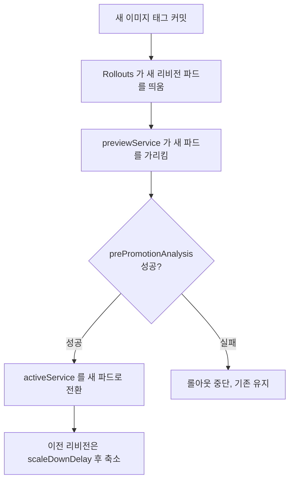
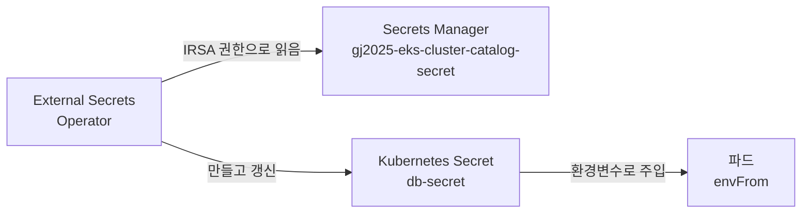
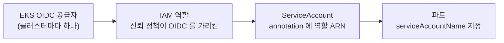

import { Quiz, QuizResults } from 'starlight-quiz/components';
import { Tabs, TabItem } from '@astrojs/starlight/components';

> 문서 유형: explanation

선행 지식과 학습 경로는 [모듈 개요](/part-4/29-gitops-rollouts/)에.

---

## 1. 밀어 넣는 배포와 끌어오는 배포

지금까지 배운 배포는 밀어 넣는 방식이다.

```
CI 파이프라인 --(kubectl apply)--> 클러스터
```

파이프라인이 클러스터 자격증명을 들고 있다가 직접 반영한다. 문제가 셋이다.

**첫째, 파이프라인이 클러스터 권한을 가진다.** CI 시스템이 뚫리면 클러스터도 뚫린다.

**둘째, 지금 무엇이 떠 있는지 git 이 모른다.** 누가 `kubectl edit` 로 이미지를 바꿔도 저장소는 그대로다. 코드와 현실이 갈라진다.

**셋째, 되돌리기가 어렵다.** 이전 상태를 알려면 클러스터 이력을 뒤져야 한다.

GitOps 는 방향을 뒤집는다.

```
CI 파이프라인 --(git push)--> 저장소 <--(감시하고 끌어옴)-- 클러스터 안의 에이전트
```

**클러스터 안의 에이전트가 저장소를 보고 스스로 맞춘다.** 파이프라인은 git 에 커밋만 하면 된다.

| | 밀어 넣기 | 끌어오기(GitOps) |
|---|---|---|
| 클러스터 자격증명 | CI 가 가진다 | 클러스터 안에만 |
| 현재 상태의 근거 | 클러스터 | **git 저장소** |
| 손으로 바꾸면 | 그대로 남는다 | **되돌려진다** |
| 되돌리기 | 이력을 뒤진다 | `git revert` |

2025 2과제 요구가 세 번째 줄을 정확히 겨눈다.

> github Repository 에서 코드를 변경하는 것이 아닌 관리자가 다른 방법으로 이미지를 변경할시 자동으로 복구되어야 합니다.

---

## 2. ArgoCD

### 2-1. Application 이 한 쌍을 잇는다

```yaml
apiVersion: argoproj.io/v1alpha1
kind: Application
metadata:
  name: wsc2025-argo-app
  namespace: argocd
spec:
  project: default
  source:
    repoURL: https://github.com/owner/gj2025-repository.git
    targetRevision: gitops-red        # 어느 브랜치를
    path: manifest                    # 어느 경로를
  destination:
    server: https://kubernetes.default.svc
    namespace: skills                 # 어디에 반영할지
  syncPolicy:
    automated:
      prune: true                     # 저장소에서 지운 것은 클러스터에서도 지운다
      selfHeal: true                  # 손으로 바꾼 것을 되돌린다
```

**`source` 와 `destination` 한 쌍이 Application 의 전부다.** 저장소의 어느 브랜치·경로를 클러스터의 어느 네임스페이스에 맞출지 정한다.

### 2-2. `selfHeal` 이 자동 복구다

| 옵션 | 없으면 | 있으면 |
|---|---|---|
| `automated` | 손으로 Sync 를 눌러야 한다 | 저장소가 바뀌면 알아서 |
| `prune` | 저장소에서 지운 것이 클러스터에 남는다 | 함께 지워진다 |
| `selfHeal` | `kubectl edit` 한 것이 그대로 남는다 | **되돌려진다** |

2025 2과제의 "관리자가 다른 방법으로 이미지를 변경할시 자동으로 복구" 요구가 `selfHeal: true` 다.

:::caution[`prune` 은 위험할 수 있다]
저장소에서 실수로 매니페스트를 지우면 클러스터에서도 사라진다. 대회에서는 요구되는 동작이지만 실무에서는 신중히 켠다.
:::

### 2-3. 감지 주기

ArgoCD 는 기본적으로 **3분마다** 저장소를 확인한다. 3분 제약이 있는 요구에서 이 주기가 그대로 병목이다.

두 가지로 줄인다.

| 방법 | 어떻게 |
|---|---|
| 폴링 주기 단축 | `argocd-cm` 의 `timeout.reconciliation` 을 `30s` 등으로 |
| **웹훅** | GitHub 이 push 때 ArgoCD 에 알린다. 지연이 사실상 0 |

웹훅이 확실하지만 ArgoCD 서버가 GitHub 에서 닿을 수 있어야 한다. 사설 서브넷에 있으면 안 된다. 폴링 단축이 더 단순한 선택이다.

### 2-4. 대시보드 노출

2025 1과제 요구다.

> ArgoCD 는 App VPC 에 배포되어야 합니다. 대시보드는 Hub VPC 에 External NLB 를 통하여 접근되도록 구성합니다. "admin" User 로 로그인 되어야 하며 "Skills53" Password 를 사용해야 합니다.

초기 암호는 자동 생성되어 시크릿에 들어 있다.

```bash
kubectl -n argocd get secret argocd-initial-admin-secret \
  -o jsonpath="{.data.password}" | base64 -d
```

지정된 암호로 바꾸려면 `argocd-secret` 의 `admin.password` 를 bcrypt 해시로 넣는다.

```bash
argocd account update-password --account admin --current-password <현재> --new-password 'Skills53'
```

:::danger[HTTPS 리다이렉션이 NLB 뒤에서 문제를 만든다]
ArgoCD 서버는 기본으로 HTTP 를 HTTPS 로 돌린다. NLB 뒤에서 TLS 종료를 하지 않으면 무한 리다이렉션이 생긴다. `--insecure` 로 띄우거나 helm 값에 `configs.params."server.insecure"=true` 를 준다.
:::

---

## 3. Blue/Green 이 Deployment 로 어려운 이유

Deployment 의 기본 갱신은 롤링 업데이트다. 파드를 하나씩 새 버전으로 바꾼다.

```
[v1][v1][v1] -> [v2][v1][v1] -> [v2][v2][v1] -> [v2][v2][v2]
```

**중간 단계에서 두 버전이 동시에 트래픽을 받는다.** 새 버전에 문제가 있으면 그동안의 요청이 영향을 받고, 되돌리려면 다시 하나씩 바꿔야 한다.

Blue/Green 은 다르다. 새 버전을 **전부 띄워 두고 검증한 뒤 한 번에 전환**한다.

```
활성 [v1][v1][v1]   미리보기 (없음)
활성 [v1][v1][v1]   미리보기 [v2][v2][v2]   <- 여기서 검증
활성 [v2][v2][v2]   미리보기 (이전 v1 잠시 유지)
```

전환이 순간이라 두 버전이 섞이지 않고, 되돌리기도 서비스 셀렉터를 되돌리는 것으로 끝난다.

Deployment 로 흉내 내려면 Deployment 두 벌과 서비스 셀렉터를 손으로 바꿔야 한다. 자동화가 어렵다. 그래서 Argo Rollouts 를 쓴다.

---

## 4. Argo Rollouts

### 4-1. Rollout 이 Deployment 를 대체한다

```yaml
apiVersion: argoproj.io/v1alpha1
kind: Rollout
metadata:
  name: red-rollout
  namespace: skills
spec:
  replicas: 2
  selector:
    matchLabels: { app: red }
  template:
    metadata:
      labels: { app: red }
    spec:
      containers:
        - name: red
          image: 123456789012.dkr.ecr.ap-northeast-2.amazonaws.com/red:1.0.0
          ports: [{ containerPort: 8080 }]
  strategy:
    blueGreen:
      activeService: red-active
      previewService: red-preview
      autoPromotionEnabled: true
      prePromotionAnalysis:
        templates:
          - templateName: health-check
```

`spec.template` 아래는 Deployment 와 똑같다. `strategy` 만 다르다.

:::caution[Deployment 와 Rollout 을 동시에 두지 않는다]
같은 라벨을 가진 Deployment 가 남아 있으면 파드가 두 배로 뜨고 서비스가 섞인다. Rollout 으로 옮길 때 기존 Deployment 를 지운다.
:::

### 4-2. 서비스 둘

| 서비스 | 가리키는 것 | 쓰임 |
|---|---|---|
| `activeService` | 현재 운영 중인 버전 | 실제 사용자 트래픽 |
| `previewService` | 새로 뜬 버전 | 검증용 |

Rollouts 컨트롤러가 **서비스의 셀렉터를 자동으로 고친다.** 파드마다 리비전 해시 라벨이 붙고, 컨트롤러가 그 값을 셀렉터에 넣어 어느 파드 묶음을 가리킬지 정한다.

```yaml
apiVersion: v1
kind: Service
metadata:
  name: red-active
  namespace: skills
spec:
  selector: { app: red }      # 컨트롤러가 여기에 해시를 더한다
  ports: [{ port: 80, targetPort: 8080 }]
```

**두 서비스의 정의는 같다.** 이름만 다르고 나머지는 동일하게 쓴다. 구분은 Rollout 이 한다.

### 4-3. 승격 흐름



<details class="diagram-note">
<summary>이 도식이 보여주는 것</summary>

새 파드가 뜨는 것과 트래픽이 넘어가는 것이 **분리돼 있다**는 점이 핵심이다. 그 사이에 검증이 들어간다. 검증이 실패하면 활성 서비스는 건드려지지 않으므로 사용자는 아무 영향을 받지 않는다.

</details>

### 4-4. `autoPromotionEnabled` 와 분석의 관계

| 설정 | 동작 |
|---|---|
| `autoPromotionEnabled: true`, 분석 없음 | 새 파드가 Ready 되면 즉시 전환 |
| `autoPromotionEnabled: true`, 분석 있음 | **분석 성공 후** 자동 전환 |
| `autoPromotionEnabled: false` | 사람이 `kubectl argo rollouts promote` 를 쳐야 전환 |

2025 1과제 요구는 첫 줄이 아니라 두 번째 줄이다. `/health` 로 확인한 뒤 자동 승격이다.

:::danger[`autoPromotionEnabled: false` 로 두면 3분을 못 지킨다]
사람이 손으로 승격해야 하므로 자동화가 끊긴다. 채점이 커밋 후 3분 안에 새 버전이 활성인지 보면 실패한다.
:::

### 4-5. 분석 템플릿

```yaml
apiVersion: argoproj.io/v1alpha1
kind: AnalysisTemplate
metadata:
  name: health-check
  namespace: skills
spec:
  metrics:
    - name: health
      count: 3
      interval: 10s
      successCondition: result == "true"
      failureLimit: 1
      provider:
        job:
          spec:
            template:
              spec:
                restartPolicy: Never
                containers:
                  - name: check
                    image: curlimages/curl:latest
                    command: ["sh", "-c"]
                    args:
                      - |
                        code=$(curl -s -o /dev/null -w '%{http_code}' http://red-preview.skills.svc.cluster.local/health)
                        [ "$code" = "200" ] && echo "true" || echo "false"
```

**`previewService` 를 호출한다는 점이 핵심이다.** 활성 서비스를 부르면 아직 이전 버전이라 검증 의미가 없다.

`count: 3` 과 `interval: 10s` 면 최소 30초가 든다. 3분 제약을 계산할 때 이 시간이 들어간다.

:::caution[분석 시간이 3분 예산을 먹는다]
`count × interval` 이 최소 소요다. 여유를 두려면 `count: 2` · `interval: 5s` 처럼 줄인다. 다만 너무 줄이면 앱이 준비되기 전에 검사해 실패한다.
:::

### 4-6. 채점이 보는 것

```bash
kubectl get rollout red-rollout -n skills | awk 'NR==2 {print $1; if ($2 == $3 && $2 > 0) print "True"; else print "False"}'
```

`DESIRED` 와 `CURRENT` 가 같고 0보다 큰지 본다. 곧 **원하는 만큼 파드가 떠 있는지**다.

```bash
kubectl argo rollouts get rollout red-rollout -n skills | egrep "Strategy"
kubectl argo rollouts get rollout red-rollout -n skills | egrep "stable" | grep "Healthy" | awk '{print $6,$8}'
```

`Strategy` 가 `BlueGreen` 이어야 하고 stable 리비전이 `Healthy` 여야 한다.

**`kubectl argo rollouts` 는 플러그인이다.** 2025 1과제 문제지가 Bastion 필수 패키지에 `argo rollouts CLI(kubectl plugin)` 를 명시했다. 없으면 채점 명령 자체가 실행되지 않는다.

---

## 5. 3분 제약을 지키는 법

커밋에서 새 버전 활성까지 3분이다. 시간이 어디서 드는지 나눠 본다.

| 단계 | 걸리는 시간 | 줄이는 법 |
|---|---|---|
| CI 빌드 + push | 1~2분 | 이미지 레이어 캐시, 작은 베이스 이미지 |
| ArgoCD 감지 | 최대 3분(기본) | **웹훅 또는 폴링 30초로** |
| 파드 기동 | 10~30초 | 이미지 크기, `readinessProbe` 설정 |
| 분석 | `count × interval` | 30초 안쪽으로 |
| 전환 | 즉시 | — |

**기본값 그대로 두면 ArgoCD 감지만으로 3분을 다 쓴다.** 여기를 가장 먼저 줄인다.

`readinessProbe` 도 본다.

```yaml
readinessProbe:
  httpGet: { path: /health, port: 8080 }
  initialDelaySeconds: 5
  periodSeconds: 3
```

`initialDelaySeconds` 가 30이면 파드마다 30초를 기다린다. 앱이 빨리 뜨면 짧게 잡는다.

---

## 6. External Secrets 와 IRSA

### 6-1. 풀려는 문제

요구는 "환경변수 값을 Pod 에 직접 명시하지 말 것"이다. 매니페스트에 암호를 쓰면 그것이 git 저장소에 남는다. 공개 저장소라면 그대로 노출이다.

그래서 값은 Secrets Manager 에 두고, 클러스터가 그것을 끌어와 쿠버네티스 Secret 으로 만든다. 그 일을 하는 것이 External Secrets Operator 다.



<details class="diagram-note">
<summary>이 도식이 보여주는 것</summary>

git 저장소에는 **"이 시크릿을 가져와라"라는 지시만** 들어간다. 값 자체는 어디에도 커밋되지 않는다. 값이 바뀌면 Operator 가 주기적으로 다시 읽어 갱신한다.

</details>

### 6-2. 오브젝트 둘

**SecretStore — 어디서 가져올지**

```yaml
apiVersion: external-secrets.io/v1beta1
kind: SecretStore
metadata:
  name: aws-secretsmanager
  namespace: skills
spec:
  provider:
    aws:
      service: SecretsManager
      region: ap-northeast-2
      auth:
        jwt:
          serviceAccountRef:
            name: external-secrets-sa
```

**ExternalSecret — 무엇을 어떤 이름으로**

```yaml
apiVersion: external-secrets.io/v1beta1
kind: ExternalSecret
metadata:
  name: db-secret          # 채점이 이 이름으로 찾는다
  namespace: skills
spec:
  refreshInterval: 1m
  secretStoreRef:
    name: aws-secretsmanager
    kind: SecretStore
  target:
    name: db-secret        # 만들어질 쿠버네티스 Secret 이름
  data:
    - secretKey: DB_USER
      remoteRef:
        key: gj2025-eks-cluster-catalog-secret
        property: DB_USER
    - secretKey: DB_PASSWORD
      remoteRef:
        key: gj2025-eks-cluster-catalog-secret
        property: DB_PASSWORD
    - secretKey: DB_URL
      remoteRef:
        key: gj2025-eks-cluster-catalog-secret
        property: DB_URL
```

`property` 는 시크릿 값이 JSON 일 때 그 안의 키를 가리킨다.

파드에서 쓴다.

```yaml
envFrom:
  - secretRef:
      name: db-secret
```

### 6-3. IRSA — 파드가 AWS 권한을 얻는 경로

파드에 액세스 키를 넣지 않고 IAM 역할을 준다. 경로가 넷이다.



<details class="diagram-note">
<summary>이 도식이 보여주는 것</summary>

넷 중 **하나라도 끊기면 파드가 권한을 얻지 못한다.** 가장 자주 끊기는 곳이 두 군데다. OIDC 공급자를 IAM 에 등록하지 않은 경우와, ServiceAccount 의 annotation 키를 잘못 쓴 경우다.

</details>

**1. OIDC 공급자 등록**

```bash
eksctl utils associate-iam-oidc-provider --cluster gj2025-eks-cluster --approve
```

**2. IAM 역할 신뢰 정책**

```json
{
  "Effect": "Allow",
  "Principal": { "Federated": "arn:aws:iam::123456789012:oidc-provider/oidc.eks.ap-northeast-2.amazonaws.com/id/XXXX" },
  "Action": "sts:AssumeRoleWithWebIdentity",
  "Condition": {
    "StringEquals": {
      "oidc.eks.ap-northeast-2.amazonaws.com/id/XXXX:sub": "system:serviceaccount:skills:external-secrets-sa",
      "oidc.eks.ap-northeast-2.amazonaws.com/id/XXXX:aud": "sts.amazonaws.com"
    }
  }
}
```

`sub` 가 `system:serviceaccount:<네임스페이스>:<서비스계정이름>` 형식이다. 네임스페이스가 틀리면 권한을 얻지 못한다.

**3. ServiceAccount annotation**

```yaml
apiVersion: v1
kind: ServiceAccount
metadata:
  name: external-secrets-sa
  namespace: skills
  annotations:
    eks.amazonaws.com/role-arn: arn:aws:iam::123456789012:role/gj2025-external-secrets-role
```

annotation 키가 정확히 `eks.amazonaws.com/role-arn` 이어야 한다.

**4. 파드가 그 서비스 계정을 쓴다**

External Secrets 의 경우 SecretStore 의 `serviceAccountRef` 가 그 역할을 한다.

### 6-4. 최소 권한

2025 1과제 유의사항 19번을 그대로 읽는다.

> IRSA 를 위한 IAM policy 를 작성할 때 최소 보안 준수 원칙에 따라 Resource 는 특정 ARN 만 지정하도록 합니다.

```json
{
  "Effect": "Allow",
  "Action": ["secretsmanager:GetSecretValue", "secretsmanager:DescribeSecret"],
  "Resource": [
    "arn:aws:secretsmanager:ap-northeast-2:123456789012:secret:gj2025-eks-cluster-catalog-secret-??????"
  ]
}
```

:::danger[Secrets Manager ARN 끝에 임의 6자가 붙는다]
시크릿 ARN 은 `...:secret:이름-AbCdEf` 형태다. 이름만 쓰면 맞지 않는다. `-??????` 로 여섯 자리를 표현하거나 실제 ARN 을 그대로 넣는다.

Terraform 이라면 `aws_secretsmanager_secret.this.arn` 을 참조해 이 문제를 피한다.
:::

채점 스크립트가 정책의 Resource 를 펼쳐 본다.

```bash
for arn in $(aws iam list-attached-role-policies --role-name $ROLE --query 'AttachedPolicies[*].PolicyArn' --output text); do
  aws iam get-policy-version --policy-arn $arn --version-id $(...) --query 'PolicyVersion.Document.Statement[*].Resource' --output text
done
```

`*` 가 찍히면 감점이다.

### 6-5. IRSA 전용 요구

> ExternalSecret 을 위한 IRSA 는 ExternalSecret 에 권한 인증을 위해서만 사용해야 합니다.

이 역할을 다른 용도로 재사용하지 말라는 뜻이다. 앱 파드가 같은 서비스 계정을 쓰면 앱도 Secrets Manager 를 읽을 수 있게 된다. **서비스 계정을 따로 만든다.**

---

## 7. 안 될 때 좁히는 순서

### 7-1. ExternalSecret 이 Secret 을 못 만든다

```bash
kubectl get externalsecret db-secret -n skills
kubectl describe externalsecret db-secret -n skills
```

`STATUS` 열을 본다.

| 상태 | 원인 | 확인 |
|---|---|---|
| `SecretSyncedError` | 권한 또는 시크릿 이름 | 아래 순서 |
| `InvalidProviderConfig` | SecretStore 설정 | 리전·서비스 |
| 오브젝트 자체가 없다 | 매니페스트 미적용 | `kubectl get` |

권한 문제라면 IRSA 네 고리를 순서대로 본다.

```bash
# 1. 서비스 계정에 annotation 이 있나
kubectl get sa external-secrets-sa -n skills -o jsonpath='{.metadata.annotations}'

# 2. 그 역할이 실제로 있나
aws iam get-role --role-name gj2025-external-secrets-role --query 'Role.AssumeRolePolicyDocument'

# 3. sub 조건이 네임스페이스·이름과 맞나 — 위 출력에서 직접 확인

# 4. Operator 파드 로그
kubectl logs -n external-secrets -l app.kubernetes.io/name=external-secrets --tail=50
```

로그에 `AccessDeniedException` 이 있으면 정책, `not authorized to perform sts:AssumeRoleWithWebIdentity` 면 신뢰 정책이다.

### 7-2. 롤아웃이 승격되지 않는다

```bash
kubectl argo rollouts get rollout red-rollout -n skills
```

| 상태 | 원인 |
|---|---|
| `Paused` | `autoPromotionEnabled: false` |
| `Degraded` | 분석 실패 또는 파드가 Ready 안 됨 |
| `Progressing` 에서 멈춤 | 이미지 pull 실패, 리소스 부족 |

분석 결과를 본다.

```bash
kubectl get analysisrun -n skills
kubectl describe analysisrun <이름> -n skills
```

분석 Job 의 로그가 실패 원인을 담는다.

```bash
kubectl logs -n skills -l job-name=<분석-job-이름>
```

`/health` 가 404 면 경로가 틀린 것이다. [Go·Gin 앱 읽기](/start/go-app-basics/#3-2-라우트를-뽑는다)로 실제 경로를 확인한다.

### 7-3. ArgoCD 가 커밋을 감지하지 않는다

```bash
kubectl -n argocd get application wsc2025-argo-app -o jsonpath='{.status.sync.status} {.status.sync.revision}'
```

`OutOfSync` 인데 그대로 있으면 `automated` 가 없는 것이다. `Synced` 인데 옛 커밋이면 아직 폴링 전이다.

강제로 당겨 본다.

```bash
argocd app sync wsc2025-argo-app
```

수동으로는 되고 자동이 안 되면 `syncPolicy.automated` 를 확인한다.

---

## 8. 30% 변형에 대비하기

| 변형 | 무엇이 바뀌나 |
|---|---|
| Canary 전략 | `strategy.canary` 와 `steps`. 서비스 둘은 그대로 |
| 수동 승격 | `autoPromotionEnabled: false` |
| 분석 없이 즉시 | `prePromotionAnalysis` 제거 |
| Parameter Store 에서 | SecretStore 의 `service: ParameterStore` |
| 시크릿이 여러 개 | ExternalSecret 여러 개 또는 `dataFrom` |
| 5분 제약 | 폴링 주기를 덜 줄여도 된다 |
| 앱이 둘 | Rollout·서비스·Application 이 각각 두 벌 |

**바뀌지 않는 것은 IRSA 네 고리다.** 어떤 변형에서도 OIDC·역할·서비스계정·파드 연결은 같다.

---

## 정리

- GitOps 는 클러스터가 저장소를 **끌어온다**. `selfHeal` 이 손댄 것을 되돌린다
- Blue/Green 은 **띄우기와 전환을 분리**해 그 사이에 검증을 넣는다
- Rollout 은 서비스 둘의 셀렉터를 자동으로 고쳐 전환한다
- `prePromotionAnalysis` 는 **previewService** 를 호출해야 의미가 있다
- 3분 제약의 가장 큰 병목은 **ArgoCD 기본 폴링 주기 3분**이다
- External Secrets 는 값이 아니라 **지시만** git 에 남긴다
- IRSA 는 OIDC·역할·서비스계정·파드 네 고리다. 하나만 끊겨도 실패
- 정책 Resource 는 시크릿 ARN 으로 좁힌다. **끝의 임의 6자를 잊지 않는다**

---

## 자기 점검 퀴즈

<Quiz
  question="관리자가 `kubectl set image` 로 이미지를 바꿨는데 잠시 뒤 원래대로 돌아왔다. 무엇이 그렇게 만들었나?"
  options={[
    'Deployment 의 롤백 기능',
    'ArgoCD Application 의 syncPolicy.automated.selfHeal',
    'Argo Rollouts 의 분석',
    'ECR 이미지 불변 태그',
  ]}
  correct={1}
  explanation="selfHeal 은 클러스터 상태가 저장소와 다르면 저장소 기준으로 되돌린다. 2025 2과제의 자동 복구 요구가 이 설정이다."
/>

<Quiz
  question="`prePromotionAnalysis` 가 활성 서비스(`activeService`)를 호출하도록 잘못 썼다. 무엇이 문제인가?"
  options={[
    '분석이 실행되지 않는다',
    '아직 이전 버전을 검사하는 것이라 새 버전 검증이 되지 않는다',
    '롤아웃이 즉시 실패한다',
    '두 서비스가 합쳐진다',
  ]}
  correct={1}
  explanation="승격 전이므로 activeService 는 여전히 이전 버전을 가리킨다. 새 버전은 previewService 뒤에 있다. 검증은 항상 성공하고 문제 있는 버전도 승격된다."
/>

<Quiz
  question="커밋 후 3분 안에 새 버전이 떠야 하는데 매번 넘긴다. 기본 설정에서 가장 큰 병목은?"
  options={[
    '이미지 빌드 시간',
    'ArgoCD 의 기본 저장소 폴링 주기 3분',
    '파드 기동 시간',
    'ECR push 시간',
  ]}
  correct={1}
  explanation="ArgoCD 는 기본적으로 3분마다 저장소를 확인한다. 그것만으로 예산을 다 쓴다. 웹훅을 걸거나 timeout.reconciliation 을 30초 등으로 줄인다."
/>

<Quiz
  question="ExternalSecret 이 `SecretSyncedError` 다. IRSA 네 고리 중 확인 순서로 맞는 것은?"
  options={[
    '파드 로그만 보면 된다',
    'ServiceAccount annotation → IAM 역할 존재 → 신뢰 정책 sub 조건 → Operator 로그',
    '클러스터를 다시 만든다',
    'Secrets Manager 를 다시 만든다',
  ]}
  correct={1}
  explanation="네 고리를 순서대로 확인한다. Operator 로그의 오류 종류가 갈래를 정한다. AccessDenied 면 정책, AssumeRoleWithWebIdentity 실패면 신뢰 정책이다."
/>

<Quiz
  question="IRSA 정책에 `arn:aws:secretsmanager:...:secret:gj2025-catalog-secret` 이라고 썼는데 권한 오류가 난다. 원인은?"
  options={[
    '리전이 틀렸다',
    'Secrets Manager ARN 끝에 임의 6자가 붙는데 그것을 빠뜨렸다',
    'Action 이 부족하다',
    '역할이 없다',
  ]}
  correct={1}
  explanation="시크릿 ARN 은 이름 뒤에 하이픈과 임의 6자가 붙는다. -?????? 로 표현하거나 실제 ARN 을 넣는다. Terraform 이면 리소스 속성을 참조해 이 문제를 피한다."
/>

<Quiz
  question="`autoPromotionEnabled: false` 로 두면 3과제 3분 제약에서 무엇이 문제인가?"
  options={[
    '파드가 뜨지 않는다',
    '사람이 promote 명령을 쳐야 전환되므로 자동화가 끊기고 시간 안에 활성이 바뀌지 않는다',
    '분석이 실행되지 않는다',
    '서비스가 만들어지지 않는다',
  ]}
  correct={1}
  explanation="false 면 미리보기까지만 자동이고 승격은 수동이다. 채점이 커밋 후 정해진 시간 안에 새 버전이 활성인지 보면 실패한다."
/>

<QuizResults />
