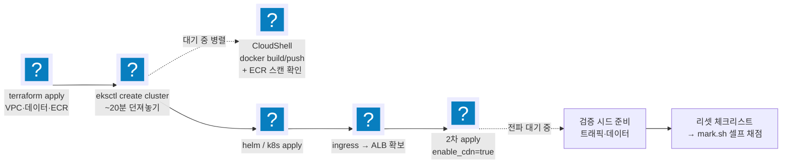

import { Quiz, QuizResults } from 'starlight-quiz/components';

> 문서 유형: explanation

이 PART는 적용이 전부다. 운영 원칙만 짧게.

## 시간이 점수다 — 긴 것 먼저

4시간에서 대기 시간을 작업 시간으로 바꾸는 게 전략의 전부다. [소요 시간표](/reference/timings/)의 소요표 기준:

eksctl 20분, CloudFront 전파 수 분, ECR 스캔 수 분 — 전부 **던져놓고 다른 일**을 한다.

## 막힘 규칙 — 15분 자력, 이후 유료 참조

:::tip[15분 규칙]
- 막히면 **15분까지는 자력** (12-break-fix에서 만든 확인→원인→조치 사슬).
- 15분 초과 시 저장소 README 참조 허용 — 단 **참조한 순간 오답 노트에 기록**. 참조 없이 못 푼 것 = 대회장에서 못 푸는 것.
:::

## mark가 시험지다

구현 전에 mark 항목 표(11-mutation-drill 훈련 ③ 산출물)를 머리에 올리고 시작한다.

:::caution[채점 직전 리셋 체크리스트]
[mark 스크립트 가이드](/reference/mark-script-guide/)의 **리셋 체크리스트**를 기계적으로 수행 — 시연 데이터 정리(재현 절차는 정확히 1회), 상태 복원, 트래픽 시드, 임시 리소스 제거, 채점 신원 확인.
:::

## 백지 도식이 이해의 증명

종료 후 아무것도 안 보고 아키텍처를 그린다 — **화살표마다 인증 방식 주석**(OAC SigV4 / 커스텀 헤더 / IRSA / IAM 역할)이 달려야 완성. 화살표의 인증을 모르면 break-fix ⑦⑧⑪을 대회장에서 못 푼다.

## 실수는 자산화한다

오답 노트 3열: **증상 / 원인 / 다음에 칠 명령.** 회고 없는 모의고사는 과금만 남는다.

---

## 퀴즈 (5문)

<Quiz title="착수 순서 — 무엇을 먼저 던지나">
1차 `terraform apply`(VPC·데이터·ECR)가 막 끝났다. 다음으로 던질 것은?

- [x] `eksctl create cluster` — 던져놓고 대기 중에 CloudShell에서 docker build/push 를 병렬로 돌린다
- [ ] docker build/push 와 ECR 스캔을 먼저 끝낸 뒤 클러스터를 생성한다
  > 순서가 뒤집혔다. 빌드·푸시는 클러스터 생성 20분 안에 통째로 들어가는 작업이다. 직렬로 붙이면 그 시간이 그대로 총 소요에 더해진다.
- [ ] `enable_cdn=true` 2차 apply 를 먼저 걸어 CloudFront 전파 시간을 미리 소진한다
  > 대기 시간을 앞당기려는 발상은 맞지만 아직 배포 대상 ALB가 없다. ingress가 ALB를 만든 뒤에야 2차 apply가 성립한다.
- [ ] helm / k8s manifest 를 먼저 준비해 apply 한다

**`eksctl create cluster`.** 약 20분으로 가장 길다 — 긴 것부터 던져놓고 대기 시간을 작업 시간으로 바꾼다. 대기 중 CloudShell에서 docker build/push + ECR 스캔 확인. 같은 원리로 CloudFront 전파 대기 중에는 검증 시드(트래픽·데이터)를 준비한다.
</Quiz>

<Quiz title="15분 막힘 규칙">
한 항목에서 막힌 지 15분이 지났다. 규칙은?

- [x] 저장소 README 참조를 허용하되, 참조한 사실과 항목을 오답 노트에 기록한다
- [ ] 참조하고 넘어간다 — 기록까지 하는 건 시간 낭비다
  > 참조 없이 못 푼 것 = 대회장에서 못 푸는 것이다. 기록이 없으면 같은 항목에서 본선 날 똑같이 막힌다. 기록이 모의고사의 산출물이다.
- [ ] 참조는 금지 — 자력으로 풀 때까지 붙든다
  > 4시간은 유한하다. 한 항목에 30분을 태우면 손도 못 댄 항목이 생겨 점수 손실이 훨씬 크다.
- [ ] 해당 항목을 버리고 다음으로 넘어간다

**README 참조 허용 + 오답 노트 기록.** 15분까지는 자력으로 확인→원인→조치 사슬을 돌린다. 참조한 순간 기록하는 이유는 단순하다 — 참조 없이 못 푼 것은 대회장에서 못 푸는 것이고, 그 목록이 남은 기간의 우선 복습 대상이다.
</Quiz>

<Quiz title="채점 직전 리셋 체크리스트">
채점 직전 리셋 체크리스트에 들어가는 항목을 모두 고르라.

- [x] 시연 데이터 정리 — S3 error/processed 비우기, DynamoDB 전삭제
- [x] 임시 리소스 제거(bastion, `_transfer/`)와 채점 신원 = 클러스터 생성자 확인
- [ ] 시연 재현 절차를 한 번 더 실행해 정상 동작을 재확인한다
  > 정확히 이게 감점 함정이다. 재현은 딱 1회 — 두 번 돌리면 개수가 어긋난다.
- [ ] `terraform destroy` 후 재 apply 로 깨끗한 상태를 만든다
  > 리셋은 상태를 되돌리는 것이지 인프라를 다시 만드는 것이 아니다. eksctl 20분을 다시 태우고 채점 시간에 못 맞춘다.

5항목 전체: ① **시연 데이터 정리**(S3 error/processed 비우기·DynamoDB 전삭제) ② **요구 상태 복원**(READY·running·Pod/Node 수렴·weight 원복) ③ **트래픽 시드**(Grafana 전 패널·`/log?level=` 호출) ④ **임시 리소스 제거**(bastion·`_transfer/`) ⑤ **채점 신원 = 클러스터 생성자 확인**. 기계적으로, 순서대로 수행한다.
</Quiz>

<Quiz title="재현은 왜 정확히 1회인가">
시연 재현 절차를 두 번 실행하면 S3의 error 객체가 기대치의 두 배인 [[8]]건이 되어 채점과 어긋난다. 그래서 재현 절차는 정확히 [[1]]회만 실행한다.

---

**채점이 개수를 본다.** 존재 여부가 아니라 기대 개수와의 일치를 검사하므로, "잘 되는지 한 번 더 확인"이 그대로 감점이 된다 (mark-script-guide 실측).

리셋 체크리스트 ①(시연 데이터 정리)이 먼저 오는 이유도 같다 — 연습 중 쌓인 객체를 비우지 않으면 재현을 1회만 해도 개수가 맞지 않는다. 비우고, 한 번 돌리고, 손대지 않는다.
</Quiz>

<Quiz title="백지 도식의 화살표 주석">
종료 후 백지에 아키텍처를 그린다. 화살표마다 반드시 달려야 하는 주석은? (모두 고르라)

- [x] CloudFront → S3 의 OAC SigV4 서명
- [x] CloudFront → ALB 의 커스텀 헤더 검증
- [x] Pod → AWS API 의 IRSA / Pod Identity
- [ ] 홉별 예상 지연시간(ms)
  > 3과제 응답시간 예산에서는 의미가 있지만, 백지 도식의 목적은 다르다. 여기서 검증하는 건 "이 화살표는 무엇으로 인증되는가"이다.

**화살표별 인증 방식** — OAC(SigV4), CloudFront 커스텀 헤더 검증, IRSA/Pod Identity, EC2 인스턴스 프로파일 IAM 역할 등. 이게 안 달리면 백지 도식이 아직 완성이 아니다.

화살표의 인증을 모르면 break-fix ⑦⑧⑪(OAC 403, 커스텀 헤더 우회, kubectl Unauthorized 계열)을 대회장에서 못 푼다. 장애의 상당수가 "연결은 되는데 인증이 안 되는" 형태이기 때문이다.
</Quiz>

<QuizResults confetti />
