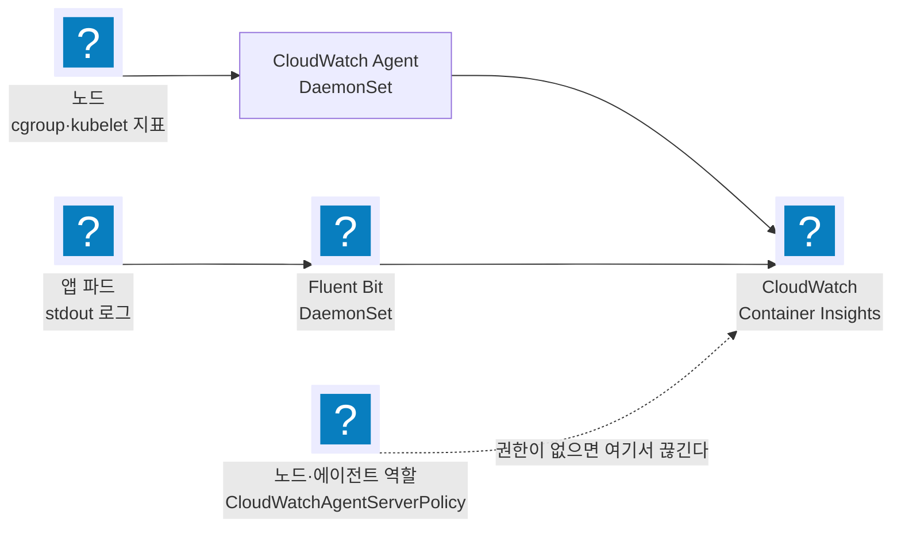
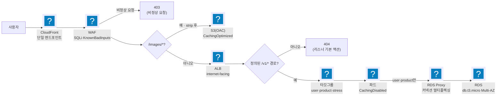
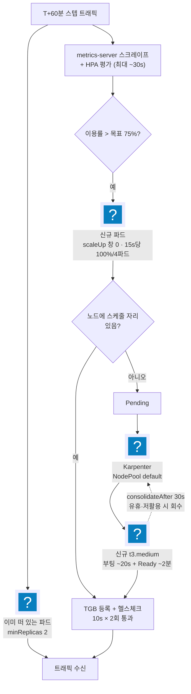

import { Quiz, QuizResults } from 'starlight-quiz/components';

> 문서 유형: explanation

선행 지식과 학습 경로는 [모듈 개요](/part-5/14-task3-load-ops/)에.

1·2과제는 리소스의 존재와 이름을 검사한다. 3과제는 리소스를 보지 않고 부하 주입 인스턴스의 `results_<비번호>.log` 안의 **네 비율**만 읽는다 — 채점 방식 자체가 다르다. 그래서 "배포가 끝났다"는 0점에서 출발한다는 뜻이고, 점수는 트래픽 2시간 동안의 운영이 만든다.

:::caution[이 문서의 수치는 예상 풀이 기준이다]
3과제 공식 과제지·채점지는 아직 공개되지 않았다. 이 문서의 4축 배점·SLO 정확값·계단 비율·비용 ratio 구간은 `task-3` 예상 풀이(파일명 그대로 `task-sample.md`·`mark-sample.md`)에서 가져온 예측이며 실제 대회에서 달라질 수 있다. 총점 40점은 1·2과제 각 30점·전체 100점에서 역산되므로 비교적 안정적이지만, 그 **안의 구성은 예상**이다.

반대로 이 문서가 가르치는 **튜닝 방법론** — SLO로 HPA를 역산하는 사고, CPU limit을 제거하는 판단, RDS Proxy 풀링·인덱스 설계, 비용을 성능의 게이트로 다루는 사고 — 는 정확한 배점이 달라져도 유효하다.
:::

## 채점 4축의 구조

| 축 | 배점 | 측정값 | 임계 |
|---|---|---|---|
| 비정상 요청 처리 | 4 | image download 비율, Exception Handling 비율 | 50 / 80 / 85 / 90% |
| 고가용성 및 안정성 | 12 | 앱 3종 availability | 30 / 50 / 70 / 80 / 82.5 / 85 / 87.5 / 90% |
| 성능 효율성 | 12 | user·product ≤ 0.2s 비율, stress ≤ 1.0s 비율 | 위와 동일 8단계 |
| 비용 최적화 | 12 | 인스턴스 비용 ratio | 0.5 이상 1.00~3.75 이하 12단계 |

*(배점·임계값은 예상 채점지 `mark-sample.md`를 그대로 옮겼다 — 위 캐션 참고.)*

세 가지 구조적 사실이 전략을 결정한다.

**① 계단식이라 부분 점수가 크다.** 30%만 넘겨도 축마다 득점이 시작된다. 목표 0.2초를 못 맞춰도 절반은 건진다. 부하 중 스택을 통째로 교체하는 것보다 지금 비율을 한 계단 올리는 조정이 항상 낫다.

**② 비용 축은 성능 축의 종속 항목이다.** 비용 12점의 각 항목은 ratio 범위와 함께 user·product·stress **performance가 모두 30% 이상**일 것을 요구한다. 성능이 무너지면 비용 12점도 같이 사라진다. 그러므로 절약이 성능을 깎는 지점에서는 절약을 멈춘다.

**③ 하한 0.5가 있다.** ratio가 낮을수록 좋은 것이 아니다. 리소스를 지나치게 줄이면 하한 아래로 떨어져 12점 전체가 0이 된다. 목표는 최소가 아니라 **밴드 안**이다.

:::danger[사전준비 조항(예상) — 배포 시점에 이미 확정된다]
계단식 채점보다 사전준비 조항이 더 무겁다.

- 엔드포인트가 선수 시스템이 아니면 **전 항목 0점**
- DB 타입·대수가 과제지와 다르면 **성능·비용 24점이 0점**
- **컴퓨팅은 EC2 인스턴스만.** 샘플 과제지 유의사항 15는 "어떠한 목적으로든 Fargate 와 Lambda 를 사용할 수 없다"고 못박는다. 편의를 위한 한 번의 Lambda 도 예외가 아니다
- **인스턴스 타입은 `t3.medium` 만.** 다른 타입을 섞거나 과도하게 띄우면 감점이다. 컨테이너 오케스트레이션도 EKS 고정이고 ECS 는 쓸 수 없다
- **불필요한 리소스는 그 자체가 감점**이다 — 미사용 EC2, 추가 VPC, 다른 리전에 남긴 리소스. 작업용 bastion 도 EC2 수에 든다

전부 트래픽 전에 검증한다. 앞의 셋은 배포 시점에 이미 확정되고, 뒤의 둘은 경기 내내 주기적으로 측정된다.
:::

## 심사위원이 제시한 3축 — 프로비저닝·요청 처리·비용

채점지의 4축은 결과 로그가 남긴 비율이다. 심사위원 세션(2026-05-19)은 그 앞단에서 선수가 신경 쓸 것을 셋으로 정리했다. 같은 시스템을 결과가 아니라 **행동** 쪽에서 본 분해다.

| 축 | 완료·판정 기준 | 4축의 어디로 나오나 |
|---|---|---|
| 프로비저닝 | 명시된 인프라를 세운 뒤 테스트 API 호출에 성공 응답이 오는 것 | 사전준비 조항 — 못 넘기면 전 항목 0 |
| 요청 처리 | 응답 코드가 예상값(200 등)이고 제한 시간 안에 도착하는 것 | 가용성 12 + 성능 12 |
| 비용 | 인스턴스 개수. bastion을 포함한 모든 EC2가 들어간다 | 비용 12 |

3과제는 1·2과제처럼 요구사항대로 만들고 구현 여부를 확인하는 형태가 아니다. **당일 제공되는 애플리케이션을 분석해 정상 구동하고, 로그·메트릭·동작 방식을 읽어 효율적이고 안정적으로 운영하는 것**이 과제의 핵심이라고 협의회가 명시했다. 취약점도 특정 계층에 고정돼 있지 않다 — 시스템의 모든 구성 요소에서 나올 수 있고, 채점 플랫폼이 주는 로그와 정보로 식별해 대응한다.

### 상태 판단은 USE·RED로 한다

노브를 만지기 전에 지금 상태를 읽어야 한다. 심사위원 세션이 지목한 두 패턴이 그 언어다 — 하나는 자원을, 하나는 요청을 본다.

| 패턴 | 축 | 보는 값 |
|---|---|---|
| USE | 자원 | Utilization(사용률) · Saturation(대기·큐 포화) · Errors(자원 단의 오류) |
| RED | 요청 | Rate(초당 요청 수) · Errors(오류율) · Duration(지연 분포) |

둘을 함께 봐야 조치가 갈린다. RED의 Duration이 늘었는데 USE의 Utilization이 낮으면 파드가 놀면서 무언가를 기다리는 상태다 — 커넥션 풀 포화나 DB 대기(Saturation)이므로 노드를 늘려도 낫지 않는다. 반대로 Utilization이 천장에 붙어 있고 Duration이 함께 오르면 scale-out이 맞는 조치다. **RED로 증상을 보고 USE로 원인 계층을 좁힌다** — 부하 중 30초 감시 루프가 그대로 이 순서다.

## 그 값을 어디서 보는가 — Container Insights :badge[강의]{variant=tip}

USE·RED를 읽으려면 지표와 로그가 먼저 모여 있어야 한다. EKS에서 그 수집기를 한 번에 세우는 것이 **CloudWatch Observability 추가 기능**이다. 설치하면 데몬셋 두 개가 모든 노드에 뜬다.

| 데몬셋 | 수집 대상 | USE·RED의 어디 |
|---|---|---|
| CloudWatch Agent | CPU·메모리·네트워크·디스크 지표 | USE — Utilization·Saturation |
| Fluent Bit | 컨테이너 stdout 로그, 데이터플레인 로그, 호스트 로그 | RED — Rate·Errors (로그에서 센다) |

콘솔에서는 클러스터·노드·파드·컨테이너 네 단위로 사용률이 갈라져 보인다. 3과제에서 이 화면이 필요한 이유는 채점이 클라이언트 도착 기준 응답시간을 보기 때문이다 — 지연이 어느 계층에서 붙었는지는 이 지표 없이는 추측이 된다.

:::caution[사용률이 비어 있으면 requests·limits 를 먼저 본다]
Container Insights의 **사용률(%)** 은 사용량을 requests·limits로 나눠 계산한다. 파드에 두 값이 선언돼 있지 않으면 절대 사용량만 나오고 사용률 패널은 비어 있다. 대시보드가 비었을 때 수집기부터 의심하기 전에 매니페스트의 `resources` 를 먼저 확인한다.
:::



<details class="diagram-note">
<summary>이 도식이 보여주는 것</summary>

추가 기능이 세우는 두 갈래다. 위쪽은 노드의 자원 지표를 CloudWatch Agent 가 모아 보내고, 아래쪽은 파드 로그를 Fluent Bit 이 보낸다. 점선은 실패 지점이다 — 수집은 정상인데 전송 권한이 없으면 콘솔에 아무것도 뜨지 않는다. 그래서 화면이 비었을 때 첫 확인은 데몬셋 파드의 로그다.

</details>

## 추적 계층 — Application Signals 와 X-Ray :badge[강의]{variant=tip}

지표는 "얼마나 썼는가"를, 로그는 "무슨 일이 있었는가"를 말한다. 요청 하나가 **어느 구간에서 늦었는가**는 둘 다 답하지 못한다. 그 자리를 채우는 도구가 둘이다.

| | Application Signals(APM) | X-Ray |
|---|---|---|
| 보는 것 | 서비스 단위 응답시간·에러율·요청 수 | 요청 하나의 구간별 지연 — ALB → 파드 → DB |
| 붙이는 법 | 자동 계측 — 언어 런타임에 에이전트를 얹는다 | SDK로 코드에 세그먼트를 남긴다 |
| 지원 언어 | Java · Python · Node.js | 위 셋 + Go(SDK 직접) |

:::danger[Go 앱은 자동 계측이 없다]
3과제가 제공하는 앱 바이너리는 Go로 빌드된 경우가 많고, **Application Signals는 Go를 자동 계측하지 못한다.** 제공 바이너리는 수정 금지이므로 코드에 SDK를 넣는 경로도 막힌다.

그래서 Go 앱의 구간별 지연은 앱 바깥에서 재야 한다 — ALB의 `TargetResponseTime`, RDS Proxy의 `DatabaseConnectionsBorrowLatency`, 그리고 k6가 재는 클라이언트 도착 시간의 차이를 빼서 어느 홉이 먹었는지 좁힌다. 앱을 고칠 수 있는 조건(추가 문항으로 직접 개발한 Lambda 등)에서만 X-Ray SDK가 선택지가 된다.
:::

## 응답시간은 클라이언트 도착 기준이다

과제지는 "채점 시 사용되는 응답시간 및 코드는 모두 클라이언트 도착 기준"이라고 못박는다. 즉 0.2초 안에 **CloudFront → WAF 평가 → ALB → 파드 → RDS Proxy → RDS** 왕복이 전부 들어간다. 앱 내부 처리 시간만 보고 안심하면 안 된다. 홉마다 붙는 지연이 예산을 먹으므로, 예산을 태우는 큰 덩어리 세 개(DB 풀스캔, CPU 스로틀링, 스케일 지연)를 먼저 없앤다.



<details class="diagram-note">
<summary>이 도식이 보여주는 것</summary>

요청이 갈라지는 지점을 순서대로 그렸다. WAF 가 먼저 비정상 요청을 403 으로 끊고, 그다음 경로가 `/images/*` 면 S3 로 가 캐시된다. 나머지는 ALB 로 가는데 정의되지 않은 경로는 리스너 기본 액션의 404 로 끝난다. 실제 API 만 파드에 닿고, 그중 사용자·상품 조회만 RDS Proxy 를 거쳐 DB 로 간다. 어느 계층이 어떤 응답을 내는지가 곧 채점의 응답 코드 항목이다.

</details>

0.2초 예산은 이 경로 전체에 걸린다 — CloudFront에서 RDS까지 홉마다 지연이 쌓인다. 같은 진입점 위에서 403은 WAF가, 404는 ALB 리스너 기본 액션이 낸다.

## 스케일 리드타임이 초반 가용성을 결정한다

트래픽은 T+60분에 **스텝으로** 들어온다. 그 순간부터 새 파드가 트래픽을 받기까지의 사슬은 이렇다. 사슬이 타이머 몇 개의 합으로 결정된다는 일반 원리는 [autoscaling-basics 의 수렴 시간 절](/start/autoscaling-basics/#수렴-시간은-타이머-세-개의-합이다)에 있다.

1. metrics-server 스크레이프 + HPA 평가 주기 — 두 주기가 직렬로 쌓인다. metrics-server `--metric-resolution` 은 기본 60초이고 흔히 15초로 낮춰 쓰는데, 15초로 낮춰도 메트릭 노후 + HPA 싱크(15초)로 **최악 약 30초**다
2. 파드 스케줄·기동 — 약 10초 (이미지가 노드에 캐시된 경우)
3. 노드가 부족하면 Karpenter 노드 프로비저닝 — 부팅 약 20초, 등록·Ready까지 약 2분
4. TargetGroupBinding 등록 + 헬스체크 통과 — `interval 10s × healthy_threshold 2` ≈ 20~30초



<details class="diagram-note">
<summary>이 도식이 보여주는 것</summary>

트래픽이 늘 때 걸리는 시간을 단계별로 분해했다. 이미 떠 있는 파드는 즉시 받지만, 새 파드는 메트릭 수집과 HPA 평가에 최대 30초, 스케줄될 자리가 없으면 노드 부팅에 2분 남짓, 그다음 타깃 등록과 헬스체크 2회 통과가 더 걸린다. 그래서 미리 떠 있는 최소 replicas 와 노드 워밍업이 응답 시간을 좌우한다. 점선은 반대 방향으로, 유휴 노드는 30초 뒤 회수된다.

</details>

낙관적으로 40초, 노드가 새로 필요하면 2~3분이다. **그 시간의 트래픽은 이미 떠 있는 파드로 받는다.** 그래서 `minReplicas`를 2로 두고, HPA `scaleUp.stabilizationWindowSeconds: 0`에 15초당 100%·4파드 정책을 건다. 반대로 `scaleDown`은 120초 안정창을 둔다 — 스파이크 사이 골짜기마다 파드를 버리면 다음 파도에서 같은 사슬을 다시 탄다.

```yaml
# k8s/10-user.yaml 발췌 — product·stress도 동일 behavior
apiVersion: autoscaling/v2
kind: HorizontalPodAutoscaler
metadata:
  name: user
spec:
  minReplicas: 2
  maxReplicas: 9
  metrics:
    - type: Resource
      resource:
        name: cpu
        target:
          type: Utilization
          averageUtilization: 75
  behavior:
    # 스케일아웃은 기본값 그대로가 이미 가장 빠르다 — 의도를 드러내려고 명시만 한다
    scaleUp:
      stabilizationWindowSeconds: 0
      policies:
        - type: Percent
          value: 100
          periodSeconds: 15
        - type: Pods
          value: 4
          periodSeconds: 15
      selectPolicy: Max
    # 스파이크 종료 후 빠른 회수로 비용 ratio를 낮춘다
    scaleDown:
      stabilizationWindowSeconds: 120
      policies:
        - type: Percent
          value: 50
          periodSeconds: 30
```

<details class="diagram-note">
<summary>이 블록이 하는 일</summary>

HPA 한 장이다. CPU 이용률 75% 를 목표로 2에서 9 사이를 오간다. `behavior.scaleUp` 은 기본값과 같은 값을 일부러 적어 둔 것이다 — 안정화 창 0초에 15초마다 100% 또는 4파드 중 큰 쪽으로 늘린다. 이용률의 분모가 `requests` 이므로 그 값을 크게 잡으면 같은 부하에서도 스케일이 늦게 걸린다.

</details>

이 매니페스트에서 기본값과 다른 것은 `scaleDown` 쪽뿐이다 — 안정화 창 300→120초, 축소 정책 `Percent 100/15s`→`Percent 50/30s`. `scaleUp` 블록은 쿠버네티스 기본값과 같은 값이라 생략해도 동작이 같다. 스케일아웃을 "더 공격적으로" 만들 여지는 애초에 없다는 뜻이다.

노드를 미리 확보하는 사전 워밍은 비용 ratio를 올리므로 무료가 아니다. 채점 트래픽 개시 직전에만 워밍하고, 개시 후에는 오토스케일에 맡기는 것이 밴드 안에 머무는 방법이다.

## requests 와 limits — 무엇이 배치를 정하고 무엇이 상한인가

부하 운영에서 가장 많이 틀리는 지점이 이 둘의 역할이다. `requests`(요청량)는 파드가 뜨기 위해 노드에서 **예약하는 양**이고, `limits`(상한)는 그 컨테이너가 **쓸 수 있는 최대치**다.

| | requests | limits |
|---|---|---|
| 뜻 | 파드를 띄우려면 노드에 있어야 하는 최소 여유 | 컨테이너가 넘을 수 없는 상한 |
| 스케줄링 | 배치 기준 — 남은 여유보다 크면 Pending | 관여하지 않는다 |
| 초과했을 때 | 초과 개념이 없다 — 상한이 아니다 | CPU는 스로틀링, 메모리는 OOMKill |

`requests`가 실제로 쓰이는 곳은 **둘뿐**이다.

1. **스케줄링** — 어느 노드에 배치할지 정한다. t3.medium(allocatable 약 1930m)에 600m짜리 파드는 3개까지 들어간다.
2. **HPA 이용률의 분모** — 이용률 = 현재 사용량 ÷ requests다([autoscaling-basics](/start/autoscaling-basics/#1-hpa--이용률의-분모는-requests다)). limits는 이 계산에 들어가지 않는다.

이 둘 외에 `requests`가 실사용량을 제한하지는 않는다. requests를 0.1코어로 잡은 파드도 노드에 여유가 있으면 1코어를 쓴다. 그래서 requests를 낮추면 앱이 느려지는 것이 아니라, **같은 사용량에서 이용률이 커져 HPA가 더 빨리 늘린다.** requests 0.8코어인 파드가 1.0코어를 쓰면 이용률은 125%이고, 목표가 75%면 파드가 늘어난다.

:::note[사용량과 이용률은 다른 값이다]
사용량은 절대값(`kubectl top pods`의 `1024m`)이고, 이용률은 그 값을 requests로 나눈 백분율(`kubectl get hpa`의 `125%/75%`)이다. requests를 바꾸면 사용량은 그대로인데 이용률만 움직인다 — 부하 중에 requests를 건드리면 지표가 통째로 재해석되므로, 노브 하나 규칙에서 이것이 가장 위험한 노브다.

**requests가 선언되지 않으면 이용률 자체가 계산되지 않는다.** HPA가 `<unknown>/75%`를 띄우고 스케일이 걸리지 않는다.
:::

### requests 와 limits 를 얼마나 벌릴 것인가

두 값의 간격이 정책이다.

- **requests = limits** — 파드끼리 자원을 두고 간섭하지 않는다. 대신 트래픽이 튀어도 상한 위로 못 올라가 스파이크를 흡수하지 못한다.
- **requests만 선언(CPU)** — 노드의 유휴 CPU까지 버스트해 스파이크를 흡수한다. 대신 같은 노드의 파드끼리 CPU를 두고 경합한다.

3과제는 스텝 트래픽을 받아야 하므로 CPU는 뒤쪽을 고른다.

### CPU limit을 걸지 않는 이유

CPU limit은 CFS 쿼터로 구현된다. 쿼터를 소진한 컨테이너는 다음 주기(기본 100ms)까지 강제로 멈춘다 — p99에 100ms 단위 지연이 그대로 꽂히고, 이는 0.2초 예산의 절반이다. `requests`만 선언하면 스케줄링은 요청량 기준으로 하면서 순간 버스트는 노드의 유휴 CPU가 흡수한다.

t3.medium에 앱 3파드를 패킹하려면 파드당 600m가 실측 균형점이다.

### 메모리는 반대로 limit 을 반드시 건다

메모리는 압축 불가능한 자원이다. CPU가 모자라면 느려지고 끝나지만, 메모리가 한도를 넘으면 커널이 컨테이너를 강제 종료한다(OOMKill). 파드 재시작은 그 사이 요청을 통째로 잃으므로 availability를 직접 깎는다 — CPU 지연보다 훨씬 비싸다.

그래서 메모리는 request = limit로 고정한다. 두 값을 벌려 두면 스케줄러는 작은 request 기준으로 파드를 밀어 넣는데, 실사용이 limit 근처까지 오르면 노드 메모리가 먼저 바닥나 다른 파드까지 죽는다.

## 데이터 계층 — 인덱스 하나가 성능 축을 좌우한다

과제지가 준 스키마에는 `email` 인덱스가 없는데 `GET /v1/user?email=`이 유일한 조회 패턴이다. 50만 행 풀스캔은 db.t3.micro에서 0.2초 예산을 통째로 태운다. 과제지의 "테이블 구조 재설계가 필요할 수 있다"는 문장이 이 인덱스를 가리킨다.

```sql
-- db/01-schema.sql (과제지 SQL 그대로) — email 컬럼에 인덱스가 없다
CREATE TABLE user (
    id VARCHAR(255) NOT NULL,
    username VARCHAR(255) NOT NULL,
    email VARCHAR(255) NOT NULL,
    PRIMARY KEY (id),
    UNIQUE KEY uk_username (username)
);

-- db/02-index.sql — dump 적재 후 필수. dump가 DROP/CREATE TABLE을 포함할 수 있어 순서가 중요하다.
ALTER TABLE user ADD INDEX idx_email (email);
```

<details class="diagram-note">
<summary>이 블록이 하는 일</summary>

지급 스키마에는 `email` 인덱스가 없다. 이메일로 조회하는 API 가 있으므로 그대로 두면 매 요청이 전체 테이블을 훑어 응답 시간 예산을 먹는다. 아래 `ALTER` 를 **덤프 적재 뒤에** 실행하는 것이 순서의 요점이다 — 덤프가 테이블을 다시 만들면 먼저 건 인덱스가 사라진다.

</details>

db.t3.micro의 진짜 병목은 스토리지가 아니라 **커넥션 수와 CPU**다. user 테이블 수십 MB는 InnoDB 버퍼풀에 상주해 디스크 IOPS(초당 읽기·쓰기 횟수)를 거의 쓰지 않는다. 반면 파드가 9개로 늘면 각 파드의 커넥션 풀이 곱해져 `max_connections`에 먼저 닿는다. RDS Proxy가 클라이언트 커넥션을 백엔드 커넥션에 멀티플렉싱해 이 곱셈을 끊는다.

```hcl
# terraform/rds-proxy.tf 발췌 — 파드 수가 늘어도 백엔드 커넥션은 이 풀 안에서 재사용된다
resource "aws_db_proxy_default_target_group" "this" {
  db_proxy_name = aws_db_proxy.this.name
  connection_pool_config {
    max_connections_percent      = 100   # RDS max_connections 대비 상한
    max_idle_connections_percent = 50
  }
}
```

<details class="diagram-note">
<summary>이 블록이 하는 일</summary>

[`aws_db_proxy_default_target_group`](https://registry.terraform.io/providers/hashicorp/aws/latest/docs/resources/db_proxy_default_target_group) 이 정하는 커넥션 풀 설정이다. 파드가 늘면 클라이언트 커넥션은 함께 늘지만 백엔드 커넥션은 이 풀 안에서 재사용되므로 DB 의 `max_connections` 에 먼저 닿지 않는다. 유휴 커넥션 상한을 절반으로 둔 것은 부하가 빠진 뒤 커넥션을 붙들고 있지 않게 하려는 것이다.

</details>

:::danger[RDS Proxy 의 두 가지 함정]
- **피닝(pinning)**: 세션 상태를 만드는 문장(대형 트랜잭션 — `BEGIN` 부터 `COMMIT` 까지 한 덩어리로 묶이는 작업 단위 — 임시 테이블, 큰 구문)은 클라이언트를 백엔드 커넥션에 고정시켜 멀티플렉싱을 무효화한다. `load_user.dump` 적재는 프록시가 아니라 **인스턴스 직결**로 넣는다.
- **인증 방식**: 제공 바이너리는 수정 불가이며 TLS를 협상하지 않는다. MySQL 8.0 기본 `caching_sha2_password`는 평문 연결에서 비밀번호 교환이 실패하므로, 프록시 클라이언트 인증과 백엔드 유저를 모두 `mysql_native_password`로 맞춘다.
:::

## 엣지 계층 — 캐시할 것과 캐시하면 안 되는 것

앱은 변조 방지를 위해 요청의 `requestid`·`uuid`를 응답에 echo한다. **API 응답을 캐시하면 다른 요청의 uuid가 섞여 나가 변조로 간주된다** — API 동작은 CachingDisabled다. 캐시로 성능을 버는 곳은 `/images/*` 하나뿐이고, 이쪽은 이미지 처리율(비정상 요청 처리 축)에 직결한다.

:::danger[없는 이미지가 404 가 아니라 403 을 낸다 — 실측]
`/images/*` 를 S3 로 보낼 때 OAC 에 `s3:GetObject` 만 주면, **없는 키를 요청했을 때 S3 는 404 가 아니라 403** 을 낸다. 키의 존재 여부를 숨기는 S3 의 기본 동작이다. 응답 코드가 채점 대상인 과제에서 이건 그대로 실점이다.

`s3:ListBucket` 을 더하면 404 가 나오지만 이번엔 **버킷 목록이 노출**된다. 정답지는 대신 경로 접두어를 떼는 CloudFront Function 안에서 **키가 비었을 때 404 를 직접 반환**하는 쪽을 택했다. 배포 직후 `curl -o /dev/null -w "%{http_code}" <엔드포인트>/images/없는파일.jpg` 로 반드시 확인한다.
:::

이미지는 트래픽 중에 product의 PUT으로 **갱신**된다. 캐시가 오래 남으면 갱신 전 이미지가 나가고, 짧으면 오리진 왕복이 늘어난다. 선택지는 세 가지다.

| 방법 | 반영 속도 | 비용·부담 | 쓰는 때 |
|---|---|---|---|
| 무효화(invalidation) | 즉시 | 월 1000건 무료 | 특정 경로가 stale로 확인됐을 때 |
| 짧은 TTL 커스텀 캐시 정책 | TTL만큼 지연 | 오리진 요청 증가 | 갱신이 잦고 경로를 특정할 수 없을 때 |
| 키 버전 관리 | 즉시 | 앱 수정 필요 | 앱을 고칠 수 있을 때 — 3과제는 불가 |

제공 바이너리를 고칠 수 없으므로 실질 선택지는 앞의 둘이다.

### 캐시 키에 무엇이 들어가는가 :badge[강의]{variant=tip}

캐시 정책은 "얼마나 오래 두는가"만 정하지 않는다. **무엇이 같은 요청인가**를 함께 정한다. 쿼리스트링이 캐시 키에 없으면 `?id=1`과 `?id=2`가 같은 요청으로 취급돼 첫 응답이 둘 다에게 나간다. 경로만 같고 파라미터로 내용이 갈리는 API에서 이 설정이 곧 오답이다.

| 정책 자리 | 정하는 것 | 3과제에서 |
|---|---|---|
| 캐시 정책 | TTL과 캐시 키 구성(헤더·쿠키·쿼리스트링) | API는 `CachingDisabled`, `/images/*`는 캐시 |
| 오리진 요청 정책 | 오리진으로 **전달할** 헤더·쿠키·쿼리스트링 | 앱이 쿼리스트링을 읽으므로 전달이 필요하다 |

두 정책은 별개다. 캐시 키에서 뺀 값도 오리진 요청 정책에 있으면 오리진에는 전달된다 — API를 캐시하지 않으면서 파라미터는 앱까지 보내는 구성이 이 조합이다. 기본값은 상당수 헤더·쿼리스트링을 오리진에 전달하지 않으므로, 앱이 받아야 할 값이 사라지면 이 자리부터 본다.

동작을 확인하는 순서도 정해 둔다. 배포 직후에는 캐시 정책을 `CachingDisabled`로 두고 오리진 응답이 그대로 보이는지 확인한 뒤, 이미지 경로만 캐시를 켠다. 처음부터 캐시를 켜면 고친 설정이 반영됐는지 아닌지를 구분할 수 없다.

응답 코드는 **두 계층으로 나뉜다**. 비정상 요청 403은 WAF가, API 외 경로 404는 ALB 리스너 기본 액션이 낸다. 순서가 중요하다 — WAF가 먼저 평가되므로 `/v1/none`으로 오는 공격 문자열은 404가 아니라 403이 나갈 수 있다. 관리형 룰은 SQLi와 KnownBadInputs만 block으로 둔다. CommonRuleSet은 `NoUserAgent`·`SizeRestrictions` 같은 규칙이 정상 채점 트래픽을 오차단해, 403 처리율에서 버는 것보다 availability에서 잃는 것이 크다.

API 경로에서 캐시로 벌 수 있는 점수는 없다 — 성능 축 12점(user·product·stress 응답시간 비율)은 전적으로 **DB 단(인덱스·커넥션 풀링)**에서 결정된다. 캐시라는 흔한 성능 레버가 이 과제에서만 원천 봉쇄되는 것이 데이터 계층을 핵심으로 만드는 이유다.

### WAF 로그는 켜야 남는다 :badge[강의]{variant=tip}

WAF는 평가 로그를 **기본적으로 남기지 않는다.** 악의적 트래픽 대응이 채점 대상인데 어떤 요청이 어느 규칙에 걸렸는지 기록이 없으면, 오차단을 잡는 것도 차단 실적을 확인하는 것도 불가능하다. 그래서 Web ACL을 붙인 직후에 로깅부터 켠다.

| 항목 | 규칙 |
|---|---|
| 로그 그룹 이름 | 반드시 `aws-waf-logs-` 로 시작한다. 다른 이름이면 로깅 설정 자체가 거부된다 |
| 대상 | CloudWatch Logs(바로 조회) 또는 S3(대량 분석). 부하 중 조정이 목적이면 CloudWatch |
| 리전 | `CLOUDFRONT` 스코프 Web ACL의 로그 그룹도 us-east-1 |
| 권한 | 로그 배달 주체(`delivery.logs.amazonaws.com`)가 그 로그 그룹에 쓸 수 있어야 한다 |

CloudFront 액세스 로그와는 다른 자료다. CloudFront 로그는 요청이 무엇이었는지를, WAF 로그는 그 요청을 **어느 규칙이 어떻게 판정했는지**를 남긴다. 정상 요청이 403일 때 필요한 것은 뒤쪽이다.

협의회가 예시로 든 추가 문항(모니터링 로그가 쌓이면 Firehose로 S3에 적재)이 이 지점에 붙는다 — 로그 그룹을 만들어 두면 구독 필터를 거는 것이 다음 한 단계다.

### 실습 로그가 말한 것 — 무엇이 신호이고 무엇이 아닌가 :badge[실측]{variant=note}

`skills-2026/task-3` 의 연습 세션에서 WAF 로그 **720,319건**을 분석한 기록이 있다. 결론 셋이 설계를 바꿨다.

**첫째, IP 와 국가는 신호가 아니다.** 공격을 포함한 전체 트래픽의 99.4% 가 **하나의 IPv6 주소**에서 왔다. 채점 트래픽과 악의적 트래픽이 같은 출처로 들어온다는 뜻이다. 그래서 rate-based 규칙이든 IP 세트든 출처로 끊는 순간 채점 트래픽이 같이 죽는다. 남는 신호는 **페이로드·경로·User-Agent** 뿐이다.

**둘째, 민감도를 올린 커스텀 규칙이 정상 요청을 잡아먹는다.** 민감도 HIGH 로 둔 커스텀 SQL 주입 규칙이 **정상 채점 요청 24,220건을 차단**했다. 창 전체의 80% 다. 원인은 평범했다 — 토크나이저가 `email=...@example.org` 를 주입 시도로 읽었다. 처리량으로 채점받는 과제에서 HIGH 민감도 커스텀 SQLi 규칙은 쓰지 않는다.

**셋째, base64 로 감싼 주입은 관리형 규칙 그룹을 그냥 통과한다.** 관리형 규칙 그룹의 텍스트 변환은 고정이고, 스코프 다운에 붙인 변환은 그룹 안으로 상속되지 않는다. 그래서 base64 디코드를 적용한 **커스텀 규칙을 따로**, 민감도 LOW 로 둔다.

이 셋의 공통점은 **로그를 보기 전에는 알 수 없었다**는 것이다. 규칙을 고르는 일은 설계가 아니라 측정이고, 그래서 트래픽이 시작되기 전에 로깅부터 켠다.

:::caution[403 과 404 가 섞이면 두 항목을 같이 잃는다]
WAF 는 CloudFront 에 붙어 ALB 앞에 선다. 그래서 아무 조치 없이 두면 **정의되지 않은 경로로 온 공격 문자열이 404 가 아니라 403** 으로 나간다 — 과제지는 API 외 경로에 404 를 요구하므로 이건 오답이다.

정답지가 택한 방법은 **모든 규칙에 API 경로 화이트리스트를 스코프 다운으로 붙이는 것**이다. 알려진 API 경로가 아니면 WAF 평가에 아예 들어가지 않고 ALB 의 기본 액션 404 로 떨어진다. 기각된 대안들도 같이 기억해 둘 값어치가 있다 — 관리형 규칙 그룹을 `and_statement` 로 감싸는 것은 **WAF 가 중첩을 금지**해서 안 되고, 404 전용 차단 규칙을 따로 두면 화이트리스트를 두 벌 관리하게 되며, 소문자 변환(`LOWERCASE`)은 **ALB 경로 패턴이 대소문자를 구분**하는 탓에 두 계층의 판정이 어긋난다.
:::

## 비용 ratio는 노드 수의 함수다

인스턴스 타입이 t3.medium으로 고정돼 있으므로 비용을 움직이는 변수는 **노드 수 × 시간**뿐이다.

협의회 회의록이 산정 방식을 확인해 줬다. **EC2 인스턴스 수를 주기적으로 확인해** 전체 경기 시간을 기준으로 점수를 매기고, 적게 쓸수록 높은 점수다 — 한 시점의 스냅숏이 아니라 시간 적분이므로 부하가 없는 구간에 노드를 줄여 두는 것도 그대로 점수다. 제시된 구성 외의 EC2에는 **패널티 점수**가 붙고, kubectl용 bastion을 세웠다면 그 EC2도 개수에 들어간다([대회 운영 규칙](/reference/competition-rules/)).

밴드 안에 머무는 구조는 세 층으로 만든다.

- HPA 목표 이용률 75% — 파드를 뜨겁게 굴려 같은 트래픽을 더 적은 파드로 처리한다.
- NodePool `limits.cpu` — 폭주 상한. HPA 전체 상한(3앱 × 9파드 × 600m ≈ 16.2 vCPU)을 수용하는 t3.medium 9대 = 18 vCPU.
- Karpenter consolidation 30초 — 스파이크가 끝나면 빈 노드를 즉시 회수한다. PDB와 `budgets: nodes 1`이 회수 중 가용성을 지킨다.

```yaml
# k8s/01-nodepool.yaml 발췌
spec:
  template:
    spec:
      requirements:
        - key: "node.kubernetes.io/instance-type"
          operator: In
          values: ["t3.medium"]        # 인스턴스 타입 고정 — 바꾸려면 여기만
  limits:
    cpu: "18"                          # 폭주 상한: t3.medium 9대 몫
  disruption:
    consolidationPolicy: WhenEmptyOrUnderutilized
    consolidateAfter: 30s              # 빈 노드를 빨리 회수 → 비용 ratio
    budgets:
      - nodes: "1"                     # 자발적 중단은 한 번에 1대까지 — 가용성 보호
```

<details class="diagram-note">
<summary>이 블록이 하는 일</summary>

Karpenter NodePool 의 네 가지 결정이다. 인스턴스 타입을 하나로 고정해 비용 계산을 예측 가능하게 하고, `limits.cpu` 로 폭주 시 상한을 건다. `consolidateAfter: 30s` 는 빈 노드를 빨리 회수해 비용 비율을 낮추고, `budgets` 의 `nodes: "1"` 은 자발적 중단을 한 번에 한 대로 제한해 회수 도중 가용성이 흔들리지 않게 한다.

</details>

## 연구 자료를 그대로 믿지 않는다 — :badge[실측]{variant=note} 대조

부하 튜닝 문헌과 정답지 실측이 어긋나는 지점이 있다. 어긋날 때는 실측을 따른다.

| 흔한 주장 | 실제 | 근거 |
|---|---|---|
| CPU limit을 생략하면 request가 사실상 상한으로 동작한다 | 아니다. limit이 없으면 노드의 유휴 CPU까지 버스트한다. 그게 limit을 빼는 이유다 | cgroup CFS 동작 |
| db.t3.micro의 `max_connections`는 약 85 (`{DBInstanceClassMemory/12582880}` 에 1 GiB 대입) | 그 식은 맞지만 `DBInstanceClassMemory` 는 **OS·RDS 예약분을 뺀 값**이라 1 GiB 를 그대로 넣으면 안 된다. 실측은 60~66 보고가 많다 — 값은 `SELECT @@max_connections;` 로 직접 확인한다. 어느 쪽이든 파드 수 × 풀 크기로 쉽게 넘기므로 프록시로 끊는 것이 답 | RDS 파라미터 기본식 + 실측 |
| NodePool에 `replicas`를 주면 노드를 고정 확보한다 | EKS Auto Mode NodePool에서 지원 여부를 당일 `kubectl explain nodepool.spec`으로 확인한다. 확실한 방법은 낮은 우선순위 placeholder 파드로 노드를 미리 띄우는 것 | Auto Mode 스키마 검증 필요 |
| deregistration delay를 300초에서 60초로 줄여라 | 3과제 실측값은 15초 + 파드 `preStop: sleep 15`. 스케일다운이 잦아 60초도 길다 | `terraform/alb.tf` |
| 경기 시간은 60분 | 경기는 3시간, **트래픽이 T+60분에 시작**한다. 배포 데드라인이 60분이라는 뜻 | 과제지 1·7절 |
| ALB `slow_start`를 켜서 새 타깃을 보호하라 | 켜지 않는다. 스케일아웃 직후 신규 파드로 트래픽이 늦게 가면 기존 파드가 포화된다 | 기본값 0 유지 |

---

## 자기 점검 퀴즈

<Quiz title="성능 축이 무너질 때의 실제 손실">
user·product·stress 중 하나라도 performance가 30% 아래로 떨어졌다. 잃는 점수는?

- [x] 24점 — 성능 12점 + 비용 12점
- [ ] 12점 — 성능 축만 잃고 비용 축은 ratio로 독립 채점된다
  > 비용 축이 독립이라는 것이 가장 비싼 오해다. 비용 12점의 **각 항목**이 3개 앱 performance ≥ 30%를 동시에 요구한다.
- [ ] 28점 — 성능 12점 + 비용 12점 + 고가용성 4점
- [ ] 0점 — 계단식 채점이라 30% 아래에도 부분 점수가 남는다
  > 계단식은 30% 이상 구간의 이야기다. 30%가 첫 계단이므로 그 아래는 득점이 시작되지 않는다.

**24점.** 성능 12점을 잃고, 비용 12점의 모든 항목이 3개 앱 performance ≥ 30%를 동시 요구하므로 비용도 함께 0이 된다. 그래서 **절약이 성능을 깎는 지점에서는 절약을 멈춘다** — 비용 축은 성능 축의 종속 항목이다.
</Quiz>

<Quiz title="비용 ratio 밴드">
비용 ratio는 하한 [[0.5]] 이상, 1.00~3.75 이하의 12단계로 채점된다. 목표는 최소가 아니라 밴드 안이다.

---

**ratio는 낮을수록 좋은 것이 아니다.** 하한 0.5 아래로 내려가면 비용 12점이 통째로 0이고, 거기까지 리소스를 줄인 상태면 성능·가용성도 같이 끌려 내려간다 — 24점짜리 동반 하락이다.

인스턴스 타입이 t3.medium으로 고정돼 있으므로 ratio를 움직이는 변수는 **노드 수 × 시간**뿐이다. 밴드 안에 머무는 구조는 세 층이다.

- HPA 목표 이용률 75%
- NodePool `limits.cpu` — 3앱 × 9파드 × 600m ≈ 16.2 vCPU 를 수용하는 t3.medium 9대 = 18 vCPU
- Karpenter consolidation 30초
</Quiz>

<Quiz title="T+60분 스텝 트래픽의 첫 40초">
트래픽이 T+60분에 스텝으로 들어온다. 그 직후 40초~3분 구간을 실제로 버티는 것과, 그것을 결정하는 설정을 모두 고르라.

- [x] 이미 떠 있는 파드 — `minReplicas: 2`
- [x] HPA `behavior.scaleUp` — `stabilizationWindowSeconds: 0` + 15초당 100%·4파드
- [ ] Karpenter의 노드 프로비저닝 속도
  > 사슬에서 가장 느린 구간이다. 부팅 약 20초, 등록·Ready까지 약 2분 — 초반을 버티는 주체가 될 수 없다. 그 시간을 버텨주는 게 이미 떠 있는 파드다.
- [ ] ALB `slow_start` 로 신규 타깃을 서서히 워밍한다
  > 켜지 않는다. 스케일아웃 직후 신규 파드로 트래픽이 늦게 가면 그동안 기존 파드가 포화된다 — 기본값 0을 유지한다.

**이미 떠 있는 파드가 버틴다.** 스케일 사슬은 HPA 평가 최대 15초 → 파드 기동 약 10초 → (노드 부족 시) Karpenter 부팅 20초 + Ready 2분 → TG 등록·헬스체크 20~30초. 낙관적으로 40초, 노드가 새로 필요하면 2~3분이다.

그래서 `minReplicas: 2`로 바닥을 깔고 `scaleUp`은 안정창 0으로 즉시 튀게 한다. 반대로 `scaleDown`은 120초 안정창을 둔다 — 스파이크 사이 골짜기마다 파드를 버리면 다음 파도에서 같은 사슬을 처음부터 다시 탄다.
</Quiz>

<Quiz title="user 조회 p90이 1초">
`GET /v1/user?email=` 의 p90이 1초를 넘는다. 1순위 원인과 조치는?

- [x] `email` 인덱스 부재로 50만 행 풀스캔 — `ALTER TABLE user ADD INDEX idx_email (email)` 를 벌크 적재 뒤에 실행한다
- [ ] db.t3.micro의 스토리지 IOPS 부족 — gp3로 올리거나 인스턴스를 키운다
  > user 테이블 수십 MB는 InnoDB 버퍼풀에 상주해 디스크 IOPS를 거의 쓰지 않는다. db.t3.micro의 병목은 스토리지가 아니라 커넥션 수와 CPU다.
- [ ] RDS Proxy 피닝 — 프록시를 걷어내고 인스턴스에 직결한다
  > 피닝은 실재하는 함정이지만 그건 대량 적재 쪽 이야기다. 프록시를 걷으면 파드 9개 × 풀 크기가 `max_connections`에 그대로 부딪힌다.
- [ ] 파드 CPU 스로틀링 — CPU limit을 올린다
  > 애초에 CPU limit을 걸지 않으므로 CFS 스로틀링이 발생하지 않는다. limit을 "올린다"는 건 없던 상한을 새로 만드는 것이다.

**`email` 인덱스 부재로 인한 50만 행 풀스캔.** 과제지 스키마에는 `email` 인덱스가 없는데 `GET /v1/user?email=` 이 유일한 조회 패턴이다 — 과제지의 "테이블 구조 재설계가 필요할 수 있다"가 가리키는 것이 이 인덱스다.

인덱스는 **벌크 적재 뒤에** 만든다. 그리고 `load_user.dump` 적재 자체는 프록시가 아니라 **인스턴스 직결**로 넣는다 — 대량 적재는 피닝을 유발해 멀티플렉싱을 무효화한다.
</Quiz>

<Quiz title="API는 왜 CachingDisabled인가">
API 동작 경로에 CachingDisabled 캐시 정책을 쓰는 이유는?

- [x] 응답이 요청의 `requestid`·`uuid` 를 echo하므로, 캐시하면 다른 요청의 uuid가 섞여 나가 변조로 간주된다
- [ ] 캐시 히트가 응답시간을 왜곡해 성능 축 측정 자체가 무효가 되기 때문
  > 그럴싸하지만 채점은 클라이언트 도착 기준 응답시간을 그대로 잰다 — 빨라지면 그냥 득점이다. 캐시를 막는 건 정확성 문제지 측정 문제가 아니다.
- [ ] API 응답에 개인정보가 포함돼 엣지 캐시가 금지되기 때문
- [ ] TTL 0 설정이 CloudFront 요청 요금을 늘리기 때문

**변조 판정 때문이다.** 앱은 변조 방지를 위해 요청의 `requestid`·`uuid` 를 응답에 echo한다. 캐시된 응답이 다른 요청에 재사용되면 uuid가 어긋나 변조로 간주된다.

캐시로 성능을 버는 곳은 `/images/*` 하나뿐이고, 이쪽은 비정상 요청 처리 축의 image download 비율에 직결한다. 다만 이미지는 트래픽 중 product의 PUT으로 갱신되므로 stale 위험이 있다 — 제공 바이너리를 고칠 수 없어 키 버전 관리는 불가하고, 실질 선택지는 **무효화**(즉시, 월 1000건 무료)와 **짧은 TTL 커스텀 정책** 둘뿐이다.
</Quiz>

<Quiz title="이 문서의 수치를 대하는 법">
3과제 채점 배점·SLO 수치를 실제 대회에서 어느 정도까지 믿어도 되나?

- [x] 총점 40점은 1·2과제 각 30점·전체 100점에서 역산돼 비교적 안정적이지만, 4축 배점·계단 비율·SLO 정확값(0.2초 등)·비용 ratio 구간은 예상 풀이의 예측이라 실제와 다를 수 있다 — 반면 SLO로 HPA를 역산하는 사고 같은 튜닝 방법론은 배점이 달라져도 유효하다
- [ ] 예상 풀이(`task-3`)가 실측 코드로 구현돼 있으므로 모든 수치를 확정 사실로 취급해도 된다
  > 실측 코드라는 것과 공식 과제지·채점지라는 것은 다르다. `task-3`는 공식 자료가 아직 없는 상태에서 만든 예상 풀이(`task-sample.md`·`mark-sample.md`)다.
- [ ] 총점 40점을 포함해 이 문서의 모든 숫자는 실제 대회와 무관하므로 무시해도 된다
  > 40점은 1·2과제 각 30점·전체 100점에서 역산되므로 다른 수치보다 신뢰도가 높다. "전부 예측이니 전부 무시"는 과도한 결론이다.
- [ ] SLO 수치가 예상이라는 것은 CPU limit 제거·인덱스 설계 같은 튜닝 판단도 실제 대회에서는 소용없다는 뜻이다
  > 배점·SLO 정확값과 튜닝 방법론은 다른 층위다. CFS 스로틀링이 p99를 깎는다는 사실, email 인덱스가 없으면 풀스캔이라는 사실은 과제가 달라져도 그대로 유효하다.

배점 구조와 튜닝 방법론을 같은 확신 수준으로 취급하지 않는 것이 이 문서를 읽는 법이다. 숫자(40점의 내부 구성·SLO 정확값·비용 ratio 밴드)는 예상 풀이의 예측이고, 원리(SLO 예산 역산·CPU limit 제거·RDS Proxy 풀링·인덱스 설계·비용을 성능의 게이트로 보는 사고)는 과제가 30% 변형되어도 그대로 옮겨 쓸 수 있다.
</Quiz>

<Quiz title="requests 를 낮추면 앱이 느려지나">
파드의 CPU `requests` 를 600m에서 200m로 낮췄다. 실제로 바뀌는 것을 모두 고르라.

- [x] HPA 이용률이 커진다 — 같은 사용량을 더 작은 분모로 나누므로 스케일이 더 빨리 걸린다
- [x] 한 노드에 더 많은 파드가 배치된다 — 스케줄러가 예약하는 양이 줄어든다
- [ ] 앱이 200m 이상 쓰지 못하게 된다
  > `requests` 는 상한이 아니다. 상한은 `limits` 이고, CPU limit 을 걸지 않았다면 파드는 노드의 유휴 CPU까지 버스트한다.
- [ ] 파드의 실제 CPU 사용량이 줄어든다
  > 사용량은 앱이 하는 일이 정한다. `requests` 는 배치와 이용률 계산에만 쓰이므로 사용량 자체는 그대로다.

`requests` 가 쓰이는 곳은 **스케줄링과 HPA 이용률의 분모** 둘뿐이다. 그래서 값을 낮추면 배치가 촘촘해지고 이용률이 커진다 — 사용량은 그대로다.

부하 중에 이 값을 건드리는 것이 가장 위험한 이유가 여기 있다. 지표의 분모가 바뀌면 직전 회차의 이용률과 이번 회차의 이용률을 비교할 수 없다. 노브 하나 규칙에서 `requests` 는 부하를 멈추고 바꾼다.
</Quiz>

<Quiz title="CPU 와 메모리에 limit 을 다르게 거는 이유">
CPU에는 limit을 걸지 않고 메모리에는 request = limit로 거는 이유는?

- [x] CPU 초과는 스로틀링(지연)으로 끝나지만 메모리 초과는 OOMKill(컨테이너 강제 종료)이라, 지연보다 재시작이 가용성을 더 크게 깎기 때문
- [ ] 메모리는 노드에서 버스트가 불가능하고 CPU만 가능하기 때문
  > 남은 메모리를 쓰는 것 자체는 가능하다. 문제는 노드 메모리가 바닥났을 때 커널이 컨테이너를 죽인다는 것 — 되돌릴 수 없는 결과라는 점이 다르다.
- [ ] HPA가 CPU 이용률만 보고 메모리는 보지 않기 때문
  > HPA는 메모리 이용률로도 스케일할 수 있다. limit 정책을 가르는 근거는 자원의 압축 가능 여부다.
- [ ] CPU limit은 Karpenter의 노드 회수와 충돌하기 때문

CPU는 압축 가능한 자원이라 모자라면 느려질 뿐이고, 메모리는 압축 불가능해 한도를 넘으면 커널이 프로세스를 죽인다. 파드 재시작은 그 사이 요청을 통째로 잃으므로 availability 축을 직접 깎는다.

CPU limit을 굳이 피하는 이유는 하나 더 있다. CFS 쿼터를 소진한 컨테이너는 다음 100ms 주기까지 멈추므로, p99에 100ms가 꽂힌다 — 0.2초 예산의 절반이다.
</Quiz>

<Quiz title="Go 앱의 구간별 지연">
제공된 Go 앱의 응답이 느려졌다. 어느 홉에서 지연이 붙었는지 알아내는 방법으로 옳은 것은?

- [x] Application Signals는 Go를 자동 계측하지 못하고 바이너리는 수정 금지이므로, ALB `TargetResponseTime`·RDS Proxy borrow latency·k6의 클라이언트 도착 시간 차이로 홉을 좁힌다
- [ ] CloudWatch Observability 추가 기능을 설치하면 Go 앱에도 자동으로 트레이스가 생긴다
  > 그 추가 기능이 세우는 것은 지표(CloudWatch Agent)와 로그(Fluent Bit) 수집기다. 트레이스는 별개이고, Go 자동 계측은 Application Signals가 지원하지 않는다.
- [ ] X-Ray SDK를 앱 코드에 넣어 세그먼트를 남긴다
  > X-Ray가 Go를 지원하는 방식이 SDK 삽입인 것은 맞다. 다만 제공 바이너리는 수정 금지라 3과제에서는 이 경로가 막힌다.
- [ ] 파드에 CPU limit을 걸어 스로틀링 지표로 역산한다
  > limit을 새로 거는 것은 없던 상한을 만드는 것이고, 진단을 위해 성능을 깎는 조치다.

앱을 고칠 수 없으면 계측도 앱 바깥에서 한다. 세 지점의 시간 차이를 빼면 남는 구간이 범인이다 — 클라이언트 도착 시간에서 ALB 응답시간을 빼면 엣지·네트워크 구간, ALB 응답시간에서 DB 대기를 빼면 앱 처리 구간이다.

Application Signals가 자동 계측하는 언어는 Java·Python·Node.js다. 추가 문항으로 직접 개발한 Lambda처럼 **코드를 소유한 부분**에서만 X-Ray SDK가 선택지가 된다.
</Quiz>

<QuizResults confetti />
