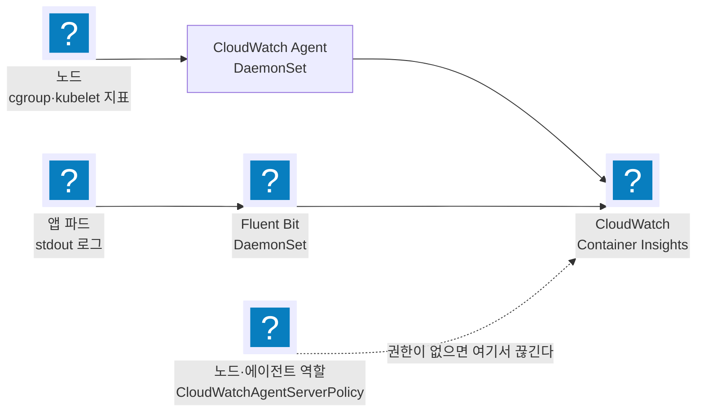
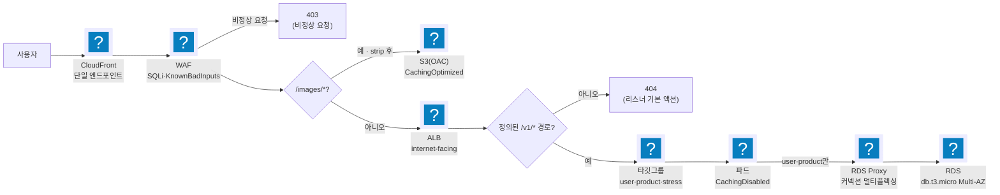
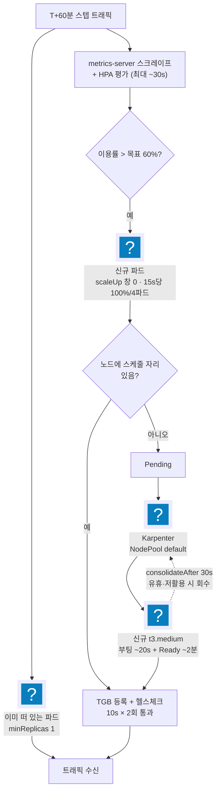

import { Quiz, QuizResults } from 'starlight-quiz/components';
import { Tabs, TabItem } from '@astrojs/starlight/components';

> 문서 유형: explanation

선행 지식과 학습 경로는 [모듈 개요](/part-5/21-task3-deploy/)에. 처음 보는 약어나 말은 [이 사이트의 말](/reference/glossary/)에 있다.

TG(Target Group)는 로드밸런서가 요청을 보낼 대상 묶음이다. 리스너·헬스체크와의 관계는 [loadbalancer-basics](/start/loadbalancer-basics/)에 있다.

1·2과제는 리소스의 존재와 이름을 검사한다. 3과제는 리소스를 보지 않고 부하 주입 인스턴스의 `results_<비번호>.log` 안의 **네 비율**만 읽는다 — 채점 방식 자체가 다르다. 그래서 "배포가 끝났다"는 0점에서 출발한다는 뜻이고, 점수는 트래픽 2시간 동안의 운영이 만든다.

:::caution[이 문서의 수치는 예상 풀이 기준이다]
3과제 공식 과제지·채점지는 아직 공개되지 않았다. 이 문서의 4축 배점·SLO 정확값·계단 비율·비용 ratio 구간은 `task-3` 예상 풀이에서 가져왔다(파일명 그대로 `task-sample.md`·`mark-sample.md`). **예측이므로 실제와 달라질 수 있다.** 총점 40점은 1·2과제 각 30점·전체 100점에서 역산되므로 비교적 안정적이지만, 그 **안의 구성은 예상**이다.

반대로 이 문서가 가르치는 **튜닝 방법론**은 배점이 달라져도 유효하다. SLO 로 HPA 를 역산하는 사고, CPU limit 을 제거하는 판단이 그것이다. RDS Proxy 풀링과 인덱스 설계, 비용을 성능의 게이트로 다루는 사고도 같다.
:::

## 읽고 오는 것 — 공식 문서 여섯 자리

이 문서는 판단의 이유를 다루고, 필드 이름과 인자 목록은 공식 문서에 있다. 전부 읽을 필요는 없다. 각 문서에서 **읽을 자리**만 적었다.

세 편은 이 문서를 읽기 전에, 세 편은 읽으면서 대조한다.

**먼저 읽는다**

- [Karpenter — Disruption](https://karpenter.sh/docs/concepts/disruption/) · Consolidation 절. 유휴 노드가 언제 회수되는지가 여기서 정해진다. 이 문서의 유휴 1대 전제가 그 동작에 기댄다.
- [HorizontalPodAutoscaler — 스케일 동작 설정](https://kubernetes.io/docs/tasks/run-application/horizontal-pod-autoscale/#configurable-scaling-behavior) · `behavior` 의 `scaleUp`·`scaleDown` 두 블록. 안정화 창과 정책의 기본값을 알아야 무엇을 바꾼 것인지 보인다.
- [파드에 CPU·메모리 리소스 할당](https://kubernetes.io/docs/tasks/configure-pod-container/assign-cpu-resource/) · requests 와 limits 의 차이를 설명하는 앞부분. 이 값이 스케줄링과 이용률 분모 둘 다를 정한다.

**읽으면서 대조한다**

- [EKS — 관리형 노드그룹](https://docs.aws.amazon.com/eks/latest/userguide/managed-node-groups.html) · 크기 조정 항목. 부트스트랩 노드그룹의 세 크기 값이 유휴 노드 수의 바닥이다.
- [EC2 — 버스터블 인스턴스의 unlimited 모드](https://docs.aws.amazon.com/AWSEC2/latest/UserGuide/burstable-credits-baseline-concepts.html) · baseline 이용률과 초과 요금 항목. t3 계열을 쓰는 이 과제에서 CPU 상한이 실제로 어디인지가 여기 있다.
- [ALB — 대상 그룹 등록 해제 지연](https://docs.aws.amazon.com/elasticloadbalancing/latest/application/load-balancer-target-groups.html#deregistration-delay) · draining 동작. 노드를 회수할 때 응답이 끊기는지가 이 값에 걸린다.

전 모듈 공통 문서 목록은 [자료 링크](/reference/links/#공식-문서-q-출력을-대조하는-정본)에 있다.

## 채점 4축의 구조

| 축 | 배점 | 측정값 | 임계 |
|---|---|---|---|
| 비정상 요청 처리 | 4 | image download 비율, Exception Handling 비율 | 50 / 80 / 85 / 90% |
| 고가용성 및 안정성 | 12 | 앱 3종 availability | 30 / 50 / 70 / 80 / 82.5 / 85 / 87.5 / 90% |
| 성능 효율성 | 12 | user·product ≤ 0.2s 비율, stress ≤ 1.0s 비율 | 위와 동일 8단계 |
| 비용 최적화 | 12 | 인스턴스 비용 ratio | 0.5 이상 1.00~3.75 이하 12단계 |

*(배점·임계값은 예상 채점지 `mark-sample.md`를 그대로 옮겼다 — 위 캐션 참고.)*

세 가지 구조적 사실이 전략을 결정한다.

**① 계단식이라 부분 점수가 크다.** 30%만 넘겨도 축마다 득점이 시작된다. 목표 0.2초를 못 맞춰도 절반은 건진다. 부하 중 스택을 통째로 교체하는 것보다 지금 비율을 한 계단 올리는 조정이 항상 낫다.

**② 비용 축은 성능 축의 종속 항목이다.** 비용 12점의 각 항목은 ratio 범위와 함께 user·product·stress **performance가 모두 30% 이상**일 것을 요구한다. 성능이 무너지면 비용 12점도 같이 사라진다. 그러므로 절약이 성능을 깎는 지점에서는 절약을 멈춘다.

**③ 하한 0.5가 있다.** ratio가 낮을수록 좋은 것이 아니다. 리소스를 지나치게 줄이면 하한 아래로 떨어져 12점 전체가 0이 된다. 목표는 최소가 아니라 **밴드 안**이다.

:::danger[사전준비 조항(예상) — 배포 시점에 이미 확정된다]
계단식 채점보다 사전준비 조항이 더 무겁다.

- 엔드포인트가 선수 시스템이 아니면 **전 항목 0점**
- DB 타입·대수가 과제지와 다르면 **성능·비용 24점이 0점**
- **컴퓨팅은 EC2 인스턴스만.** 샘플 과제지 유의사항 15는 "어떠한 목적으로든 Fargate 와 Lambda 를 사용할 수 없다"고 못박는다. 편의를 위한 한 번의 Lambda 도 예외가 아니다
- **인스턴스 타입은 `t3.medium` 만.** 다른 타입을 섞거나 과도하게 띄우면 감점이다. 컨테이너 오케스트레이션도 EKS 고정이고 ECS 는 쓸 수 없다
- **불필요한 리소스는 그 자체가 감점**이다 — 미사용 EC2, 추가 VPC, 다른 리전에 남긴 리소스. 작업용 bastion 도 EC2 수에 든다

전부 트래픽 전에 검증한다. 앞의 셋은 배포 시점에 이미 확정되고, 뒤의 둘은 경기 내내 주기적으로 측정된다.
:::


<details class="build-step">
<summary>지금 확인하기 — 유의사항이 못 박은 제약을 원문으로 읽는다</summary>

배포 시점에 확정되는 제약은 전부 과제지 유의사항 절에 있다. **파일 읽기라 과금이 없다.**

<Tabs syncKey="shell">
  <TabItem label="PowerShell">
  ```powershell
  Select-String -Pattern 'Fargate|Lambda|t3.medium|불필요|인스턴스 타입|ECS' `
    -Path $HOME\skills-2026\task-3\task-sample.md | Select-Object -First 10
  ```
  </TabItem>
  <TabItem label="Bash (Linux/CloudShell)">
  ```bash
  grep -nE 'Fargate|Lambda|t3.medium|불필요|인스턴스 타입|ECS' ~/skills-2026/task-3/task-sample.md | head -10
  ```
  </TabItem>
</Tabs>

기대: 컴퓨팅은 EC2 만, 인스턴스 타입은 하나로 고정, 오케스트레이션은 EKS 고정, 불필요 리소스는 감점이라는 문장이 나온다. **넷 다 "만들면 되는 것"이 아니라 "만들면 안 되는 것"** 이라 배포 전에 읽어야 한다.

출력이 비면 클론 경로를 확인한다. 실전에서는 이 자리가 종이 과제지이므로, 형광펜으로 표시할 문장이 바로 이것들이다.

</details>

## 심사위원이 제시한 3축 — 프로비저닝·요청 처리·비용

채점지의 4축은 결과 로그가 남긴 비율이다. 심사위원 세션(2026-05-19)은 그 앞단에서 선수가 신경 쓸 것을 셋으로 정리했다. 같은 시스템을 결과가 아니라 **행동** 쪽에서 본 분해다.

| 축 | 완료·판정 기준 | 4축의 어디로 나오나 |
|---|---|---|
| 프로비저닝 | 명시된 인프라를 세운 뒤 테스트 API 호출에 성공 응답이 오는 것 | 사전준비 조항 — 못 넘기면 전 항목 0 |
| 요청 처리 | 응답 코드가 예상값(200 등)이고 제한 시간 안에 도착하는 것 | 가용성 12 + 성능 12 |
| 비용 | 인스턴스 개수. bastion을 포함한 모든 EC2가 들어간다 | 비용 12 |

3과제는 1·2과제처럼 요구사항대로 만들고 구현 여부를 확인하는 형태가 아니다. 과제의 핵심은 이것이라고 명시돼 있다 — **제공되는 애플리케이션을 분석해 정상 구동하고, 로그·메트릭·동작 방식을 읽어 효율적이고 안정적으로 운영하는 것**이다. 취약점도 특정 계층에 고정돼 있지 않다 — 시스템의 모든 구성 요소에서 나올 수 있고, 채점 플랫폼이 주는 로그와 정보로 식별해 대응한다.

### 상태 판단은 USE·RED로 한다

노브를 만지기 전에 지금 상태를 읽어야 한다. 심사위원 세션이 지목한 두 패턴이 그 언어다 — 하나는 자원을, 하나는 요청을 본다.

| 패턴 | 축 | 보는 값 |
|---|---|---|
| USE | 자원 | Utilization(사용률) · Saturation(대기·큐 포화) · Errors(자원 단의 오류) |
| RED | 요청 | Rate(초당 요청 수) · Errors(오류율) · Duration(지연 분포) |

둘을 함께 봐야 조치가 갈린다. RED의 Duration이 늘었는데 USE의 Utilization이 낮으면 파드가 놀면서 무언가를 기다리는 상태다 — 커넥션 풀 포화나 DB 대기(Saturation)이므로 노드를 늘려도 낫지 않는다. 반대로 Utilization이 천장에 붙어 있고 Duration이 함께 오르면 scale-out이 맞는 조치다. **RED로 증상을 보고 USE로 원인 계층을 좁힌다** — 부하 중 30초 감시 루프가 그대로 이 순서다.

## 그 값을 어디서 보는가 — Container Insights :badge[강의]{variant=tip}

USE·RED를 읽으려면 지표와 로그가 먼저 모여 있어야 한다. EKS에서 그 수집기를 한 번에 세우는 것이 **CloudWatch Observability 추가 기능**이다. 설치하면 데몬셋 두 개가 모든 노드에 뜬다.

| 데몬셋 | 수집 대상 | USE·RED의 어디 |
|---|---|---|
| CloudWatch Agent | CPU·메모리·네트워크·디스크 지표 | USE — Utilization·Saturation |
| Fluent Bit | 컨테이너 stdout 로그, 데이터플레인 로그, 호스트 로그 | RED — Rate·Errors (로그에서 센다) |

콘솔에서는 클러스터·노드·파드·컨테이너 네 단위로 사용률이 갈라져 보인다. 3과제에서 이 화면이 필요한 이유는 채점이 클라이언트 도착 기준 응답시간을 보기 때문이다 — 지연이 어느 계층에서 붙었는지는 이 지표 없이는 추측이 된다.

:::caution[사용률이 비어 있으면 requests·limits 를 먼저 본다]
Container Insights의 **사용률(%)** 은 사용량을 requests·limits로 나눠 계산한다. 파드에 두 값이 선언돼 있지 않으면 절대 사용량만 나오고 사용률 패널은 비어 있다. 대시보드가 비었을 때 수집기부터 의심하기 전에 매니페스트의 `resources` 를 먼저 확인한다.
:::



<details class="diagram-note">
<summary>이 도식이 보여주는 것</summary>

추가 기능이 세우는 두 갈래다. 위쪽은 노드의 자원 지표를 CloudWatch Agent 가 모아 보내고, 아래쪽은 파드 로그를 Fluent Bit 이 보낸다. 점선은 실패 지점이다 — 수집은 정상인데 전송 권한이 없으면 콘솔에 아무것도 뜨지 않는다. 그래서 화면이 비었을 때 첫 확인은 데몬셋 파드의 로그다.

</details>

### 콘솔 대신 값으로 뽑기

회차별로 비교하거나 표로 남기려면 화면이 아니라 값이 필요하다. Container Insights 는 같은 데이터를 성능 로그로도 남기고, 그 로그 그룹은 `/aws/containerinsights/<클러스터>/performance` 다. CloudWatch Logs Insights 로 질의한다.

```
fields @timestamp, PodName
| filter Type = "Pod" and Namespace = "production"
| stats avg(pod_cpu_utilization) as AvgCPU,
        avg(pod_memory_utilization_over_pod_limit) as AvgMem,
        max(pod_number_of_container_restarts) as Restarts
  by PodName
```

`Type` 이 레코드의 단위를 가른다 — 같은 로그 그룹에 `Pod`·`Node`·`Container` 행이 섞여 쌓인다. 이 필터를 빼면 단위가 다른 값이 한 평균에 섞인다.

메모리 필드 이름이 긴 이유는 그 값이 **limits 대비 비율**이라서다. limits 를 걸지 않은 파드는 이 값이 비어 있고, 그때는 절대 사용량인 `pod_memory_working_set` 을 본다.

재시작 수를 같이 뽑는 이유는 하나다. 회차 중간에 파드가 죽었다 살아났다면 그 회차의 평균은 다른 조건에서 나온 값이다.

## 추적 계층 — Application Signals 와 X-Ray :badge[강의]{variant=tip}

지표는 "얼마나 썼는가"를, 로그는 "무슨 일이 있었는가"를 말한다. 요청 하나가 **어느 구간에서 늦었는가**는 둘 다 답하지 못한다. 그 자리를 채우는 도구가 둘이다.

| | Application Signals(APM) | X-Ray |
|---|---|---|
| 보는 것 | 서비스 단위 응답시간·에러율·요청 수 | 요청 하나의 구간별 지연 — ALB → 파드 → DB |
| 붙이는 법 | 자동 계측 — 언어 런타임에 에이전트를 얹는다 | SDK로 코드에 세그먼트를 남긴다 |
| 지원 언어 | Java · Python · Node.js | 위 셋 + Go(SDK 직접) |

:::danger[Go 앱은 자동 계측이 없다]
3과제가 제공하는 앱 바이너리는 Go로 빌드된 경우가 많고, **Application Signals는 Go를 자동 계측하지 못한다.** 제공 바이너리는 수정 금지이므로 코드에 SDK를 넣는 경로도 막힌다.

그래서 Go 앱의 구간별 지연은 앱 바깥에서 재야 한다 — ALB의 `TargetResponseTime`, RDS Proxy의 `DatabaseConnectionsBorrowLatency`, 그리고 k6가 재는 클라이언트 도착 시간의 차이를 빼서 어느 홉이 먹었는지 좁힌다. 앱을 고칠 수 있는 조건(추가 문항으로 직접 개발한 Lambda 등)에서만 X-Ray SDK가 선택지가 된다.
:::

## 응답시간은 클라이언트 도착 기준이다

과제지는 "채점 시 사용되는 응답시간 및 코드는 모두 클라이언트 도착 기준"이라고 못박는다. 즉 0.2초 안에 **CloudFront → WAF 평가 → ALB → 파드 → RDS Proxy → RDS** 왕복이 전부 들어간다. 앱 내부 처리 시간만 보고 안심하면 안 된다. 홉마다 붙는 지연이 예산을 먹으므로, 예산을 태우는 큰 덩어리 세 개(DB 풀스캔, CPU 스로틀링, 스케일 지연)를 먼저 없앤다.



<details class="diagram-note">
<summary>이 도식이 보여주는 것</summary>

요청이 갈라지는 지점을 순서대로 그렸다. WAF 가 먼저 비정상 요청을 403 으로 끊고, 그다음 경로가 `/images/*` 면 S3 로 가 캐시된다. 나머지는 ALB 로 가는데 정의되지 않은 경로는 리스너 기본 액션의 404 로 끝난다. 실제 API 만 파드에 닿고, 그중 사용자·상품 조회만 RDS Proxy 를 거쳐 DB 로 간다. 어느 계층이 어떤 응답을 내는지가 곧 채점의 응답 코드 항목이다.

</details>

0.2초 예산은 이 경로 전체에 걸린다 — CloudFront에서 RDS까지 홉마다 지연이 쌓인다. 같은 진입점 위에서 403은 WAF가, 404는 ALB 리스너 기본 액션이 낸다.


<details class="build-step">
<summary>지금 확인하기 — 응답 시간이 지나는 홉을 코드에서 센다</summary>

0.2초 예산이 어디에 걸리는지는 라우팅 정의에 그대로 적혀 있다. 파일 읽기라 과금이 없다.

<Tabs syncKey="shell">
  <TabItem label="PowerShell">
  ```powershell
  Select-String -Pattern 'path|backend|service|404|default' `
    -Path $HOME\skills-2026\task-3\k8s\20-ingress.yaml | Select-Object -First 14
  ```
  </TabItem>
  <TabItem label="Bash (Linux/CloudShell)">
  ```bash
  grep -nE 'path|backend|service|404|default' ~/skills-2026/task-3/k8s/20-ingress.yaml | head -14
  ```
  </TabItem>
</Tabs>

기대: 경로별 백엔드와 **어디에도 안 맞을 때의 기본 동작**이 보인다. 정의되지 않은 경로에 404 를 내는 것이 이 한 곳에서 정해진다.

경로 규칙은 대소문자를 구분한다. 앞단에서 소문자로 바꾸면 두 계층의 판정이 어긋난다 — 그래서 앞단에서 문자열을 함부로 변형하지 않는다.

</details>

## 스케일 리드타임이 초반 가용성을 결정한다

트래픽은 T+60분에 **스텝으로** 들어온다. 그 순간부터 새 파드가 트래픽을 받기까지의 사슬은 이렇다. 사슬이 타이머 몇 개의 합으로 결정된다는 일반 원리는 [autoscaling-basics 의 수렴 시간 절](/start/autoscaling-basics/#수렴-시간은-타이머-세-개의-합이다)에 있다.

1. metrics-server 스크레이프 + HPA 평가 주기 — 두 주기가 직렬로 쌓인다. metrics-server `--metric-resolution` 은 기본 60초이고 흔히 15초로 낮춰 쓰는데, 15초로 낮춰도 메트릭 노후 + HPA 싱크(15초)로 **최악 약 30초**다
2. 파드 스케줄·기동 — 약 10초 (이미지가 노드에 캐시된 경우)
3. 노드가 부족하면 Karpenter 노드 프로비저닝 — 부팅 약 20초, 등록·Ready까지 약 2분
4. TargetGroupBinding 등록 + 헬스체크 통과 — `interval 10s × healthy_threshold 2` ≈ 20~30초



<details class="diagram-note">
<summary>이 도식이 보여주는 것</summary>

트래픽이 늘 때 걸리는 시간을 단계별로 분해했다. 이미 떠 있는 파드는 즉시 받는다. 새 파드는 메트릭 수집과 HPA 평가에 최대 30초가 걸리고, 스케줄될 자리가 없으면 노드 부팅에 2분 남짓이 더 든다. 그다음 타깃 등록과 헬스체크 2회 통과가 또 걸린다. 그래서 미리 떠 있는 최소 replicas 와 노드 워밍업이 응답 시간을 좌우한다. 점선은 반대 방향으로, 유휴 노드는 30초 뒤 회수된다.

</details>

낙관적으로 40초, 노드가 새로 필요하면 2~3분이다. **그 시간의 트래픽은 이미 떠 있는 파드로 받는다.**

여기서 두 채점 축이 정면으로 부딪친다. `minReplicas`를 올리면 초반이 안전해지고 유휴 노드가 늘어 비용 ratio가 나빠진다. 정답지는 `minReplicas: 1`을 택했다 — 유휴 EC2 1대라는 전제가 비용 12점의 바닥이기 때문이다.

1파드로 초반을 받는 대가는 스케일 속도로 갚는다. HPA 목표 이용률을 60%로 낮춰 파드가 뜨거워지기 전에 미리 늘리고, `scaleUp.stabilizationWindowSeconds: 0`에 15초당 100%·4파드 정책을 건다. `scaleDown`은 40초 안정창을 둔다 — 골짜기마다 파드를 버리면 다음 파도에서 같은 사슬을 다시 타지만, 안정창을 길게 잡으면 그만큼 노드가 오래 남아 비용이 붙는다.

```yaml
# k8s/10-user.yaml 발췌 — product·stress도 동일 behavior
apiVersion: autoscaling/v2
kind: HorizontalPodAutoscaler
metadata:
  name: user
spec:
  minReplicas: 1
  maxReplicas: 10
  metrics:
    - type: Resource
      resource:
        name: cpu
        target:
          type: Utilization
          averageUtilization: 60
  behavior:
    # 스케일아웃은 기본값 그대로가 이미 가장 빠르다 — 의도를 드러내려고 명시만 한다
    scaleUp:
      stabilizationWindowSeconds: 0
      policies:
        - type: Percent
          value: 100
          periodSeconds: 15
        - type: Pods
          value: 4
          periodSeconds: 15
      selectPolicy: Max
    # 스파이크 종료 후 빠른 회수로 비용 ratio를 낮춘다
    scaleDown:
      stabilizationWindowSeconds: 40
      policies:
        - type: Percent
          value: 50
          periodSeconds: 40
```

<details class="diagram-note">
<summary>이 블록이 하는 일</summary>

HPA 한 장이다. CPU 이용률 60% 를 목표로 1에서 10 사이를 오간다. `behavior.scaleUp` 은 기본값과 같은 값을 일부러 적어 둔 것이다 — 안정화 창 0초에 15초마다 100% 또는 4파드 중 큰 쪽으로 늘린다. 이용률의 분모가 `requests` 이므로 그 값을 크게 잡으면 같은 부하에서도 스케일이 늦게 걸린다.

</details>

이 매니페스트에서 기본값과 다른 것은 `scaleDown` 쪽뿐이다 — 안정화 창 300→40초, 축소 정책 `Percent 100/15s`→`Percent 50/40s`. `scaleUp` 블록은 쿠버네티스 기본값과 같은 값이라 생략해도 동작이 같다. 스케일아웃을 "더 공격적으로" 만들 여지는 애초에 없다는 뜻이다.

노드를 미리 확보하는 사전 워밍은 비용 ratio를 올리므로 무료가 아니다. 채점 트래픽 개시 직전에만 워밍하고, 개시 후에는 오토스케일에 맡기는 것이 밴드 안에 머무는 방법이다.


<details class="build-step">
<summary>지금 확인하기 — 노드가 뜨는 데 걸리는 시간의 근거</summary>

초반 가용성은 노드가 준비되는 속도가 정한다. 그 시간을 정하는 설정을 먼저 본다. 파일 읽기라 과금이 없다.

<Tabs syncKey="shell">
  <TabItem label="PowerShell">
  ```powershell
  Select-String -Pattern 'consolidat|limits|instance-type|disruption|expireAfter' `
    -Path $HOME\skills-2026\task-3\k8s\01-nodepool.yaml | Select-Object -First 12
  ```
  </TabItem>
  <TabItem label="Bash (Linux/CloudShell)">
  ```bash
  grep -nE 'consolidat|limits|instance-type|disruption|expireAfter' ~/skills-2026/task-3/k8s/01-nodepool.yaml | head -12
  ```
  </TabItem>
</Tabs>

기대: 노드 상한과 회수 정책이 보인다. **회수를 빠르게 잡으면 비용이 줄고 초반 가용성이 위험해진다** — 두 채점 축이 같은 값 하나로 반대 방향으로 움직이는 자리다.

이 값을 부하 중에 바꾸는 훈련이 [22. 부하 운영](/part-5/22-task3-tuning/lab/)의 노브 조정 드릴이다.

</details>

## 비용 최적화 — 최소화가 아니라 밴드 맞추기

비용 12점은 다른 세 축과 채점 모양이 다르다. 나머지는 비율이 높을수록 계단을 오르지만, 비용은 위아래 양쪽에 벽이 있다.

### 12칸은 누적으로 채워진다

채점 항목 12개가 전부 `0.5 <= 인스턴스 비용 ratio <= X` 형태다. X 만 1.00에서 3.75까지 0.25씩 커진다. 한 항목이 1점이고, ratio 하나가 조건을 만족하는 항목 **전부**를 가져간다.

| 측정된 ratio | 만족하는 항목 | 점수 |
|---|---|---|
| 0.50 미만 | 없음 | 0 |
| 0.50 이상 1.00 이하 | 12개 전부 | 12 |
| 1.00 초과 1.25 이하 | 11개 | 11 |
| 1.25 초과 1.50 이하 | 10개 | 10 |
| 2.00 초과 2.25 이하 | 7개 | 7 |
| 3.50 초과 3.75 이하 | 1개 | 1 |
| 3.75 초과 | 없음 | 0 |

읽는 법은 하나다. **1.00 이하로 내려가면 만점이고, 그 위로는 0.25마다 1점씩 잃는다.** 그리고 0.50 아래로 내려가는 순간 12점이 통째로 사라진다.

여기에 게이트가 하나 더 붙는다. 12개 항목이 각각 user·product·stress 세 앱의 performance 값이 모두 30% 이상일 것을 함께 요구한다. 절약이 처리율을 30% 아래로 끌어내리면 비용 점수는 ratio와 무관하게 0이다.

### 분모를 모른다는 사실을 설계에 넣는다

ratio가 무엇 대비의 비율인지 예상 과제지·채점지 어디에도 없다. 기준 구성이 따로 있고 그에 대한 비율일 것이라는 추정만 가능하다.

그래서 목표를 "ratio 0.8"처럼 절대값으로 잡을 수 없다. 통제할 수 있는 것은 분자뿐이다 — **본인이 쓴 노드 시간**이다. 훈련에서 재는 값도 ratio가 아니라 노드 시간이고, 그 값을 회차마다 줄이면서 SLO가 버티는 한계를 찾는다.

### 비용은 스냅숏이 아니라 적분이다

협의회에서 확인된 산정 방식은 EC2 인스턴스 수를 **주기적으로** 세어 전체 경기 시간을 기준으로 매기는 것이다. 한 시점의 최대 노드 수가 아니다.

그러면 측정값은 구간마다 노드 수에 그 구간 길이를 곱해 더한 값이 된다. 이 문서는 그 값을 **노드 시간**이라 부른다.

```
노드 시간 = Σ (그 구간의 노드 수 × 구간 길이)
```

이 정의가 운영을 바꾼다. 트래픽이 없는 구간의 1대도 부하 구간의 1대와 같은 무게로 쌓인다. 3시간 경기에서 유휴 노드를 2대로 두면 1대일 때보다 3 노드 시간이 더 붙는다. 전체가 9 노드 시간인 구성이라면 33% 증가다. ratio 1.00이 1.33으로 밀려 3점을 잃는 크기다.

### 노드 시간은 네 구간에서 만들어진다

경기 시간을 잘라 보면 노드 수를 정하는 값이 구간마다 다르다.

| 구간 | 시점 | 노드 수를 정하는 값 |
|---|---|---|
| 트래픽 개시 전 | T+0 ~ T+60 | 노드그룹 크기 · 차트 `replicas` · 사전 워밍 여부 |
| 부하 상승 | 개시 직후 | HPA 목표 이용률 · `scaleUp` 정책 · NodePool `limits.cpu` |
| 스파이크 사이 골짜기 | 부하 중 | `scaleDown` 안정화 창 · `consolidateAfter` |
| 부하 종료 후 | 종료 이후 | 위 두 값과 같다 |

첫 구간이 가장 길다. 3시간 중 1시간이고 그동안 트래픽이 없다. **개시 전 구간의 1대 차이가 부하 구간의 1대 차이보다 크게 쌓인다.** 그래서 배포 시점의 기본값이 부하 중 노브보다 비용에 더 크게 작용한다.

마지막 구간은 순손실이다. 트래픽이 끝난 뒤 남은 노드는 점수를 만들지 않고 노드 시간만 쌓는다.

### t3.medium 한 대에 무엇이 들어가는가

유휴 1대가 가능한지는 산수로 확인한다. t3.medium 의 allocatable 은 약 1930m CPU · 3.4Gi 메모리 · 파드 17개다.

| 구성요소 | CPU requests | 파드 수 |
|---|---|---|
| kube-proxy · aws-node | 약 150m | 2 |
| coredns 2벌 | 200m | 2 |
| metrics-server | 100m | 1 |
| Karpenter · ALB 컨트롤러 각 1벌 | 선언 없음 | 2 |
| CloudWatch 에이전트 · Fluent Bit 데몬셋 | 300m | 2 |
| CloudWatch operator | 100m | 1 |
| 시스템 소계 | 약 850m | 10 |
| 앱 3종 × 1파드 × 250m | 750m | 3 |
| 합계 | 약 1600m / 1930m | 13 / 17 |

여유가 약 330m 남는다. 데몬셋 두 개는 Karpenter 가 붙이는 노드에도 먼저 올라간다. 그래서 새 노드는 앱 파드를 하나 덜 받는다.

파드가 Pending 으로 남으면 조정 순서는 셋이다.

1. `kubectl -n kube-system scale deploy/coredns --replicas=1` 로 100m 를 회수한다
2. 앱 `requests` 를 200m 로 낮춘다
3. 노드그룹을 2대로 올린다

3번은 노드 시간을 직접 올리므로 마지막이다. 앞의 둘로 해결되면 비용은 그대로다.

### t3 크레딧은 상한이 아니다

t3 는 버스터블 인스턴스다. baseline 이용률을 넘겨 쓰면 크레딧을 소모하고, 크레딧이 떨어지면 baseline 으로 제한된다. standard 모드에서는 그렇다.

t3 의 기본값은 **unlimited 모드**다. 크레딧이 떨어져도 100% 를 계속 쓸 수 있고, 초과분만 vCPU 시간당 0.05달러로 따로 청구된다. 3시간 경기에서는 무시할 수 있는 크기다.

이것을 알아야 부하 중 판단이 흔들리지 않는다. CPU 이용률이 baseline 위로 오래 머물러도 그 자체는 문제가 아니다. baseline 은 t3.medium 이 vCPU 당 20%, t3.large 30%, t3.xlarge 40% 다.

```bash
aws ec2 describe-instance-credit-specifications --instance-ids <인스턴스 ID>
```

`unlimited` 가 아니면 노드 클래스나 시작 템플릿에서 바뀐 것이다. 그 상태면 크레딧 소진 후 CPU 가 baseline 으로 잘려 성능 축이 무너진다.

### 인스턴스 타입이 바뀌면 네 곳을 고친다

예상 과제지는 `t3.medium` 을 지정한다. 변형에서 다른 타입이 나오면 고치는 자리는 넷이다.

1. 노드그룹의 `instanceType`
2. NodePool `requirements` 의 인스턴스 타입 목록과 `limits.cpu`
3. 앱 3종의 `requests`
4. HPA 의 `maxReplicas`

| 타입 | vCPU / 메모리 | allocatable | 앱 requests | HPA max | NodePool `limits.cpu` |
|---|---|---|---|---|---|
| t3.medium | 2 / 4Gi | 1930m / 3.4Gi | 250m / 512Mi | 10 | 12 |
| t3.large | 2 / 8Gi | 1930m / 7.2Gi | 250m / 512Mi | 10 | 12 |
| t3.xlarge | 4 / 16Gi | 3920m / 14.9Gi | 500m / 1Gi | 10 | 24 |
| m5.large · m6i.large | 2 / 8Gi | 1930m / 7.2Gi | 250m / 512Mi | 10 | 12 |
| c5.large · c6i.large | 2 / 4Gi | 1930m / 3.4Gi | 250m / 512Mi | 10 | 12 |

표에 없는 타입은 두 공식으로 구한다.

- 앱 CPU `requests` 는 allocatable 의 약 13% 다. 시스템 파드를 뺀 여유에 앱을 촘촘히 담는 값이다
- NodePool `limits.cpu` 는 3앱 × HPA 상한 × `requests` 를 담는 노드 수에 vCPU 를 곱한 값이다

HPA `maxReplicas` 는 타입이 바뀌어도 그대로 둔다. vCPU 가 커지면 파드당 `requests` 가 함께 커져 필요한 노드 수가 줄어든다.

### 세는 대상이 EC2 뿐인지는 확인한다

예상 채점지는 "인스턴스 비용 ratio" 라고만 쓴다. 협의회에서 확인된 산정 방식이 EC2 인스턴스 수를 세는 것이므로 EC2 기준일 가능성이 높다.

그래도 확정은 아니다. RDS Proxy 는 vCPU 시간당 과금이고 NAT 게이트웨이도 시간당 과금이다. 포함 여부는 당일 과제지에서 확인한다.

확인하지 못했다면 EC2 를 기준으로 삼되, 계산에 없는 리소스를 만들지 않는 쪽으로 정한다. 예상 과제지의 유의사항 두 줄이 그 판단을 뒷받침한다.

- 불필요한 리소스를 만들면 감점이다. 미사용 EC2, VPC 추가, 다른 리전 리소스가 예로 적혀 있다
- 정해진 인스턴스 타입·크기·대수를 지키지 않으면 불이익이고 **미사용도 대수에 포함**된다

`kubectl` 을 쓰려고 bastion EC2 를 세우는 것이 가장 흔한 사고다. 인스턴스 하나가 경기 내내 켜져 있으면 유휴 노드를 1대로 줄인 이득이 그대로 사라진다. CloudShell 을 쓴다.

### 유휴 EC2 를 1대로 만드는 다섯 자리

유휴 1대는 저절로 되지 않는다. 노드 수를 2대 이상으로 밀어올리는 기본값이 다섯 군데 있고, 전부 배포 시점에 정해진다.

| 요인 | 조치 | 위치 |
|---|---|---|
| 부트스트랩 노드그룹이 여러 대 | `min`·`desired`·`max`를 모두 1로 | `eksctl/cluster.yaml` |
| Karpenter 차트 기본 `replicas: 2` | `--set replicas=1` | `scripts/karpenter.sh` |
| ALB 컨트롤러 차트 기본 `replicaCount: 2` | `--set replicaCount=1` | `scripts/lbc.sh` |
| 앱의 zone spread 가 `DoNotSchedule` | `ScheduleAnyway` | `k8s/1X-*.yaml` |
| 유휴 노드가 회수되지 않음 | `consolidationPolicy: WhenEmptyOrUnderutilized` + `consolidateAfter: 30s` | `k8s/01-nodepool.yaml` |

**두 번째와 세 번째는 설치 시점에 1로 박는다.** 기본값 2로 설치한 뒤 줄이면, 그사이 Pending 상태였던 두 번째 파드 때문에 Karpenter가 그 파드를 위한 노드를 띄운다. 회수될 때까지 EC2가 2대다.

PodDisruptionBudget 을 두지 않는 이유도 여기 있다. `minAvailable: 1`과 HPA `minReplicas: 1`이 겹치면 파드 하나를 영원히 축출할 수 없다. 그러면 Karpenter consolidation 이 멈춰 유휴에도 노드가 줄지 않는다. 회수 중 가용성은 NodePool 의 `budgets` 항목 `nodes: "1"`이 이미 지킨다.

**감수하는 것**은 단일 장애점이다. 노드 1대가 죽으면 노드그룹이 다시 띄울 때까지 약 2분간 전면 중단이다. 가용성이 비율로 채점되고 비용이 12점이라 1대를 택한 것이지, 위험이 없어서가 아니다.

### 운영 수칙 8조

부하가 들어온 뒤 비용 축에서 판단이 갈릴 때 이 순서로 정한다. 위 조항이 아래 조항보다 우선한다.

| # | 수칙 | 이유 |
|---|---|---|
| 1 | 게이트를 먼저 본다 | 세 앱 중 하나라도 performance 30% 미만이면 비용 12점은 이미 0이다 |
| 2 | 절약이 SLO 를 깎기 시작하면 멈춘다 | 성능 12점과 비용 12점을 함께 잃는다 |
| 3 | 유휴 구간의 노드를 먼저 줄인다 | 조용한 시간의 1대도 부하 시간의 1대와 같은 무게로 쌓인다 |
| 4 | 계산에 없는 EC2 를 만들지 않는다 | `kubectl` 용 bastion 도 인스턴스 수에 들어간다. CloudShell 을 쓴다 |
| 5 | 회수를 늦추지 않는다 | `consolidateAfter: 30s`와 `scaleDown` 안정창 40초가 부하 종료 후의 노드 시간을 정한다 |
| 6 | 사전 워밍은 트래픽 개시 직전에만 | 미리 띄운 노드는 개시 전 구간 내내 노드 시간으로 쌓인다 |
| 7 | 노드 수를 주기적으로 기록한다 | 적분값이라 스냅숏 한 번으로는 판단할 수 없다 |
| 8 | 하한을 확인한다 | 트래픽이 약해 스케일아웃이 없으면 0.50 을 밑돈다. HPA 목표를 60%에서 40%로 낮춰 노드를 늘린다 |

수칙 8이 반직관적이다. 12점짜리 축인데 **아끼는 방향으로 실패하는 경우가 있다.** 상한 3.75까지는 여유가 크므로, 과다 회수보다 과소 회수가 안전한 쪽이다.

<details class="build-step">
<summary>지금 확인하기 — 유휴 1대가 어디서 정해지는가</summary>

유휴 노드 수는 부하 중에 바꾸는 값이 아니라 배포 시점에 고정된다. 그 자리를 원문에서 확인한다. 파일 읽기라 과금이 없다.

<Tabs syncKey="shell">
  <TabItem label="PowerShell">
  ```powershell
  Select-String -Pattern 'replicas|desiredCapacity|minSize|maxSize' `
    -Path $HOME\skills-2026\task-3\eksctl\cluster.yaml, $HOME\skills-2026\task-3\scripts\karpenter.sh
  ```
  </TabItem>
  <TabItem label="Bash (Linux/CloudShell)">
  ```bash
  grep -nE 'replicas|desiredCapacity|minSize|maxSize' \
    ~/skills-2026/task-3/eksctl/cluster.yaml ~/skills-2026/task-3/scripts/karpenter.sh
  ```
  </TabItem>
</Tabs>

기대: 노드그룹의 세 크기 값이 모두 1이고, Karpenter 설치 명령에 `replicas=1`이 박혀 있다. 둘 중 하나라도 기본값이면 유휴 EC2 가 2대가 된다.

노드 시간을 실제로 재고 줄이는 훈련은 [Drill 22](/part-5/22-task3-tuning/drill/)에 있다.

</details>

## 자기 점검 퀴즈

<Quiz title="성능 축이 무너질 때의 실제 손실">
user·product·stress 중 하나라도 performance가 30% 아래로 떨어졌다. 잃는 점수는?

- [x] 24점 — 성능 12점 + 비용 12점
- [ ] 12점 — 성능 축만 잃고 비용 축은 ratio로 독립 채점된다
  > 비용 축이 독립이라는 것이 가장 비싼 오해다. 비용 12점의 **각 항목**이 3개 앱 performance ≥ 30%를 동시에 요구한다.
- [ ] 28점 — 성능 12점 + 비용 12점 + 고가용성 4점
- [ ] 0점 — 계단식 채점이라 30% 아래에도 부분 점수가 남는다
  > 계단식은 30% 이상 구간의 이야기다. 30%가 첫 계단이므로 그 아래는 득점이 시작되지 않는다.

**24점.** 성능 12점을 잃고, 비용 12점의 모든 항목이 3개 앱 performance ≥ 30%를 동시 요구하므로 비용도 함께 0이 된다. 그래서 **절약이 성능을 깎는 지점에서는 절약을 멈춘다** — 비용 축은 성능 축의 종속 항목이다.
</Quiz>

<Quiz title="비용 ratio 밴드">
비용 ratio는 하한 [[0.5]] 이상, 1.00~3.75 이하의 12단계로 채점된다. 목표는 최소가 아니라 밴드 안이다.

---

**ratio는 낮을수록 좋은 것이 아니다.** 하한 0.5 아래로 내려가면 비용 12점이 통째로 0이고, 거기까지 리소스를 줄인 상태면 성능·가용성도 같이 끌려 내려간다 — 24점짜리 동반 하락이다.

인스턴스 타입이 t3.medium으로 고정돼 있으므로 ratio를 움직이는 변수는 **노드 수 × 시간**뿐이다. 밴드 안에 머무는 구조는 세 층이다.

- HPA 목표 이용률 60%
- NodePool `limits.cpu` — 3앱 × 10파드 × 250m = 7.5 vCPU. 데몬셋 오버헤드를 감안해 t3.medium 6대 = 12 vCPU
- Karpenter consolidation 30초
</Quiz>

<Quiz title="ratio 2.10 의 점수">
측정된 비용 ratio 가 2.10 이고 세 앱 performance 는 모두 30% 이상이다. 비용 축에서 받는 점수는?

- [x] 7점
- [ ] 12점 — 하한 0.5 를 넘겼으므로 만점이다
  > 하한은 0점을 면하는 조건일 뿐이다. 점수는 상한이 정한다.
- [ ] 1점 — 조건을 만족하는 항목 중 가장 낮은 것 하나만 얻는다
  > 12개 항목은 서로 독립이라 만족하는 항목을 전부 가져간다. 하나만 세는 방식이 아니다.
- [ ] 0점 — 2.00 을 넘겼으므로 밴드를 벗어났다
  > 밴드 상한은 3.75 다. 2.10 은 밴드 안이고, 벗어난 것이 아니라 계단을 몇 칸 잃은 상태다.

항목의 상한은 1.00부터 3.75까지 0.25씩 오른다. 2.10 은 2.25 이상인 상한 7개를 만족하므로 **7점**이다. 1.00 이하로 내리면 12점이고, 거기서 0.25 올라갈 때마다 1점씩 잃는다.
</Quiz>

<Quiz title="T+60분 스텝 트래픽의 첫 40초">
트래픽이 T+60분에 스텝으로 들어온다. 그 직후 40초~3분 구간을 실제로 버티는 것과, 그것을 결정하는 설정을 모두 고르라.

- [x] 이미 떠 있는 파드 — `minReplicas: 1`
- [x] HPA `behavior.scaleUp` — `stabilizationWindowSeconds: 0` + 15초당 100%·4파드
- [ ] Karpenter의 노드 프로비저닝 속도
  > 사슬에서 가장 느린 구간이다. 부팅 약 20초, 등록·Ready까지 약 2분 — 초반을 버티는 주체가 될 수 없다. 그 시간을 버텨주는 게 이미 떠 있는 파드다.
- [ ] ALB `slow_start` 로 신규 타깃을 서서히 워밍한다
  > 켜지 않는다. 스케일아웃 직후 신규 파드로 트래픽이 늦게 가면 그동안 기존 파드가 포화된다 — 기본값 0을 유지한다.

**이미 떠 있는 파드가 버틴다.** 스케일 사슬은 HPA 평가 최대 15초 → 파드 기동 약 10초 → (노드 부족 시) Karpenter 부팅 20초 + Ready 2분 → TG 등록·헬스체크 20~30초. 낙관적으로 40초, 노드가 새로 필요하면 2~3분이다.

그래서 `minReplicas: 1`이 받는 첫 파드 하나가 바닥이고, `scaleUp`은 안정창 0으로 즉시 튀게 한다. 목표 이용률 60%도 같은 목적이다 — 파드가 포화되기 전에 늘린다. `scaleDown`은 40초 안정창으로 회수를 서두른다. 비용 축이 전 기간 누적이라 회수가 느리면 그만큼 노드 시간이 쌓인다.
</Quiz>

<Quiz title="이 문서의 수치를 대하는 법">
3과제 채점 배점·SLO 수치를 실제 대회에서 어느 정도까지 믿어도 되나?

- [x] 총점 40점은 1·2과제 각 30점·전체 100점에서 역산돼 비교적 안정적이지만, 4축 배점·계단 비율·SLO 정확값(0.2초 등)·비용 ratio 구간은 예상 풀이의 예측이라 실제와 다를 수 있다 — 반면 SLO로 HPA를 역산하는 사고 같은 튜닝 방법론은 배점이 달라져도 유효하다
- [ ] 예상 풀이(`task-3`)가 실측 코드로 구현돼 있으므로 모든 수치를 확정 사실로 취급해도 된다
  > 실측 코드라는 것과 공식 과제지·채점지라는 것은 다르다. `task-3`는 공식 자료가 아직 없는 상태에서 만든 예상 풀이(`task-sample.md`·`mark-sample.md`)다.
- [ ] 총점 40점을 포함해 이 문서의 모든 숫자는 실제 대회와 무관하므로 무시해도 된다
  > 40점은 1·2과제 각 30점·전체 100점에서 역산되므로 다른 수치보다 신뢰도가 높다. "전부 예측이니 전부 무시"는 과도한 결론이다.
- [ ] SLO 수치가 예상이라는 것은 CPU limit 제거·인덱스 설계 같은 튜닝 판단도 실제 대회에서는 소용없다는 뜻이다
  > 배점·SLO 정확값과 튜닝 방법론은 다른 층위다. CFS 스로틀링이 p99를 깎는다는 사실, email 인덱스가 없으면 풀스캔이라는 사실은 과제가 달라져도 그대로 유효하다.

배점 구조와 튜닝 방법론을 같은 확신 수준으로 취급하지 않는 것이 이 문서를 읽는 법이다. 숫자(40점의 내부 구성·SLO 정확값·비용 ratio 밴드)는 예상 풀이의 예측이고, 원리(SLO 예산 역산·CPU limit 제거·RDS Proxy 풀링·인덱스 설계·비용을 성능의 게이트로 보는 사고)는 과제가 30% 변형되어도 그대로 옮겨 쓸 수 있다.
</Quiz>

<QuizResults confetti />

## 다음

부하가 시작된 뒤의 판단 — `requests` 와 `limits`, 데이터 계층, 엣지 캐시, 방화벽 규칙, 비용 밴드 — 는 [22. 부하 운영과 튜닝 이론](/part-5/22-task3-tuning/theory/)에서 이어 간다.
