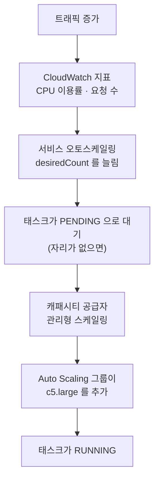
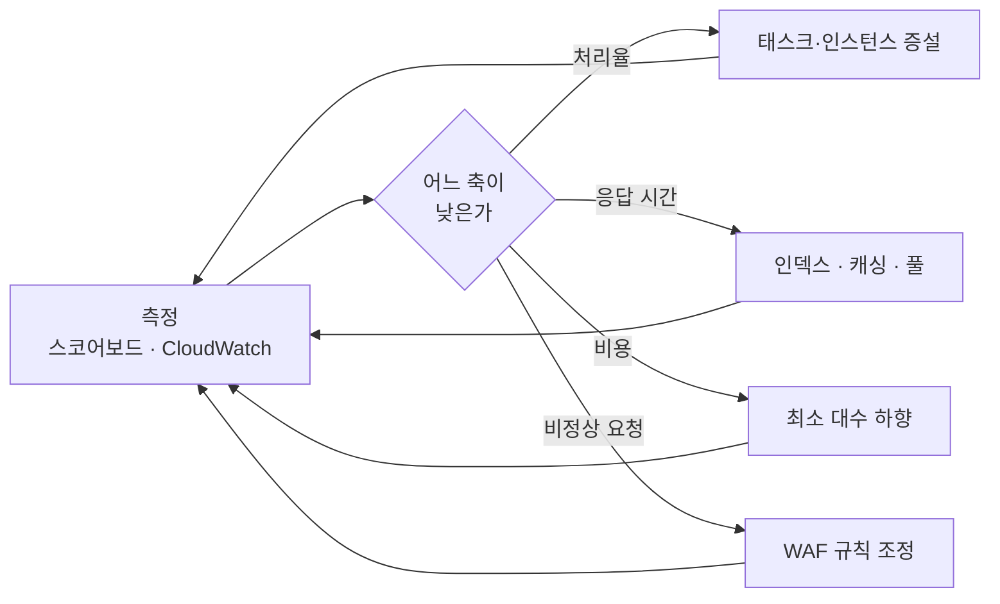

import { Quiz, QuizResults } from 'starlight-quiz/components';
import { Tabs, TabItem } from '@astrojs/starlight/components';

> 문서 유형: explanation

선행 지식과 학습 경로는 [모듈 개요](/part-5/32-task3-ecs/)에. 처음 보는 약어나 말은 [이 사이트의 말](/reference/glossary/)에 있다.

ENI(Elastic Network Interface)는 리소스에 붙는 가상 랜카드다([vpc-basics](/start/vpc-basics/)). HPA(Horizontal Pod Autoscaler)는 파드 수를 지표로 조절한다([autoscaling-basics](/start/autoscaling-basics/)). 이 모듈에서 태스크 밀도를 정하는 것이 앞의 값이다.

---

## 1. ECS 개념을 EKS 와 대조한다

이미 EKS 를 배웠다면 대응표가 가장 빠른 길이다.

| EKS | ECS | 하는 일 |
|---|---|---|
| 클러스터 | 클러스터 | 컨테이너를 돌릴 논리적 묶음 |
| Pod | **태스크(Task)** | 함께 도는 컨테이너 묶음. 실행 단위 |
| Deployment | **서비스(Service)** | 태스크를 몇 개 유지할지 |
| 컨테이너 스펙 | **태스크 정의(Task Definition)** | 이미지·CPU·메모리·환경변수 |
| 노드그룹 | **캐패시티 공급자(Capacity Provider)** | 인스턴스를 대는 곳 |
| HPA | **서비스 오토스케일링** | 태스크 수 조절 |
| Cluster Autoscaler·Karpenter | **캐패시티 공급자 관리형 스케일링** | 인스턴스 수 조절 |
| Service + Ingress | **ALB + 대상 그룹** | 트래픽 분배 |
| ServiceAccount + IRSA | **태스크 역할(Task Role)** | 컨테이너의 AWS 권한 |
| ConfigMap·Secret | **환경변수 · Secrets Manager 참조** | 설정 주입 |

### 1-1. ECS 가 단순한 지점

**컨트롤 플레인 요금이 없다.** EKS 는 클러스터 존재만으로 시간당 과금하지만 ECS 클러스터는 무료다. 인스턴스 값만 낸다. 비용 축이 12점인 이 과제에서 의미가 있다.

**ALB 연동이 내장이다.** EKS 는 Load Balancer Controller 를 설치하고 TargetGroupBinding 을 다뤄야 한다. ECS 는 서비스 정의에 대상 그룹 ARN 을 적으면 끝이다. 태스크가 뜨고 질 때 등록·해제를 ECS 가 한다.

**IAM 이 직접이다.** IRSA 의 네 고리(OIDC·역할·서비스계정·파드) 대신 태스크 정의에 역할 ARN 하나를 적는다.

### 1-2. ECS 가 까다로운 지점

**역할이 둘이다.** 이것이 처음 헷갈리는 지점이다.

| 역할 | 누가 쓰나 | 무엇에 |
|---|---|---|
| 실행 역할(Execution Role) | **ECS 에이전트** | ECR 에서 이미지 pull, CloudWatch 에 로그 기록 |
| 태스크 역할(Task Role) | **컨테이너 안의 앱** | DynamoDB 읽기 같은 앱의 AWS 호출 |

:::danger[둘을 섞으면 증상이 갈린다]
실행 역할이 부족하면 **태스크가 아예 시작하지 못한다.** `CannotPullContainerError` 가 난다.

태스크 역할이 부족하면 **태스크는 뜨는데 앱이 실패한다.** DynamoDB 호출이 `AccessDenied` 로 떨어진다.

증상만 보고도 어느 역할인지 구분할 수 있어야 한다.
:::

**네트워크 모드를 골라야 한다.**

| 모드 | 태스크 IP | 특징 |
|---|---|---|
| `awsvpc` | 태스크마다 ENI 하나 | 보안 그룹을 태스크 단위로. **인스턴스당 ENI 수 제한** |
| `bridge` | 인스턴스 IP + 동적 포트 | ENI 제한 없음. 대상 그룹이 동적 포트를 등록 |
| `host` | 인스턴스 IP 그대로 | 포트 충돌로 인스턴스당 태스크 하나 |

`awsvpc` 가 깔끔하지만 제한이 있다. **c5.large 는 ENI 를 3개까지 붙인다.** 하나는 기본이므로 태스크는 2개까지다.

`bridge` 를 쓰고 대상 그룹 포트를 `0`(동적)으로 두면 이 제한이 사라진다. 밀도가 중요한 이 과제에서 중요한 선택이다.

:::note[c5.large 에 태스크 몇 개가 올라가나]
c5.large 는 vCPU 2개(= 2048 CPU 단위)와 메모리 4GB 다. ECS 에이전트와 OS 가 조금 쓰므로 실제 가용은 그보다 적다.

태스크마다 `cpu: 256` · `memory: 512` 로 잡으면 이론상 8개, 실제로는 6~7개가 올라간다. `awsvpc` 를 쓰면 ENI 제한에 먼저 걸려 2개다.
:::

---

## 2. 두 층 스케일링

EKS 에서 HPA 와 Cluster Autoscaler 가 하던 일을 ECS 에서는 둘이 나눠 한다.



<details class="diagram-note">
<summary>이 도식이 보여주는 것</summary>

**태스크가 먼저 늘고 인스턴스가 따라온다.** 자리가 없어 `PENDING` 으로 쌓인 태스크가 캐패시티 공급자에게 보내는 신호다. 이 순서 때문에 인스턴스가 뜨는 시간(2~3분)만큼 지연이 생긴다. 부하가 계단식으로 오르면 그 사이 응답이 느려져 성능 점수를 잃는다.

</details>

### 2-1. 서비스 오토스케일링

```hcl
resource "aws_appautoscaling_target" "user" {
  service_namespace  = "ecs"
  resource_id        = "service/${aws_ecs_cluster.this.name}/${aws_ecs_service.user.name}"
  scalable_dimension = "ecs:service:DesiredCount"
  min_capacity       = 2
  max_capacity       = 20
}

resource "aws_appautoscaling_policy" "user_cpu" {
  name               = "user-cpu"
  policy_type        = "TargetTrackingScaling"
  resource_id        = aws_appautoscaling_target.user.resource_id
  scalable_dimension = aws_appautoscaling_target.user.scalable_dimension
  service_namespace  = aws_appautoscaling_target.user.service_namespace

  target_tracking_scaling_policy_configuration {
    predefined_metric_specification {
      predefined_metric_type = "ECSServiceAverageCPUUtilization"
    }
    target_value       = 50
    scale_in_cooldown  = 300
    scale_out_cooldown = 60
  }
}
```

**나가는 쿨다운을 짧게, 들어오는 쿨다운을 길게 잡는다.** 늘릴 때는 빨라야 하고 줄일 때는 신중해야 한다. 급하게 줄이면 다시 늘려야 하는 진동이 생긴다.

지표 선택도 중요하다.

| 지표 | 언제 |
|---|---|
| `ECSServiceAverageCPUUtilization` | CPU 를 쓰는 작업. `stress` 에 적합 |
| `ECSServiceAverageMemoryUtilization` | 메모리 병목 |
| `ALBRequestCountPerTarget` | **요청 수 기반. 응답 시간 목표에 더 직결** |

`user` 처럼 DB 대기가 대부분인 앱은 CPU 가 낮아도 느려진다. **CPU 기준만 쓰면 늘어나지 않는다.** 요청 수 기반이 더 잘 맞는다.

### 2-2. 캐패시티 공급자

```hcl
resource "aws_ecs_capacity_provider" "main" {
  name = "main-cp"

  auto_scaling_group_provider {
    auto_scaling_group_arn         = aws_autoscaling_group.ecs.arn
    managed_termination_protection = "ENABLED"

    managed_scaling {
      status                    = "ENABLED"
      target_capacity           = 80      # 인스턴스를 80% 채운다
      minimum_scaling_step_size = 1
      maximum_scaling_step_size = 4
    }
  }
}
```

`target_capacity` 가 핵심 노브다.

| 값 | 결과 |
|---|---|
| 100 | 꽉 채운다. 인스턴스가 적어 싸지만 새 태스크가 즉시 못 뜬다 |
| 80 | 20% 여유. 균형 |
| 50 | 절반만. 여유가 크지만 인스턴스가 두 배 |

**비용 12점과 성능 12점의 저울이 이 숫자 하나에 걸린다.**

`managed_termination_protection` 을 켜면 태스크가 도는 인스턴스를 Auto Scaling 그룹이 함부로 죽이지 않는다. 켜지 않으면 축소할 때 돌던 태스크가 갑자기 사라져 응답이 실패한다.

---

## 3. 비용 ratio 하한이 만드는 판단

채점 구조를 다시 본다.

```
0.5 <= 인스턴스 비용 ratio <= 1.00   1.0점
0.5 <= 인스턴스 비용 ratio <= 1.25   1.0점
...
0.5 <= 인스턴스 비용 ratio <= 3.75   1.0점
```

**모든 칸에 하한 0.5 가 있다.** ratio 가 0.49 면 열두 칸을 전부 잃는다. 아끼는 것이 목적이 아니다.

ratio 가 무엇 대비인지는 문제지가 밝히지 않는다. 기준 구성이 있고 그에 대한 비율일 것이다. 그러면 판단은 이렇게 된다.

| 상황 | 결과 |
|---|---|
| 너무 적게 씀 (ratio < 0.5) | 비용 0점 + 처리율도 낮아 가용성·성능 손실 |
| 적정 (0.5 ~ 1.0) | 비용 12점 만점 |
| 조금 많음 (1.0 ~ 2.0) | 비용 일부 |
| 많이 씀 (> 3.75) | 비용 0점 |

**아래로 떨어지면 두 번 손해다.** 리소스가 부족하면 처리율과 응답 시간도 나빠진다. 반면 위로 넘치면 비용만 잃는다.

:::note[전략은 위쪽으로 안전 여유를 두는 것이다]
아래로 떨어지는 것보다 위로 조금 넘치는 편이 손실이 작다. 부하를 감당할 만큼 두고, 여유가 확인되면 조금씩 줄인다.

그리고 **트래픽이 없는 시간에는 줄인다.** 비용이 전 기간 누적이면 조용한 시간의 절약이 그대로 점수다.
:::

### 3-1. 인스턴스 수를 계산한다

세 앱의 태스크 요구를 더한다.

```
user    태스크 6개 × (cpu 256, mem 512)  = cpu 1536, mem 3072
product 태스크 4개 × (cpu 256, mem 512)  = cpu 1024, mem 2048
stress  태스크 4개 × (cpu 512, mem 512)  = cpu 2048, mem 2048
------------------------------------------------------------
합계                                       cpu 4608, mem 7168
```

c5.large 하나가 cpu 2048, mem 약 3800(예약분 제외) 이므로 CPU 기준 3대, 메모리 기준 2대다. **큰 쪽인 3대**가 필요하고 `target_capacity: 80` 이면 4대가 뜬다.

`stress` 에 CPU 를 더 준 이유는 이름 그대로 부하를 만드는 앱이라서다. 실제 소비를 지표로 확인하고 조정한다.

---

## 4. 403 과 404 를 어디서 낼까

요구가 셋이다.

1. `POST /v1/user` 의 이메일 형식이 틀리면 **403**
2. 그 밖의 비정상 요청도 **403**
3. 정의되지 않은 경로는 **404**

각각 낼 수 있는 계층이 다르다.

| 계층 | 낼 수 있는 것 | 못 하는 것 |
|---|---|---|
| CloudFront Functions | 경로·헤더 기반 분기 | 요청 본문을 못 본다 |
| WAF | **본문 검사 가능**, 정규식 | 복잡한 로직 |
| ALB 리스너 규칙 | 경로 기반 고정 응답 | 본문 검사 불가 |
| 앱 | 무엇이든 | **수정 불가** |

### 4-1. 이메일 형식은 WAF 로

이메일은 **요청 본문**에 있다. 본문을 볼 수 있는 것은 WAF 뿐이다.

정규식 패턴 세트를 만든다.

```
"email"\s*:\s*"[^"@]+@[^"@.]+\.[^"@]+"
```

이것에 **맞지 않으면** 차단한다. WAF 규칙에서 `NOT` 으로 감싼다.

```hcl
resource "aws_wafv2_regex_pattern_set" "valid_email" {
  name  = "valid-email"
  scope = "REGIONAL"

  regular_expression {
    regex_string = "\"email\"\\s*:\\s*\"[^\"@]+@[^\"@.]+\\.[^\"@]+\""
  }
}

resource "aws_wafv2_web_acl" "this" {
  # ...
  rule {
    name     = "block-invalid-email"
    priority = 1

    statement {
      and_statement {
        # POST /v1/user 인 요청만 대상으로
        statement {
          byte_match_statement {
            search_string = "/v1/user"
            field_to_match { uri_path {} }
            positional_constraint = "EXACTLY"
            text_transformation {
              priority = 0
              type     = "NONE"
            }
          }
        }
        # 그런데 유효한 이메일 형식이 아니면
        statement {
          not_statement {
            statement {
              regex_pattern_set_reference_statement {
                arn = aws_wafv2_regex_pattern_set.valid_email.arn
                field_to_match { body { oversize_handling = "CONTINUE" } }
                text_transformation {
                  priority = 0
                  type     = "NONE"
                }
              }
            }
          }
        }
      }
    }

    action { block {} }
    visibility_config {
      cloudwatch_metrics_enabled = true
      metric_name                = "block-invalid-email"
      sampled_requests_enabled   = true
    }
  }
}
```

:::danger[WAF 는 본문의 앞부분만 본다]
기본적으로 요청 본문의 처음 8KB(CloudFront 는 더 작다)만 검사한다. `oversize_handling` 으로 넘칠 때 동작을 정한다.

`CONTINUE` 는 본 만큼으로 판단하고, `MATCH` 는 무조건 일치로, `NO_MATCH` 는 무조건 불일치로 본다. 이메일은 본문 앞쪽에 있을 것이므로 `CONTINUE` 로 충분하다.
:::

**WAF 의 기본 차단 응답이 403 이다.** 요구와 맞는다.

:::caution[정규식이 너무 관대하면 검증률이 떨어진다]
`gildong@example` 은 도메인에 점이 없어 비정상이다. `[^"@.]+\.[^"@]+` 가 점을 요구하므로 걸러진다.

`gildong` 은 `@` 가 없어 전체 패턴에 맞지 않는다.

**둘 다 실제로 보내 확인한다.** 채점 항목이 검증률이라 부분 점수가 있고, 정규식 한 글자가 몇 퍼센트를 바꾼다.
:::

### 4-2. 정의되지 않은 경로는 ALB 기본 동작으로

ALB 리스너의 기본 동작을 고정 응답 404 로 둔다.

```hcl
resource "aws_lb_listener" "http" {
  # ...
  default_action {
    type = "fixed-response"
    fixed_response {
      content_type = "application/json"
      message_body = "{\"error\":\"not found\"}"
      status_code  = "404"
    }
  }
}
```

경로별 규칙을 그 위에 얹는다.

```hcl
resource "aws_lb_listener_rule" "user" {
  listener_arn = aws_lb_listener.http.arn
  priority     = 10

  condition {
    path_pattern { values = ["/v1/user", "/v1/user/*"] }
  }
  action {
    type             = "forward"
    target_group_arn = aws_lb_target_group.user.arn
  }
}
```

`/v1/user` · `/v1/product` · `/v1/stress` 규칙 셋을 두면 나머지는 전부 기본 동작인 404 로 떨어진다.

:::note[상태 검사 경로를 잊지 않는다]
`/healthcheck` 는 대상 그룹의 상태 검사가 쓴다. 리스너 규칙에 넣지 않아도 상태 검사는 대상에 직접 가므로 문제없다. 다만 외부에서 `/healthcheck` 를 부르면 404 가 난다 — 그것이 오히려 맞는 동작이다.
:::

---

## 5. 데이터 계층

### 5-1. `user` — MySQL 0.2초

`load_user.dump` 를 적재하면 행이 수십만이다. 앱이 던지는 질의는 `GET /v1/user?email=...` 에서 온다.

```sql
SELECT id, username, email FROM user WHERE email = ?
```

**`email` 에 인덱스가 없으면 전체 훑기다.** 0.2초를 넘긴다.

```sql
ALTER TABLE user ADD INDEX idx_email (email);
```

덤프 적재 뒤에 만든다. 확인은 `EXPLAIN` 으로 한다([MySQL 기초](/start/mysql-basics/#3-3-explain-으로-확인한다)).

접속 수도 본다. 태스크가 20개로 늘고 각각 커넥션 풀을 열면 `db.t3.micro` 의 한도를 넘는다.

```
Error 1040: Too many connections
```

**태스크를 늘렸는데 오류가 늘어나는** 상황이 이렇게 생긴다. RDS Proxy 를 두거나 앱의 풀 크기를 줄인다. 앱을 못 고치므로 프록시가 답이다.

:::caution[RDS Proxy 도 비용이다]
vCPU 기준 시간당 과금이다. 비용 ratio 에 EC2 만 들어가는지 전체가 들어가는지 문제지가 명시하지 않았다. 채점 스크립트는 "Running 상태의 인스턴스"를 본다고 했으므로 EC2 기준일 가능성이 높지만, 확인하고 판단한다.
:::

### 5-2. `product` — DynamoDB 0.2초

바이너리에 `TABLE_NAME` 과 `TABLE_INDEX` 가 있다. **인덱스를 쓴다는 뜻이다.**

문제지 힌트를 읽는다.

> product API 는 제품 생성(POST 요청) 이후 해당 제품에 대한 정보는 변경되지 않으며 **동일한 id 에 대한 요청이 빈번하게 발생될 것으로 예상됩니다.**

두 가지를 말한다.

**첫째, 불변이다.** 갱신이 없으니 캐싱이 안전하다.

**둘째, 같은 id 가 자주 온다.** 파티션 키를 `id` 로 두면 `GetItem` 으로 바로 찾는다. 그리고 **핫 파티션**이 생길 수 있다.

| 대책 | 효과 |
|---|---|
| 파티션 키를 `id` 로 | `GetItem` 한 번에 조회 |
| DAX 또는 애플리케이션 캐시 | 같은 id 반복을 흡수 |
| CloudFront 캐싱 | **앱까지 오지 않게 한다** |

세 번째가 가장 크다. 불변 데이터이므로 CDN 에서 캐싱하면 대부분의 요청이 백엔드에 닿지 않는다. 응답 시간도 비용도 함께 좋아진다.

:::danger[POST 는 캐싱하지 않는다]
GET 만 캐싱하고 POST 는 그대로 통과시킨다. 캐시 정책을 경로와 메서드로 나눈다. 잘못 캐싱하면 새로 만든 제품이 조회되지 않아 처리율이 떨어진다.
:::

`TABLE_INDEX` 가 있으므로 GSI 도 필요하다. 어떤 축인지는 앱 동작으로 확인한다. 목록 조회가 있다면 그 축이다.

### 5-3. `stress` — 1.0초

저장소를 쓰지 않고 CPU 를 태운다. 목표가 1.0초로 느슨한 대신 **CPU 를 실제로 쓴다.**

이 앱은 태스크 CPU 를 넉넉히 주고 서비스 오토스케일링을 CPU 기준으로 건다. 세 앱 중 유일하게 CPU 지표가 잘 맞는다.

---

## 6. 부하 중 운영 순환

배포는 입장권이고 점수는 운영에서 난다.



### 6-1. 무엇을 보나

| 지표 | 어디서 | 무엇을 말하나 |
|---|---|---|
| 스코어보드 4축 | 대회 플랫폼 | 최종 점수의 근사 |
| `TargetResponseTime` | ALB 지표 | 응답 시간 분포 |
| `HTTPCode_Target_5XX` | ALB 지표 | 앱이 실패하고 있다 |
| `HTTPCode_ELB_5XX` | ALB 지표 | 대상이 없거나 못 붙는다 |
| `UnHealthyHostCount` | 대상 그룹 | 상태 검사 실패 |
| `RunningTaskCount` | ECS | 실제 태스크 수 |
| `CPUUtilization` | ECS 서비스 | 태스크가 바쁜가 |
| `DatabaseConnections` | RDS | 접속 한도에 가까운가 |
| 느린 질의 로그 | RDS | 어느 질의가 0.2초를 넘나 |

:::caution[스코어보드는 샘플링 값이다]
문제지가 밝힌 내용이다. "Score Board 에서 제공하는 수치는 샘플링 된 값이며 결과 반영까지 약간의 지연이 있을 수 있습니다."

그러니 방향을 보는 데 쓰고 절대값으로 판단하지 않는다.
:::

### 6-2. 증상별 첫 수

| 증상 | 첫 수 |
|---|---|
| `HTTPCode_ELB_5XX` 급증 | 대상 그룹에 정상 대상이 있는지 |
| `UnHealthyHostCount` > 0 | 상태 검사 경로와 타임아웃 |
| 응답 시간만 나쁨, 오류 없음 | DB 인덱스 → 커넥션 → 태스크 수 |
| 태스크가 `PENDING` 에 쌓임 | 인스턴스 부족. 캐패시티 공급자 |
| CPU 는 낮은데 느림 | I/O 대기. 스케일링 지표를 요청 수로 |
| `Too many connections` | 프록시 도입 또는 태스크 수 하향 |
| 비용만 높음 | 최소 대수와 `target_capacity` 하향 |

---

## 7. 두 경로의 공통 사고

EKS 경로([21](/part-5/21-task3-deploy/) · [22](/part-5/22-task3-tuning/))와 이 모듈이 도구는 달라도 판단은 같다.

| 판단 | EKS | ECS |
|---|---|---|
| 태스크 밀도 | `requests` 로 스케줄링 단위 | 태스크 정의의 `cpu`·`memory` |
| 노드 여유 | Karpenter 의 통합 정책 | `target_capacity` |
| 스케일 지표 | HPA 지표 | 서비스 오토스케일링 지표 |
| 인덱스 설계 | 동일 | 동일 |
| 캐싱 판단 | 동일 | 동일 |
| WAF | 동일 | 동일 |
| 비용 ratio | 동일 | 동일 |

**데이터 계층과 엣지 계층은 완전히 같다.** 달라지는 것은 컴퓨팅 계층뿐이다. 그래서 한쪽을 익히면 다른 쪽은 대응표로 옮겨 갈 수 있다.

---

## 정리

- ECS 는 클러스터 요금이 없고 ALB 연동이 내장이라 그만큼 단순하다
- **역할이 둘**이다. 실행 역할이 부족하면 태스크가 안 뜨고, 태스크 역할이 부족하면 앱이 실패한다
- `awsvpc` 는 c5.large 에서 ENI 제한으로 태스크가 2개다. 밀도가 필요하면 `bridge`
- 스케일링이 두 층이다. **태스크가 먼저 늘고 인스턴스가 따라온다**
- 비용 ratio 하한 0.5 때문에 **아끼는 것이 아니라 맞추는 것**이 목표다
- 이메일 검증은 본문을 봐야 하므로 **WAF** 다. 정의 안 된 경로 404 는 **ALB 기본 동작**
- `user` 는 인덱스, `product` 는 캐싱, `stress` 는 CPU 스케일링이 핵심 노브다
- CPU 가 낮은데 느리면 스케일링 지표를 **요청 수 기반**으로 바꾼다

---

## 자기 점검 퀴즈

<Quiz title="CannotPullContainerError 는 어느 역할인가">
ECS 태스크가 `CannotPullContainerError` 로 시작하지 못한다. 어느 역할 문제인가?

- [ ] 태스크 역할(Task Role)
  > 컨테이너 안의 앱이 AWS 를 부를 때 쓴다. 그쪽이 모자라면 태스크는 뜨고 앱만 실패한다.
- [x] 실행 역할(Execution Role)
- [ ] 인스턴스 프로파일
  > EC2 시작 유형에서 에이전트가 쓰지만, 이미지 pull 권한을 판정하는 것은 실행 역할이다. Fargate 에는 인스턴스가 없다.
- [ ] 서비스 연결 역할
  > ECS 가 로드밸런서 등록 같은 자기 일을 하려고 쓰는 역할이다. 레지스트리 인증과 무관하다.

ECR 에서 이미지를 가져오는 것은 ECS 에이전트이고 실행 역할을 쓴다. 태스크 역할은 컨테이너 안의 앱이 AWS 를 부를 때 쓰므로, 그쪽이 부족하면 태스크는 뜨고 앱만 실패한다.
</Quiz>

<Quiz title="awsvpc 모드에서 태스크가 2개까지만">
c5.large 에 `awsvpc` 모드로 태스크를 올리는데 2개까지만 뜬다. 원인은?

- [ ] CPU 가 부족하다
  > 자원이 모자라면 남은 태스크가 `PROVISIONING` 이 아니라 배치 실패로 남고 이유가 자원으로 찍힌다.
- [ ] 메모리가 부족하다
  > 같은 이유로 증상이 다르다. 그리고 c5.large 의 메모리는 이 정도 태스크에 충분하다.
- [x] 인스턴스당 붙일 수 있는 ENI 수 제한이다
- [ ] 보안 그룹 한도다
  > 보안 그룹은 ENI 마다 여러 개를 붙일 수 있어 개수 제한의 원인이 아니다.

awsvpc 는 태스크마다 ENI 를 하나씩 쓴다. c5.large 는 ENI 3개이고 하나는 기본이라 태스크는 2개다. 밀도가 필요하면 bridge 모드와 동적 포트를 쓴다.
</Quiz>

<Quiz title="비용 ratio 0.45">
비용 ratio 가 0.45 로 측정됐다. 결과는?

- [ ] 비용 점수 만점
  > 하한 아래다. 만점이 되려면 구간 안에 들어야 한다.
- [x] 모든 칸에 하한 0.5 가 있어 비용 12점을 전부 잃는다
- [ ] 절반 점수
  > 구간 밖은 부분 점수가 없다. 칸마다 통과 아니면 0 이다.
- [ ] 가용성 점수만 잃는다
  > 가용성은 별개 축이다. 여기서 잃는 것은 비용 축이다.

채점 항목이 전부 '0.5 이상 X 이하' 형태다. 하한 아래면 어느 칸도 만족하지 못한다. 게다가 리소스가 부족하면 처리율과 응답 시간도 나빠져 두 번 손해다.
</Quiz>

<Quiz title="이메일 형식 검증은 어느 계층인가">
`POST /v1/user` 의 요청 본문에 있는 이메일 형식을 검증해 403 을 내야 한다. 어느 계층인가?

- [ ] CloudFront Functions
  > 뷰어 요청의 헤더와 URL 만 만진다. 본문은 보지 못한다.
- [ ] ALB 리스너 규칙 고정 응답
  > 경로·헤더·메서드로만 가른다. 본문 조건이 없다.
- [x] WAF 정규식 패턴 세트
- [ ] 애플리케이션 코드
  > 제공된 앱은 수정할 수 없다.

이메일이 요청 본문에 있고 본문을 검사할 수 있는 것은 WAF 뿐이다. CloudFront Functions 와 ALB 규칙은 본문을 못 본다. 앱은 수정할 수 없다.
</Quiz>

<Quiz title="CPU 는 낮은데 응답이 느리다">
`user` API 의 CPU 이용률은 20% 인데 응답이 0.2초를 넘는다. 스케일링이 동작하지 않는 이유와 대책은?

- [ ] 태스크 수가 최대치다
  > 최대치에 걸렸다면 CPU 가 높은 채로 멈춰 있어야 한다. 지금은 20% 다.
- [x] DB 대기가 대부분이라 CPU 가 낮다. 스케일링 지표를 ALBRequestCountPerTarget 으로 바꾼다
- [ ] 메모리가 부족하다
  > 메모리가 모자라면 태스크가 죽는다. 느려지는 것과 증상이 다르다.
- [ ] ALB 가 느리다
  > ALB 자체가 병목이 되는 규모가 아니다. 대기는 뒤쪽에서 생긴다.

I/O 대기 중인 태스크는 CPU 를 쓰지 않는다. CPU 목표를 못 넘으니 늘어나지 않는다. 요청 수 기반 지표가 응답 시간 목표에 더 직결한다. 근본 원인인 인덱스도 함께 본다.
</Quiz>

<Quiz title="product 응답 시간 줄이기">
`product` 응답 시간을 줄이는 가장 효과가 큰 방법은?

- [ ] DynamoDB 용량 모드를 프로비저닝으로
  > 스로틀이 없다면 응답 시간은 그대로다. 오히려 낮게 잡으면 나빠진다.
- [x] 데이터가 불변이고 같은 id 가 반복되므로 CloudFront 에서 GET 을 캐싱해 백엔드까지 오지 않게 한다
- [ ] 태스크를 두 배로
  > 대기 시간이 원인이면 태스크를 늘려도 한 건당 시간은 같다. 비용만 오른다.
- [ ] RDS Proxy 도입
  > `product` 는 DynamoDB 를 쓴다. 커넥션 문제는 MySQL 쪽 이야기다.

문제지가 '생성 이후 정보는 변경되지 않으며 동일한 id 에 대한 요청이 빈번'하다고 알려 준다. 캐싱해도 안전하다는 뜻이다. 응답 시간과 비용이 함께 좋아진다. 단 POST 는 캐싱하지 않는다.
</Quiz>

<QuizResults />
