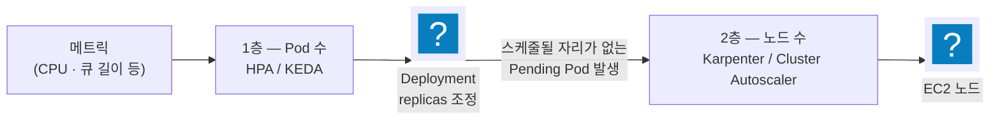
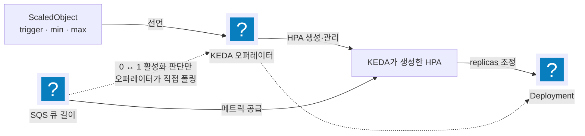

import { Quiz, QuizResults } from 'starlight-quiz/components';
import { LinkButton } from '@astrojs/starlight/components';

> 문서 유형: explanation

2과제의 스케일링 모듈은 **Pod를 늘리는 층**과 **노드를 늘리는 층**이 따로 돌아간다. [모듈 18](/part-4/18-scaling-logging-streaming/) 이론은 그 두 층이 이미 머릿속에 있다는 전제로 시간 예산과 채점 함정만 다루므로, KEDA가 HPA와 무슨 관계인지나 Karpenter가 왜 노드그룹을 안 쓰는지가 흐릿하면 여기서 먼저 채운다.

## ① 학습 목표

- [ ] HPA가 목표 Pod 수를 계산하는 식과 `requests`가 분모라는 사실을 설명할 수 있다
- [ ] KEDA의 ScaledObject가 **HPA를 대신 만들어 준다**는 구조를 알고, `minReplicaCount`가 0일 때만 KEDA 오퍼레이터가 직접 개입하는 이유를 안다
- [ ] Karpenter가 Cluster Autoscaler와 무엇이 다른지, NodePool·EC2NodeClass가 각각 무엇인지 설명할 수 있다
- [ ] Fargate 프로파일이 무엇을 셀렉터로 잡는지, 왜 컨트롤러를 Fargate에 올리는 구성이 나오는지 안다
- [ ] Pod 축소와 노드 축소가 **서로 다른 타이머**로 움직인다는 것을 알고 수렴 시간을 계산할 수 있다

---

## ② 핵심 개념

### 0. 두 층으로 나뉜다



<details class="diagram-note">
<summary>이 도식이 보여주는 것</summary>

오토스케일링이 2층 구조라는 것을 보여 준다. 1층은 메트릭을 보고 Pod 수를 바꾸는 HPA·KEDA 이고, 2층은 그 결과 갈 곳이 없어진 Pending Pod 을 보고 노드를 늘리는 Karpenter·Cluster Autoscaler 다. 노드는 메트릭이 아니라 **스케줄되지 못한 Pod** 을 보고 늘어난다 — CPU 가 아무리 높아도 Pod 이 늘지 않으면 노드도 늘지 않는다.

</details>

**2층은 1층의 결과를 보고 움직인다.** 노드 오토스케일러는 메트릭을 보지 않는다 — 오직 "스케줄되지 못한 Pod가 있는가"만 본다. 그래서 Pod가 늘어도 기존 노드에 다 들어가면 노드는 한 대도 안 늘어난다. 채점이 "노드 2대 이상"을 기대한다면 그건 **리소스 요청량으로 설계된 결과**이지 Pod 개수로 정해지는 게 아니다. `requests` 합과 노드 용량으로 대수를 계산하는 방법은 ⑤의 "노드 수는 Pod 수가 아니라 `requests` 합이 정한다" 절에 숫자로 나와 있다.

### 1. HPA — 이용률의 분모는 `requests`다

HorizontalPodAutoscaler는 메트릭을 보고 Deployment의 `replicas`를 조정한다. 목표 Pod 수 계산식은 단순하다.

```text
목표 replicas = ceil( 현재 replicas × ( 현재 메트릭 값 / 목표 값 ) )
```

CPU 이용률을 쓸 때 **분모가 노드의 CPU가 아니라 Pod의 `resources.requests.cpu`** 라는 점이 중요하다. `requests`를 크게 잡으면 같은 부하에서 이용률이 낮게 계산돼 스케일아웃이 늦어지고, 작게 잡으면 과민해진다. `requests`는 스케줄링 단위이면서 동시에 이용률의 기준선이다.

HPA는 **약 15초 주기**로 메트릭을 다시 읽고 판단한다(컨트롤 플레인 설정). 부하가 튀어도 다음 주기가 올 때까지는 아무 판단도 일어나지 않으므로, 이 15초가 감지에 걸리는 최소 시간이다.

#### `behavior` — 늘릴 때와 줄일 때를 따로 정한다

기본값은 **스케일아웃은 즉시, 스케일인은 5분(300초) 안정화 창**이다. 비대칭인 이유는 명확하다 — 부하가 튀면 빨리 늘려야 하고, 잠깐 잠잠하다고 성급히 줄이면 곧바로 다시 늘리는 진동(flapping)이 생긴다.

| 필드 | 뜻 |
|---|---|
| `scaleDown.stabilizationWindowSeconds` | 줄이기 전에 이 기간의 **최댓값**을 보고 판단한다. 기본 300초 |
| `scaleDown.policies` | 한 번에 얼마나 줄일지. `Percent 100 / 15s`면 15초마다 최대 100%까지 |
| `scaleUp.stabilizationWindowSeconds` | 늘릴 때의 안정화 창. 기본 0초(즉시) |

:::caution[기본값 300초가 채점을 깨뜨린다]
"부하를 없앤 뒤 N초 안에 Pod가 1개로 줄어야 한다"는 채점이 있으면 기본 안정화 창 300초로는 **구조적으로 불가능하다.** 값을 줄이는 것이 요령이 아니라 필수다.
:::

### 2. KEDA — ScaledObject가 HPA를 만들어 준다

HPA는 기본적으로 CPU·메모리만 본다. "SQS 큐에 메시지가 몇 개인가" 같은 **외부 메트릭**으로 스케일링하려면 그 값을 HPA가 읽을 수 있는 형태로 공급해 줄 무언가가 필요하다. 그게 KEDA다.

핵심 오해를 먼저 걷어낸다. **KEDA가 HPA를 대체하는 것이 아니다.** `ScaledObject`를 만들면 KEDA 오퍼레이터가 **뒤에서 HPA를 자동으로 생성**하고, 실제 replicas 조정은 그 HPA가 한다. KEDA는 외부 메트릭을 HPA에 먹여 주는 어댑터에 가깝다.



<details class="diagram-note">
<summary>이 도식이 보여주는 것</summary>

KEDA 가 SQS 큐 길이로 Pod 수를 바꾸는 경로다. ScaledObject 를 선언하면 KEDA 오퍼레이터가 그것을 읽어 HPA(`keda-hpa-<이름>`)를 대신 만들고, 그 HPA 가 큐 길이를 메트릭으로 받아 replicas 를 조정한다. 점선이 다른 일을 한다 — 0 에서 1 로 깨우는 활성화 판단만은 HPA 가 아니라 오퍼레이터가 큐를 직접 폴링해서 한다. `minReplicaCount: 0` 일 때 `pollingInterval` 이 의미를 갖는 이유다.

</details>

#### `minReplicaCount`가 0인지 아닌지가 모든 것을 가른다

HPA는 **replicas가 0인 워크로드를 다룰 수 없다.** 0에서는 이용률을 계산할 분모가 없기 때문이다. 그래서 역할이 이렇게 갈린다.

| 구간 | 누가 판단하나 | 관련 필드 |
|---|---|---|
| **0 → 1 활성화** | KEDA 오퍼레이터가 트리거를 **직접 폴링**해서 판단 | `pollingInterval` |
| **1 → N 스케일링** | KEDA가 만든 **HPA**가 자기 주기(약 15초)로 판단 | HPA `behavior` |
| **1 → 0 비활성화** | KEDA 오퍼레이터 | `cooldownPeriod` |

여기서 **가장 헷갈리는 결론**이 나온다.

:::danger[`pollingInterval`의 유효 여부는 `minReplicaCount`에 달려 있다]
`minReplicaCount ≥ 1`이면 0↔1 전환 자체가 없으므로 **`pollingInterval`은 아무 일도 하지 않는다.** KEDA 2.x는 이 조합에 "설정했지만 관련 없다"는 경고까지 낸다. 반대로 `minReplicaCount: 0`이면 활성화 감지 지연을 `pollingInterval`이 그대로 결정하므로 **반드시 설정해야 한다.**

같은 필드가 다른 세트에서 "지워야 할 것"과 "반드시 넣어야 할 것"으로 갈린다. 값을 외우지 말고 `minReplicaCount`부터 본다.
:::

#### 트리거 인증 — 두 방식

KEDA가 SQS 큐 길이를 읽으려면 AWS 자격증명이 필요하다. **큐를 읽는 주체는 애플리케이션 Pod가 아니라 KEDA 오퍼레이터**라는 점을 놓치면 권한을 엉뚱한 곳에 준다.

| 방식 | 어떻게 | 성격 |
|---|---|---|
| `identityOwner: operator` | 트리거 메타데이터에 한 줄. KEDA 오퍼레이터 ServiceAccount의 IRSA를 그대로 쓴다 | 간단. KEDA 3.0에서 제거 예정 |
| `TriggerAuthentication` | 별도 리소스를 만들어 트리거가 참조 | 권장 방향. 인증 설정을 여러 ScaledObject가 공유 가능 |

### 3. Karpenter — 노드그룹 없이 EC2를 직접 만든다

기존 방식인 Cluster Autoscaler는 **미리 만들어 둔 노드그룹(ASG)의 희망 용량을 조절**한다. 그래서 인스턴스 타입 조합마다 노드그룹을 미리 준비해야 하고, 노드가 뜨기까지 ASG를 한 번 거친다.

Karpenter는 그 층을 걷어낸다. Pending Pod를 보고 **필요한 스펙을 계산해 EC2 인스턴스를 직접 띄운다.**

| 항목 | Cluster Autoscaler | Karpenter |
|---|---|---|
| 대상 | 미리 만든 노드그룹(ASG) | EC2 직접 |
| 타입 선택 | 노드그룹에 고정된 타입 | 후보 목록에서 Pod에 맞게 고름 |
| 준비 작업 | 조합마다 노드그룹 생성 | NodePool 하나로 여러 타입 커버 |
| 축소 | 유휴 노드 종료 | **통합(consolidation)** — 여러 노드의 Pod를 모아 더 적은/싼 노드로 재배치 |

리소스는 둘로 나뉜다.

- **NodePool** — "어떤 노드를 얼마나, 어떤 조건으로 만들까". 인스턴스 타입 후보, 상한, taint, **노드에 붙일 라벨**, 축소 정책(`spec.disruption`)을 담는다.
- **EC2NodeClass** — "그 노드를 AWS에서 어떻게 만들까". AMI, 서브넷·보안 그룹 **디스커버리 조건**, 인스턴스 프로파일 등 AWS 쪽 설정.

:::caution[NodePool의 라벨은 선언해야 생긴다]
`karpenter.sh/nodepool=<이름>`은 Karpenter가 자동으로 붙여 준다. 하지만 그 외의 라벨(예: `role=worker`)은 **NodePool의 노드 템플릿에 직접 선언해야** 프로비저닝된 노드에 붙는다. Pod의 `nodeSelector`가 그 라벨을 요구하는데 NodePool에 선언이 없으면, 노드는 뜨는데 Pod는 영원히 Pending이다.
:::

#### 디스커버리 — 태그로 서브넷과 보안 그룹을 찾는다

Karpenter는 인스턴스를 어느 서브넷에, 어떤 보안 그룹으로 띄울지를 **태그 조회**로 알아낸다. EC2NodeClass에 "이런 태그가 붙은 서브넷을 써라"라고 적고, 실제 서브넷에 그 태그가 있어야 한다. **태그가 없으면 대상을 못 찾아 노드가 영영 안 뜬다** — Pending Pod는 쌓이는데 오류 메시지는 컨트롤러 로그에만 남는 조용한 실패다.

#### 축소는 `consolidation`이 담당한다

`spec.disruption.consolidationPolicy`가 언제 노드를 정리할지 정한다. 값은 셋이다 — `WhenEmpty`는 완전히 빈 노드만, `WhenEmptyOrUnderutilized`는 놀고 있는 노드의 Pod를 다른 노드로 옮겨서까지, `Balanced`는 절감액이 중단 비용을 정당화할 때만 정리한다. `consolidateAfter`는 그 판단까지의 대기 시간이다.

### 4. Fargate — Pod 하나가 곧 노드 하나

Fargate는 노드를 관리하지 않는 실행 방식이다. Pod를 만들면 AWS가 **그 Pod 전용 마이크로 VM**을 띄우고, Pod가 끝나면 사라진다. `kubectl get nodes`에는 Pod마다 노드 하나가 보인다.

**Fargate 프로파일**이 "어떤 Pod를 Fargate로 보낼지"를 정한다. 셀렉터는 **네임스페이스**(+선택적으로 라벨)이고, 매칭되는 Pod는 자동으로 Fargate에서 실행된다. 매칭 안 되는 Pod는 평범하게 EC2 노드로 간다.

이 성질이 대회에서 쓰이는 지점이 있다. **Karpenter는 EC2 노드를 만드는 컨트롤러인데, 정작 자기 자신이 앉을 노드가 필요하다.** 닭과 달걀이다. 해법은 둘이다.

1. 관리형 노드그룹을 최소 규모로 하나 두고 거기에 컨트롤러를 올린다 — 노드 수가 고정돼 있으면 컨트롤러 복제본 수를 그 안에 맞춰야 한다
2. **컨트롤러 네임스페이스를 Fargate 프로파일로 잡는다** — Pod마다 컴퓨트가 생기므로 노드 용량을 신경 쓸 필요가 없다

Fargate에는 제약도 있다. DaemonSet이 뜨지 않고(노드가 Pod 전용이라 의미가 없다), 특권 컨테이너·호스트 네트워크를 못 쓰며, 노드에 GPU나 로컬 스토리지를 붙일 수 없다. **로그 수집 DaemonSet이 필요한 워크로드는 Fargate에 올리지 않는다.**

---

## ③ 대회에서 어떻게 쓰이나

두 후보 세트가 같은 SQS → KEDA → Karpenter 체인을 쓰는데 **파라미터가 정반대**다. 위 개념이 잡혀 있으면 표가 그대로 읽힌다.

| 항목 | set-07 module-3 | set-08 module-4 |
|---|---|---|
| 컨트롤러 위치 | 관리형 노드그룹(1대 고정) | **Fargate 프로파일 2개** |
| `minReplicaCount` | 1 | **0** |
| `pollingInterval` | 무효 — 두지 않는다 | **유효 — 반드시 설정** |
| 인증 | `identityOwner: operator` | **TriggerAuthentication** |

컨트롤러 노드가 1대로 고정된 set-07에서는 Karpenter 복제본을 1로 낮춰야 설치가 끝난다. 기본값이 2인데 두 번째 복제본이 앉을 노드가 없기 때문이다. Karpenter 차트가 복제본 사이에 **안티어피니티**를 걸어 두어 같은 노드에 두 개를 올리지 못하게 막는다 — 컨트롤러가 한 노드와 함께 통째로 죽는 것을 피하려는 설정이다. 노드가 1대뿐이면 그 규칙 때문에 두 번째 복제본이 영영 Pending 으로 남는다. set-08은 Fargate라 그 문제 자체가 없다. **같은 소프트웨어인데 배치가 달라 함정이 갈리는** 사례다.

상세 채점 항목은 [모듈 18 이론](/part-4/18-scaling-logging-streaming/theory/)에 있다.

---

## ④ 핵심 코드 패턴

```bash
# KEDA가 실제로 HPA를 만들었는지 — ScaledObject만 보고 끝내지 않는다
kubectl get scaledobject -n <ns>
kubectl get hpa -n <ns>                      # keda-hpa-<scaledobject 이름>

# 왜 안 늘어나는가 — HPA가 메트릭을 읽고 있는지부터
kubectl describe hpa -n <ns> <이름>          # Metrics·Events 절

# Pod가 Pending인 이유 (노드 부족인지 셀렉터 불일치인지)
kubectl describe pod -n <ns> <이름>          # Events 의 FailedScheduling 사유

# Karpenter가 노드를 만들려고 시도는 했는지
kubectl get nodeclaims
kubectl logs -n <karpenter ns> deploy/karpenter --tail=50

# 노드에 실제로 붙은 라벨 확인 (nodeSelector와 대조)
kubectl get nodes --show-labels
```

<details class="diagram-note">
<summary>이 블록이 하는 일</summary>

안 늘어날 때 원인을 좁히는 순서다. ScaledObject 만 보면 안 된다 — KEDA 가 HPA 를 실제로 만들었는지 `get hpa` 로 확인하고, `describe hpa` 의 Metrics 절에서 메트릭을 읽고는 있는지 본다. Pod 이 Pending 이면 `describe pod` 의 `FailedScheduling` 사유가 노드 부족인지 셀렉터 불일치인지 갈라 준다. 마지막 두 명령은 Karpenter 가 노드를 만들려고 시도는 했는지, 만든 노드에 기대한 라벨이 붙었는지를 본다.

</details>

---

## ⑤ 심화 개념

### 노드 수는 Pod 수가 아니라 `requests` 합이 정한다

"Pod 5개면 노드 몇 대?"라는 질문에는 답이 없다. 노드 수를 정하는 것은 **Pod들의 `requests` 합이 노드의 할당 가능 용량을 넘느냐**다.

`requests.cpu`가 `500m`인 Pod 5개면 합계 2.5 vCPU다. `500m` 은 **밀리코어** 표기이고 `1000m` 이 vCPU 하나이므로 `500m` 은 0.5개다.

2 vCPU 짜리 인스턴스라도 그 2 개를 다 쓰지는 못한다. kubelet 과 컨테이너 런타임, OS 가 쓸 몫을 노드가 미리 떼어 두기 때문이다. 이 떼어 둔 몫을 시스템 예약이라고 부르고, 남은 것이 `kubectl describe node` 의 `Allocatable` 에 찍히는 약 1.9 vCPU 다. 스케줄러는 2 가 아니라 이 1.9 를 기준으로 자리를 계산한다.

그래서 2.5 vCPU 는 한 대에 다 들어가지 못하고, 못 들어간 Pod 가 Pending 이 되어 두 번째 노드를 부른다. **`requests`를 낮추면 전부 한 대에 들어가 노드가 안 늘어난다.**

채점이 "노드 2대 이상"을 요구한다면 그 숫자는 이 계산에서 나온 것이다. 리소스 요청량을 "적당히" 조정하는 순간 채점 항목이 깨진다.

### 수렴 시간은 타이머 세 개의 합이다

부하를 없앤 뒤 노드 1대까지 돌아오는 시간은 서로 다른 타이머의 직렬 합이다.

```text
메트릭 감지(HPA 약 15초)
  → 안정화 창(scaleDown.stabilizationWindowSeconds)
  → Pod 종료
  → 노드 통합 대기(consolidateAfter)
  → 노드 종료
```

<details class="diagram-note">
<summary>이 블록이 하는 일</summary>

축소가 직렬로 쌓이는 타이머 다섯 개다. 메트릭 감지, 안정화 창, Pod 종료, 노드 통합 대기, 노드 종료가 차례로 붙으므로 전체 시간은 그 합이다. 어느 하나만 줄여도 총합이 크게 줄지 않고, 반대로 하나만 늘려도 예산이 무너진다.

</details>

채점이 "N초 안에 Pod 1개·노드 1대"를 요구하면 이 사슬 전체가 N초 안에 끝나야 한다. 어느 한 값만 줄여서는 안 되고, 반대로 **어느 하나라도 늘리면 예산이 무너진다.** 기본값(안정화 300초)으로 시작하면 Pod 축소만으로 5분이 지나간다.

### 왜 스케일인이 스케일아웃보다 보수적인가

늘리는 판단이 틀리면 잠깐 돈을 더 쓴다. 줄이는 판단이 틀리면 **요청이 떨어진다.** 비용이 비대칭이므로 기본값도 비대칭이다. 대회 채점은 이 안전장치를 일부러 걷어내라고 요구하는 셈인데, 실무에서 같은 값을 쓰면 트래픽이 잠깐 잠잠할 때마다 용량이 무너진다는 것도 함께 알아 둔다.

### 트러블슈팅

| 증상 | 원인 | 확인 |
|---|---|---|
| ScaledObject는 READY인데 Pod가 안 늘어난다 | KEDA 오퍼레이터에 큐 읽기 권한 없음 | `kubectl describe hpa` 의 메트릭 값, KEDA 오퍼레이터 로그 |
| Pod는 늘었는데 노드가 그대로 | `requests` 합이 기존 노드 용량 안 | `kubectl describe node` 의 Allocated resources |
| Pending Pod가 있는데 노드가 안 뜬다 | 디스커버리 태그 누락(서브넷·보안 그룹) | Karpenter 컨트롤러 로그, 서브넷 태그 |
| 노드는 떴는데 Pod가 계속 Pending | NodePool에 선언 안 한 라벨을 nodeSelector가 요구 | `kubectl get nodes --show-labels` 로 대조 |
| 부하가 끝나도 Pod가 5분간 안 줄어든다 | `scaleDown` 안정화 창 기본 300초 | HPA `behavior` 설정 |
| KEDA 설치 시 Pod가 전부 Pending | 노드에 taint가 걸려 있는데 toleration 미지정 | `helm show values` 로 tolerations 키 확인 |
| `pollingInterval`이 무시된다는 경고 | `minReplicaCount ≥ 1` 이라 0↔1 전환이 없다 | 의도한 min 값인지 확인 |

---

## ⑥ 자기 점검 퀴즈

<Quiz title="KEDA와 HPA의 관계">
`ScaledObject`를 만들었다. 클러스터에 실제로 생기는 것과, replicas를 실제로 바꾸는 주체는?

- [x] KEDA 오퍼레이터가 **HPA를 자동 생성**하고, 1→N 구간의 replicas 조정은 그 HPA가 한다 — KEDA는 외부 메트릭을 HPA에 먹여 주는 어댑터에 가깝다
- [ ] KEDA가 HPA를 대체하므로 HPA는 생기지 않고 KEDA가 직접 replicas를 쓴다
  > `kubectl get hpa` 를 해 보면 `keda-hpa-<이름>` 이 실제로 존재한다. 대체가 아니라 위임이다.
- [ ] HPA를 미리 따로 만들어 두어야 ScaledObject가 그것을 참조한다
  > 직접 만들 필요가 없다. 오히려 같은 대상에 HPA를 중복으로 만들면 서로 충돌한다.
- [ ] KEDA는 메트릭만 노출하고 스케일링은 클러스터 오토스케일러가 한다
  > 클러스터 오토스케일러는 노드 층이다. Pod 수와 무관하다.

**KEDA가 HPA를 만든다**는 사실을 알면 디버깅 경로가 생긴다 — 스케일링이 안 될 때 ScaledObject만 보지 말고 `kubectl describe hpa` 로 메트릭이 실제로 들어오는지 본다.
</Quiz>

<Quiz title="pollingInterval이 유효한 조건">
어떤 세트에서는 ScaledObject의 `pollingInterval`을 지우는 것이 정답이고, 다른 세트에서는 반드시 넣어야 한다. 무엇이 이 차이를 만드나?

- [x] `minReplicaCount` — 0이면 0↔1 활성화를 KEDA 오퍼레이터가 직접 폴링해 판단하므로 이 값이 감지 지연을 결정하고, 1 이상이면 0↔1 전환 자체가 없어 아무 일도 하지 않는다
- [ ] `maxReplicaCount` — 상한이 클수록 폴링이 자주 필요하다
  > 상한은 목표 계산의 캡일 뿐이고 폴링 주체와 무관하다.
- [ ] 트리거 종류 — SQS 트리거에서만 유효하다
  > 트리거 종류와 무관하다. 활성화 판단이 필요한 구간이 있느냐가 기준이다.
- [ ] KEDA 버전 — 2.x에서는 무효이고 3.x에서 유효해진다
  > 버전 문제가 아니다. 2.x도 min 0이면 정상적으로 사용한다.

HPA는 replicas 0인 워크로드를 다룰 수 없다 — 이용률을 계산할 분모가 없기 때문이다. 그래서 **0↔1만 KEDA 오퍼레이터가 맡고 나머지는 HPA가 맡는다.** 값을 외우지 말고 `minReplicaCount`부터 확인한다.
</Quiz>

<Quiz title="노드 수를 정하는 것">
`requests.cpu`가 500m인 Pod가 5개로 늘었다. 노드(할당 가능 약 1.9 vCPU)는 몇 대가 되며 그 이유는?

- [x] 2대 — `requests` 합이 2.5 vCPU라 1.9 vCPU짜리 한 대에 다 들어가지 못하고, 못 들어간 Pod가 Pending이 되어 두 번째 노드를 부른다
- [ ] 5대 — Karpenter는 Pod마다 노드를 하나씩 만든다
  > Pod마다 노드가 생기는 것은 Fargate다. Karpenter는 여러 Pod를 한 노드에 모은다.
- [ ] 1대 — Pod 5개 정도는 어떤 노드든 수용한다
  > 수용 여부는 개수가 아니라 `requests` 합으로 결정된다. 2.5 > 1.9이므로 부족하다.
- [ ] NodePool에 설정한 최소 노드 수에 따라 결정된다
  > Karpenter NodePool에는 최소 노드 수 개념이 없다. 노드는 Pending Pod가 있을 때만 생긴다.

노드 수는 **Pod 개수가 아니라 `requests` 합**이 정한다. 채점이 "노드 2대 이상"을 요구한다면 그 숫자는 이 계산의 결과이므로, `requests`를 임의로 낮추면 채점 항목이 깨진다.
</Quiz>

<Quiz title="Karpenter가 노드를 아예 안 띄운다">
Pending Pod가 쌓여 있는데 Karpenter가 노드를 한 대도 만들지 않는다. 오류 메시지도 눈에 띄지 않는다. 가장 먼저 볼 곳은?

- [x] EC2NodeClass의 서브넷·보안 그룹 **디스커버리 조건과 실제 태그** — 대상을 못 찾으면 노드를 만들 수 없고, 실패는 컨트롤러 로그에만 조용히 남는다
- [ ] HPA의 `behavior` 설정
  > HPA는 Pod 층이다. Pod는 이미 늘어나 Pending 상태이므로 1층은 정상 동작한 것이다.
- [ ] Deployment의 `replicas` 값을 수동으로 올린다
  > Pending Pod를 더 만들 뿐 원인은 그대로다.
- [ ] 노드에 `karpenter.sh/nodepool` 라벨을 수동으로 붙인다
  > 그 라벨은 Karpenter가 만든 노드에 자동으로 붙는다. 애초에 노드가 없다.

Karpenter는 태그 조회로 서브넷·보안 그룹을 찾는다. 태그가 없으면 프로비저닝 자체가 불가능한데 Pod 이벤트에는 그 사유가 드러나지 않는다 — **컨트롤러 로그를 보는 습관**이 이 유형을 푼다.
</Quiz>

<Quiz title="컨트롤러를 Fargate에 올리는 이유">
KEDA·Karpenter를 Fargate 프로파일로 띄우는 구성이 해결하는 문제는?

- [x] Karpenter는 EC2 노드를 만드는 컨트롤러인데 정작 자신이 앉을 노드가 필요하다는 닭과 달걀 문제 — Fargate는 Pod마다 컴퓨트를 주므로 노드그룹 없이 컨트롤러를 띄울 수 있다
- [ ] Fargate가 EC2보다 항상 저렴하기 때문
  > 상시 구동 워크로드는 오히려 Fargate가 비싼 경우가 많다. 비용이 아니라 부트스트랩 구조의 문제다.
- [ ] Fargate에서만 IRSA를 쓸 수 있기 때문
  > IRSA는 실행 방식과 무관하다.
- [ ] KEDA가 EC2 노드에서는 외부 메트릭을 읽지 못하기 때문
  > EC2 노드 위에서도 정상 동작한다.

대안은 관리형 노드그룹을 최소 규모로 두는 것인데, 노드 수가 고정되면 **컨트롤러 복제본 수를 그 용량에 맞춰야 하는** 부담이 따라온다. Fargate는 그 제약 자체를 없앤다. 대신 DaemonSet을 못 쓰므로 로그 수집이 필요한 워크로드는 올리지 않는다.
</Quiz>

<Quiz title="수렴 시간의 구성">
부하를 없앤 뒤 Pod 1개·노드 1대로 돌아오기까지의 시간을 결정하는 요소를 **모두** 고르시오.

- [x] HPA의 메트릭 감지 주기(약 15초)
- [x] `scaleDown.stabilizationWindowSeconds` — 기본값 300초
- [x] Karpenter의 `consolidateAfter` — 노드 정리 판단까지의 대기
- [ ] `maxReplicaCount` — 상한이 클수록 축소가 오래 걸린다
  > 상한은 늘어날 수 있는 최대치이지 축소 속도와 무관하다.
- [ ] SQS 가시성 제한 시간 — 메시지가 사라져야 축소가 시작된다
  > 축소 판단은 큐 길이 메트릭을 보고 하며, 가시성 제한 시간은 개별 메시지의 재전달 규칙이다.

세 타이머가 **직렬로** 붙는다. 채점 창이 짧으면 이 사슬 전체가 그 안에 들어와야 하고, 어느 하나라도 늘리면 예산이 무너진다. 기본값으로 두면 Pod 축소에만 5분이 지나간다.
</Quiz>

<QuizResults confetti />

---

## ⑦ 다음 단계

선수 학습은 여기서 끝난다 — [선수 지식 개요](/start/)의 완료 체크를 마친 뒤 PART 1 로 넘어간다. 이 문서의 내용은 모듈 18 에서 실습한다.

<LinkButton href="/part-1/06-terraform-vpc/" icon="right-arrow">PART 1 시작</LinkButton>
<LinkButton href="/part-4/18-scaling-logging-streaming/" variant="minimal">모듈 18 — 오토스케일링 + 로깅 + 스트리밍</LinkButton>

## 공식 문서

- [HorizontalPodAutoscaler](https://kubernetes.io/docs/tasks/run-application/horizontal-pod-autoscale/) — 계산식과 `behavior` 필드
- [KEDA ScaledObject](https://keda.sh/docs/latest/reference/scaledobject-spec/) — 필드별 의미와 `pollingInterval` 적용 조건
- [KEDA AWS SQS 스케일러](https://keda.sh/docs/latest/scalers/aws-sqs/) — 트리거 메타데이터와 인증 방식
- [Karpenter NodePool](https://karpenter.sh/docs/concepts/nodepools/) — 요구 조건·상한·disruption
- [Karpenter Disruption](https://karpenter.sh/docs/concepts/disruption/) — consolidation 정책
- [EKS Fargate 프로파일](https://docs.aws.amazon.com/eks/latest/userguide/fargate-profile.html) — 셀렉터와 제약
