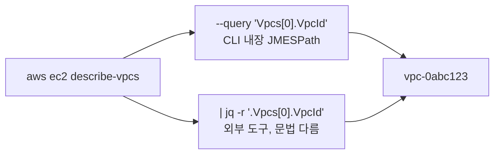

> 문서 유형: explanation

## ① 학습 목표

- [ ] 프로파일과 리전이 어디서 결정되는지 안다 (`~/.aws/config`, `--profile`, `--region`)
- [ ] `describe-*` / `list-*` 조회 명령 패턴을 안다
- [ ] `--query`(JMESPath)와 jq 두 방식으로 값을 뽑을 수 있다
- [ ] CloudShell이 무엇이고 일반 vs VPC 환경 차이를 안다

## ② 핵심 개념

명령 구조: `aws <서비스> <동작> [옵션]`

| 패턴 | 의미 |
|---|---|
| `describe-*` / `list-*` / `get-*` | 조회 (읽기 전용, 과금 없음) |
| `create-*` / `delete-*` | 생성/삭제 |
| `--profile foo` | `~/.aws/config`의 프로파일 선택 (생략 시 default) |
| `--region ap-northeast-2` | 리전 지정 (생략 시 프로파일의 리전) |
| `--output json\|table\|text` | 출력 형식 |
| `--query 'JMESPath'` | AWS CLI 내장 필터 (jq 없이 동작) |

값 추출 두 갈래:



- `--query`는 JMESPath 문법 (`Vpcs[0].VpcId`), jq는 jq 문법 (`.Vpcs[0].VpcId` — 맨 앞에 점).
- 채점 스크립트(mark.sh)는 주로 **jq**를 쓰므로 둘 다 읽을 수 있어야 한다.

**CloudShell**: 콘솔에서 바로 여는 브라우저 셸. aws cli/자격증명이 콘솔 로그인 신원으로 자동 설정됨.

- **일반 CloudShell**: AWS 퍼블릭 네트워크에서 실행 — 인터넷 됨
- **VPC CloudShell**: 지정한 VPC/서브넷 안에서 실행 — 프라이빗 리소스(내부 엔드포인트 등)에 접근할 때 사용. 서브넷 라우팅에 따라 인터넷이 안 될 수 있음

## ③ 대회에서 어떻게 쓰이나

- **mark.sh가 전부 aws cli + jq다.** `aws eks describe-cluster ... | jq -r '...'` 같은 줄을 읽을 줄 알면 "채점이 정확히 어떤 필드를 보는지" 역추적할 수 있다 — 대회 전 최대 무기.
- 대회 작업 환경 자체가 CloudShell인 유형이 많다. 프로파일/리전이 잘못돼 있으면 모든 명령이 엉뚱한 곳을 보게 된다 — 시작 시 `sts get-caller-identity`와 리전 확인이 루틴.

## ④ 미니 실습 (15분, 조회만 — 과금 없음)

기본 VPC가 있는 계정에서 (iam-basics.md의 사용자로):

```bash
aws sts get-caller-identity            # 신원 확인 루틴
aws ec2 describe-vpcs --output table   # 전체를 표로 훑기

# 방법 1: --query (JMESPath)
aws ec2 describe-vpcs --query 'Vpcs[0].VpcId' --output text

# 방법 2: jq
aws ec2 describe-vpcs | jq -r '.Vpcs[0].VpcId'

# 응용: 전체 VPC의 ID+CIDR 쌍
aws ec2 describe-vpcs --query 'Vpcs[].[VpcId,CidrBlock]' --output text
aws ec2 describe-vpcs | jq -r '.Vpcs[] | "\(.VpcId) \(.CidrBlock)"'
```

두 방식의 출력이 같은지 확인. 콘솔에서 CloudShell도 한 번 열어 같은 명령을 실행해 본다 (자격증명 설정 없이 되는 것 확인).

## ⑤ 자기 점검 퀴즈

1. `--query 'Vpcs[0].VpcId'`와 `jq '.Vpcs[0].VpcId'` — 문법상 가장 눈에 띄는 차이는?
2. `--region`을 생략하면 리전은 어디서 결정되나?
3. VPC CloudShell은 언제 필요한가?

<details>
<summary>정답</summary>

1. jq는 맨 앞에 `.`이 붙고 결과에 따옴표가 있음(`-r`로 제거); `--query`는 점 없이 시작하는 JMESPath이며 `--output text`로 raw 출력.
2. 프로파일 설정(`~/.aws/config`의 region), 그것도 없으면 환경변수 `AWS_DEFAULT_REGION` — 아무것도 없으면 오류.
3. VPC 내부 프라이빗 리소스(내부 엔드포인트, 프라이빗 서비스)에 셸로 접근해야 할 때. 일반 CloudShell은 VPC 밖에서 실행되어 프라이빗 IP에 못 닿는다.

</details>

## ⑥ 다음 단계

- 선수 학습 완료 → [README.md](/start/)의 완료 체크 후 [../PART-1-Foundation-IaC/](/part-1/01-terraform-vpc/) 시작
- 채점 역추적 훈련: [../PART-5-Battle-Drills/](/part-5/11-mutation-drill/)

## 공식 문서

- [AWS CLI 명령 레퍼런스](https://docs.aws.amazon.com/cli/latest/reference/) — 서비스별 서브커맨드·옵션
- [CLI 사용 설명서](https://docs.aws.amazon.com/cli/latest/userguide/) — 프로필·자격증명·출력 형식
- [JMESPath 튜토리얼](https://jmespath.org/tutorial.html) — `--query` 표현식 문법
