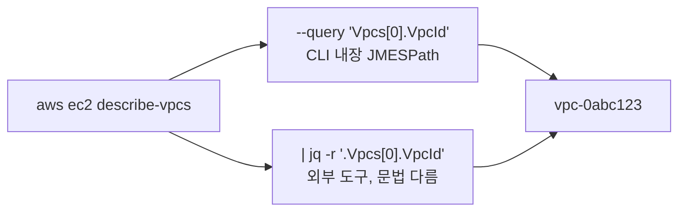

import { Quiz, QuizResults } from 'starlight-quiz/components';
import { Tabs, TabItem, LinkButton } from '@astrojs/starlight/components';

> 문서 유형: explanation

## ① 학습 목표

- [ ] 프로파일과 리전이 어디서 결정되는지 안다 (`~/.aws/config`, `--profile`, `--region`)
- [ ] `describe-*` / `list-*` 조회 명령 패턴을 안다
- [ ] `--query`(JMESPath)와 jq 두 방식으로 값을 뽑을 수 있다
- [ ] CloudShell이 무엇이고 일반 vs VPC 환경 차이를 안다

## ② 핵심 개념

명령 구조: `aws <서비스> <동작> [옵션]`

| 패턴 | 의미 |
|---|---|
| `describe-*` / `list-*` / `get-*` | 조회 (읽기 전용, 과금 없음) |
| `create-*` / `delete-*` | 생성/삭제 |
| `--profile foo` | `~/.aws/config`의 프로파일 선택 (생략 시 default) |
| `--region ap-northeast-2` | 리전 지정 (생략 시 프로파일의 리전) |
| `--output json\|table\|text` | 출력 형식 |
| `--query 'JMESPath'` | AWS CLI 내장 필터 (jq 없이 동작) |

값 추출 두 갈래:



- `--query`는 JMESPath 문법 (`Vpcs[0].VpcId`), jq는 jq 문법 (`.Vpcs[0].VpcId` — 맨 앞에 점).
- 채점 스크립트(mark.sh)는 주로 **jq**를 쓰므로 둘 다 읽을 수 있어야 한다.

**CloudShell**: 콘솔에서 바로 여는 브라우저 셸. aws cli/자격증명이 콘솔 로그인 신원으로 자동 설정됨.

- **일반 CloudShell**: AWS 퍼블릭 네트워크에서 실행 — 인터넷 됨
- **VPC CloudShell**: 지정한 VPC/서브넷 안에서 실행 — 프라이빗 리소스(내부 엔드포인트 등)에 접근할 때 사용. 서브넷 라우팅에 따라 인터넷이 안 될 수 있음

## ③ 대회에서 어떻게 쓰이나

- **mark.sh가 전부 aws cli + jq다.** `aws eks describe-cluster ... | jq -r '...'` 같은 줄을 읽을 줄 알면 "채점이 정확히 어떤 필드를 보는지" 역추적할 수 있다 — 대회 전 최대 무기.
- 대회 작업 환경 자체가 CloudShell인 유형이 많다.

:::caution[프로파일·리전 확인이 시작 루틴]
프로파일/리전이 잘못돼 있으면 모든 명령이 조용히 엉뚱한 곳을 본다. 셸을 열자마자 `sts get-caller-identity` 와 리전 확인.
:::

## ④ 미니 실습 (15분, 조회만 — 과금 없음)

기본 VPC가 있는 계정에서 (iam-basics.md의 사용자로):

```bash
aws sts get-caller-identity            # 신원 확인 루틴
aws ec2 describe-vpcs --output table   # 전체를 표로 훑기
```

같은 값을 두 방식으로 뽑아 본다:

<Tabs syncKey="tool">
  <TabItem label="--query (JMESPath)">
  ```bash
  aws ec2 describe-vpcs --query 'Vpcs[0].VpcId' --output text

  # 응용: 전체 VPC의 ID+CIDR 쌍
  aws ec2 describe-vpcs --query 'Vpcs[].[VpcId,CidrBlock]' --output text
  ```
  </TabItem>
  <TabItem label="jq">
  ```bash
  aws ec2 describe-vpcs | jq -r '.Vpcs[0].VpcId'

  # 응용: 전체 VPC의 ID+CIDR 쌍
  aws ec2 describe-vpcs | jq -r '.Vpcs[] | "\(.VpcId) \(.CidrBlock)"'
  ```
  </TabItem>
</Tabs>

두 방식의 출력이 같은지 확인. 콘솔에서 CloudShell도 한 번 열어 같은 명령을 실행해 본다 (자격증명 설정 없이 되는 것 확인).

## ⑤ 자기 점검 퀴즈

<Quiz title="--query vs jq 문법">
`--query 'Vpcs[0].VpcId'` 와 `jq '.Vpcs[0].VpcId'` — 문법상 가장 눈에 띄는 차이는?

- [x] jq는 표현식 맨 앞에 `.`이 붙고 기본 출력에 따옴표가 있다(`-r`로 제거). `--query`는 점 없이 시작하는 JMESPath이며 `--output text`로 raw 출력한다
- [ ] 둘 다 같은 JMESPath 문법이며, 실행 위치(CLI 내부 vs 외부 프로세스)만 다르다
  > "결국 같은 문법"이 가장 위험한 오해다. 루트 표기(`.` 유무)부터 다르고, jq에는 `|` 파이프·문자열 보간(`"\(.VpcId)"`) 같은 JMESPath에 없는 기능이 있다.
- [ ] `--query` 쪽이 맨 앞에 `.`을 요구하고 jq는 요구하지 않는다
  > 정확히 반대다. jq가 "현재 입력"을 뜻하는 `.`에서 시작한다.
- [ ] jq는 `[0]` 인덱싱을 지원하지 않아 `first` 함수를 써야 한다

`--query`는 AWS CLI에 내장된 **JMESPath**(`Vpcs[0].VpcId` — 점 없이 시작), jq는 **외부 도구**의 별도 문법(`.Vpcs[0].VpcId` — 점으로 시작)이다. raw 값을 얻는 방법도 다르다 — `--query` 는 `--output text`, jq는 `-r`. 채점 스크립트(mark.sh)는 주로 **jq**를 쓰므로 둘 다 읽을 수 있어야 "채점이 어떤 필드를 보는지" 역추적할 수 있다.
</Quiz>

<Quiz title="--region 생략 시 리전 결정">
`--region` 을 생략하면 CLI는 리전을 어디서 가져오나?

- [x] 프로파일 설정(`~/.aws/config`의 `region`) 또는 환경변수(`AWS_REGION` / `AWS_DEFAULT_REGION`). 둘 다 없으면 오류가 난다
- [ ] 지정하지 않으면 항상 `us-east-1` 로 폴백된다
  > S3·IAM처럼 글로벌 엔드포인트가 `us-east-1`인 서비스들 때문에 생기는 착각이다. 리전 필수 서비스는 폴백 없이 그냥 실패한다.
- [ ] 액세스 키에 리전이 묶여 있어 `~/.aws/credentials` 의 키에서 자동으로 결정된다
  > 자격증명과 리전은 완전히 별개다. 같은 키로 어느 리전이든 호출할 수 있다.
- [ ] 리전 없이도 실행되며 AWS가 지연 시간이 가장 낮은 리전을 자동 선택한다

리전 출처는 **명령줄 `--region` > 환경변수(`AWS_REGION`/`AWS_DEFAULT_REGION`) > 프로파일의 `region`** 순으로 결정되고, 아무 데도 없으면 `You must specify a region` 오류가 난다. 대회에서는 `ap-northeast-2` 가 기본 — CloudShell을 열자마자 `aws sts get-caller-identity` 로 신원을, 리전 설정으로 위치를 확인하는 것이 루틴이다. 프로파일/리전이 어긋나면 모든 명령이 조용히 엉뚱한 곳을 본다.
</Quiz>

<Quiz title="VPC CloudShell이 필요한 순간">
일반 CloudShell 대신 **VPC CloudShell**을 써야 하는 상황은?

- [x] VPC 내부의 프라이빗 리소스(내부 엔드포인트, 프라이빗 IP로만 열린 서비스)에 셸로 직접 접근해야 할 때
- [ ] 인터넷 대역폭이 더 넓어 큰 이미지를 빌드·push해야 할 때
  > 오히려 반대일 수 있다. VPC CloudShell은 지정 서브넷의 라우팅을 그대로 따르므로, NAT 경로가 없는 서브넷을 고르면 **인터넷이 아예 안 된다**.
- [ ] 자격증명을 수동 설정하지 않고 콘솔 로그인 신원을 그대로 쓰고 싶을 때
  > 그건 일반 CloudShell도 똑같이 해 준다. 두 모드를 가르는 기준이 아니다.
- [ ] 여러 리전의 리소스를 한 셸에서 동시에 조회해야 할 때

**일반 CloudShell**은 AWS 퍼블릭 네트워크에서 실행되므로 인터넷은 되지만 VPC 안의 프라이빗 IP에는 닿지 못한다. **VPC CloudShell**은 지정한 VPC/서브넷 안에서 실행되어 프라이빗 리소스에 접근할 수 있는 대신, 그 서브넷의 라우팅을 그대로 물려받는다 — 프라이빗 서브넷에 NAT 경로가 없으면 인터넷이 끊긴 셸이 된다.
</Quiz>

<QuizResults confetti />

## ⑥ 다음 단계

선수 학습 완료 — [선수 지식 개요](/start/)의 완료 체크를 마친 뒤 PART 1로 넘어간다. 채점 역추적 훈련은 [PART 5 — Battle Drills](/part-5/11-mutation-drill/)에서 이어진다.

<LinkButton href="/part-1/01-terraform-vpc/" icon="right-arrow">PART 1 시작</LinkButton>
<LinkButton href="/start/" variant="minimal">완료 체크로 돌아가기</LinkButton>

## 공식 문서

- [AWS CLI 명령 레퍼런스](https://docs.aws.amazon.com/cli/latest/reference/) — 서비스별 서브커맨드·옵션
- [CLI 사용 설명서](https://docs.aws.amazon.com/cli/latest/userguide/) — 프로필·자격증명·출력 형식
- [JMESPath 튜토리얼](https://jmespath.org/tutorial.html) — `--query` 표현식 문법
