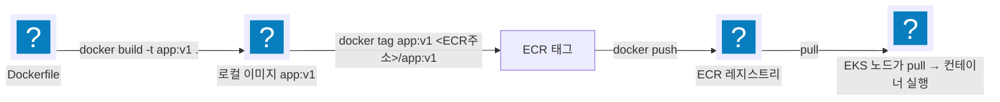

import { Quiz, QuizResults } from 'starlight-quiz/components';
import { Steps, LinkButton } from '@astrojs/starlight/components';

> 문서 유형: explanation

**선수 학습 5/18.** [PART 0 의 컨테이너 실습](/part-0/05-container/)을 했다면 ② 절은 복습이다. 안 했어도 여기서 시작할 수 있다.

## ① 학습 목표

- [ ] 이미지/컨테이너/레지스트리의 관계를 설명할 수 있다
- [ ] Dockerfile의 FROM/COPY/RUN/ENV/ENTRYPOINT를 읽고 쓸 수 있다
- [ ] build → tag → push 흐름을 명령으로 실행할 수 있다
- [ ] ECR 레포 생성·로그인·push를 해봤다
- [ ] 컨테이너가 안 뜰 때 `logs`·`inspect`·`exec` 로 원인을 좁힐 수 있다

## ② 핵심 개념

| 용어 | 한 줄 정의 |
|---|---|
| 이미지 | 실행 환경의 스냅샷 (읽기 전용, 레이어 구조) |
| 컨테이너 | 이미지를 실행한 프로세스 (이미지 1개 → 컨테이너 N개) |
| 레지스트리 | 이미지 저장소 (Docker Hub, **ECR**) |
| 태그 | 이미지 버전 라벨 (`repo:v1`, 생략 시 `latest`) |

Dockerfile 핵심 명령:

```dockerfile title="Dockerfile"
FROM python:3.12-slim        # 베이스 이미지 — 무엇 위에 쌓을지
COPY app.py /app/app.py     # 로컬 파일을 이미지 안으로
RUN pip install flask        # 빌드 시점에 실행 (레이어 생성)
ENV PORT=8080                # 환경 변수
ENTRYPOINT ["python", "/app/app.py"]  # 컨테이너 시작 시 실행할 명령
```

<details class="diagram-note">
<summary>이 블록이 하는 일</summary>

이미지 한 장을 만드는 최소 구성이다. `FROM` 이 바탕 이미지를 정하고, `COPY`·`RUN` 이 각각 레이어를 하나씩 쌓는다. `ENV` 는 컨테이너 실행 시점의 환경 변수를 박아 두고, `ENTRYPOINT` 는 컨테이너가 뜰 때 실행할 명령을 고정한다. `RUN` 은 빌드 시점에, `ENTRYPOINT` 는 실행 시점에 도는 것이 갈리는 지점이다.

</details>

- `RUN`은 **빌드할 때**, `ENTRYPOINT`/`CMD`는 **실행할 때** 동작 — 가장 흔한 혼동.
- 베이스 이미지는 작을수록 좋다: `slim`/`alpine` 계열 우선.



<details class="diagram-note">
<summary>이 도식이 보여주는 것</summary>

Dockerfile 한 장이 EKS 노드에서 도는 컨테이너가 되기까지의 네 단계다. `docker build` 가 로컬 이미지 `app:v1` 을 만들고, `docker tag` 가 그 이미지에 ECR 주소를 붙인 이름을 하나 더 달아 준다. 이름을 바꾸는 것이 아니라 같은 이미지에 이름을 추가하는 것이라 push 할 대상이 생긴다. `docker push` 로 ECR 에 올리면 노드가 그 주소에서 pull 해 실행한다.

</details>

push 3단계 암기: **build → tag(레지스트리 주소 포함) → push**. tag 없이 push하면 Docker Hub로 가려다 실패한다.

## ③ 대회에서 어떻게 쓰이나

- 대회는 로컬이 아니라 **CloudShell에서 빌드**한다. CloudShell 은 AWS 콘솔에서 바로 여는 브라우저 셸이고 자격 증명이 콘솔 로그인 신원으로 이미 잡혀 있다 — 자세한 성질은 [AWS CLI 기초](/start/awscli-basics/)에 있다. 디스크가 작고 세션이 초기화되므로 빌드가 빠르고 이미지가 작아야 한다.
:::danger[베이스 이미지 선택이 채점을 좌우한다]
과제가 지정한 베이스(예: 특정 태그)를 안 쓰면 감점, 큰 이미지는 pull 지연으로 헬스체크 채점에 늦는다.
:::

- 이 내용은 **PART-1 모듈 08(컨테이너 빌드·ECR)** 의 기반이다.

## ④ 미니 실습 (30분)

:::caution[과금 주의]
ECR은 저장 용량 과금(소액). 실습 끝나면 레포까지 삭제한다. Docker Desktop(또는 CloudShell) 필요.
:::

<Steps>

1. **hello 이미지 만들기**

   ```bash
   mkdir hello && cd hello
   cat > Dockerfile <<'EOF'
   FROM alpine:3.20
   ENTRYPOINT ["echo", "hello skills"]
   EOF
   docker build -t hello:v1 .
   docker run --rm hello:v1     # "hello skills" 출력 확인
   ```

   <details class="diagram-note">
   <summary>이 블록이 하는 일</summary>

   heredoc 으로 Dockerfile 을 만들고 바로 빌드·실행해 보는 왕복이다. `<<'EOF'` 처럼 구분자에 따옴표를 붙이면 셸이 안쪽 `$` 를 건드리지 않는다. `docker run --rm` 은 컨테이너가 끝나면 바로 지우므로 `hello skills` 출력만 확인하고 흔적이 남지 않는다.

   </details>

2. **ECR push** (리전 `ap-northeast-2`, `<ACCOUNT_ID>`는 본인 계정)

   ```bash
   aws ecr create-repository --repository-name hello
   aws ecr get-login-password | docker login --username AWS \
     --password-stdin <ACCOUNT_ID>.dkr.ecr.ap-northeast-2.amazonaws.com
   docker tag hello:v1 <ACCOUNT_ID>.dkr.ecr.ap-northeast-2.amazonaws.com/hello:v1
   docker push <ACCOUNT_ID>.dkr.ecr.ap-northeast-2.amazonaws.com/hello:v1
   ```

   <details class="diagram-note">
   <summary>이 블록이 하는 일</summary>

   만든 이미지를 ECR 로 올리는 4단계다. `get-login-password` 가 임시 토큰을 내고 그것을 `docker login` 의 표준 입력으로 넘긴다 — 비밀번호가 명령 이력에 남지 않는 방식이다. 로그인 대상은 레지스트리 주소까지고, `docker tag` 로 리포지토리 경로를 붙인 뒤에야 push 가 된다.

   </details>

3. **콘솔에서 ECR 레포에 이미지가 보이는지 확인**

4. **즉시 삭제**

   ```bash
   aws ecr delete-repository --repository-name hello --force
   ```

</Steps>

## ⑤ 심화 개념 (응용력 기르기)

### 컨테이너가 안 뜨면 안을 본다

push 한 뒤 클러스터에서 터지면 원인 찾기가 몇 배로 비싸다. 로컬에서 한 번 돌려 보고 올린다.

```bash
docker run -d --name web app:v1
docker ps -a                  # ① 살아 있나, 몇 초 만에 죽었나
docker logs web               # ② 앱이 남긴 출력과 오류
docker inspect web            # ③ 포트·마운트·환경 변수의 실제 값
docker exec -it web sh        # ④ 컨테이너 안에서 직접 확인
docker rm -f web              # ⑤ 정리
```

<details class="diagram-note">
<summary>이 블록이 하는 일</summary>

컨테이너 하나를 띄워 놓고 바깥에서 안으로 좁혀 들어가는 순서다. `-d` 는 백그라운드 실행이라 셸이 바로 돌아온다. `ps -a` 로 상태를 보고, `logs` 로 앱이 뭐라고 하다 죽었는지 읽고, `inspect` 로 매니페스트가 아니라 **실제로 들어간 값**을 확인한다. 그래도 모르면 `exec` 로 안에 들어가 파일과 환경 변수를 직접 본다. `rm -f` 는 실행 중이어도 멈추고 지운다.

</details>

`docker ps` 는 실행 중인 것만 낸다. `-a` 를 붙여야 종료된 컨테이너가 나오고 `STATUS` 열에 종료 코드가 찍힌다. 뜨자마자 죽은 컨테이너는 여기서만 보인다.

`docker exec` 는 이미지 안에 셸이 있어야 된다. 셸을 빼고 만든 최소 이미지에서는 실패한다. 그럴 때는 `logs` 와 `inspect` 로만 좁힌다.

### 포트 게시 — `-p 호스트포트:컨테이너포트`

컨테이너 안의 포트는 호스트에서 바로 닿지 않는다. `-p` 가 그 둘을 잇는다.

```bash
docker run -d --name web -p 8080:8080 app:v1
curl http://localhost:8080/healthz
```

앞이 호스트 포트, 뒤가 컨테이너 포트다. 호스트 8080 이 이미 차 있으면 앞자리만 바꾼다.

Dockerfile 의 `EXPOSE` 는 "이 컨테이너는 이 포트를 쓴다"는 표시일 뿐이다. 그 줄만으로는 호스트에서 닿지 않는다 — 실제 연결은 `-p` 가 만든다.

이 왕복이 값을 하는 지점은 헬스체크다. 파드가 Ready 가 되지 않는 원인의 상당수는 앱이 기대한 경로·포트로 응답하지 않는 것이고, push 전에 `curl` 한 번으로 갈린다.

### `.dockerignore` — 빌드 컨텍스트에서 뺀다

`docker build` 는 명령 끝의 경로(대개 `.`) 아래를 통째로 Docker 데몬에 보낸다. 이 묶음이 **빌드 컨텍스트**다. `.dockerignore` 파일에 적은 경로는 그 묶음에서 빠진다.

```text title=".dockerignore"
.git
.terraform
*.tfstate
.env
node_modules
```

세 가지가 달라진다.

- **전송량이 준다.** `.git` 과 `.terraform` 은 소스보다 큰 경우가 많다. CloudShell 처럼 디스크가 좁은 곳에서 체감된다.
- **캐시가 덜 깨진다.** `COPY . .` 은 컨텍스트가 한 글자라도 바뀌면 그 레이어부터 다시 만든다. 빌드와 무관한 파일이 캐시를 깨뜨리지 않게 막는다.
- **자격 증명이 이미지에 안 들어간다.** `.env` 나 `*.tfstate` 가 `COPY . .` 에 딸려 가면 레이어에 남는다. [PART 0 컨테이너 이론](/part-0/05-container/theory/)에서 본 대로 다음 레이어에서 지워도 앞 레이어에는 그대로 있다.

### 디스크가 차면 정리한다

빌드를 반복하면 레이어와 캐시가 쌓인다. CloudShell 은 디스크가 작아 몇 번 돌리면 `no space left on device` 가 난다.

```bash
docker system df              # 이미지·컨테이너·캐시가 각각 얼마를 쓰나
docker system prune           # 멈춘 컨테이너, 안 쓰는 네트워크, 이름 없는 이미지
docker system prune -a        # 컨테이너가 쓰지 않는 이미지까지 전부
```

`prune` 은 지울 목록을 알리고 한 번 확인을 묻는다. `-a` 는 방금 빌드한 이미지도 대상에 넣으므로 push 를 마친 뒤에 쓴다.

## ⑥ 자기 점검 퀴즈

<Quiz title="RUN vs ENTRYPOINT 실행 시점">
`RUN pip install flask` 와 `ENTRYPOINT ["python", "app.py"]` 는 각각 언제 실행되나?

- [x] RUN은 이미지 **빌드 시점**, ENTRYPOINT는 컨테이너 **시작 시점**
- [ ] RUN은 컨테이너 시작 시점, ENTRYPOINT는 이미지 빌드 시점
  > 정확히 반대다. RUN이 만든 결과물(설치된 패키지)이 이미지 레이어로 굳어 있어야 컨테이너가 그걸 쓸 수 있다.
- [ ] 둘 다 컨테이너 시작 시점에 RUN → ENTRYPOINT 순서로 실행된다
  > 이 오해대로라면 `docker run` 할 때마다 `pip install`이 돌아 기동이 수십 초씩 느려진다. RUN은 빌드 때 딱 한 번이다.
- [ ] RUN은 빌드 시점, ENTRYPOINT는 빌드 마지막 레이어에서 한 번 실행되어 결과가 이미지에 저장된다

`RUN`은 **빌드할 때** 실행되어 새 레이어를 만들고, `ENTRYPOINT`/`CMD`는 이미지에 "시작 명령"으로 **기록만** 되었다가 컨테이너가 뜰 때 실행된다. 가장 흔한 혼동 지점이다.
</Quiz>

<Quiz title="ECR push 3단계">
로컬 이미지 `app:v1` 을 ECR에 올릴 때 올바른 순서는?

- [x] `docker build` → `docker tag` (ECR 주소 포함) → `docker push`
- [ ] `docker login` → `docker build` → `docker push` (태그는 그대로 `app:v1`)
  > 가장 흔한 실패다. ECR 주소 없이 push하면 Docker Hub의 `app` 레포로 가려다 인증/권한 오류가 난다. 로그인은 필요하지만 **tag 단계를 대체하지 못한다**.
- [ ] `docker build` → `docker push` → `docker tag`
- [ ] `docker tag` → `docker build` → `docker push`
  > 태그할 원본 이미지가 아직 없다. tag는 존재하는 이미지에 이름표를 하나 더 붙이는 동작이다.

**build → tag(레지스트리 주소 포함) → push.** 태그는 `<ACCOUNT_ID>.dkr.ecr.ap-northeast-2.amazonaws.com/hello:v1` 형태여야 하고, push 전에 `aws ecr get-login-password | docker login --username AWS --password-stdin <ACCOUNT_ID>.dkr.ecr.ap-northeast-2.amazonaws.com` 로 로그인해 둔다. 레지스트리 주소는 **태그에 박히는 것**이지 push 옵션이 아니다.
</Quiz>

<Quiz title="큰 베이스 이미지의 대가">
대회에서 베이스 이미지를 크게 잡으면 생기는 **실질적** 불이익을 모두 고르시오.

- [x] CloudShell의 작은 디스크와 느린 빌드로 시간을 소모한다
- [x] 노드의 이미지 pull이 지연되어 파드 기동·헬스체크 채점이 늦거나 실패한다
- [ ] ECR이 이미지 크기 제한을 초과했다며 push를 거부한다
  > 그런 실무적 크기 제한에 걸릴 일은 없다. 손해는 "거부"가 아니라 **시간**으로 온다 — 그래서 더 늦게 알아차린다.
- [ ] 이미지가 크면 ECR 취약점 스캔이 실패해 pull 불가 상태가 된다
  > 스캔 결과는 pull을 막지 않는다. 스캔은 정보 제공일 뿐이다.

불이익은 전부 **시간**으로 나타난다. ① CloudShell은 디스크가 작고 세션이 초기화되므로 큰 빌드는 그 자체로 손해다. ② pull이 늦으면 파드가 Ready가 되기 전에 채점이 지나간다. `slim`/`alpine` 계열을 쓰되, 과제가 베이스 이미지를 지정했다면 **지정된 것을 그대로** 쓴다(임의 변경은 감점).
</Quiz>

<QuizResults confetti />

## ⑦ 다음 단계

모듈 08(컨테이너 빌드·ECR)에서 이 흐름을 대회 스택에 맞춰 실습한다.

<LinkButton href="/start/shell-basics/" icon="right-arrow">다음 선수 학습 — 셸 기초</LinkButton>
<LinkButton href="/part-1/06-terraform-vpc/" variant="minimal">PART 1 — Foundation·IaC</LinkButton>

## 공식 문서

- [Dockerfile 레퍼런스](https://docs.docker.com/reference/dockerfile/) — 명령별 정확한 동작
- [docker CLI 레퍼런스](https://docs.docker.com/reference/cli/docker/) — build·tag·push 옵션
- [ECR에 이미지 push](https://docs.aws.amazon.com/AmazonECR/latest/userguide/docker-push-ecr-image.html) — 로그인·태그 규칙
- [빌드 컨텍스트](https://docs.docker.com/build/concepts/context/) — `.dockerignore` 문법과 컨텍스트 범위
- [사용하지 않는 객체 정리](https://docs.docker.com/engine/manage-resources/pruning/) — `prune` 이 지우는 대상
