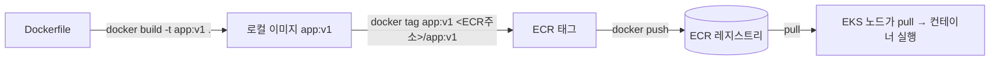

import { Quiz, QuizResults } from 'starlight-quiz/components';

> 문서 유형: explanation

## ① 학습 목표

- [ ] 이미지/컨테이너/레지스트리의 관계를 설명할 수 있다
- [ ] Dockerfile의 FROM/COPY/RUN/ENV/ENTRYPOINT를 읽고 쓸 수 있다
- [ ] build → tag → push 흐름을 명령으로 실행할 수 있다
- [ ] ECR 레포 생성·로그인·push를 해봤다

## ② 핵심 개념

| 용어 | 한 줄 정의 |
|---|---|
| 이미지 | 실행 환경의 스냅샷 (읽기 전용, 레이어 구조) |
| 컨테이너 | 이미지를 실행한 프로세스 (이미지 1개 → 컨테이너 N개) |
| 레지스트리 | 이미지 저장소 (Docker Hub, **ECR**) |
| 태그 | 이미지 버전 라벨 (`repo:v1`, 생략 시 `latest`) |

Dockerfile 핵심 명령:

```dockerfile
FROM python:3.12-slim        # 베이스 이미지 — 무엇 위에 쌓을지
COPY app.py /app/app.py     # 로컬 파일을 이미지 안으로
RUN pip install flask        # 빌드 시점에 실행 (레이어 생성)
ENV PORT=8080                # 환경 변수
ENTRYPOINT ["python", "/app/app.py"]  # 컨테이너 시작 시 실행할 명령
```

- `RUN`은 **빌드할 때**, `ENTRYPOINT`/`CMD`는 **실행할 때** 동작 — 가장 흔한 혼동.
- 베이스 이미지는 작을수록 좋다: `slim`/`alpine` 계열 우선.



push 3단계 암기: **build → tag(레지스트리 주소 포함) → push**. tag 없이 push하면 Docker Hub로 가려다 실패한다.

## ③ 대회에서 어떻게 쓰이나

- 대회는 로컬이 아니라 **CloudShell에서 빌드**한다. CloudShell은 디스크가 작고 세션이 초기화되므로 빌드가 빠르고 이미지가 작아야 한다.
- **베이스 이미지 선택이 채점을 좌우한다**: 과제가 지정한 베이스(예: 특정 태그)를 안 쓰면 감점, 큰 이미지는 pull 지연으로 헬스체크 채점에 늦는다.
- 이 내용은 **PART-1 모듈 03(컨테이너 빌드·ECR)** 의 기반이다.

## ④ 미니 실습 (30분)

> ⚠️ ECR은 저장 용량 과금(소액). 실습 끝나면 레포까지 삭제한다. Docker Desktop(또는 CloudShell) 필요.

1. hello 이미지 만들기:

```bash
mkdir hello && cd hello
cat > Dockerfile <<'EOF'
FROM alpine:3.20
ENTRYPOINT ["echo", "hello skills"]
EOF
docker build -t hello:v1 .
docker run --rm hello:v1     # "hello skills" 출력 확인
```

2. ECR push (리전 `ap-northeast-2`, `<ACCOUNT_ID>`는 본인 계정):

```bash
aws ecr create-repository --repository-name hello
aws ecr get-login-password | docker login --username AWS \
  --password-stdin <ACCOUNT_ID>.dkr.ecr.ap-northeast-2.amazonaws.com
docker tag hello:v1 <ACCOUNT_ID>.dkr.ecr.ap-northeast-2.amazonaws.com/hello:v1
docker push <ACCOUNT_ID>.dkr.ecr.ap-northeast-2.amazonaws.com/hello:v1
```

3. 콘솔에서 ECR 레포에 이미지가 보이는지 확인.
4. **즉시 삭제**:

```bash
aws ecr delete-repository --repository-name hello --force
```

## ⑤ 자기 점검 퀴즈

<Quiz title="RUN vs ENTRYPOINT 실행 시점">
`RUN pip install flask` 와 `ENTRYPOINT ["python", "app.py"]` 는 각각 언제 실행되나?

- [x] RUN은 이미지 **빌드 시점**, ENTRYPOINT는 컨테이너 **시작 시점**
- [ ] RUN은 컨테이너 시작 시점, ENTRYPOINT는 이미지 빌드 시점
  > 정확히 반대다. RUN이 만든 결과물(설치된 패키지)이 이미지 레이어로 굳어 있어야 컨테이너가 그걸 쓸 수 있다.
- [ ] 둘 다 컨테이너 시작 시점에 RUN → ENTRYPOINT 순서로 실행된다
  > 이 오해대로라면 `docker run` 할 때마다 `pip install`이 돌아 기동이 수십 초씩 느려진다. RUN은 빌드 때 딱 한 번이다.
- [ ] RUN은 빌드 시점, ENTRYPOINT는 빌드 마지막 레이어에서 한 번 실행되어 결과가 이미지에 저장된다

`RUN`은 **빌드할 때** 실행되어 새 레이어를 만들고, `ENTRYPOINT`/`CMD`는 이미지에 "시작 명령"으로 **기록만** 되었다가 컨테이너가 뜰 때 실행된다. 가장 흔한 혼동 지점이다.
</Quiz>

<Quiz title="ECR push 3단계">
로컬 이미지 `app:v1` 을 ECR에 올릴 때 올바른 순서는?

- [x] `docker build` → `docker tag` (ECR 주소 포함) → `docker push`
- [ ] `docker login` → `docker build` → `docker push` (태그는 그대로 `app:v1`)
  > 가장 흔한 실패다. ECR 주소 없이 push하면 Docker Hub의 `app` 레포로 가려다 인증/권한 오류가 난다. 로그인은 필요하지만 **tag 단계를 대체하지 못한다**.
- [ ] `docker build` → `docker push` → `docker tag`
- [ ] `docker tag` → `docker build` → `docker push`
  > 태그할 원본 이미지가 아직 없다. tag는 존재하는 이미지에 이름표를 하나 더 붙이는 동작이다.

**build → tag(레지스트리 주소 포함) → push.** 태그는 `<ACCOUNT_ID>.dkr.ecr.ap-northeast-2.amazonaws.com/hello:v1` 형태여야 하고, push 전에 `aws ecr get-login-password | docker login --username AWS --password-stdin <ACCOUNT_ID>.dkr.ecr.ap-northeast-2.amazonaws.com` 로 로그인해 둔다. 레지스트리 주소는 **태그에 박히는 것**이지 push 옵션이 아니다.
</Quiz>

<Quiz title="큰 베이스 이미지의 대가">
대회에서 베이스 이미지를 크게 잡으면 생기는 **실질적** 불이익을 모두 고르시오.

- [x] CloudShell의 작은 디스크와 느린 빌드로 시간을 소모한다
- [x] 노드의 이미지 pull이 지연되어 파드 기동·헬스체크 채점이 늦거나 실패한다
- [ ] ECR이 이미지 크기 제한을 초과했다며 push를 거부한다
  > 그런 실무적 크기 제한에 걸릴 일은 없다. 손해는 "거부"가 아니라 **시간**으로 온다 — 그래서 더 늦게 알아차린다.
- [ ] 이미지가 크면 ECR 취약점 스캔이 실패해 pull 불가 상태가 된다
  > 스캔 결과는 pull을 막지 않는다. 스캔은 정보 제공일 뿐이다.

불이익은 전부 **시간**으로 나타난다. ① CloudShell은 디스크가 작고 세션이 초기화되므로 큰 빌드는 그 자체로 손해다. ② pull이 늦으면 파드가 Ready가 되기 전에 채점이 지나간다. `slim`/`alpine` 계열을 쓰되, 과제가 베이스 이미지를 지정했다면 **지정된 것을 그대로** 쓴다(임의 변경은 감점).
</Quiz>

<QuizResults confetti />

## ⑥ 다음 단계

- [../PART-1-Foundation-IaC/](/part-1/01-terraform-vpc/) — 모듈 03 컨테이너 빌드·ECR
- 다음 선수 학습: [shell-basics.md](/start/shell-basics/)

## 공식 문서

- [Dockerfile 레퍼런스](https://docs.docker.com/reference/dockerfile/) — 명령별 정확한 동작
- [docker CLI 레퍼런스](https://docs.docker.com/reference/cli/docker/) — build·tag·push 옵션
- [ECR에 이미지 push](https://docs.aws.amazon.com/AmazonECR/latest/userguide/docker-push-ecr-image.html) — 로그인·태그 규칙
