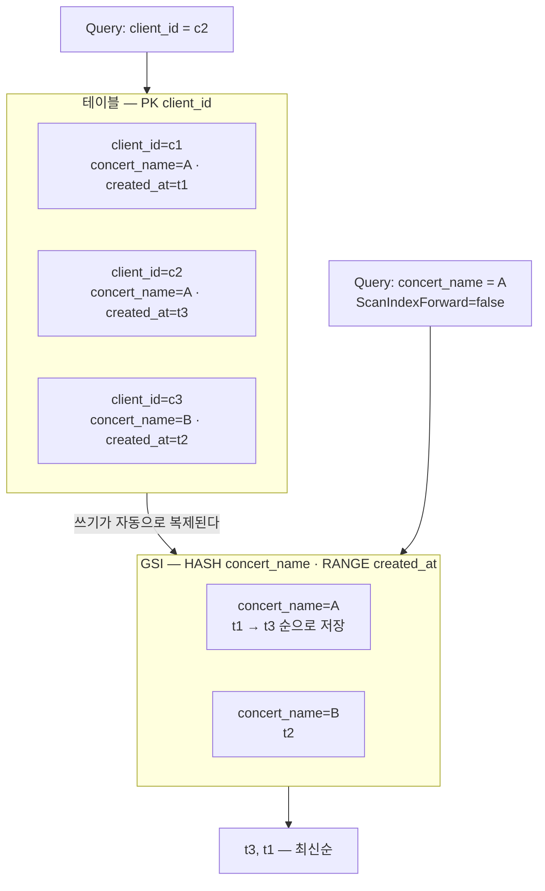

import { Quiz, QuizResults } from 'starlight-quiz/components';
import { LinkButton } from '@astrojs/starlight/components';

> 문서 유형: explanation

## ① 학습 목표

- [ ] 테이블·항목·속성이 각각 무엇인지 한 문장씩 설명할 수 있다
- [ ] 파티션 키와 정렬 키가 하는 일이 서로 다르다는 것을 설명할 수 있다
- [ ] 기본 키 밖의 축으로 조회해야 할 때 GSI 가 필요한 이유를 설명할 수 있다
- [ ] Query 와 Scan 의 차이를 읽는 범위와 비용으로 구분할 수 있다
- [ ] `PAY_PER_REQUEST` 와 프로비저닝 모드가 무엇을 다르게 하는지 안다
- [ ] boto3 로 숫자를 저장할 때 `Decimal` 이 필요한 이유를 안다

## ② 핵심 개념

### 2-1. 테이블·항목·속성

DynamoDB 는 **키-값 데이터베이스**다. 테이블은 있지만 그 안에 들어갈 열을 미리 정해 두지 않는다.

| 용어 | 한 줄 정의 |
|---|---|
| 테이블(Table) | 항목을 담는 그릇. 이름은 리전 안에서 고유하다 |
| 항목(Item) | 값들의 한 묶음. 항목 하나의 크기 상한은 400KB 다 |
| 속성(Attribute) | 항목 안의 이름-값 쌍 |

**키로 쓰는 속성만 테이블 정의에 적는다.** 나머지 속성은 선언 없이 그때그때 넣는다. 같은 테이블 안의 두 항목이 서로 다른 속성을 가져도 문제가 없다. 이 성질을 스키마리스라고 부른다.

### 2-2. 기본 키 — 파티션 키와 정렬 키

항목 하나를 식별하는 키를 **기본 키(Primary key)** 라고 한다. 형태가 둘이다.

- **파티션 키만 있는 형태.** 파티션 키(Partition key) 값 하나가 항목 하나를 가리킨다. 값이 겹칠 수 없다.
- **파티션 키 + 정렬 키 형태.** 두 값을 합친 쌍이 항목을 가리킨다. 같은 파티션 키를 가진 항목이 여럿 있을 수 있고, 그것들이 정렬 키(Sort key) 순서로 저장된다.

이름이 하는 일을 그대로 담고 있다. 파티션 키는 DynamoDB 가 항목을 **어느 물리 파티션에 둘지** 정하는 데 쓰고, 정렬 키는 같은 파티션 안에서 **어떤 순서로 늘어놓을지** 정하는 데 쓴다. 정렬 키가 있어야 "최근 것부터" 같은 범위 조회가 성립한다.

Terraform 과 AWS API 는 두 키를 `HASH`·`RANGE` 라고 부른다. 콘솔의 파티션 키가 `HASH`, 정렬 키가 `RANGE` 다. 같은 것을 두 이름으로 부르는 자리라 문서를 옮겨 읽을 때 걸린다.

### 2-3. GSI — 기본 키 밖의 축으로 조회하기

기본 키로 조회할 수 없는 질문이 반드시 생긴다. 예매 테이블의 기본 키가 `client_id` 라면 "이 사람의 예매"는 바로 찾지만 "이 공연의 예매를 최신순으로"는 찾을 방법이 없다.

**GSI(Global Secondary Index, 전역 보조 인덱스)** 가 그 자리를 메운다. GSI 는 **다른 키 조합으로 같은 항목들을 한 벌 더 저장해 둔 사본**이다. 테이블에 쓰기가 일어나면 DynamoDB 가 GSI 쪽 사본도 자동으로 갱신한다.



<details class="diagram-note">
<summary>이 도식이 보여주는 것</summary>

같은 항목 세 개가 두 벌로 저장돼 있다. 위쪽 테이블은 `client_id` 로 묶여 있어 사람 단위 조회만 되고, 아래쪽 GSI 는 같은 항목을 `concert_name` 으로 묶고 `created_at` 순으로 늘어놓았다. 그래서 "공연 A 의 예매를 최신순으로"라는 질문이 GSI 쪽에서는 Query 한 번으로 끝난다. `ScanIndexForward=false` 는 정렬 키의 저장 순서를 거꾸로 읽으라는 뜻이다 — 정렬을 애플리케이션이 아니라 데이터베이스가 한다.

</details>

GSI 는 새 축을 얻는 대신 저장 공간과 쓰기 비용을 한 벌 더 낸다. 조회 패턴이 늘어날 때마다 인덱스를 무한정 추가하지 않고, **실제로 요구된 질문에만** 만든다.

### 2-4. Query 와 Scan

읽기 API 가 둘이고, 이름은 비슷하지만 읽는 범위가 완전히 다르다.

| 항목 | Query | Scan |
|---|---|---|
| 읽는 범위 | 파티션 키가 일치하는 항목만 | 테이블 전체 |
| 필수 조건 | 파티션 키 등호 조건 | 없다 |
| 정렬 | 정렬 키 순서로 나온다 | 순서 보장 없음 |
| 비용 | 읽은 항목만큼 | 테이블 크기만큼 |

Scan 은 조건을 붙여도 **먼저 전부 읽고 그다음에 걸러 낸다.** 필터가 줄이는 것은 돌려받는 결과의 개수이지 읽은 양이 아니다. 테이블이 커질수록 그대로 비용과 지연이 된다.

그래서 규칙은 하나다. **조회 패턴을 먼저 정하고, 그 패턴이 Query 로 풀리도록 키와 GSI 를 설계한다.** Scan 을 쓰게 됐다면 대개 설계가 조회 패턴을 못 따라간 것이다.

### 2-5. 과금 모드

테이블을 만들 때 읽기·쓰기 용량을 어떻게 낼지 고른다.

| 모드 | 어떻게 과금하나 | 언제 고르나 |
|---|---|---|
| `PAY_PER_REQUEST` (온디맨드) | 실제 읽기·쓰기 요청 건수만큼 | 트래픽을 예측할 수 없을 때. 대회·실습의 기본 선택 |
| `PROVISIONED` (프로비저닝) | 초당 용량 단위를 미리 사 두고 그만큼 | 부하가 일정하고 예측 가능할 때 |

프로비저닝 모드는 사 둔 용량을 넘는 순간 `ProvisionedThroughputExceededException` 으로 요청이 거부된다. 실습에서 이 벽에 시간을 쓸 이유가 없으므로 `PAY_PER_REQUEST` 를 쓴다.

## ③ 대회에서 어떻게 쓰이나

1과제 set-02 유형은 예매 테이블 하나에 요구를 겹겹이 쌓는다. 정답지(`set-02/task-1/terraform/dynamodb.tf`)의 실측 구성이 이렇다.

- 기본 키는 `client_id` 하나 — 항목을 사람 단위로 식별한다
- GSI `concert_name-created_at-index` — HASH `concert_name`, RANGE `created_at`, 프로젝션 `ALL`
- `billing_mode = "PAY_PER_REQUEST"`
- SSE 를 지정 KMS 키로 켠다 — 채점이 키를 별칭으로 역조회한다
- PITR 과 삭제방지를 각각 켠다 — PITR(Point-in-Time Recovery)은 최근 35일 안의 원하는 시점으로 테이블을 되돌리는 기능이고, 삭제방지는 테이블 삭제 API 자체를 거부하게 만드는 설정이다

:::danger[채점이 보는 것은 "데이터베이스 레벨 정렬"이다]
요구가 "공연별 예매를 데이터베이스 레벨 최신순으로 조회"다. Scan 으로 전부 읽고 파이썬에서 `sort()` 하면 결과는 같아도 요구 위반이다. GSI 의 정렬 키를 `ScanIndexForward=False` 로 거꾸로 읽어야 충족한다.
:::

삭제방지는 정리할 때 걸린다. `deletion_protection_enabled = true` 인 테이블은 `terraform destroy` 가 실패하므로, 먼저 그 값을 끄고 적용한 뒤 destroy 한다.

## ④ 핵심 코드 패턴

### 1. 테이블 정의 — 키로 쓰는 속성만 선언한다

```hcl title="dynamodb.tf"
resource "aws_dynamodb_table" "data" {
  name                        = var.table_name
  billing_mode                = "PAY_PER_REQUEST"
  hash_key                    = "client_id"
  deletion_protection_enabled = true

  attribute {
    name = "client_id"
    type = "S"
  }
  attribute {
    name = "concert_name"
    type = "S"
  }
  attribute {
    name = "created_at"
    type = "S"
  }

  global_secondary_index {
    name = "concert_name-created_at-index"

    key_schema {
      attribute_name = "concert_name"
      key_type       = "HASH"
    }
    key_schema {
      attribute_name = "created_at"
      key_type       = "RANGE"
    }

    projection_type = "ALL"
  }

  point_in_time_recovery {
    enabled = true
  }
}
```

<details class="diagram-note">
<summary>이 블록이 하는 일</summary>

테이블 한 벌의 정의다. `attribute` 블록에 적힌 셋은 전부 키로 쓰이는 속성이다 — 예매자 이름이나 이메일 같은 나머지 필드는 스키마리스라 선언하지 않는다. GSI 는 `concert_name` 을 HASH, `created_at` 을 RANGE 로 두어 정렬 축을 만들고, `projection_type = "ALL"` 로 항목의 모든 필드를 사본에 함께 담는다. 프로젝션을 좁히면 저장 비용은 줄지만 빠진 필드를 읽을 때 원본 테이블을 한 번 더 읽으러 간다.

</details>

Terraform 리소스 인자는 [`aws_dynamodb_table` 문서](https://registry.terraform.io/providers/hashicorp/aws/latest/docs/resources/dynamodb_table)에서 확인한다.

### 2. boto3 로 GSI 를 Query 한다

```python
import boto3
from boto3.dynamodb.conditions import Key

table = boto3.resource("dynamodb").Table(TABLE_NAME)

result = table.query(
    IndexName="concert_name-created_at-index",
    KeyConditionExpression=Key("concert_name").eq(concert),
    ScanIndexForward=False,   # 정렬 키를 거꾸로 읽는다 = 최신순
    Limit=20,
)
items = result["Items"]
```

<details class="diagram-note">
<summary>이 블록이 하는 일</summary>

GSI 를 대상으로 하는 Query 다. `IndexName` 을 주지 않으면 테이블 본체를 조회하므로 GSI 를 쓰겠다는 선언이 여기 한 줄이다. `KeyConditionExpression` 에는 파티션 키의 등호 조건이 반드시 들어간다 — 이 조건이 없으면 Query 가 아니라 Scan 을 써야 한다. `ScanIndexForward=False` 가 정렬을 데이터베이스 쪽에서 끝내므로 파이썬에서 다시 정렬할 일이 없다.

</details>

## ⑤ 심화 개념

### 숫자는 `Decimal` 로 오간다

DynamoDB 의 숫자 타입은 파이썬 `float` 와 표현 방식이 다르다. boto3 는 그 차이를 조용히 반올림하는 대신 **저장을 거부**한다.

```text
TypeError: Float types are not supported. Use Decimal types instead.
```

값이 어긋나서가 아니라 저장 단계에서 예외로 죽는다. 계산도 저장도 `Decimal` 로 한다.

```python
from decimal import Decimal

average = Decimal(str(sum(scores.values()))) / Decimal("5")
item["average"] = average
```

`Decimal(str(x))` 처럼 문자열을 거치는 것이 요령이다. `Decimal(0.1)` 은 float 의 오차를 그대로 물려받지만 `Decimal("0.1")` 은 정확히 0.1 이다.

반대 방향에도 함정이 있다. 읽어 온 항목을 `json.dumps` 로 직렬화하면 `Decimal` 을 몰라서 `TypeError` 가 난다. `json.dumps(items, default=str)` 로 문자열 변환을 붙여 준다.

### 프로젝션 — GSI 에 무엇을 복제할지

GSI 사본에 담을 속성 범위를 고른다.

| 프로젝션 | 담는 것 | 대가 |
|---|---|---|
| `ALL` | 항목의 모든 속성 | 저장 비용이 두 배에 가깝다. 조회는 한 번에 끝난다 |
| `KEYS_ONLY` | 키 속성만 | 가장 싸다. 다른 필드가 필요하면 테이블을 다시 읽는다 |
| `INCLUDE` | 키 + 지정한 속성 | 필요한 것만 고른다 |

대회 과제는 조회 결과에 여러 필드를 요구하므로 `ALL` 이 안전하다. 프로젝션에 없는 속성을 읽으면 추가 읽기가 조용히 일어나 응답이 느려진다.

### GSI 는 최종적 일관성이다

테이블 본체는 강한 일관성 읽기를 고를 수 있지만 **GSI 는 언제나 최종적 일관성**이다. 방금 쓴 항목이 GSI 조회에는 잠깐 안 보일 수 있다. 쓰기 직후 바로 검증하는 스크립트가 간헐적으로 실패한다면 이 지연을 의심한다.

### 트러블슈팅 사례

| 증상 | 원인 | 확인·대응 |
|---|---|---|
| `TypeError: Float types are not supported` | 숫자를 `float` 로 넣었다 | `Decimal(str(값))` 으로 바꾼다 |
| `json.dumps` 가 `Decimal` 에서 실패한다 | 직렬화기가 `Decimal` 을 모른다 | `default=str` 을 준다 |
| Query 가 `ValidationException` 을 낸다 | 파티션 키 등호 조건이 빠졌다 | `KeyConditionExpression` 에 `Key(...).eq(...)` 를 넣는다 |
| GSI 를 만들었는데 결과가 비어 있다 | `IndexName` 을 주지 않아 테이블 본체를 조회했다 | `query(IndexName=...)` 확인 |
| 방금 쓴 항목이 GSI 조회에 없다 | GSI 는 최종적 일관성이다 | 잠시 뒤 다시 조회 |
| `terraform destroy` 가 테이블에서 멈춘다 | 삭제방지가 켜져 있다 | `deletion_protection_enabled = false` 로 적용한 뒤 destroy |

## ⑥ 자기 점검 퀴즈

<Quiz title="GSI가 필요한 순간">
기본 키가 `client_id` 인 예매 테이블에서 "공연 A 의 예매를 최신순으로" 조회해야 한다. 옳은 설계는?

- [x] `concert_name` 을 HASH, `created_at` 을 RANGE 로 하는 GSI 를 만들고 그 인덱스를 Query 한다
- [ ] Scan 으로 전부 읽고 파이썬에서 `sorted()` 로 정렬한다
  > 결과는 같아 보이지만 읽은 양은 테이블 전체다. 요구가 "데이터베이스 레벨 정렬"이면 이 방식은 요구 위반이기도 하다.
- [ ] 테이블 기본 키를 `concert_name` + `created_at` 로 바꾼다
  > 그러면 사람 단위 조회가 사라진다. 기본 키는 항목을 식별하는 축이고, 다른 축의 조회는 키를 바꾸는 것이 아니라 GSI 로 푸는 것이 DynamoDB 설계다.
- [ ] Scan 에 `FilterExpression` 으로 `concert_name` 조건을 준다
  > 필터는 전부 읽은 뒤에 걸러 낸다. 줄어드는 것은 돌려받는 결과 수이지 읽은 양이 아니다.

DynamoDB 는 조회 패턴을 먼저 정하고 그 패턴이 Query 로 풀리게 키를 설계한다. 기본 키로 답할 수 없는 질문이 생기면 GSI 를 만들어 **다른 키 조합의 사본**을 하나 더 둔다. 쓰기는 자동으로 복제되므로 애플리케이션이 두 곳에 넣을 일은 없다.
</Quiz>

<Quiz title="Query와 Scan의 비용">
Query 와 Scan 에 대한 설명으로 옳은 것을 **모두** 고르시오.

- [x] Query 는 파티션 키의 등호 조건이 반드시 필요하다
- [x] Scan 의 `FilterExpression` 은 읽은 양을 줄이지 못한다
- [ ] Scan 도 정렬 키 순서로 결과를 돌려준다
  > 순서 보장이 없다. 정렬은 파티션 키가 정해진 뒤에야 성립하므로 Query 쪽 성질이다.
- [ ] 항목이 적으면 Query 와 Scan 의 비용이 같으므로 아무거나 쓴다
  > 지금 적어도 데이터는 늘어난다. Scan 은 테이블 크기에 비례하므로 시간이 갈수록 벌어진다.

Query 는 **파티션 키로 좁힌 뒤 그 안에서만** 읽고, Scan 은 **전부 읽고 나서 거른다.** 이 차이가 비용과 지연을 가른다. 설계 단계에서 Scan 이 필요해졌다면 조회 패턴에 맞는 키나 GSI 가 빠진 것이다.
</Quiz>

<Quiz title="ScanIndexForward가 하는 일">
GSI Query 에서 최신순 결과를 얻으려면 `ScanIndexForward` 를 [[False]] 로 준다.

---

`ScanIndexForward` 는 **정렬 키의 저장 순서를 어느 방향으로 읽을지** 정한다. 기본값 `True` 는 오름차순, `False` 는 내림차순이다. `created_at` 을 정렬 키로 뒀다면 `False` 가 곧 최신순이다. 이름에 `Scan` 이 들어가지만 Scan API 와는 무관하고, Query 에서 인덱스를 읽는 방향을 가리킨다. 정렬을 애플리케이션이 아니라 데이터베이스가 끝내므로 "데이터베이스 레벨 정렬" 요구를 이 인자 하나가 충족한다.
</Quiz>

<Quiz title="boto3 Decimal 함정">
DynamoDB 항목에 파이썬 `float` 값을 넣으면 어떻게 되나?

- [x] boto3 가 `TypeError: Float types are not supported` 로 저장을 거부한다
- [ ] 값이 반올림되어 저장된다
  > 조용히 값이 바뀌는 것이 아니라 예외로 죽는다. 그래서 오히려 발견하기 쉽다.
- [ ] 문자열로 자동 변환되어 저장된다
  > 자동 변환은 없다. 숫자 타입으로 넣으려면 `Decimal` 이어야 한다.
- [ ] 저장은 되지만 Query 조건에서 매칭되지 않는다

숫자는 넣을 때도 계산할 때도 `Decimal` 로 다룬다. `Decimal(str(x))` 처럼 문자열을 거쳐 만들어야 float 의 오차를 물려받지 않는다. 반대로 읽어 온 항목을 `json.dumps` 로 직렬화할 때는 `Decimal` 을 모르는 직렬화기가 `TypeError` 를 내므로 `default=str` 을 붙인다. 저장과 응답 양쪽에서 한 번씩 걸리는 함정이다.
</Quiz>

<QuizResults confetti />

## ⑦ 다음 단계

PART-1 모듈 08 에서 이 테이블을 Terraform 으로 만들고 Lambda 로 조회한다. 그 전에 클러스터 쪽 기초가 하나 남았다.

<LinkButton href="/start/k8s-basics/" icon="right-arrow">다음 선수 학습 — Kubernetes 기초</LinkButton>
<LinkButton href="/part-1/08-container-lambda-dynamodb/" variant="minimal">PART 1 — ECR·Lambda·DynamoDB</LinkButton>

## 공식 문서

- [DynamoDB 개발자 안내서](https://docs.aws.amazon.com/amazondynamodb/latest/developerguide/) — 키 설계·인덱스·PITR 원문
- [보조 인덱스](https://docs.aws.amazon.com/amazondynamodb/latest/developerguide/SecondaryIndexes.html) — GSI 와 LSI 의 차이, 프로젝션
- [boto3 DynamoDB 레퍼런스](https://boto3.amazonaws.com/v1/documentation/api/latest/reference/services/dynamodb.html) — `Query` 인자와 `Decimal` 타입
