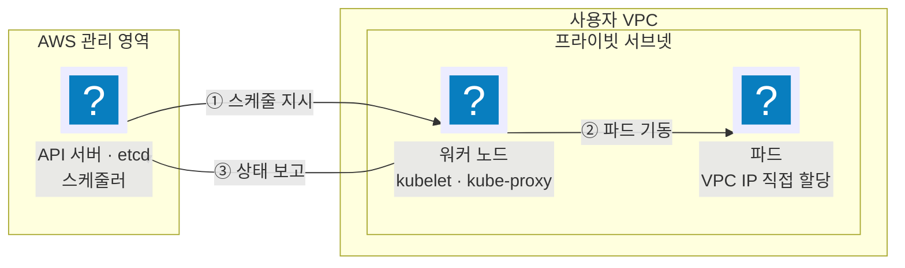
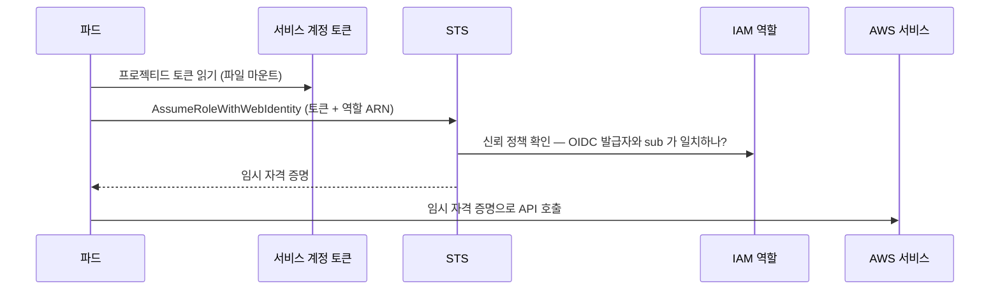
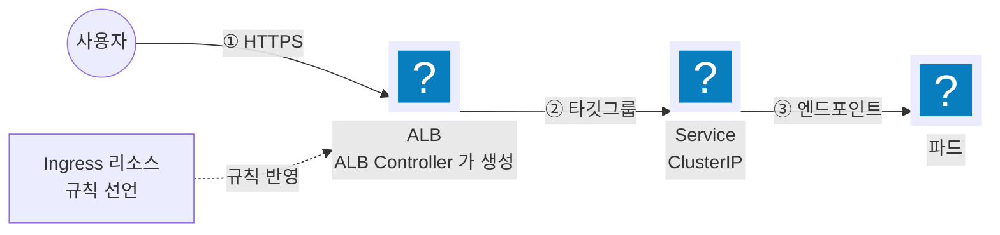

import { Quiz, QuizResults } from 'starlight-quiz/components';
import { Steps, LinkButton } from '@astrojs/starlight/components';

> 문서 유형: explanation

## ① 학습 목표

- [ ] 컨트롤 플레인과 데이터 플레인의 책임 경계를 설명할 수 있다
- [ ] 파드가 AWS API를 호출하는 경로(IRSA·Pod Identity)를 그릴 수 있다
- [ ] VPC CNI가 파드에 VPC IP를 직접 주는 방식과 그로 인한 IP 고갈을 설명할 수 있다
- [ ] ClusterIP·NodePort·LoadBalancer와 ALB Ingress의 트래픽 경로를 구분할 수 있다
- [ ] VPC CNI 때문에 `ip` 타깃 유형이 가능하다는 것과 서브넷 태그의 역할을 설명할 수 있다

## ② 핵심 개념

| 용어 | 한 줄 정의 |
|---|---|
| 컨트롤 플레인 | AWS가 운영하는 API 서버·etcd·스케줄러. 계정 VPC 밖에 있고 ENI로만 닿는다 |
| 데이터 플레인 | 사용자 계정의 워커 노드. EC2 노드그룹·Fargate·Karpenter 중 선택 |
| 노드그룹 | 같은 설정의 워커 노드 묶음. 관리형 노드그룹은 AMI 갱신·드레인을 AWS가 맡는다 |
| 애드온 | VPC CNI·CoreDNS·kube-proxy 등 클러스터 필수 구성 요소. EKS가 버전을 관리한다 |
| OIDC 공급자 | 클러스터가 발급하는 토큰을 IAM이 신뢰하게 만드는 연결 고리. IRSA의 전제 |

**OIDC** 는 OpenID Connect 의 약어다. 어떤 시스템이 발급한 토큰을 다른 시스템이 "이 발급자가 서명한 것이 맞다"고 검증하고 받아들이게 하는 표준이다. EKS 에서는 클러스터가 토큰 발급자가 되고 IAM 이 그 발급자를 신뢰하는 쪽이 된다. 계정에 OIDC 공급자를 등록한다는 것은 그 신뢰 관계를 한 번 맺어 둔다는 뜻이다.

EKS는 쿠버네티스 컨트롤 플레인을 AWS가 대신 운영하는 서비스다. **책임 경계가 곧 장애 경계**다 — API 서버가 응답하지 않으면 AWS 문제이고, 파드가 뜨지 않으면 거의 항상 계정 쪽 문제(IAM·서브넷·IP·이미지)다.



<details class="diagram-note">
<summary>이 도식이 보여주는 것</summary>

EKS 가 어디까지 관리하고 사용자 VPC 에 무엇이 남는지를 가른다. API 서버·etcd·스케줄러는 AWS 관리 영역에 있어 사용자가 접속할 수는 있어도 손댈 수 없다. 워커 노드는 사용자 VPC 의 프라이빗 서브넷에 뜨는 EC2 이고, 노드의 kubelet 이 API 서버 지시를 받아 파드를 띄운 뒤 상태를 되보고한다. 파드가 받는 IP 는 가상 대역이 아니라 그 서브넷의 VPC IP 다 — 서브넷 CIDR 이 좁으면 파드 수가 먼저 막힌다.

</details>

## ③ 대회에서 어떻게 쓰이나

:::danger[생성자 신원이 곧 접근 권한]
클러스터를 만든 IAM 신원만 기본 `kubectl` 접근을 가진다. `mark.sh` 가 도는 신원과 생성 신원이 다르면 채점 자체가 실패한다. 모든 작업을 IAM 사용자 하나로 통일한다.
:::

- **노드는 프라이빗 서브넷**에 둔다. NAT 경로가 없으면 이미지 pull부터 실패하고, 그 실패는 `ImagePullBackOff` 로만 보인다.
- **서브넷 태그**가 로드밸런서 배치를 결정한다. 퍼블릭 서브넷에 `kubernetes.io/role/elb`, 프라이빗 서브넷에 `kubernetes.io/role/internal-elb` 가 없으면 ALB가 서브넷을 찾지 못하고 Ingress가 주소를 받지 못한다.
- 이 내용은 **PART-2 모듈 09(eksctl 클러스터)** 와 **모듈 10(k8s 워크로드·ALB)** 의 기반이다.

## ④ 핵심 코드 패턴

클러스터와 애드온 상태 자가 검증:

```bash
# 클러스터 상태와 엔드포인트 공개 범위
aws eks describe-cluster --name wskorea26 --query 'cluster.[status,endpointPublicAccess]'

# kubeconfig 갱신 — 현재 CLI 신원으로 인증 정보를 다시 쓴다
aws eks update-kubeconfig --name wskorea26 --region ap-northeast-2

# 애드온 버전 확인
aws eks list-addons --cluster-name wskorea26

# 노드가 Ready 인지, 파드가 IP 를 받았는지
kubectl get nodes -o wide
kubectl get pods -A -o wide
```

<details class="diagram-note">
<summary>이 블록이 하는 일</summary>

클러스터에 붙기 전 상태를 확인하는 순서다. `describe-cluster` 로 `ACTIVE` 인지와 퍼블릭 엔드포인트가 열려 있는지를 보고, `update-kubeconfig` 로 지금 CLI 신원 기준의 접속 정보를 다시 쓴다. 그다음 노드가 `Ready` 인지, 파드가 IP 를 받았는지를 `-o wide` 로 확인한다. 순서가 중요하다 — kubeconfig 를 갱신하지 않으면 `kubectl` 이 예전 신원으로 붙어 권한 오류가 난다.

</details>

파드에 IAM 권한을 붙이는 서비스 계정(IRSA 방식):

```yaml
apiVersion: v1
kind: ServiceAccount
metadata:
  name: s3-reader
  namespace: app
  annotations:
    eks.amazonaws.com/role-arn: arn:aws:iam::123456789012:role/wskorea26-s3-reader
```

<details class="diagram-note">
<summary>이 블록이 하는 일</summary>

IRSA 를 쓰는 서비스 계정이다. 실제 연결은 `eks.amazonaws.com/role-arn` 애노테이션 한 줄이 만든다 — 이 값이 있으면 파드에 프로젝티드 토큰이 마운트되고, SDK 가 그 토큰으로 해당 역할을 맡는다. 애노테이션 값의 역할 ARN 과 IAM 쪽 신뢰 정책이 서로를 가리켜야 하며, 한쪽만 맞으면 호출 시점에 `AccessDenied` 가 난다.

</details>

## ⑤ 심화 개념 (응용력 기르기)

### IRSA와 EKS Pod Identity

둘 다 "파드에 IAM 역할을 준다"는 목적은 같고, 신뢰를 세우는 방식이 다르다.

**IRSA(IAM Roles for Service Accounts)** 는 OIDC 위에서 동작한다. 클러스터가 서비스 계정 토큰을 발급하고, IAM이 그 토큰의 발급자를 신뢰하도록 계정에 OIDC 공급자를 등록해 둔다.



<details class="diagram-note">
<summary>이 도식이 보여주는 것</summary>

IRSA 로 파드가 AWS 자격 증명을 얻는 순서다. 파일로 마운트된 프로젝티드 토큰을 읽어 `AssumeRoleWithWebIdentity` 를 부르면, STS 가 역할의 신뢰 정책을 보고 OIDC 발급자와 `sub`(네임스페이스·서비스 계정 이름)가 일치하는지 확인한다. 통과하면 임시 자격 증명이 나오고 그것으로 AWS API 를 부른다. 액세스 키를 파드에 넣지 않는 이유가 이 흐름이다.

</details>

역할의 신뢰 정책은 OIDC 공급자를 `Principal` 로 두고, `Condition` 에서 `system:serviceaccount:<네임스페이스>:<서비스계정>` 을 `sub` 로 못 박는다. 이 조건을 빠뜨리면 **클러스터의 모든 서비스 계정**이 그 역할을 맡을 수 있다.

**EKS Pod Identity** 는 OIDC를 쓰지 않는다. 클러스터에 Pod Identity Agent 애드온을 깔고, `CreatePodIdentityAssociation` 으로 "이 클러스터의 이 서비스 계정 = 이 역할" 을 EKS 쪽에 등록한다. 에이전트가 노드에서 자격 증명을 중계한다.

| 항목 | IRSA | Pod Identity |
|---|---|---|
| 신뢰 근거 | 클러스터별 OIDC 공급자 | EKS 서비스 주체 하나 |
| 클러스터마다 할 일 | OIDC 공급자 등록 + 역할 신뢰 정책 갱신 | 연결(association) 생성만 |
| 역할 재사용 | 클러스터가 늘면 신뢰 정책도 늘어난다 | 같은 역할을 여러 클러스터에서 그대로 쓴다 |
| 전제 조건 | 없음 (컨트롤 플레인 기능) | Pod Identity Agent 애드온 설치 |
| 서비스 계정 애노테이션 | 필요하다 | 필요 없다 |

Pod Identity가 운영상 단순하지만, 대회 자료와 `eksctl` 예제는 여전히 IRSA 기준이 많다. **양쪽 모두 읽을 수 있어야** 남의 코드를 디버깅한다.

### VPC CNI — 파드가 VPC IP를 직접 받는다

AWS VPC CNI는 오버레이 네트워크를 만들지 않는다. 노드에 보조 ENI를 붙이고 그 ENI의 보조 프라이빗 IP를 파드에 그대로 준다. 결과적으로 **파드 IP = VPC IP** 다.

- 장점: 보안 그룹·VPC 흐름 로그·NACL이 파드 트래픽에 그대로 적용되고, 캡슐화 오버헤드가 없다
- 대가: 파드 하나가 서브넷 IP 하나를 먹는다. `/24` 서브넷 하나로는 파드 수백 개를 못 버틴다

노드당 파드 상한은 EKS 최적화 AMI 기준 `(ENI 수 × (ENI당 IP 수 − 1)) + 2` 로 정해진다. 식의 두 상수는 각각 이유가 있다.

- **`− 1`** — ENI 마다 첫 프라이빗 IP 는 그 ENI 자신의 주소로 잡힌다. 노드가 네트워크에서 자기를 가리키는 데 쓰는 주소라 파드에 나눠 줄 수 없다. ENI 하나당 파드에 줄 수 있는 IP 가 하나씩 줄어드는 이유다.
- **`+ 2`** — VPC CNI 와 `kube-proxy` 는 노드의 네트워크를 그대로 쓰는 파드라 별도 IP 를 먹지 않는다. 그래서 상한에서 두 자리를 되돌려 준다.

`t3.medium` 은 ENI 3개 × IP 6개라 `3 × 5 + 2 = 17` 개이고, 이 상한은 CPU·메모리가 남아 있어도 적용된다.

IP가 부족할 때 쓰는 수단은 두 가지다.

| 방법 | 하는 일 | 주의 |
|---|---|---|
| 보조 CIDR | VPC에 CIDR 블록을 추가하고 거기에 서브넷을 만든다 | 기존 서브넷은 그대로 — 새 서브넷을 만들어야 효과가 있다 |
| 커스텀 네트워킹 | 노드는 기존 서브넷, **파드만 보조 CIDR 서브넷**에 배치한다 | `ENIConfig` 설정 필요. 적용 후 노드 재생성 필요. 노드당 파드 수가 줄어든다 |

접두사 위임(prefix delegation)을 켜면 ENI에 IP 하나 대신 `/28` 접두사를 붙여 노드당 파드 수를 크게 늘린다. 서브넷에 연속된 `/28` 여유가 있어야 한다.

### kube-proxy와 CoreDNS

CNI가 IP를 주는 것까지가 끝이 아니다. 그 IP로 **서비스 이름이 도달 가능해지려면** 두 애드온이 더 필요하다.

- **kube-proxy**: 각 노드에서 Service의 가상 IP(ClusterIP)를 실제 파드 IP로 바꾸는 규칙을 커널에 심는다(iptables 또는 IPVS). ClusterIP는 어떤 인터페이스에도 붙어 있지 않은 **가상 주소**다 — 그래서 ping이 되지 않는다.
- **CoreDNS**: `svc.ns.svc.cluster.local` 같은 이름을 ClusterIP로 푼다. 파드는 CoreDNS 서비스의 ClusterIP를 네임서버로 받는다.

셋의 의존 순서가 곧 장애 진단 순서다. **CNI(IP) → kube-proxy(라우팅) → CoreDNS(이름)**. CoreDNS 파드가 IP를 못 받으면 클러스터 전체의 이름 해석이 죽고, 증상은 "이미지 pull 실패"·"서비스 연결 안 됨"처럼 엉뚱하게 나타난다. 이름 해석이 의심되면 `kubectl -n kube-system get pods -l k8s-app=kube-dns` 를 먼저 본다.

### 트래픽이 들어오는 경로



<details class="diagram-note">
<summary>이 도식이 보여주는 것</summary>

Ingress 가 ALB 로 이어지는 경로다. Ingress 는 규칙을 선언할 뿐이고 ALB 를 실제로 만드는 것은 ALB Controller 다. 사용자 요청은 ALB → 타깃그룹 → Service → 파드 순으로 내려간다. 점선이 실선과 다른 이유가 여기 있다 — Ingress 는 트래픽 경로가 아니라 설정 경로다.

</details>

| 타입 | 노출 범위 | 실제로 하는 일 |
|---|---|---|
| ClusterIP | 클러스터 내부 | 가상 IP 하나를 만들고 kube-proxy가 파드로 분산. 기본값 |
| NodePort | 노드 IP:30000-32767 | 모든 노드의 같은 포트를 연다. ClusterIP 위에 얹힌다 |
| LoadBalancer | 외부 | NodePort 위에 클라우드 로드밸런서(NLB)를 붙인다 |
| Ingress + ALB | 외부, L7 | 경로·호스트 기반 라우팅. ALB 하나로 여러 서비스를 받는다 |

AWS Load Balancer Controller는 클러스터 안에서 Ingress·Service 리소스를 감시하다가 **실제 ALB/NLB를 AWS API로 만든다**. 그래서 이 컨트롤러에는 ELB를 만들 IAM 권한이 필요하고, 그 권한을 IRSA로 준다.

ALB 자체의 구조(리스너·규칙·타깃그룹·헬스체크), 타깃 유형 `instance` 와 `ip` 의 차이, Ingress 와 TargetGroupBinding 중 무엇을 쓸지는 [로드밸런서 기초](/start/loadbalancer-basics/) 에 있다.

EKS 쪽에서만 성립하는 것은 둘이다.

- **`ip` 타깃 유형이 가능한 이유**: VPC CNI 가 파드에 VPC IP 를 직접 주므로 파드를 타깃그룹에 그대로 등록할 수 있다. Fargate 는 이 방식만 쓴다.
- **서브넷 태그**: 컨트롤러가 ALB 를 놓을 서브넷을 `kubernetes.io/role/elb`(퍼블릭)·`kubernetes.io/role/internal-elb`(프라이빗) 태그로 찾는다. 태그가 없으면 Ingress 가 `ADDRESS` 를 영영 못 받는다.

Ingress가 `ADDRESS` 를 받지 못하고 비어 있으면 순서대로 본다.

1. 컨트롤러 파드가 `Running` 인가.
2. 컨트롤러의 IRSA 역할에 ELB 권한이 있는가.
3. 서브넷 태그가 붙어 있는가.

### 트러블슈팅 사례

| 증상 | 원인 | 확인·대응 |
|---|---|---|
| `kubectl` 이 `Unauthorized` | 생성 신원과 현재 CLI 신원이 다르다 | `aws sts get-caller-identity` 로 ARN 확인 후 접근 항목 추가 |
| 파드가 `Pending` + `FailedScheduling` | 서브넷 IP 고갈 또는 ENI 상한 | 서브넷 여유 IP 확인. 보조 CIDR·접두사 위임 검토 |
| 파드가 `ImagePullBackOff` | 프라이빗 서브넷에 NAT 경로 없음, 또는 ECR 권한 없음 | 라우팅 테이블과 노드 역할의 ECR 읽기 권한 확인 |
| 클러스터 전체에서 이름 해석 실패 | CoreDNS 파드가 IP를 못 받음 | `kubectl -n kube-system get pods` 로 CoreDNS 상태 확인 |
| Ingress의 `ADDRESS` 가 비어 있다 | 컨트롤러 권한 누락 또는 서브넷 태그 누락 | 컨트롤러 로그 확인 후 IRSA 역할·서브넷 태그 점검 |
| IRSA를 붙였는데 파드가 노드 역할 권한으로 동작 | 서비스 계정 애노테이션 오타, 또는 파드가 그 서비스 계정을 쓰지 않는다 | 파드 스펙의 `serviceAccountName` 과 애노테이션의 역할 ARN 대조 |

## ⑥ 자기 점검 퀴즈

<Quiz title="파드가 AWS API 를 호출하는 올바른 경로">
파드 안의 애플리케이션이 S3를 읽어야 한다. 대회에서 요구하는 방식은?

- [x] 서비스 계정에 IAM 역할을 연결하고(IRSA 또는 Pod Identity) 파드가 그 역할을 맡는다
- [ ] 컨테이너 이미지에 액세스 키를 넣어 빌드한다
  > 이미지에 들어간 키는 회수도 회전도 불가능하다. 레지스트리를 읽는 누구에게나 노출된다.
- [ ] 노드 인스턴스 프로파일에 `s3:*` 를 붙인다
  > 동작은 한다. 하지만 그 노드의 **모든 파드**가 같은 권한을 갖는다 — 최소 권한 원칙 위반이고 감점 대상이다.
- [ ] 시크릿에 액세스 키를 넣어 환경 변수로 주입한다
  > 장기 자격 증명이 클러스터 안에 남는다. 임시 자격 증명을 쓸 수 있는 경로가 있으면 그쪽이 정답이다.

파드 단위 권한은 **서비스 계정 ↔ IAM 역할** 매핑으로 준다. 노드 인스턴스 프로파일에 권한을 몰면 파드 간 권한 격리가 사라진다.
</Quiz>

<Quiz title="파드가 Pending 에서 멈추는 이유">
노드는 `Ready` 인데 새 파드가 `Pending` 에서 진행되지 않는다. VPC CNI 환경에서 먼저 의심할 것을 **모두** 고르시오.

- [x] 서브넷의 가용 IP가 고갈됐다
- [x] 노드 인스턴스 타입의 ENI·IP 상한에 도달했다
- [ ] 컨테이너 이미지를 받지 못했다
  > 이미지 문제는 `ImagePullBackOff` 로 나타난다. 그 단계에 가려면 이미 스케줄링은 끝나 있어야 한다.
- [ ] 컨트롤 플레인이 응답하지 않는다
  > API 서버가 죽으면 `kubectl get` 자체가 실패한다. 목록이 보이는 시점에 컨트롤 플레인은 살아 있다.

VPC CNI는 파드에 **VPC의 실제 IP**를 준다. 따라서 파드 밀도의 상한은 두 곳에서 온다 — ① 서브넷 CIDR의 남은 IP, ② 인스턴스 타입이 붙일 수 있는 ENI 수 × ENI당 IP 수. `Pending` + `FailedScheduling` 로그가 나오면 이 둘을 먼저 본다.
</Quiz>

<Quiz title="같은 역할을 여러 클러스터에서 쓰려면">
클러스터를 하나 더 만들면서, S3 읽기 IAM 역할 하나를 두 클러스터의 파드가 그대로 쓰게 하려 한다. Pod Identity 로 갈 때 맞는 설명을 **모두** 고르시오.

- [x] 클러스터마다 연결(association)만 만들면 되고 역할의 신뢰 정책은 손대지 않는다
- [x] 각 클러스터에 Pod Identity Agent 애드온이 설치돼 있어야 한다
- [ ] 클러스터마다 OIDC 공급자를 계정에 등록해야 한다
  > OIDC 공급자는 IRSA 의 전제다. Pod Identity 는 EKS 서비스 주체 하나를 신뢰하므로 OIDC 를 쓰지 않는다.
- [ ] 서비스 계정에 `eks.amazonaws.com/role-arn` 애노테이션을 달아야 한다
  > 그 애노테이션은 IRSA 방식이다. Pod Identity 는 "이 클러스터의 이 서비스 계정 = 이 역할" 을 EKS 쪽에 등록하므로 서비스 계정 애노테이션이 필요 없다.

두 방식의 차이는 **신뢰를 어디에 세우느냐**다. IRSA 는 클러스터별 OIDC 공급자를 신뢰 근거로 삼기 때문에 클러스터가 늘면 역할의 신뢰 정책도 함께 늘어난다. Pod Identity 는 EKS 서비스 주체 하나만 신뢰하므로 역할은 그대로 두고 연결만 추가하면 된다. 대신 에이전트 애드온이라는 전제가 붙는다. 대회 자료와 `eksctl` 예제는 아직 IRSA 기준이 많으니 양쪽을 다 읽을 수 있어야 한다.
</Quiz>

<Quiz title="ClusterIP 가 ping 에 응답하지 않는다">
서비스 연결이 안 돼서 파드에서 Service 의 ClusterIP 로 `ping` 을 쳤더니 응답이 없다. 이 결과를 어떻게 읽어야 하나?

- [x] ClusterIP 는 가상 주소라 원래 ping 에 응답하지 않는다 — 이 결과만으로는 아무것도 판정할 수 없다
- [ ] Service 뒤에 붙은 파드가 하나도 없다는 뜻이다
  > 엔드포인트가 비어 있으면 실제 연결이 실패하는 건 맞지만, 그 판정은 엔드포인트 목록으로 한다. ping 응답 여부와는 무관하다.
- [ ] kube-proxy 가 죽어서 규칙이 사라졌다는 뜻이다
  > kube-proxy 가 멀쩡해도 ClusterIP 는 ping 에 답하지 않는다. kube-proxy 는 서비스 포트로 온 트래픽의 목적지를 파드 IP 로 바꿀 뿐, 그 주소에 응답할 인터페이스를 만들지 않는다.
- [ ] CoreDNS 가 이름을 엉뚱한 IP 로 풀었다는 뜻이다
  > 이미 IP 를 직접 쳤으므로 이 시도에 이름 해석은 개입하지 않는다.

ClusterIP 는 **어떤 인터페이스에도 붙어 있지 않은** 가상 주소다. ICMP 에 답할 주체가 없으므로 정상 클러스터에서도 ping 은 실패한다. 진단은 의존 순서를 따라간다 — **CNI(IP) → kube-proxy(라우팅) → CoreDNS(이름)**. 이름 해석이 의심되면 `kubectl -n kube-system get pods -l k8s-app=kube-dns` 로 CoreDNS 부터 본다.
</Quiz>

<Quiz title="Ingress 의 ADDRESS 가 비어 있다">
Ingress 를 만들었는데 `kubectl get ingress` 의 `ADDRESS` 가 계속 비어 있다. 점검할 것을 **모두** 고르시오.

- [x] AWS Load Balancer Controller 파드가 `Running` 인지
- [x] 컨트롤러의 IRSA 역할에 ELB 를 만들 권한이 있는지
- [x] 퍼블릭 서브넷에 `kubernetes.io/role/elb` 태그가 붙어 있는지
- [ ] 파드가 VPC IP 를 받았는지
  > 파드 IP 는 타깃그룹을 채우는 단계에서 필요하다. ALB 자체가 만들어지지 않아 주소가 비는 것과는 층위가 다르다.
- [ ] Service 타입을 `LoadBalancer` 로 바꿨는지
  > Ingress + ALB 경로에서 뒤의 Service 는 ClusterIP 로 둔다. 타입을 바꾸면 NLB 가 따로 생길 뿐 Ingress 의 주소와는 상관이 없다.

`ADDRESS` 는 컨트롤러가 **실제 ALB 를 AWS API 로 만든 뒤** 그 DNS 이름을 되돌려 써 줘야 채워진다. 비어 있다는 건 ALB 가 아직 안 만들어졌다는 뜻이므로 ① 컨트롤러가 도는가, ② 만들 권한이 있는가, ③ 놓을 서브넷을 찾는가 순서로 좁힌다. 서브넷 태그는 대회에서 특히 자주 빠뜨리는 지점이고, 빠뜨려도 에러 메시지가 Ingress 에 직접 뜨지 않아 컨트롤러 로그를 봐야 보인다.
</Quiz>

<QuizResults confetti />

## ⑦ 다음 단계

모듈 09에서 `eksctl` 로 클러스터를 세우고, 모듈 10에서 워크로드와 ALB를 올린다. 그 뒤 모듈 11 이 전제하는 관측성 기초가 다음 순서다.

<LinkButton href="/start/observability-basics/" icon="right-arrow">다음 선수 학습 — 관측성 기초</LinkButton>
<LinkButton href="/part-2/09-eksctl-cluster/" variant="minimal">PART 2 — EKS Core</LinkButton>

## 공식 문서

- [Amazon EKS 사용 설명서](https://docs.aws.amazon.com/eks/latest/userguide/) — 클러스터·노드그룹·애드온 전반
- [서비스 계정용 IAM 역할](https://docs.aws.amazon.com/eks/latest/userguide/iam-roles-for-service-accounts.html) — IRSA 신뢰 정책 작성법
- [EKS Pod Identity](https://docs.aws.amazon.com/eks/latest/userguide/pod-identities.html) — 연결 생성과 에이전트 설치
- [VPC CNI](https://docs.aws.amazon.com/eks/latest/userguide/managing-vpc-cni.html) — IP 할당·접두사 위임·커스텀 네트워킹
- [AWS Load Balancer Controller](https://kubernetes-sigs.github.io/aws-load-balancer-controller/latest/) — Ingress 애노테이션과 TargetGroupBinding
