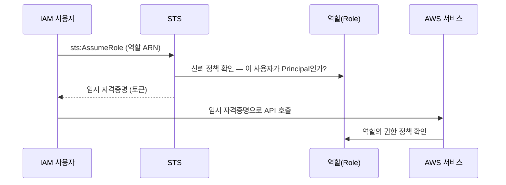

import { Quiz, QuizResults } from 'starlight-quiz/components';
import { Steps, LinkButton } from '@astrojs/starlight/components';

> 문서 유형: explanation

## ① 학습 목표

- [ ] 사용자/그룹/역할의 차이를 설명할 수 있다
- [ ] 정책 JSON의 Effect/Action/Resource/Condition 4요소를 읽을 수 있다
- [ ] 신뢰 정책과 권한 정책의 차이, AssumeRole의 흐름을 안다
- [ ] root 상시 사용이 왜 금지인지 대회 관점에서 설명할 수 있다

## ② 핵심 개념

| 용어 | 한 줄 정의 |
|---|---|
| 사용자(User) | 사람/스크립트용 장기 자격증명 (액세스 키) |
| 그룹(Group) | 사용자 묶음. 정책을 그룹에 붙여 일괄 부여 |
| 역할(Role) | **자격증명 없는 신원**. 누군가 AssumeRole로 "빌려 쓰는" 모자. EC2/EKS/Lambda가 AWS를 호출할 때 쓰는 방식 |
| 권한 정책 | 이 신원이 **무엇을 할 수 있나** (Action/Resource) |
| 신뢰 정책 | 이 역할을 **누가 Assume할 수 있나** (역할에만 존재, Principal 포함) |

정책 JSON 해부:

```json
{
  "Version": "2012-10-17",
  "Statement": [{
    "Effect": "Allow",
    "Action": ["s3:GetObject", "s3:ListBucket"],
    "Resource": "arn:aws:s3:::my-bucket/*",
    "Condition": { "StringEquals": { "aws:RequestedRegion": "ap-northeast-2" } }
  }]
}
```

- **Effect**: Allow / Deny (명시적 Deny가 항상 이김)
- **Action**: `서비스:API` 형식, `*` 와일드카드 가능
- **Resource**: 대상 ARN
- **Condition**: 선택. 조건부 허용/거부



**두 정책 다 통과해야 AssumeRole이 성립한다**: 신뢰 정책(문지기) + 호출자의 `sts:AssumeRole` 권한.

## ③ 대회에서 어떻게 쓰이나

:::danger[root 상시 사용 금지]
대회 유형의 KMS 키 정책은 **root-less** — root를 Principal에서 뺀다. root로 리소스를 만들면 이후 KMS 사용이 전부 거부되어 복구 불가에 가깝다.
:::

- **생성자 = 채점자 신원**: EKS 클러스터를 만든 IAM 신원만 기본 kubectl 접근을 가진다. 채점 스크립트(mark.sh)가 도는 신원과 생성 신원이 다르면 채점 자체가 실패한다. 처음부터 IAM 사용자 하나로 통일하는 습관이 곧 점수다.
- 이 내용은 **PART-3 모듈 08(IAM 심화)** — IRSA, aws-auth, KMS 키 정책 — 의 기반이다.

## ④ 미니 실습 (15분, 과금 없음)

<Steps>

1. **IAM 사용자 생성**

   콘솔(root 또는 기존 관리자)에서 이름 `skills-admin`, 정책 `AdministratorAccess` 직접 연결, 액세스 키 발급 (CLI 용도).

2. **로컬에서 자격증명 등록 후 신원 확인**

   ```bash
   aws configure   # 액세스 키, 시크릿, 리전 ap-northeast-2, 출력 json
   aws sts get-caller-identity
   ```

3. **`Arn` 확인**

   `arn:aws:iam::<계정ID>:user/skills-admin` 인지 확인 — `root`가 보이면 잘못 설정된 것.

4. **이 사용자를 앞으로 모든 학습의 단일 신원으로 사용한다** (삭제하지 않고 유지)

</Steps>

## ⑤ 자기 점검 퀴즈

<Quiz title="신뢰 정책의 필수 요소">
역할(Role)에만 존재하고 사용자에게는 없는 정책이 **신뢰 정책**이다. 그 안에 반드시 들어가야 하는, "누가 이 역할을 Assume할 수 있는지"를 지정하는 요소는 [[Principal]] 이다.

---

신뢰 정책은 역할의 문지기다. 권한 정책이 "이 신원이 **무엇을** 할 수 있나"(Action/Resource)를 정한다면, 신뢰 정책은 "이 역할을 **누가** 쓸 수 있나"를 `Principal`로 정한다. AssumeRole이 성립하려면 두 조건이 동시에 만족돼야 한다 — ① 역할의 신뢰 정책이 호출자를 `Principal`로 인정하고, ② 호출자에게 `sts:AssumeRole` 권한이 있어야 한다. 한쪽만 있으면 실패한다.
</Quiz>

<Quiz title="정책 평가 — 충돌 시 결과">
같은 Action에 대해 Allow 정책과 Deny 정책이 동시에 걸려 있다. 결과는?

- [x] 명시적 Deny가 이긴다 (Deny > Allow > 암묵적 Deny)
- [ ] 더 구체적인 Resource ARN을 가진 정책이 이긴다
  > 라우팅 테이블의 longest-prefix match와 헷갈리기 쉬운 지점이다. IAM 평가에는 "구체성" 개념이 없다 — 명시적 Deny가 하나라도 있으면 끝이다.
- [ ] 나중에 연결(attach)된 정책이 이긴다
  > IAM 정책에는 적용 순서가 없다. 연결된 모든 정책을 합쳐서 한 번에 평가한다.
- [ ] Allow가 이긴다 — 명시적 허용이 암묵적 거부보다 우선하기 때문

평가 순서는 **명시적 Deny → 명시적 Allow → 암묵적 Deny(기본 거부)**. "명시적 허용이 암묵적 거부를 이긴다"는 맞는 말이지만, 명시적 Deny 앞에서는 무력하다. SCP·권한 경계·리소스 정책 중 어느 하나에라도 Deny가 있으면 그대로 차단된다.
</Quiz>

<Quiz title="root로 클러스터를 만들면">
EKS 클러스터를 root 사용자로 생성하면 대회에서 어떤 문제가 생기나? 옳은 것을 **모두** 고르시오.

- [x] root-less KMS 키 정책 아래서 KMS 사용이 전부 거부되어 복구 불가에 가까워진다
- [x] 생성자 신원과 채점 신원이 달라져 kubectl·채점 스크립트 접근이 실패한다
- [ ] root 사용자에게는 EKS 클러스터 생성 권한이 없어 생성 단계에서 바로 실패한다
  > root는 모든 권한을 가지므로 생성 자체는 **성공한다**. 그래서 더 위험하다 — 문제가 채점 단계에 가서야 드러난다.
- [ ] root로 만든 클러스터는 `aws-auth` ConfigMap이 아예 생성되지 않는다
  > ConfigMap은 정상 생성된다. 문제는 그 안에 root 신원만 매핑되어, 이후 IAM 사용자로는 접근 경로가 없다는 점이다.

**① root-less KMS**: 대회 유형의 KMS 키 정책은 Principal에서 root를 뺀다. root로 만든 리소스는 이후 KMS 사용이 전부 거부된다. **② 생성자 = 채점자 신원**: EKS 클러스터를 만든 IAM 신원만 기본 kubectl 접근을 가진다. 처음부터 IAM 사용자 하나(`skills-admin`)로 통일하는 습관이 곧 점수다. `aws sts get-caller-identity`의 `Arn`에 `root`가 보이면 즉시 멈춘다.
</Quiz>

<QuizResults confetti />

## ⑥ 다음 단계

모듈 08에서 IRSA·aws-auth·KMS 키 정책으로 심화한다.

<LinkButton href="/start/docker-basics/" icon="right-arrow">다음 선수 학습 — Docker 기초</LinkButton>
<LinkButton href="/part-3/07-observability/" variant="minimal">PART 3 — 관측성·Hard Mode</LinkButton>

## 공식 문서

- [IAM 사용 설명서](https://docs.aws.amazon.com/IAM/latest/UserGuide/) — 사용자·역할·정책 전반
- [정책 평가 로직](https://docs.aws.amazon.com/IAM/latest/UserGuide/reference_policies_evaluation-logic.html) — Deny 우선, 신뢰 정책과의 이중 평가
- [서비스별 액션·리소스·조건 키](https://docs.aws.amazon.com/service-authorization/latest/reference/reference_policies_actions-resources-contextkeys.html) — 정책에 쓸 값의 정본
