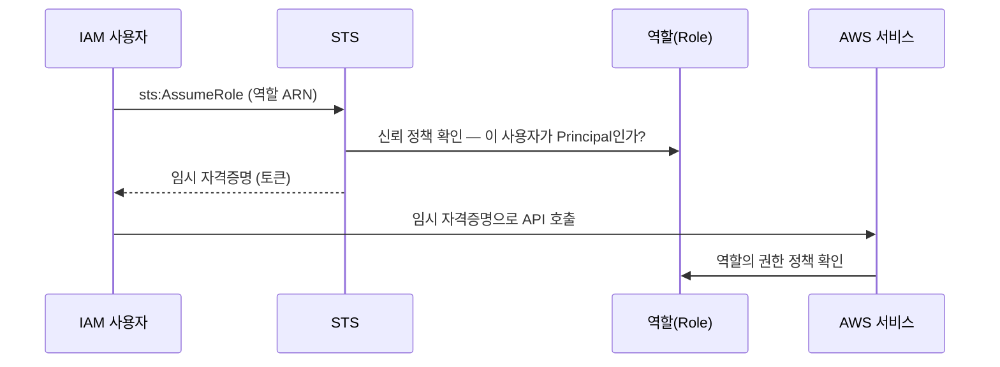
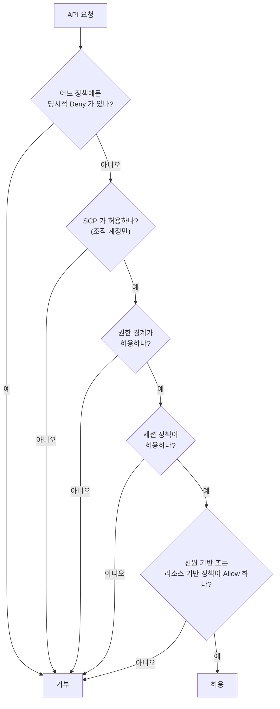
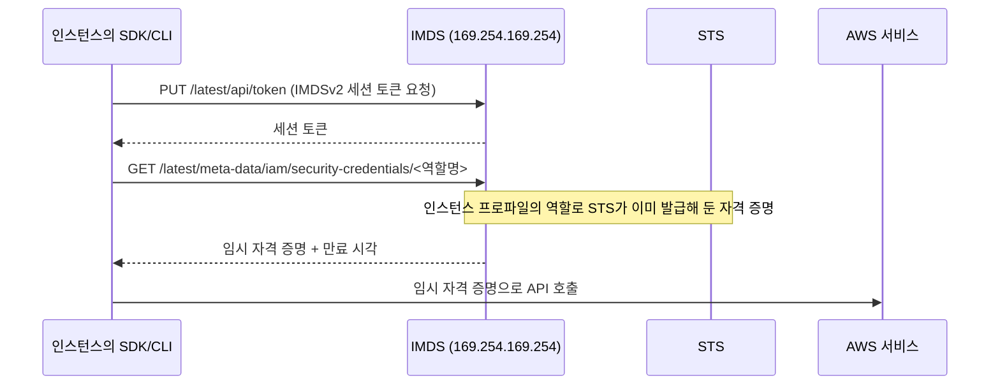

import { Quiz, QuizResults } from 'starlight-quiz/components';
import { Steps, LinkButton } from '@astrojs/starlight/components';

> 문서 유형: explanation

## ① 학습 목표

- [ ] 사용자/그룹/역할의 차이를 설명할 수 있다
- [ ] 정책 JSON의 Effect/Action/Resource/Condition 4요소를 읽을 수 있다
- [ ] 신뢰 정책과 권한 정책의 차이, AssumeRole의 흐름을 안다
- [ ] root 상시 사용이 왜 금지인지 대회 관점에서 설명할 수 있다

## ② 핵심 개념

### ARN — 리소스를 가리키는 이름

IAM 정책은 대상을 전부 ARN 으로 적는다. **ARN(Amazon Resource Name)** 은 AWS 리소스 하나를 가리키는 고유 이름이고, 콜론으로 끊긴 여섯 칸으로 이뤄진다.

```
arn:partition:service:region:account:resource
```

| 칸 | 담는 값 | 예 |
|---|---|---|
| `partition` | 어느 AWS 파티션인가 | `aws` · `aws-cn` · `aws-us-gov` |
| `service` | 서비스 이름 | `s3` · `iam` · `kms` |
| `region` | 리전 코드 | `ap-northeast-1` |
| `account` | 12자리 계정 ID | `123456789012` |
| `resource` | 리소스 종류와 이름 | `user/skills-admin` · `role/deployer` · `my-bucket/*` |

칸이 비어도 콜론은 그대로 남는다. IAM 은 리전에 매이지 않으므로 `region` 이 비고, S3 버킷 이름은 전역에서 고유하므로 `region` 과 `account` 가 둘 다 빈다. 그래서 버킷 ARN 은 `arn:aws:s3:::my-bucket` 처럼 콜론이 연달아 셋 나온다.

`arn:aws:iam::<계정ID>:root` 는 뜻이 따로 굳은 관용 표기다. root 사용자 한 명이 아니라 **그 계정 전체**를 가리킨다. 이 값을 신뢰 정책에 쓰면 "누가 이 역할을 맡을지는 그 계정의 IAM 이 정하라"고 판단을 넘긴 것이고, 실제 허용 여부는 그 계정의 신원 기반 정책이 결정한다.

### Principal — 정책이 대상으로 삼는 신원

`Principal` 은 **정책이 대상으로 삼는 신원**이다. 값으로 들어가는 것은 네 가지다 — IAM 사용자, IAM 역할, 계정 전체, 그리고 `ec2.amazonaws.com` 같은 AWS 서비스다.

`Principal` 은 **리소스 기반 정책에만 있는 요소**다. 신원 기반 정책은 이미 특정 사용자나 역할에 붙어 있어서 대상이 정해져 있고, 리소스 기반 정책은 리소스 쪽에 붙어 있으므로 "누구에게"를 정책 안에 따로 적어야 한다. 역할의 신뢰 정책과 KMS 키 정책이 리소스 기반 정책이고, 그래서 둘 다 `Principal` 을 가진다.

### 용어표

| 용어 | 한 줄 정의 |
|---|---|
| 사용자(User) | 사람/스크립트용 장기 자격증명 (액세스 키) |
| 그룹(Group) | 사용자 묶음. 정책을 그룹에 붙여 일괄 부여 |
| 역할(Role) | **자격증명 없는 신원**. 누군가 AssumeRole로 "빌려 쓰는" 모자. EC2/EKS/Lambda가 AWS를 호출할 때 쓰는 방식 |
| 권한 정책 | 이 신원이 **무엇을 할 수 있나** (Action/Resource) |
| 신뢰 정책 | 이 역할을 **누가 Assume할 수 있나** (역할에만 존재, Principal 포함) |

정책 JSON 해부:

```json
{
  "Version": "2012-10-17",
  "Statement": [{
    "Effect": "Allow",
    "Action": ["s3:GetObject", "s3:ListBucket"],
    "Resource": "arn:aws:s3:::my-bucket/*",
    "Condition": { "StringEquals": { "aws:RequestedRegion": "ap-northeast-2" } }
  }]
}
```

<details class="diagram-note">
<summary>이 블록이 하는 일</summary>

IAM 정책 한 장의 구성 요소가 전부 들어 있다. `Effect`(허용·거부), `Action`(어떤 API), `Resource`(어떤 대상), `Condition`(추가 조건) 네 가지다. 이 정책은 `my-bucket` 안의 객체에 대한 읽기 두 가지를 허용하되, 요청 리전이 `ap-northeast-2` 일 때만 유효하다. `Resource` 의 `/*` 는 객체를 가리키므로 버킷 자체를 대상으로 하는 `ListBucket` 은 엄밀히는 버킷 ARN 이 따로 필요하다.

</details>

- **Effect**: Allow / Deny (명시적 Deny가 항상 이김)
- **Action**: `서비스:API` 형식, `*` 와일드카드 가능
- **Resource**: 대상 ARN
- **Condition**: 선택. 조건부 허용/거부



<details class="diagram-note">
<summary>이 도식이 보여주는 것</summary>

역할을 맡는(assume) 절차다. 사용자가 STS 에 역할 ARN 을 주며 요청하면 STS 는 그 역할의 **신뢰 정책**을 먼저 본다 — 이 사용자가 Principal 로 적혀 있는지다. 통과하면 임시 자격 증명이 나오고, 이후 API 호출에서는 역할의 **권한 정책**이 평가된다. 신뢰 정책과 권한 정책이 서로 다른 시점에 각각 쓰인다는 것이 이 그림의 요지다.

</details>

**교차 계정이면 두 정책이 다 통과해야 AssumeRole이 성립한다**: 신뢰 정책(문지기) + 호출자의 `sts:AssumeRole` 권한.

같은 계정 안에서는 조건이 하나 느슨해진다. 신뢰 정책은 리소스 기반 정책이므로, 그것이 호출자의 IAM 사용자 ARN 을 **직접** 지정했다면 호출자 신원 정책에 `sts:AssumeRole` 이 없어도 성립한다. 신뢰 정책이 계정 주체(`arn:aws:iam::<acct>:root`)만 지정한 경우에만 신원 정책 쪽 허용이 따로 필요하다.

## ③ 대회에서 어떻게 쓰이나

:::danger[root 상시 사용 금지]
대회 유형의 KMS 키 정책은 **root-less** — root를 Principal에서 뺀다. root로 리소스를 만들면 이후 KMS 사용이 전부 거부되어 복구 불가에 가깝다.
:::

:::note[남이 만들어 준 계정으로 일할 때]
실무에서는 `PowerUserAccess` 수준의 IAM 사용자만 받고 root 는 못 받는 일이 흔하다. 그때 두 가지를 대비한다.

- 관리형 정책 `PowerUserAccess` 는 `iam:CreateRole` 같은 IAM 쓰기를 막는다. Lambda 실행 역할·IRSA 역할을 만들어야 하는 구성이라면 그 권한이 따로 있어야 앞뒤가 맞는다 — 시작 직후 `aws sts get-caller-identity` 로 신원을 확인하고, 첫 `terraform apply` 가 IAM 역할 생성 단계에서 `AccessDenied` 를 내는지 가장 먼저 본다.
- **정책에 명시적 Deny 가 섞여 있을 수 있다.** 미리 만들어 준 리소스를 지우지 못하게 막는 목적이라, `PowerUserAccess` 범위 안인데도 특정 삭제만 거부된다. 삭제 계열 `AccessDenied` 가 나면 **내가 만든 리소스인지부터 확인하고**, 받은 것이면 그대로 둔다.
:::

- **생성자 = 채점자 신원**: EKS 클러스터를 만든 IAM 신원만 기본 kubectl 접근을 가진다. 채점 스크립트(mark.sh)가 도는 신원과 생성 신원이 다르면 채점 자체가 실패한다. 처음부터 IAM 사용자 하나로 통일하는 습관이 곧 점수다.
- 이 문서의 내용이 **PART-3 모듈 13(IAM 심화)** 의 기반이 된다. 그 모듈은 여기서 다룬 신뢰 정책·권한 정책 위에 IRSA, aws-auth, KMS 키 정책을 얹는다.

## ④ 미니 실습 (15분, 과금 없음)

<Steps>

1. **IAM 사용자 생성**

   콘솔(root 또는 기존 관리자)에서 이름 `skills-admin`, 정책 `AdministratorAccess` 직접 연결, 액세스 키 발급 (CLI 용도).

2. **로컬에서 자격증명 등록 후 신원 확인**

   ```bash
   aws configure   # 액세스 키, 시크릿, 리전 ap-northeast-2, 출력 json
   aws sts get-caller-identity
   ```

3. **`Arn` 확인**

   `arn:aws:iam::<계정ID>:user/skills-admin` 인지 확인 — `root`가 보이면 잘못 설정된 것.

4. **이 사용자를 앞으로 모든 학습의 단일 신원으로 사용한다** (삭제하지 않고 유지)

</Steps>

## ⑤ 심화 개념 (응용력 기르기)

### 최종 권한을 정하는 순서 — 거부 우선

권한은 여러 층에서 동시에 평가된다. 통과 조건은 **모든 층을 다 통과하는 것**이고, 어느 한 층에라도 명시적 Deny가 있으면 그 즉시 끝난다.



<details class="diagram-note">
<summary>이 도식이 보여주는 것</summary>

IAM 이 요청 하나를 허용할지 정하는 평가 순서다. 맨 처음이 명시적 `Deny` 검사고, 하나라도 걸리면 그 자리에서 거부다 — 뒤에 어떤 Allow 가 있어도 뒤집히지 않는다. 그다음 SCP·권한 경계·세션 정책이 차례로 통과해야 하고, 마지막에 신원 기반 또는 리소스 기반 정책에 Allow 가 있어야 허용된다. 즉 기본값은 거부이며 Allow 는 모든 관문을 통과한 뒤에야 효력이 있다.

</details>

| 층 | 하는 일 | 허용을 부여하나 |
|---|---|---|
| 명시적 Deny | 어디에 있든 즉시 차단 | — |
| SCP(서비스 제어 정책) | 조직 계정의 권한 **상한**을 정한다 | 아니다 — 걸러내기만 한다 |
| 권한 경계 | 신원 하나가 가질 수 있는 **상한**을 정한다 | 아니다 |
| 세션 정책 | `AssumeRole` 시점에 그 세션의 **상한**을 정한다 | 아니다 |
| 신원 기반 정책 | 사용자·역할에 붙는 권한 | 그렇다 |
| 리소스 기반 정책 | 리소스에 붙는 권한. `Principal` 포함 | 그렇다 |

핵심은 **상한을 정하는 층은 권한을 주지 않는다**는 점이다. 권한 경계에 `s3:*` 를 넣어도 신원 기반 정책이 비어 있으면 아무것도 못 한다. "AdministratorAccess를 붙였는데 거부된다"의 원인은 대개 SCP나 권한 경계다.

교차 계정 요청은 예외가 하나 있다. 계정이 다르면 **호출자 계정의 신원 기반 정책과 대상 계정의 리소스 기반 정책이 둘 다 Allow** 해야 한다. 같은 계정 안에서는 리소스 기반 정책 하나만으로도 성립한다.

### STS와 임시 자격 증명

역할에는 자격 증명이 없다. `sts:AssumeRole` 이 그때그때 임시 자격 증명 세 쌍(액세스 키 ID, 시크릿, **세션 토큰**)을 발급한다. 세션 토큰이 함께 있으면 임시 자격 증명이고, 기본 수명은 1시간이다.

EC2·EKS 노드는 이 과정을 **인스턴스 메타데이터 서비스(IMDS)** 가 대신 해 준다.



<details class="diagram-note">
<summary>이 도식이 보여주는 것</summary>

EC2 안의 SDK 가 액세스 키 없이 자격 증명을 얻는 경로다. 먼저 `PUT` 으로 IMDSv2 세션 토큰을 받고, 그 토큰을 들고 메타데이터 주소에서 역할 자격 증명을 읽는다. 자격 증명은 인스턴스 프로파일에 붙은 역할로 STS 가 미리 발급해 둔 것이고 만료 시각이 함께 온다. IMDSv1 이 `GET` 한 번으로 끝나던 것을 v2 가 토큰 발급 단계로 나눈 것이 SSRF 차단의 핵심이다.

</details>

- `169.254.169.254` 는 **링크 로컬 주소**다. 라우팅되지 않으므로 인스턴스 밖에서는 닿을 수 없다.
- SDK는 만료 전에 자동으로 다시 받아 간다. 애플리케이션이 갱신 코드를 짤 일은 없다.
- **인스턴스 프로파일**은 역할을 EC2에 붙이기 위한 껍데기다. 콘솔은 자동으로 만들지만 CLI·Terraform에서는 `aws_iam_instance_profile` 을 따로 만들어야 한다.
- IMDSv2는 `PUT` 으로 받은 토큰을 헤더에 실어야 응답한다. SSRF 취약점으로 자격 증명이 새는 경로를 막기 위한 설계이고, 신규 인스턴스의 기본값이다.

IMDS 응답이 인스턴스 안에서 몇 단계까지 전달되는지를 정하는 값이 **홉 제한**이다. 1로 두면 인스턴스 본체까지만 닿고, 그 위에서 도는 컨테이너는 `169.254.169.254` 에 닿지 못한다.

쿠버네티스는 컨테이너를 담는 최소 실행 단위를 **파드**, 파드가 실제로 도는 EC2 인스턴스를 **노드**라고 부른다. 파드가 IMDS 로 노드 역할의 자격 증명을 훔쳐 쓰는 것을 막으려면 홉 제한을 1 로 두고 **IRSA** 를 쓴다. IRSA 는 파드마다 IAM 역할을 따로 붙이는 EKS 기능이고, 동작 원리는 [EKS 기초](/start/eks-basics/)에서 다룬다.

### 교차 계정 접근

```
계정 A(호출자)                        계정 B(리소스 보유)
  ├ 사용자/역할                          ├ 역할 R
  └ 신원 기반 정책                       └ 신뢰 정책
     Allow sts:AssumeRole                   Principal: arn:aws:iam::A:root
     Resource: arn:aws:iam::B:role/R        Condition: sts:ExternalId
```

양쪽이 다 있어야 성립한다. 계정 B의 신뢰 정책에 `:root` 를 쓰는 것은 "계정 A의 IAM 관리자에게 위임한다"는 뜻이고, 실제로 누가 맡을지는 계정 A의 신원 기반 정책이 정한다.

제3자에게 역할을 열어 줄 때는 `sts:ExternalId` 조건을 건다. 이 조건이 막는 것이 **대리인 혼동**(confused deputy)이다. 같은 서비스를 쓰는 다른 고객이 역할 ARN 만 알아내 그 역할을 맡아 버리는 문제인데, 양쪽만 아는 External ID 를 함께 요구하면 ARN 을 알아도 맡지 못한다.

### 세션 정책으로 권한 좁히기

`AssumeRole` 호출에 `--policy` 로 세션 정책을 넘기면 그 세션의 권한이 **역할 권한 ∩ 세션 정책**으로 좁아진다. 넓히지는 못한다.

```bash
aws sts assume-role \
  --role-arn arn:aws:iam::123456789012:role/wskorea26-deployer \
  --role-session-name check \
  --policy '{"Version":"2012-10-17","Statement":[{"Effect":"Allow","Action":"s3:GetObject","Resource":"arn:aws:s3:::wskorea26-site/*"}]}'
```

역할을 권한 조합마다 새로 만들지 않고 하나로 두면서 호출 시점에 좁히는 방식이다. 짧은 위임에 쓴다.

### 트러블슈팅 사례

| 증상 | 원인 | 확인·대응 |
|---|---|---|
| `AdministratorAccess` 인데 특정 액션이 거부된다 | SCP 또는 권한 경계의 상한 | 조직 SCP와 신원의 권한 경계를 확인 |
| `AccessDenied` 인데 정책에는 Allow가 있다 | 다른 정책의 명시적 Deny | 신원·리소스·세션 정책 전부에서 `"Effect": "Deny"` 검색 |
| `AssumeRole` 이 실패한다 | 신뢰 정책의 `Principal` 불일치, 또는 호출자에게 `sts:AssumeRole` 없음 | 두 조건을 각각 확인 (교차 계정은 양쪽 필수, 같은 계정은 신뢰 정책이 호출자 ARN 을 직접 지정하면 그것만으로 성립) |
| 교차 계정 S3 접근이 거부된다 | 한쪽 정책만 열려 있다 | 호출자 계정의 신원 정책과 대상 계정의 버킷 정책 양쪽 확인 |
| EC2에서 `Unable to locate credentials` | 인스턴스 프로파일 미연결 | `aws sts get-caller-identity` 로 확인 후 프로파일 연결 |
| 컨테이너에서만 자격 증명을 못 찾는다 | IMDS 홉 제한이 1이라 컨테이너에서 닿지 않는다 | IRSA로 전환하거나 홉 제한 조정 |

## ⑥ 자기 점검 퀴즈

<Quiz title="신뢰 정책의 필수 요소">
역할(Role)에만 존재하고 사용자에게는 없는 정책이 **신뢰 정책**이다. 그 안에 반드시 들어가야 하는, "누가 이 역할을 Assume할 수 있는지"를 지정하는 요소는 [[Principal]] 이다.

---

신뢰 정책은 역할의 문지기다. 권한 정책이 "이 신원이 **무엇을** 할 수 있나"(Action/Resource)를 정한다면, 신뢰 정책은 "이 역할을 **누가** 쓸 수 있나"를 `Principal`로 정한다. 교차 계정 AssumeRole은 두 조건이 동시에 만족돼야 한다 — ① 역할의 신뢰 정책이 호출자를 `Principal`로 인정하고, ② 호출자에게 `sts:AssumeRole` 권한이 있어야 한다. 같은 계정에서는 신뢰 정책이 호출자 ARN 을 직접 지정했다면 ①만으로 성립한다.
</Quiz>

<Quiz title="정책 평가 — 충돌 시 결과">
같은 Action에 대해 Allow 정책과 Deny 정책이 동시에 걸려 있다. 결과는?

- [x] 명시적 Deny가 이긴다 (Deny > Allow > 암묵적 Deny)
- [ ] 더 구체적인 Resource ARN을 가진 정책이 이긴다
  > 라우팅 테이블의 longest-prefix match와 헷갈리기 쉬운 지점이다. IAM 평가에는 "구체성" 개념이 없다 — 명시적 Deny가 하나라도 있으면 끝이다.
- [ ] 나중에 연결(attach)된 정책이 이긴다
  > IAM 정책에는 적용 순서가 없다. 연결된 모든 정책을 합쳐서 한 번에 평가한다.
- [ ] Allow가 이긴다 — 명시적 허용이 암묵적 거부보다 우선하기 때문

평가 순서는 **명시적 Deny → 명시적 Allow → 암묵적 Deny(기본 거부)**. "명시적 허용이 암묵적 거부를 이긴다"는 맞는 말이지만, 명시적 Deny 앞에서는 무력하다. SCP·권한 경계·리소스 정책 중 어느 하나에라도 Deny가 있으면 그대로 차단된다.
</Quiz>

<Quiz title="root로 클러스터를 만들면">
EKS 클러스터를 root 사용자로 생성하면 대회에서 어떤 문제가 생기나? 옳은 것을 **모두** 고르시오.

- [x] root-less KMS 키 정책 아래서 KMS 사용이 전부 거부되어 복구 불가에 가까워진다
- [x] 생성자 신원과 채점 신원이 달라져 kubectl·채점 스크립트 접근이 실패한다
- [ ] root 사용자에게는 EKS 클러스터 생성 권한이 없어 생성 단계에서 바로 실패한다
  > root는 모든 권한을 가지므로 생성 자체는 **성공한다**. 그래서 더 위험하다 — 문제가 채점 단계에 가서야 드러난다.
- [ ] root로 만든 클러스터는 `aws-auth` ConfigMap이 아예 생성되지 않는다
  > 생성자 신원은 애초에 `aws-auth` 에 기록되지 않는다. EKS가 클러스터를 만든 주체에게 컨트롤 플레인에서 `system:masters` 를 암묵적으로 부여한다(현재 기본 인증 모드에서는 부트스트랩 액세스 엔트리로 잡힌다). 문제는 그 신원이 root 라서 채점 신원과 어긋난다는 점이다.

**① root-less KMS**: 대회 유형의 KMS 키 정책은 Principal에서 root를 뺀다. root로 만든 리소스는 이후 KMS 사용이 전부 거부된다. **② 생성자 = 채점자 신원**: EKS 클러스터를 만든 IAM 신원만 기본 kubectl 접근을 가진다. 처음부터 IAM 사용자 하나(`skills-admin`)로 통일하는 습관이 곧 점수다. `aws sts get-caller-identity`의 `Arn`에 `root`가 보이면 즉시 멈춘다.
</Quiz>

<Quiz title="허용을 부여하는 층은 어디인가">
정책 평가에 참여하는 층 중, **그 자체로 권한을 부여할 수 있는** 것을 **모두** 고르시오.

- [x] 신원 기반 정책 — 사용자·역할에 붙는 권한
- [x] 리소스 기반 정책 — 리소스에 붙고 `Principal` 을 포함한다
- [ ] SCP(서비스 제어 정책)
  > SCP는 조직 계정의 권한 **상한**만 정한다. 걸러내기만 할 뿐 허용을 주지 않는다.
- [ ] 권한 경계
  > 신원 하나가 가질 수 있는 상한이다. 권한 경계에 `s3:*` 를 넣어도 신원 기반 정책이 비어 있으면 아무것도 못 한다.
- [ ] 세션 정책
  > `AssumeRole` 시점에 그 세션의 상한을 정할 뿐, 역할이 원래 못 하던 일을 하게 만들지는 못한다.

상한을 정하는 층(SCP·권한 경계·세션 정책)은 **권한을 주지 않는다**. 허용은 신원 기반 정책과 리소스 기반 정책에서만 나오고, 통과하려면 모든 층을 다 통과해야 한다. "`AdministratorAccess` 를 붙였는데 거부된다"의 원인이 대개 SCP나 권한 경계인 이유다. 단, 교차 계정 요청은 예외가 하나 있다. 계정이 다르면 호출자 계정의 신원 기반 정책과 대상 계정의 리소스 기반 정책이 **둘 다** Allow 해야 한다. 같은 계정 안에서는 리소스 기반 정책 하나만으로도 성립한다.
</Quiz>

<Quiz title="임시 자격 증명 구별하기">
`sts:AssumeRole` 이 발급하는 임시 자격 증명은 액세스 키 ID·시크릿에 [[세션 토큰]] 이 더해진 세 쌍이다. 이것이 함께 있으면 임시 자격 증명이고, 기본 수명은 1시간이다.

---

역할에는 자격 증명이 없다. 그래서 역할을 쓸 때마다 STS가 그때그때 임시 자격 증명을 발급하고, 장기 자격증명(사용자의 액세스 키)과 달리 세션 토큰이 함께 따라온다. 자격 증명 파일이나 환경 변수에 세션 토큰이 보이면 지금 역할을 빌려 쓰는 중이라는 뜻이다. EC2·EKS 노드에서는 IMDS가 이 과정을 대신해 주고, SDK가 만료 전에 자동으로 다시 받아 가므로 애플리케이션이 갱신 코드를 짤 일은 없다.
</Quiz>

<Quiz title="컨테이너에서만 자격 증명을 못 찾을 때">
EC2 인스턴스의 호스트에서는 `aws sts get-caller-identity` 가 정상인데, 같은 인스턴스에서 도는 컨테이너 안에서만 자격 증명을 찾지 못한다. 가장 유력한 원인은?

- [x] IMDS 홉 제한이 1이라 컨테이너에서 `169.254.169.254` 에 닿지 못한다
- [ ] 컨테이너에도 인스턴스 프로파일을 따로 연결해야 한다
  > 인스턴스 프로파일은 역할을 EC2에 붙이기 위한 껍데기라서 인스턴스 단위로만 존재한다. 컨테이너·파드에 신원을 주려면 IRSA로 간다.
- [ ] 임시 자격 증명이 만료됐는데 SDK가 갱신에 실패했다
  > SDK는 만료 전에 자동으로 다시 받아 간다. 게다가 만료가 원인이라면 호스트에서도 똑같이 실패해야 한다.
- [ ] `169.254.169.254` 는 링크 로컬 주소라서 컨테이너에서는 원래 닿을 수 없다
  > 링크 로컬이라 인스턴스 **밖에서** 닿을 수 없는 것은 맞지만, 인스턴스 안의 컨테이너는 홉 제한만 허용되면 닿는다.

홉 제한 1은 파드에서 IMDS로 노드 역할의 자격 증명을 훔쳐 쓰는 것을 막는 설정이다. 증상만 보고 홉 제한을 늘려 넘어가지 말고 IRSA로 전환하는 것이 정석이고, 이 내용이 모듈 13의 주제다. 참고로 IMDSv2는 `PUT` 으로 받은 토큰을 헤더에 실어야 응답하며, 이는 SSRF로 자격 증명이 새는 경로를 막기 위한 설계이자 신규 인스턴스의 기본값이다.
</Quiz>

<QuizResults confetti />

## ⑦ 다음 단계

모듈 13에서 IRSA·aws-auth·KMS 키 정책으로 심화한다.

<LinkButton href="/start/s3-basics/" icon="right-arrow">다음 선수 학습 — S3 기초</LinkButton>
<LinkButton href="/part-3/13-private-eks-iam/" variant="minimal">PART 3 — Hard Mode</LinkButton>

## 공식 문서

- [IAM 사용 설명서](https://docs.aws.amazon.com/IAM/latest/UserGuide/) — 사용자·역할·정책 전반
- [정책 평가 로직](https://docs.aws.amazon.com/IAM/latest/UserGuide/reference_policies_evaluation-logic.html) — Deny 우선, 신뢰 정책과의 이중 평가
- [서비스별 액션·리소스·조건 키](https://docs.aws.amazon.com/service-authorization/latest/reference/reference_policies_actions-resources-contextkeys.html) — 정책에 쓸 값의 정본
