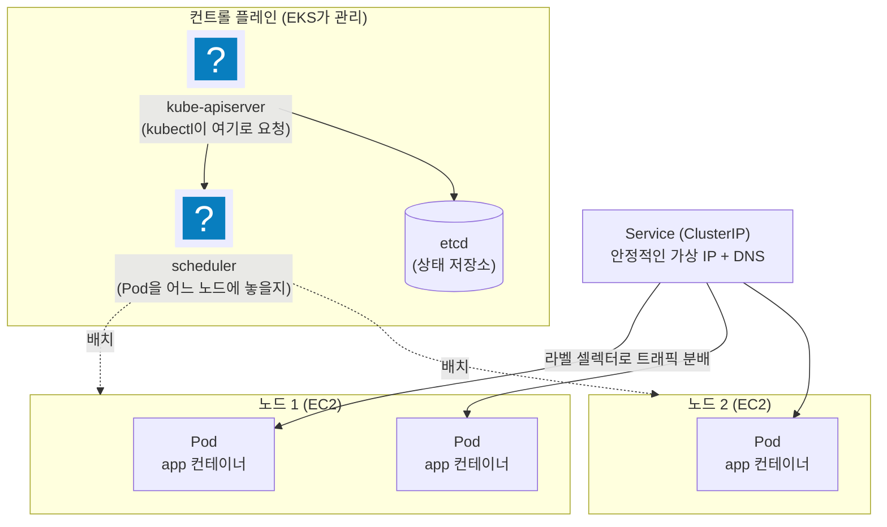

import { Quiz, QuizResults } from 'starlight-quiz/components';
import { Steps, LinkButton } from '@astrojs/starlight/components';

> 문서 유형: explanation

> eks-study PART-1 Kubernetes Basics의 4개 모듈(core-concepts / services-networking / config-storage / rbac-helm)을 선수 지식 수준으로 압축한 파일이다. 심화는 전부 PART-2에서 EKS로 다룬다.

## ① 학습 목표

- [ ] Pod / ReplicaSet / Deployment / Namespace의 관계를 한 문장씩 설명할 수 있다
- [ ] Service 타입(ClusterIP/NodePort/LoadBalancer)의 차이와 대회에서 ClusterIP만 주로 쓰는 이유를 안다
- [ ] ConfigMap과 Secret의 용도 차이를 안다
- [ ] ServiceAccount가 "Pod의 신원"이라는 개념을 안다 (IRSA는 개념만)
- [ ] `kubectl apply / get / describe / logs / exec / rollout restart`를 쓸 수 있다

## ② 핵심 개념

### 2-1. 클러스터 구조

Kubernetes = **컨트롤 플레인**(두뇌)이 **노드**(작업자, EC2)에 컨테이너를 배치·감시하는 시스템. EKS에서는 AWS가 컨트롤 플레인을 관리하므로 노드와 그 위의 리소스만 다룬다.



### 2-2. 워크로드 4총사 (core-concepts)

| 용어 | 한 줄 정의 |
|---|---|
| Pod | 컨테이너 1개 이상을 묶은 **최소 배포 단위**. IP를 하나 받음. 죽으면 그걸로 끝(스스로 부활 안 함) |
| ReplicaSet | "이 Pod을 N개 유지하라"는 감시자. 죽으면 새로 띄움 |
| Deployment | ReplicaSet을 관리하는 상위 객체. **롤링 업데이트·롤백** 담당. 실무/대회에서 Pod은 거의 항상 Deployment로 만든다 |
| Namespace | 리소스를 담는 논리적 폴더. `kubectl get pod -n <ns>`처럼 항상 ns를 의식해야 함 |

관계: **Deployment → ReplicaSet → Pod** (내가 직접 만지는 건 Deployment뿐).

### 2-3. Service와 네트워킹 (services-networking)

Pod IP는 재시작마다 바뀐다 → **Service**가 고정 가상 IP + DNS 이름을 제공하고, 라벨 셀렉터로 뒤의 Pod들에 트래픽을 분배한다.

| 타입 | 노출 범위 | 대회 사용 |
|---|---|---|
| ClusterIP | 클러스터 내부 전용 (기본값) | ✅ 주력 |
| NodePort | 각 노드의 30000번대 포트로 노출 | 거의 안 씀 |
| LoadBalancer | 클라우드 LB 자동 생성 | 안 씀 (LB는 Terraform으로 만듦) |

- **CoreDNS**: 클러스터 내부 DNS. `<svc>.<ns>.svc.cluster.local`로 서비스 이름을 IP로 풀어 줌.
- **Ingress**: HTTP 라우팅 규칙 객체 — 개념만 알아두면 됨. 대회에서는 안 쓴다(③·④ 참고).

### 2-4. 설정과 저장 (config-storage)

| 용어 | 한 줄 정의 |
|---|---|
| ConfigMap | 평문 설정(환경변수·설정파일)을 Pod에 주입 |
| Secret | 민감 정보용. base64 인코딩일 뿐 **암호화가 아님** — 그래서 EKS에선 KMS로 추가 암호화한다 |
| PV / PVC | PV = 실제 스토리지(EBS 등), PVC = "이만큼 주세요" 요청서. Pod은 PVC를 마운트 |

주입 방법 2가지: 환경변수(`envFrom.configMapRef`) 또는 볼륨 마운트(파일로).

### 2-5. 신원과 패키지 (rbac-helm)

- **ServiceAccount(SA)**: Pod이 쓰는 신원. 사람의 IAM 사용자에 해당하는 "Pod의 명찰".
- **RBAC**: Role(권한 목록) + RoleBinding(누구에게 줄지)으로 SA/사용자의 클러스터 내 권한 제어.
- **Helm**: k8s의 패키지 매니저. `helm install <이름> <차트> --version X.Y.Z`로 복잡한 앱(수십 개 YAML)을 한 번에 설치.

## ③ 대회 실전 아키텍처

②의 개념들이 대회 과제에서 실제로 조립되는 모습 전체를 한 장으로 본다. 지금 전부 이해할 필요는 없다 — **PART-2가 끝나면 이 그림을 안 보고 그릴 수 있어야 한다**는 목표 지점이다.

```mermaid
flowchart TB
    CF@{ icon: "logos:aws-cloudfront", form: "square", label: "CloudFront", pos: "b", h: 46, w: 46 }
    ALB@{ icon: "logos:aws-elb", form: "square", label: "ALB (Terraform 생성 — 이름 채점)", pos: "b", h: 46, w: 46 }
    CF -->|"오리진"| ALB
    ALB -->|"포워드"| TG["ALB TargetGroup<br/>(타깃 타입: IP)"]

    subgraph CLUSTER["<span class='icon--logos icon--logos--aws-eks'></span> EKS 클러스터"]
        subgraph NGADDON["<span class='icon--logos icon--logos--aws-ec2'></span> addon 노드그룹 (taint/label: node-type=addon)"]
            LBC@{ icon: "logos:helm", form: "square", label: "Helm 릴리스: LBC<br/>(AWS Load Balancer Controller)", pos: "b", h: 46, w: 46 }
            KPS@{ icon: "logos:prometheus", form: "square", label: "Helm 릴리스:<br/>kube-prometheus-stack", pos: "b", h: 46, w: 46 }
            FB1@{ icon: "simple-icons:fluentbit", form: "square", label: "DaemonSet: Fluent Bit", pos: "b", h: 46, w: 46 }
        end
        subgraph NGAPP["<span class='icon--logos icon--logos--aws-ec2'></span> app 노드그룹 (label: node-type=app)"]
            FB2@{ icon: "simple-icons:fluentbit", form: "square", label: "DaemonSet: Fluent Bit", pos: "b", h: 46, w: 46 }
            subgraph NSAPP["<span class='icon--logos icon--logos--kubernetes'></span> Namespace: app (채점이 ns 검사)"]
                DEP["Deployment<br/>replicas 2 · probe 3종<br/>topologySpread(AZ)"]
                POD1["Pod"]
                POD2["Pod"]
                PDB["PDB"]
                CM["ConfigMap"]
                SEC["Secret (KMS 암호화)"]
                SA["ServiceAccount"]
                SVC["Service (ClusterIP)"]
                TGB["TargetGroupBinding"]
            end
        end
        NSMON["Namespace: monitoring<br/>(kube-prometheus-stack 리소스)"]
    end
    IAM@{ icon: "logos:aws-iam", form: "square", label: "AWS IAM Role", pos: "b", h: 46, w: 46 }

    DEP -->|"생성·유지"| POD1
    DEP -->|"생성·유지"| POD2
    DEP -.->|"nodeSelector·toleration으로 스케줄"| NGAPP
    PDB -.->|"동시 중단 제한"| POD1
    CM -->|"환경변수 주입"| POD1
    SEC -->|"주입"| POD1
    SA -->|"Pod의 신원"| POD1
    SA -.->|"IRSA / Pod Identity 연결"| IAM
    SVC -->|"라벨 셀렉터로 선택"| POD1
    SVC -->|"선택"| POD2
    TGB -->|"Service 뒤 Pod IP 등록"| TG
    LBC -.->|"TGB를 읽어 등록 실행"| TGB
    KPS -.-> NSMON
```



| 리소스 | 한 줄 역할 |
|---|---|
| Namespace (app / monitoring) | 앱과 모니터링을 분리하는 폴더 — 채점이 ns 단위로 Pod 배치를 검사 |
| Deployment | replicas 2 + probe + nodeSelector/toleration + topologySpread로 앱 Pod 유지·분산 |
| PDB | 노드 교체·업그레이드 시 Pod이 한꺼번에 죽지 않게 최소 가용 수 보장 |
| ConfigMap / Secret | 설정·민감정보를 Pod에 주입 (Secret은 KMS envelope 암호화 대상) |
| ServiceAccount | Pod의 신원 — IRSA/Pod Identity로 AWS IAM Role과 연결 |
| Service (ClusterIP) | 라벨 셀렉터로 Pod들을 묶는 클러스터 내부 고정 접점 |
| TargetGroupBinding | Service 뒤 Pod IP들을 ALB TargetGroup에 직접 등록 (Ingress 대체) |
| ALB → CloudFront | Terraform으로 생성 — ALB 이름 채점 때문에 Ingress를 안 씀 |
| DaemonSet (Fluent Bit) | **전 노드에 1개씩** 배치되어 로그 수집 |
| Helm 릴리스 (LBC / kube-prometheus-stack) | addon 노드에 설치, 차트 버전 고정 원칙 |
| 노드그룹 2분할 (addon / app) | taint/label로 애드온과 앱 워크로드를 서로 다른 노드에 격리 |

## ④ 대회에서 어떻게 쓰이나

- **Deployment가 채점의 중심**: replicas, liveness/readiness/startup probe, nodeSelector·toleration(전용 노드그룹 배치), topologySpreadConstraints(AZ 분산), PDB, preStop 훅까지 요구된다 — 전부 **PART-2 모듈 05**에서 심화.
- **Service는 ClusterIP만**: 외부 노출은 Ingress가 아니라 **Terraform으로 만든 ALB + TargetGroupBinding**(Pod IP를 타깃그룹에 직접 등록). Ingress로 만든 ALB는 이름을 지정할 수 없어서 "ALB 이름 채점"을 통과 못 한다.
- **ConfigMap**으로 앱 설정(DB 호스트 등)을 주입하고, **Secret**은 KMS envelope 암호화(모듈 08)의 대상이 된다.
- **ServiceAccount**는 IRSA/Pod Identity로 AWS IAM 권한과 연결된다 — "Pod이 S3에 접근하는 방법". 개념만 잡고 PART-2 모듈 04에서 심화.
- **Helm**은 AWS Load Balancer Controller, kube-prometheus-stack 설치에 쓴다. **차트 버전 고정**이 원칙(버전 미고정 = 대회 당일 다른 버전이 설치되는 사고).

:::danger[Namespace를 틀리면 0점]
채점 스크립트(mark.sh)는 "특정 ns에 Pod이 있는가"를 검사한다. 리소스가 멀쩡해도 ns가 틀리면 점수가 0이다.
:::

**kubectl 필수 명령** (손에 익혀야 하는 것):

```bash
kubectl apply -f k8s/           # 파일명 번호 prefix(00-, 10-...) 순서로 적용
kubectl get pod -n <ns> -o wide # 상태·노드 배치 확인
kubectl describe pod <pod>      # ★ Events 섹션이 디버깅 1순위
kubectl logs <pod> --previous   # 재시작 전(죽기 직전) 로그
kubectl rollout restart deploy/<name>  # ConfigMap 변경 후 재기동
kubectl exec -it <pod> -- sh    # 컨테이너 안에서 curl 등 확인
```

## ⑤ 미니 실습 (클러스터 없이 / 로컬)

### 실습 A — YAML 읽기 훈련 (클러스터 불필요, 30분)

skills-2026 저장소의 `set-02/task-1/k8s/app/deployment.yaml`을 열고 각 필드를 소리 내어 설명해 본다:

- `metadata.namespace: wskorea26` — 어느 폴더에 만들지 (채점 대상)
- `spec.replicas: 2` + `topologySpreadConstraints`(zone) — AZ당 1개씩 분산
- `spec.selector.matchLabels` ↔ `template.metadata.labels` — 둘이 일치해야 함
- `serviceAccountName` — IRSA로 IAM 권한을 받는 명찰
- `nodeSelector: node-type: app` — app 전용 노드에만 배치
- `envFrom.configMapRef` — ConfigMap을 환경변수로 주입
- `livenessProbe`/`readinessProbe`(`/health`) — 죽었나 / 트래픽 받을 준비 됐나
- `lifecycle.preStop: sleep 15` + `terminationGracePeriodSeconds: 45` — 무중단 종료

설명 못 하는 필드가 있으면 ②로 돌아가서 다시 읽는다.

### 실습 B — 로컬 클러스터 (선택, 1시간)

kind(Docker 필요)로 1노드 클러스터를 띄워 명령을 손에 익힌다:

<Steps>

1. **kind 설치 · 클러스터 생성**

   ```bash
   # 설치 (Windows / winget)
   winget install Kubernetes.kind
   kind create cluster
   ```

2. **Deployment와 Service 만들기**

   ```bash
   kubectl create namespace demo
   kubectl create deployment web --image=nginx --replicas=2 -n demo
   kubectl expose deployment web --port=80 -n demo          # ClusterIP Service
   ```

3. **상태 확인과 Events 읽기**

   ```bash
   kubectl get pod,svc -n demo -o wide
   kubectl describe pod -n demo -l app=web                  # Events 읽기
   ```

4. **자가 복구 확인**

   ```bash
   kubectl delete pod -n demo -l app=web                    # 지워도 ReplicaSet이 되살림 확인
   kubectl get pod -n demo                                  # 새 Pod 확인
   ```

5. **정리**

   ```bash
   kind delete cluster
   ```

</Steps>

로컬이 부담스러우면 생략 가능 — **PART-2 모듈 04~05에서 EKS로 동일 내용을 실습**한다.

## ⑥ 자기 점검 퀴즈

<Quiz title="왜 Pod 대신 Deployment인가">
Pod을 직접 만들지 않고 Deployment로 만드는 이유를 **모두** 고르시오.

- [x] Pod이 죽어도 ReplicaSet이 개수를 유지한다 (자가 복구)
- [x] 롤링 업데이트와 롤백이 가능하다
- [ ] Deployment로 만든 Pod만 Service의 라벨 셀렉터에 잡힌다
  > Service는 **라벨만** 본다. 누가 만들었는지는 상관없다 — 라벨만 맞으면 직접 만든 Pod도 그대로 엔드포인트에 등록된다.
- [ ] 단독 Pod은 Namespace에 속할 수 없어 `-n` 지정이 불가능하다
  > 모든 Pod은 Namespace에 속한다. Deployment와 무관한 성질이다.

관계는 **Deployment → ReplicaSet → Pod**. 단독 Pod은 죽으면 그걸로 끝이고(스스로 부활하지 않음) 이미지 태그를 바꿔 무중단으로 교체할 방법도 없다. 실무·대회에서 Pod은 거의 항상 Deployment로 만든다 — 그래야 replicas·probe·topologySpread·롤백 같은 채점 항목이 성립한다.
</Quiz>

<Quiz title="ConfigMap을 고쳤는데 반영이 안 될 때">
ConfigMap을 수정했는데 Pod의 환경변수가 예전 값 그대로다. 무엇을 해야 하나?

- [x] `kubectl rollout restart deploy/<name>` — Pod을 새로 띄워 값을 다시 주입한다
- [ ] `kubectl apply -f configmap.yaml` 을 한 번 더 실행한다
  > ConfigMap 자체는 이미 갱신되어 있다. 문제는 **이미 떠 있는 Pod**이 옛 값을 들고 있다는 것이므로, ConfigMap을 다시 적용해도 아무 변화가 없다.
- [ ] `kubectl delete pod -l app=<name>` 으로 Pod을 지운다
  > 결과적으로는 새 Pod이 뜨므로 값은 반영된다. 다만 한꺼번에 죽여 순단이 생기고 PDB·롤링 전략을 우회한다 — `rollout restart` 가 순차 교체라 안전하다.
- [ ] ConfigMap에 `reloadOnChange: true` 를 추가한다

**환경변수 주입(`envFrom.configMapRef`)은 Pod 시작 시점에 딱 한 번 일어난다.** 이후 ConfigMap이 바뀌어도 실행 중인 컨테이너의 환경변수는 절대 바뀌지 않는다. `kubectl rollout restart deploy/<name>` 으로 Pod을 순차 재생성해야 한다. (참고: **볼륨 마운트**로 주입한 경우는 파일 내용이 자동 갱신되지만, 앱이 파일을 다시 읽어야 의미가 있다.)
</Quiz>

<Quiz title="대회에서 Ingress를 쓰지 않는 이유">
대회에서 앱을 외부에 노출할 때 Ingress를 쓰지 않는 이유는?

- [x] Ingress가 만드는 ALB는 이름을 지정할 수 없어 "ALB 이름 채점"을 통과할 수 없다. 대신 Terraform으로 ALB를 만들고 TargetGroupBinding으로 Pod IP를 타깃그룹에 직접 등록한다
- [ ] Ingress를 쓰면 AWS Load Balancer Controller를 추가로 설치해야 하는데 그 시간이 아깝기 때문
  > LBC는 **어느 쪽이든 필요하다**. TargetGroupBinding을 읽어 Pod IP를 타깃그룹에 등록해 주는 것도 LBC다. 설치 여부가 아니라 **ALB 이름을 누가 정하느냐**가 갈림길이다.
- [ ] Ingress는 ClusterIP Service를 백엔드로 쓸 수 없어 NodePort로 바꿔야 하기 때문
  > 타깃 타입 `ip` 모드에서는 ClusterIP Service를 그대로 쓴다. NodePort가 필수였던 것은 `instance` 모드 이야기다.
- [ ] EKS는 Ingress 리소스를 지원하지 않는다

채점이 **ALB의 이름**을 보기 때문이다. Ingress가 생성하는 ALB는 이름이 자동 생성되어 지정할 수 없다. 그래서 ALB는 **Terraform으로 이름까지 정해서** 만들고, 그 타깃그룹에 `TargetGroupBinding`으로 Service 뒤의 Pod IP를 직접 등록한다. 흐름: CloudFront → ALB(Terraform) → TargetGroup ← TargetGroupBinding ← Service(ClusterIP) → Pod.
</Quiz>

<Quiz title="CrashLoopBackOff 1차 진단">
Pod이 `CrashLoopBackOff` 다. 가장 먼저 실행할 두 명령은? **모두** 고르시오.

- [x] `kubectl describe pod <pod>` — Events 섹션에서 이미지 pull 실패·스케줄 실패·probe 실패 원인을 본다
- [x] `kubectl logs <pod> --previous` — 죽기 직전 컨테이너의 로그를 본다
- [ ] `kubectl exec -it <pod> -- sh` — 컨테이너 안에 들어가 확인한다
  > 컨테이너가 계속 죽는 중이라 붙을 대상이 없다. `error: unable to upgrade connection` 만 보고 시간을 버린다.
- [ ] `kubectl logs <pod>` — 현재 컨테이너 로그를 본다
  > 재시작 대기(BackOff) 중에는 현재 컨테이너가 없거나 방금 시작된 상태라 로그가 비어 있기 쉽다. 원인은 **죽기 직전** 로그에 있으므로 `--previous` 가 필요하다.

`describe` 의 **Events 섹션이 디버깅 1순위**다(ImagePullBackOff, Insufficient cpu, Readiness probe failed 등이 여기 찍힌다). 그다음이 `logs --previous` — 앱이 왜 스스로 종료했는지는 죽기 직전 로그에만 남는다.
</Quiz>

<Quiz title="Secret은 무엇으로 보강하나">
Secret은 base64 인코딩일 뿐 암호화가 아니다. EKS/대회에서는 이것을 [[KMS]] envelope 암호화로 보강한다.

---

base64는 누구나 되돌릴 수 있는 **인코딩**이지 암호화가 아니다. EKS 클러스터의 Secret 암호화 설정으로 **KMS envelope 암호화**를 켜면, etcd에 저장되는 Secret이 KMS 키로 감싼 데이터 키로 암호화된다. PART-3 모듈 08에서 실습하며, 이때 쓰는 KMS 키 정책이 대회 유형의 **root-less** 정책이다 — root로 리소스를 만들어 두면 여기서 전부 막힌다.
</Quiz>

<QuizResults confetti />

## ⑦ 다음 단계

모듈 04(EKS·IRSA)와 모듈 05(k8s 워크로드 심화)에서 이 내용을 EKS 위에서 실전 수준으로 확장한다.

<LinkButton href="/start/awscli-basics/" icon="right-arrow">다음 선수 학습 — AWS CLI 기초</LinkButton>
<LinkButton href="/part-2/04-eksctl-cluster/" variant="minimal">PART 2 — EKS Core</LinkButton>

## 공식 문서

- [Kubernetes 개념](https://kubernetes.io/docs/concepts/) — 워크로드·서비스·설정 전반
- [kubectl 퀵 레퍼런스](https://kubernetes.io/docs/reference/kubectl/quick-reference/) — 명령 모음
- [API 레퍼런스](https://kubernetes.io/docs/reference/kubernetes-api/) — 매니페스트 필드의 정본
- [Helm 문서](https://helm.sh/docs/) — 차트·values 개념
