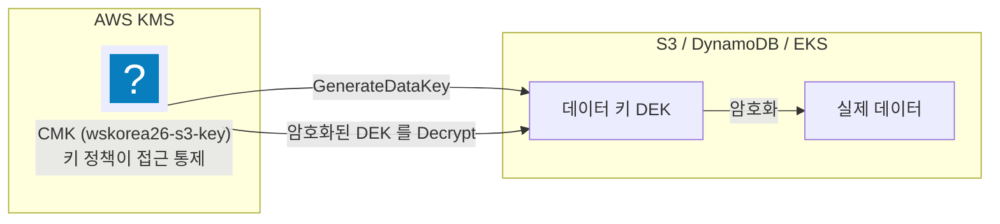
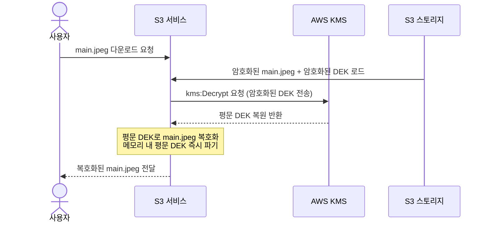

import { Quiz, QuizResults } from 'starlight-quiz/components';
import { Steps, LinkButton } from '@astrojs/starlight/components';

> 문서 유형: explanation

## ① 학습 목표

- [ ] Envelope Encryption(봉투 암호화)과 CMK, DEK의 관계를 설명할 수 있다
- [ ] KMS 키 정책(Key Policy)과 IAM 정책의 차이를 이해하고, 왜 KMS는 키 정책이 필수인지 설명할 수 있다
- [ ] KMS 권한을 관리용(Admin)과 사용용(Use)으로 분류하고, 각각에 필요한 핵심 액션을 나열할 수 있다
- [ ] root-less KMS 키 정책의 취지와 구성 방안을 알고, Lockout Safety Check로 인한 빌드 실패를 예방할 수 있다

---

## ② 핵심 개념

### 1. 봉투 암호화 (Envelope Encryption)

데이터를 암호화할 때, 모든 데이터를 하나의 마스터 키로 직접 암호화하면 대용량 파일 처리 시 성능 저하가 발생하고 마스터 키가 과도하게 노출될 위험이 있다. 이를 해결하기 위해 AWS KMS는 **봉투 암호화(Envelope Encryption)** 구조를 사용한다.

*   **CMK (Customer Master Key / KMS 키)**: KMS 내부 하드웨어 보안 모듈(HSM)에서 안전하게 관리하며 외부로 유출되지 않는 마스터 키다. 데이터를 직접 암호화하지 않고, 데이터 키(DEK)를 암호화하거나 복호화하는 용도로만 사용한다.
*   **DEK (Data Encryption Key / 데이터 키)**: 실제 대용량 데이터를 고속으로 암호화하고 복호화하는 일회성 대칭 키다. S3 버킷이나 DynamoDB 등 개별 서비스의 메모리에서 사용한다.

#### 작동 원리 — S3 파일 암호화 및 복호화 흐름

S3 버킷에 파일(`main.jpeg`)을 업로드하고 다운로드할 때 일어나는 아키텍처 흐름을 통해 DEK의 실제 용도를 이해한다.

##### A. 데이터를 암호화하여 저장할 때 (Encrypt 과정)

사용자가 S3 버킷에 `main.jpeg` 파일을 업로드할 때 발생하는 동작은 다음과 같다.

1.  **DEK 요청**: S3 서비스는 AWS KMS로 `kms:GenerateDataKey` 요청을 전송한다. "이 파일을 암호화할 임시 DEK 하나를 생성해 달라"는 의미다.
2.  **DEK 생성**: KMS는 CMK를 사용하여 두 개의 DEK를 생성하여 S3로 반환한다.
    *   **평문 DEK**: 파일을 직접 암호화하는 진짜 열쇠
    *   **암호화된 DEK**: CMK로 단단히 암호화하여 보호된 키
3.  **데이터 암호화**: S3는 평문 DEK를 사용하여 `main.jpeg` 파일을 암호화한다. 암호화가 완료되면 보안을 위해 메모리 내 평문 DEK를 즉시 파기한다.
4.  **세트 저장**: S3는 암호화된 파일과 암호화된 DEK를 한 세트로 묶어 S3 스토리지에 함께 저장한다.



##### B. 데이터를 읽어올 때 (Decrypt 과정)

사용자가 S3 버킷에 저장된 `main.jpeg` 파일을 다시 다운로드할 때 발생하는 동작은 다음과 같다.

1.  **복호화 요청**: S3는 저장소에서 암호화된 DEK를 추출하여 AWS KMS로 `kms:Decrypt` 요청과 함께 전송한다. "이 암호화된 DEK를 복호화해 달라"는 의미다.
2.  **DEK 복원**: KMS는 내부 CMK로 암호화된 DEK를 해독하여 평문 DEK를 복원한 뒤 S3로 반환한다.
3.  **데이터 복호화**: S3는 전달받은 평문 DEK를 사용하여 암호화된 파일을 원래 상태로 복호화한다. 복호화가 완료되면 보안을 위해 메모리 내 평문 DEK를 즉시 파기한다.
4.  **파일 전달**: S3는 복호화된 `main.jpeg` 파일을 사용자에게 전달한다.



---

### 2. KMS 키 정책 (Key Policy)

KMS 키는 리소스 기반 정책(Resource-based Policy)인 **키 정책(Key Policy)**에 의해 강력하게 통제됩니다.

:::danger[KMS 키 정책의 강력한 고립 특성]
IAM 정책과 달리, KMS 키 정책은 **"키 정책에서 명시적으로 허용하지 않으면, IAM 관리자(AdministratorAccess)나 root 사용자도 해당 키에 접근할 수 없다"**는 규칙이 적용됩니다. 키 정책 설계가 잘못되면 누구도 키를 관리하거나 삭제할 수 없는 **락아웃(Lockout)** 상태가 발생합니다.
:::

키 정책은 보통 두 가지 권한 주체로 구분하여 설계합니다.

| 권한 유형 | 대상 주체 (Principal) | 허용해야 하는 핵심 액션 (Actions) |
|---|---|---|
| **관리 권한 (Admin)** | 배포자 IAM 사용자/역할 (또는 계정 root) | `kms:Create*`, `kms:PutKeyPolicy`, `kms:Describe*`, `kms:Enable*`, `kms:Disable*`, `kms:ScheduleKeyDeletion` 등 |
| **사용 권한 (Use)** | 키를 사용하는 역할/서비스 (예: S3, ECR, EKS Node) | `kms:Encrypt`, `kms:Decrypt`, `kms:GenerateDataKey*`, `kms:DescribeKey`, `kms:CreateGrant` |

---

## ③ 대회에서 어떻게 쓰이나

### 1. Set-03 유형: root-less KMS 키 정책

전국기능경기대회 1과제 Set-03 등 일부 과제에서는 보안 강화를 위해 **"KMS 키 정책에 root principal 및 `kms:*` 와일드카드를 포함하지 말 것"**을 요구합니다. 이를 **root-less 키 정책**이라 부릅니다.

*   **취지**: 계정 소유자(`root`)조차 키 정책에 명시되지 않으면 키를 사용할 수 없도록 완벽히 고립시키는 설계입니다.
*   **구현 방법**:
    *   `aws_iam_session_context`를 활용하여 **"현재 배포를 실행 중인 IAM 신원(예: Administrator 권한을 가진 CLI 사용자)"**을 조회해 관리자(`Admin`) Principal로 명시합니다.
    *   `kms:*` 대신 관리/운영에 필요한 개별 API 액션 리스트를 수동으로 전부 나열합니다.
*   **Lockout Safety Check**: AWS KMS API는 사용자가 키 정책을 업데이트할 때, "이 키 정책을 적용하면 앞으로 이 키를 관리할 수 있는 주체가 없어지는가(Lockout)?"를 자동으로 검사합니다. 만약 `kms:PutKeyPolicy`나 `kms:Create*` 같은 핵심 관리 액션이 빠져 있다면, Terraform apply 단계에서 `MalformedPolicyDocumentException` 에러가 발생하며 생성이 거부됩니다.

### 2. Alias(별칭) 기반 채점

대회 채점 스크립트(`mark.sh`)는 KMS 키를 검증할 때 키 ID(UUID) 대신 **KMS Alias(예: `alias/wskorea26-s3-key`)**를 역조회하여 암호화 여부를 채점합니다.
따라서 Terraform 코드에서 `aws_kms_key`뿐만 아니라 `aws_kms_alias`를 정확한 별칭 이름으로 생성하고 매핑해야만 점수를 획득할 수 있습니다.

### 3. 순환 참조(Cycle) 오류 방지

KMS 키 정책에서 특정 S3 버킷이나 CloudFront 배포판의 ARN을 직접 참조하고, 반대로 S3 버킷/CloudFront에서 KMS 키의 ARN을 참조하면 **Terraform 종속성 순환 참조(Cycle Error)**가 발생합니다.
*   **해결책**: KMS 키 정책 내 `Condition` 블록에서 구체적인 리소스 인스턴스 대신 계정 ID(`aws_caller_identity`로 조회한 계정 ID)나 플레이어 번호 변수를 조합하여 동적으로 평가되도록 우회 설계합니다.

---

## ④ 핵심 코드 패턴

### 1. root-less 키 정책을 위한 Admin 액션 목록 정의

```hcl
locals {
  # "kms:*"를 쓰지 않고 lockout을 예방하기 위한 최소 관리 액션 세트
  kms_admin_actions = [
    "kms:Create*", "kms:Describe*", "kms:Enable*", "kms:List*",
    "kms:Put*",    "kms:Update*",   "kms:Revoke*", "kms:Disable*",
    "kms:Get*",    "kms:Delete*",   "kms:TagResource", "kms:UntagResource",
    "kms:ScheduleKeyDeletion", "kms:CancelKeyDeletion", "kms:RotateKeyOnDemand",
    "kms:Encrypt", "kms:Decrypt",   "kms:ReEncrypt*",  "kms:GenerateDataKey*",
    "kms:CreateGrant", "kms:RetireGrant"
  ]
}
```

### 2. CLI를 이용한 KMS 키 상태 자가 검증

실습 중 KMS 키가 정상 생성되고 올바르게 작동하는지 CLI로 빠르게 점검하는 습관이 중요합니다.

```bash
# 1. 특정 Alias를 가진 KMS 키의 상세 정보 조회
aws kms describe-key --key-id alias/wskorea26-s3-key --query 'KeyMetadata.[KeyState,KeyManager]'

# 2. KMS 키의 default 키 정책 내용 확인
aws kms get-key-policy --key-id alias/wskorea26-s3-key --policy-name default --output text
```

---

## ⑤ 자기 점검 퀴즈

<Quiz title="봉투 암호화 키 역할 구분">
봉투 암호화(Envelope Encryption) 흐름에서 실제 고속 데이터 암호화/복호화에 직접 사용되며, 사용 직후 메모리에서 파기되어야 하는 1회성 대칭 키의 명칭은 무엇인가?

- [ ] CMK (Customer Master Key)
  > CMK는 KMS HSM 내부에 안전하게 보관되는 마스터 키로, 실제 데이터가 아닌 DEK를 암호화/복호화하는 용도입니다.
- [x] DEK (Data Encryption Key)
  > DEK는 실제 대용량 데이터를 빠르게 암호화하기 위해 사용되며, 암호화가 완료되면 메모리에서 즉시 삭제됩니다.
- [ ] OAC (Origin Access Control)
  > OAC는 CloudFront가 S3에 안전하게 접근하기 위한 인증 구성 요소입니다.
- [ ] IAM Role Policy
  > IAM 정책은 자격 증명에 매핑되는 권한 정의 문서입니다.
</Quiz>

<Quiz title="KMS 키 정책의 lockout 예방">
KMS 키 정책 작성 중, root principal을 제외하는 `root-less` 키 정책을 만들고자 한다. 이때 AWS KMS API가 잘못된 키 정책으로 인해 키를 영구히 조작할 수 없게 되는 상황을 방지하기 위해 수행하는 자동 검사 메커니즘의 명칭은?

- [ ] Lockout Safety Check
  > 정답입니다. AWS KMS는 키 관리 권한(`kms:PutKeyPolicy` 등)이 유효한 Principal에게 부여되어 있는지 확인하여 락아웃을 방지합니다. 이 검사에 실패하면 `MalformedPolicyDocumentException` 에러와 함께 생성이 실패합니다.
- [ ] IAM Boundary Check
  > IAM 권한 경계(Permission Boundary)는 IAM 역할이 가질 수 있는 최대 권한을 제한하는 메커니즘입니다.
- [ ] STS Trust Verification
  > STS 신뢰 관계 검증은 AssumeRole 시에 수행하는 신원 문지기 평가입니다.
- [ ] KMS Auto Rotation
  > KMS 자동 로테이션은 마스터 키의 백업 키 세트를 주기적으로 교체해 주는 기능입니다.
</Quiz>

<Quiz title="KMS 정책 및 채점 원리">
KMS 키 정책과 대회 채점 원리에 대한 설명으로 올바른 것을 **모두** 고르시오.

- [x] KMS 키는 키 정책이 존재하지 않거나 관리자 권한 허용이 누락되면 root 계정을 포함한 모든 신원의 접근이 완전히 차단될 수 있다.
- [x] 대회 채점 스크립트(mark.sh)는 대개 리소스가 어떤 CMK로 암호화되었는지를 KMS Alias(별칭)를 조회하여 판별한다.
- [x] S3 SSE-KMS나 DynamoDB SSE 등 실제 데이터 쓰기/읽기 서비스 역할에 필요한 최소 권한은 `kms:Decrypt`와 `kms:GenerateDataKey*`이다.
- [ ] KMS 키 정책에서 다른 리소스(예: S3 버킷)의 ARN을 직접 하드코딩하여 참조하는 것이 순환 참조(Cycle)를 방지하는 가장 좋은 방법이다.
  > 틀렸습니다. KMS 키 정책에서 S3 버킷 ARN을 참조하고, S3 버킷 구성에서 해당 KMS 키 ARN을 참조하면 상호 의존성으로 인해 Terraform 순환 참조 오류가 발생합니다. 계정 ID 등의 동적 조건식을 사용해 결합도를 낮추어야 합니다.

**KMS 핵심 정리**: ① 강력한 독립성(키 정책이 만능 통제관), ② Alias 매핑은 채점의 필수 요소, ③ 순환 참조 우회는 HCL 설계의 핵심 스킬입니다.
</Quiz>

<QuizResults confetti />

---

## ⑥ 다음 단계

이제 실제 암호화 실습과 버킷/CDN 연동 과정을 공부해보세요.

<LinkButton href="/start/docker-basics/" icon="right-arrow">다음 선수 학습 — Docker 기초</LinkButton>
<LinkButton href="/part-1/02-kms-s3-cloudfront/" variant="minimal">PART 1 — KMS + S3 + CloudFront 실습</LinkButton>

## 공식 문서

- [AWS KMS 개발자 가이드](https://docs.aws.amazon.com/kms/latest/developerguide/) — 봉투 암호화 및 키 정책 설계 요령
- [AWS KMS lockout 방지 대책](https://docs.aws.amazon.com/kms/latest/developerguide/key-policies.html#key-policy-default-lockout) — MalformedPolicyDocument 예방 수칙
