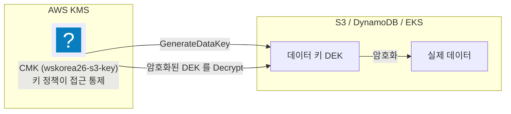
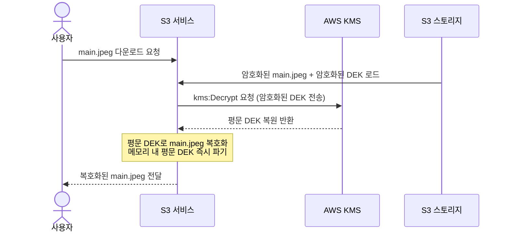

import { Quiz, QuizResults } from 'starlight-quiz/components';
import { Steps, LinkButton } from '@astrojs/starlight/components';

> 문서 유형: explanation

## ① 학습 목표

- [ ] Envelope Encryption(봉투 암호화)과 CMK, DEK의 관계를 설명할 수 있다
- [ ] KMS 키 정책(Key Policy)과 IAM 정책의 차이를 이해하고, 왜 KMS는 키 정책이 필수인지 설명할 수 있다
- [ ] KMS 권한을 관리용(Admin)과 사용용(Use)으로 분류하고, 각각에 필요한 핵심 액션을 나열할 수 있다
- [ ] root-less KMS 키 정책의 취지와 구성 방안을 알고, Lockout Safety Check로 인한 빌드 실패를 예방할 수 있다

---

## ② 핵심 개념

### 1. 봉투 암호화 (Envelope Encryption)

데이터를 암호화할 때, 모든 데이터를 하나의 마스터 키로 직접 암호화하면 대용량 파일 처리 시 성능 저하가 발생하고 마스터 키가 과도하게 노출될 위험이 있다. 이를 해결하기 위해 AWS KMS는 **봉투 암호화(Envelope Encryption)** 구조를 사용한다.

*   **CMK (Customer Master Key / KMS 키)**: KMS 내부 하드웨어 보안 모듈(HSM)에서 안전하게 관리하며 외부로 유출되지 않는 마스터 키다. 데이터를 직접 암호화하지 않고, 데이터 키(DEK)를 암호화하거나 복호화하는 용도로만 사용한다.
*   **DEK (Data Encryption Key / 데이터 키)**: 실제 대용량 데이터를 고속으로 암호화하고 복호화하는 일회성 대칭 키다. S3 버킷이나 DynamoDB 등 개별 서비스의 메모리에서 사용한다.

#### 작동 원리 — S3 파일 암호화 및 복호화 흐름

S3 버킷에 파일(`main.jpeg`)을 업로드하고 다운로드할 때 일어나는 아키텍처 흐름을 통해 DEK의 실제 용도를 이해한다.

##### A. 데이터를 암호화하여 저장할 때 (Encrypt 과정)

사용자가 S3 버킷에 `main.jpeg` 파일을 업로드할 때 발생하는 동작은 다음과 같다.

1.  **DEK 요청**: S3 서비스는 AWS KMS로 `kms:GenerateDataKey` 요청을 전송한다. "이 파일을 암호화할 임시 DEK 하나를 생성해 달라"는 의미다.
2.  **DEK 생성**: KMS는 CMK를 사용하여 두 개의 DEK를 생성하여 S3로 반환한다.
    *   **평문 DEK**: 파일을 직접 암호화하는 진짜 열쇠
    *   **암호화된 DEK**: CMK로 단단히 암호화하여 보호된 키
3.  **데이터 암호화**: S3는 평문 DEK를 사용하여 `main.jpeg` 파일을 암호화한다. 암호화가 완료되면 보안을 위해 메모리 내 평문 DEK를 즉시 파기한다.
4.  **세트 저장**: S3는 암호화된 파일과 암호화된 DEK를 한 세트로 묶어 S3 스토리지에 함께 저장한다.



##### B. 데이터를 읽어올 때 (Decrypt 과정)

사용자가 S3 버킷에 저장된 `main.jpeg` 파일을 다시 다운로드할 때 발생하는 동작은 다음과 같다.

1.  **복호화 요청**: S3는 저장소에서 암호화된 DEK를 추출하여 AWS KMS로 `kms:Decrypt` 요청과 함께 전송한다. "이 암호화된 DEK를 복호화해 달라"는 의미다.
2.  **DEK 복원**: KMS는 내부 CMK로 암호화된 DEK를 해독하여 평문 DEK를 복원한 뒤 S3로 반환한다.
3.  **데이터 복호화**: S3는 전달받은 평문 DEK를 사용하여 암호화된 파일을 원래 상태로 복호화한다. 복호화가 완료되면 보안을 위해 메모리 내 평문 DEK를 즉시 파기한다.
4.  **파일 전달**: S3는 복호화된 `main.jpeg` 파일을 사용자에게 전달한다.



---

### 2. KMS 키 정책 (Key Policy)

KMS 키는 리소스 기반 정책(Resource-based Policy)인 **키 정책(Key Policy)** 이 통제한다.

:::danger[KMS 키 정책의 고립 특성]
IAM 정책과 달리 KMS 키 정책은 **키 정책에서 명시적으로 허용하지 않으면 IAM 관리자(AdministratorAccess)나 root 사용자도 그 키에 접근하지 못한다**. 키 정책 설계가 잘못되면 누구도 키를 관리하거나 삭제할 수 없는 **락아웃(Lockout)** 상태가 된다.
:::

키 정책은 두 가지 권한 주체로 나눠 설계한다.

| 권한 유형 | 대상 주체 (Principal) | 허용해야 하는 핵심 액션 (Actions) |
|---|---|---|
| **관리 권한 (Admin)** | 배포자 IAM 사용자/역할 (또는 계정 root) | `kms:Create*`, `kms:PutKeyPolicy`, `kms:Describe*`, `kms:Enable*`, `kms:Disable*`, `kms:ScheduleKeyDeletion` 등 |
| **사용 권한 (Use)** | 키를 사용하는 역할/서비스 (예: S3, ECR, EKS Node) | `kms:Encrypt`, `kms:Decrypt`, `kms:GenerateDataKey*`, `kms:DescribeKey`, `kms:CreateGrant` |

---

## ③ 대회에서 어떻게 쓰이나

### 1. Set-03 유형: root-less KMS 키 정책

전국기능경기대회 1과제 Set-03 등 일부 과제는 보안 강화를 위해 **KMS 키 정책에 root principal 과 `kms:*` 와일드카드를 넣지 말 것**을 요구한다. 이를 **root-less 키 정책**이라 부른다.

*   **취지**: 계정 소유자(`root`)조차 키 정책에 명시되지 않으면 키를 쓰지 못하도록 고립시키는 설계다.
*   **구현 방법**:
    *   `aws_iam_session_context` 로 현재 배포를 실행 중인 IAM 신원(Administrator 권한을 가진 CLI 사용자)을 조회해 관리자(`Admin`) Principal로 명시한다.
    *   `kms:*` 대신 관리·운영에 필요한 개별 API 액션을 전부 나열한다.
*   **Lockout Safety Check**: AWS KMS는 키 정책을 갱신할 때 "이 정책을 적용하면 앞으로 이 키를 관리할 주체가 없어지는가"를 자동으로 검사한다. `kms:PutKeyPolicy` 나 `kms:Create*` 같은 핵심 관리 액션이 빠져 있으면 적용(apply) 단계에서 `MalformedPolicyDocumentException` 이 발생하고 생성이 거부된다.

### 2. 별칭(Alias) 기반 채점

`mark.sh` 는 KMS 키를 검증할 때 키 ID(UUID) 대신 **별칭(예: `alias/wskorea26-s3-key`)** 을 역조회해 암호화 여부를 채점한다. 따라서 `aws_kms_key` 뿐 아니라 `aws_kms_alias` 를 정확한 별칭 이름으로 만들어 매핑해야 점수가 붙는다.

### 3. 순환 참조(Cycle) 오류 방지

KMS 키 정책에서 특정 S3 버킷이나 CloudFront 배포판의 ARN을 참조하고, 반대로 S3 버킷·CloudFront에서 KMS 키 ARN을 참조하면 **Terraform 종속성 순환 참조(Cycle Error)** 가 발생한다.

*   **해결책**: 키 정책의 `Condition` 블록에서 구체적인 리소스 대신 계정 ID(`aws_caller_identity` 로 조회)나 선수 번호 변수를 조합해 동적으로 평가되도록 우회한다.

---

## ④ 핵심 코드 패턴

### 1. root-less 키 정책을 위한 Admin 액션 목록 정의

```hcl
locals {
  # "kms:*"를 쓰지 않고 lockout을 예방하기 위한 최소 관리 액션 세트
  kms_admin_actions = [
    "kms:Create*", "kms:Describe*", "kms:Enable*", "kms:List*",
    "kms:Put*",    "kms:Update*",   "kms:Revoke*", "kms:Disable*",
    "kms:Get*",    "kms:Delete*",   "kms:TagResource", "kms:UntagResource",
    "kms:ScheduleKeyDeletion", "kms:CancelKeyDeletion", "kms:RotateKeyOnDemand",
    "kms:Encrypt", "kms:Decrypt",   "kms:ReEncrypt*",  "kms:GenerateDataKey*",
    "kms:CreateGrant", "kms:RetireGrant"
  ]
}
```

### 2. CLI를 이용한 KMS 키 상태 자가 검증

키를 만든 직후에는 CLI로 상태를 바로 확인한다.

```bash
# 1. 특정 Alias를 가진 KMS 키의 상세 정보 조회
aws kms describe-key --key-id alias/wskorea26-s3-key --query 'KeyMetadata.[KeyState,KeyManager]'

# 2. KMS 키의 default 키 정책 내용 확인
aws kms get-key-policy --key-id alias/wskorea26-s3-key --policy-name default --output text
```

---

## ⑤ 심화 개념 (응용력 기르기)

### 봉투 암호화를 쓰는 진짜 이유 — 4KB 상한

KMS의 `Encrypt` API는 평문을 **최대 4KB(4096바이트)** 까지만 받는다. 키 재료가 HSM 밖으로 나오지 않으므로 데이터를 암호화하려면 데이터 자체를 KMS로 보내야 하는데, 그 경로에 실린 상한이다. 100MB 파일을 KMS로 직접 암호화할 방법은 없다.

봉투 암호화는 이 제약을 뒤집는다. **KMS로 보내는 것은 데이터가 아니라 데이터 키뿐**이다.

| 방식 | KMS로 보내는 것 | 상한 | 네트워크 왕복 |
|---|---|---|---|
| 직접 암호화 | 데이터 전체 | 4KB | 데이터 크기에 비례 |
| 봉투 암호화 | 데이터 키(256비트) | 없다 | 객체당 1회 |

데이터 키 자체는 몇십 바이트라 4KB 상한에 걸리지 않고, 실제 암·복호화는 로컬 CPU의 AES-NI가 처리한다. 크기 제한과 성능 문제가 한 번에 풀린다.

### 대칭 키와 비대칭 키

| 항목 | 대칭 키 | 비대칭 키 |
|---|---|---|
| 키 구조 | 하나의 키로 암·복호화 | 퍼블릭 키 + 프라이빗 키 쌍 |
| 주요 액션 | `Encrypt`·`Decrypt`·`GenerateDataKey` | `Encrypt`·`Decrypt` 또는 `Sign`·`Verify` |
| 데이터 키 발급 | 가능 — 봉투 암호화의 기반 | **불가능** |
| 퍼블릭 키 반출 | 없다 | `GetPublicKey` 로 가져가 KMS 밖에서 암호화·검증 |
| 쓰는 자리 | S3·EBS·DynamoDB 등 AWS 서비스 통합 전부 | AWS를 못 쓰는 상대와의 교환, 디지털 서명 |

**AWS 서비스 통합은 전부 대칭 키를 요구한다.** S3 버킷 기본 암호화에 비대칭 키를 지정하면 `GenerateDataKey` 가 없어 실패한다. 비대칭 키는 서명 검증이나 외부 시스템과의 암호문 교환처럼 목적이 분명할 때만 고른다. 기본값은 대칭이고, 대회에서 쓰는 것도 대칭이다.

### 키 회전 — 기존 데이터는 재암호화하지 않는다

자동 키 회전을 켜면 KMS가 **백킹 키(backing key)** 를 주기적으로 새로 만든다. 회전해도 바뀌지 않는 것이 있다.

- 키 ID·ARN·별칭은 그대로다 — 정책과 코드를 고칠 일이 없다
- **이미 암호화된 데이터는 재암호화되지 않는다**
- 이전 백킹 키는 폐기되지 않고 보존된다. 옛 암호문은 그 키로 계속 복호화된다
- 새 암호화 요청만 최신 백킹 키를 쓴다

즉 회전은 "앞으로 쓸 키를 바꾸는" 조치이지 과거 데이터를 다시 감싸는 조치가 아니다. 과거 데이터까지 새 키로 바꾸려면 `ReEncrypt` 를 명시적으로 호출한다.

수동 회전은 **다른 키를 만들고 별칭을 옮기는** 방식이다. 이때 옛 키는 지우지 말고 남겨 둔다 — 지우면 그 키로 암호화한 데이터가 영구히 복구 불가가 된다. 키 삭제는 즉시 실행되지 않고 최소 7일의 대기 기간을 거치는데, 그 대기 기간이 마지막 방어선이다.

### 암호화 컨텍스트

암호화 컨텍스트(Encryption Context)는 암호화 요청에 함께 넘기는 키-값 쌍이다. 암호문에 묶여 저장되고, **복호화 시 완전히 같은 값을 넘기지 않으면 실패한다**.

```bash
# 암호화 — 컨텍스트를 함께 지정
aws kms encrypt --key-id alias/wskorea26-s3-key \
  --plaintext fileb://secret.txt \
  --encryption-context project=wskorea26,env=prod \
  --query CiphertextBlob --output text > cipher.b64

# 복호화 — 컨텍스트가 하나라도 다르면 InvalidCiphertextException
aws kms decrypt --ciphertext-blob fileb://cipher.bin \
  --encryption-context project=wskorea26,env=prod
```

- 컨텍스트는 **암호화되지 않는다** — 평문으로 로그에 남는다. 비밀 값을 넣지 않는다
- 값이 CloudTrail에 남으므로 "어느 리소스를 위한 복호화였는지" 추적할 수 있다
- 키 정책의 `Condition` 에서 `kms:EncryptionContext:<키>` 로 검사해 **특정 컨텍스트에서만 복호화를 허용**할 수 있다

S3·DynamoDB 같은 서비스는 자동으로 컨텍스트를 채운다. S3는 객체 ARN이나 버킷 ARN을 넣으므로, 키 정책 조건으로 "이 버킷을 위한 요청만 허용" 을 강제하는 것이 가능하다.

### 할당량과 데이터 키 캐싱

KMS는 리전·계정 단위로 초당 요청 수 할당량을 둔다. 넘으면 `ThrottlingException` 이 돌아온다. 객체마다 `GenerateDataKey` 를 한 번씩 부르는 워크로드는 트래픽이 늘면 그대로 이 벽에 닿는다.

| 대응 | 하는 일 | 대가 |
|---|---|---|
| S3 버킷 키 | S3가 버킷 수준 키를 캐시해 KMS 호출을 크게 줄인다 | 설정 한 줄. 사실상 기본 선택 |
| 데이터 키 캐싱 | 애플리케이션이 데이터 키를 재사용한다 | 키 하나가 감싸는 데이터가 늘어난다 |
| 지수 백오프 재시도 | 스로틀링 시 간격을 벌려 재시도 | 지연 증가 |

데이터 키 캐싱은 **보안과 비용의 교환**이다. AWS Encryption SDK의 캐싱 머티리얼 매니저는 캐시 수명·메시지 수·바이트 수 상한을 함께 지정하게 해 그 교환을 명시적으로 만든다. 상한 없이 무기한 재사용하면 키 하나가 새는 순간의 피해 범위가 커진다.

비용도 같은 구조다. KMS는 요청 건수로 과금하므로 호출 횟수를 줄이는 것이 곧 비용 절감이다. S3에서는 버킷 키를 켜는 것만으로 대부분 해결된다.

### 트러블슈팅 사례

| 증상 | 원인 | 확인·대응 |
|---|---|---|
| `MalformedPolicyDocumentException` | root-less 키 정책에서 관리 액션 누락, lockout 검사 실패 | 관리 액션 목록에 `kms:PutKeyPolicy`·`kms:Create*` 포함 확인 |
| S3 업로드가 `KMS.AccessDeniedException` | 업로더 역할에 `kms:GenerateDataKey*` 누락 | 키 정책의 사용 권한 목록 확인 |
| S3 기본 암호화 설정이 거부된다 | 비대칭 키를 지정했다 | 대칭 키로 교체 |
| `InvalidCiphertextException` | 암호화 컨텍스트 불일치, 또는 다른 키의 암호문 | 컨텍스트 키-값을 정확히 대조 |
| 회전을 켰는데 옛 객체가 그대로다 | 회전은 기존 데이터를 재암호화하지 않는다 | 정상 동작. 필요하면 `ReEncrypt` 호출 |
| 트래픽 급증 시 `ThrottlingException` | 객체마다 KMS 호출 | S3 버킷 키 활성화, 데이터 키 캐싱 검토 |
| Terraform이 `Cycle` 오류를 낸다 | 키 정책과 버킷이 서로의 ARN을 참조 | 계정 ID·조건식으로 결합도를 낮춘다 |

---

## ⑥ 자기 점검 퀴즈

<Quiz title="봉투 암호화 키 역할 구분">
봉투 암호화(Envelope Encryption) 흐름에서 실제 고속 데이터 암호화/복호화에 직접 사용되며, 사용 직후 메모리에서 파기되어야 하는 1회성 대칭 키의 명칭은 무엇인가?

- [ ] CMK (Customer Master Key)
  > CMK는 KMS HSM 내부에 보관되는 마스터 키다. 실제 데이터가 아니라 DEK를 암·복호화하는 용도로만 쓴다.
- [x] DEK (Data Encryption Key)
- [ ] OAC (Origin Access Control)
  > OAC는 CloudFront가 S3 원본에 접근할 때 요청에 서명하는 구성 요소다. 암호화 키가 아니다.
- [ ] IAM Role Policy
  > IAM 정책은 자격 증명에 매핑되는 권한 정의 문서다.

DEK는 대용량 데이터를 고속으로 암호화하는 데 쓰고, 암호화가 끝나면 메모리에서 즉시 파기한다. KMS의 `Encrypt` API가 평문 4KB까지만 받기 때문에 큰 데이터는 이 구조 외의 선택지가 없다.
</Quiz>

<Quiz title="KMS 키 정책의 lockout 예방">
KMS 키 정책 작성 중, root principal을 제외하는 `root-less` 키 정책을 만들고자 한다. 이때 AWS KMS API가 잘못된 키 정책으로 인해 키를 영구히 조작할 수 없게 되는 상황을 방지하기 위해 수행하는 자동 검사 메커니즘의 명칭은?

- [x] Lockout Safety Check
- [ ] IAM Boundary Check
  > IAM 권한 경계(Permission Boundary)는 IAM 역할이 가질 수 있는 최대 권한을 제한하는 메커니즘이다.
- [ ] STS Trust Verification
  > STS 신뢰 관계 검증은 AssumeRole 시점에 수행하는 신원 문지기 평가다.
- [ ] KMS Auto Rotation
  > 자동 키 회전은 백킹 키를 주기적으로 교체하는 기능이다. 키 정책 검증과는 무관하다.

AWS KMS는 키 정책을 적용하기 전에 키 관리 권한(`kms:PutKeyPolicy` 등)을 가진 유효한 Principal이 남는지 확인해 락아웃을 방지한다. 이 검사에 실패하면 `MalformedPolicyDocumentException` 과 함께 생성이 거부된다.
</Quiz>

<Quiz title="KMS 정책 및 채점 원리">
KMS 키 정책과 대회 채점 원리에 대한 설명으로 올바른 것을 **모두** 고르시오.

- [x] 키 정책이 없거나 관리자 권한 허용이 빠지면 root를 포함한 모든 신원의 접근이 차단된다.
- [x] `mark.sh` 는 리소스가 어떤 키로 암호화됐는지를 별칭(Alias)으로 역조회해 판별한다.
- [x] S3 SSE-KMS·DynamoDB SSE에서 데이터를 읽고 쓰는 역할에 필요한 최소 권한은 `kms:Decrypt` 와 `kms:GenerateDataKey*` 다.
- [ ] 키 정책에서 다른 리소스(예: S3 버킷)의 ARN을 직접 하드코딩하는 것이 순환 참조(Cycle)를 막는 가장 좋은 방법이다.
  > 반대다. 키 정책이 버킷 ARN을 참조하고 버킷이 키 ARN을 참조하면 상호 의존으로 Terraform 순환 참조 오류가 난다. 계정 ID 같은 동적 조건식으로 결합도를 낮춘다.

**정리**: ① 키 정책이 단독 통제관이다, ② 별칭 매핑은 채점의 필수 요소다, ③ 순환 참조 우회가 HCL 설계의 핵심이다.
</Quiz>

<Quiz title="S3 기본 암호화에 쓸 키 종류">
S3 버킷 기본 암호화에 KMS 키를 지정했는데 설정이 거부됐다. 원인과 대응으로 옳은 것은?

- [x] 비대칭 키를 지정했다. `GenerateDataKey` 를 발급하지 못하므로 대칭 키로 교체한다.
- [ ] 키 회전이 꺼져 있다. 자동 회전을 켜면 해결된다.
  > 회전은 백킹 키를 주기적으로 교체하는 기능이고, 키 ID·ARN·별칭도 그대로 유지된다. 기본 암호화 설정 가능 여부와 무관하다.
- [ ] S3 버킷 키를 켜면 비대칭 키도 그대로 쓸 수 있다.
  > 버킷 키는 KMS 호출 횟수를 줄이는 캐시 장치다. 키 종류 제약을 없애 주지는 않는다.
- [ ] 키 정책에 `kms:GetPublicKey` 를 추가하면 된다.
  > `GetPublicKey` 는 비대칭 키의 퍼블릭 키를 KMS 밖으로 가져오는 액션이다. 권한을 더해도 비대칭 키에서 데이터 키가 나오지는 않는다.

AWS 서비스 통합은 전부 대칭 키를 요구한다. 봉투 암호화가 `GenerateDataKey` 로 발급받은 DEK 위에서 돌아가는데, 비대칭 키는 데이터 키 발급 자체가 불가능하기 때문이다. 비대칭 키는 서명 검증이나 AWS를 못 쓰는 상대와의 암호문 교환처럼 목적이 분명할 때만 고른다 — 대회에서 만드는 키는 전부 대칭이다.
</Quiz>

<Quiz title="키 회전이 바꾸지 않는 것">
KMS 자동 키 회전에 대한 설명으로 올바른 것을 **모두** 고르시오.

- [x] 키 ID·ARN·별칭은 그대로이므로 키를 참조하는 정책과 코드를 고칠 일이 없다.
- [x] 이미 암호화된 데이터는 재암호화되지 않고, 새 암호화 요청만 최신 백킹 키를 쓴다.
- [x] 이전 백킹 키가 보존되므로 옛 암호문은 계속 복호화된다.
- [ ] 회전 직후 옛 객체가 그대로인 것은 설정 오류이므로 회전을 다시 걸어야 한다.
  > 정상 동작이다. 과거 데이터까지 새 키로 바꾸려면 `ReEncrypt` 를 명시적으로 호출한다.
- [ ] 수동 회전으로 별칭을 새 키에 옮겼다면 옛 키는 바로 삭제해 정리한다.
  > 옛 키를 지우면 그 키로 암호화한 데이터가 영구히 복구 불가가 된다. 키 삭제에 최소 7일의 대기 기간이 걸린 것이 마지막 방어선이다.

회전은 "앞으로 쓸 키를 바꾸는" 조치이지 과거 데이터를 다시 감싸는 조치가 아니다. 채점 시 옛 객체가 이전 백킹 키로 그대로 남아 있는 것을 실패로 오해해 키를 지우면, 되돌릴 수 없는 사고가 된다.
</Quiz>

<Quiz title="암호화 컨텍스트 불일치">
암호화할 때 지정한 암호화 컨텍스트(Encryption Context)와 다른 값을 복호화 요청에 넘기면 [[InvalidCiphertextException]] 이 발생한다.

---

암호화 컨텍스트는 암호문에 묶여 저장되므로, 복호화 시 키-값이 완전히 같아야 성공한다. 컨텍스트 자체는 암호화되지 않고 평문으로 로그에 남으니 비밀 값을 넣지 않는다. 대신 CloudTrail에 남는다는 성질을 이용해 추적하거나, 키 정책의 `Condition` 에서 `kms:EncryptionContext:<키>` 로 검사해 특정 버킷을 위한 요청만 복호화를 허용할 수 있다.
</Quiz>

<QuizResults confetti />

---

## ⑦ 다음 단계

실제 암호화 실습과 버킷·CDN 연동으로 넘어간다.

<LinkButton href="/start/s3-basics/" icon="right-arrow">다음 선수 학습 — S3 기초</LinkButton>
<LinkButton href="/part-1/02-kms-s3-cloudfront/" variant="minimal">PART 1 — KMS + S3 + CloudFront 실습</LinkButton>

## 공식 문서

- [AWS KMS 개발자 가이드](https://docs.aws.amazon.com/kms/latest/developerguide/) — 봉투 암호화 및 키 정책 설계 요령
- [AWS KMS lockout 방지 대책](https://docs.aws.amazon.com/kms/latest/developerguide/key-policies.html#key-policy-default-lockout) — MalformedPolicyDocument 예방 수칙
